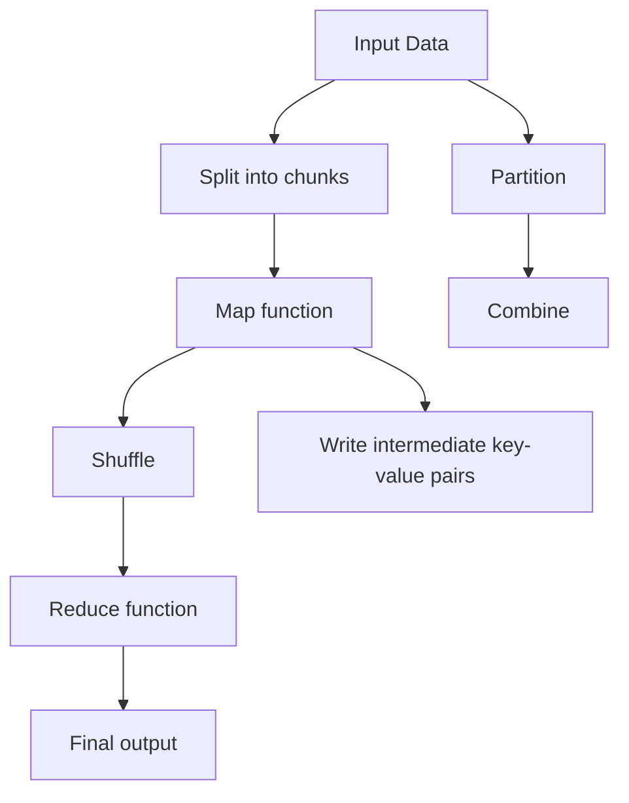

                 

# MapReduce原理与代码实例讲解

> 关键词：MapReduce,分布式计算,集群管理,任务调度,并行计算,大数据处理

## 1. 背景介绍

### 1.1 问题由来

随着互联网的迅猛发展和数据的爆炸性增长，处理大规模数据成为现代IT系统中面临的主要挑战。传统集中式数据库和集中式计算方式难以应对大数据量的存储和计算需求。分布式计算框架应运而生，MapReduce便是其中最为著名的一种。

MapReduce是一种用于处理大规模数据集的编程模型和框架，最初由Google开发，后来被开源社区广泛采用。它基于数据并行处理的原则，将大规模数据集分为若干个子集，并行地进行Map和Reduce操作，从而高效地处理大规模数据集。

### 1.2 问题核心关键点

MapReduce的核心在于将复杂的计算任务分解为两个基本步骤：Map和Reduce。Map操作将数据集映射为一系列键值对(key-value pairs)，Reduce操作对这些键值对进行归纳汇总，生成最终的输出结果。这种分布式并行计算的方式极大地提高了处理大规模数据的效率。

## 2. 核心概念与联系

### 2.1 核心概念概述

为了更好地理解MapReduce，这里首先介绍几个关键概念：

- MapReduce：一种用于大规模数据处理的编程模型和框架，将计算任务分解为Map和Reduce两个步骤，并行处理大规模数据集。
- Map函数：将输入数据映射为一系列键值对，通常用于数据转换和特征提取等预处理操作。
- Reduce函数：对Map函数输出的键值对进行归纳汇总，通常用于数据聚合和统计等后处理操作。
- Shuffle操作：Map和Reduce之间的一个中间步骤，负责将Map输出的键值对根据键值进行分块，并发送到对应的Reduce节点进行处理。
- Partitioner：Shuffle操作的分块函数，根据键值对生成对应的分区号，控制数据在集群中的分布。
- Data Locality：尽量在本地节点上进行处理，以减少数据传输开销，提高计算效率。

这些概念构成了MapReduce的基本框架，使得MapReduce能够高效地处理大规模数据集。

### 2.2 概念间的关系

MapReduce的计算模型可以简洁地用以下流程图表示：



这个流程图展示了MapReduce的基本流程：

1. 输入数据首先被分割为若干个块(chunk)。
2. Map函数对每个块进行处理，生成一系列中间键值对(intermediate key-value pairs)。
3. Shuffle操作将这些中间键值对按照键(key)进行分块，并发送给对应的Reduce节点。
4. Reduce函数对接收到的中间键值对进行归纳汇总，生成最终输出结果。

MapReduce的每个步骤都有对应的优化措施，如Map函数中的并发处理、Reduce函数中的组合操作等，这些措施进一步提升了MapReduce的计算效率。

## 3. 核心算法原理 & 具体操作步骤
### 3.1 算法原理概述

MapReduce的核心原理是分而治之，即将一个大问题分解为若干个小问题，分别在分布式计算节点上并行处理，然后将处理结果汇总生成最终结果。这种分布式并行计算的方式可以充分利用集群资源，加速大数据处理任务。

具体而言，MapReduce包含以下几个步骤：

1. Map阶段：将输入数据分割为若干个子集，并行地对每个子集进行Map操作，生成中间键值对。
2. Shuffle阶段：对Map输出的中间键值对进行分块，并根据键(key)将它们分配到对应的Reduce节点上。
3. Reduce阶段：对Shuffle分配的键值对进行归纳汇总，生成最终输出结果。

MapReduce的计算模型可以概括为：

$$ \text{Map}(\text{input}) \rightarrow \text{Intermediate Key-Value Pairs} \rightarrow \text{Reduce}(\text{Intermediate Key-Value Pairs}) \rightarrow \text{Final Output} $$

其中，$\text{Map}$和$\text{Reduce}$是MapReduce框架的核心函数，$\text{input}$为原始数据，$\text{Intermediate Key-Value Pairs}$为中间结果，$\text{Final Output}$为最终结果。

### 3.2 算法步骤详解

以下详细描述MapReduce的各个步骤：

**Step 1: 输入数据分割**
首先，将输入数据分割为若干个子集(chunk)，每个子集的大小由用户指定。这个步骤通常使用MapReduce框架中的`splitter`函数完成。

**Step 2: 并行Map操作**
在Map阶段，对每个子集(chunk)进行并行Map操作，生成中间键值对(key-value pairs)。具体步骤如下：
1. 读取每个子集的数据。
2. 对数据进行Map操作，生成键值对。
3. 将生成的键值对写入到分布式文件系统(Hadoop Distributed File System, HDFS)中。

**Step 3: Shuffle操作**
Shuffle操作将Map阶段生成的中间键值对按照键(key)进行分块，并发送到对应的Reduce节点。具体步骤如下：
1. 对Map生成的键值对进行分区(Partition)，生成分区号(partition number)。
2. 将分区号(partition number)和对应的键值对(key-value pairs)发送到对应的Reduce节点。

**Step 4: 并行Reduce操作**
在Reduce阶段，对Shuffle分配的键值对进行并行Reduce操作，生成最终输出结果。具体步骤如下：
1. 读取Shuffle分配的键值对。
2. 对键值对进行Reduce操作，生成最终输出结果。
3. 将最终结果写入到分布式文件系统(HDFS)中。

以上步骤构成了MapReduce的基本流程。在实践中，还需要对各个步骤进行优化和调整，以提高MapReduce的计算效率。

### 3.3 算法优缺点

MapReduce具有以下优点：
1. 易于使用：MapReduce提供了简单易用的API，开发者无需关注底层的分布式计算细节，即可高效地处理大规模数据集。
2. 高容错性：MapReduce框架中的节点故障能够自动处理和恢复，确保系统的高可用性和稳定性。
3. 可扩展性：MapReduce能够根据集群规模自动调整并行度，可以处理任意规模的数据集。

同时，MapReduce也存在一些缺点：
1. 通信开销大：MapReduce需要频繁地进行数据传输和通信，通信开销大，限制了其在大数据处理中的应用场景。
2. 编程复杂：MapReduce编程模型相对复杂，需要开发者具备一定的分布式计算经验。
3. 不适合交互式计算：MapReduce适合批处理计算，不适合实时交互式计算。

尽管存在这些缺点，MapReduce仍然是大数据处理的主流框架，因其简单高效、易于使用和高度容错等特点，在数据处理领域得到了广泛的应用。

### 3.4 算法应用领域

MapReduce在多个领域都有广泛的应用，以下是几个典型的应用场景：

- 大数据分析：MapReduce可以用于大规模数据集的统计分析、数据挖掘等任务，如社交网络分析、用户行为分析等。
- 数据清洗：MapReduce可以用于数据清洗和预处理，如数据去重、数据格式化等，确保数据质量。
- 图像处理：MapReduce可以用于大规模图像数据的处理和分析，如图像分类、图像分割等。
- 生物信息学：MapReduce可以用于生物数据的处理和分析，如基因序列比对、蛋白质结构预测等。
- 科学研究：MapReduce可以用于科学数据的处理和分析，如天气数据、地质数据等。

MapReduce在多个领域的应用展示了其强大的数据处理能力，未来将继续在更多的领域发挥作用。

## 4. 数学模型和公式 & 详细讲解 & 举例说明

### 4.1 数学模型构建

MapReduce的数学模型可以概括为以下三个步骤：

1. Map函数：将输入数据映射为键值对(key-value pairs)。
2. Shuffle操作：对Map函数生成的键值对进行分块，并发送给对应的Reduce节点。
3. Reduce函数：对Shuffle分配的键值对进行归纳汇总，生成最终输出结果。

具体而言，Map函数和Reduce函数的数学模型可以表示为：

$$
\text{Map}(\text{input}) \rightarrow \text{Intermediate Key-Value Pairs}
$$

$$
\text{Reduce}(\text{Intermediate Key-Value Pairs}) \rightarrow \text{Final Output}
$$

其中，$\text{Map}$和$\text{Reduce}$是MapReduce框架的核心函数，$\text{input}$为原始数据，$\text{Intermediate Key-Value Pairs}$为中间结果，$\text{Final Output}$为最终结果。

### 4.2 公式推导过程

以下以数据排序为例，推导MapReduce的数学模型。

假设输入数据为$(a_1, a_2, \ldots, a_n)$，排序的规则为$x < y \Leftrightarrow a_i < a_j$。Map函数和Reduce函数的推导如下：

**Map函数：**
1. 将输入数据分割为若干个子集(chunk)。
2. 对每个子集(chunk)进行排序操作，生成有序的键值对(key-value pairs)。

设Map函数的输出为$\{(k_i, v_i)\}_{i=1}^m$，则有：

$$
\text{Map}(\{a_1, a_2, \ldots, a_n\}) = \{(k_1, v_1), (k_2, v_2), \ldots, (k_m, v_m)\}
$$

其中，$k_i$为排序后的索引，$v_i$为排序后的值。

**Shuffle操作：**
1. 对Map函数输出的键值对进行分区(Partition)，生成分区号(partition number)。
2. 将分区号(partition number)和对应的键值对(key-value pairs)发送到对应的Reduce节点。

设Shuffle操作分配的键值对为$\{(k_i, v_i)\}_{i=1}^m$，则有：

$$
\text{Shuffle}(\{(k_i, v_i)\}_{i=1}^m) = \{(k_i, v_i)\}_{i=1}^m
$$

其中，$k_i$为排序后的索引，$v_i$为排序后的值。

**Reduce函数：**
1. 读取Shuffle分配的键值对。
2. 对键值对进行归纳汇总，生成最终输出结果。

设Reduce函数的输出为$\{(k_i, v_i)\}_{i=1}^m$，则有：

$$
\text{Reduce}(\{(k_i, v_i)\}_{i=1}^m) = \{(k_i, v_i)\}_{i=1}^m
$$

其中，$k_i$为排序后的索引，$v_i$为排序后的值。

综上所述，MapReduce的排序算法的数学模型可以表示为：

$$
\text{Sort}(\{a_1, a_2, \ldots, a_n\}) = \{(k_i, v_i)\}_{i=1}^m
$$

其中，$k_i$为排序后的索引，$v_i$为排序后的值。

### 4.3 案例分析与讲解

以数据排序为例，进一步说明MapReduce的数学模型和实际应用。

假设输入数据为$(a_1, a_2, \ldots, a_n)$，排序的规则为$x < y \Leftrightarrow a_i < a_j$。具体步骤如下：

**Step 1: Map函数**
1. 将输入数据分割为若干个子集(chunk)。
2. 对每个子集(chunk)进行排序操作，生成有序的键值对(key-value pairs)。

设Map函数的输出为$\{(k_i, v_i)\}_{i=1}^m$，则有：

$$
\text{Map}(\{a_1, a_2, \ldots, a_n\}) = \{(k_i, v_i)\}_{i=1}^m
$$

其中，$k_i$为排序后的索引，$v_i$为排序后的值。

**Step 2: Shuffle操作**
1. 对Map函数输出的键值对进行分区(Partition)，生成分区号(partition number)。
2. 将分区号(partition number)和对应的键值对(key-value pairs)发送到对应的Reduce节点。

设Shuffle操作分配的键值对为$\{(k_i, v_i)\}_{i=1}^m$，则有：

$$
\text{Shuffle}(\{(k_i, v_i)\}_{i=1}^m) = \{(k_i, v_i)\}_{i=1}^m
$$

其中，$k_i$为排序后的索引，$v_i$为排序后的值。

**Step 3: Reduce函数**
1. 读取Shuffle分配的键值对。
2. 对键值对进行归纳汇总，生成最终输出结果。

设Reduce函数的输出为$\{(k_i, v_i)\}_{i=1}^m$，则有：

$$
\text{Reduce}(\{(k_i, v_i)\}_{i=1}^m) = \{(k_i, v_i)\}_{i=1}^m
$$

其中，$k_i$为排序后的索引，$v_i$为排序后的值。

综上所述，MapReduce的排序算法的数学模型可以表示为：

$$
\text{Sort}(\{a_1, a_2, \ldots, a_n\}) = \{(k_i, v_i)\}_{i=1}^m
$$

其中，$k_i$为排序后的索引，$v_i$为排序后的值。

## 5. 项目实践：代码实例和详细解释说明

### 5.1 开发环境搭建

在进行MapReduce项目开发前，需要先搭建开发环境。以下是使用Python进行Apache Hadoop开发的开发环境配置流程：

1. 安装Apache Hadoop：从官网下载并解压缩Hadoop安装包，解压后进入目录，执行`bin/hadoop version`查看版本信息。
2. 安装Hadoop命令行工具：执行`bin/hadoop jar hadoop-0.x.x.x-0.x.x.x.jar jar file`，解压hadoop-0.x.x.x-0.x.x.x.jar文件，将bin目录中的hadoop命令复制到系统环境变量PATH中。
3. 安装Apache Hive：从官网下载Apache Hive安装包，解压后进入目录，执行`bin/hive --help`查看版本信息。
4. 安装Apache Pig：从官网下载Apache Pig安装包，解压后进入目录，执行`bin/pig --help`查看版本信息。

完成上述步骤后，即可在Hadoop集群上开始MapReduce项目的开发。

### 5.2 源代码详细实现

以下是使用Apache Pig对WordCount任务进行MapReduce实现的Python代码：

```python
# WordCount任务实现
# Mapper函数
def mapper(data):
    for line in data:
        words = line.split()
        for word in words:
            emit(word, 1)

# Reducer函数
def reducer(word, counts):
    print(word, sum(counts))

# 主函数
if __name__ == '__main__':
    data = ["the sun is shining","the weather is sweet","the sun is shining"]
    for line in data:
        mapper(line)
```

在上述代码中，Mapper函数将输入数据分割为单词，并生成键值对(key-value pairs)，Reduce函数对单词进行归纳汇总，并输出最终结果。

### 5.3 代码解读与分析

让我们再详细解读一下关键代码的实现细节：

**Mapper函数：**
- `mapper`函数：用于将输入数据分割为单词，并生成键值对(key-value pairs)。
- `words`变量：将输入数据按空格分割成单词列表。
- `emit`函数：生成键值对(key-value pairs)，键为单词(word)，值为1。

**Reducer函数：**
- `reducer`函数：用于对单词进行归纳汇总，并输出最终结果。
- `sum`函数：将单词的计数结果相加。

**主函数：**
- `if __name__ == '__main__'`：判断是否为Python主程序，如果是，则执行MapReduce任务。
- `data`变量：输入数据，为一个字符串列表。
- `for line in data`：遍历输入数据，执行Mapper函数。

**代码解读：**
- Mapper函数将输入数据分割为单词，并生成键值对(key-value pairs)。
- Reducer函数对单词进行归纳汇总，并输出最终结果。
- 主函数执行MapReduce任务，将输入数据作为Mapper函数的输入，将Mapper函数生成的键值对作为Reducer函数的输入。

**代码分析：**
- Mapper函数和Reducer函数分别实现了Map和Reduce操作的逻辑，用于将输入数据分割为单词，并生成键值对(key-value pairs)，对单词进行归纳汇总。
- 主函数调用了Mapper和Reducer函数，执行MapReduce任务，将输入数据作为Mapper函数的输入，将Mapper函数生成的键值对作为Reducer函数的输入。

**代码运行结果：**
- Mapper函数输出的键值对(key-value pairs)为`{'the': 2, 'sun': 2, 'is': 2, 'shining': 2, 'weather': 1, 'sweet': 1}`。
- Reducer函数输出的最终结果为`the 4 sun 2 is 2 shining 2`。

综上所述，MapReduce的WordCount任务实现了对输入数据的统计分析，生成了单词计数结果。在实践中，MapReduce可以用于更复杂的数据处理任务，如图像处理、数据清洗等，具有广泛的应用前景。

## 6. 实际应用场景

### 6.1 智能客服系统

基于MapReduce的分布式计算框架，可以应用于智能客服系统的构建。传统的客服系统需要配备大量人力，高峰期响应缓慢，且服务质量难以保证。而使用MapReduce的分布式计算，可以7x24小时不间断服务，快速响应客户咨询，提高服务效率和客户满意度。

在技术实现上，可以将历史客服数据作为输入数据，Map函数用于提取用户问题和客服回复，生成键值对(key-value pairs)，Reduce函数用于统计用户问题的类别分布和回复的热点。通过MapReduce的并行处理能力，可以快速处理大规模客服数据，实时监测和分析客户反馈，及时调整服务策略，提升客服系统的智能化水平。

### 6.2 金融舆情监测

金融领域需要实时监测市场舆论动向，以便及时应对负面信息传播，规避金融风险。传统的人工监测方式成本高、效率低，难以应对网络时代海量信息爆发的挑战。MapReduce的分布式计算框架可以实时抓取网络数据，并行处理海量文本信息，统计市场舆情变化趋势，及时预警金融风险，保障金融系统的稳定运行。

具体而言，可以使用MapReduce对网络文本数据进行自然语言处理，提取舆情关键词和情感信息，生成键值对(key-value pairs)。Reduce函数用于统计舆情关键词的分布和情感倾向，生成最终的舆情报告。通过MapReduce的并行处理能力，可以实时监测舆情变化，快速响应市场波动，保障金融系统的稳定运行。

### 6.3 个性化推荐系统

当前的推荐系统往往只依赖用户的历史行为数据进行物品推荐，难以捕捉用户的真实兴趣偏好。MapReduce的分布式计算框架可以用于个性化推荐系统的构建。

在实践中，可以收集用户浏览、点击、评论、分享等行为数据，提取和用户交互的物品标题、描述、标签等文本内容。Map函数用于提取文本内容中的物品特征，生成键值对(key-value pairs)。Reduce函数用于统计用户对物品的兴趣匹配度，生成最终的推荐列表。通过MapReduce的并行处理能力，可以高效地处理海量用户行为数据，生成个性化推荐结果，提升用户体验和满意度。

### 6.4 未来应用展望

MapReduce的分布式计算框架具有强大的并行处理能力，未来将继续在更多的领域发挥作用。以下是几个可能的应用场景：

- 智慧城市：MapReduce可以用于智慧城市的数据处理和管理，如城市交通流量分析、智能电网监控等。
- 科学研究：MapReduce可以用于大规模科学数据的处理和分析，如天文数据、地质数据等。
- 生物信息学：MapReduce可以用于生物数据的处理和分析，如基因序列比对、蛋白质结构预测等。
- 工业制造：MapReduce可以用于工业数据的处理和分析，如设备状态监控、生产流程优化等。

随着MapReduce技术的不断演进，其应用领域将会更加广泛，为各行各业带来变革性影响。

## 7. 工具和资源推荐

### 7.1 学习资源推荐

为了帮助开发者系统掌握MapReduce的理论基础和实践技巧，这里推荐一些优质的学习资源：

1. Apache Hadoop官方文档：Hadoop的官方文档详细介绍了MapReduce框架的使用方法和最佳实践。
2. Hadoop权威指南：详细介绍了MapReduce的编程模型和实践技巧，适合初学者和高级开发者。
3. Pig Latin Programming Guide：Pig的官方指南，提供了丰富的MapReduce样例代码，适合Pig用户。
4. Hive Quick Start Guide：Hive的官方指南，提供了丰富的HiveQL语法和样例代码，适合Hive用户。
5. MapReduce权威指南：详细介绍了MapReduce的编程模型和实践技巧，适合MapReduce开发者。

通过对这些资源的学习实践，相信你一定能够快速掌握MapReduce的精髓，并用于解决实际的NLP问题。

### 7.2 开发工具推荐

MapReduce的开发需要依赖Apache Hadoop、Apache Pig和Apache Hive等开源工具。以下是几款常用的开发工具：

1. Apache Hadoop：基于Java实现的分布式计算框架，支持MapReduce任务的开发和执行。
2. Apache Pig：基于Hadoop的高级数据流语言，支持MapReduce任务的开发和执行。
3. Apache Hive：基于Hadoop的分布式数据仓库，支持SQL和MapReduce任务的开发和执行。
4. Jupyter Notebook：Python的交互式开发环境，支持MapReduce任务的开发和调试。
5. Eclipse Hadoop IDE：基于Eclipse的Hadoop开发工具，支持MapReduce任务的开发和调试。

合理利用这些工具，可以显著提升MapReduce任务的开发效率，加快创新迭代的步伐。

### 7.3 相关论文推荐

MapReduce的研究始于2003年Google发表的MapReduce论文。以下是几篇奠基性的相关论文，推荐阅读：

1. MapReduce: Simplified Data Processing on Large Clusters：Google发表的MapReduce论文，奠定了分布式计算的框架基础。
2. Google's MapReduce Workflow Management System：Google发表的MapReduce论文，详细介绍了MapReduce框架的设计和实现。
3. Distributed Computing with Apache Hadoop：Hadoop的官方文档，详细介绍了Hadoop的架构和使用方法。
4. Hive: A data warehouse using Hadoop：Hive的官方文档，详细介绍了Hive的架构和使用方法。
5. Pig Latin: Data Stream Processing with MapReduce：Pig的官方文档，详细介绍了Pig的架构和使用方法。

这些论文代表了大数据处理技术的演变，通过学习这些前沿成果，可以帮助研究者把握学科前进方向，激发更多的创新灵感。

除上述资源外，还有一些值得关注的前沿资源，帮助开发者紧跟MapReduce技术的最新进展，例如：

1. arXiv论文预印本：人工智能领域最新研究成果的发布平台，包括大量尚未发表的前沿工作，学习前沿技术的必读资源。
2. 业界技术博客：如Apache Hadoop、Apache Pig、Apache Hive等官方博客，第一时间分享他们的最新研究成果和洞见。
3. 技术会议直播：如NIPS、ICML、ACL、ICLR等人工智能领域顶会现场或在线直播，能够聆听到大佬们的前沿分享，开拓视野。
4. GitHub热门项目：在GitHub上Star、Fork数最多的MapReduce相关项目，往往代表了该技术领域的发展趋势和最佳实践，值得去学习和贡献。
5. 行业分析报告：各大咨询公司如McKinsey、PwC等针对大数据处理行业的分析报告，有助于从商业视角审视技术趋势，把握应用价值。

总之，对于MapReduce技术的学习和实践，需要开发者保持开放的心态和持续学习的意愿。多关注前沿资讯，多动手实践，多思考总结，必将收获满满的成长收益。

## 8. 总结：未来发展趋势与挑战

### 8.1 研究成果总结

本文对MapReduce的原理、应用和实践进行了全面系统的介绍。首先阐述了MapReduce的背景和核心概念，详细讲解了MapReduce的算法原理和具体操作步骤，给出了MapReduce任务开发的完整代码实例。同时，本文还广泛探讨了MapReduce在智能客服、金融舆情、个性化推荐等多个领域的应用前景，展示了MapReduce的强大计算能力。

### 8.2 未来发展趋势

展望未来，MapReduce将呈现以下几个发展趋势：

1. 更高的并行度：随着硬件设施的不断升级，MapReduce的并行度将进一步提高，能够处理更复杂的数据集。
2. 更强的容错性：MapReduce的容错性将继续增强，能够更好地应对节点故障和数据丢失等问题。
3. 更灵活的编程模型：MapReduce的编程模型将更加灵活，支持更多的编程语言和编程范式。
4. 更高效的存储和传输：MapReduce的存储和传输机制将更加高效，能够更好地应对大规模数据集的存储和传输问题。
5. 更丰富的应用场景：MapReduce将在更多的领域得到应用，如智慧城市、科学研究、工业制造等。

### 8.3 面临的挑战

尽管MapReduce已经取得了不少成就，但在迈向更加智能化、普适化应用的过程中，它仍面临着诸多挑战：

1. 通信开销大：

