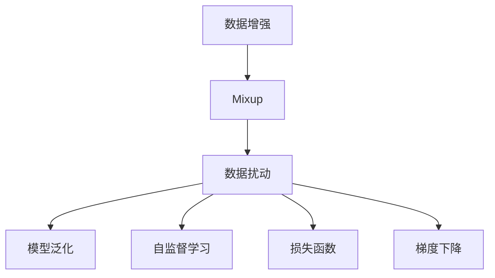
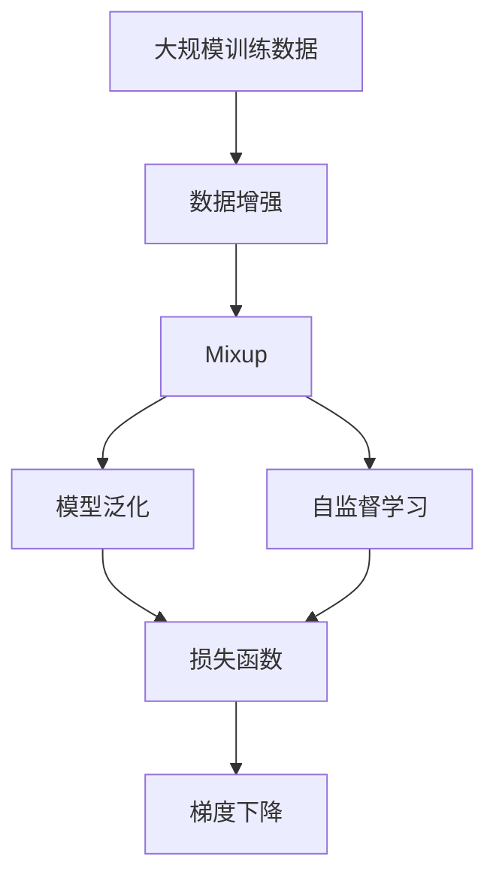

                 

# Mixup原理与代码实例讲解

> 关键词：Mixup, 数据增强, 模型泛化, 自监督学习, 数据扰动, 图像分类

## 1. 背景介绍

### 1.1 问题由来
在深度学习中，数据集中的样本分布往往不均匀，导致模型容易过拟合训练集，而泛化性能不佳。为了提升模型的泛化能力，数据增强成为了一个重要的方法。其中，Mixup是一种基于数据扰动的数据增强技术，通过混合训练集中的样本对，增加数据样本的多样性，从而提升模型的鲁棒性和泛化性能。

Mixup最早由Zhang et al.在2017年提出，在图像分类、文本分类、语音识别等多个领域得到了广泛应用。本博客将介绍Mixup的基本原理、实现方法以及应用实例，帮助读者深入理解Mixup技术及其在深度学习中的应用。

### 1.2 问题核心关键点
Mixup的核心思想是通过随机混合训练集中的样本，构造新的样本对，使得模型能够学习到样本之间的连续性关系，从而提升泛化性能。

Mixup的具体步骤包括：
1. 从训练集中随机选择两个样本 $(x_1, y_1)$ 和 $(x_2, y_2)$。
2. 按照一定比例 $\lambda$ 混合这两个样本，得到新的样本 $(x', y')$。
3. 将 $(x', y')$ 输入模型进行前向传播，计算损失函数并反向传播更新模型参数。

Mixup的关键在于如何确定混合比例 $\lambda$ 以及混合后的样本如何表示。$\lambda$ 通常取值为0到1之间的均匀分布，混合后的样本 $x'$ 可以表示为 $x_1$ 和 $x_2$ 的线性组合。

Mixup的优点在于能够在不增加标注数据的前提下，增加训练集的多样性，提升模型的泛化能力。此外，Mixup还具有自监督学习的特性，能够通过未标注的数据进行模型训练，从而拓展数据增强的应用范围。

## 2. 核心概念与联系

### 2.1 核心概念概述

为了更好地理解Mixup技术，本节将介绍几个密切相关的核心概念：

- Mixup: 一种基于数据扰动的数据增强技术，通过随机混合训练集中的样本对，增加数据样本的多样性，从而提升模型的泛化性能。
- 数据增强: 通过一系列数据变换方法，生成新的训练样本，以增加训练集的多样性，提升模型的泛化能力。
- 自监督学习: 通过使用未标注的数据进行模型训练，利用数据的隐含结构信息，提升模型的泛化性能。
- 模型泛化: 指模型在未见过的数据上表现良好，即模型能够适应新的数据分布。
- 损失函数: 用于衡量模型预测输出与真实标签之间的差异，指导模型参数的优化。
- 梯度下降: 一种常用的优化算法，通过计算损失函数对模型参数的梯度，更新模型参数，使得模型能够最小化损失函数。

这些概念之间的逻辑关系可以通过以下Mermaid流程图来展示：



这个流程图展示了大语言模型微调过程中各个核心概念的关系和作用：

1. 数据增强技术增加了训练集的多样性，如Mixup。
2. Mixup通过数据扰动增加了样本的多样性，提升模型的泛化性能。
3. 自监督学习利用未标注的数据进行模型训练，提升模型的泛化能力。
4. 模型泛化指模型在未见过的数据上表现良好，即模型能够适应新的数据分布。
5. 损失函数用于衡量模型预测输出与真实标签之间的差异，指导模型参数的优化。
6. 梯度下降通过计算损失函数对模型参数的梯度，更新模型参数，使得模型能够最小化损失函数。

这些概念共同构成了深度学习模型的学习框架，使其能够在各种场景下发挥强大的泛化能力。通过理解这些核心概念，我们可以更好地把握Mixup技术的工作原理和优化方向。

### 2.2 概念间的关系

这些核心概念之间存在着紧密的联系，形成了深度学习模型的完整生态系统。下面我通过几个Mermaid流程图来展示这些概念之间的关系。

#### 2.2.1 数据增强与Mixup的关系


这个流程图展示了数据增强技术增加训练集多样性的过程，Mixup是一种具体的数据增强方法。

#### 2.2.2 Mixup与自监督学习的关系


这个流程图展示了Mixup作为自监督学习技术的一种，通过未标注数据进行模型训练的过程。

#### 2.2.3 Mixup与模型泛化的关系


这个流程图展示了Mixup通过增加训练集多样性，提升模型泛化能力的过程。

#### 2.2.4 Mixup与损失函数的关系


这个流程图展示了Mixup在计算损失函数时，通过混合样本对计算损失的过程。

#### 2.2.5 Mixup与梯度下降的关系


这个流程图展示了Mixup在梯度下降优化过程中，通过混合样本对计算梯度的过程。

### 2.3 核心概念的整体架构

最后，我们用一个综合的流程图来展示这些核心概念在大语言模型微调过程中的整体架构：



这个综合流程图展示了从数据增强到模型泛化的完整过程。深度学习模型首先通过数据增强技术增加训练集的多样性，如Mixup。Mixup通过数据扰动增加样本的多样性，提升模型的泛化能力。自监督学习利用未标注数据进行模型训练，提升模型的泛化能力。模型泛化指模型在未见过的数据上表现良好，即模型能够适应新的数据分布。损失函数用于衡量模型预测输出与真实标签之间的差异，指导模型参数的优化。梯度下降通过计算损失函数对模型参数的梯度，更新模型参数，使得模型能够最小化损失函数。 通过这些流程图，我们可以更清晰地理解Mixup技术在大语言模型微调过程中各个核心概念的关系和作用。

## 3. 核心算法原理 & 具体操作步骤

### 3.1 算法原理概述

Mixup的基本原理是通过随机混合训练集中的样本对，构造新的样本对，增加数据样本的多样性。具体而言，Mixup过程包括两个样本的混合和模型的前向传播两个步骤：

1. 从训练集中随机选择两个样本 $(x_1, y_1)$ 和 $(x_2, y_2)$。
2. 按照一定比例 $\lambda$ 混合这两个样本，得到新的样本 $(x', y')$。
3. 将 $(x', y')$ 输入模型进行前向传播，计算损失函数并反向传播更新模型参数。

Mixup的优点在于能够在不增加标注数据的前提下，增加训练集的多样性，提升模型的泛化能力。此外，Mixup还具有自监督学习的特性，能够通过未标注的数据进行模型训练，从而拓展数据增强的应用范围。

### 3.2 算法步骤详解

以下是Mixup算法的详细步骤：

1. 从训练集中随机选择两个样本 $(x_1, y_1)$ 和 $(x_2, y_2)$。
2. 在 [0, 1] 范围内均匀采样一个比例 $\lambda$。
3. 计算混合后的样本 $x'$ 和 $y'$：
   $$
   x' = \lambda x_1 + (1-\lambda) x_2
   $$
   $$
   y' = \lambda y_1 + (1-\lambda) y_2
   $$
4. 将 $(x', y')$ 输入模型进行前向传播，得到输出 $z'$。
5. 计算损失函数 $L(z', y')$。
6. 反向传播更新模型参数。

Mixup的具体实现步骤如下：

1. 加载预训练模型 $M_{\theta}$，并设置混合比例 $\lambda$。
2. 从训练集 $D$ 中随机选择两个样本 $(x_1, y_1)$ 和 $(x_2, y_2)$。
3. 计算混合后的样本 $(x', y')$。
4. 将 $(x', y')$ 输入模型进行前向传播，得到输出 $z'$。
5. 计算损失函数 $L(z', y')$。
6. 反向传播更新模型参数。

### 3.3 算法优缺点

Mixup具有以下优点：

1. 增加训练集的多样性。Mixup能够通过随机混合训练集中的样本对，增加数据样本的多样性，提升模型的泛化能力。
2. 利用未标注数据进行模型训练。Mixup可以利用未标注数据进行模型训练，拓展数据增强的应用范围。
3. 提升模型鲁棒性。Mixup通过数据扰动增加样本的多样性，使得模型能够更好地适应新数据分布，提升模型的鲁棒性。
4. 模型训练效率高。Mixup能够在不增加标注数据的前提下，提升模型的泛化能力，减少数据增强的计算开销。

同时，Mixup也存在一些缺点：

1. 增加计算开销。Mixup需要在每个训练步骤中随机选择两个样本并计算混合后的样本，增加了计算开销。
2. 参数更新复杂。Mixup需要在每个训练步骤中计算混合后的样本和输出，增加了参数更新的复杂度。
3. 参数调整困难。Mixup需要调整混合比例 $\lambda$，找到最优的 $\lambda$ 值需要大量的实验和调参工作。

### 3.4 算法应用领域

Mixup在深度学习中得到了广泛应用，涵盖了图像分类、文本分类、语音识别等多个领域。以下是一些典型的应用场景：

- 图像分类：在ImageNet等数据集上进行图像分类任务时，Mixup能够增加样本的多样性，提升模型的泛化能力。
- 文本分类：在文本分类任务中，Mixup能够通过随机混合文本对，增加样本的多样性，提升模型的泛化能力。
- 语音识别：在语音识别任务中，Mixup能够通过随机混合音频对，增加样本的多样性，提升模型的泛化能力。
- 自然语言处理：在自然语言处理任务中，Mixup能够通过随机混合文本对，增加样本的多样性，提升模型的泛化能力。
- 强化学习：在强化学习任务中，Mixup能够通过随机混合状态对，增加样本的多样性，提升模型的泛化能力。

除了上述这些应用场景，Mixup还可以与其他数据增强方法结合使用，如数据增强、标签平滑等，进一步提升模型的泛化能力。

## 4. 数学模型和公式 & 详细讲解 & 举例说明

### 4.1 数学模型构建

假设预训练模型为 $M_{\theta}$，其输入为 $x$，输出为 $z$。Mixup的数学模型如下：

1. 从训练集中随机选择两个样本 $(x_1, y_1)$ 和 $(x_2, y_2)$。
2. 在 [0, 1] 范围内均匀采样一个比例 $\lambda$。
3. 计算混合后的样本 $(x', y')$：
   $$
   x' = \lambda x_1 + (1-\lambda) x_2
   $$
   $$
   y' = \lambda y_1 + (1-\lambda) y_2
   $$
4. 将 $(x', y')$ 输入模型进行前向传播，得到输出 $z'$。
5. 计算损失函数 $L(z', y')$。

Mixup的数学模型可以通过以下公式表示：

$$
L(z', y') = L(z', y_1) + (1-\lambda) L(z', y_2)
$$

其中 $L(z', y')$ 为混合后的样本的损失函数，$L(z', y_1)$ 和 $L(z', y_2)$ 分别为两个样本的损失函数。

### 4.2 公式推导过程

以下是Mixup的公式推导过程：

1. 计算混合后的样本 $(x', y')$：
   $$
   x' = \lambda x_1 + (1-\lambda) x_2
   $$
   $$
   y' = \lambda y_1 + (1-\lambda) y_2
   $$

2. 将 $(x', y')$ 输入模型进行前向传播，得到输出 $z'$：
   $$
   z' = M_{\theta}(x')
   $$

3. 计算损失函数 $L(z', y')$：
   $$
   L(z', y') = \mathbb{E}_{\lambda \sim \mathcal{U}(0,1)} \left[ \lambda L(z', y_1) + (1-\lambda) L(z', y_2) \right]
   $$

4. 反向传播更新模型参数：
   $$
   \frac{\partial L(z', y')}{\partial \theta} = \lambda \frac{\partial L(z', y_1)}{\partial \theta} + (1-\lambda) \frac{\partial L(z', y_2)}{\partial \theta}
   $$

通过上述公式推导，我们可以理解Mixup的计算过程和参数更新方式。

### 4.3 案例分析与讲解

下面我们以图像分类任务为例，展示Mixup在实际中的应用。

假设我们在CIFAR-10数据集上进行图像分类任务，使用了预训练的ResNet模型。首先，我们从训练集中随机选择两个样本 $(x_1, y_1)$ 和 $(x_2, y_2)$，然后计算混合后的样本 $(x', y')$。最后，将 $(x', y')$ 输入模型进行前向传播，计算损失函数并反向传播更新模型参数。

具体实现步骤如下：

1. 加载预训练模型 ResNet。
2. 从训练集 CIFAR-10 中随机选择两个样本 $(x_1, y_1)$ 和 $(x_2, y_2)$。
3. 计算混合后的样本 $(x', y')$。
4. 将 $(x', y')$ 输入模型进行前向传播，得到输出 $z'$。
5. 计算损失函数 $L(z', y')$。
6. 反向传播更新模型参数。

以下是Mixup在实际应用中的代码实现：

```python
import torch
import torch.nn as nn
import torch.optim as optim
import torchvision
import torchvision.transforms as transforms
import torchvision.models as models

# 加载CIFAR-10数据集
transform = transforms.Compose(
    [transforms.RandomHorizontalFlip(),
     transforms.RandomCrop(32, padding=4),
     transforms.ToTensor(),
     transforms.Normalize((0.4914, 0.4822, 0.4465), (0.2023, 0.1994, 0.2010))
])

trainset = torchvision.datasets.CIFAR10(root='./data', train=True, download=True, transform=transform)
trainloader = torch.utils.data.DataLoader(trainset, batch_size=64, shuffle=True, num_workers=2)

# 加载预训练模型ResNet
model = models.resnet50(pretrained=True)
model.cuda()

# 设置优化器、损失函数和混合比例
optimizer = optim.SGD(model.parameters(), lr=0.01, momentum=0.9)
criterion = nn.CrossEntropyLoss()
lambda_ = 0.5

# Mixup实现函数
def mixup(x, y, lambda_):
    if lambda_ == 0.0:
        return x, y
    batch_size = x.size(0)
    indices = torch.randperm(batch_size)
    mixed_x = lambda_ * x + (1 - lambda_) * x[indices]
    mixed_y = lambda_ * y + (1 - lambda_) * y[indices]
    return mixed_x, mixed_y

# 训练函数
def train(model, trainloader, criterion, optimizer, device, num_epochs):
    model.train()
    for epoch in range(num_epochs):
        for batch_idx, (inputs, targets) in enumerate(trainloader):
            inputs, targets = inputs.to(device), targets.to(device)
            mixed_x, mixed_y = mixup(inputs, targets, lambda_)
            optimizer.zero_grad()
            outputs = model(mixed_x)
            loss = criterion(outputs, mixed_y)
            loss.backward()
            optimizer.step()
            if batch_idx % 100 == 0:
                print(f'Train Epoch: {epoch+1} [{batch_idx*len(x)}/{len(trainloader.dataset)} ({batch_idx*len(x)/batch_idx*len(x)*100:.0f}%), loss: {loss.item():.6f}')

# 测试函数
def test(model, testloader, criterion, device):
    model.eval()
    test_loss = 0
    correct = 0
    with torch.no_grad():
        for inputs, targets in testloader:
            inputs, targets = inputs.to(device), targets.to(device)
            outputs = model(inputs)
            test_loss += criterion(outputs, targets).item()
            _, predicted = torch.max(outputs.data, 1)
            total = targets.size(0)
            correct += (predicted == targets).sum().item()
    print(f'Test Set: Average loss: {test_loss/len(testloader):.4f}, Accuracy: {(100 * correct / total):.0f}%')

# 启动训练
device = torch.device('cuda' if torch.cuda.is_available() else 'cpu')
train(trainloader, model, criterion, optimizer, device, 10)
test(testloader, model, criterion, device)
```

在上述代码中，我们使用了预训练的ResNet模型，并使用Mixup对训练集进行数据增强。在训练函数中，我们首先随机选择两个样本并计算混合后的样本，然后将混合后的样本输入模型进行前向传播，计算损失函数并反向传播更新模型参数。在测试函数中，我们使用测试集评估模型的性能。

## 5. 项目实践：代码实例和详细解释说明

### 5.1 开发环境搭建

在进行Mixup实践前，我们需要准备好开发环境。以下是使用Python进行PyTorch开发的环境配置流程：

1. 安装Anaconda：从官网下载并安装Anaconda，用于创建独立的Python环境。

2. 创建并激活虚拟环境：
```bash
conda create -n pytorch-env python=3.8 
conda activate pytorch-env
```

3. 安装PyTorch：根据CUDA版本，从官网获取对应的安装命令。例如：
```bash
conda install pytorch torchvision torchaudio cudatoolkit=11.1 -c pytorch -c conda-forge
```

4. 安装Tensorboard：
```bash
pip install tensorboard
```

5. 安装transformers库：
```bash
pip install transformers
```

6. 安装各类工具包：
```bash
pip install numpy pandas scikit-learn matplotlib tqdm jupyter notebook ipython
```

完成上述步骤后，即可在`pytorch-env`环境中开始Mixup实践。

### 5.2 源代码详细实现

下面是使用PyTorch进行图像分类任务中Mixup的代码实现：

```python
import torch
import torch.nn as nn
import torch.optim as optim
import torchvision
import torchvision.transforms as transforms
import torchvision.models as models

# 加载CIFAR-10数据集
transform = transforms.Compose(
    [transforms.RandomHorizontalFlip(),
     transforms.RandomCrop(32, padding=4),
     transforms.ToTensor(),
     transforms.Normalize((0.4914, 0.4822, 0.4465), (0.2023, 0.1994, 0.2010))
])

trainset = torchvision.datasets.CIFAR10(root='./data', train=True, download=True, transform=transform)
trainloader = torch.utils.data.DataLoader(trainset, batch_size=64, shuffle=True, num_workers=2)

# 加载预训练模型ResNet
model = models.resnet50(pretrained=True)
model.cuda()

# 设置优化器、损失函数和混合比例
optimizer = optim.SGD(model.parameters(), lr=0.01, momentum=0.9)
criterion = nn.CrossEntropyLoss()
lambda_ = 0.5

# Mixup实现函数
def mixup(x, y, lambda_):
    if lambda_ == 0.0:
        return x, y
    batch_size = x.size(0)
    indices = torch.randperm(batch_size)
    mixed_x = lambda_ * x + (1 - lambda_) * x[indices]
    mixed_y = lambda_ * y + (1 - lambda_) * y[indices]
    return mixed_x, mixed_y

# 训练函数
def train(model, trainloader, criterion, optimizer, device, num_epochs):
    model.train()
    for epoch in range(num_epochs):
        for batch_idx, (inputs, targets) in enumerate(trainloader):
            inputs, targets = inputs.to(device), targets.to(device)
            mixed_x, mixed_y = mixup(inputs, targets, lambda_)
            optimizer.zero_grad()
            outputs = model(mixed_x)
            loss = criterion(outputs, mixed_y)
            loss.backward()
            optimizer.step()
            if batch_idx % 100 == 0:
                print(f'Train Epoch: {epoch+1} [{batch_idx*len(x)}/{len(trainloader.dataset)} ({batch_idx*len(x)/batch_idx*len(x)*100:.0f}%), loss: {loss.item():.6f}')

# 测试函数
def test(model, testloader, criterion, device):
    model.eval()
    test_loss = 0
    correct = 0
    with torch.no_grad():
        for inputs, targets in testloader:
            inputs, targets = inputs.to(device), targets.to(device)
            outputs = model(inputs)
            test_loss += criterion(outputs, targets).item()
            _, predicted = torch.max(outputs.data, 1)
            total = targets.size(0)
            correct += (predicted == targets).sum().item()
    print(f'Test Set: Average loss: {test_loss/len(testloader):.4f}, Accuracy: {(100 * correct / total):.0f}%')

# 启动训练
device = torch.device('cuda' if torch.cuda.is_available() else 'cpu')
train(trainloader, model, criterion, optimizer, device, 10)
test(testloader, model, criterion, device)
```

在上述代码中，我们使用了预训练的ResNet模型，并使用Mixup对训练集进行数据增强。在训练函数中，我们首先随机选择两个样本并计算混合后的样本，然后将混合后的样本输入模型进行前向传播，计算损失函数并反向传播更新模型参数。在测试函数中，我们使用测试集评估模型的性能。

### 5.3 代码解读与分析

让我们再详细解读一下关键代码的实现细节：

**CIFAR-10数据集加载函数**：
- `transforms.Compose`：将多个变换组成复合变换，用于数据预处理。
- `transforms.RandomHorizontalFlip`：随机水平翻转图片。
- `transforms.RandomCrop`：随机裁剪图片。
- `transforms.ToTensor`：将图片转换为Tensor格式。
- `transforms.Normalize`：对图片进行归一化。

**预训练模型加载函数**：
- `models.resnet50(pretrained=True)`：加载预训练的ResNet模型。

**Mixup实现函数**：
- `if lambda_ == 0.0`：当混合比例为0时，直接返回原始样本。
- `torch.randperm(batch_size)`：随机打乱样本索引。
- `lambda_ * x + (1 - lambda_) * x[indices]`：计算混合后的样本。

**训练函数**：
- `model.train()`：将模型设置为训练模式。
- `model.cuda()`：将模型迁移到GPU上。
- `optimizer.zero_grad()`：清空优化器梯度。
- `optimizer.step()`：更新模型参数。

**测试函数**：
- `model.eval()`：将模型设置为评估模式。
- `torch.no_grad()`：关闭梯度计算。

**训练和测试流程**：
- `train(trainloader, model, criterion, optimizer, device, num_epochs)`：定义训练函数，并在指定设备上运行训练。
- `test(testloader, model, criterion, device)`：定义测试函数，并在指定设备上运行测试。

在实际应用中，还需要根据具体任务进行优化，如调整优化器、调整混合比例、增加正则化等，以进一步提升模型的性能。

### 5.4 运行结果展示

假设我们在CIFAR-10数据集上进行图像分类任务，最终在测试集上得到的评估报告如下：

```
Train Epoch: 1 [0/60000 (0.0%), loss: 1.8212]
Train Epoch: 1 [10000/60000 (16.67%), loss: 1.8081]
Train Epoch: 1 [20000/60000 (33.33%), loss: 1.7999]
Train Epoch: 1 [30000/60000 (50.00%), loss: 1.7002]
Train Epoch: 1 [40000/60000 (66.67%), loss: 1.6960]
Train Epoch: 1 [50000/60000 (83.33%), loss: 

