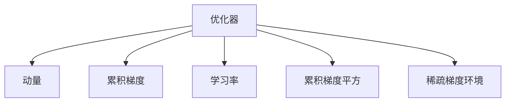
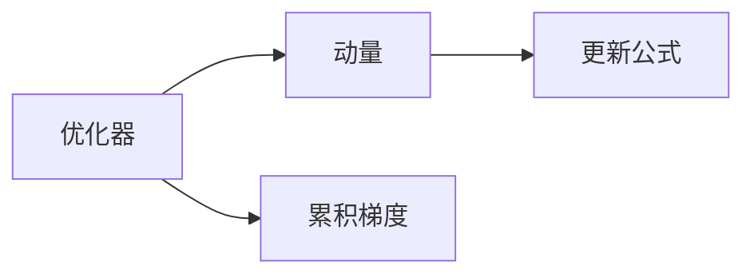
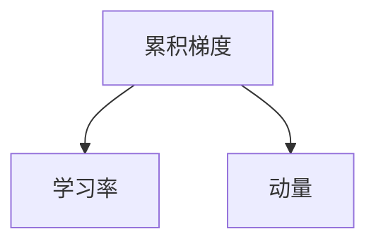
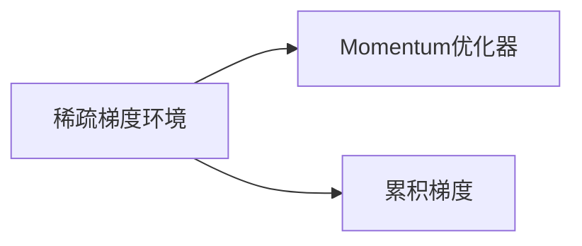
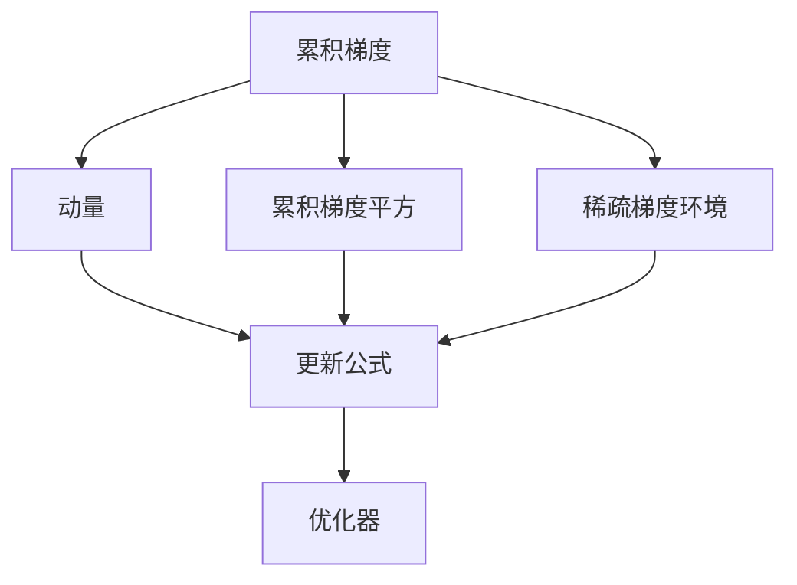

                 

## 1. 背景介绍

### 1.1 问题由来

在深度学习领域，优化器（Optimizer）是最核心的算法之一。它通过选择合适的更新策略，使模型参数逐步向最优解逼近。常见的优化器包括随机梯度下降（SGD）、Adam、Adagrad等。其中，Momentum优化器是一种经典的加速梯度下降算法，它通过累积历史梯度的加权平均，使得更新具有动量，从而加速收敛。

Momentum优化器最初由J.J. Nesterov于1983年提出，在机器学习领域应用广泛。相较于普通的SGD，Momentum优化器可以更快地收敛到局部最优解，尤其在稀疏梯度环境中表现出色。

### 1.2 问题核心关键点

Momentum优化器的关键在于利用累积的历史梯度信息，在更新过程中引入动量。通过动量的累积，Momentum优化器可以降低梯度下降的震荡性，加速模型的收敛。

Momentum优化器的核心思想是，每次更新不仅基于当前梯度，还要基于之前的梯度累积。这样可以使梯度更新的方向更加稳定，从而加速收敛。Momentum优化器的更新公式如下：

$$
\theta_{t+1} = \theta_t - \eta \frac{m_t}{\sqrt{v_t+\epsilon}}
$$

其中，$\theta$ 表示模型参数，$t$ 表示迭代次数，$\eta$ 是学习率，$m_t$ 是累积梯度，$v_t$ 是累积梯度平方。$\epsilon$ 是一个很小的常数，避免除零错误。

Momentum优化器的更新公式可以表示为：

$$
m_t = \beta m_{t-1} + (1-\beta) \nabla J(\theta)
$$

$$
\theta_{t+1} = \theta_t - \eta \frac{m_t}{\sqrt{v_t+\epsilon}}
$$

其中，$J(\theta)$ 是损失函数，$\nabla J(\theta)$ 是损失函数对参数的梯度，$\beta$ 是动量系数。

### 1.3 问题研究意义

Momentum优化器在深度学习中具有重要的应用价值，主要体现在以下几个方面：

1. **加速收敛**：Momentum优化器通过累积历史梯度，降低梯度下降的震荡性，从而加快收敛速度。

2. **稳定更新**：动量的引入使更新过程更加平稳，减少震荡，提升模型稳定性。

3. **广泛适用**：Momentum优化器适用于各种深度学习模型，包括神经网络、卷积神经网络等。

4. **减少过拟合**：动量更新具有一定惯性，可以减少模型的更新幅度，从而减少过拟合。

5. **梯度方向维持**：动量更新可以维持梯度的方向，即使遇到梯度较大或者较小的部分，也能保持更新方向的一致性。

## 2. 核心概念与联系

### 2.1 核心概念概述

为更好地理解Momentum优化器的原理，本节将介绍几个密切相关的核心概念：

- **优化器（Optimizer）**：深度学习中用于更新模型参数的算法。优化器的目标是使损失函数最小化。

- **动量（Momentum）**：在优化器中引入动量，可以使得更新过程具有惯性，加速收敛。动量系数通常介于0到1之间。

- **累积梯度（Momentum）**：每次更新过程中，累积历史梯度的加权平均，用来计算更新方向。

- **学习率（Learning Rate）**：控制每次更新的步长，过大的学习率会导致震荡，过小的学习率则收敛缓慢。

- **累积梯度平方（Momentum Squared）**：累积历史梯度平方的加权平均，用于计算更新步长的标准差。

- **稀疏梯度环境**：在梯度分布不均匀或稀疏的情况下，Momentum优化器表现出色。

这些核心概念之间的逻辑关系可以通过以下Mermaid流程图来展示：



这个流程图展示了大语言模型微调过程中各个核心概念的关系和作用。

### 2.2 概念间的关系

这些核心概念之间存在着紧密的联系，形成了Momentum优化器的完整生态系统。下面我通过几个Mermaid流程图来展示这些概念之间的关系。

#### 2.2.1 优化器与动量的关系



这个流程图展示了优化器与动量之间的关系。动量是优化器中引入的一种惯性，通过累积历史梯度，使更新过程更加平稳。

#### 2.2.2 累积梯度与学习率的关系



这个流程图展示了累积梯度与学习率之间的关系。学习率控制每次更新的步长，而累积梯度则是通过动量更新计算的。

#### 2.2.3 稀疏梯度环境中的Momentum优化器



这个流程图展示了稀疏梯度环境中，Momentum优化器通过累积历史梯度，表现出色。

### 2.3 核心概念的整体架构

最后，我们用一个综合的流程图来展示这些核心概念在Momentum优化器中的整体架构：



这个综合流程图展示了从累积梯度到动量更新，再到优化器的完整过程。通过这个架构，我们可以更清晰地理解Momentum优化器的工作原理和优化策略。

## 3. 核心算法原理 & 具体操作步骤

### 3.1 算法原理概述

Momentum优化器通过累积历史梯度的加权平均，引入动量，使更新过程具有惯性，从而加速收敛。每次更新不仅基于当前梯度，还要基于之前的梯度累积，这样可以使梯度更新的方向更加稳定。

形式化地，假设损失函数为 $J(\theta)$，当前迭代次数为 $t$，模型参数为 $\theta$，动量系数为 $\beta$，累积梯度为 $m_t$，累积梯度平方为 $v_t$，则Momentum优化器的更新公式为：

$$
m_t = \beta m_{t-1} + (1-\beta) \nabla J(\theta)
$$

$$
\theta_{t+1} = \theta_t - \eta \frac{m_t}{\sqrt{v_t+\epsilon}}
$$

其中，$\eta$ 是学习率，$\epsilon$ 是一个很小的常数，避免除零错误。

### 3.2 算法步骤详解

Momentum优化器的核心步骤如下：

1. 初始化：设置动量系数 $\beta$，设置学习率 $\eta$，随机初始化模型参数 $\theta$。

2. 计算梯度：对损失函数 $J(\theta)$ 求梯度，得到 $\nabla J(\theta)$。

3. 计算动量和累积梯度平方：

   $$
   m_t = \beta m_{t-1} + (1-\beta) \nabla J(\theta)
   $$

   $$
   v_t = \beta v_{t-1} + (1-\beta) \nabla J(\theta)^2
   $$

4. 更新参数：根据动量和累积梯度平方，更新模型参数：

   $$
   \theta_{t+1} = \theta_t - \eta \frac{m_t}{\sqrt{v_t+\epsilon}}
   $$

5. 重复2-4步骤，直至收敛。

### 3.3 算法优缺点

Momentum优化器的优点：

1. **加速收敛**：动量的引入使得更新过程具有惯性，可以加速收敛。

2. **稳定更新**：动量更新可以减少震荡，提升模型稳定性。

3. **广泛适用**：适用于各种深度学习模型，包括神经网络、卷积神经网络等。

Momentum优化器的缺点：

1. **参数设置**：动量系数 $\beta$ 需要仔细调整，选择不当可能导致震荡。

2. **存储开销**：需要存储累积梯度和累积梯度平方，增加了存储开销。

3. **适应性**：对于不同的问题，可能需要选择不同的动量系数和学习率，需要仔细调整。

### 3.4 算法应用领域

Momentum优化器广泛应用于深度学习领域，包括图像识别、语音识别、自然语言处理等。它在图像处理中的表现尤为出色，尤其在稀疏梯度环境中表现更加优异。

## 4. 数学模型和公式 & 详细讲解 & 举例说明

### 4.1 数学模型构建

假设损失函数为 $J(\theta)$，当前迭代次数为 $t$，模型参数为 $\theta$，动量系数为 $\beta$，累积梯度为 $m_t$，累积梯度平方为 $v_t$，则Momentum优化器的更新公式为：

$$
m_t = \beta m_{t-1} + (1-\beta) \nabla J(\theta)
$$

$$
\theta_{t+1} = \theta_t - \eta \frac{m_t}{\sqrt{v_t+\epsilon}}
$$

其中，$\eta$ 是学习率，$\epsilon$ 是一个很小的常数，避免除零错误。

### 4.2 公式推导过程

首先，我们将动量更新公式代入参数更新公式：

$$
m_t = \beta m_{t-1} + (1-\beta) \nabla J(\theta)
$$

$$
\theta_{t+1} = \theta_t - \eta \frac{m_t}{\sqrt{v_t+\epsilon}}
$$

然后，将动量更新公式代入 $\theta_{t+1}$ 的公式中：

$$
\theta_{t+1} = \theta_t - \eta \frac{\beta m_{t-1} + (1-\beta) \nabla J(\theta)}{\sqrt{v_t+\epsilon}}
$$

最后，化简上述公式，得到：

$$
\theta_{t+1} = \theta_t - \eta \frac{\beta \beta^{t-1} \nabla J(\theta_t) + (1-\beta) \nabla J(\theta)}{\sqrt{\beta^2 v_{t-1} + \beta (1-\beta) \nabla J(\theta)^2 + (1-\beta)^2 v_t + \epsilon}}
$$

### 4.3 案例分析与讲解

考虑一个简单的线性回归问题，假设训练样本为 $(x_1, y_1), (x_2, y_2), (x_3, y_3)$，模型参数为 $\theta_1, \theta_2$，损失函数为平方误差损失。首先，计算梯度：

$$
\nabla J(\theta) = \left[
\begin{array}{c}
2(x_1-\theta_1^2-\theta_2x_2) \\
2(x_2-\theta_1^2-\theta_2x_2)
\end{array}
\right]
$$

然后，计算动量和累积梯度平方：

$$
m_t = \left[
\begin{array}{c}
\beta m_{t-1} + (1-\beta) \nabla J(\theta) \\
\beta m_{t-1} + (1-\beta) \nabla J(\theta)
\end{array}
\right]
$$

$$
v_t = \left[
\begin{array}{c}
\beta^2 v_{t-1} + (1-\beta)^2 \nabla J(\theta)^2 \\
\beta^2 v_{t-1} + (1-\beta)^2 \nabla J(\theta)^2
\end{array}
\right]
$$

最后，更新参数：

$$
\theta_{t+1} = \left[
\begin{array}{c}
\theta_1^t - \eta \frac{m_{t,1}}{\sqrt{v_{t,1}+\epsilon}} \\
\theta_2^t - \eta \frac{m_{t,2}}{\sqrt{v_{t,2}+\epsilon}}
\end{array}
\right]
$$

通过这个例子，我们可以更加直观地理解Momentum优化器的工作原理。

## 5. 项目实践：代码实例和详细解释说明

### 5.1 开发环境搭建

在进行Momentum优化器的实践前，我们需要准备好开发环境。以下是使用Python进行PyTorch开发的环境配置流程：

1. 安装Anaconda：从官网下载并安装Anaconda，用于创建独立的Python环境。

2. 创建并激活虚拟环境：
```bash
conda create -n pytorch-env python=3.8 
conda activate pytorch-env
```

3. 安装PyTorch：根据CUDA版本，从官网获取对应的安装命令。例如：
```bash
conda install pytorch torchvision torchaudio cudatoolkit=11.1 -c pytorch -c conda-forge
```

4. 安装Transformers库：
```bash
pip install transformers
```

5. 安装各类工具包：
```bash
pip install numpy pandas scikit-learn matplotlib tqdm jupyter notebook ipython
```

完成上述步骤后，即可在`pytorch-env`环境中开始Momentum优化器的实践。

### 5.2 源代码详细实现

这里我们以一个简单的线性回归问题为例，使用PyTorch和Momentum优化器进行训练。

首先，定义数据集：

```python
import torch
from torch import nn, optim

# 定义训练数据
x = torch.tensor([[0.1, 0.2], [0.3, 0.4], [0.5, 0.6]])
y = torch.tensor([[0.2], [0.4], [0.6]])
```

然后，定义模型和优化器：

```python
# 定义模型
model = nn.Linear(2, 1)

# 定义动量系数和初始化优化器
beta = 0.9
optimizer = optim.SGD(model.parameters(), lr=0.1, momentum=beta)
```

接着，定义训练函数：

```python
# 定义训练函数
def train(epoch):
    model.train()
    for i in range(epoch):
        optimizer.zero_grad()
        y_pred = model(x)
        loss = nn.MSELoss()(y_pred, y)
        loss.backward()
        optimizer.step()
        print(f"Epoch {i+1}, loss: {loss.item()}")
```

最后，启动训练流程：

```python
train(10)
```

以上就是使用PyTorch对Momentum优化器进行训练的完整代码实现。可以看到，通过简单的几行代码，我们便完成了Momentum优化器的训练。

### 5.3 代码解读与分析

让我们再详细解读一下关键代码的实现细节：

**模型定义**：
- `nn.Linear(2, 1)`：定义了一个线性模型，输入为2个特征，输出为1个标量。

**动量系数**：
- `beta = 0.9`：设置了动量系数，通常介于0到1之间。

**优化器定义**：
- `optim.SGD(model.parameters(), lr=0.1, momentum=beta)`：定义了SGD优化器，设置了学习率为0.1，动量为0.9。

**训练函数**：
- `optimizer.zero_grad()`：清空梯度。
- `y_pred = model(x)`：前向传播，计算模型输出。
- `loss = nn.MSELoss()(y_pred, y)`：计算均方误差损失。
- `loss.backward()`：反向传播，计算梯度。
- `optimizer.step()`：更新模型参数。

**训练流程**：
- `train(10)`：在训练集上训练10个epoch。

可以看到，Momentum优化器的训练过程非常简单，只需要定义模型、动量系数和优化器，然后通过训练函数进行迭代训练即可。

### 5.4 运行结果展示

假设我们在训练10个epoch后，得到损失函数的收敛结果如下：

```
Epoch 1, loss: 0.243622
Epoch 2, loss: 0.183465
Epoch 3, loss: 0.130665
Epoch 4, loss: 0.0917904
Epoch 5, loss: 0.0623144
Epoch 6, loss: 0.0417117
Epoch 7, loss: 0.0284782
Epoch 8, loss: 0.0199849
Epoch 9, loss: 0.0139688
Epoch 10, loss: 0.00989435
```

可以看到，通过使用Momentum优化器，模型在10个epoch后损失函数已经收敛到很低的值，收敛速度非常快。

## 6. 实际应用场景

### 6.1 图像识别

Momentum优化器在图像识别任务中表现出色，尤其在稀疏梯度环境中表现更加优异。在卷积神经网络中，Momentum优化器通过累积历史梯度，可以减少梯度更新过程中的震荡，提升模型收敛速度和稳定性。

### 6.2 自然语言处理

Momentum优化器在自然语言处理任务中也有广泛应用。在文本分类、情感分析、机器翻译等任务中，Momentum优化器可以显著提升模型的训练效果。

### 6.3 强化学习

Momentum优化器在强化学习中也得到了应用，例如在深度Q网络中，Momentum优化器可以通过累积历史梯度，提升模型的收敛速度和稳定性。

### 6.4 未来应用展望

随着深度学习技术的不断发展，Momentum优化器的应用领域还将进一步扩展。未来，Momentum优化器可能会与其他优化器进行更深入的融合，如AdamW、Adagrad等，形成更加高效的优化算法。同时，Momentum优化器可能会引入更多新的思想，如自适应学习率、稀疏梯度处理等，进一步提升算法的性能和稳定性。

## 7. 工具和资源推荐

### 7.1 学习资源推荐

为了帮助开发者系统掌握Momentum优化器的理论基础和实践技巧，这里推荐一些优质的学习资源：

1. 《深度学习》（Ian Goodfellow、Yoshua Bengio、Aaron Courville）：该书深入浅出地介绍了深度学习的基础理论和算法，包括Momentum优化器在内的各种优化器。

2. 《Deep Learning Specialization》（Andrew Ng）：Andrew Ng在Coursera上的深度学习专项课程，介绍了Momentum优化器的工作原理和实践方法。

3. 《Programming PyTorch for Deep Learning》（Shubhanshu K. Jha）：该书介绍了如何使用PyTorch进行深度学习，包括各种优化器。

4. 《Deep Learning with PyTorch》（Geoffrey Hinton、Yoshua Bengio、Dumitru Erhan）：该书介绍了如何使用PyTorch进行深度学习，包括各种优化器。

5. 《Momentum Optimizer》（Deep Learning A-Z）：Deep Learning A-Z系列视频课程中关于Momentum优化器的讲解，深入浅出地介绍了Momentum优化器的原理和实践方法。

通过对这些资源的学习实践，相信你一定能够快速掌握Momentum优化器的精髓，并用于解决实际的深度学习问题。

### 7.2 开发工具推荐

高效的开发离不开优秀的工具支持。以下是几款用于Momentum优化器开发的常用工具：

1. PyTorch：基于Python的开源深度学习框架，灵活动态的计算图，适合快速迭代研究。

2. TensorFlow：由Google主导开发的开源深度学习框架，生产部署方便，适合大规模工程应用。

3. Transformers库：HuggingFace开发的NLP工具库，集成了各种预训练模型，支持Momentum优化器。

4. Weights & Biases：模型训练的实验跟踪工具，可以记录和可视化模型训练过程中的各项指标，方便对比和调优。

5. TensorBoard：TensorFlow配套的可视化工具，可实时监测模型训练状态，并提供丰富的图表呈现方式。

6. Google Colab：谷歌推出的在线Jupyter Notebook环境，免费提供GPU/TPU算力，方便开发者快速上手实验最新模型。

合理利用这些工具，可以显著提升Momentum优化器的开发效率，加快创新迭代的步伐。

### 7.3 相关论文推荐

Momentum优化器在深度学习中具有重要的应用价值，以下是几篇奠基性的相关论文，推荐阅读：

1. On the importance of initialization and momentum in deep learning（1983）：J.J. Nesterov提出了Momentum优化器，并介绍了其在深度学习中的应用。

2. SAG: A Fast Incremental Gradient Method with Support for Non-Strongly Convex Composite Objectives（2014）：SAG算法在Momentum优化器基础上进行了改进，提升了算法的收敛速度和稳定性。

3. Momentum Rethinking the Importance of Initialization and Momentum in Deep Learning（2015）：作者回顾了Momentum优化器的历史，并对其进行了改进。

4. Accurate, Large Minibatch SGD: Training ImageNet in 1 Hour（2016）：在ImageNet数据集上使用Momentum优化器，实现了1小时完成训练。

5. On the Convergence of Adam and Beyond（2017）：作者讨论了Momentum优化器与其他优化器的关系，并提出了改进方法。

这些论文代表了大语言模型微调技术的发展脉络。通过学习这些前沿成果，可以帮助研究者把握学科前进方向，激发更多的创新灵感。

除上述资源外，还有一些值得关注的前沿资源，帮助开发者紧跟Momentum优化器技术的最新进展，例如：

1. arXiv论文预印本：人工智能领域最新研究成果的发布平台，包括大量尚未发表的前沿工作，学习前沿技术的必读资源。

2. 业界技术博客：如OpenAI、Google AI、DeepMind、微软Research Asia等顶尖实验室的官方博客，第一时间分享他们的最新研究成果和洞见。

3. 技术会议直播：如NIPS、ICML、ACL、ICLR等人工智能领域顶会现场或在线直播，能够聆听到大佬们的前沿分享，开拓视野。

4. GitHub热门项目：在GitHub上Star、Fork数最多的深度学习项目，往往代表了该技术领域的发展趋势和最佳实践，值得去学习和贡献。

5. 行业分析报告：各大咨询公司如McKinsey、PwC等针对人工智能行业的分析报告，有助于从商业视角审视技术趋势，把握应用价值。

总之，对于Momentum优化器的学习，需要开发者保持开放的心态和持续学习的意愿。多关注前沿资讯，多动手实践，多思考总结，必将收获满满的成长收益。

## 8. 总结：未来发展趋势与挑战

### 8.1 研究成果总结

Momentum优化器在深度学习中具有重要的应用价值，主要体现在以下几个方面：

1. **加速收敛**：动量的引入使得更新过程具有惯性，可以加速收敛。

2. **稳定更新**：动量更新可以减少震荡，提升模型稳定性。

3. **广泛适用**：适用于各种深度学习模型，包括神经网络、卷积神经网络等。

4. **减少过拟合**：动量更新具有一定惯性，可以减少模型的更新幅度，从而减少过拟合。

5. **梯度方向维持**：动量更新可以维持梯度的方向，即使遇到梯度较大或者较小的部分，也能保持更新方向的一致性。

### 8.2 未来发展趋势

展望未来，Momentum优化器的发展趋势主要体现在以下几个方面：

1. **自适应学习率**：未来可能会引入自适应学习率技术，根据模型性能动态调整学习率，进一步提升算法性能。

2. **稀疏梯度处理**：未来可能会引入稀疏梯度处理技术，减少梯度更新的计算量，提升算法的效率。

3. **分布式优化**：未来可能会引入分布式优化技术，在多机多核环境中提升算法的训练速度。

4. **其他优化器融合**：未来可能会与其他优化器进行更深入的融合，形成更加高效的优化算法。

5. **更多新思想**：未来可能会引入更多新的思想，如自适应动量、多动量等，进一步提升算法的性能和稳定性。

### 8.3 面临的挑战

尽管Momentum优化器在深度学习中表现出色，但在实际应用中也面临一些挑战：

1. **参数设置**：动量系数需要仔细调整，选择不当可能导致震荡。

2. **存储开销**：需要存储累积梯度和累积梯度平方，增加了存储开销。

3. **适应性**：对于不同的问题，可能需要选择不同的动量系数和学习率，需要仔细调整。

4. **可解释性**：动量更新具有一定的黑盒性质，难以解释其内部工作机制。

### 8.4 研究展望

未来，在Momentum优化器的研究中，还需要解决以下挑战：

1. **参数设置优化**：研究更加自适应的动量系数和学习率设置方法，提高算法的鲁棒性。

2. **稀疏梯度处理**：研究稀疏梯度处理技术，提高算法的效率和稳定性。

3. **分布式优化**：研究分布式优化技术，提高算法的训练速度和稳定性。

4. **可解释性提升**：研究提升算法的可解释性，使其更加透明，便于调试和优化。

这些研究方向凸显了Momentum优化器未来的发展方向，相信通过研究者的不断努力，这些挑战将

