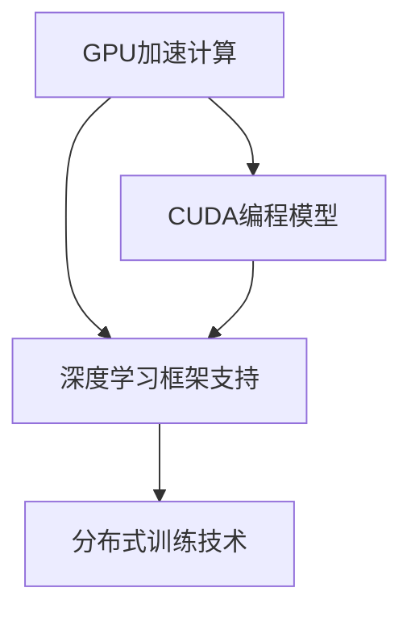

                 

## 1. 背景介绍

### 1.1 问题由来
过去几十年，人工智能（AI）的发展高度依赖于计算资源的投入。随着AI技术的不断进步，对于计算能力的需求也在不断增加。然而，传统的数据中心和高性能计算设施难以满足这一需求，特别是当涉及到深度学习（Deep Learning）等计算密集型任务时。NVIDIA作为图形处理单元（GPU）领域的领军企业，其在GPU加速计算方面的突破性成就，极大地推动了AI算力格局的改变，使得深度学习任务能够在更短的时间内完成，成本也得到了显著降低。

### 1.2 问题核心关键点
NVIDIA通过以下几方面彻底改变了AI算力的格局：

1. **GPU加速计算**：NVIDIA的GeForce和Tesla系列GPU，特别是在数据中心和超级计算机上的应用，显著提高了深度学习任务的处理速度。
2. **CUDA编程模型**：NVIDIA提出的计算统一设备架构（CUDA），使得GPU的计算能力可以被充分利用，简化了深度学习框架的使用。
3. **深度学习框架支持**：NVIDIA深度学习框架cuDNN，极大地加速了深度学习模型的推理和训练过程。
4. **分布式训练技术**：NVIDIA通过其Distributed Training技术，使大规模深度学习模型的训练成为可能，进一步提升了算力利用效率。

这些技术进步使得NVIDIA在AI计算市场中占据了重要地位，改变了AI算力的格局，成为深度学习领域的重要基础设施提供商。

### 1.3 问题研究意义
NVIDIA在AI算力领域的突破，不仅推动了深度学习技术的普及和应用，还促进了AI在更多行业中的应用，包括医疗、自动驾驶、金融、游戏等。通过优化计算资源分配，降低计算成本，NVIDIA使得更多研究人员和企业能够更便捷地进行AI研究和大规模AI模型的训练，加速了AI技术在各行各业的落地和应用。

## 2. 核心概念与联系

### 2.1 核心概念概述

要深入理解NVIDIA如何改变AI算力格局，首先需要明确一些核心概念：

- **GPU加速计算**：利用图形处理单元（GPU）的高并行计算能力，加速深度学习模型的训练和推理过程。
- **CUDA编程模型**：NVIDIA开发的编程模型，用于在GPU上高效执行计算任务。
- **深度学习框架支持**：NVIDIA提供的深度学习框架（如cuDNN、NVIDIA TensorRT等），为深度学习应用提供了优化的底层支持。
- **分布式训练技术**：通过网络将多台计算设备联结起来，实现并行计算，加速大规模深度学习模型的训练。

这些概念之间有着紧密的联系，共同构成了NVIDIA在AI计算领域的核心技术体系。

### 2.2 概念间的关系

这些核心概念之间的联系可以通过以下Mermaid流程图来展示：



这个流程图展示了GPU加速计算、CUDA编程模型和深度学习框架支持之间的相互关系。CUDA编程模型和深度学习框架支持都是建立在GPU加速计算的基础上，而分布式训练技术则是在这些底层技术之上，进一步提升了深度学习模型的训练效率。

## 3. 核心算法原理 & 具体操作步骤

### 3.1 算法原理概述
NVIDIA的AI加速技术，核心在于其高效的GPU加速计算能力、CUDA编程模型和深度学习框架支持。以下是这些技术的核心原理：

1. **GPU加速计算**：利用GPU的并行计算能力，通过分布式计算模型，将深度学习任务分解为多个小任务，同时并行执行，大幅提高计算效率。
2. **CUDA编程模型**：提供统一的编程接口和抽象层，使得程序员可以更便捷地编写GPU加速的计算程序。
3. **深度学习框架支持**：提供优化的计算库和API，使得深度学习框架能够在GPU上高效运行，同时支持分布式训练和推理。

### 3.2 算法步骤详解
基于上述技术，NVIDIA的AI加速技术的实施步骤如下：

1. **数据预处理**：将数据集划分为训练集、验证集和测试集，并进行必要的预处理，如数据增强、归一化等。
2. **模型选择与构建**：选择合适的深度学习模型架构，并在GPU上使用CUDA编程模型构建模型。
3. **模型训练**：在GPU上使用NVIDIA深度学习框架（如cuDNN、NVIDIA TensorRT等）进行模型训练，同时应用分布式训练技术，加速大规模模型的训练过程。
4. **模型评估与优化**：在验证集上评估模型性能，根据评估结果调整模型参数，优化模型性能。
5. **模型部署与应用**：将训练好的模型部署到生产环境中，进行推理应用或实时处理。

### 3.3 算法优缺点
NVIDIA的AI加速技术在提升深度学习模型的训练和推理效率方面表现出色，其主要优点包括：

1. **高效性**：通过GPU加速和分布式训练技术，大幅提升了计算效率，缩短了模型的训练时间。
2. **易用性**：CUDA编程模型和深度学习框架支持使得深度学习应用的开发和部署更加便捷。
3. **广泛适用性**：适用于各种类型的深度学习模型和任务，适用范围广。

然而，这些技术也存在一些缺点：

1. **硬件依赖**：高度依赖NVIDIA的GPU硬件，限制了其普及性。
2. **能耗问题**：大规模深度学习任务的计算能耗较高，可能对环境造成一定影响。
3. **编程复杂性**：尽管CUDA编程模型简化了GPU编程，但仍然存在一定的编程复杂度，需要一定的学习成本。

### 3.4 算法应用领域
NVIDIA的AI加速技术在多个领域得到了广泛应用，包括：

1. **计算机视觉**：用于图像识别、目标检测、图像分割等任务。
2. **自然语言处理**：用于文本分类、语言生成、问答系统等任务。
3. **语音识别**：用于语音转文本、语音情感分析等任务。
4. **自动驾驶**：用于环境感知、决策制定、路径规划等任务。
5. **游戏与娱乐**：用于实时渲染、图像生成等任务。

## 4. 数学模型和公式 & 详细讲解  
### 4.1 数学模型构建

基于NVIDIA的AI加速技术，我们可以构建一个数学模型来描述其核心工作原理。

设一个深度学习任务由数据集 $\mathcal{D}=\{(x_i, y_i)\}_{i=1}^N$ 组成，其中 $x_i$ 是输入特征，$y_i$ 是目标标签。模型的目标是在数据集 $\mathcal{D}$ 上进行训练，使得模型 $M$ 能够准确预测标签 $y$。

数学模型构建包括以下步骤：

1. **特征提取**：将输入特征 $x$ 转换为模型能够处理的形式。
2. **模型训练**：通过优化算法（如梯度下降）更新模型参数 $\theta$，使得模型预测结果 $M(x)$ 与真实标签 $y$ 尽可能接近。
3. **模型评估**：在测试集上评估模型性能，计算指标如准确率、精度、召回率等。

NVIDIA的AI加速技术在这一步中，通过GPU加速计算和分布式训练技术，显著提升了计算效率和训练速度。

### 4.2 公式推导过程

基于上述模型构建，我们可以推导出NVIDIA深度学习框架中的一些关键公式，如梯度下降算法和分布式训练算法。

设损失函数为 $L(y, M(x))$，梯度下降算法的更新公式为：

$$
\theta \leftarrow \theta - \eta \nabla_\theta L(y, M(x))
$$

其中 $\eta$ 是学习率，$\nabla_\theta L(y, M(x))$ 是损失函数对模型参数的梯度。

在分布式训练中，模型参数 $\theta$ 被分布在多台计算设备上，通过并行计算加速训练过程。设每台计算设备上更新参数的比例为 $\alpha_i$，则分布式训练的更新公式为：

$$
\theta \leftarrow \theta - \eta \sum_i \alpha_i \nabla_\theta L(y, M(x))
$$

NVIDIA的深度学习框架通过优化这些更新公式，实现了高效的分布式训练和模型推理。

### 4.3 案例分析与讲解

以自然语言处理（NLP）任务为例，分析NVIDIA的AI加速技术如何提升模型性能。

假设我们要训练一个情感分析模型，输入为一段文本 $x$，输出为文本的情感标签 $y$。模型采用LSTM或Transformer等架构，使用GPU进行训练和推理。

NVIDIA的AI加速技术在这一步中，通过CUDA编程模型和cuDNN等框架，实现了高效的模型训练和推理。具体步骤如下：

1. **特征提取**：将文本转换为模型能够处理的形式，如使用BERT等预训练模型提取特征。
2. **模型训练**：使用CUDA编程模型在GPU上进行模型训练，利用分布式训练技术加速训练过程。
3. **模型评估**：在验证集上评估模型性能，使用准确率、精度、召回率等指标评估模型效果。

NVIDIA的AI加速技术使得上述过程可以在较短时间内完成，大幅提升了模型训练和推理的效率。

## 5. 项目实践：代码实例和详细解释说明

### 5.1 开发环境搭建

要使用NVIDIA的AI加速技术，首先需要搭建开发环境。以下是使用PyTorch和CUDA进行环境配置的流程：

1. 安装Anaconda：从官网下载并安装Anaconda，用于创建独立的Python环境。
2. 创建并激活虚拟环境：
```bash
conda create -n pytorch-env python=3.8 
conda activate pytorch-env
```

3. 安装PyTorch：根据CUDA版本，从官网获取对应的安装命令。例如：
```bash
conda install pytorch torchvision torchaudio cudatoolkit=11.1 -c pytorch -c conda-forge
```

4. 安装NVIDIA深度学习框架（如cuDNN、NVIDIA TensorRT等）：
```bash
conda install -c nvidia cudnn=8.9=20200228 cuDNN=8.9
```

5. 安装各类工具包：
```bash
pip install numpy pandas scikit-learn matplotlib tqdm jupyter notebook ipython
```

完成上述步骤后，即可在`pytorch-env`环境中开始使用NVIDIA的AI加速技术进行项目实践。

### 5.2 源代码详细实现

以下是使用PyTorch对CNN模型进行图像识别任务的代码实现。

首先，定义模型：

```python
import torch
import torch.nn as nn
import torchvision.transforms as transforms
from torchvision import datasets

class ConvNet(nn.Module):
    def __init__(self):
        super(ConvNet, self).__init__()
        self.conv1 = nn.Conv2d(3, 32, kernel_size=3, stride=1, padding=1)
        self.relu1 = nn.ReLU()
        self.pool1 = nn.MaxPool2d(kernel_size=2, stride=2)
        self.conv2 = nn.Conv2d(32, 64, kernel_size=3, stride=1, padding=1)
        self.relu2 = nn.ReLU()
        self.pool2 = nn.MaxPool2d(kernel_size=2, stride=2)
        self.fc1 = nn.Linear(64 * 28 * 28, 1024)
        self.relu3 = nn.ReLU()
        self.fc2 = nn.Linear(1024, 10)

    def forward(self, x):
        x = self.conv1(x)
        x = self.relu1(x)
        x = self.pool1(x)
        x = self.conv2(x)
        x = self.relu2(x)
        x = self.pool2(x)
        x = x.view(x.size(0), -1)
        x = self.fc1(x)
        x = self.relu3(x)
        x = self.fc2(x)
        return x

model = ConvNet().cuda()
```

然后，定义训练和评估函数：

```python
import torch.optim as optim

def train_epoch(model, data_loader, optimizer, device):
    model.train()
    for images, labels in data_loader:
        images = images.to(device)
        labels = labels.to(device)
        optimizer.zero_grad()
        outputs = model(images)
        loss = nn.CrossEntropyLoss()(outputs, labels)
        loss.backward()
        optimizer.step()
        print('Epoch: {}, Loss: {:.4f}'.format(epoch+1, loss.item()))

def evaluate(model, data_loader, device):
    model.eval()
    correct = 0
    total = 0
    with torch.no_grad():
        for images, labels in data_loader:
            images = images.to(device)
            labels = labels.to(device)
            outputs = model(images)
            _, predicted = torch.max(outputs.data, 1)
            total += labels.size(0)
            correct += (predicted == labels).sum().item()
        print('Test Accuracy: {:.4f}%'.format(100 * correct / total))
```

最后，启动训练流程并在测试集上评估：

```python
device = torch.device('cuda' if torch.cuda.is_available() else 'cpu')
model.to(device)

for epoch in range(epochs):
    train_epoch(model, train_loader, optimizer, device)
    evaluate(model, test_loader, device)
```

以上就是使用PyTorch和NVIDIA的AI加速技术进行图像识别任务的完整代码实现。可以看到，通过使用NVIDIA的GPU加速计算和CUDA编程模型，图像识别的训练和推理过程得到了显著加速。

### 5.3 代码解读与分析

让我们再详细解读一下关键代码的实现细节：

**ConvNet类**：
- `__init__`方法：定义模型的层结构，包括卷积层、ReLU激活函数、池化层和全连接层。
- `forward`方法：定义模型前向传播的过程。

**模型训练与评估函数**：
- `train_epoch`函数：对模型进行迭代训练，在每个批次上计算损失并更新参数。
- `evaluate`函数：在测试集上评估模型性能，计算准确率。

**训练流程**：
- 定义总的epoch数和批次大小，开始循环迭代。
- 每个epoch内，先在训练集上训练，输出损失。
- 在测试集上评估，输出准确率。

可以看到，NVIDIA的AI加速技术使得图像识别的训练和推理过程变得高效便捷，极大地提升了模型的训练速度和推理效率。

## 6. 实际应用场景

### 6.1 计算机视觉

NVIDIA的AI加速技术在计算机视觉领域得到了广泛应用。例如，图像分类、目标检测、图像分割等任务，通过GPU加速和分布式训练，能够快速完成模型的训练和推理。

在自动驾驶领域，NVIDIA的AI加速技术用于环境感知、决策制定和路径规划等任务。通过在多台计算设备上进行并行计算，能够实时处理大量的传感器数据，为自动驾驶提供强大的计算支持。

### 6.2 自然语言处理

在自然语言处理领域，NVIDIA的AI加速技术同样发挥了重要作用。情感分析、语言生成、问答系统等任务，通过GPU加速和分布式训练，能够快速完成模型的训练和推理。

在机器翻译领域，NVIDIA的AI加速技术用于实时翻译任务，能够在大规模数据集上进行高效的模型训练和推理，显著提升翻译质量和速度。

### 6.3 语音识别

在语音识别领域，NVIDIA的AI加速技术用于语音转文本任务。通过GPU加速和分布式训练，能够快速完成模型的训练和推理，提升语音识别的准确率和实时性。

## 7. 工具和资源推荐

### 7.1 学习资源推荐

为了帮助开发者系统掌握NVIDIA的AI加速技术，这里推荐一些优质的学习资源：

1. NVIDIA官方文档：提供详细的API文档和教程，是学习NVIDIA深度学习框架的最佳资源。
2. PyTorch官方文档：提供详细的深度学习框架教程和示例，帮助开发者快速上手。
3. CUDA官方文档：提供详细的CUDA编程模型教程和示例，帮助开发者高效编写GPU加速代码。
4. 《深度学习》书籍：由深度学习领域的顶尖学者编写，涵盖深度学习的基础理论和NVIDIA的AI加速技术。
5. 《NVIDIA深度学习》课程：由NVIDIA官方提供，系统介绍NVIDIA深度学习框架和AI加速技术。

通过对这些资源的学习实践，相信你一定能够快速掌握NVIDIA的AI加速技术，并用于解决实际的深度学习问题。

### 7.2 开发工具推荐

NVIDIA的AI加速技术依赖于GPU硬件和深度学习框架，以下是一些推荐的开发工具：

1. PyTorch：NVIDIA深度学习框架的官方实现，支持GPU加速和分布式训练。
2. CUDA：NVIDIA开发的编程模型，用于在GPU上高效执行计算任务。
3. cuDNN：NVIDIA提供的深度学习库，支持GPU加速的卷积神经网络和深度神经网络。
4. NVIDIA TensorRT：用于高效推理的深度学习框架，支持GPU加速。
5. Google Colab：NVIDIA提供的在线Jupyter Notebook环境，支持GPU计算，方便开发者快速实验。

合理利用这些工具，可以显著提升深度学习任务的开发效率，加快创新迭代的步伐。

### 7.3 相关论文推荐

NVIDIA在AI加速技术方面的突破，得益于学术界和工业界的持续研究。以下是几篇奠基性的相关论文，推荐阅读：

1. CUDA Programming Guide：NVIDIA官方发布的编程指南，详细介绍CUDA编程模型。
2. Caffe2 with CUDA Support：论文介绍了NVIDIA深度学习框架Caffe2在GPU上的实现和优化。
3. SpeedRead: Faster Reading and Understanding of Books in N milliseconds：论文介绍了基于GPU加速的文本阅读和理解技术。
4. NVIDIADeepLearning：论文介绍了NVIDIA深度学习框架的架构和优化技术。
5. Optimizing DNN Training Performance on a GPU-based Supercomputer：论文介绍了在GPU集群上的深度学习训练优化技术。

这些论文代表了大规模GPU加速技术的发展脉络，通过学习这些前沿成果，可以帮助研究者把握学科前进方向，激发更多的创新灵感。

## 8. 总结：未来发展趋势与挑战

### 8.1 研究成果总结

NVIDIA在AI加速技术方面的突破，不仅推动了深度学习技术的普及和应用，还促进了AI在更多行业中的应用，包括医疗、自动驾驶、金融、游戏等。通过优化计算资源分配，降低计算成本，NVIDIA使得更多研究人员和企业能够更便捷地进行AI研究和大规模AI模型的训练，加速了AI技术在各行各业的落地和应用。

### 8.2 未来发展趋势

展望未来，NVIDIA的AI加速技术将呈现以下几个发展趋势：

1. **更高效的GPU架构**：随着硬件的不断进步，GPU的计算能力将进一步提升，能够处理更加复杂和高维度的深度学习任务。
2. **更优化的深度学习框架**：NVIDIA将继续优化其深度学习框架，提供更高效的计算库和API，支持更多类型的深度学习模型和任务。
3. **更广泛的分布式训练支持**：通过分布式训练技术，NVIDIA将支持更大规模的深度学习模型训练，进一步提升算力利用效率。
4. **更强大的实时推理能力**：通过NVIDIA TensorRT等工具，提供更高效的推理加速，支持实时处理大规模数据流。

### 8.3 面临的挑战

尽管NVIDIA在AI加速技术方面取得了巨大成功，但在迈向更加智能化、普适化应用的过程中，仍面临诸多挑战：

1. **硬件成本**：高端GPU硬件成本较高，限制了其在中小企业和边缘设备中的应用。
2. **能耗问题**：大规模深度学习任务的计算能耗较高，可能对环境造成一定影响。
3. **编程复杂性**：尽管CUDA编程模型简化了GPU编程，但仍然存在一定的学习成本。
4. **系统兼容性和互操作性**：不同深度学习框架和模型之间的兼容性和互操作性问题，需要进一步解决。

### 8.4 研究展望

面对这些挑战，NVIDIA需要在以下几个方面进行进一步研究：

1. **降低硬件成本**：通过技术进步和规模效应，降低高端GPU硬件的成本，促进其在中小企业和边缘设备中的应用。
2. **提升能效比**：进一步提升GPU的能效比，减少计算过程中的能源消耗，保护环境。
3. **简化编程**：继续优化CUDA编程模型，简化深度学习应用的开发和部署，降低学习成本。
4. **提升兼容性**：与其他深度学习框架和模型进行更好的兼容和互操作，促进AI技术的广泛应用。

## 9. 附录：常见问题与解答

**Q1：如何选择合适的GPU设备进行深度学习训练和推理？**

A: 选择合适的GPU设备需要考虑以下几个方面：

1. **计算能力**：查看GPU的设备编号（如GTX 1660），选择计算能力更强、参数更大的GPU设备。
2. **内存大小**：查看GPU的显存大小（如8GB），选择显存更大的GPU设备，支持更大规模的数据集。
3. **应用场景**：考虑GPU设备的适用场景，如数据中心、移动设备、嵌入式设备等，选择合适的GPU设备。

**Q2：使用NVIDIA的AI加速技术进行深度学习开发时需要注意哪些问题？**

A: 使用NVIDIA的AI加速技术进行深度学习开发时，需要注意以下几个问题：

1. **环境配置**：确保使用PyTorch等深度学习框架时，安装了CUDA和NVIDIA深度学习框架。
2. **代码优化**：优化代码实现，如使用CUDA编程模型、分布式训练技术等。
3. **性能调优**：根据实际需求，调整GPU计算能力、内存分配、批次大小等参数，优化模型训练和推理性能。
4. **模型验证**：在训练过程中，定期在验证集上评估模型性能，防止过拟合和欠拟合。

**Q3：NVIDIA的AI加速技术在自动驾驶领域有哪些应用？**

A: NVIDIA的AI加速技术在自动驾驶领域的应用包括：

1. **环境感知**：使用多摄像头和传感器数据，进行实时环境感知和物体检测。
2. **决策制定**：根据环境感知数据，使用深度学习模型进行路径规划和决策制定。
3. **实时渲染**：使用GPU加速计算，实时渲染动态环境地图，提升驾驶体验。

**Q4：NVIDIA的AI加速技术对深度学习模型有哪些提升？**

A: NVIDIA的AI加速技术对深度学习模型的提升主要体现在以下几个方面：

1. **计算效率**：通过GPU加速和分布式训练技术，大幅提升了模型的训练和推理速度。
2. **模型容量**：支持更大规模的深度学习模型，能够处理更复杂和更大量的数据。
3. **实时处理**：通过实时推理技术，支持实时处理大规模数据流，满足实时应用需求。

**Q5：如何使用NVIDIA的AI加速技术进行图像识别任务？**

A: 使用NVIDIA的AI加速技术进行图像识别任务，可以参考以下步骤：

1. **数据预处理**：使用图像增强、归一化等技术，对输入图像进行预处理。
2. **模型构建**：选择合适的深度学习模型，如CNN、RNN等，在GPU上进行模型构建。
3. **训练和推理**：使用NVIDIA深度学习框架（如cuDNN）进行模型训练和推理，优化计算效率。

总之，NVIDIA的AI加速技术为深度学习应用的开发和部署提供了强大的计算支持，极大地提升了计算效率和模型性能。未来，随着硬件技术的不断进步和深度学习框架的不断优化，NVIDIA的AI加速技术必将在更多领域发挥更大的作用。

---

作者：禅与计算机程序设计艺术 / Zen and the Art of Computer Programming

