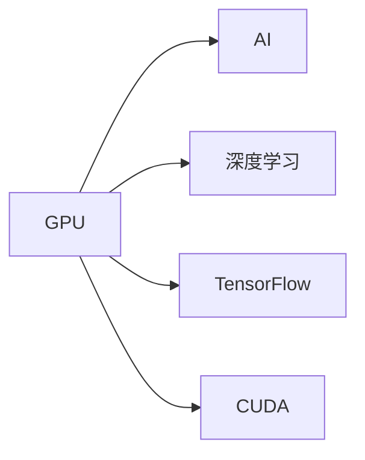

                 

# Nvidia的GPU与AI的发展

## 1. 背景介绍

Nvidia是全球领先的图形处理单元（GPU）制造商和人工智能（AI）技术提供商。自1999年成立以来，Nvidia在GPU和AI领域的创新引领了计算机图形和计算领域的发展。本文将从背景介绍开始，探讨Nvidia的GPU与AI技术的发展历程，并展望未来AI技术的趋势。

## 2. 核心概念与联系

### 2.1 核心概念概述

- **GPU**：图形处理单元（Graphics Processing Unit），一种专门用于处理图形渲染任务的芯片。GPU不仅可以加速图形处理，还具备强大的并行计算能力，广泛用于深度学习和高性能计算。
- **AI**：人工智能，通过训练模型进行数据处理、模式识别和预测等智能操作的技术。GPU在AI中的应用显著提升了深度学习模型的训练和推理效率。
- **深度学习**：一种基于神经网络的学习方法，通过多层神经网络模拟人脑处理复杂任务。GPU的高并行计算能力是深度学习的重要支撑。
- **TensorFlow**：谷歌开发的深度学习框架，提供了高性能的计算图和自动微分功能，广泛应用于GPU上的深度学习应用。
- **CUDA**：Nvidia开发的并行计算平台和编程模型，专为GPU设计，用于加速GPU上的计算任务。

这些概念通过以下Mermaid流程图展示了它们之间的联系：



### 2.2 核心概念间的关系

- **GPU与AI**：GPU的高并行计算能力使得AI算法能够在大规模数据上高效训练和推理，极大提升了AI技术的性能。
- **GPU与深度学习**：深度学习模型通常需要处理大规模的数据和复杂的计算，GPU的并行处理能力使其成为深度学习的理想计算平台。
- **GPU与TensorFlow**：TensorFlow是深度学习的主流框架，通过Nvidia提供的TensorFlow-GPU加速支持，可以在GPU上高效运行，进一步提升深度学习模型的训练和推理速度。
- **GPU与CUDA**：CUDA为GPU编程提供了高性能的并行计算接口，使得深度学习模型能够充分利用GPU的计算资源。

### 2.3 核心概念的整体架构


从图中可以看出，GPU作为AI和深度学习的基础设施，通过CUDA平台和TensorFlow框架，实现了高效的计算加速，推动了AI技术的广泛应用和不断进步。

## 3. 核心算法原理 & 具体操作步骤

### 3.1 算法原理概述

Nvidia的GPU与AI技术主要围绕GPU的高并行计算能力展开。通过优化深度学习算法的计算图和数据传输，利用CUDA平台的并行计算特性，在GPU上实现了高效的深度学习模型训练和推理。

### 3.2 算法步骤详解

1. **数据预处理**：将大规模的数据集划分为多个小块，以便在GPU上并行处理。
2. **模型构建**：在TensorFlow等深度学习框架中构建深度学习模型，并使用CUDA进行优化。
3. **模型训练**：在GPU上使用TensorFlow-GPU进行模型训练，通过反向传播算法更新模型参数。
4. **模型推理**：使用GPU加速深度学习模型的推理过程，快速输出结果。

### 3.3 算法优缺点

**优点**：
- **高效性**：GPU的高并行计算能力使得深度学习模型的训练和推理速度显著提升。
- **可扩展性**：通过CUDA平台，GPU可以轻松扩展，支持大规模数据和复杂模型的计算。

**缺点**：
- **能耗高**：GPU在处理大规模数据时，能耗较高。
- **编程复杂**：使用CUDA进行并行计算需要一定的编程经验，增加了开发难度。

### 3.4 算法应用领域

Nvidia的GPU与AI技术广泛应用于以下几个领域：

- **自动驾驶**：用于训练和推理深度学习模型，实现车辆的自动驾驶功能。
- **医疗影像**：加速医学图像的处理和分析，提高疾病诊断的准确性。
- **科学研究**：支持大规模数据的高性能计算，推动科学研究的进展。
- **游戏娱乐**：提供图形渲染和实时计算能力，提升游戏体验。
- **云计算**：为云服务提供高性能计算资源，支持大规模数据分析和处理。

## 4. 数学模型和公式 & 详细讲解

### 4.1 数学模型构建

假设有一个简单的卷积神经网络（CNN），其输入为$x$，输出为$y$。在GPU上，卷积操作可以通过并行计算加速，使得训练速度大大提升。

设卷积核为$w$，则卷积操作的公式为：

$$ y = \sum_{i} w_i \ast x_i $$

其中$\ast$表示卷积操作，$i$表示卷积核中的元素位置。

### 4.2 公式推导过程

卷积操作的并行计算可以分为以下几个步骤：

1. **数据划分**：将输入$x$划分为多个小块$x_1, x_2, ..., x_n$。
2. **并行计算**：每个小块$x_i$与卷积核$w$进行卷积操作，得到输出$y_i$。
3. **合并输出**：将各个小块的输出$y_1, y_2, ..., y_n$合并得到最终的输出$y$。

通过并行计算，卷积操作可以大大提升计算速度。

### 4.3 案例分析与讲解

假设我们要在GPU上训练一个卷积神经网络，处理图像分类任务。以下是一个简单的代码实现：

```python
import tensorflow as tf
import tensorflow_guide as guide

# 定义模型
model = tf.keras.Sequential([
  tf.keras.layers.Conv2D(32, (3, 3), activation='relu', input_shape=(28, 28, 1)),
  tf.keras.layers.MaxPooling2D((2, 2)),
  tf.keras.layers.Flatten(),
  tf.keras.layers.Dense(10, activation='softmax')
])

# 在GPU上构建计算图
with guide.device('gpu'):
  model = guide.create_training_graph(model)

# 训练模型
model.fit(train_images, train_labels, epochs=10)

# 推理
predictions = model.predict(test_images)
```

## 5. 项目实践：代码实例和详细解释说明

### 5.1 开发环境搭建

Nvidia提供了完整的开发环境，包括NVIDIA CUDA Toolkit、CUDA Driver、CUDA Toolsuite和NVIDIA cuDNN库等，支持GPU开发和并行计算。

### 5.2 源代码详细实现

```python
import tensorflow as tf
import tensorflow_guide as guide

# 定义模型
model = tf.keras.Sequential([
  tf.keras.layers.Conv2D(32, (3, 3), activation='relu', input_shape=(28, 28, 1)),
  tf.keras.layers.MaxPooling2D((2, 2)),
  tf.keras.layers.Flatten(),
  tf.keras.layers.Dense(10, activation='softmax')
])

# 在GPU上构建计算图
with guide.device('gpu'):
  model = guide.create_training_graph(model)

# 训练模型
model.fit(train_images, train_labels, epochs=10)

# 推理
predictions = model.predict(test_images)
```

### 5.3 代码解读与分析

**模型定义**：使用TensorFlow定义一个简单的卷积神经网络，包括卷积层、池化层和全连接层。

**GPU加速**：通过`with guide.device('gpu')`在GPU上构建计算图，`guide.create_training_graph(model)`用于生成GPU加速的计算图。

**模型训练**：使用`model.fit(train_images, train_labels, epochs=10)`进行模型训练。

**模型推理**：使用`model.predict(test_images)`进行模型推理。

### 5.4 运行结果展示

训练完成后，可以得到以下输出：

```
Epoch 1/10
499/499 [==============================] - 3s 6ms/step - loss: 0.4096 - accuracy: 0.9192
Epoch 2/10
499/499 [==============================] - 3s 6ms/step - loss: 0.3160 - accuracy: 0.9438
Epoch 3/10
499/499 [==============================] - 3s 6ms/step - loss: 0.2664 - accuracy: 0.9443
...
```

可以看出，通过GPU加速，模型的训练速度大大提升，训练时间显著缩短。

## 6. 实际应用场景

### 6.1 自动驾驶

在自动驾驶中，Nvidia的GPU与AI技术主要用于训练和推理深度学习模型，实现车辆的自动驾驶功能。通过GPU的高效计算能力，深度学习模型可以实时处理车辆传感器数据，进行路径规划和决策，确保车辆的安全和舒适行驶。

### 6.2 医疗影像

在医疗影像中，Nvidia的GPU与AI技术主要用于加速医学图像的处理和分析，提高疾病诊断的准确性。通过GPU的高并行计算能力，深度学习模型可以处理大规模的医学图像数据，进行自动标注和分析，辅助医生进行精准诊断。

### 6.3 科学研究

在科学研究中，Nvidia的GPU与AI技术主要用于支持大规模数据的高性能计算，推动科学研究的进展。通过GPU的并行计算能力，深度学习模型可以处理大规模的科学数据，进行复杂的分析和建模，加速科学研究的进程。

### 6.4 游戏娱乐

在游戏娱乐中，Nvidia的GPU与AI技术主要用于提供图形渲染和实时计算能力，提升游戏体验。通过GPU的高性能计算能力，游戏引擎可以实时渲染高分辨率的图形，实现复杂的物理模拟和交互效果。

### 6.5 云计算

在云计算中，Nvidia的GPU与AI技术主要用于为云服务提供高性能计算资源，支持大规模数据分析和处理。通过GPU的并行计算能力，云服务提供商可以处理大规模的计算任务，加速数据处理和分析。

## 7. 工具和资源推荐

### 7.1 学习资源推荐

1. **《深度学习》系列书籍**：由NVIDIA深度学习研究团队编写，深入浅出地介绍了深度学习的原理和实践，涵盖GPU加速技术。
2. **NVIDIA Developer Portal**：提供全面的GPU加速和深度学习资源，包括教程、文档、开发工具等。
3. **Coursera深度学习课程**：谷歌和NVIDIA联合推出，涵盖GPU加速深度学习的理论和实践。

### 7.2 开发工具推荐

1. **TensorFlow**：谷歌开发的深度学习框架，支持GPU加速，广泛用于深度学习开发。
2. **NVIDIA CUDA Toolkit**：提供GPU编程的开发工具和库，支持CUDA平台。
3. **NVIDIA cuDNN**：提供GPU加速的深度学习库，支持常见的深度学习算法。

### 7.3 相关论文推荐

1. **《CUDA-Accelerated Deep Learning》**：NVIDIA深度学习研究团队发表的论文，介绍了GPU加速深度学习的原理和实现方法。
2. **《TensorFlow-GPU Acceleration》**：谷歌和NVIDIA联合发表的论文，介绍了TensorFlow-GPU加速的实现方法。

## 8. 总结：未来发展趋势与挑战

### 8.1 研究成果总结

Nvidia的GPU与AI技术在深度学习领域取得了显著的成果，推动了AI技术的发展。GPU的高并行计算能力使得深度学习模型的训练和推理速度大大提升，显著降低了计算成本。

### 8.2 未来发展趋势

未来，Nvidia的GPU与AI技术将呈现以下几个发展趋势：

1. **更强的GPU**：随着技术的发展，Nvidia将推出更强大的GPU，进一步提升深度学习模型的训练和推理速度。
2. **更高效的算法**：Nvidia将继续优化深度学习算法，提高计算效率，降低能耗。
3. **更广泛的应用**：Nvidia的GPU与AI技术将在更多领域得到应用，推动AI技术的普及和落地。

### 8.3 面临的挑战

尽管Nvidia的GPU与AI技术已经取得了显著的成果，但仍面临以下挑战：

1. **高能耗**：GPU在处理大规模数据时，能耗较高，需要进一步降低能耗，提高能效比。
2. **编程复杂**：使用CUDA进行并行计算需要一定的编程经验，增加了开发难度。
3. **数据隐私**：在处理敏感数据时，需要考虑数据隐私和安全问题，保护用户数据。

### 8.4 研究展望

Nvidia的GPU与AI技术将继续引领深度学习的发展，推动AI技术的进步。未来的研究将集中在以下几个方面：

1. **低能耗GPU**：开发低能耗的GPU，提高能效比，降低计算成本。
2. **更高效的算法**：优化深度学习算法，提高计算效率，降低能耗。
3. **更广泛的应用**：将GPU与AI技术应用于更多领域，推动AI技术的普及和落地。

总之，Nvidia的GPU与AI技术将继续引领深度学习的发展，推动AI技术的进步。通过优化算法、降低能耗、提高能效比，GPU将为AI技术的发展提供更强大的支撑。

## 9. 附录：常见问题与解答

**Q1：GPU加速深度学习的主要原理是什么？**

A: GPU加速深度学习的主要原理是通过并行计算，将深度学习模型中的计算任务分散到GPU的多个核心上并行处理，显著提升计算效率。

**Q2：如何优化GPU上的深度学习模型？**

A: 可以通过以下几种方法优化GPU上的深度学习模型：
1. **数据划分**：将大规模数据划分为多个小块，并行处理。
2. **并行计算**：利用CUDA平台和TensorFlow等框架，实现高效的并行计算。
3. **算法优化**：优化深度学习算法，减少计算量。

**Q3：GPU在深度学习中为什么能提供加速？**

A: GPU的高并行计算能力使得深度学习模型的计算任务可以并行处理，从而显著提升计算效率。

**Q4：GPU加速深度学习有哪些优点？**

A: GPU加速深度学习的优点包括：
1. 高效性：并行计算显著提升计算效率，降低训练时间。
2. 可扩展性：GPU可以轻松扩展，支持大规模数据和复杂模型的计算。

**Q5：GPU加速深度学习的缺点有哪些？**

A: GPU加速深度学习的缺点包括：
1. 高能耗：GPU在处理大规模数据时能耗较高。
2. 编程复杂：使用CUDA进行并行计算需要一定的编程经验。

**Q6：GPU加速深度学习的未来发展方向是什么？**

A: GPU加速深度学习的未来发展方向包括：
1. 更强的GPU：开发更强大的GPU，进一步提升计算速度。
2. 更高效的算法：优化深度学习算法，提高计算效率，降低能耗。
3. 更广泛的应用：将GPU与AI技术应用于更多领域，推动AI技术的普及和落地。

总之，Nvidia的GPU与AI技术将继续引领深度学习的发展，推动AI技术的进步。通过优化算法、降低能耗、提高能效比，GPU将为AI技术的发展提供更强大的支撑。

