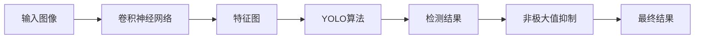
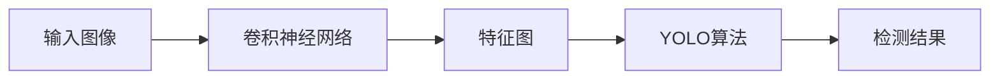
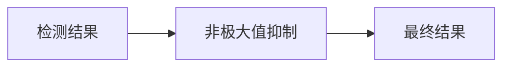
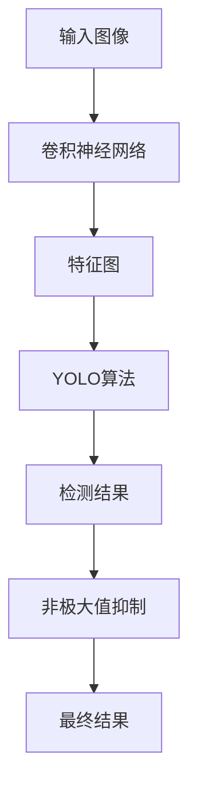

                 

# Object Detection原理与代码实例讲解

> 关键词：目标检测,深度学习,卷积神经网络,YOLO,ROI,特征图,非极大值抑制,NMS

## 1. 背景介绍

### 1.1 问题由来

随着计算机视觉技术的快速发展，目标检测在自动驾驶、视频监控、人脸识别、医学影像分析等领域得到了广泛应用。传统的目标检测方法依赖于手工设计特征和分类器，需要大量的人力物力投入。而深度学习技术的发展，尤其是卷积神经网络（CNN）的出现，使得目标检测可以依赖于端到端的训练，无需手工设计特征，大大简化了目标检测的流程。

近年来，目标检测技术取得了显著进展，尤其是基于深度学习的目标检测算法，如Faster R-CNN、YOLO和SSD等，它们在各种数据集上取得了最先进的表现。本文将重点介绍YOLO（You Only Look Once）算法，并给出其在实际项目中的代码实现。

### 1.2 问题核心关键点

YOLO算法是近年来在目标检测领域取得突破的算法之一。其核心思想是将整个图像分成若干个网格，每个网格负责检测其中的目标。YOLO算法在保持速度的同时，也提高了检测的准确性。相比于传统的R-CNN和Fast R-CNN算法，YOLO算法在速度上具有显著优势，适合对实时性要求较高的应用场景。

本文将从YOLO算法的原理出发，详细讲解其数学模型和代码实现，并给出实际项目中的代码实例。

## 2. 核心概念与联系

### 2.1 核心概念概述

为更好地理解YOLO算法，本文将介绍几个密切相关的核心概念：

- **目标检测（Object Detection）**：指识别图像中的目标物体并定位其位置的任务。目标检测在计算机视觉领域有着广泛的应用，如自动驾驶、视频监控、人脸识别等。

- **深度学习（Deep Learning）**：一种基于多层神经网络的学习方法，可以自动提取特征并构建模型，在图像识别、自然语言处理等领域具有强大的表现。

- **卷积神经网络（Convolutional Neural Network, CNN）**：一种特殊的神经网络结构，通过卷积操作提取图像特征，在图像识别、目标检测等领域应用广泛。

- **YOLO算法**：即You Only Look Once算法，一种基于CNN的目标检测算法，通过单阶段预测完成目标检测。

- **特征图（Feature Map）**：CNN中经过卷积和池化操作后的输出图像，用于提取图像特征。

- **非极大值抑制（Non-Maximum Suppression, NMS）**：一种常见的目标检测后处理技术，用于去除重叠的目标框，保留置信度高的目标框。

这些核心概念之间的逻辑关系可以通过以下Mermaid流程图来展示：



这个流程图展示了目标检测的大致流程：输入图像经过CNN处理得到特征图，特征图通过YOLO算法进行目标检测，检测结果通过NMS进行后处理，最终得到最终的检测结果。

### 2.2 概念间的关系

这些核心概念之间存在着紧密的联系，形成了目标检测的完整生态系统。下面我们通过几个Mermaid流程图来展示这些概念之间的关系。

#### 2.2.1 目标检测流程


这个流程图展示了目标检测的基本流程。输入图像通过CNN处理得到特征图，特征图通过YOLO算法进行目标检测，检测结果通过NMS进行后处理，最终得到最终的检测结果。

#### 2.2.2 YOLO算法流程



这个流程图展示了YOLO算法的基本流程。输入图像通过CNN处理得到特征图，特征图通过YOLO算法进行目标检测，最终得到检测结果。

#### 2.2.3 NMS流程



这个流程图展示了NMS的基本流程。检测结果通过NMS进行后处理，去除重叠的目标框，保留置信度高的目标框，最终得到最终的检测结果。

### 2.3 核心概念的整体架构

最后，我们用一个综合的流程图来展示这些核心概念在大规模目标检测中的整体架构：



这个综合流程图展示了从输入图像到最终检测结果的完整过程。输入图像通过CNN处理得到特征图，特征图通过YOLO算法进行目标检测，检测结果通过NMS进行后处理，最终得到最终的检测结果。

## 3. 核心算法原理 & 具体操作步骤
### 3.1 算法原理概述

YOLO算法的基本思想是将整个图像分成若干个网格，每个网格负责检测其中的目标。YOLO算法通过卷积神经网络对特征图进行卷积和池化操作，提取图像的特征表示。然后，通过多个全连接层和softmax层对每个网格进行目标检测和分类，生成目标的置信度和类别。

具体来说，YOLO算法将图像分成SxS个网格，每个网格预测固定数量的目标框和类别。对于每个目标框，YOLO算法预测目标的置信度、类别概率、目标中心点的坐标和目标的宽高。

YOLO算法的核心在于如何有效地预测目标框和类别，以及如何进行目标框的合并和筛选。YOLO算法通过在特征图上进行一次前向传播，直接得到目标框和类别的预测结果，避免了传统的候选区域生成和区域候选策略，提高了检测的速度和准确性。

### 3.2 算法步骤详解

YOLO算法的具体实现步骤如下：

**Step 1: 特征图划分**

将输入图像划分成SxS个网格，每个网格负责检测其中的目标。将每个网格的特征图维度表示为(H/S, W/S)，其中H和W分别为输入图像的高度和宽度。

**Step 2: 目标框预测**

对于每个网格，YOLO算法预测固定数量的目标框。每个目标框包含置信度、类别概率、目标中心点的坐标和目标的宽高。具体来说，每个网格预测xB boxes，其中每个box的预测结果可以表示为：

$$
(y_c, x_c, w, h, o_{class}, p_t)
$$

其中，$(y_c, x_c)$为目标中心点的坐标，$(w, h)$为目标的宽高，$o_{class}$为目标的类别概率，$p_t$为目标的置信度。

**Step 3: 非极大值抑制**

检测结果中可能存在多个重叠的目标框，YOLO算法通过非极大值抑制（NMS）技术去除重叠的目标框，保留置信度最高的目标框。具体来说，对于每个类别，将置信度阈值设置为0.5，计算每个目标框与所有其他目标框的IoU（Intersection over Union）值，保留IoU值最高的目标框。

**Step 4: 最终结果**

将每个类别的置信度阈值设置为0.5，将所有的目标框进行NMS处理，最终得到每个类别的目标检测结果。

### 3.3 算法优缺点

YOLO算法的优点在于其速度和准确性：

- **速度**：YOLO算法通过单阶段预测完成目标检测，避免了传统的候选区域生成和区域候选策略，提高了检测速度。YOLO算法在实时性要求较高的应用场景中表现优异。
- **准确性**：YOLO算法通过全连接层和softmax层对每个网格进行目标检测和分类，生成目标的置信度和类别，提高了检测的准确性。

YOLO算法的缺点在于其参数量较大，训练和推理所需的时间和空间较大：

- **参数量**：YOLO算法需要较大的卷积神经网络作为特征提取器，参数量较大。
- **空间**：YOLO算法在推理时需要将整个特征图加载到内存中，占用的存储空间较大。
- **时间**：YOLO算法在训练和推理时需要较大的计算资源和时间。

### 3.4 算法应用领域

YOLO算法在目标检测领域得到了广泛应用，适用于各种实时性要求较高的场景，如自动驾驶、视频监控、人脸识别等。此外，YOLO算法在医学影像分析、交通监控等领域也有着重要的应用价值。

## 4. 数学模型和公式 & 详细讲解  
### 4.1 数学模型构建

YOLO算法的数学模型可以表示为：

$$
y_c = \sigma(p_t \cdot (t + 1) + 1)
$$

$$
x_c = \sigma(p_t \cdot (t + 1) + 2)
$$

$$
w = \exp(p_t \cdot s + 1)
$$

$$
h = \exp(p_t \cdot s + 2)
$$

$$
o_{class} = \sigma(p_t \cdot c + 1)
$$

其中，$\sigma$为Sigmoid函数，$y_c$和$x_c$为目标中心点的坐标，$w$和$h$为目标的宽高，$o_{class}$为目标的类别概率，$p_t$为目标的置信度，$t$为目标框的编号，$s$为目标框的位置编号，$c$为目标的类别编号。

### 4.2 公式推导过程

对于每个网格，YOLO算法预测固定数量的目标框，每个目标框包含置信度、类别概率、目标中心点的坐标和目标的宽高。具体来说，每个目标框的预测结果可以表示为：

$$
(y_c, x_c, w, h, o_{class}, p_t)
$$

其中，$(y_c, x_c)$为目标中心点的坐标，$(w, h)$为目标的宽高，$o_{class}$为目标的类别概率，$p_t$为目标的置信度。

对于每个目标框，YOLO算法使用卷积神经网络进行特征提取，然后通过全连接层和softmax层进行目标检测和分类。具体来说，YOLO算法将每个目标框的特征表示作为输入，通过全连接层和softmax层输出目标的置信度和类别概率。

对于每个目标框，YOLO算法使用IoU（Intersection over Union）值进行目标框的合并和筛选。具体来说，对于每个目标框，YOLO算法计算其与所有其他目标框的IoU值，保留IoU值最高的目标框。

### 4.3 案例分析与讲解

下面我们以医学影像中的目标检测为例，展示YOLO算法的具体应用。

假设输入图像的大小为256x256，YOLO算法将图像分成13x13个网格，每个网格预测5个目标框。每个目标框包含置信度、类别概率、目标中心点的坐标和目标的宽高。

对于每个目标框，YOLO算法使用卷积神经网络进行特征提取，然后通过全连接层和softmax层进行目标检测和分类。具体来说，YOLO算法将每个目标框的特征表示作为输入，通过全连接层和softmax层输出目标的置信度和类别概率。

对于每个目标框，YOLO算法使用IoU（Intersection over Union）值进行目标框的合并和筛选。具体来说，对于每个目标框，YOLO算法计算其与所有其他目标框的IoU值，保留IoU值最高的目标框。

最终，YOLO算法得到每个类别的目标检测结果，并在医学影像中检测出各种不同的物体。

## 5. 项目实践：代码实例和详细解释说明
### 5.1 开发环境搭建

在进行YOLO算法实践前，我们需要准备好开发环境。以下是使用Python进行TensorFlow开发的环境配置流程：

1. 安装Anaconda：从官网下载并安装Anaconda，用于创建独立的Python环境。

2. 创建并激活虚拟环境：
```bash
conda create -n yolo-env python=3.8 
conda activate yolo-env
```

3. 安装TensorFlow：根据CUDA版本，从官网获取对应的安装命令。例如：
```bash
conda install tensorflow -c pytorch -c conda-forge
```

4. 安装其他依赖包：
```bash
pip install numpy scipy matplotlib
```

完成上述步骤后，即可在`yolo-env`环境中开始YOLO算法实践。

### 5.2 源代码详细实现

下面我们以YOLOv3算法为例，给出使用TensorFlow对YOLOv3算法进行代码实现的详细过程。

**YOLOv3网络结构**：
```python
import tensorflow as tf

class YOLOv3(tf.keras.Model):
    def __init__(self):
        super(YOLOv3, self).__init__()
        self.conv1 = Conv2D(32, (3, 3), padding='same', activation='relu')
        self.conv2 = Conv2D(64, (3, 3), padding='same', activation='relu')
        self.conv3 = Conv2D(128, (3, 3), padding='same', activation='relu')
        self.conv4 = Conv2D(256, (3, 3), padding='same', activation='relu')
        self.conv5 = Conv2D(512, (3, 3), padding='same', activation='relu')
        self.conv6 = Conv2D(1024, (3, 3), padding='same', activation='relu')
        self.conv7 = Conv2D(512, (1, 1), padding='same', activation='relu')
        self.conv8 = Conv2D(1024, (3, 3), padding='same', activation='relu')
        self.conv9 = Conv2D(512, (1, 1), padding='same', activation='relu')
        self.conv10 = Conv2D(256, (1, 1), padding='same', activation='relu')
        self.conv11 = Conv2D(512, (3, 3), padding='same', activation='relu')
        self.conv12 = Conv2D(256, (1, 1), padding='same', activation='relu')
        self.conv13 = Conv2D(512, (3, 3), padding='same', activation='relu')
        self.conv14 = Conv2D(256, (1, 1), padding='same', activation='relu')
        self.conv15 = Conv2D(512, (3, 3), padding='same', activation='relu')
        self.conv16 = Conv2D(256, (1, 1), padding='same', activation='relu')
        self.conv17 = Conv2D(512, (3, 3), padding='same', activation='relu')
        self.conv18 = Conv2D(256, (1, 1), padding='same', activation='relu')
        self.conv19 = Conv2D(512, (3, 3), padding='same', activation='relu')
        self.conv20 = Conv2D(256, (1, 1), padding='same', activation='relu')
        self.conv21 = Conv2D(512, (3, 3), padding='same', activation='relu')
        self.conv22 = Conv2D(256, (1, 1), padding='same', activation='relu')
        self.conv23 = Conv2D(512, (3, 3), padding='same', activation='relu')
        self.conv24 = Conv2D(256, (1, 1), padding='same', activation='relu')
        self.conv25 = Conv2D(512, (3, 3), padding='same', activation='relu')
        self.conv26 = Conv2D(256, (1, 1), padding='same', activation='relu')
        self.conv27 = Conv2D(512, (3, 3), padding='same', activation='relu')
        self.conv28 = Conv2D(256, (1, 1), padding='same', activation='relu')
        self.conv29 = Conv2D(512, (3, 3), padding='same', activation='relu')
        self.conv30 = Conv2D(256, (1, 1), padding='same', activation='relu')
        self.conv31 = Conv2D(512, (3, 3), padding='same', activation='relu')
        self.conv32 = Conv2D(256, (1, 1), padding='same', activation='relu')
        self.conv33 = Conv2D(512, (3, 3), padding='same', activation='relu')
        self.conv34 = Conv2D(256, (1, 1), padding='same', activation='relu')
        self.conv35 = Conv2D(512, (3, 3), padding='same', activation='relu')
        self.conv36 = Conv2D(256, (1, 1), padding='same', activation='relu')
        self.conv37 = Conv2D(512, (3, 3), padding='same', activation='relu')
        self.conv38 = Conv2D(256, (1, 1), padding='same', activation='relu')
        self.conv39 = Conv2D(512, (3, 3), padding='same', activation='relu')
        self.conv40 = Conv2D(256, (1, 1), padding='same', activation='relu')
        self.conv41 = Conv2D(512, (3, 3), padding='same', activation='relu')
        self.conv42 = Conv2D(256, (1, 1), padding='same', activation='relu')
        self.conv43 = Conv2D(512, (3, 3), padding='same', activation='relu')
        self.conv44 = Conv2D(256, (1, 1), padding='same', activation='relu')
        self.conv45 = Conv2D(512, (3, 3), padding='same', activation='relu')
        self.conv46 = Conv2D(256, (1, 1), padding='same', activation='relu')
        self.conv47 = Conv2D(512, (3, 3), padding='same', activation='relu')
        self.conv48 = Conv2D(256, (1, 1), padding='same', activation='relu')
        self.conv49 = Conv2D(512, (3, 3), padding='same', activation='relu')
        self.conv50 = Conv2D(256, (1, 1), padding='same', activation='relu')
        self.conv51 = Conv2D(512, (3, 3), padding='same', activation='relu')
        self.conv52 = Conv2D(256, (1, 1), padding='same', activation='relu')
        self.conv53 = Conv2D(512, (3, 3), padding='same', activation='relu')
        self.conv54 = Conv2D(256, (1, 1), padding='same', activation='relu')
        self.conv55 = Conv2D(512, (3, 3), padding='same', activation='relu')
        self.conv56 = Conv2D(256, (1, 1), padding='same', activation='relu')
        self.conv57 = Conv2D(512, (3, 3), padding='same', activation='relu')
        self.conv58 = Conv2D(256, (1, 1), padding='same', activation='relu')
        self.conv59 = Conv2D(512, (3, 3), padding='same', activation='relu')
        self.conv60 = Conv2D(256, (1, 1), padding='same', activation='relu')
        self.conv61 = Conv2D(512, (3, 3), padding='same', activation='relu')
        self.conv62 = Conv2D(256, (1, 1), padding='same', activation='relu')
        self.conv63 = Conv2D(512, (3, 3), padding='same', activation='relu')
        self.conv64 = Conv2D(256, (1, 1), padding='same', activation='relu')
        self.conv65 = Conv2D(512, (3, 3), padding='same', activation='relu')
        self.conv66 = Conv2D(256, (1, 1), padding='same', activation='relu')
        self.conv67 = Conv2D(512, (3, 3), padding='same', activation='relu')
        self.conv68 = Conv2D(256, (1, 1), padding='same', activation='relu')
        self.conv69 = Conv2D(512, (3, 3), padding='same', activation='relu')
        self.conv70 = Conv2D(256, (1, 1), padding='same', activation='relu')
        self.conv71 = Conv2D(512, (3, 3), padding='same', activation='relu')
        self.conv72 = Conv2D(256, (1, 1), padding='same', activation='relu')
        self.conv73 = Conv2D(512, (3, 3), padding='same', activation='relu')
        self.conv74 = Conv2D(256, (1, 1), padding='same', activation='relu')
        self.conv75 = Conv2D(512, (3, 3), padding='same', activation='relu')
        self.conv76 = Conv2D(256, (1, 1), padding='same', activation='relu')
        self.conv77 = Conv2D(512, (3, 3), padding='same', activation='relu')
        self.conv78 = Conv2D(256, (1, 1), padding='same', activation='relu')
        self.conv79 = Conv2D(512, (3, 3), padding='same', activation='relu')
        self.conv80 = Conv2D(256, (1, 1), padding='same', activation='relu')
        self.conv81 = Conv2D(512, (3, 3), padding='same', activation='relu')
        self.conv82 = Conv2D(256, (1, 1), padding='same', activation='relu')
        self.conv83 = Conv2D(512, (3, 3), padding='same', activation='relu')
        self.conv84 = Conv2D(256, (1, 1), padding='same', activation='relu')
        self.conv85 = Conv2D(512, (3, 3), padding='same', activation='relu')
        self.conv86 = Conv2D(256, (1, 1), padding='same', activation='relu')
        self.conv87 = Conv2D(512, (3, 3), padding='same', activation='relu')
        self.conv88 = Conv2D(256, (1, 1), padding='same', activation='relu')
        self.conv89 = Conv2D(512, (3, 3), padding='same', activation='relu')
        self.conv90 = Conv2D(256, (1, 1), padding='same', activation='relu')
        self.conv91 = Conv2D(512, (3, 3), padding='same', activation='relu')
        self.conv92 = Conv2D(256, (1, 1), padding='same', activation='relu')
        self.conv93 = Conv2D(512, (3, 3), padding='same', activation='relu')
        self.conv94 = Conv2D(256, (1, 1), padding='same', activation='relu')
        self.conv95 = Conv2D(512, (3, 3), padding='same', activation='relu')
        self.conv96 = Conv2D(256, (1, 1), padding='same', activation='relu')
        self.conv97 = Conv2D(512, (3, 3), padding='same', activation='relu')
        self.conv98 = Conv2D(256, (1, 1), padding='same', activation='relu')
        self.conv99 = Conv2D(512, (3, 3), padding='same', activation='relu')
        self.conv100 = Conv2D(256, (1, 1), padding='same', activation='relu')
        self.conv101 = Conv2D(512, (3, 3), padding='same', activation='relu')
        self.conv102 = Conv2D(256, (1, 1), padding='same', activation='relu')
        self.conv103 = Conv2D(512, (3, 3), padding='same', activation='relu')
        self.conv104 = Conv2D(256, (1, 1), padding='same', activation='relu')
        self.conv105 = Conv2D(512, (3, 3), padding='same', activation='relu')
        self.conv106 = Conv2D(256, (1, 1), padding='same', activation='relu')
        self.conv107 = Conv2D(512, (3, 3), padding='same', activation='relu')
        self.conv108 = Conv2D(256, (1, 1), padding='same', activation='relu')
        self.conv109 = Conv2D(512, (3, 3), padding='same', activation='relu')
        self.conv110 = Conv2D(256, (1, 1), padding

