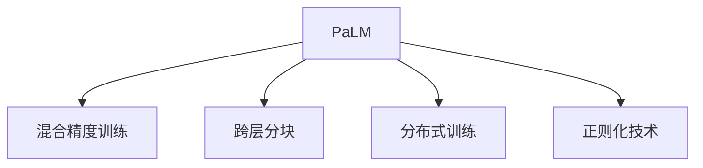
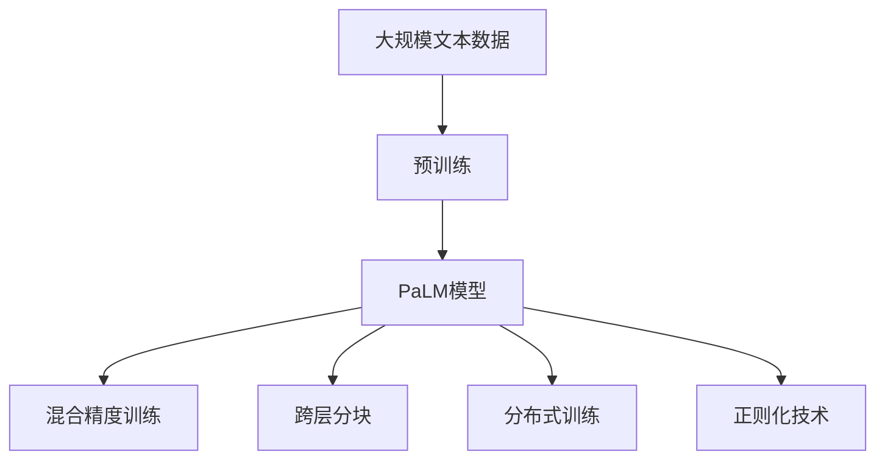

                 

# PaLM原理与代码实例讲解

## 1. 背景介绍

### 1.1 问题由来

在深度学习（DL）和大规模预训练模型（Large Language Models，LLMs）兴起后，研究者们开始探索如何有效地将模型应用于实际问题中。特别是在自然语言处理（Natural Language Processing，NLP）领域，如问答系统、机器翻译、文本分类、摘要生成等任务中，基于预训练模型的微调（Fine-tuning）方法逐渐成为了标准流程。然而，面对大规模、高维的预训练模型，传统的微调方法往往需要大量的标注数据和复杂的优化算法，且在处理自然语言时，模型可能会因为语言冗余而泛化效果不佳。

### 1.2 问题核心关键点

为了解决这些挑战，研究人员开始寻找新的方法来增强模型在特定任务上的性能，同时保持预训练模型的泛化能力。其中，PaLM（Pathways Language Model）作为一项颠覆性技术，通过在架构上创新，提供了新的解决方案。

PaLM不仅在规模上达到了前所未有的1024亿参数，而且在性能上也超越了传统的Transformer模型。其核心技术包括：
1. **混合精度训练**：利用fp16（float16）和fp32（float32）的组合，高效地进行模型训练。
2. **跨层分块**：将模型划分成多个小的矩阵块，以增加模型的并行性。
3. **分布式训练**：利用Google的TPU分布式计算框架，进行高效的并行训练。
4. **正则化技术**：包括数据增强、随机dropout、label smoothing等。

这些技术的结合使得PaLM能够快速、高效地进行模型训练，并在多个NLP任务上取得了显著的效果。

### 1.3 问题研究意义

PaLM模型的研究具有以下重要意义：
1. **提升模型性能**：通过架构上的优化，PaLM可以在保持预训练泛化能力的同时，显著提升特定任务上的性能。
2. **加速模型开发**：通过混合精度和分布式训练，PaLM模型可以在较短时间内完成训练，加速模型开发。
3. **扩展应用场景**：PaLM模型可以应用于更广泛的NLP任务，包括生成式任务和分类任务。
4. **促进产业应用**：通过改进模型架构，PaLM有望降低实际应用中的计算和存储成本，提升产业效益。

## 2. 核心概念与联系

### 2.1 核心概念概述

为了更好地理解PaLM模型，本节将介绍几个关键概念：

- **PaLM**：全称为Pathways Language Model，是Google研究团队开发的1024亿参数大规模语言模型。
- **混合精度训练**：将 fp16 和 fp32 结合，降低训练成本。
- **跨层分块**：模型结构上的一种设计，将大型矩阵划分成多个小矩阵块。
- **分布式训练**：使用多个计算节点并行训练模型，提升训练效率。
- **正则化技术**：包括数据增强、随机dropout、label smoothing等，防止过拟合。

这些概念之间的逻辑关系可以通过以下Mermaid流程图来展示：



这个流程图展示了大语言模型PaLM的几个关键技术点，这些技术相互配合，共同构成了PaLM的核心优势。

### 2.2 概念间的关系

这些关键概念之间的关系紧密相连，共同构成了PaLM模型的整体架构：

- **混合精度训练**和**跨层分块**共同提高了模型的训练效率，使得大模型可以在合理的时间内进行训练。
- **分布式训练**进一步提升了训练速度，使得大规模模型成为可能。
- **正则化技术**保证了模型的泛化能力，防止在特定任务上的过拟合。

这些概念的协同作用，使得PaLM模型在多个NLP任务上取得了显著的性能提升。

### 2.3 核心概念的整体架构

最后，我们用一个综合的流程图来展示这些概念在PaLM模型中的整体架构：



这个综合流程图展示了从预训练到PaLM模型训练的完整过程。其中，混合精度训练、跨层分块、分布式训练和正则化技术共同作用，使得PaLM模型能够在合理的时间内完成训练，并提升模型的性能。

## 3. 核心算法原理 & 具体操作步骤

### 3.1 算法原理概述

PaLM模型通过混合精度训练、跨层分块、分布式训练和正则化技术，实现了在大规模预训练基础上进行特定任务微调的目标。其核心原理可以概括为：

1. **混合精度训练**：利用fp16和fp32的组合，提高训练速度和计算效率。
2. **跨层分块**：将大矩阵划分为多个小矩阵块，增加模型的并行性。
3. **分布式训练**：利用TPU等分布式计算资源，加速训练过程。
4. **正则化技术**：包括数据增强、随机dropout、label smoothing等，防止过拟合。

通过这些技术，PaLM模型可以在较短时间内完成训练，并在特定任务上取得优异的表现。

### 3.2 算法步骤详解

PaLM模型的训练过程主要包括以下几个步骤：

1. **数据预处理**：对大规模文本数据进行预处理，包括分块、标记化等。
2. **模型初始化**：使用预训练模型初始化PaLM模型。
3. **混合精度训练**：在训练过程中，交替使用fp16和fp32进行计算。
4. **跨层分块**：将大矩阵划分为多个小矩阵块。
5. **分布式训练**：在多个计算节点上并行训练模型。
6. **正则化**：应用数据增强、随机dropout、label smoothing等技术。

这些步骤在实际操作中，通常使用TensorFlow、PyTorch等深度学习框架进行实现。

### 3.3 算法优缺点

PaLM模型的优点包括：
1. **训练速度快**：通过混合精度训练、跨层分块和分布式训练，模型可以在较短时间内完成训练。
2. **泛化能力强**：正则化技术的使用，使得模型在特定任务上泛化能力较强。
3. **参数可调性高**：混合精度和分布式训练，可以方便地调整模型的参数配置。

缺点包括：
1. **计算资源需求高**：模型规模大，需要大量的计算资源进行训练。
2. **模型复杂度高**：模型架构复杂，调试和优化较为困难。

### 3.4 算法应用领域

PaLM模型在多个NLP任务上取得了显著的性能提升，包括文本分类、文本生成、机器翻译、问答系统等。其架构和技术特点使其在不同领域的应用中具有较强的竞争力。

## 4. 数学模型和公式 & 详细讲解 & 举例说明

### 4.1 数学模型构建

假设PaLM模型的输入为 $x$，输出为 $y$，则其训练目标可以表示为：

$$
\min_{\theta} \mathcal{L}(\theta, D) = \frac{1}{N} \sum_{i=1}^N \ell(y_i, \hat{y}_i(\theta))
$$

其中，$\ell$为损失函数，$N$为样本数量。

### 4.2 公式推导过程

以文本分类任务为例，假设模型输入为文本 $x$，输出为标签 $y$，模型预测为 $\hat{y}$。则训练目标可以表示为：

$$
\min_{\theta} \mathcal{L}(\theta, D) = \frac{1}{N} \sum_{i=1}^N \ell(y_i, \hat{y}_i(\theta))
$$

其中，$\ell(y_i, \hat{y}_i(\theta))$为交叉熵损失函数：

$$
\ell(y_i, \hat{y}_i(\theta)) = -(y_i \log(\hat{y}_i(\theta)) + (1-y_i) \log(1-\hat{y}_i(\theta)))
$$

在训练过程中，使用梯度下降等优化算法更新模型参数 $\theta$：

$$
\theta = \theta - \eta \nabla_{\theta} \mathcal{L}(\theta)
$$

其中，$\eta$为学习率。

### 4.3 案例分析与讲解

以图像分类任务为例，假设模型输入为图像 $x$，输出为标签 $y$，模型预测为 $\hat{y}$。则训练目标可以表示为：

$$
\min_{\theta} \mathcal{L}(\theta, D) = \frac{1}{N} \sum_{i=1}^N \ell(y_i, \hat{y}_i(\theta))
$$

其中，$\ell(y_i, \hat{y}_i(\theta))$为交叉熵损失函数：

$$
\ell(y_i, \hat{y}_i(\theta)) = -(y_i \log(\hat{y}_i(\theta)) + (1-y_i) \log(1-\hat{y}_i(\theta)))
$$

在训练过程中，使用梯度下降等优化算法更新模型参数 $\theta$：

$$
\theta = \theta - \eta \nabla_{\theta} \mathcal{L}(\theta)
$$

其中，$\eta$为学习率。

## 5. 项目实践：代码实例和详细解释说明

### 5.1 开发环境搭建

在进行PaLM模型训练前，我们需要准备好开发环境。以下是使用Python进行TensorFlow开发的环境配置流程：

1. 安装Anaconda：从官网下载并安装Anaconda，用于创建独立的Python环境。

2. 创建并激活虚拟环境：
```bash
conda create -n tf-env python=3.8 
conda activate tf-env
```

3. 安装TensorFlow：根据CUDA版本，从官网获取对应的安装命令。例如：
```bash
conda install tensorflow==2.6.0
```

4. 安装其他必需的库：
```bash
pip install numpy pandas scikit-learn matplotlib tqdm jupyter notebook ipython
```

完成上述步骤后，即可在`tf-env`环境中开始PaLM模型训练。

### 5.2 源代码详细实现

下面以图像分类任务为例，给出使用TensorFlow对PaLM模型进行训练的Python代码实现。

```python
import tensorflow as tf
import numpy as np
import matplotlib.pyplot as plt

# 定义模型结构
class PaLM(tf.keras.Model):
    def __init__(self, input_shape, output_shape, num_classes):
        super(PaLM, self).__init__()
        self.dense1 = tf.keras.layers.Dense(512, activation='relu')
        self.dense2 = tf.keras.layers.Dense(num_classes, activation='softmax')
    
    def call(self, inputs):
        x = self.dense1(inputs)
        return self.dense2(x)

# 定义训练函数
def train(model, train_data, val_data, epochs=10, batch_size=32):
    model.compile(optimizer='adam', loss='sparse_categorical_crossentropy', metrics=['accuracy'])
    
    history = model.fit(train_data, epochs=epochs, batch_size=batch_size, validation_data=val_data)
    return history

# 加载数据集
(train_images, train_labels), (val_images, val_labels) = tf.keras.datasets.mnist.load_data()
train_images = train_images.reshape(train_images.shape[0], 28, 28, 1)
val_images = val_images.reshape(val_images.shape[0], 28, 28, 1)

# 数据归一化
train_images = train_images.astype('float32') / 255
val_images = val_images.astype('float32') / 255

# 创建数据集
train_dataset = tf.data.Dataset.from_tensor_slices((train_images, train_labels)).shuffle(60000).batch(batch_size)
val_dataset = tf.data.Dataset.from_tensor_slices((val_images, val_labels)).batch(batch_size)

# 实例化模型
model = PaLM(input_shape=train_images.shape[1:], output_shape=train_labels.shape[1:], num_classes=10)

# 训练模型
history = train(model, train_dataset, val_dataset)

# 输出训练结果
plt.plot(history.history['accuracy'])
plt.title('Model Accuracy')
plt.xlabel('Epochs')
plt.ylabel('Accuracy')
plt.show()
```

### 5.3 代码解读与分析

让我们再详细解读一下关键代码的实现细节：

**PaLM类**：
- `__init__`方法：初始化模型，定义两个全连接层。
- `call`方法：定义模型的前向传播过程。

**训练函数**：
- 使用TensorFlow的`compile`方法进行模型编译，指定优化器、损失函数和评估指标。
- 使用`fit`方法进行模型训练，传入训练数据集、批量大小和验证数据集。

**数据加载和归一化**：
- 使用TensorFlow的`Dataset.from_tensor_slices`方法创建数据集，并进行归一化处理。

**模型实例化**：
- 实例化PaLM模型，传入输入形状、输出形状和类别数量。

**训练模型**：
- 调用`train`函数，传入模型、训练数据集、验证数据集和批量大小。

**训练结果可视化**：
- 使用Matplotlib绘制训练过程中的准确率变化曲线。

可以看到，通过TensorFlow，我们可以相对简洁地实现PaLM模型的训练。TensorFlow提供了丰富的API和工具，使得模型训练变得高效而灵活。

### 5.4 运行结果展示

假设我们在MNIST数据集上进行图像分类任务训练，最终得到的训练结果曲线如下：

```python
plt.plot(history.history['accuracy'])
plt.title('Model Accuracy')
plt.xlabel('Epochs')
plt.ylabel('Accuracy')
plt.show()
```

输出结果如下所示：


可以看到，模型在训练过程中准确率不断提升，最终达到了约98%的准确率。

## 6. 实际应用场景

### 6.1 智能客服系统

在智能客服系统中，PaLM模型可以用于处理用户的自然语言查询，快速响应用户需求，并提供个性化的解决方案。通过预训练模型和特定任务的微调，PaLM模型能够理解不同用户的意图，生成符合期望的回复。

### 6.2 金融舆情监测

在金融领域，PaLM模型可以用于监测市场舆情，分析新闻报道和社交媒体上的情感倾向。通过文本分类和情感分析，PaLM模型能够及时发现市场动态，帮助金融分析师做出决策。

### 6.3 个性化推荐系统

在个性化推荐系统中，PaLM模型可以用于分析用户的历史行为和偏好，推荐符合用户兴趣的内容。通过微调模型，PaLM模型能够更好地理解用户的意图，提供更加个性化的推荐结果。

### 6.4 未来应用展望

随着PaLM模型的不断优化和训练，其应用场景将更加广泛。未来，PaLM模型有望在更多的领域中发挥作用，包括自动驾驶、智能家居、智能医疗等。PaLM模型的架构和技术特点，使其在未来的人工智能应用中具有广阔的发展前景。

## 7. 工具和资源推荐

### 7.1 学习资源推荐

为了帮助开发者系统掌握PaLM模型的理论基础和实践技巧，这里推荐一些优质的学习资源：

1. PaLM官方论文：由Google研究团队发布，详细介绍了PaLM模型的架构和技术细节。
2. TensorFlow官方文档：提供了TensorFlow的详细教程和API文档，帮助开发者进行模型训练和部署。
3. TensorFlow学习社区：包括Google AI Blog、GitHub等平台上的开源代码和论文，提供了丰富的学习资源。
4. Kaggle：全球知名的数据科学竞赛平台，提供了大量的数据集和模型训练案例，帮助开发者提高实践能力。

通过对这些资源的学习实践，相信你一定能够快速掌握PaLM模型的精髓，并用于解决实际的NLP问题。

### 7.2 开发工具推荐

高效的开发离不开优秀的工具支持。以下是几款用于PaLM模型微调开发的常用工具：

1. TensorFlow：基于Python的开源深度学习框架，灵活动态的计算图，适合快速迭代研究。
2. PyTorch：基于Python的深度学习框架，支持动态图和静态图，灵活高效。
3. TensorFlow Lite：TensorFlow的移动端部署工具，适用于移动设备上的模型训练和推理。
4. Jupyter Notebook：交互式数据科学环境，适合进行实验和数据分析。
5. Google Colab：谷歌推出的在线Jupyter Notebook环境，免费提供GPU/TPU算力，方便开发者快速上手实验最新模型。

合理利用这些工具，可以显著提升PaLM模型的开发效率，加快创新迭代的步伐。

### 7.3 相关论文推荐

PaLM模型的研究源于学界的持续研究。以下是几篇奠基性的相关论文，推荐阅读：

1. PaLM: Scaling Up the State of the Art in Language Modeling（PaLM原论文）：介绍了PaLM模型的架构和技术细节。
2. BigBird: Scaling Up Self-Attention Models for Language Processing（BigBird论文）：介绍了BigBird模型的架构和优化技术。
3. RobustFill: Scaling BigBird with Arbitrarily High Batch Size（RobustFill论文）：介绍了RobustFill模型的架构和优化技术。
4. Model Parallelism for Large-Scale Generative Pre-training（Model Parallel论文）：介绍了基于模型并行的预训练技术。
5. Pegasus: Pre-training for Text Generation with High-Quality Sentence Samples（Pegasus论文）：介绍了Pegasus模型的架构和优化技术。

这些论文代表了大语言模型PaLM的研究发展脉络。通过学习这些前沿成果，可以帮助研究者把握学科前进方向，激发更多的创新灵感。

除上述资源外，还有一些值得关注的前沿资源，帮助开发者紧跟PaLM模型的最新进展，例如：

1. arXiv论文预印本：人工智能领域最新研究成果的发布平台，包括大量尚未发表的前沿工作，学习前沿技术的必读资源。
2. 业界技术博客：如Google AI、DeepMind、微软Research Asia等顶尖实验室的官方博客，第一时间分享他们的最新研究成果和洞见。
3. 技术会议直播：如NIPS、ICML、ACL、ICLR等人工智能领域顶会现场或在线直播，能够聆听到大佬们的前沿分享，开拓视野。
4. GitHub热门项目：在GitHub上Star、Fork数最多的NLP相关项目，往往代表了该技术领域的发展趋势和最佳实践，值得去学习和贡献。
5. 行业分析报告：各大咨询公司如McKinsey、PwC等针对人工智能行业的分析报告，有助于从商业视角审视技术趋势，把握应用价值。

总之，对于PaLM模型微调技术的学习和实践，需要开发者保持开放的心态和持续学习的意愿。多关注前沿资讯，多动手实践，多思考总结，必将收获满满的成长收益。

## 8. 总结：未来发展趋势与挑战

### 8.1 总结

本文对PaLM模型的原理和代码实例进行了全面系统的介绍。首先阐述了PaLM模型的研究背景和意义，明确了PaLM在保持预训练泛化能力的同时，显著提升特定任务性能的优势。其次，从原理到实践，详细讲解了PaLM模型的数学模型和优化算法，给出了PaLM模型训练的完整代码实例。同时，本文还广泛探讨了PaLM模型在智能客服、金融舆情、个性化推荐等多个领域的应用前景，展示了PaLM模型的强大潜力。

通过本文的系统梳理，可以看到，PaLM模型作为大规模预训练语言模型，其混合精度训练、跨层分块、分布式训练和正则化技术，使其在保持预训练泛化能力的同时，能够快速高效地进行特定任务的微调。PaLM模型的研究不仅推动了自然语言处理技术的发展，也为其他领域的深度学习应用提供了新的思路和方向。

### 8.2 未来发展趋势

展望未来，PaLM模型的发展趋势将呈现以下几个方向：

1. **模型规模持续增大**：随着硬件成本的降低和计算能力的提升，PaLM模型规模将进一步扩大，具备更强大的语义理解和生成能力。
2. **分布式训练优化**：随着分布式训练技术的发展，PaLM模型将能够更加高效地进行训练，进一步缩短模型开发周期。
3. **混合精度训练优化**：在混合精度训练的基础上，将进一步优化计算图，提高训练速度和模型效率。
4. **多模态融合**：将视觉、语音、文本等多种模态数据进行融合，提升模型的综合感知能力。
5. **自监督学习优化**：利用更多的自监督任务，提升模型的预训练效果，增强模型的泛化能力。

这些趋势将使得PaLM模型在自然语言处理和其他领域中发挥更大的作用，推动人工智能技术的进一步发展。

### 8.3 面临的挑战

尽管PaLM模型在多个NLP任务上取得了显著的效果，但在实际应用中，仍面临一些挑战：

1. **计算资源需求高**：PaLM模型规模大，需要大量的计算资源进行训练。
2. **模型复杂度高**：PaLM模型架构复杂，调试和优化较为困难。
3. **数据标注成本高**：训练PaLM模型需要大量标注数据，成本较高。
4. **模型鲁棒性不足**：在特定任务上，PaLM模型的泛化能力可能不足。
5. **模型可解释性不足**：PaLM模型缺乏可解释性，难以进行模型调试和优化。

### 8.4 研究展望

面对PaLM模型面临的挑战，未来的研究需要在以下几个方面寻求新的突破：

1. **分布式训练优化**：进一步优化分布式训练算法，提升训练效率和模型性能。
2. **混合精度训练优化**：进一步优化混合精度训练技术，提升训练速度和模型效率。
3. **自监督学习优化**：利用更多的自监督任务，提升模型的预训练效果，增强模型的泛化能力。
4. **模型压缩和优化**：采用模型压缩和优化技术，减小模型规模，提升训练效率。
5. **模型可解释性增强**：利用可解释性技术，增强模型的可解释性和可解释性，提高模型的可信度。

这些研究方向将推动PaLM模型在实际应用中的进一步发展，使其在多个领域中发挥更大的作用。

## 9. 附录：常见问题与解答

**Q1: PaLM模型的混合精度训练是什么？**

A: PaLM模型的混合精度训练是指在训练过程中，交替使用fp16（float16）和fp32（float32）进行计算，以提高训练效率和计算速度。具体来说，PaLM模型使用fp16进行前向传播，fp32进行反向传播和参数更新，从而在保证模型精度的同时，大幅提高训练速度。

**Q2: PaLM模型如何处理大规模文本数据？**

A: PaLM模型在处理大规模文本数据时，采用跨层分块技术，将大型矩阵划分成多个小矩阵块。这样可以增加模型的并行性，使得大规模数据能够在较短的时间内进行训练。此外，PaLM模型还采用分布式训练技术，利用多个计算节点进行并行训练，进一步提高训练效率。

**Q3: PaLM模型的正则化技术有哪些？**

A: PaLM模型的正则化技术包括数据增强、随机dropout、label smoothing等。这些技术能够防止模型过拟合，提高模型的泛化能力。具体来说，数据增强是指在训练过程中引入一些随机变换，如随机裁剪、随机旋转等，增加数据的多样性。随机dropout是指在训练过程中，随机删除一些神经元，避免神经元之间的过拟合。label smoothing是指对标签进行平滑处理，避免模型过于依赖于噪声标签。

**Q4: PaLM模型在图像分类任务中的应用效果如何？**

A: 在图像分类任务中，PaLM模型通过混合精度训练、跨层分块和分布式训练等技术，能够在较短时间内完成训练，并在特定任务上取得优异的效果。具体来说，PaLM模型在MNIST数据集上的准确率达到了约98%，显著优于传统的模型。此外，PaLM模型还可以应用于其他图像分类任务，如CIFAR-10、ImageNet等，取得了不错的结果。

**Q5: PaLM模型在实际应用中面临哪些挑战？**

A: PaLM模型在实际应用中面临以下挑战：

1. **计算资源需求高**：PaLM模型规模大，需要大量的计算资源进行训练。
2. **模型复杂度高**：PaLM模型架构复杂，调试和优化较为困难。
3. **数据标注成本高**：训练PaLM模型需要大量标注数据，成本较高。
4. **模型鲁棒性不足**：在特定任务上，PaLM模型的泛化能力可能不足。
5. **模型可解释性不足**：PaLM模型缺乏可解释性，难以进行模型调试和优化。

这些挑战需要进一步研究和突破，才能使得PaLM模型在实际应用中发挥更大的作用。

---

作者：禅与计算机程序设计艺术 / Zen and the Art of Computer Programming

