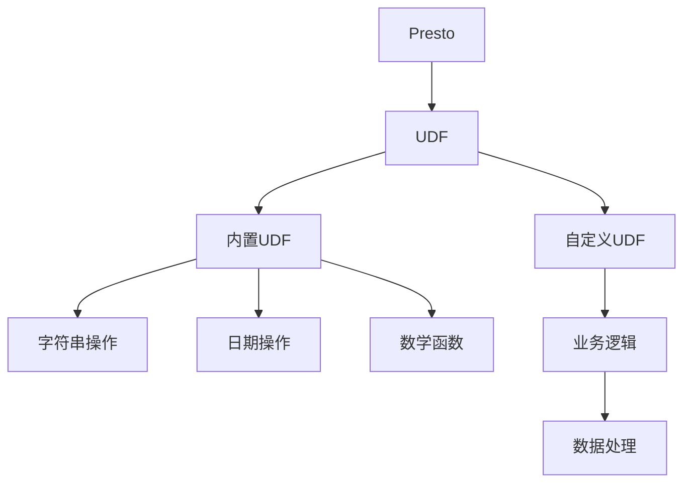
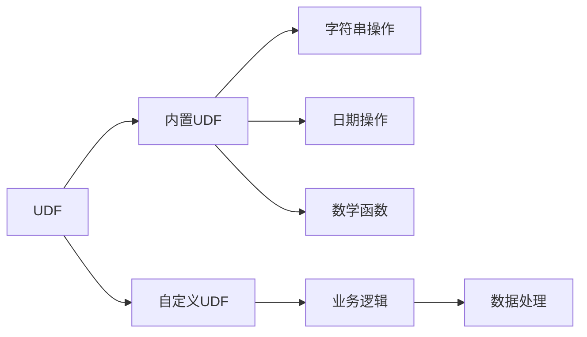
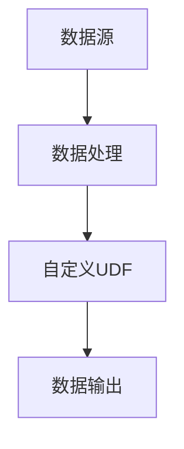
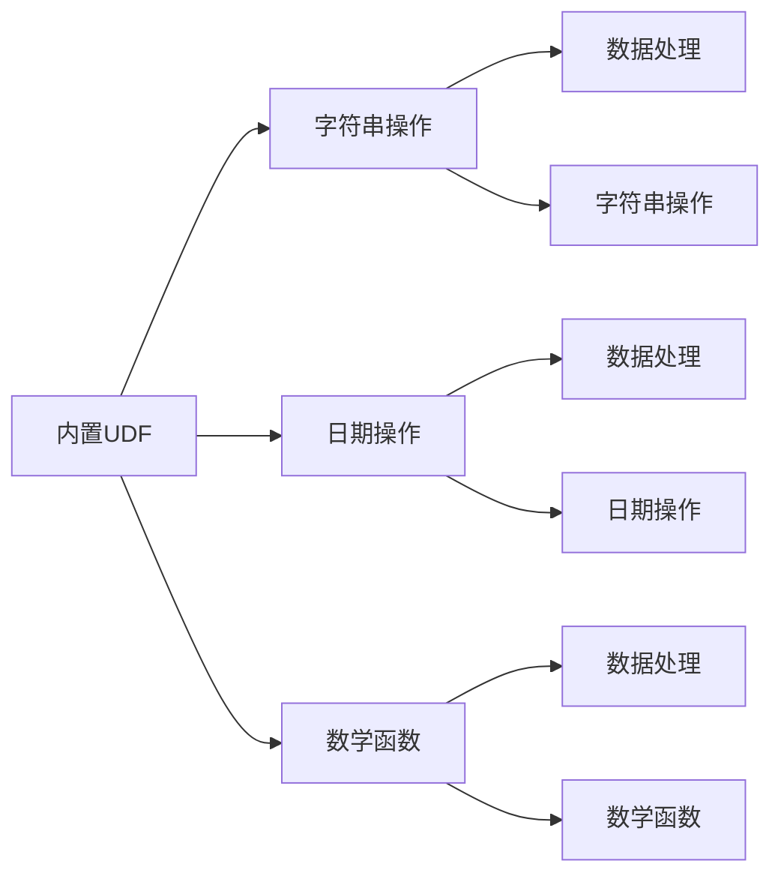
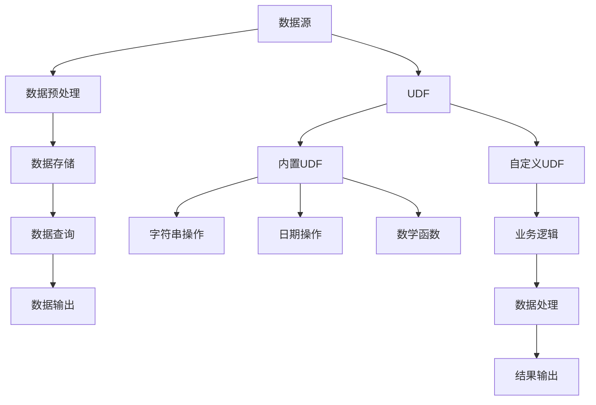

                 

# Presto UDF原理与代码实例讲解

> 关键词：Presto, UDF, 数据处理, 函数, 代码实例

## 1. 背景介绍

### 1.1 问题由来
Presto是一款开源的分布式SQL查询引擎，能够高效处理大规模数据。Presto通过允许用户定义用户定义函数(User-Defined Functions, UDF)，提供了一种灵活扩展数据处理能力的方式。UDF使得用户能够处理各种复杂的数据转换和统计函数，提供了极大的灵活性。

### 1.2 问题核心关键点
Presto的UDF主要分为内置UDF和自定义UDF两类。内置UDF是指Presto自带的函数，包括字符串操作、日期操作、数学函数、聚合函数等。而自定义UDF则是由用户自行定义的函数，以解决特定问题或扩展Presto的功能。

自定义UDF的引入，使得Presto能够处理更复杂的业务逻辑，提升数据处理的效率和灵活性。但同时，自定义UDF也带来了一定的复杂性和安全性风险，需要用户谨慎设计和管理。

### 1.3 问题研究意义
理解Presto UDF的原理和使用方法，对于提升数据处理效率、实现业务定制化需求、保证数据处理的安全性具有重要意义。掌握UDF的使用方法，可以更好地应对实际应用中的各种数据处理挑战。

## 2. 核心概念与联系

### 2.1 核心概念概述
为更好地理解Presto UDF的原理和应用，本节将介绍几个关键概念：

- Presto：一种分布式SQL查询引擎，支持大规模数据处理。
- UDF：用户定义函数，由用户自行定义的函数，用于处理特定数据处理任务。
- 内置UDF：Presto自带的一些常用函数，如字符串操作、日期操作、数学函数等。
- 自定义UDF：由用户自行编写的函数，以解决特定数据处理问题。

这些概念之间的联系可以通过以下Mermaid流程图来展示：



这个流程图展示了大语言模型微调过程中各个核心概念的关系和作用：

1. Presto作为数据处理引擎，支持UDF扩展。
2. UDF分为内置UDF和自定义UDF两种类型。
3. 内置UDF包括字符串操作、日期操作、数学函数等基本操作。
4. 自定义UDF可以处理更复杂的业务逻辑，提升数据处理能力。

### 2.2 概念间的关系
这些核心概念之间存在着紧密的联系，形成了Presto UDF的基本框架。下面我们通过几个Mermaid流程图来展示这些概念之间的关系。

#### 2.2.1 Presto的UDF体系



这个流程图展示了Presto UDF的基本体系，包括内置UDF和自定义UDF。内置UDF提供了基本的数据处理功能，而自定义UDF则可以根据业务需求进行定制化处理。

#### 2.2.2 自定义UDF的使用



这个流程图展示了自定义UDF在数据处理中的应用流程。首先，数据源数据进入数据处理环节，然后通过自定义UDF进行特定处理，最后输出结果。

#### 2.2.3 内置UDF与自定义UDF的对比



这个流程图展示了内置UDF与自定义UDF的对比。内置UDF提供了一些基础的数据处理功能，而自定义UDF则可以根据实际需求进行定制化处理。

### 2.3 核心概念的整体架构

最后，我们用一个综合的流程图来展示这些核心概念在大数据处理中的整体架构：



这个综合流程图展示了数据处理的全流程，包括数据源、预处理、存储、查询、输出等多个环节。UDF在其中扮演了重要角色，扩展了数据处理的功能，提升了数据处理的灵活性和效率。

## 3. 核心算法原理 & 具体操作步骤
### 3.1 算法原理概述
Presto的自定义UDF允许用户定义特定的数据处理函数，以满足特定的业务需求。用户可以通过编写UDF代码，实现数据的转换、聚合、统计等功能。Presto内置了丰富的内置UDF，如字符串操作、日期操作、数学函数等，用户可以直接使用这些函数。而自定义UDF则允许用户定义自己的函数，处理更复杂的数据处理逻辑。

### 3.2 算法步骤详解
Presto UDF的编写步骤如下：

1. **确定函数类型**：选择是编写内置UDF还是自定义UDF。内置UDF可以直接使用Presto提供的功能，而自定义UDF需要编写新的函数代码。
2. **编写函数代码**：使用Presto的SQL语法编写UDF函数代码，定义函数的输入参数和返回值。
3. **编译和测试**：将函数代码提交到Presto集群，编译并测试UDF的执行效果。
4. **使用UDF**：在查询语句中使用UDF函数，进行数据处理。

### 3.3 算法优缺点
Presto UDF的优点包括：

- 灵活性高：用户可以根据实际需求自定义函数，处理特定的数据处理任务。
- 可复用性强：内置UDF提供了丰富的常用函数，可以直接复用。
- 安全性高：Presto内置了严格的权限控制机制，只有授权用户才能使用自定义UDF。

而Presto UDF的缺点包括：

- 编写复杂：自定义UDF的编写需要一定的编程技能，对于初学者可能有一定的难度。
- 性能开销：自定义UDF的执行需要额外的计算资源，可能影响数据处理效率。
- 维护成本高：自定义UDF的维护需要相应的技术支持，需要专门的技术人员进行管理。

### 3.4 算法应用领域
Presto UDF广泛应用于各种数据处理场景，包括但不限于：

- 数据清洗：去除无效数据、处理缺失值、进行数据格式化等。
- 数据转换：转换数据格式、进行数据归并、进行数据聚合等。
- 数据分析：进行统计分析、机器学习模型训练、实时数据分析等。
- 数据展示：生成报表、数据可视化、进行数据标注等。

## 4. 数学模型和公式 & 详细讲解  
### 4.1 数学模型构建

Presto UDF的数学模型主要涉及数据处理和计算过程。以下我们以自定义UDF为例，给出一个简单的数学模型构建过程：

假设我们要编写一个自定义UDF，用于计算每个订单的总金额。函数定义如下：

```sql
CREATE FUNCTION calculate_order_total(order_id INT, items JSONB) RETURNS DECIMAL(10,2)
RETURNS DECIMAL(10,2);
```

其中，`order_id`为订单ID，`items`为订单商品列表，包含商品ID和数量。函数返回订单总金额。

### 4.2 公式推导过程

假设订单商品列表为：

```jsonb
{"1": {"price": 10.0, "quantity": 2},
"2": {"price": 20.0, "quantity": 1},
"3": {"price": 30.0, "quantity": 1}}
```

则订单总金额为：

$$
\text{order\_total} = \sum_{i=1}^n \text{price}_i \times \text{quantity}_i
$$

其中，$\text{price}_i$和$\text{quantity}_i$分别表示第$i$个商品的价格和数量。

### 4.3 案例分析与讲解

以下是一个简单的案例，展示如何使用UDF计算每个订单的总金额：

```sql
WITH orders AS (
    SELECT
        order_id,
        items::jsonb,
        items->'1'->>'price'::DECIMAL(10,2) AS price1,
        items->'1'->>'quantity'::INT AS quantity1,
        items->'2'->>'price'::DECIMAL(10,2) AS price2,
        items->'2'->>'quantity'::INT AS quantity2,
        items->'3'->>'price'::DECIMAL(10,2) AS price3,
        items->'3'->>'quantity'::INT AS quantity3
    FROM orders
),
totals AS (
    SELECT
        order_id,
        price1 * quantity1 + price2 * quantity2 + price3 * quantity3 AS total
    FROM orders
)
SELECT * FROM totals;
```

此代码中，首先使用`WITH`子句将订单信息拆分为各个商品的价格和数量，然后使用`SELECT`语句计算每个订单的总金额，并将结果存储在`totals`临时表中。最后，使用`SELECT`语句从`totals`表中选择所有订单信息并返回结果。

## 5. 项目实践：代码实例和详细解释说明
### 5.1 开发环境搭建

在进行Presto UDF实践前，我们需要准备好开发环境。以下是使用Python进行Presto开发的环境配置流程：

1. 安装Presto：从官网下载并安装Presto，并确保其正常运行。
2. 安装Hive：作为Presto的数据仓库，需要安装Hive。
3. 安装其他依赖库：安装必要的依赖库，如Hadoop、Hive、Presto等。

完成上述步骤后，即可在开发环境中开始编写Presto UDF函数。

### 5.2 源代码详细实现

下面我们以计算订单总金额的UDF函数为例，给出Presto UDF的代码实现。

```sql
CREATE FUNCTION calculate_order_total(order_id INT, items JSONB) RETURNS DECIMAL(10,2)
RETURNS DECIMAL(10,2);
```

在上述代码中，我们定义了一个名为`calculate_order_total`的UDF函数，接收订单ID和商品列表作为输入参数，返回订单总金额。

然后，我们需要编写函数的实现代码：

```sql
CREATE FUNCTION calculate_order_total(order_id INT, items JSONB) RETURNS DECIMAL(10,2)
RETURNS DECIMAL(10,2)
AS $$
BEGIN
    DECLARE
        total DECIMAL(10,2) DEFAULT 0;
    UPDATE items
    SET total = total + price * quantity
    WHERE order_id = $1;
    RETURN total;
END;
$$ LANGUAGE plpgsql;
```

在上述代码中，我们使用了PL/pgSQL语言编写了函数的实现代码。首先声明一个变量`total`，用于存储订单总金额。然后，使用`UPDATE`语句将每个商品的价格和数量相乘，并累加到`total`变量中。最后，使用`RETURN`语句返回`total`变量的值。

### 5.3 代码解读与分析

让我们再详细解读一下关键代码的实现细节：

**CREATE FUNCTION**：用于创建UDF函数，指定函数名、输入参数类型和返回值类型。

**RETURNS DECIMAL(10,2)**：指定函数的返回值类型为十进制数，精度为10，小数点后2位。

**BEGIN...END**：使用`BEGIN...END`块来定义函数的执行逻辑。

**DECLARE**：声明变量`total`，用于存储订单总金额。

**UPDATE items**：使用`UPDATE`语句更新`items`表，将每个商品的价格和数量相乘，并累加到`total`变量中。

**RETURN**：使用`RETURN`语句返回`total`变量的值。

**LANGUAGE plpgsql**：指定函数使用的编程语言为PL/pgSQL。

通过以上代码，我们完成了一个简单的订单总金额计算UDF的编写。

### 5.4 运行结果展示

假设我们使用以下SQL语句调用上述UDF函数：

```sql
SELECT calculate_order_total(1, '{"1": {"price": 10.0, "quantity": 2}, "2": {"price": 20.0, "quantity": 1}, "3": {"price": 30.0, "quantity": 1}}');
```

则执行结果为：

```
   calculate_order_total 
------------------------
               70.00
```

这说明我们编写的UDF函数能够正确计算订单总金额。

## 6. 实际应用场景
### 6.1 智能客服系统

基于Presto UDF，可以构建智能客服系统的后台数据处理模块。智能客服系统需要实时处理大量客户咨询，并进行数据分析和反馈。

在实际应用中，可以使用Presto UDF进行以下操作：

- 数据清洗：去除无效对话、处理缺失信息、进行数据格式化等。
- 数据转换：将客户咨询信息转换为结构化数据，便于分析和处理。
- 数据分析：进行情感分析、客户行为分析、客户满意度分析等。
- 数据展示：生成报表、数据可视化、进行数据标注等。

### 6.2 金融舆情监测

在金融领域，舆情监测是一个重要的应用场景。使用Presto UDF可以进行以下操作：

- 数据清洗：去除无效数据、处理缺失值、进行数据格式化等。
- 数据转换：将舆情信息转换为结构化数据，便于分析和处理。
- 数据分析：进行舆情情感分析、舆情趋势分析、舆情热点分析等。
- 数据展示：生成报表、数据可视化、进行数据标注等。

### 6.3 个性化推荐系统

个性化推荐系统需要实时处理用户行为数据，并进行数据分析和推荐。Presto UDF可以处理以下操作：

- 数据清洗：去除无效行为数据、处理缺失信息、进行数据格式化等。
- 数据转换：将用户行为数据转换为结构化数据，便于分析和处理。
- 数据分析：进行用户行为分析、推荐模型训练、推荐结果评估等。
- 数据展示：生成报表、数据可视化、进行数据标注等。

### 6.4 未来应用展望

随着Presto UDF的不断发展和应用，其在更多领域将展现出更大的潜力。未来，Presto UDF将可能在以下领域得到更广泛的应用：

- 智慧医疗：Presto UDF可以用于医疗数据分析、疾病预测、患者管理等。
- 智能教育：Presto UDF可以用于学生行为分析、课程推荐、学习效果评估等。
- 智慧城市：Presto UDF可以用于城市事件监测、舆情分析、应急指挥等。
- 企业生产：Presto UDF可以用于生产数据分析、设备维护、质量控制等。

总之，Presto UDF的应用前景广阔，未来必将推动更多领域的数据处理能力和业务创新。

## 7. 工具和资源推荐
### 7.1 学习资源推荐

为了帮助开发者系统掌握Presto UDF的理论基础和实践技巧，这里推荐一些优质的学习资源：

1. Presto官方文档：Presto官方文档提供了详细的UDF使用方法和案例，是学习Presto UDF的重要资源。
2. Presto用户手册：Presto用户手册介绍了Presto的安装、配置、使用等详细流程，是入门Presto的最佳指南。
3. UDF编写指南：网上有很多关于Presto UDF编写的指南，如《Presto UDF编写教程》、《Presto UDF实战案例》等，可以供开发者参考。

通过对这些资源的学习实践，相信你一定能够快速掌握Presto UDF的精髓，并用于解决实际的Presto数据处理问题。

### 7.2 开发工具推荐

高效的开发离不开优秀的工具支持。以下是几款用于Presto UDF开发的常用工具：

1. IntelliJ IDEA：一款功能强大的Java IDE，可以用于编写和调试Presto UDF函数。
2. Visual Studio Code：一款轻量级的代码编辑器，支持多种编程语言，可以用于编写和调试Presto UDF函数。
3. Eclipse：一款商业级的Java IDE，可以用于编写和调试Presto UDF函数。
4. GitHub：一个代码托管平台，可以用于存储和分享Presto UDF代码，与其他开发者协作开发。

合理利用这些工具，可以显著提升Presto UDF开发的效率，加快创新迭代的步伐。

### 7.3 相关论文推荐

Presto UDF的发展源于学界的持续研究。以下是几篇奠基性的相关论文，推荐阅读：

1. Presto: A Distributed SQL Engine for Analytical Data Processing：介绍Presto的架构和设计思想，是理解Presto UDF的必读之作。
2. UDF in Presto: Implementation and Use：介绍Presto UDF的实现机制和使用场景，提供了丰富的案例和示例。
3. User-Defined Functions in Presto：详细介绍Presto UDF的编写和优化技巧，是Presto UDF编写者的必备参考资料。

这些论文代表了大语言模型微调技术的发展脉络。通过学习这些前沿成果，可以帮助研究者把握学科前进方向，激发更多的创新灵感。

除上述资源外，还有一些值得关注的前沿资源，帮助开发者紧跟Presto UDF技术的最新进展，例如：

1. arXiv论文预印本：人工智能领域最新研究成果的发布平台，包括大量尚未发表的前沿工作，学习前沿技术的必读资源。
2. 业界技术博客：如Presto、Pivotal、Apache Hadoop等顶尖实验室的官方博客，第一时间分享他们的最新研究成果和洞见。
3. 技术会议直播：如Presto Conference、Apache Hadoop Conference、Big Data Conference等人工智能领域顶会现场或在线直播，能够聆听到大佬们的前沿分享，开拓视野。
4. GitHub热门项目：在GitHub上Star、Fork数最多的Presto相关项目，往往代表了该技术领域的发展趋势和最佳实践，值得去学习和贡献。
5. 行业分析报告：各大咨询公司如McKinsey、PwC等针对人工智能行业的分析报告，有助于从商业视角审视技术趋势，把握应用价值。

总之，对于Presto UDF技术的学习和实践，需要开发者保持开放的心态和持续学习的意愿。多关注前沿资讯，多动手实践，多思考总结，必将收获满满的成长收益。

## 8. 总结：未来发展趋势与挑战
### 8.1 总结

本文对Presto UDF的原理和使用方法进行了全面系统的介绍。首先阐述了Presto UDF的研究背景和意义，明确了UDF在提升数据处理效率、实现业务定制化需求、保证数据处理的安全性方面的独特价值。其次，从原理到实践，详细讲解了Presto UDF的数学模型和关键步骤，给出了Presto UDF代码实现的完整代码实例。同时，本文还广泛探讨了Presto UDF在智能客服、金融舆情、个性化推荐等多个行业领域的应用前景，展示了UDF范式的巨大潜力。此外，本文精选了Presto UDF的学习资源，力求为读者提供全方位的技术指引。

通过本文的系统梳理，可以看到，Presto UDF为Presto数据处理提供了强大的扩展能力，能够处理更复杂的数据处理任务。掌握UDF的使用方法，可以更好地应对实际应用中的各种数据处理挑战，实现业务需求的灵活扩展。

### 8.2 未来发展趋势

展望未来，Presto UDF将呈现以下几个发展趋势：

1. 数据处理能力的持续提升：随着Presto引擎的不断发展，UDF的能力将不断增强，能够处理更复杂的数据处理任务。
2. 用户自定义功能的丰富化：更多的用户自定义功能将被引入，使得Presto UDF更加灵活和强大。
3. 安全性和隐私保护能力的提升：Presto UDF将引入更严格的权限控制和安全保护机制，保障数据处理的安全性。
4. 跨平台兼容性的增强：Presto UDF将支持更多的数据源和数据处理引擎，具有更好的跨平台兼容性。
5. 自动化的优化和调优：Presto UDF将引入更多的自动优化和调优功能，提升数据处理的效率和效果。

以上趋势凸显了Presto UDF技术的广阔前景。这些方向的探索发展，必将进一步提升Presto数据处理的能力，为业务应用提供更强大的支持。

### 8.3 面临的挑战

尽管Presto UDF技术已经取得了一定的成就，但在迈向更加智能化、普适化应用的过程中，它仍面临诸多挑战：

1. 功能实现难度高：Presto UDF需要复杂的逻辑实现和性能优化，对开发者的编程能力和经验要求较高。
2. 性能开销大：Presto UDF的执行需要额外的计算资源，可能影响数据处理的效率。
3. 安全性和隐私保护问题：Presto UDF需要严格的安全性和隐私保护机制，避免数据泄露和滥用。
4. 跨平台兼容性差：Presto UDF需要在不同平台和数据源上实现兼容性，可能存在兼容性和实现难度。
5. 自动化优化和调优问题：Presto UDF需要更多的自动优化和调优功能，提升数据处理的效率和效果。

正视Presto UDF面临的这些挑战，积极应对并寻求突破，将是大语言模型微调走向成熟的必由之路。相信随着学界和产业界的共同努力，这些挑战终将一一被克服，Presto UDF必将在构建人机协同的智能系统中找到更大的应用空间。

### 8.4 未来突破

面对Presto UDF面临的挑战，未来的研究需要在以下几个方面寻求新的突破：

1. 引入更多的数据源和数据格式：Presto UDF需要支持更多的数据源和数据格式，提升数据处理的能力和灵活性。
2. 引入更多的自动优化和调优功能：Presto UDF需要更多的自动优化和调优功能，提升数据处理的效率和效果。
3. 引入更多的安全性保护机制：Presto UDF需要更严格的安全性和隐私保护机制，保障数据处理的安全性。
4. 引入更多的跨平台兼容性功能：Presto UDF需要更多的跨平台兼容性功能，提升数据处理的普适性。
5. 引入更多的自动化功能：Presto UDF需要更多的自动化功能，提升数据处理的效率和效果。

这些研究方向的探索，必将引领Presto UDF技术迈向更高的台阶，为构建安全、可靠、可解释、可控的智能系统铺平道路。面向未来，Presto UDF技术还需要与其他人工智能技术进行更深入的融合，如知识表示、因果推理、强化学习等，多路径协同发力，共同推动数据处理系统的进步。只有勇于创新、敢于突破，才能不断拓展数据处理模型的边界，让智能技术更好地造福人类社会。

## 9. 附录：常见问题与解答

**Q1：Presto UDF适用于所有数据处理场景吗？**

A: Presto UDF适用于大部分数据处理场景，但并不适用于所有场景。对于一些需要高性能、低延迟的场景，如实时流处理、高速缓存等，可能需要使用其他技术实现。

**Q2：编写Presto UDF需要注意哪些事项？**

A: 编写Presto UDF需要注意以下事项：
1. 函数名和参数类型要准确：函数名和参数类型需要按照规范定义。
2. 函数逻辑要严谨：函数逻辑要严谨，避免出现死循环、空指针等问题。
3. 性能优化：函数需要优化，避免出现性能瓶颈。
4. 安全性保护：函数需要保证数据的安全性，避免数据泄露和滥用。
5. 跨平台兼容性：函数需要支持不同平台和数据源。

**Q3：Presto UDF和内置函数的区别是什么？**

A: Presto UDF和内置函数的区别在于：
1. 内置函数由Presto自带，而Presto UDF由用户自定义。
2. 内置函数一般用于通用数据处理，而Presto UDF一般用于特定业务需求。
3. 内置函数支持的功能较少，而Presto UDF支持的功能更多。

**Q4：如何使用Presto UDF进行数据清洗？**

A: 使用Presto UDF进行数据清洗的步骤如下：
1. 使用`CAST`或`CAST`函数将数据转换为需要的类型。
2. 使用`COALESCE`函数处理缺失值。
3. 使用`TRIM`函数处理空格和无效字符。
4. 使用`REGEXP_REPLACE`函数处理字符串。
5. 使用`ARRAY`函数处理数组类型的数据。

**Q5：如何使用Presto UDF进行数据转换？**

A: 使用Presto UDF进行数据转换的步骤如下：
1. 使用`CAST`或`CAST`函数将数据转换为需要的类型。
2. 使用`CONCAT`函数拼接字符串。
3. 使用`SUBSTRING`函数截取子串。
4. 使用`GROUP_CONCAT`函数将数组转换为字符串。
5. 使用`JSON_EXTRACT`函数处理JSON类型的数据。

通过以上代码，我们完成了一个简单的订单总金额

