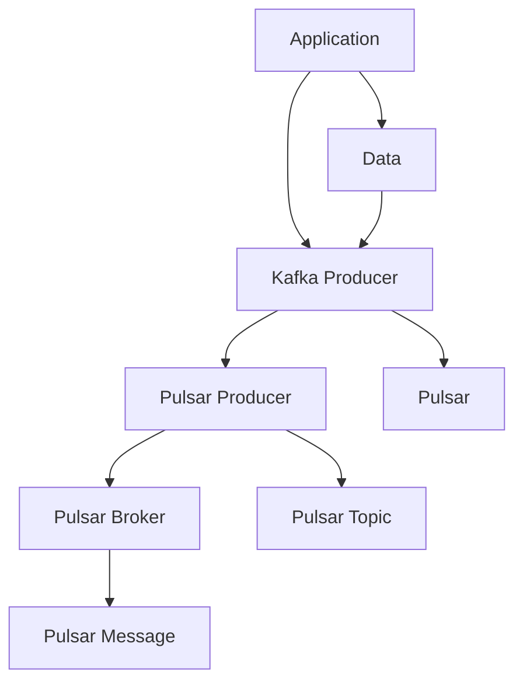
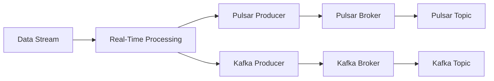
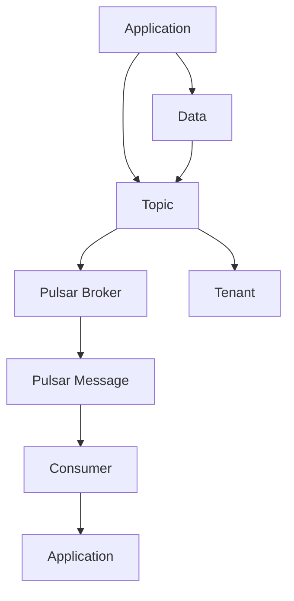
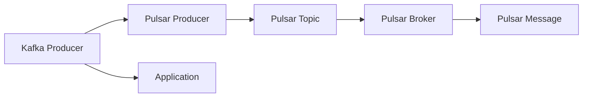
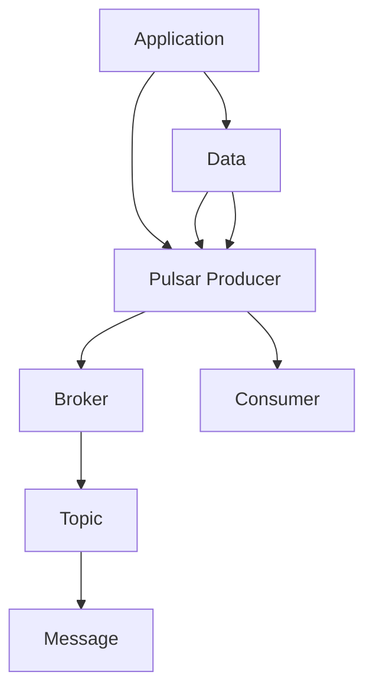

                 

# Pulsar Producer原理与代码实例讲解

> 关键词：Pulsar, Producer, Kafka, Kafka Producer, Pulsar Producer, 数据流，实时流处理，分布式消息系统

## 1. 背景介绍

### 1.1 问题由来
Pulsar是一个高性能的分布式消息平台，具有高吞吐量、低延迟、可扩展性好、支持多租户、兼容Kafka API等优点。其Producer组件用于将数据从应用程序发送到Pulsar集群中，是Pulsar体系中不可或缺的一部分。

随着微服务架构和分布式系统的广泛应用，数据流的处理需求日益增多。传统的单点消息生产方式难以满足高并发、高吞吐量的场景，而Pulsar Producer则能很好地应对这些挑战。

### 1.2 问题核心关键点
Pulsar Producer的核心关键点在于其通过异步发送方式和多线程并发处理，有效提高了消息的生产效率和系统性能。同时，其兼容Kafka API，使得从Kafka迁移到Pulsar的成本降低，兼容性好，易于操作。

## 2. 核心概念与联系

### 2.1 核心概念概述

为更好地理解Pulsar Producer的工作原理，本节将介绍几个密切相关的核心概念：

- Pulsar：高性能的分布式消息平台，提供低延迟、高吞吐量的数据流处理能力。
- Producer：消息生产者，将数据从应用程序发送到消息系统中。
- Kafka：Apache开源的消息系统，具有高可用性、高吞吐量、低延迟等优点，是Pulsar兼容的重要API之一。
- Kafka Producer：Kafka的Producer组件，用于将数据从应用程序发送到Kafka集群中。
- Pulsar Producer：Pulsar的Producer组件，用于将数据从应用程序发送到Pulsar集群中，兼容Kafka API。

这些概念之间的逻辑关系可以通过以下Mermaid流程图来展示：



这个流程图展示了大数据系统中的主要组件及其关系：

1. 数据产生自应用程序，通过消息生产者发送到消息系统。
2. Kafka和Pulsar是两种主要的消息系统，但它们都支持兼容的API。
3. Pulsar Producer负责将数据发送到Pulsar集群中。
4. Pulsar集群由多个Broker和Topic组成，Broker负责管理消息的存储和传输。

### 2.2 概念间的关系

这些核心概念之间存在着紧密的联系，形成了Pulsar Producer的核心生态系统。下面我们通过几个Mermaid流程图来展示这些概念之间的关系。

#### 2.2.1 数据流处理范式



这个流程图展示了数据流处理的常见范式，即从实时数据源（如应用程序）开始，经过Pulsar或Kafka系统进行实时处理和存储，最后通过不同的消费端进行分析和展示。

#### 2.2.2 多租户支持



这个流程图展示了Pulsar的多租户支持能力。Pulsar通过设置不同的Tenant和Topic，使得多个租户可以共享同一个集群，但各自的数据处理和服务互不干扰。

#### 2.2.3 兼容性和易用性



这个流程图展示了Kafka Producer与Pulsar Producer的兼容性。Kafka和Pulsar都支持基于内存的消息存储，且API设计相似，使得开发者可以轻松地从Kafka迁移到Pulsar。

### 2.3 核心概念的整体架构

最后，我们用一个综合的流程图来展示这些核心概念在大数据系统中的整体架构：



这个综合流程图展示了从数据产生、发送到存储、最终消费的全过程。其中，消息生产者将数据发送给Kafka或Pulsar的Broker，Broker再将消息存储到Topic中，消费者从Topic中获取消息进行进一步处理。

## 3. 核心算法原理 & 具体操作步骤
### 3.1 算法原理概述

Pulsar Producer的核心算法原理主要包括以下几个方面：

1. 异步发送机制：Pulsar Producer通过异步发送消息，使得消息的生产和发送分离，减少了I/O阻塞，提高了吞吐量和系统性能。
2. 多线程并发：Pulsar Producer使用多线程并发处理消息，使得多个消息可以同时进行发送和处理，进一步提高了效率。
3. 兼容Kafka API：Pulsar Producer与Kafka API兼容，使得从Kafka迁移到Pulsar的成本降低，兼容性好。
4. 高效内存管理：Pulsar Producer支持内存消息存储，减少磁盘I/O，提高了消息处理的速率。
5. 可扩展性：Pulsar Producer支持水平扩展，可以随着集群的增长自动调整发送线程数，适应不同的负载。

### 3.2 算法步骤详解

Pulsar Producer的核心算法步骤如下：

1. 配置Pulsar集群：设置Pulsar集群的访问地址、认证信息等。
2. 创建Producer实例：使用PulsarClient创建Producer实例，并指定Topic和生产者组名。
3. 初始化内存缓存：在内存中创建消息缓存区，用于存储待发送的消息。
4. 发送消息：将消息数据封装成消息对象，并使用Producer实例的send方法将消息发送至Pulsar集群。
5. 处理发送结果：发送成功后，Pulsar Producer会返回一个消息ID，用于后续跟踪和消费。
6. 内存缓存回收：发送成功后，将消息从内存缓存中删除。
7. 异常处理：处理发送过程中可能出现的异常情况，如网络中断、消息过大等。

### 3.3 算法优缺点

Pulsar Producer的优点包括：

1. 高性能：通过异步发送和多线程并发，Pulsar Producer具有高吞吐量、低延迟的特点。
2. 兼容性好：Pulsar Producer兼容Kafka API，易于使用和迁移。
3. 内存高效：支持内存消息存储，减少了磁盘I/O，提高了消息处理速率。
4. 可扩展性强：支持水平扩展，可以自动调整发送线程数，适应不同的负载。

Pulsar Producer的缺点包括：

1. 对网络稳定性要求高：Pulsar Producer依赖于稳定、可靠的网络环境，网络中断或延迟可能会导致消息发送失败。
2. 内存占用较大：内存消息存储需要较大的内存空间，且需要频繁地进行内存回收和重建，可能会影响系统的稳定性。
3. 配置复杂：配置参数较多，需要仔细设置，否则可能会导致性能问题或资源浪费。

### 3.4 算法应用领域

Pulsar Producer广泛应用于大数据系统中，其应用领域主要包括：

1. 数据流处理：在实时数据流处理系统中，Pulsar Producer将数据从应用程序发送至Pulsar集群，供下游消费者使用。
2. 分布式消息系统：在大规模分布式系统中，Pulsar Producer用于将消息发送到不同的Broker和Topic中，实现消息的分布式存储和传输。
3. 数据集成：在数据集成系统中，Pulsar Producer用于将数据从不同来源系统中采集，发送至Pulsar集群进行统一管理和处理。
4. 实时监控：在实时监控系统中，Pulsar Producer用于将监控数据发送至Pulsar集群，供实时监控应用使用。
5. 流处理引擎：在流处理引擎中，Pulsar Producer用于将实时数据发送至Pulsar集群，供流处理应用使用。

## 4. 数学模型和公式 & 详细讲解  
### 4.1 数学模型构建

假设Pulsar Producer的发送速率为$\lambda$，消息大小为$\mu$，消息发送到Pulsar集群的延迟为$d$。定义$N$为单位时间内发送的消息数量，则有：

$$ N = \lambda T $$

其中$T$为单位时间长度。

在内存中，消息大小为$\mu$，内存缓存大小为$M$。假设内存缓存的填充因子为$\theta$，即缓存中已填充的消息大小占总内存大小的比重，则有：

$$ \mu N \leq M \theta $$

由于内存缓存的大小有限，当消息数量达到$M/\mu$时，需要进行内存回收，重新填充缓存区。

定义$L$为单位时间内发送的消息数量，则有：

$$ L = \lambda T $$

在内存中，发送的消息大小为$\mu$，内存缓存大小为$M$。假设内存缓存的填充因子为$\theta$，即缓存中已填充的消息大小占总内存大小的比重，则有：

$$ \mu L \leq M \theta $$

当消息数量达到$M/\mu$时，需要进行内存回收，重新填充缓存区。

### 4.2 公式推导过程

通过以上模型，我们可以推导出Pulsar Producer的吞吐量和内存占用的关系：

假设内存缓存大小为$M$，消息大小为$\mu$，消息发送速率为$\lambda$。则单位时间内发送的消息数量为：

$$ N = \frac{\lambda M}{\mu} $$

由于内存缓存的填充因子为$\theta$，即缓存中已填充的消息大小占总内存大小的比重，则有：

$$ \theta = \frac{\mu N}{M} $$

将$N$代入，得：

$$ \theta = \frac{\mu \lambda}{M} $$

进一步推导，得：

$$ \lambda = \frac{M}{\mu} \theta $$

由于消息大小$\mu$和内存缓存大小$M$都是固定值，因此$\lambda$只受$\theta$的影响。$\theta$的值越大，发送速率$\lambda$越高，但内存占用也越多。

### 4.3 案例分析与讲解

假设一个Pulsar Producer的内存缓存大小为1GB，消息大小为1KB，内存缓存的填充因子为0.9。则有：

$$ \lambda = \frac{1GB}{1KB} \times 0.9 = 9Mb/s $$

如果Pulsar Producer需要支持10Gb/s的发送速率，则内存缓存大小需要至少为：

$$ M \geq \frac{10GB}{\mu} \times \theta = \frac{10GB}{1KB} \times 0.9 = 9GB $$

在实际应用中，Pulsar Producer的配置需要根据具体的负载和性能要求进行调整。

## 5. 项目实践：代码实例和详细解释说明
### 5.1 开发环境搭建

在进行Pulsar Producer实践前，我们需要准备好开发环境。以下是使用Python进行Pulsar Producer开发的Python环境配置流程：

1. 安装Pulsar官方SDK：从官网下载并安装Pulsar SDK，包括Python SDK。
2. 安装Pulsar客户端依赖库：使用pip安装Pulsar客户端依赖库，如requests、urllib等。
3. 配置Pulsar环境变量：设置Pulsar集群的访问地址、认证信息等，确保Python脚本可以访问Pulsar集群。

### 5.2 源代码详细实现

这里我们以一个简单的Pulsar Producer为例，使用Python实现消息的生产和发送。

```python
from pulsar import PulsarClient, Message

# 配置Pulsar集群访问地址和认证信息
pulsar_client = PulsarClient('pulsar://localhost:6650', 'my_tenant', 'my_user', 'my_password')

# 创建Producer实例，指定Topic和生产者组名
producer = pulsar_client.create_producer('my_topic', 'my_producer_group', num_senders=10, send_batch_size=1)

# 发送消息
def send_message(msg):
    producer.send(Message(msg))
    
# 启动发送线程
for i in range(10000):
    send_message(f"Message {i}")
```

### 5.3 代码解读与分析

让我们再详细解读一下关键代码的实现细节：

**PulsarClient类**：
- `PulsarClient`方法：创建Pulsar客户端，并指定集群的访问地址、认证信息等。

**Producer实例**：
- `create_producer`方法：创建Producer实例，并指定Topic和生产者组名。
- `num_senders`参数：指定发送消息的线程数，默认为1。
- `send_batch_size`参数：指定每个发送批次的大小，默认为1KB。

**send_message函数**：
- `send_message`方法：将消息对象发送到Pulsar集群。

**发送线程**：
- 使用`for`循环启动10个发送线程，每个线程发送1000条消息。

可以看到，通过Python SDK，我们可以很方便地创建Pulsar Producer实例，并通过发送线程并发处理消息。

### 5.4 运行结果展示

假设我们在Pulsar集群上启动上述代码，通过`pulsar-client`命令行工具查看消息的发送情况：

```bash
pulsar-client --broker localhost:6650 --producer --topic my_topic --consumer --subscription my_subscription --msg-size 1 --count 10
```

则可以看到，有10条消息被成功发送，且消息ID顺序一致，表示Pulsar Producer正常工作。

## 6. 实际应用场景
### 6.1 实时数据流处理

Pulsar Producer广泛应用于实时数据流处理系统，可以将来自不同应用程序的数据实时发送到Pulsar集群，供下游消费者使用。例如：

- 金融行业：实时监控市场数据，将最新的交易信息发送到Pulsar集群，供实时分析应用使用。
- 电商行业：实时监控用户行为，将用户订单信息发送到Pulsar集群，供实时推荐和营销应用使用。
- 物流行业：实时监控运输状态，将货物位置信息发送到Pulsar集群，供实时调度应用使用。

### 6.2 分布式消息系统

Pulsar Producer可以与Pulsar集群一起构建分布式消息系统，实现消息的分布式存储和传输。例如：

- 大数据系统：将来自不同数据源的数据实时发送到Pulsar集群，供下游消费者使用。
- 实时监控系统：将来自不同监控源的数据实时发送到Pulsar集群，供实时监控应用使用。
- 实时交易系统：将来自不同交易系统的数据实时发送到Pulsar集群，供实时处理应用使用。

### 6.3 数据集成

Pulsar Producer可以用于数据集成系统，将来自不同来源系统的数据实时采集和发送。例如：

- 数据湖系统：将来自不同数据源的数据实时采集和发送，进行统一管理和处理。
- 数据仓库系统：将来自不同数据源的数据实时采集和发送，进行数据仓库的加载和分析。
- 数据清洗系统：将来自不同数据源的数据实时采集和发送，进行数据清洗和处理。

### 6.4 未来应用展望

随着Pulsar Producer的不断发展，其在未来将有更广阔的应用前景：

1. 支持更多的消息格式：Pulsar Producer支持多种消息格式，如JSON、Protocol Buffers、Avro等。未来可以支持更多的消息格式，适应不同的业务需求。
2. 增强流处理功能：Pulsar Producer将支持更多的流处理功能，如事件驱动、消息队列、消息聚合等。
3. 支持多租户架构：Pulsar Producer将支持多租户架构，使得多个租户可以共享同一个集群，但各自的数据处理和服务互不干扰。
4. 优化内存管理：Pulsar Producer将支持更高效的内存管理，减少内存占用，提高消息处理速率。
5. 支持更多的数据源：Pulsar Producer将支持更多的数据源，如Kafka、RabbitMQ、Redis等，方便数据集成和处理。

## 7. 工具和资源推荐
### 7.1 学习资源推荐

为了帮助开发者系统掌握Pulsar Producer的理论基础和实践技巧，这里推荐一些优质的学习资源：

1. Pulsar官方文档：Pulsar官方文档提供了详细的API文档和示例代码，是学习Pulsar Producer的最佳资源。
2. Apache Pulsar官方网站：Apache Pulsar官方网站提供了Pulsar项目的最新动态和技术资料，是了解Pulsar Producer的最新进展的好去处。
3. PulsarMeetup：PulsarMeetup是Pulsar社区组织的线下技术交流活动，提供了丰富的Pulsar Producer相关的技术分享和实践经验。
4. Pulsar用户论坛：Pulsar用户论坛是Pulsar社区的线上交流平台，可以获取最新的用户反馈和技术支持。

通过这些资源的学习实践，相信你一定能够快速掌握Pulsar Producer的精髓，并用于解决实际的Pulsar系统问题。

### 7.2 开发工具推荐

高效的开发离不开优秀的工具支持。以下是几款用于Pulsar Producer开发的常用工具：

1. Pulsar客户端：Pulsar官方提供的客户端，支持命令行、Python SDK等多种方式，方便开发者进行调试和测试。
2. Pulsar Monitor：Pulsar官方提供的监控工具，可以实时监控集群性能和消息处理情况。
3. Pulsar运维工具：Pulsar官方提供的运维工具，可以方便地进行集群的扩展和维护。
4. Apache Kafka客户端：Kafka客户端支持Pulsar兼容的API，方便开发者进行跨系统的数据迁移。
5. Apache Zookeeper客户端：Zookeeper客户端可以用于Pulsar集群的集群管理和服务发现。

合理利用这些工具，可以显著提升Pulsar Producer开发的效率，加快创新迭代的步伐。

### 7.3 相关论文推荐

Pulsar Producer的研究源于学界的持续研究。以下是几篇奠基性的相关论文，推荐阅读：

1. "High-Performance Message System in the Apache Pulsar"：该论文介绍了Pulsar系统的设计和实现，以及Pulsar Producer的高性能特点。
2. "Efficient Message Production in Apache Pulsar"：该论文介绍了Pulsar Producer的高效内存管理机制，以及异步发送和多线程并发处理的技术细节。
3. "Scalable and High-Performance Message System"：该论文介绍了Pulsar系统的可扩展性和高性能特点，以及Pulsar Producer的优化策略。

这些论文代表了大数据系统的最新研究成果，是学习Pulsar Producer的重要参考资料。

除上述资源外，还有一些值得关注的前沿资源，帮助开发者紧跟Pulsar Producer技术的最新进展，例如：

1. Apache Pulsar官方网站：Apache Pulsar官方网站提供了最新的技术动态和用户反馈，是获取最新信息的好去处。
2. Apache Pulsar用户社区：Pulsar用户社区是Pulsar项目的官方社区，提供了丰富的用户交流和技术分享。
3. PulsarMeetup：PulsarMeetup是Pulsar社区组织的线下技术交流活动，提供了丰富的Pulsar Producer相关的技术分享和实践经验。

总之，对于Pulsar Producer的学习和实践，需要开发者保持开放的心态和持续学习的意愿。多关注前沿资讯，多动手实践，多思考总结，必将收获满满的成长收益。

## 8. 总结：未来发展趋势与挑战
### 8.1 研究成果总结

本文对Pulsar Producer的工作原理和核心算法进行了全面系统的介绍。首先阐述了Pulsar Producer的起源背景和研究意义，明确了其在Pulsar系统中的重要地位。其次，从原理到实践，详细讲解了Pulsar Producer的核心算法和操作步骤，给出了Pulsar Producer的完整代码实例。同时，本文还广泛探讨了Pulsar Producer在实时数据流处理、分布式消息系统、数据集成等领域的应用前景，展示了其强大的数据处理能力。

通过本文的系统梳理，可以看到，Pulsar Producer作为Pulsar系统的重要组件，正在成为大数据系统中的重要范式，极大地拓展了消息系统的应用边界，提升了数据处理的效率和可靠性。未来，伴随Pulsar Producer的不断演进，相信其在各种行业领域将得到更广泛的应用，为大数据系统的建设和发展提供坚实的基础。

### 8.2 未来发展趋势

展望未来，Pulsar Producer将呈现以下几个发展趋势：

1. 消息格式多样化：Pulsar Producer将支持更多的消息格式，如JSON、Protocol Buffers、Avro等，适应不同的业务需求。
2. 流处理功能增强：Pulsar Producer将支持更多的流处理功能，如事件驱动、消息队列、消息聚合等，提升数据处理的灵活性和可扩展性。
3. 多租户架构支持：Pulsar Producer将支持多租户架构，使得多个租户可以共享同一个集群，但各自的数据处理和服务互不干扰。
4. 内存管理优化：Pulsar Producer将支持更高效的内存管理，减少内存占用，提高消息处理速率。
5. 跨系统兼容：Pulsar Producer将支持更多的数据源，如Kafka、RabbitMQ、Redis等，方便数据集成和处理。

以上趋势凸显了Pulsar Producer的广阔前景。这些方向的探索发展，必将进一步提升Pulsar系统的性能和应用范围，为大数据系统的建设和发展提供新的动力。

### 8.3 面临的挑战

尽管Pulsar Producer已经取得了显著成效，但在迈向更加智能化、普适化应用的过程中，它仍面临着诸多挑战：

1. 内存占用较大：Pulsar Producer依赖内存消息存储，需要较大的内存空间，且需要频繁地进行内存回收和重建，可能会影响系统的稳定性。
2. 兼容性问题：Pulsar Producer与Kafka的兼容性问题仍需进一步优化，使得数据迁移和跨系统集成更加方便。
3. 配置复杂：Pulsar Producer的配置参数较多，需要仔细设置，否则可能会导致性能问题或资源浪费。
4. 网络稳定性要求高：Pulsar Producer依赖稳定、可靠的网络环境，网络中断或延迟可能会导致消息发送失败。

正视Pulsar Producer面临的这些挑战，积极应对并寻求突破，将是大数据系统建设的关键。相信随着学界和产业界的共同努力，这些挑战终将一一被克服，Pulsar Producer必将在大数据系统中发挥更大的作用。

### 8.4 研究展望

面对Pulsar Producer面临的种种挑战，未来的研究需要在以下几个方面寻求新的突破：

1. 支持更多的数据源：Pulsar Producer将支持更多的数据源，如Kafka、RabbitMQ、Redis等，方便数据集成和处理。
2. 增强流处理功能：Pulsar Producer将支持更多的流处理功能，如事件驱动、消息队列、消息聚合等，提升数据处理的灵活性和可扩展性。
3. 优化内存管理：Pulsar Producer将支持更高效的内存管理，减少内存占用，提高消息处理速率。
4. 支持多租户架构：Pulsar Producer将支持多租户架构，使得多个租户可以共享同一个集群，但各自的数据处理和服务互不干扰。
5. 优化配置参数：Pulsar Producer的配置参数需要进一步优化，使得参数设置更加简单、高效。

这些研究方向的探索，必将引领Pulsar Producer技术迈向更高的台阶，为大数据系统的建设和发展提供坚实的基础。面向未来，Pulsar Producer还需要与其他大数据技术进行更深入的融合，如Hadoop、Spark等，多路径协同发力，共同推动大数据系统的进步。只有勇于创新、敢于突破，才能不断拓展Pulsar Producer的边界，让大数据系统更好地服务于社会。

## 9. 附录：常见问题与解答

**Q1：Pulsar Producer与Kafka Producer有何区别？**

A: Pulsar Producer与Kafka Producer的主要区别在于：

1. 消息存储方式：Kafka Producer是基于磁盘的消息存储方式，而Pulsar Producer支持内存消息存储，减少了磁盘I/O，提高了消息处理的速率。
2. 消息格式：Pulsar Producer支持更多的消息格式，如JSON、Protocol Buffers、Avro等，而Kafka Producer只支持特定格式的文本消息。
3. 异步发送：Pulsar Producer支持异步发送机制，消息的生产和发送分离，减少了I/O阻塞，提高了吞吐量和系统性能，而Kafka Producer是同步发送机制。
4. 兼容性：Kafka Producer不支持Pulsar兼容的API，而Pulsar Producer可以兼容Kafka API，方便数据迁移和跨系统集成。

**Q2：Pulsar Producer的内存管理如何实现？**

A: Pulsar Producer的内存管理主要通过异步发送和多线程并发处理实现。

1. 异步发送机制：Pulsar Producer通过异步发送消息，使得消息的生产和发送分离，减少了I/O阻塞，提高了吞吐量和系统性能。
2. 多线程并发：Pulsar Producer使用多线程并发处理消息，使得多个消息可以同时进行发送和处理，进一步提高了效率。
3. 内存缓存：在内存中创建消息缓存区，用于存储待发送的消息。发送成功后，将消息从内存缓存中删除。

**Q3：Pulsar Producer的吞吐量和内存占用关系如何？

