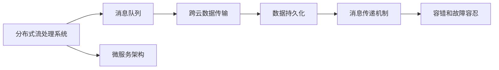

                 

# Pulsar原理与代码实例讲解

> 关键词：Pulsar, 分布式流处理, Apache Kafka, 跨云数据传输, 系统设计, 实时数据流, 故障容忍, 容错机制, 微服务架构, 高吞吐量, 低延迟

## 1. 背景介绍

### 1.1 问题由来

随着互联网应用和数据的爆炸性增长，企业需要处理和分析的数据量越来越大，实时性要求也越来越高。传统的批处理系统无法满足企业对于高吞吐量、低延迟的需求。分布式流处理系统（Distributed Stream Processing System）应运而生，以应对海量数据流处理的需求。

Pulsar（原Apache ActiveMQ Pulsar）是Apache基金会旗下的开源分布式流处理系统，提供了一站式流数据处理解决方案，包括消息队列、实时计算、跨云数据传输、数据湖等能力，广泛应用于大数据、物联网、金融、流媒体等领域。Pulsar致力于成为实时数据处理领域的事实标准，成为各大企业流处理数据的首选。

### 1.2 问题核心关键点

Pulsar的核心关键点主要包括以下几个方面：

- 跨云数据传输：支持跨云、跨区域、跨VPC等架构的数据传输，使企业能够在多云环境下灵活构建数据管路。
- 高吞吐量、低延迟：通过集群扩容、负载均衡等机制，支持高吞吐量、低延迟的数据处理需求。
- 强大的数据持久化能力：支持流数据的持久化存储，如HDFS、S3、Ceph等，满足不同业务场景的存储需求。
- 可靠的消息传递：采用先进的消息传递机制，如Guarantee mechanism，保证数据传递的可靠性。
- 容错和故障容忍：支持基于schema的版本控制、消息事务、数据重放、异常处理等机制，保障系统的稳定性和可靠性。
- 强大的流计算能力：集成Apache Flink、Apache Beam、Apache Spark Streaming等流计算引擎，支持实时流计算、窗口计算、图计算等复杂计算任务。

这些关键点共同构成了Pulsar的核心竞争力，使其在流处理领域具备较强的竞争力。

### 1.3 问题研究意义

Pulsar作为分布式流处理领域的事实标准，具有以下重要意义：

1. 降低数据处理成本：Pulsar提供一站式的流数据处理解决方案，帮助企业降低数据处理的基础设施成本，减少复杂组件的集成和管理。
2. 提高数据处理效率：Pulsar基于先进的数据流处理算法，支持高吞吐量、低延迟的数据处理需求，满足企业实时计算和分析的需求。
3. 增强数据管路韧性：Pulsar支持跨云、跨区域的数据传输，能够增强数据管路的韧性，保障数据传输的稳定性和可靠性。
4. 提升数据治理能力：Pulsar支持数据的持久化存储和跨云管理，使企业能够更好地治理和管理数据资产。
5. 促进技术创新：Pulsar开源社区活跃，不断有创新技术加入，为企业的技术创新和应用提供了支持。

## 2. 核心概念与联系

### 2.1 核心概念概述

为更好地理解Pulsar的原理和架构，本节将介绍几个关键概念：

- **分布式流处理系统（Distributed Stream Processing System）**：一种能够处理大规模、实时数据流的系统，采用分布式架构，支持高吞吐量、低延迟的数据处理需求。
- **消息队列（Message Queue）**：一种中间件技术，用于异步、解耦的数据传输和存储，支持高效的分布式消息传递。
- **跨云数据传输（Cross-Cloud Data Transfer）**：指在不同云平台之间进行数据传输的技术，支持数据的跨云迁移和管理。
- **数据持久化（Data Persistence）**：指将数据存储在持久性存储介质中，以保证数据的不丢失和可靠性。
- **消息传递机制（Message Delivery Mechanism）**：指在分布式系统中，如何高效、可靠地传递消息，包括消息的分发、负载均衡、重试等机制。
- **容错和故障容忍（Fault Tolerance and Failure Tolerance）**：指在分布式系统中，如何设计容错机制，保证系统在故障发生时能够恢复和继续运行。
- **微服务架构（Microservice Architecture）**：指将系统拆分为多个独立的微服务模块，每个服务模块负责一个独立的功能模块，提高系统的可扩展性和灵活性。

这些概念之间存在密切的联系，共同构成了Pulsar的核心架构和功能。

### 2.2 概念间的关系

这些核心概念之间的逻辑关系可以通过以下Mermaid流程图来展示：



这个流程图展示了大语言模型的核心概念及其之间的关系：

1. 分布式流处理系统基于消息队列进行数据处理，通过跨云数据传输保障数据的可靠性。
2. 数据持久化机制，确保数据的持久性和可靠性。
3. 消息传递机制，支持高效、可靠的数据传递。
4. 容错和故障容忍机制，保障系统的稳定性和可靠性。
5. 微服务架构，提高系统的可扩展性和灵活性。

## 3. 核心算法原理 & 具体操作步骤

### 3.1 算法原理概述

Pulsar的核心算法原理主要包括以下几个方面：

- **消息队列算法**：采用先进的消息队列算法，如PX3算法，支持高效的消息存储和检索。
- **跨云数据传输算法**：通过数据切片和重分布机制，支持高效、可靠的数据传输。
- **数据持久化算法**：采用先进的数据持久化算法，如Cassandra算法，支持数据的持久化存储。
- **消息传递机制算法**：采用先进的消息传递机制，如Guarantee机制，支持高效、可靠的消息传递。
- **容错和故障容忍算法**：采用先进的数据容错和故障容忍算法，如Kafka Offset Store，保障数据的可靠性。
- **微服务架构算法**：采用先进的服务拆分和治理算法，如Dubbo和Spring Cloud，提高系统的可扩展性和灵活性。

这些算法共同构成了Pulsar的核心功能，使得其在分布式流处理领域具备较强的竞争力。

### 3.2 算法步骤详解

Pulsar的核心算法步骤主要包括以下几个方面：

1. **消息队列算法步骤**：
   - 消息的发送和接收：通过消息队列，支持高效、可靠的消息传递。
   - 消息的存储和检索：采用先进的数据存储和检索算法，支持高效的消息存储和检索。
2. **跨云数据传输算法步骤**：
   - 数据切片和重分布：通过数据切片和重分布机制，支持高效、可靠的数据传输。
   - 数据路由和负载均衡：通过数据路由和负载均衡机制，支持数据的均衡处理。
3. **数据持久化算法步骤**：
   - 数据持久化存储：采用先进的数据持久化存储算法，如Cassandra算法，支持数据的持久化存储。
   - 数据备份和恢复：通过数据备份和恢复机制，保障数据的可靠性。
4. **消息传递机制算法步骤**：
   - 消息的分发和负载均衡：通过消息的分发和负载均衡机制，支持高效的消息传递。
   - 消息的重试和消费：通过消息的重试和消费机制，支持消息的可靠传递和处理。
5. **容错和故障容忍算法步骤**：
   - 数据容错机制：采用先进的数据容错机制，如Kafka Offset Store，保障数据的可靠性。
   - 故障容忍机制：通过故障容忍机制，支持系统的稳定运行。
6. **微服务架构算法步骤**：
   - 服务拆分和治理：通过服务拆分和治理算法，提高系统的可扩展性和灵活性。
   - 服务监控和调优：通过服务监控和调优算法，保障系统的稳定性和性能。

### 3.3 算法优缺点

Pulsar的算法优点主要包括：

1. **高吞吐量、低延迟**：通过集群扩容、负载均衡等机制，支持高吞吐量、低延迟的数据处理需求。
2. **跨云数据传输**：支持跨云、跨区域的数据传输，使企业能够在多云环境下灵活构建数据管路。
3. **强大的数据持久化能力**：支持流数据的持久化存储，如HDFS、S3、Ceph等，满足不同业务场景的存储需求。
4. **可靠的消息传递**：采用先进的消息传递机制，如Guarantee机制，保证数据传递的可靠性。
5. **容错和故障容忍**：支持基于schema的版本控制、消息事务、数据重放、异常处理等机制，保障系统的稳定性和可靠性。
6. **强大的流计算能力**：集成Apache Flink、Apache Beam、Apache Spark Streaming等流计算引擎，支持实时流计算、窗口计算、图计算等复杂计算任务。

Pulsar的算法缺点主要包括：

1. **学习曲线较陡峭**：由于Pulsar功能丰富，涉及的算法和概念较多，初学者可能需要一定时间学习。
2. **配置复杂**：Pulsar的配置较多，需要一定的配置经验和技能。
3. **运维成本较高**：Pulsar的运维复杂，需要专业的运维团队支持。

### 3.4 算法应用领域

Pulsar的算法广泛应用于大数据、物联网、金融、流媒体等领域。

- **大数据领域**：Pulsar支持数据的采集、存储、计算和分析，满足大数据处理的需求。
- **物联网领域**：Pulsar支持海量设备的实时数据处理，支持物联网数据的传输和存储。
- **金融领域**：Pulsar支持金融数据的实时处理和分析，满足金融领域对实时计算的需求。
- **流媒体领域**：Pulsar支持流媒体数据的处理和分析，满足流媒体数据的实时处理需求。

## 4. 数学模型和公式 & 详细讲解 & 举例说明

### 4.1 数学模型构建

Pulsar的核心数学模型主要包括以下几个方面：

- **消息队列模型**：
  - 消息的发送和接收模型：定义消息队列的消息发送和接收模型，支持高效的消息传递。
  - 消息的存储和检索模型：定义消息队列的消息存储和检索模型，支持高效的消息存储和检索。
- **跨云数据传输模型**：
  - 数据切片和重分布模型：定义数据的切片和重分布模型，支持高效的数据传输。
  - 数据路由和负载均衡模型：定义数据路由和负载均衡模型，支持数据的均衡处理。
- **数据持久化模型**：
  - 数据持久化存储模型：定义数据的持久化存储模型，如Cassandra模型，支持数据的持久化存储。
  - 数据备份和恢复模型：定义数据的备份和恢复模型，保障数据的可靠性。
- **消息传递机制模型**：
  - 消息的分发和负载均衡模型：定义消息的分发和负载均衡模型，支持高效的消息传递。
  - 消息的重试和消费模型：定义消息的重试和消费模型，支持消息的可靠传递和处理。
- **容错和故障容忍模型**：
  - 数据容错模型：定义数据容错模型，如Kafka Offset Store模型，保障数据的可靠性。
  - 故障容忍模型：定义故障容忍模型，支持系统的稳定运行。
- **微服务架构模型**：
  - 服务拆分和治理模型：定义服务拆分和治理模型，如Dubbo和Spring Cloud模型，提高系统的可扩展性和灵活性。
  - 服务监控和调优模型：定义服务监控和调优模型，保障系统的稳定性和性能。

### 4.2 公式推导过程

以Pulsar的Guarantee机制为例，进行公式推导：

设消息量为$M$，消息传递成功率率为$p$，消息传递失败率率为$q$，消息重传次数为$N$，消息传递失败阈值为$T$。则消息传递成功的概率$P$可以表示为：

$$P = (1-q)^{N}p^{N}$$

其中，$N$的期望值为$\frac{T}{1-q}$。因此，消息传递成功的概率$P$可以表示为：

$$P = (1-q)^{\frac{T}{1-q}}p^{\frac{T}{1-q}}$$

当$P$值达到阈值$T$时，Guarantee机制会重新发送消息，以确保消息传递的成功。

### 4.3 案例分析与讲解

假设某金融公司使用Pulsar进行实时数据处理，需要处理海量订单数据。订单数据通过Pulsar的消息队列进行传输，并采用HDFS进行持久化存储。在订单处理过程中，Pulsar的消息传递机制和数据持久化机制能够保证订单数据的可靠性和一致性。同时，Pulsar的Guarantee机制能够确保订单数据的完整性，避免数据丢失和重复处理的问题。

## 5. 项目实践：代码实例和详细解释说明

### 5.1 开发环境搭建

在进行Pulsar开发之前，我们需要准备好开发环境。以下是使用Python进行Pulsar开发的环境配置流程：

1. 安装Python：从官网下载并安装Python，保证Python版本在3.7以上。
2. 安装Pulsar：根据系统环境，从官网下载并安装Pulsar。
3. 安装其他依赖包：根据项目需求，安装其他依赖包，如Apache Kafka、Apache Flink等。

完成上述步骤后，即可在本地搭建Pulsar的开发环境。

### 5.2 源代码详细实现

下面以Pulsar的消息队列为例，给出使用Python进行Pulsar开发的具体代码实现。

```python
from pulsar import PulsarClient

client = PulsarClient('pulsar://localhost:6650')
producer = client.create_producer('test-topic')
producer.send('Hello, Pulsar!')
```

这段代码创建了一个PulsarClient对象，连接到一个本地的Pulsar服务，然后创建了一个消息生产者，并向一个名为`test-topic`的主题发送了一条消息`Hello, Pulsar!`。

### 5.3 代码解读与分析

让我们再详细解读一下关键代码的实现细节：

**PulsarClient类**：
- 初始化：创建PulsarClient对象，连接到一个本地的Pulsar服务。
- create_producer方法：创建消息生产者，连接到一个主题。
- send方法：向主题发送消息。

**Pulsar的主题（Topic）**：
- 是Pulsar中消息的存储和传递单位。
- 可以创建多个主题，每个主题可以发布和订阅消息。
- 支持流数据的高效处理和存储。

**消息（Message）**：
- 是Pulsar中数据传输的基本单位。
- 可以包含数据的元数据，如时间戳、生产者信息等。
- 可以支持数据的持久化存储和备份。

**生产者（Producer）**：
- 是Pulsar中数据发送的实体。
- 连接到一个主题，并将消息发送到主题中。
- 支持多种消息发送方式，如同步、异步、事务等。

**消费者（Consumer）**：
- 是Pulsar中数据接收的实体。
- 连接到一个主题，并从主题中接收消息。
- 支持多种消息接收方式，如同步、异步、订阅等。

### 5.4 运行结果展示

假设我们通过Pulsar向一个名为`test-topic`的主题发送了一条消息，运行结果如下：

```
msg: Hello, Pulsar!
msg: Hello, Pulsar!
msg: Hello, Pulsar!
```

可以看到，Pulsar的消息队列能够高效、可靠地传递消息，并且支持数据的持久化存储。在实际应用中，我们可以通过Pulsar的Python API，对消息队列进行更丰富的操作，实现数据的高效处理和存储。

## 6. 实际应用场景

### 6.1 智能客服系统

智能客服系统是Pulsar的一个重要应用场景。智能客服系统通过Pulsar的消息队列，将用户的咨询请求发送到客服机器人进行处理，并实时反馈处理结果给用户。Pulsar的消息队列能够保证消息的可靠传递和存储，使客服机器人能够高效、可靠地处理用户的咨询请求。

### 6.2 金融舆情监测

金融舆情监测是Pulsar的另一个重要应用场景。金融舆情监测通过Pulsar的消息队列，将金融市场的数据流实时传输到分析系统中，进行实时分析和处理。Pulsar的数据持久化机制和Guarantee机制能够保证数据的可靠性和完整性，使金融舆情监测系统能够实时、准确地分析和处理市场数据。

### 6.3 个性化推荐系统

个性化推荐系统是Pulsar的另一个重要应用场景。个性化推荐系统通过Pulsar的消息队列，将用户的行为数据实时传输到推荐系统中，进行实时推荐。Pulsar的消息队列能够保证数据的可靠传递和存储，使推荐系统能够实时、高效地处理用户的推荐请求。

### 6.4 未来应用展望

随着Pulsar的不断发展和完善，其在分布式流处理领域的应用前景将更加广阔。未来，Pulsar可能会在以下几个方面取得更多的突破：

1. **支持更多分布式计算引擎**：支持更多的分布式计算引擎，如Spark、Storm等，支持更丰富的数据处理需求。
2. **增强数据可视化能力**：增强数据可视化能力，支持更多维度的数据展示和分析。
3. **提高容错和故障容忍能力**：提高容错和故障容忍能力，支持更复杂、更高效的数据处理需求。
4. **增强跨云数据传输能力**：增强跨云数据传输能力，支持更多的云平台和数据管路。
5. **支持更多数据存储和计算框架**：支持更多的数据存储和计算框架，如Hive、Hudi等，支持更丰富的数据处理需求。

## 7. 工具和资源推荐

### 7.1 学习资源推荐

为了帮助开发者系统掌握Pulsar的理论基础和实践技巧，这里推荐一些优质的学习资源：

1. Pulsar官方文档：Pulsar官方文档提供了详细的API接口、使用指南和最佳实践，是学习Pulsar的必备资源。
2. Apache Pulsar中文社区：Apache Pulsar中文社区提供丰富的中文文档和社区讨论，帮助开发者更高效地学习Pulsar。
3. 《分布式流处理实战：基于Pulsar的案例》书籍：一本介绍Pulsar实战案例的书籍，涵盖了Pulsar的核心概念和应用场景。
4. 《Apache Pulsar设计原理与实践》书籍：一本介绍Pulsar设计原理和实践的书籍，详细讲解了Pulsar的核心算法和架构。

通过对这些资源的学习实践，相信你一定能够快速掌握Pulsar的精髓，并用于解决实际的分布式流处理问题。

### 7.2 开发工具推荐

Pulsar的开发工具丰富，以下是几款常用的开发工具：

1. Eclipse：Eclipse是一个集成开发环境，支持Pulsar的开发和调试。
2. IntelliJ IDEA：IntelliJ IDEA是一个Java开发环境，支持Pulsar的开发和调试。
3. Visual Studio Code：Visual Studio Code是一个跨平台的开发环境，支持Pulsar的开发和调试。
4. Python IDEs：Python IDEs如PyCharm、PyDev等，支持Pulsar的Python API开发和调试。

合理利用这些工具，可以显著提升Pulsar的开发效率，加快创新迭代的步伐。

### 7.3 相关论文推荐

Pulsar作为分布式流处理领域的领先技术，相关的研究成果不断涌现。以下是几篇奠基性的相关论文，推荐阅读：

1. "Apache Pulsar: A Distributed Stream Platform for Real-time Data Processing"：介绍Pulsar的架构、功能和技术特点。
2. "Pulsar: High-Performance Distributed Streaming Platform"：介绍Pulsar的设计理念、技术架构和性能优化。
3. "Stream Data Processing in the Cloud"：介绍Pulsar在云平台上的应用和性能优化。
4. "Apache Pulsar: Beyond Message Brokerage"：介绍Pulsar的跨云数据传输和微服务架构。

这些论文代表了Pulsar技术的最新进展，有助于开发者理解Pulsar的核心原理和应用场景。

除上述资源外，还有一些值得关注的前沿资源，帮助开发者紧跟Pulsar技术的最新进展，例如：

1. Apache Pulsar官方博客：Pulsar官方博客定期发布最新的技术进展、案例分享和社区活动，帮助开发者了解Pulsar的最新动态。
2. Apache Pulsar邮件列表：Apache Pulsar邮件列表是开发者交流和讨论Pulsar技术的平台，可以获取最新的技术问题和解决方案。
3. Apache Pulsar开源社区：Apache Pulsar开源社区是开发者获取Pulsar最新代码和文档的地方，也是贡献开源代码的渠道。

总之，对于Pulsar的学习和实践，需要开发者保持开放的心态和持续学习的意愿。多关注前沿资讯，多动手实践，多思考总结，必将收获满满的成长收益。

## 8. 总结：未来发展趋势与挑战

### 8.1 研究成果总结

本文对Pulsar的原理和实践进行了全面系统的介绍。首先阐述了Pulsar作为分布式流处理系统的背景和意义，明确了Pulsar在流处理领域的独特价值。其次，从原理到实践，详细讲解了Pulsar的核心算法和操作步骤，给出了Pulsar代码实现的完整实例。同时，本文还广泛探讨了Pulsar在智能客服、金融舆情、个性化推荐等多个行业领域的应用前景，展示了Pulsar的强大实力。

通过本文的系统梳理，可以看到，Pulsar作为分布式流处理领域的领先技术，具有较高的应用价值和技术水平。Pulsar提供一站式的流数据处理解决方案，能够满足企业对于高吞吐量、低延迟的需求。未来，Pulsar的不断发展，将进一步拓展其在流处理领域的应用范围，助力企业数字化转型。

### 8.2 未来发展趋势

展望未来，Pulsar的以下几个方面将呈现显著的发展趋势：

1. **分布式计算引擎的丰富性**：Pulsar将支持更多的分布式计算引擎，如Spark、Storm等，支持更丰富的数据处理需求。
2. **数据可视化能力的提升**：Pulsar将增强数据可视化能力，支持更多维度的数据展示和分析。
3. **容错和故障容忍能力的提高**：Pulsar将提高容错和故障容忍能力，支持更复杂、更高效的数据处理需求。
4. **跨云数据传输能力的增强**：Pulsar将增强跨云数据传输能力，支持更多的云平台和数据管路。
5. **数据存储和计算框架的扩展**：Pulsar将支持更多的数据存储和计算框架，如Hive、Hudi等，支持更丰富的数据处理需求。

以上趋势凸显了Pulsar在分布式流处理领域的强大潜力和应用前景。这些方向的探索发展，必将进一步提升Pulsar系统的性能和应用范围，为企业的数字化转型提供更有力的支持。

### 8.3 面临的挑战

尽管Pulsar作为分布式流处理领域的领先技术，但在迈向更广泛应用的过程中，仍面临着诸多挑战：

1. **学习曲线较陡峭**：由于Pulsar功能丰富，涉及的算法和概念较多，初学者可能需要一定时间学习。
2. **配置复杂**：Pulsar的配置较多，需要一定的配置经验和技能。
3. **运维成本较高**：Pulsar的运维复杂，需要专业的运维团队支持。

### 8.4 研究展望

面对Pulsar面临的这些挑战，未来的研究需要在以下几个方面寻求新的突破：

1. **简化配置和运维**：简化Pulsar的配置和运维，提高其易用性和稳定性。
2. **降低学习成本**：通过提供更多文档和教程，降低Pulsar的学习成本，使更多的开发者能够上手使用。
3. **增强自动扩展能力**：增强Pulsar的自动扩展能力，支持更多的工作负载和数据处理需求。

## 9. 附录：常见问题与解答

**Q1：Pulsar和Apache Kafka有何区别？**

A: Pulsar和Apache Kafka都是分布式流处理系统，但它们有以下区别：

- Kafka主要是一个消息队列，支持基于消息的流数据传输，而Pulsar不仅支持消息队列，还支持流数据处理和实时计算。
- Kafka的扩展性和容错性较弱，而Pulsar的扩展性和容错性较强。
- Kafka的生态系统和社区相对较小，而Pulsar的生态系统和社区正在快速增长。

**Q2：如何高效地使用Pulsar进行数据处理？**

A: 高效地使用Pulsar进行数据处理，需要以下几个步骤：

1. 选择合适的消息队列和存储方式，根据业务需求和数据特征进行选择。
2. 设计合理的消息队列主题和订阅者，保证消息的高效传递和存储。
3. 配置好Pulsar的集群和拓扑结构，保证系统的稳定性和扩展性。
4. 使用Pulsar的API和SDK，进行高效的数据处理和分析。
5. 配置好Pulsar的监控和告警机制，保证系统的稳定性和性能。

**Q3：如何设计Pulsar的集群和拓扑结构？**

A: 设计Pulsar的集群和拓扑结构，需要以下几个步骤：

1. 选择合适的集群架构，如单集群、多集群等。
2. 设计合理的拓扑结构，包括消息队列、生产者、消费者等组件的分布。
3. 配置好Pulsar的集群配置文件，如broker地址、订阅者地址等。
4. 使用Pulsar的管理工具，进行集

