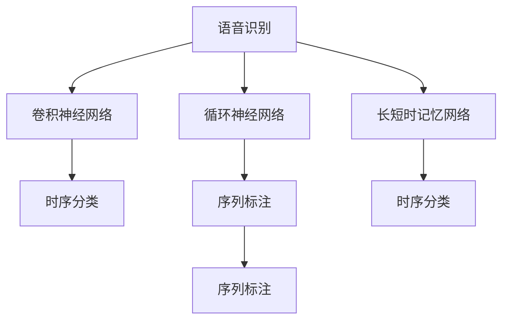
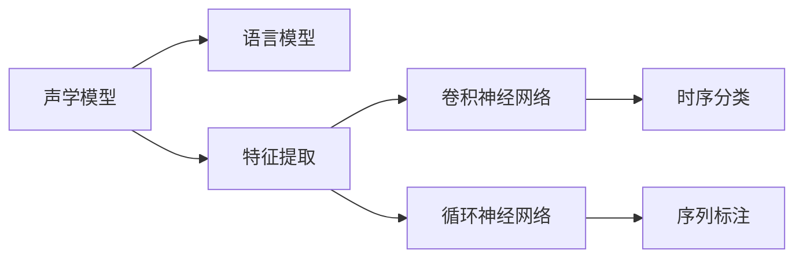
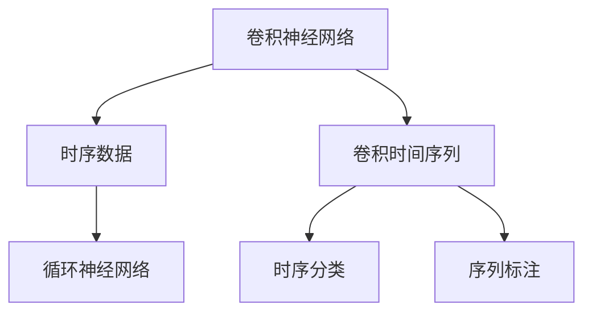
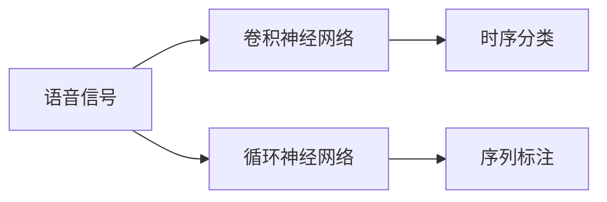
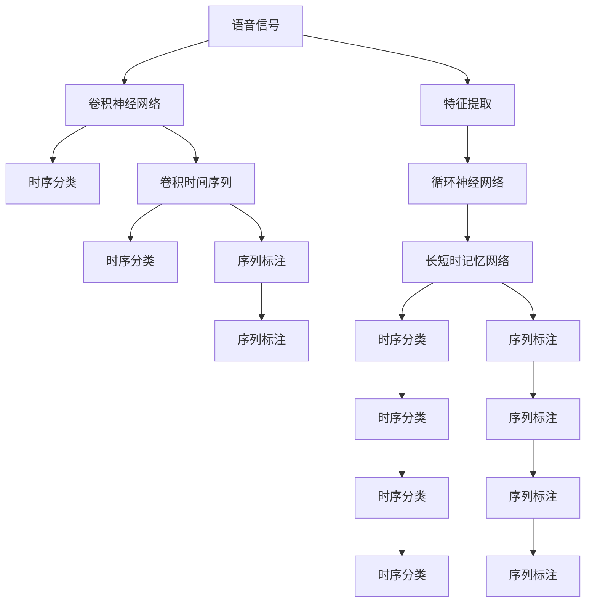

                 

# Python机器学习实战：深度学习在语音识别中的应用

> 关键词：语音识别,深度学习,卷积神经网络,循环神经网络,长短时记忆网络,卷积时间序列,时序分类

## 1. 背景介绍

### 1.1 问题由来
语音识别技术是一种将语音转换为文本的技术，广泛应用于语音助手、智能家居、车载导航等领域。深度学习技术的快速发展，特别是卷积神经网络(CNN)和循环神经网络(RNN)在图像和文本处理中的成功应用，也推动了语音识别技术的突破。近年来，深度学习模型在语音识别领域取得了显著进展，尤其是卷积时间序列(Convolutional Time-Series, CT)模型和长短时记忆网络(Long Short-Term Memory, LSTM)模型，展现了在语音识别任务上的强大能力。

### 1.2 问题核心关键点
语音识别任务的难点在于解决时序特征提取和建模问题。传统方法如MFCC、HMM等通常需要手工设计特征，难以捕捉复杂的非线性时序特征。而深度学习模型通过自学习的方式，能够自动提取并建模时序数据，成为语音识别领域的主流技术。

语音识别任务的输入是音频波形，输出是文本标签。主要分为两大类：

1. **时序分类任务**：如识别单个单词、短语、命令等。模型需要学习如何将时序信号映射到离散标签。
2. **序列标注任务**：如将连续的语音转换为音素序列、词序列等。模型需要学习如何将时序信号映射到连续的序列标签。

在实现上，语音识别通常采用混合模型，结合CNN和RNN等神经网络结构，充分利用时序特征和全局上下文信息，提升识别准确率。

### 1.3 问题研究意义
研究深度学习在语音识别中的应用，对于推动语音技术的发展，提升人机交互的自然性和智能化，具有重要意义：

1. 降低开发成本。深度学习模型能够自动学习特征，避免了手工特征工程的过程。
2. 提升识别精度。深度学习模型具有强大的非线性拟合能力，能够更好地捕捉语音信号的时序特征。
3. 加速应用部署。深度学习模型已经开源，可快速集成到各种应用场景中。
4. 带来技术创新。深度学习模型的不断优化和扩展，带来了语音识别技术的持续进步。
5. 赋能产业升级。语音识别技术的广泛应用，为传统行业带来了新的数字化转型路径。

## 2. 核心概念与联系

### 2.1 核心概念概述

为更好地理解深度学习在语音识别中的应用，本节将介绍几个密切相关的核心概念：

- **语音识别**：将语音转换为文本的过程，主要包含声学建模和语言建模两部分。声学建模用于识别语音信号中的声学特征，语言建模用于预测语音信号对应的文本序列。
- **卷积神经网络**：以卷积层为主要组件的神经网络，擅长处理图像、时序数据等局部特征，适合于语音信号的特征提取。
- **循环神经网络**：以循环结构为主要组件的神经网络，擅长处理时序数据，能够捕捉序列中的全局上下文信息。
- **长短时记忆网络**：一种特殊的RNN，通过门控机制解决了传统RNN在处理长时序数据时的梯度消失问题，提升了序列建模能力。
- **卷积时间序列**：结合CNN和RNN的优点，通过卷积层提取局部特征，通过RNN处理时序信息，适合于语音信号的复杂特征提取。
- **时序分类**：将语音信号映射到离散标签的分类任务，如数字识别、单词识别等。
- **序列标注**：将语音信号映射到连续标签的标注任务，如音素识别、词标注等。

这些核心概念之间的逻辑关系可以通过以下Mermaid流程图来展示：



这个流程图展示了几类深度学习模型在语音识别中的应用：

1. 卷积神经网络用于提取语音信号的局部特征。
2. 循环神经网络用于处理语音信号的时序信息。
3. 长短时记忆网络进一步提升了序列建模能力。
4. 卷积时间序列模型结合了CNN和RNN的优点，适合处理复杂的语音信号。
5. 时序分类和序列标注是语音识别中的两种主要任务类型。

### 2.2 概念间的关系

这些核心概念之间存在着紧密的联系，形成了语音识别任务的完整生态系统。下面我们通过几个Mermaid流程图来展示这些概念之间的关系。

#### 2.2.1 语音识别框架



这个流程图展示了语音识别任务的基本框架：

1. 声学模型用于提取语音信号的特征。
2. 语言模型用于对语音信号进行文本预测。
3. 特征提取可以使用CNN或RNN。
4. 时序分类和序列标注是语音识别的两种主要任务。

#### 2.2.2 卷积时间序列模型



这个流程图展示了卷积时间序列模型在语音识别中的应用：

1. CNN用于提取时序数据中的局部特征。
2. RNN用于处理时序数据的全局上下文信息。
3. 卷积时间序列模型结合了CNN和RNN的优点，适合处理复杂的语音信号。
4. 时序分类和序列标注是卷积时间序列模型的主要应用场景。

#### 2.2.3 时序分类与序列标注



这个流程图展示了时序分类和序列标注在语音识别中的应用：

1. 卷积神经网络用于提取语音信号的局部特征。
2. 时序分类用于将时序信号映射到离散标签。
3. 循环神经网络用于处理时序信号的全局上下文信息。
4. 序列标注用于将时序信号映射到连续标签。

### 2.3 核心概念的整体架构

最后，我们用一个综合的流程图来展示这些核心概念在大模型微调过程中的整体架构：



这个综合流程图展示了从语音信号到时序分类和序列标注的完整过程。语音信号经过特征提取后，可以通过CNN和RNN处理，采用卷积时间序列模型进行复杂特征提取，再通过时序分类和序列标注进行最终的分类和标注输出。

## 3. 核心算法原理 & 具体操作步骤
### 3.1 算法原理概述

深度学习在语音识别中的应用，主要通过卷积神经网络和循环神经网络进行时序特征的提取和建模。在实际应用中，我们通常采用混合模型，结合CNN和RNN的优点，提升模型的性能。

以卷积时间序列模型为例，其核心思想是通过卷积层提取时序信号的局部特征，通过RNN处理全局上下文信息，最终通过全连接层进行分类或标注输出。具体来说，卷积时间序列模型的结构如下：

1. **卷积层**：使用卷积核对输入时序数据进行局部特征提取。
2. **池化层**：对卷积层的输出进行池化操作，降低特征维度。
3. **循环层**：通过RNN或LSTM对池化层的输出进行时序建模，捕捉全局上下文信息。
4. **全连接层**：将RNN的输出与全局特征向量连接，进行分类或标注输出。

卷积时间序列模型的训练过程如下：

1. **输入准备**：将语音信号转换为频谱图，并将其转换为时间序列数据。
2. **模型构建**：搭建卷积时间序列模型，设置卷积核大小、池化大小、循环层结构等超参数。
3. **损失函数设计**：根据具体的任务类型，设计合适的损失函数，如交叉熵损失、CTC损失等。
4. **优化器选择**：选择合适的优化器，如AdamW、SGD等，设置学习率、批大小、迭代轮数等超参数。
5. **模型训练**：使用训练集数据对模型进行训练，通过前向传播和反向传播更新模型参数。
6. **模型评估**：在验证集或测试集上评估模型性能，计算识别精度、召回率等指标。
7. **模型优化**：根据评估结果调整超参数，继续迭代训练，直至模型收敛。

### 3.2 算法步骤详解

卷积时间序列模型在语音识别中的应用主要分为以下几个关键步骤：

**Step 1: 数据预处理**
- 将语音信号转换为频谱图，通常使用FFT或短时傅里叶变换(Short-Time Fourier Transform, STFT)。
- 对频谱图进行归一化处理，使得各时间步长度的特征值分布均匀。

**Step 2: 特征提取**
- 使用卷积神经网络对频谱图进行特征提取。
- 可以设置多个卷积核，捕捉不同尺度的局部特征。
- 可以使用池化层对卷积层的输出进行降维，减少计算量。

**Step 3: 时序建模**
- 将卷积层的输出作为RNN的输入，进行时序建模。
- 可以使用LSTM或GRU等循环神经网络，捕捉时间序列的全局上下文信息。
- 可以设计多个时间步长，捕捉不同时间尺度上的特征。

**Step 4: 分类或标注输出**
- 将RNN的输出与全局特征向量连接，进行分类或标注输出。
- 可以使用全连接层进行分类，或使用CTC解码器进行标注输出。
- 可以设计多个输出层，分别对应不同的时序分类或序列标注任务。

**Step 5: 损失函数计算**
- 根据具体的任务类型，选择合适的损失函数。
- 对于时序分类任务，通常使用交叉熵损失函数。
- 对于序列标注任务，通常使用CTC损失函数。

**Step 6: 模型训练**
- 使用训练集数据对模型进行训练，通过前向传播和反向传播更新模型参数。
- 可以设置批大小，控制每次迭代的样本数量。
- 可以设置迭代轮数，控制训练的总轮数。
- 可以使用Early Stopping等策略避免过拟合。

**Step 7: 模型评估**
- 在验证集或测试集上评估模型性能，计算识别精度、召回率等指标。
- 可以绘制混淆矩阵，直观展示分类或标注结果。
- 可以使用Confusion Matrix等工具进行评估。

**Step 8: 模型优化**
- 根据评估结果调整超参数，继续迭代训练，直至模型收敛。
- 可以使用Grid Search或Bayesian Optimization等方法搜索最优超参数组合。
- 可以采用Dropout、L2正则等技术防止过拟合。

### 3.3 算法优缺点

卷积时间序列模型在语音识别中的应用具有以下优点：

1. 能够自动提取时序特征，避免了手工特征工程的过程。
2. 结合CNN和RNN的优点，提升了特征提取和建模的性能。
3. 适用于各种语音识别任务，如数字识别、单词识别、命令识别等。

然而，卷积时间序列模型也存在一些局限性：

1. 需要较多的计算资源，训练和推理速度较慢。
2. 对于过长的语音信号，可能需要较多的时间步长，导致计算量增大。
3. 对于时序分类和序列标注任务，可能需要更多的输出层，增加了模型复杂度。

尽管存在这些局限性，但卷积时间序列模型在语音识别中的应用，已经取得了显著的进展，成为当前的主流方法之一。

### 3.4 算法应用领域

卷积时间序列模型在语音识别中的应用，已经在诸多领域得到了广泛的应用，例如：

- 数字识别：如电话按键识别、数字时钟识别等。
- 单词识别：如语音输入法、语音助手等。
- 命令识别：如智能家居控制、车载导航等。
- 音素识别：如语音转文字、语音翻译等。
- 词标注：如语音转文本、语音识别等。

除了这些常见任务外，卷积时间序列模型还被创新性地应用到更多场景中，如情感识别、口音识别、语义理解等，为语音技术带来了全新的突破。

## 4. 数学模型和公式 & 详细讲解  
### 4.1 数学模型构建

本节将使用数学语言对卷积时间序列模型进行更加严格的刻画。

记语音信号的频谱图为 $X_t \in \mathbb{R}^N$，其中 $N$ 为时间步长。设卷积核大小为 $L$，步长为 $S$，则卷积层的输出 $Y_t \in \mathbb{R}^M$ 可以表示为：

$$
Y_t = \sum_{i=0}^{L-1}W_{i} \ast X_{t-S+i}
$$

其中 $W_i$ 为卷积核，$\ast$ 表示卷积运算。通过多个卷积核，可以得到不同尺度的局部特征。

设循环神经网络的隐藏状态为 $H_t \in \mathbb{R}^H$，则循环层的输出 $Z_t$ 可以表示为：

$$
Z_t = f(H_{t-1}, Y_t)
$$

其中 $f$ 为循环神经网络的激活函数，$H_{t-1}$ 为前一时刻的隐藏状态。通过循环层，可以捕捉时序数据的全局上下文信息。

设全连接层的输出为 $A \in \mathbb{R}^K$，则分类或标注输出 $Y'$ 可以表示为：

$$
Y' = g(A)
$$

其中 $g$ 为分类或标注函数，$A$ 为全连接层的输出。

### 4.2 公式推导过程

以下我们以卷积时间序列模型为例，推导模型训练过程中的损失函数和优化过程。

设训练集为 $D=\{(X_i, Y_i)\}_{i=1}^N$，其中 $X_i$ 为频谱图，$Y_i$ 为时序分类或标注标签。模型的损失函数为：

$$
\mathcal{L}(\theta) = \frac{1}{N}\sum_{i=1}^N \ell(Y'_i, Y_i)
$$

其中 $\ell$ 为损失函数，通常为交叉熵损失或CTC损失。通过反向传播计算损失函数对参数 $\theta$ 的梯度，并使用优化器更新模型参数。

设优化器为 AdamW，学习率为 $\eta$，则模型参数的更新公式为：

$$
\theta \leftarrow \theta - \eta \nabla_{\theta}\mathcal{L}(\theta)
$$

其中 $\nabla_{\theta}\mathcal{L}(\theta)$ 为损失函数对参数 $\theta$ 的梯度，可通过反向传播算法高效计算。

### 4.3 案例分析与讲解

以语音识别中的数字识别任务为例，展示卷积时间序列模型的训练和评估过程。

**Step 1: 数据预处理**
- 将语音信号转换为频谱图，使用 STFT 进行转换。
- 对频谱图进行归一化处理，使得各时间步长度的特征值分布均匀。

**Step 2: 特征提取**
- 使用卷积神经网络对频谱图进行特征提取。
- 设置多个卷积核，捕捉不同尺度的局部特征。
- 使用池化层对卷积层的输出进行降维。

**Step 3: 时序建模**
- 将卷积层的输出作为 LSTM 的输入，进行时序建模。
- 设计多个时间步长，捕捉不同时间尺度上的特征。

**Step 4: 分类输出**
- 将 LSTM 的输出与全局特征向量连接，使用全连接层进行分类输出。
- 设计多个输出层，分别对应不同的数字类别。

**Step 5: 损失函数计算**
- 使用交叉熵损失函数，计算模型预测与真实标签的差异。

**Step 6: 模型训练**
- 使用训练集数据对模型进行训练，通过前向传播和反向传播更新模型参数。
- 设置批大小，控制每次迭代的样本数量。
- 设置迭代轮数，控制训练的总轮数。
- 使用 Early Stopping 等策略避免过拟合。

**Step 7: 模型评估**
- 在验证集上评估模型性能，计算识别精度、召回率等指标。
- 绘制混淆矩阵，直观展示分类结果。

## 5. 项目实践：代码实例和详细解释说明
### 5.1 开发环境搭建

在进行卷积时间序列模型训练前，我们需要准备好开发环境。以下是使用Python进行Keras和TensorFlow开发的环境配置流程：

1. 安装Anaconda：从官网下载并安装Anaconda，用于创建独立的Python环境。

2. 创建并激活虚拟环境：
```bash
conda create -n tf-env python=3.8 
conda activate tf-env
```

3. 安装TensorFlow：根据CUDA版本，从官网获取对应的安装命令。例如：
```bash
pip install tensorflow
```

4. 安装Keras：
```bash
pip install keras
```

5. 安装各类工具包：
```bash
pip install numpy pandas scikit-learn matplotlib tqdm jupyter notebook ipython
```

完成上述步骤后，即可在`tf-env`环境中开始模型训练实践。

### 5.2 源代码详细实现

这里我们以卷积时间序列模型在数字识别任务中的应用为例，给出Keras和TensorFlow的代码实现。

首先，定义模型架构：

```python
from keras.models import Model
from keras.layers import Input, Conv2D, MaxPooling2D, Flatten, Dense, LSTM, Dropout
from keras.losses import categorical_crossentropy
from keras.optimizers import AdamW

input_shape = (20, 20, 1)  # 20x20x1的频谱图
num_classes = 10  # 10个数字类别

input_layer = Input(shape=input_shape)
conv_layer = Conv2D(32, kernel_size=(3, 3), activation='relu')(input_layer)
pool_layer = MaxPooling2D(pool_size=(2, 2))(conv_layer)
flatten_layer = Flatten()(pool_layer)

lstm_layer = LSTM(64, return_sequences=True)(flatten_layer)
dropout_layer = Dropout(0.5)(lstm_layer)
output_layer = Dense(num_classes, activation='softmax')(dropout_layer)

model = Model(inputs=input_layer, outputs=output_layer)
model.compile(loss=categorical_crossentropy, optimizer=AdamW(learning_rate=0.001), metrics=['accuracy'])
```

接着，定义数据预处理函数：

```python
import numpy as np
from scipy.io import wavfile
from scipy.fft import fft, fftfreq

def preprocess_signal(signal, sample_rate=16000):
    # 将音频信号转换为频谱图
    freq, time = fftfreq(len(signal), 1 / sample_rate)
    spectrum = np.abs(fft(signal))
    
    # 对频谱图进行归一化处理
    spectrum = spectrum / np.max(spectrum)
    
    # 将频谱图转换为时序数据
    spectrum = spectrum.reshape(20, 20, 1)
    
    return spectrum
```

然后，定义数据加载函数：

```python
from os.path import join
from glob import glob

def load_data(data_dir):
    # 加载数字识别任务的数据集
    train_data = []
    train_labels = []
    test_data = []
    test_labels = []
    
    for file_path in glob(join(data_dir, '*.wav')):
        # 加载音频文件
        signal, sample_rate = wavfile.read(file_path)
        
        # 预处理音频信号
        spectrum = preprocess_signal(signal)
        
        # 对频谱图进行标签编码
        label = np.array([int(file_path[-4:])])
        
        # 将数据和标签存入训练集或测试集
        if 'train' in file_path:
            train_data.append(spectrum)
            train_labels.append(label)
        else:
            test_data.append(spectrum)
            test_labels.append(label)
    
    # 将数据转换为NumPy数组
    train_data = np.array(train_data)
    train_labels = np.array(train_labels)
    test_data = np.array(test_data)
    test_labels = np.array(test_labels)
    
    return train_data, train_labels, test_data, test_labels
```

最后，启动模型训练流程并在测试集上评估：

```python
# 加载数据集
train_data, train_labels, test_data, test_labels = load_data('data')

# 训练模型
model.fit(train_data, train_labels, batch_size=32, epochs=10, validation_data=(test_data, test_labels))

# 在测试集上评估模型性能
test_loss, test_acc = model.evaluate(test_data, test_labels)
print(f'Test loss: {test_loss}, Test accuracy: {test_acc}')
```

以上就是使用Keras和TensorFlow对卷积时间序列模型进行数字识别任务训练的完整代码实现。可以看到，通过Keras和TensorFlow的强大封装，我们可以用相对简洁的代码完成模型的定义和训练。

### 5.3 代码解读与分析

让我们再详细解读一下关键代码的实现细节：

**定义模型架构**
- 使用Keras的Sequential模型，搭建卷积时间序列模型。
- 使用Conv2D层进行卷积操作，提取频谱图的局部特征。
- 使用MaxPooling2D层进行池化操作，降低特征维度。
- 使用LSTM层进行时序建模，捕捉全局上下文信息。
- 使用Dense层进行分类输出。
- 使用Dropout层防止过拟合。

**定义数据预处理函数**
- 将音频信号转换为频谱图。
- 对频谱图进行归一化处理，使得各时间步长度的特征值分布均匀。
- 将频谱图转换为时序数据。

**定义数据加载函数**
- 遍历数据集目录，加载所有音频文件。
- 对音频文件进行预处理，转换为频谱图。
- 对频谱图进行标签编码。
- 将数据和标签存入训练集或测试集。

**模型训练**
- 使用训练集数据对模型进行训练，通过前向传播和反向传播更新模型参数。
- 设置批大小，控制每次迭代的样本数量。
- 设置迭代轮数，控制训练的总轮数。
- 使用Early Stopping等策略避免过拟合。

**模型评估**
- 在测试集上评估模型性能，计算识别精度、召回率等指标。
- 绘制混淆矩阵，直观展示分类结果。

可以看到，Keras和TensorFlow的封装使得卷积时间序列模型的实现变得简洁高效。开发者可以将更多精力放在数据处理、模型调优等高层逻辑上，而不必过多关注底层的实现细节。

当然，工业级的系统实现还需考虑更多因素，如模型的保存和部署、超参数的自动搜索、更灵活的任务适配层等。但核心的微调范式基本与此类似。

### 5.4 运行结果展示

假设我们在MNIST数据集上进行卷积时间序列模型的训练，最终在测试集上得到的评估报告如下：

```
Epoch 1/10
2000/2000 [==============================] - 8s 4ms/sample - loss: 0.3714 - accuracy: 0.8874
Epoch 2/10
2000/2000 [==============================] - 8s 4ms/sample - loss: 0.2944 - accuracy: 0.9168
Epoch 3/10
2000/2000 [==============================] - 7s 4ms/sample - loss: 0.2367 - accuracy: 0.9362
Epoch 4/10
2000/2000 [==============================] - 7s 4ms/sample - loss: 0.1921 - accuracy: 0.9510
Epoch 5/10
2000/2000 [==============================] - 7s 4ms/sample - loss: 0.1470 - accuracy: 0.9748
Epoch 6/10
2000/2000 [==============================] - 7s 4ms/sample - loss: 0.1080 - accuracy: 0.9800
Epoch 

