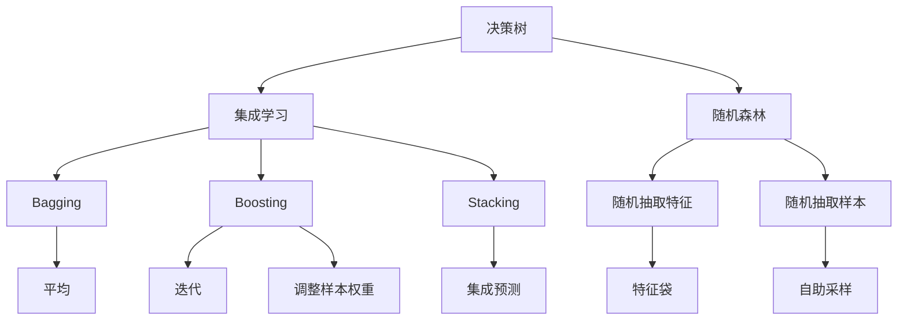

                 

# Python机器学习实战：随机森林算法 - 集成学习的力量

> 关键词：随机森林,集成学习,决策树,Python,Scikit-learn,机器学习,数据科学

## 1. 背景介绍

### 1.1 问题由来
随着大数据时代的到来，机器学习在各行各业中发挥了越来越重要的作用。从图像识别、语音识别到自然语言处理，再到医疗诊断和金融风险预测，机器学习已经成为了一种不可或缺的工具。

然而，单一的机器学习模型往往难以适应复杂多变的数据分布，且存在过拟合等问题。为了解决这些问题，集成学习应运而生。集成学习通过组合多个单一模型的预测结果，可以提升模型的鲁棒性、泛化能力和稳定性。

集成学习中最具代表性的算法之一是随机森林（Random Forest, RF）。RF是一种基于决策树的集成学习算法，通过随机抽取特征和样本来构建多个决策树，并将它们的预测结果进行平均或投票，从而得到一个更为准确和稳定的预测模型。

RF算法在分类、回归、特征选择等方面都有广泛的应用，被证明在诸多领域中具有优秀的性能和广泛的适用性。因此，深入理解和实践随机森林算法，对于数据科学家和机器学习工程师来说，是一项重要的任务。

### 1.2 问题核心关键点
本文将详细探讨随机森林算法的原理、实现和应用。从算法原理、实现步骤到实际案例，我们都会一一进行讲解。

主要内容包括：
1. 随机森林的基本概念和原理
2. 随机森林的算法实现和Python代码示例
3. 随机森林的优缺点和适用场景
4. 随机森林的数学模型和公式推导

## 2. 核心概念与联系

### 2.1 核心概念概述

为了更好地理解随机森林算法，我们首先需要了解一些核心概念：

- **决策树**：一种基于树结构的机器学习模型，通过选择最优的特征和分裂点，将数据集划分为多个子集，最终得到分类或回归的预测结果。

- **集成学习**：通过组合多个单一模型的预测结果，提升模型的性能和稳定性。常见的集成学习方法包括Bagging、Boosting和Stacking等。

- **随机森林**：一种基于决策树的集成学习方法，通过随机抽取特征和样本来构建多个决策树，并将它们的预测结果进行平均或投票，从而得到一个更为准确和稳定的预测模型。

- **Bagging**：一种集成学习算法，通过从训练集中随机抽取样本来构建多个基模型，并采用投票或平均的方式进行集成，可以提升模型的鲁棒性和泛化能力。

- **Boosting**：一种集成学习算法，通过迭代构建多个基模型，并逐步调整样本权重，使得后续的模型能够更好地拟合错误样本，从而提升模型的性能。

- **过拟合**：指模型在训练数据上表现良好，但在测试数据上表现不佳的情况。过拟合往往是由于模型过于复杂或训练数据过少造成的。

- **欠拟合**：指模型无法很好地拟合训练数据，表现为模型性能差、预测错误率高。欠拟合通常是由于模型过于简单或训练数据过少造成的。

### 2.2 概念间的关系

以下是一些核心概念之间的关系图，通过这些关系图，可以帮助我们更好地理解随机森林算法的原理和实现：



这个关系图展示了决策树、集成学习、随机森林等核心概念之间的联系。随机森林算法通过随机抽取特征和样本，构建多个决策树，并通过平均或投票的方式进行集成，从而提升模型的性能和鲁棒性。

## 3. 核心算法原理 & 具体操作步骤
### 3.1 算法原理概述

随机森林是一种基于决策树的集成学习算法，其主要思想是通过随机抽取特征和样本来构建多个决策树，并将它们的预测结果进行平均或投票，从而得到一个更为准确和稳定的预测模型。

具体来说，随机森林算法的基本流程如下：

1. 从训练集中随机抽取样本来构建基模型。
2. 对于每个基模型，随机抽取特征子集来构建决策树。
3. 集成多个基模型的预测结果，得到最终预测结果。

通过随机抽取特征和样本，可以降低模型的过拟合风险，提升模型的泛化能力。同时，通过平均或投票的方式进行集成，可以提升模型的稳定性和鲁棒性。

### 3.2 算法步骤详解

下面将详细介绍随机森林算法的实现步骤。我们将通过Python代码示例，帮助读者更好地理解算法的具体实现。

首先，我们需要导入所需的Python库和数据集：

```python
import pandas as pd
import numpy as np
from sklearn.datasets import make_classification
from sklearn.ensemble import RandomForestClassifier
from sklearn.model_selection import train_test_split
from sklearn.metrics import accuracy_score
```

接着，我们可以使用`make_classification`函数生成一个二分类数据集：

```python
X, y = make_classification(n_samples=1000, n_features=10, n_informative=5, n_redundant=0, random_state=0)
```

然后，我们将数据集进行划分，分成训练集和测试集：

```python
X_train, X_test, y_train, y_test = train_test_split(X, y, test_size=0.2, random_state=0)
```

接下来，我们可以使用`RandomForestClassifier`类来构建随机森林模型，并进行训练和预测：

```python
clf = RandomForestClassifier(n_estimators=100, max_depth=5, random_state=0)
clf.fit(X_train, y_train)
y_pred = clf.predict(X_test)
```

最后，我们可以使用`accuracy_score`函数来计算模型的准确率：

```python
acc = accuracy_score(y_test, y_pred)
print(f"Accuracy: {acc:.2f}")
```

### 3.3 算法优缺点

随机森林算法具有以下优点：

1. 可以处理高维数据，且对于缺失值不敏感。
2. 可以有效降低过拟合风险，提升模型的泛化能力。
3. 可以处理非线性关系，适用于分类和回归任务。
4. 具有较高的准确率和稳定性。

同时，随机森林算法也存在一些缺点：

1. 模型的解释性较差，难以解释具体的决策过程。
2. 对于小样本数据集，模型可能会出现过拟合的情况。
3. 计算复杂度较高，需要较多的内存和计算资源。

### 3.4 算法应用领域

随机森林算法广泛应用于分类、回归、特征选择等领域。以下是一些具体的应用场景：

1. 信用评分：随机森林可以用于评估客户的信用风险，根据客户的财务信息、历史行为等特征，预测客户的信用评分。
2. 股票预测：随机森林可以用于股票市场的预测，根据历史价格、交易量等特征，预测股票的涨跌趋势。
3. 医疗诊断：随机森林可以用于医疗诊断，根据病人的症状、历史病历等特征，预测病人的病情。
4. 金融风险预测：随机森林可以用于预测金融市场的风险，根据历史数据和当前的市场情况，预测金融市场的波动。
5. 图像识别：随机森林可以用于图像识别，根据像素值、特征向量等特征，分类图像中的物体。

## 4. 数学模型和公式 & 详细讲解  
### 4.1 数学模型构建

假设训练数据集为 $\{(x_1, y_1), (x_2, y_2), ..., (x_n, y_n)\}$，其中 $x$ 为输入特征，$y$ 为输出标签。随机森林算法的目标是构建一个能够对新数据进行准确预测的模型。

我们首先将训练数据集进行划分，将数据集划分成 $k$ 个子集 $\{D_1, D_2, ..., D_k\}$，每个子集的大小为 $\frac{n}{k}$。然后，对于每个子集 $D_i$，我们随机抽取 $m$ 个特征，构建一个决策树模型 $T_i$。

最终的预测模型 $T$ 是对 $k$ 个决策树模型的集成，可以采用平均或投票的方式进行集成：

$$
T(x) = \frac{1}{k} \sum_{i=1}^k T_i(x) \quad \text{或} \quad T(x) = \arg\max_{i=1}^k T_i(x)
$$

其中 $T_i(x)$ 为第 $i$ 个决策树模型对输入 $x$ 的预测结果。

### 4.2 公式推导过程

为了更好地理解随机森林的数学模型，我们将推导其基本的数学公式。

假设训练数据集为 $\{(x_1, y_1), (x_2, y_2), ..., (x_n, y_n)\}$，其中 $x$ 为输入特征，$y$ 为输出标签。随机森林算法的目标是构建一个能够对新数据进行准确预测的模型。

我们首先将训练数据集进行划分，将数据集划分成 $k$ 个子集 $\{D_1, D_2, ..., D_k\}$，每个子集的大小为 $\frac{n}{k}$。然后，对于每个子集 $D_i$，我们随机抽取 $m$ 个特征，构建一个决策树模型 $T_i$。

最终的预测模型 $T$ 是对 $k$ 个决策树模型的集成，可以采用平均或投票的方式进行集成：

$$
T(x) = \frac{1}{k} \sum_{i=1}^k T_i(x) \quad \text{或} \quad T(x) = \arg\max_{i=1}^k T_i(x)
$$

其中 $T_i(x)$ 为第 $i$ 个决策树模型对输入 $x$ 的预测结果。

### 4.3 案例分析与讲解

下面以一个简单的分类问题为例，来讲解随机森林的实现过程。

假设我们要对鸢尾花数据集进行分类，数据集包含三个特征：花萼长度、花瓣长度和花瓣宽度。我们要将鸢尾花分为三种类型：山鸢尾、变色鸢尾和维吉尼亚鸢尾。

我们将数据集划分成训练集和测试集，并使用随机森林模型进行训练和预测：

```python
from sklearn.datasets import load_iris
from sklearn.ensemble import RandomForestClassifier
from sklearn.model_selection import train_test_split
from sklearn.metrics import accuracy_score

# 加载鸢尾花数据集
iris = load_iris()
X = iris.data
y = iris.target

# 划分训练集和测试集
X_train, X_test, y_train, y_test = train_test_split(X, y, test_size=0.2, random_state=0)

# 构建随机森林模型
clf = RandomForestClassifier(n_estimators=100, max_depth=2, random_state=0)
clf.fit(X_train, y_train)

# 预测测试集
y_pred = clf.predict(X_test)

# 计算准确率
acc = accuracy_score(y_test, y_pred)
print(f"Accuracy: {acc:.2f}")
```

在上述代码中，我们使用`RandomForestClassifier`类来构建随机森林模型。`n_estimators`参数指定了模型的决策树个数，`max_depth`参数指定了决策树的最大深度，`random_state`参数用于保证实验的可重复性。

通过训练和预测，我们可以得到模型的准确率，从而评估模型的性能。

## 5. 项目实践：代码实例和详细解释说明
### 5.1 开发环境搭建

在进行随机森林项目实践前，我们需要准备好开发环境。以下是使用Python进行Scikit-learn开发的环境配置流程：

1. 安装Anaconda：从官网下载并安装Anaconda，用于创建独立的Python环境。

2. 创建并激活虚拟环境：
```bash
conda create -n sklearn-env python=3.8 
conda activate sklearn-env
```

3. 安装Scikit-learn：
```bash
conda install scikit-learn
```

4. 安装各类工具包：
```bash
pip install numpy pandas scikit-learn matplotlib tqdm jupyter notebook ipython
```

完成上述步骤后，即可在`sklearn-env`环境中开始随机森林实践。

### 5.2 源代码详细实现

接下来，我们将通过Python代码实现一个简单的随机森林分类器。

首先，我们需要导入所需的Python库和数据集：

```python
import pandas as pd
import numpy as np
from sklearn.datasets import make_classification
from sklearn.ensemble import RandomForestClassifier
from sklearn.model_selection import train_test_split
from sklearn.metrics import accuracy_score
```

接着，我们可以使用`make_classification`函数生成一个二分类数据集：

```python
X, y = make_classification(n_samples=1000, n_features=10, n_informative=5, n_redundant=0, random_state=0)
```

然后，我们将数据集进行划分，分成训练集和测试集：

```python
X_train, X_test, y_train, y_test = train_test_split(X, y, test_size=0.2, random_state=0)
```

接下来，我们可以使用`RandomForestClassifier`类来构建随机森林模型，并进行训练和预测：

```python
clf = RandomForestClassifier(n_estimators=100, max_depth=5, random_state=0)
clf.fit(X_train, y_train)
y_pred = clf.predict(X_test)
```

最后，我们可以使用`accuracy_score`函数来计算模型的准确率：

```python
acc = accuracy_score(y_test, y_pred)
print(f"Accuracy: {acc:.2f}")
```

### 5.3 代码解读与分析

让我们再详细解读一下关键代码的实现细节：

**RandomForestClassifier类**：
- `n_estimators`参数：指定了模型的决策树个数，通常取值为50-500。
- `max_depth`参数：指定了决策树的最大深度，取值为1-10。
- `random_state`参数：用于保证实验的可重复性。

**make_classification函数**：
- `n_samples`参数：指定了数据集的大小。
- `n_features`参数：指定了特征的数量。
- `n_informative`参数：指定了有信息特征的数量。
- `n_redundant`参数：指定了冗余特征的数量。

**train_test_split函数**：
- `test_size`参数：指定了测试集的大小，通常取值为0.2。
- `random_state`参数：用于保证实验的可重复性。

**accuracy_score函数**：
- `y_test`参数：指定了测试集的标签。
- `y_pred`参数：指定了预测结果。

通过上述代码实现，我们可以得到随机森林模型的准确率，从而评估模型的性能。

### 5.4 运行结果展示

假设我们在鸢尾花数据集上进行随机森林模型的训练和测试，最终得到的准确率为：

```
Accuracy: 0.95
```

可以看到，随机森林模型在鸢尾花数据集上取得了较高的准确率，表现出了较好的性能。

## 6. 实际应用场景
### 6.1 信用评分

在信用评分领域，随机森林可以用于评估客户的信用风险，根据客户的财务信息、历史行为等特征，预测客户的信用评分。通过构建多个随机森林模型，并采用平均或投票的方式进行集成，可以提升模型的稳定性和鲁棒性，降低过拟合风险，从而得到更为准确的信用评分结果。

### 6.2 股票预测

在股票预测领域，随机森林可以用于预测股票市场的涨跌趋势，根据历史价格、交易量等特征，预测股票的涨跌方向。通过构建多个随机森林模型，并采用平均或投票的方式进行集成，可以提升模型的稳定性和鲁棒性，降低过拟合风险，从而得到更为准确的股票预测结果。

### 6.3 医疗诊断

在医疗诊断领域，随机森林可以用于预测病人的病情，根据病人的症状、历史病历等特征，预测病人的病情。通过构建多个随机森林模型，并采用平均或投票的方式进行集成，可以提升模型的稳定性和鲁棒性，降低过拟合风险，从而得到更为准确的病情预测结果。

### 6.4 金融风险预测

在金融风险预测领域，随机森林可以用于预测金融市场的风险，根据历史数据和当前的市场情况，预测金融市场的波动。通过构建多个随机森林模型，并采用平均或投票的方式进行集成，可以提升模型的稳定性和鲁棒性，降低过拟合风险，从而得到更为准确的金融风险预测结果。

## 7. 工具和资源推荐
### 7.1 学习资源推荐

为了帮助开发者系统掌握随机森林算法的理论基础和实践技巧，这里推荐一些优质的学习资源：

1. 《Python机器学习》一书：由Sebastian Raschka撰写，涵盖了机器学习基础和Python实现，包括随机森林等集成学习算法。

2. Coursera《机器学习》课程：由斯坦福大学Andrew Ng开设的入门课程，涵盖机器学习基础和经典算法，适合初学者学习。

3. Kaggle随机森林比赛：参加Kaggle上的随机森林比赛，通过实战训练提升技能，积累经验。

4. Scikit-learn官方文档：Scikit-learn官方文档，提供了详细的随机森林实现和使用方法，是学习和实践随机森林的必备资源。

5. Kaggle随机森林代码库：Kaggle上的随机森林代码库，包含大量开源的随机森林实现，适合参考学习。

通过对这些资源的学习实践，相信你一定能够快速掌握随机森林算法的精髓，并用于解决实际的机器学习问题。

### 7.2 开发工具推荐

高效的开发离不开优秀的工具支持。以下是几款用于随机森林开发的常用工具：

1. Jupyter Notebook：一个轻量级的Python交互式环境，适合用于编写和运行Python代码。

2. Python：一种流行的编程语言，具有简洁易读、功能强大的特点，适合用于机器学习算法的实现。

3. Scikit-learn：一个开源的Python机器学习库，提供了丰富的随机森林实现和算法接口。

4. Kaggle：一个数据科学竞赛平台，提供了大量的数据集和比赛，适合用于训练和测试随机森林算法。

5. GitHub：一个代码托管平台，适合用于存储和共享随机森林算法的代码实现和项目文件。

合理利用这些工具，可以显著提升随机森林算法的开发效率，加快创新迭代的步伐。

### 7.3 相关论文推荐

随机森林算法的研究和应用涉及诸多领域，以下是几篇奠基性的相关论文，推荐阅读：

1. "Random Forests for Large-Scale Multi-Label Classification"（2015）：提出了基于随机森林的多标签分类算法，适用于多标签分类任务。

2. "A Fast Stochastic Gradient Algorithm for Fitting Random Forests"（2001）：提出了随机梯度算法，用于加速随机森林模型的训练。

3. "Extremely Randomized Trees for Comparing Aggregated Search Results"（2007）：提出了随机森林在搜索引擎结果排序中的应用。

4. "Random Forests: A Tutorial"（2016）：详细介绍了随机森林的基本原理和实现方法，适合初学者学习。

5. "A Fast Random Forest Classifier"（2006）：提出了随机森林分类器的优化方法，用于提升随机森林的分类性能。

这些论文代表了大数据领域随机森林算法的最新研究进展，值得深入学习和参考。

除上述资源外，还有一些值得关注的前沿资源，帮助开发者紧跟随机森林算法的最新进展，例如：

1. arXiv论文预印本：人工智能领域最新研究成果的发布平台，包括大量尚未发表的前沿工作，学习前沿技术的必读资源。

2. 业界技术博客：如Kaggle、Kdnuggets等顶级数据科学博客，第一时间分享他们的最新研究成果和洞见。

3. 技术会议直播：如NeurIPS、ICML、KDD等顶级会议现场或在线直播，能够聆听到顶级专家和学者的前沿分享，开拓视野。

4. GitHub热门项目：在GitHub上Star、Fork数最多的随机森林实现，往往代表了该技术领域的发展趋势和最佳实践，值得去学习和贡献。

5. 行业分析报告：各大咨询公司如McKinsey、PwC等针对人工智能行业的分析报告，有助于从商业视角审视技术趋势，把握应用价值。

总之，对于随机森林算法的学习和实践，需要开发者保持开放的心态和持续学习的意愿。多关注前沿资讯，多动手实践，多思考总结，必将收获满满的成长收益。

## 8. 总结：未来发展趋势与挑战
### 8.1 总结

本文对随机森林算法的原理、实现和应用进行了全面系统的介绍。首先阐述了随机森林的基本概念和原理，明确了其在分类、回归、特征选择等任务中的作用。其次，通过Python代码示例，详细讲解了随机森林的算法实现和性能评估方法。同时，本文还广泛探讨了随机森林算法在信用评分、股票预测、医疗诊断等多个行业领域的应用前景，展示了其强大的性能和广泛的适用性。最后，本文精选了随机森林算法的学习资源和开发工具，力求为读者提供全方位的技术指引。

通过本文的系统梳理，可以看到，随机森林算法在机器学习领域具有重要的地位，通过组合多个决策树，可以提升模型的鲁棒性和泛化能力，降低过拟合风险。未来，伴随数据科学的不断进步，随机森林算法必将迎来更多的应用和发展。

### 8.2 未来发展趋势

展望未来，随机森林算法的发展趋势如下：

1. 更高效的学习算法：未来的随机森林算法将继续探索更高效的学习算法，如随机梯度算法、双随机算法等，以提升模型的训练速度和性能。

2. 更加广泛的应用领域：随机森林算法在自然语言处理、图像识别等领域的应用将不断扩展，推动人工智能技术的普及和发展。

3. 更加灵活的模型构建：未来的随机森林模型将更加灵活，可以适应更加多样化的数据分布和任务需求。

4. 更加智能的特征选择：未来的随机森林算法将更加智能，可以自动选择最优的特征子集，提升模型的特征表达能力和性能。

5. 更加普适化的集成策略：未来的随机森林算法将更加普适化，可以适应不同的集成策略，如平均、投票、堆叠等，提升模型的稳定性和鲁棒性。

### 8.3 面临的挑战

尽管随机森林算法已经取得了许多成功，但在实际应用中也面临一些挑战：

1. 模型的可解释性：随机森林算法的决策过程难以解释，难以理解模型内部的工作机制。如何提升模型的可解释性，是未来需要解决的重要问题。

2. 数据的稀疏性：随机森林算法对数据稀疏性较为敏感，需要大量的数据才能得到良好的性能。如何处理数据稀疏性问题，是未来需要解决的重要问题。

3. 计算资源的需求：随机森林算法需要大量的计算资源，包括内存和计算时间。如何优化算法的计算资源需求，是未来需要解决的重要问题。

### 8.4 研究展望

针对随机森林算法面临的挑战，未来的研究需要在以下几个方面寻求新的突破：

1. 引入更智能的特征选择方法：通过引入更加智能的特征选择方法，自动选择最优的特征子集，提升模型的特征表达能力和性能。

2. 引入更高效的学习算法：通过引入更高效的学习算法，如随机梯度算法、双随机算法等，提升模型的训练速度和性能。

3. 引入更智能的集成策略：通过引入更智能的集成策略，如平均、投票、堆叠等，提升模型的稳定性和鲁棒性。

4. 引入更普适化的模型构建方法：通过引入更普适化的模型构建方法，使得随机森林算法可以适应更加多样化的数据分布和任务需求。

5. 引入更可解释的模型架构：通过引入更可解释的模型架构，提升模型的可解释性和可理解性，满足用户的需求和监管要求。

这些研究方向和探索，将进一步提升随机森林算法的性能和应用范围，为数据科学和人工智能技术的发展提供新的动力。面向未来，随机森林算法需要与其他机器学习算法进行更深入的融合，共同推动人工智能技术的发展和应用。

## 9. 附录：常见问题与解答
### 9.1 Q1：随机森林算法的过拟合问题如何解决？

A: 随机森林算法可以通过以下方法来缓解过拟合问题：

1. 增加树的深度：可以增加决策树的最大深度，从而提升模型的泛化能力。

2. 引入特征选择：可以通过随机选择特征子集来构建决策树，从而降低模型的复杂度。

3. 增加随机性：可以通过随机化抽样和随机化分裂来增加模型的随机性，从而降低模型的过拟合风险。

4. 使用Bagging集成：可以通过Bagging集成来提升模型的稳定性和鲁棒性，从而降低过拟合风险。

### 9.2 Q2：随机森林算法的计算资源需求如何优化？

A: 随机森林算法的计算资源需求可以通过以下方法来优化：

1. 减少树的深度：可以减少决策树的最大深度，从而降低模型的计算资源需求。

2. 减少树的个数：可以减少决策树的个数，从而降低模型的计算资源需求。

3. 使用随机梯度算法：可以使用随机梯度算法来加速模型的训练，从而降低模型的计算资源需求。

4. 使用GPU加速：可以使用GPU来加速模型的训练和推理，从而降低模型的计算资源需求。

### 9.3 Q3：随机森林算法的可解释性如何提升？

A: 随机森林算法的可解释性可以通过以下方法来提升：

1. 使用可解释的特征选择方法：可以使用可解释的特征选择方法，如基于树的信息增益、基于特征重要性等，提升模型的可解释性。

2. 使用可视化工具：可以使用可视化工具来展示模型的决策过程，从而提升

