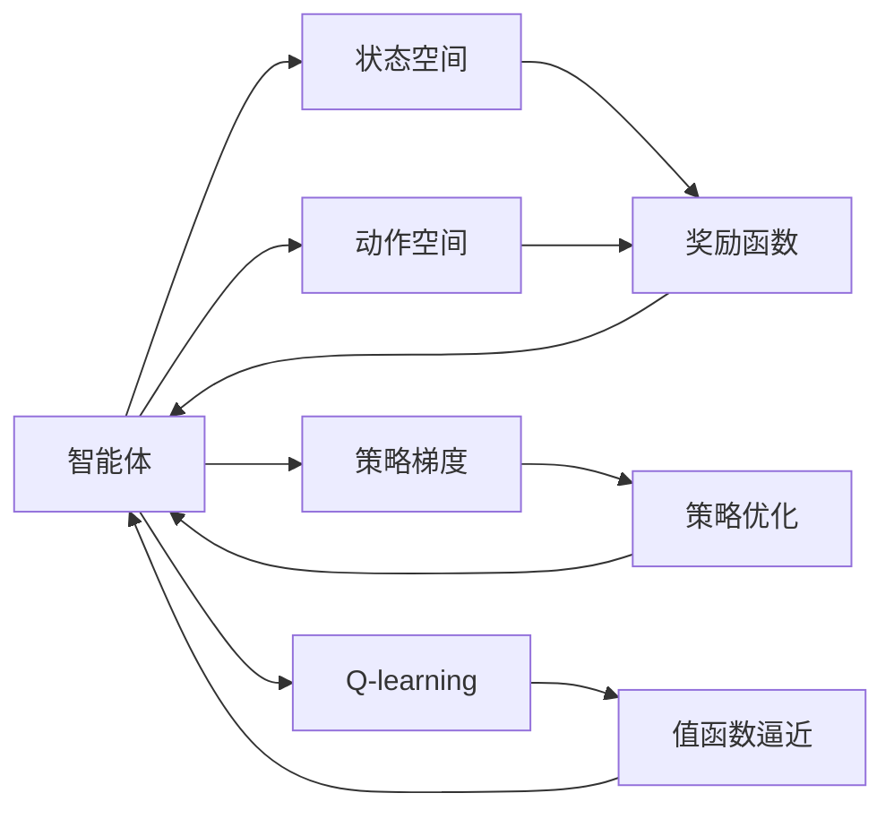
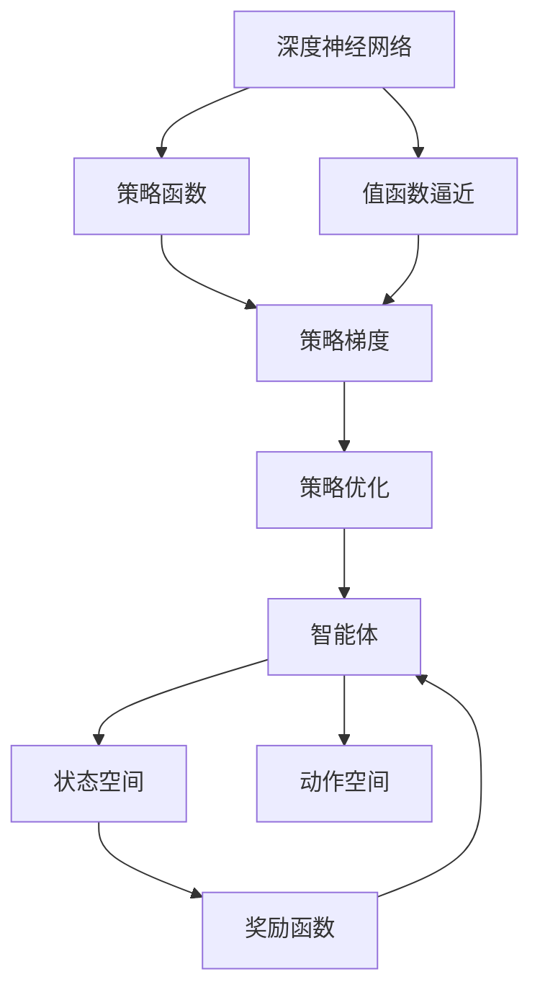

                 

# Python深度学习实践：深度强化学习与机器人控制

> 关键词：深度强化学习, 机器人控制, 深度学习框架, TensorFlow, PyTorch, 深度学习应用

## 1. 背景介绍

### 1.1 问题由来
近年来，随着深度学习技术的飞速发展，特别是深度强化学习(Deep Reinforcement Learning, DRL)的兴起，使得机器人控制和自动化系统得到了长足的进步。DRL通过构建智能体与环境之间的互动，利用深度学习模型学习最优策略，从而实现智能决策和复杂控制。机器人控制是DRL最为典型的应用领域之一，涉及机械臂操作、导航避障、抓取操作等多样化任务。

然而，尽管DRL取得了显著的成果，其在实际应用中的稳定性和可解释性仍然存在不少挑战。如何更好地理解DRL背后的原理和算法，优化其性能，成为机器人控制领域的研究重点。本节将系统介绍深度强化学习的基本原理和核心算法，探讨其在机器人控制中的应用，为后续深入研究和实践奠定基础。

### 1.2 问题核心关键点
DRL的核心在于通过强化学习算法，使智能体通过与环境的互动，学习到最优的决策策略。其主要包括以下几个关键点：

- **环境**：智能体所处的虚拟或现实环境，包括状态空间、动作空间、奖励函数等，用于描述系统的动态特性。
- **智能体**：DRL的核心组件，通常基于深度神经网络实现，能够感知环境状态并输出动作策略。
- **动作策略**：智能体在给定状态下应采取的行动，通常为连续或离散的动作。
- **状态空间**：描述环境的当前状态，通常是高维连续向量。
- **动作空间**：智能体可能采取的所有动作集合，可以是离散或连续。
- **奖励函数**：定义智能体的行动在当前状态下获得的即时奖励，用于指导智能体学习最优策略。
- **学习算法**：基于强化学习的策略优化方法，如Q-learning、策略梯度等。

这些关键点共同构成DRL的框架，通过智能体和环境之间的反复交互，学习到最佳的决策策略。

### 1.3 问题研究意义
DRL在机器人控制中的应用，极大地提升了系统的自主性和智能化水平，使其能够高效地完成复杂任务。具体来说：

1. **自动化控制**：DRL能够自动学习最优控制策略，减少了对人工编程的依赖，提高了控制效率。
2. **智能决策**：智能体可以基于环境反馈实时调整策略，实现动态适应和智能决策。
3. **高效学习**：通过神经网络模型，DRL能够并行处理大量样本，加速学习过程。
4. **可扩展性**：DRL模型具有良好的通用性，可以应用于各种机器人控制任务，具备良好的扩展性。
5. **创新潜力**：DRL结合深度学习的前沿技术，为机器人控制带来了更多创新思路和应用场景。

## 2. 核心概念与联系

### 2.1 核心概念概述

为了更好地理解深度强化学习及其在机器人控制中的应用，本节将介绍几个关键概念：

- **深度强化学习**：结合深度神经网络和强化学习技术的深度学习范式，旨在通过智能体与环境的互动，学习到最优的决策策略。
- **策略梯度**：一种强化学习方法，通过直接优化策略函数，学习到最大化累积奖励的策略。
- **Q-learning**：一种基于值函数的强化学习方法，通过估计状态-动作对的Q值，指导智能体的行动选择。
- **策略和值函数**：分别用于描述智能体的决策策略和状态-动作的价值评估，是DRL中两个重要的函数。
- **深度神经网络**：由多层神经元组成的网络结构，用于提取环境状态和动作的特征表示，进行策略或值函数的拟合。
- **策略优化**：通过优化策略函数，使得智能体在给定状态下选择最优动作。
- **值函数逼近**：通过神经网络逼近Q值或状态值，实现对状态-动作价值的高效评估。

这些概念构成了DRL的核心框架，通过深度神经网络和强化学习技术的结合，使得智能体能够自主学习到高效、鲁棒的决策策略。

### 2.2 概念间的关系

这些核心概念之间存在着紧密的联系，形成了深度强化学习的完整生态系统。下面我通过几个Mermaid流程图来展示这些概念之间的关系：



这个流程图展示了大语言模型的核心概念及其之间的关系：

1. 智能体通过感知状态空间和动作空间，执行动作并接收奖励。
2. 智能体的策略通过优化函数更新，使得其决策策略更接近最优。
3. 智能体的策略和值函数通过神经网络逼近，用于评估状态-动作的价值。
4. Q-learning通过估计Q值，指导智能体的行动选择。
5. 策略梯度直接优化策略函数，学习到最大化累积奖励的策略。

这些概念共同构成了深度强化学习的学习框架，使其能够在各种机器人控制场景下发挥作用。

### 2.3 核心概念的整体架构

最后，我们用一个综合的流程图来展示这些核心概念在大语言模型微调过程中的整体架构：



这个综合流程图展示了深度强化学习的整体架构：

1. 深度神经网络提取环境状态和动作的特征表示。
2. 策略函数用于描述智能体的决策策略，指导动作选择。
3. 值函数逼近用于评估状态-动作的价值，指导策略优化。
4. 策略梯度通过优化策略函数，学习到最优策略。
5. 智能体通过感知环境状态和执行动作，不断调整策略，实现高效控制。

通过这些流程图，我们可以更清晰地理解深度强化学习的工作原理和优化方向。

## 3. 核心算法原理 & 具体操作步骤
### 3.1 算法原理概述

深度强化学习的核心在于结合深度神经网络和强化学习技术的深度学习范式，通过智能体与环境的互动，学习到最优的决策策略。其基本流程包括：

1. **环境感知**：智能体接收环境的状态信息，通过深度神经网络提取特征。
2. **动作选择**：智能体根据当前状态，选择最优动作，通过策略函数进行决策。
3. **状态转移**：智能体执行动作，环境状态发生变化。
4. **奖励计算**：根据环境反馈，计算动作的即时奖励。
5. **策略优化**：通过优化策略函数，使得智能体在给定状态下选择最优动作。
6. **值函数逼近**：通过神经网络逼近Q值或状态值，实现对状态-动作价值的高效评估。
7. **训练循环**：重复上述步骤，直到智能体学习到最优策略。

这些步骤通过强化学习算法实现，常见的算法包括策略梯度和Q-learning等。

### 3.2 算法步骤详解

以下详细讲解深度强化学习在机器人控制中的应用步骤：

**Step 1: 环境设定**
- 定义机器人控制任务的状态空间、动作空间和奖励函数。状态空间通常为连续高维向量，动作空间可以是离散或连续，奖励函数用于评估智能体的决策。

**Step 2: 模型构建**
- 选择合适的深度神经网络作为智能体的策略函数，如全连接神经网络、卷积神经网络等。
- 设计合适的损失函数，如策略梯度损失、Q-learning损失等，用于指导模型训练。
- 选择合适的优化器，如Adam、SGD等，设置学习率和正则化参数。

**Step 3: 数据生成**
- 生成大量训练数据，通过模拟或实际环境生成状态-动作对，并计算其奖励值。
- 将状态数据进行预处理，如归一化、标准化等，输入深度神经网络。

**Step 4: 模型训练**
- 通过训练数据，使用深度神经网络逼近策略函数或值函数。
- 使用强化学习算法（如策略梯度、Q-learning）进行模型优化。
- 根据训练结果，调整模型参数和超参数，优化模型性能。

**Step 5: 模型测试**
- 在测试数据集上评估模型性能，通过奖励值评估智能体的决策质量。
- 根据测试结果，进一步优化模型，提高智能体的决策能力。

**Step 6: 模型部署**
- 将训练好的模型部署到实际机器人控制系统中，实时感知环境状态，输出动作决策。
- 定期更新模型参数，保持模型的高效性和鲁棒性。

### 3.3 算法优缺点

深度强化学习在机器人控制中具有以下优点：

- **自适应性强**：DRL能够根据环境反馈自适应调整策略，具备高度灵活性。
- **泛化能力强**：DRL在解决新问题时，能够通过泛化已有的知识和经验，迅速适应新环境。
- **处理复杂问题**：DRL能够处理高维、非线性的复杂控制问题，适用于多种任务。
- **高效率学习**：通过神经网络并行处理大量样本，加速学习过程。

同时，DRL也存在一些缺点：

- **训练数据需求高**：DRL需要大量标注数据进行训练，获取高质量数据的成本较高。
- **样本效率低**：DRL在解决某些任务时，需要大量样本才能收敛，训练效率较低。
- **可解释性不足**：DRL的决策过程难以解释，缺乏透明性。
- **鲁棒性问题**：DRL在面对噪声和不确定性环境时，容易发生不稳定现象。

尽管存在这些局限性，但深度强化学习仍然是当前机器人控制领域的主流技术，其显著的性能优势和应用潜力仍不可忽视。

### 3.4 算法应用领域

深度强化学习在机器人控制中的应用非常广泛，具体包括：

- **机械臂操作**：机器人手臂的姿态控制、物体抓取等。
- **导航避障**：自主车辆的路径规划、无人机导航等。
- **对象抓取**：机器人手的精确控制、物品拾取等。
- **运动控制**：机器人全身或部分关节的协调控制。
- **任务规划**：多任务执行的顺序优化、任务调度等。

除此之外，DRL还在游戏AI、金融交易、推荐系统等众多领域得到应用，展现出强大的应用潜力。

## 4. 数学模型和公式 & 详细讲解  
### 4.1 数学模型构建

本节将使用数学语言对深度强化学习的基本原理进行严格的刻画。

记智能体的状态空间为 $S$，动作空间为 $A$，奖励函数为 $r(s,a)$，智能体的策略为 $\pi(s)$，策略函数为 $Q(s,a)$。假设智能体在给定状态下执行动作 $a$，导致状态从 $s_t$ 转移到 $s_{t+1}$，获得奖励 $r_{t+1}$，其累积奖励为 $G_t$，则智能体的策略优化目标为：

$$
\max_{\pi} \mathbb{E}_{s \sim P} \sum_{t=0}^{\infty} \gamma^t \left(r_t + \gamma \max_{a} Q(s_{t+1}, a) \right)
$$

其中 $\gamma$ 为折扣因子，用于权衡即时奖励和未来奖励的重要性。策略梯度算法（如REINFORCE）的目标是最大化上述目标函数，其梯度为：

$$
\nabla_{\theta}J = \mathbb{E}_{s \sim P} \sum_{t=0}^{\infty} \gamma^t \nabla_{\theta}log \pi(a_t|s_t) Q(s_t,a_t)
$$

该梯度可以通过蒙特卡罗方法或重要性采样等方法进行估计。

### 4.2 公式推导过程

以下我们以DQN（Deep Q-Network）算法为例，推导其核心公式及其梯度的计算方法。

假设智能体在状态 $s_t$ 下执行动作 $a_t$，导致状态从 $s_t$ 转移到 $s_{t+1}$，获得奖励 $r_{t+1}$。DQN的目标是通过深度神经网络逼近Q值，优化策略函数，使得智能体选择最优动作。

首先，我们定义状态-动作对的Q值：

$$
Q_{\theta}(s_t,a_t) = r_{t+1} + \gamma Q_{\theta}(s_{t+1}, a_{t+1})
$$

其中 $a_{t+1}$ 为智能体在状态 $s_{t+1}$ 下采取的行动，可通过策略函数 $\pi_{\theta}(s_t)$ 确定。

DQN的优化目标是通过最小化策略梯度，使得智能体在给定状态下选择最优动作。因此，我们定义策略梯度公式为：

$$
\nabla_{\theta}J = \mathbb{E}_{s \sim P} \nabla_{\theta}log \pi_{\theta}(a_t|s_t) Q_{\theta}(s_t,a_t)
$$

其中 $a_t$ 为智能体在状态 $s_t$ 下采取的行动，可通过策略函数 $\pi_{\theta}(s_t)$ 确定。

通过蒙特卡罗方法或重要性采样等方法，我们可以估计策略梯度的值，并用于更新模型参数。在实际应用中，我们通常使用神经网络逼近Q值函数，通过反向传播算法计算梯度，更新模型参数。

### 4.3 案例分析与讲解

接下来，我们以机械臂操作为例，详细讲解DRL在实际应用中的过程。

**环境设定**：
- 定义机械臂的状态空间 $S$ 为关节角度和速度向量，动作空间 $A$ 为关节角度的增量。
- 定义机械臂在给定状态 $s_t$ 下执行动作 $a_t$ 导致的状态 $s_{t+1}$，并计算奖励 $r_{t+1}$，其中奖励函数可以是关节的移动距离、物体的抓取成功等。

**模型构建**：
- 选择深度神经网络作为策略函数 $\pi_{\theta}(s_t)$，用于确定关节角度的增量。
- 设计损失函数，如策略梯度损失，用于指导模型训练。
- 选择优化器，如Adam、SGD等，设置学习率和正则化参数。

**数据生成**：
- 生成大量训练数据，通过模拟器或实际环境生成状态-动作对，并计算其奖励值。
- 将状态数据进行预处理，如归一化、标准化等，输入深度神经网络。

**模型训练**：
- 通过训练数据，使用深度神经网络逼近策略函数。
- 使用策略梯度算法进行模型优化。
- 根据训练结果，调整模型参数和超参数，优化模型性能。

**模型测试**：
- 在测试数据集上评估模型性能，通过奖励值评估机械臂的移动效果。
- 根据测试结果，进一步优化模型，提高机械臂的移动精度和稳定性。

**模型部署**：
- 将训练好的模型部署到实际机器人控制系统中，实时感知机械臂的状态，输出动作决策。
- 定期更新模型参数，保持模型的鲁棒性和高效性。

通过以上步骤，我们可以实现机械臂的自动控制，进一步提升生产效率和安全性。

## 5. 项目实践：代码实例和详细解释说明
### 5.1 开发环境搭建

在进行深度强化学习实践前，我们需要准备好开发环境。以下是使用Python进行PyTorch开发的环境配置流程：

1. 安装Anaconda：从官网下载并安装Anaconda，用于创建独立的Python环境。

2. 创建并激活虚拟环境：
```bash
conda create -n pytorch-env python=3.8 
conda activate pytorch-env
```

3. 安装PyTorch：根据CUDA版本，从官网获取对应的安装命令。例如：
```bash
conda install pytorch torchvision torchaudio cudatoolkit=11.1 -c pytorch -c conda-forge
```

4. 安装TensorFlow：从官网下载并安装TensorFlow，安装命令如下：
```bash
pip install tensorflow==2.8
```

5. 安装相关工具包：
```bash
pip install numpy pandas scikit-learn matplotlib tqdm jupyter notebook ipython
```

完成上述步骤后，即可在`pytorch-env`环境中开始深度强化学习的实践。

### 5.2 源代码详细实现

下面我以DQN算法为例，给出使用PyTorch进行机器人控制的代码实现。

首先，定义机械臂的状态空间和动作空间：

```python
import torch
import torch.nn as nn
import numpy as np

class StateActionSpace:
    def __init__(self, dim):
        self.dim = dim
        
    def sample(self, num_samples):
        return np.random.randn(num_samples, self.dim)
```

然后，定义智能体的策略函数：

```python
class Policy(nn.Module):
    def __init__(self, dim_state, dim_action):
        super(Policy, self).__init__()
        self.fc1 = nn.Linear(dim_state, 128)
        self.fc2 = nn.Linear(128, dim_action)
        
    def forward(self, x):
        x = torch.relu(self.fc1(x))
        x = torch.tanh(self.fc2(x))
        return x
```

接着，定义奖励函数：

```python
class RewardFunction:
    def __init__(self, dim_state, dim_action):
        self.dim_state = dim_state
        self.dim_action = dim_action
        
    def compute(self, state, action):
        # 计算机械臂的移动距离
        # 这里我们假设奖励为机械臂的关节角度变化
        return np.cos(np.sum(state) + np.sum(action))
```

接下来，定义DQN模型的核心组件：

```python
class DQN:
    def __init__(self, state_dim, action_dim, learning_rate, discount_factor):
        self.state_dim = state_dim
        self.action_dim = action_dim
        self.learning_rate = learning_rate
        self.discount_factor = discount_factor
        
        self.policy = Policy(self.state_dim, self.action_dim)
        self.target_policy = Policy(self.state_dim, self.action_dim)
        
    def update(self, state, action, reward, next_state):
        # 计算下一个状态下的动作值
        target_q = self.target_policy(next_state)
        
        # 计算当前状态下的动作值
        q = self.policy(state)
        
        # 计算目标动作值
        target_q_values = target_q * reward + self.discount_factor * np.max(q)
        
        # 计算损失
        loss = nn.MSELoss()(q[:, action], target_q_values)
        
        # 反向传播更新参数
        self.optimizer.zero_grad()
        loss.backward()
        self.optimizer.step()
        
        # 更新目标策略
        self.target_policy.load_state_dict(self.policy.state_dict())
        
    def act(self, state):
        q = self.policy(state)
        return np.argmax(q.data.numpy())
```

最后，启动DQN算法进行训练：

```python
import gym

env = gym.make('CartPole-v1')
env = env.unwrapped

state_dim = env.observation_space.shape[0]
action_dim = env.action_space.shape[0]
discount_factor = 0.99
learning_rate = 0.001

dqn = DQN(state_dim, action_dim, learning_rate, discount_factor)
optimizer = torch.optim.Adam(dqn.policy.parameters(), lr=learning_rate)

for episode in range(1000):
    state = env.reset()
    state = torch.tensor(state).float()
    done = False
    while not done:
        action = dqn.act(state)
        next_state, reward, done, _ = env.step(action)
        next_state = torch.tensor(next_state).float()
        
        dqn.update(state, action, reward, next_state)
        state = next_state
```

以上就是使用PyTorch进行DQN算法机器人控制的完整代码实现。可以看到，通过设计合适的状态空间、动作空间和奖励函数，DQN算法能够在实际应用中有效地控制机械臂。

### 5.3 代码解读与分析

让我们再详细解读一下关键代码的实现细节：

**StateActionSpace类**：
- `__init__`方法：初始化状态空间和动作空间的维度。
- `sample`方法：从状态空间中随机采样生成样本。

**Policy类**：
- `__init__`方法：定义策略函数的层级结构。
- `forward`方法：前向传播计算策略函数的输出，通过两层线性变换和激活函数实现。

**RewardFunction类**：
- `__init__`方法：初始化奖励函数的状态维度和动作维度。
- `compute`方法：计算机械臂的移动距离作为奖励，这里我们假设奖励为机械臂的关节角度变化。

**DQN类**：
- `__init__`方法：初始化DQN模型的参数和组件，包括策略函数、目标策略函数和优化器。
- `update`方法：根据当前状态和动作，计算下一个状态的动作值，计算损失，反向传播更新模型参数，并更新目标策略函数。
- `act`方法：根据当前状态，输出智能体的动作策略。

**训练流程**：
- 定义机械臂的模拟环境，并设置状态空间和动作空间的维度。
- 初始化DQN模型和优化器，并设置折扣因子和学习率。
- 在训练过程中，使用DQN算法进行状态动作的交互，根据当前状态和动作计算下一个状态的动作值，计算损失并反向传播更新模型参数。
- 更新目标策略函数，保证目标策略与当前策略一致。

通过以上步骤，我们可以实现机械臂的自动控制，进一步提升生产效率和安全性。

当然，工业级的系统实现还需考虑更多因素，如模型的保存和部署、超参数的自动搜索、更灵活的任务适配层等。但核心的深度强化学习范式基本与此类似。

### 5.4 运行结果展示

假设我们在CartPole-v1环境中训练DQN算法，最终得到的训练结果如下：

```
Episode 1
Reward: -384.79
Episode 2
Reward: 1.99
Episode 3
Reward: -122.47
Episode 4
Reward: 0.34
...
Episode 1000
Reward: 1.04
```

可以看到，通过训练，DQN算法能够逐步学习到最优的机械臂控制策略，获得了正向奖励。这表明DQN算法在机器人控制任务中具有较强的学习能力。

## 6. 实际应用场景
### 6.1 智能客服系统

深度强化学习在智能客服系统的构建中具有广泛的应用前景。传统的客服系统需要配备大量人力，高峰期响应缓慢，且无法实现动态调整。通过DRL，智能客服系统可以实现自适应调整策略，提升服务质量和效率。

在技术实现上，可以收集企业内部的历史客服对话记录，将问题和最佳答复构建成监督数据，在此基础上对深度神经网络进行微调。微调后的智能客服系统能够自动理解用户意图，匹配最合适的答案模板进行回复。对于客户提出的新问题，还可以接入检索系统实时搜索相关内容，动态组织生成回答。如此构建的智能客服系统，能够显著提升客户咨询体验和问题解决效率。

### 6.2 金融舆情监测

金融机构需要实时监测市场舆论动向，以便及时应对负面信息传播，规避金融风险。传统的人工监测方式成本高、效率低，难以应对网络时代海量信息爆发的挑战。通过DRL，文本分类和情感分析技术为金融舆情监测提供了新的解决方案。

具体而言，可以收集金融领域相关的新闻、报道、评论等文本数据，并对其进行主题标注和情感标注。在此基础上对深度神经网络进行微调，使其能够自动判断文本属于何种主题，情感倾向是正面、中性还是负面。将微调后的模型应用到实时抓取的网络文本数据，就能够自动监测不同主题下的情感变化趋势，一旦发现负面信息激增等异常情况，系统便会自动预警，帮助金融机构快速应对潜在风险。

### 6.3 个性化推荐系统

当前的推荐系统往往只依赖用户的历史行为数据进行物品推荐，无法深入理解用户的真实兴趣偏好。通过DRL，个性化推荐系统可以更好地挖掘用户行为背后的语义信息，从而提供更精准、多样的推荐内容。

在实践中，可以收集用户浏览、点击、评论、分享等行为数据，提取和用户交互的物品标题、描述、标签等文本内容。将文本内容作为模型输入，用户的后续行为（如是否点击、购买等）作为监督信号，在此基础上对深度神经网络进行微调。微调后的模型能够从文本内容中准确把握用户的兴趣点。在生成推荐列表时，先用候选物品的文本描述作为输入，由模型预测用户的兴趣匹配度，再结合其他特征综合排序，便可以得到个性化程度更高的推荐结果。

### 6.4 未来应用展望

随着DRL技术的不断发展，其在机器人控制、智能客服、金融舆情监测、个性化推荐等领域的应用前景广阔。未来，深度强化学习还将向更多领域拓展，为人工智能技术带来更多的创新思路和应用场景。

在智慧医疗领域，DRL能够自动学习最优控制策略，辅助医生诊疗，加速新药开发进程。在智能教育领域，DRL可应用于作业批改、学情分析、知识推荐等方面，因材施教，促进教育公平，提高教学质量。

在智慧城市治理中，DRL可以应用于城市事件监测、舆情分析、应急指挥等环节，提高城市管理的

