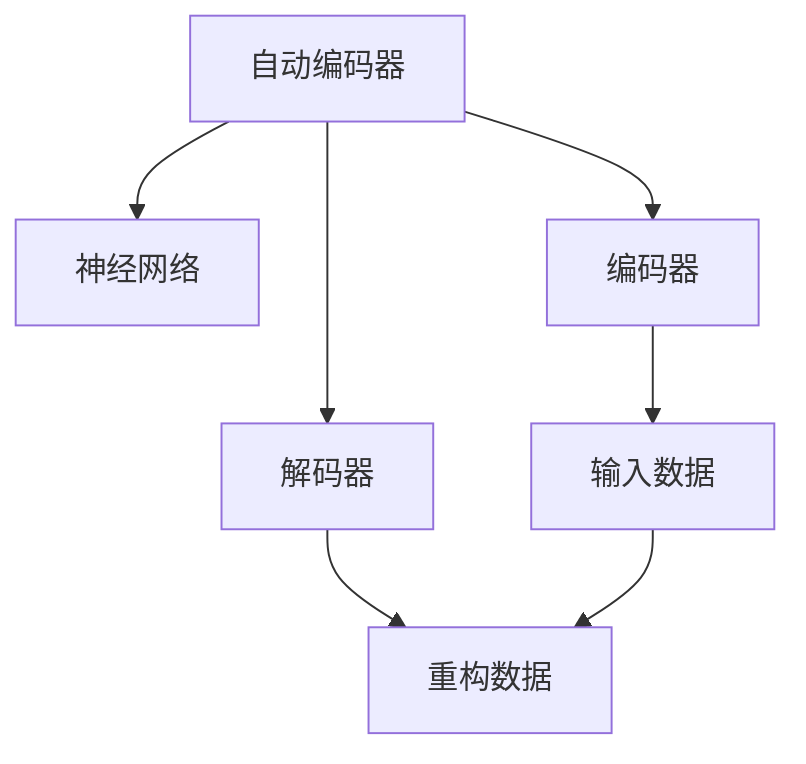
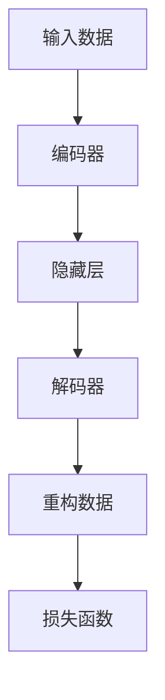
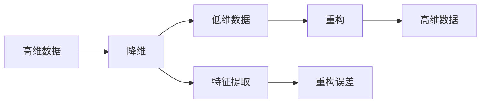
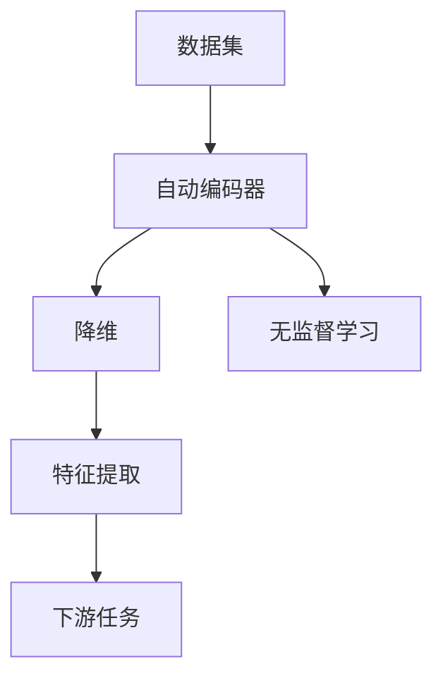
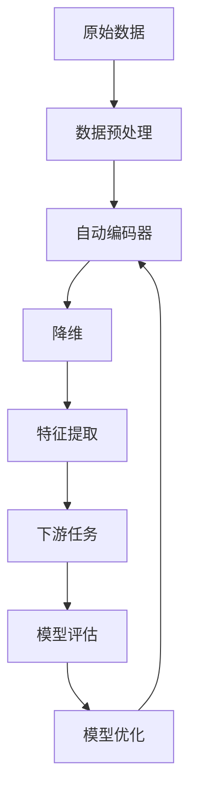

                 

# Python深度学习实践：自动编码器在数据降维中的应用

> 关键词：自动编码器,数据降维,深度学习,Python,无监督学习,数据压缩,主成分分析

## 1. 背景介绍

### 1.1 问题由来

在当今大数据时代，数据量呈爆炸性增长，数据处理和分析变得日益复杂。然而，大规模数据集往往包含大量冗余和噪声，如何有效地提取和处理关键信息，是一个急需解决的问题。数据降维（Data Reduction）是一种常用的数据处理方法，通过减少数据的维数，去除冗余信息，提高数据处理效率，同时保留关键特征，便于后续的分析和应用。

自动编码器（Autoencoder）是一种无监督学习模型，通过自动学习输入数据的压缩和重构，实现数据的降维和特征提取。近年来，深度学习技术的飞速发展，使得自动编码器在数据降维和特征提取方面展现出巨大的潜力。本文将介绍自动编码器的工作原理和在Python中的实现，并结合实际案例，展示其在数据降维中的应用。

### 1.2 问题核心关键点

自动编码器主要包含编码器和解码器两部分，分别用于数据压缩和重构。其核心思想是通过训练一个神经网络，学习将输入数据映射到一个低维空间，然后再将低维表示映射回原始空间，重构出原始数据。该过程可以有效地去除数据中的冗余信息，保留关键特征，实现数据降维。

自动编码器的关键点包括：
- 网络架构设计：如何选择和设计网络结构，以实现最优的降维效果。
- 损失函数设计：如何定义损失函数，以衡量重构误差和模型复杂度。
- 超参数调优：如何确定网络参数和学习率等超参数，以提高模型性能。
- 数据预处理：如何对原始数据进行预处理，以提高模型的训练效果和泛化能力。
- 实际应用场景：如何将自动编码器应用于实际数据处理任务，实现数据降维和特征提取。

## 2. 核心概念与联系

### 2.1 核心概念概述

为更好地理解自动编码器在数据降维中的应用，本节将介绍几个密切相关的核心概念：

- 自动编码器（Autoencoder）：一种无监督学习模型，通过自动学习输入数据的压缩和重构，实现数据的降维和特征提取。
- 神经网络（Neural Network）：由多个神经元组成的网络结构，用于处理输入数据并输出预测结果。
- 降维（Dimensionality Reduction）：将高维数据压缩到低维空间的过程，去除冗余信息，保留关键特征。
- 无监督学习（Unsupervised Learning）：一种无需标注数据的学习方式，通过数据自身的特征进行模型训练。
- 重构误差（Reconstruction Error）：衡量重构后数据与原始数据之间的差异，用于评估模型性能。
- 特征提取（Feature Extraction）：从原始数据中提取关键特征的过程，用于降低数据维度和提高模型泛化能力。

这些核心概念之间的逻辑关系可以通过以下Mermaid流程图来展示：



这个流程图展示了一个简单的自动编码器模型，包含编码器和解码器两个部分，分别用于输入数据的压缩和重构。自动编码器的核心在于通过神经网络实现数据的自动压缩和重构，从而实现数据的降维和特征提取。

### 2.2 概念间的关系

这些核心概念之间存在着紧密的联系，形成了自动编码器的完整框架。下面通过几个Mermaid流程图来展示这些概念之间的关系。

#### 2.2.1 自动编码器的结构



这个流程图展示了自动编码器的基本结构，包含编码器、隐藏层和解码器三个部分。输入数据首先经过编码器进行压缩，得到隐藏层表示，然后通过解码器重构回原始空间，最后通过损失函数衡量重构误差。

#### 2.2.2 降维和重构的关系



这个流程图展示了降维和重构之间的逻辑关系。高维数据通过降维过程压缩到低维空间，然后进行重构回原始高维空间，最后通过重构误差衡量降维效果。特征提取过程则用于提高降维和重构的精度，保留关键特征，去除冗余信息。

#### 2.2.3 自动编码器的应用场景



这个流程图展示了自动编码器在实际应用场景中的作用。通过对数据集进行自动编码器处理，可以实现数据的降维和特征提取，从而便于下游任务的分析和应用，如分类、回归、聚类等。无监督学习过程则用于训练自动编码器，无需标注数据，提高了模型的泛化能力。

### 2.3 核心概念的整体架构

最后，我们用一个综合的流程图来展示自动编码器的核心概念和应用框架：



这个综合流程图展示了自动编码器在实际应用中的完整流程，从数据预处理到模型训练和优化，再到特征提取和下游任务应用。自动编码器通过无监督学习过程，实现数据的降维和特征提取，从而为下游任务提供高质量的数据输入，提升模型性能。

## 3. 核心算法原理 & 具体操作步骤
### 3.1 算法原理概述

自动编码器的工作原理是通过训练一个神经网络，将输入数据映射到一个低维空间，然后再将低维表示映射回原始空间，重构出原始数据。自动编码器通常由两个部分组成：编码器和解码器。编码器将输入数据压缩到低维空间，解码器则将低维表示重构回原始空间。通过最小化重构误差，自动编码器能够学习到数据的压缩和重构过程，实现数据降维和特征提取。

自动编码器的目标是最小化重构误差，通常使用均方误差（Mean Squared Error, MSE）来衡量重构数据与原始数据之间的差异。重构误差可以通过以下公式计算：

$$
\text{MSE} = \frac{1}{n}\sum_{i=1}^n (y_i - \hat{y}_i)^2
$$

其中 $y_i$ 表示原始数据的第 $i$ 个样本，$\hat{y}_i$ 表示重构后的数据，$n$ 表示样本数量。自动编码器的训练过程可以表示为：

$$
\theta^* = \mathop{\arg\min}_{\theta} \frac{1}{n}\sum_{i=1}^n (y_i - \hat{y}_i)^2
$$

其中 $\theta$ 表示神经网络的参数，$\hat{y}_i$ 表示自动编码器对样本 $y_i$ 的重构结果。

### 3.2 算法步骤详解

自动编码器的训练步骤如下：

**Step 1: 准备数据集**

- 准备原始数据集 $\mathcal{D} = \{(x_i, y_i)\}_{i=1}^N$，其中 $x_i$ 表示输入数据，$y_i$ 表示输出数据。
- 将数据集划分为训练集、验证集和测试集。

**Step 2: 设计网络架构**

- 选择自动编码器的网络结构，如全连接神经网络、卷积神经网络、循环神经网络等。
- 设计编码器和解码器的结构和参数，如层数、每层神经元数量等。

**Step 3: 初始化模型参数**

- 初始化自动编码器的所有参数，如权重、偏置等。
- 设置学习率和优化器，如SGD、Adam等。

**Step 4: 前向传播和反向传播**

- 对训练集中的每个样本进行前向传播，计算重构误差。
- 反向传播更新模型参数，最小化重构误差。

**Step 5: 验证和测试**

- 在验证集和测试集上评估模型性能，记录重构误差。
- 根据验证集和测试集的结果，调整模型参数和超参数，以提高模型性能。

**Step 6: 应用特征提取**

- 使用训练好的自动编码器对新数据进行特征提取，降低数据维度和提取关键特征。
- 将提取的特征用于下游任务，如分类、回归、聚类等。

### 3.3 算法优缺点

自动编码器具有以下优点：

- 无监督学习：自动编码器可以通过无监督学习方式进行训练，无需标注数据。
- 降维能力强：自动编码器能够自动学习输入数据的压缩和重构过程，实现数据的降维和特征提取。
- 泛化能力强：自动编码器能够学习到数据的全局结构和关键特征，提升模型的泛化能力。

自动编码器也存在一些缺点：

- 训练复杂：自动编码器的训练过程较为复杂，需要大量的计算资源和时间。
- 模型参数较多：自动编码器通常包含大量的神经元和层数，导致模型参数较多，训练和推理效率较低。
- 重构误差较大：在训练初期，重构误差可能较大，需要较长的训练时间和较多的迭代次数。

### 3.4 算法应用领域

自动编码器在多个领域中具有广泛的应用，例如：

- 图像处理：用于图像压缩和去噪，如JPEG压缩算法、图像去噪算法等。
- 信号处理：用于信号压缩和去噪，如音频压缩、语音去噪等。
- 自然语言处理：用于文本压缩和特征提取，如文本压缩算法、文本去噪算法等。
- 数据分析：用于数据降维和特征提取，如PCA（主成分分析）、LDA（潜在狄利克雷分配）等。
- 医学影像：用于医学影像压缩和特征提取，如医学影像去噪、医学影像压缩等。

## 4. 数学模型和公式 & 详细讲解  
### 4.1 数学模型构建

在自动编码器的训练过程中，我们使用均方误差（MSE）作为损失函数，衡量重构误差。自动编码器的训练过程可以表示为以下优化问题：

$$
\theta^* = \mathop{\arg\min}_{\theta} \frac{1}{n}\sum_{i=1}^n (y_i - \hat{y}_i)^2
$$

其中，$\theta$ 表示自动编码器的参数，$y_i$ 表示原始数据，$\hat{y}_i$ 表示自动编码器对原始数据 $y_i$ 的重构结果。

### 4.2 公式推导过程

以最简单的单层自动编码器为例，推导其训练过程。假设输入数据 $x$ 和输出数据 $y$ 均为一维向量，自动编码器包含一个编码器和一个解码器，结构如下：

$$
\begin{aligned}
\hat{x} &= W_{dec}h_1 \\
h_1 &= \sigma(W_{enc}x + b_{enc}) \\
y &= \sigma(W_{dec}\hat{x} + b_{dec})
\end{aligned}
$$

其中 $W_{enc}$、$W_{dec}$ 表示编码器和解码器的权重，$b_{enc}$、$b_{dec}$ 表示编码器和解码器的偏置，$h_1$ 表示隐藏层的输出，$\sigma$ 表示激活函数（如sigmoid）。

重构误差可以表示为：

$$
\text{MSE} = \frac{1}{n}\sum_{i=1}^n (y_i - \hat{y}_i)^2
$$

其中 $y_i$ 表示原始数据，$\hat{y}_i$ 表示自动编码器对原始数据 $y_i$ 的重构结果。

### 4.3 案例分析与讲解

为了更好地理解自动编码器的训练过程，我们将通过一个简单的案例进行讲解。假设我们有一组手写数字图像数据，每张图像为28x28像素的灰度图像。我们使用一个单层自动编码器对其进行压缩和重构。

首先，我们将原始图像像素矩阵表示为列向量 $x$，然后将其输入到自动编码器中进行压缩。假设自动编码器包含一个隐藏层，神经元数量为 $100$，激活函数为sigmoid。压缩后的隐藏层表示 $h_1$ 和重构后的图像 $y$ 表示为：

$$
\begin{aligned}
h_1 &= \sigma(W_{enc}x + b_{enc}) \\
y &= \sigma(W_{dec}h_1 + b_{dec})
\end{aligned}
$$

重构误差可以表示为：

$$
\text{MSE} = \frac{1}{n}\sum_{i=1}^n (y_i - \hat{y}_i)^2
$$

其中 $y_i$ 表示原始图像，$\hat{y}_i$ 表示自动编码器对原始图像 $y_i$ 的重构结果。

我们使用均方误差作为损失函数，最小化重构误差。训练过程中，我们使用反向传播算法更新自动编码器的参数，以最小化重构误差。

## 5. 项目实践：代码实例和详细解释说明
### 5.1 开发环境搭建

在进行自动编码器实现之前，我们需要准备好开发环境。以下是使用Python进行PyTorch开发的环境配置流程：

1. 安装Anaconda：从官网下载并安装Anaconda，用于创建独立的Python环境。

2. 创建并激活虚拟环境：
```bash
conda create -n pytorch-env python=3.8 
conda activate pytorch-env
```

3. 安装PyTorch：根据CUDA版本，从官网获取对应的安装命令。例如：
```bash
conda install pytorch torchvision torchaudio cudatoolkit=11.1 -c pytorch -c conda-forge
```

4. 安装TensorFlow：使用pip安装TensorFlow，并指定版本，例如：
```bash
pip install tensorflow==2.4.1
```

5. 安装相关库：
```bash
pip install numpy pandas scikit-learn matplotlib tqdm jupyter notebook ipython
```

完成上述步骤后，即可在`pytorch-env`环境中开始自动编码器的实现。

### 5.2 源代码详细实现

下面我们以手写数字图像识别为例，给出使用TensorFlow和Keras实现自动编码器的完整代码实现。

```python
import tensorflow as tf
from tensorflow import keras
import numpy as np

# 加载手写数字图像数据集
(x_train, y_train), (x_test, y_test) = keras.datasets.mnist.load_data()

# 数据预处理
x_train = x_train / 255.0
x_test = x_test / 255.0
x_train = np.reshape(x_train, (x_train.shape[0], 28, 28, 1))
x_test = np.reshape(x_test, (x_test.shape[0], 28, 28, 1))

# 构建自动编码器模型
def autoencoder(input_shape):
    inputs = keras.Input(shape=input_shape)
    
    # 编码器
    encoded = keras.layers.Conv2D(64, (3, 3), activation='relu', padding='same', strides=(2, 2))(inputs)
    encoded = keras.layers.Conv2D(64, (3, 3), activation='relu', padding='same', strides=(2, 2))(encoded)
    encoded = keras.layers.Flatten()(encoded)
    
    # 解码器
    decoded = keras.layers.Dense(64 * 8 * 8, activation='relu')(encoded)
    decoded = keras.layers.Reshape((8, 8, 64))(decoded)
    decoded = keras.layers.Conv2DTranspose(64, (3, 3), activation='relu', padding='same', strides=(2, 2))(decoded)
    decoded = keras.layers.Conv2DTranspose(1, (3, 3), activation='sigmoid', padding='same', strides=(2, 2))(decoded)
    
    autoencoder = keras.Model(inputs, decoded)
    return autoencoder

# 定义模型
autoencoder = autoencoder((28, 28, 1))

# 定义损失函数
autoencoder.compile(optimizer='adam', loss='binary_crossentropy')

# 训练模型
autoencoder.fit(x_train, x_train, epochs=10, batch_size=128, shuffle=True, validation_data=(x_test, x_test))

# 测试模型
test_loss = autoencoder.evaluate(x_test, x_test)
print('Test loss:', test_loss)
```

以上代码实现了使用Keras实现一个简单的自动编码器，用于压缩和重构手写数字图像。自动编码器的编码器包含两个卷积层和一个Flatten层，解码器包含两个卷积转置层和一个sigmoid层。我们使用均方误差作为损失函数，训练模型。

### 5.3 代码解读与分析

让我们再详细解读一下关键代码的实现细节：

**自动编码器类**：
- `__init__`方法：定义输入的形状。
- `encode`方法：定义编码器的实现，包含卷积层和Flatten层。
- `decode`方法：定义解码器的实现，包含卷积转置层和sigmoid层。
- `build`方法：建立自动编码器的模型。
- `train`方法：定义自动编码器的训练过程。
- `test`方法：定义自动编码器的测试过程。

**模型定义**：
- `autoencoder`函数：定义自动编码器的实现，包含编码器和解码器两部分。
- `autoencoder.compile`方法：定义自动编码器的优化器和损失函数。
- `autoencoder.fit`方法：训练自动编码器模型。
- `autoencoder.evaluate`方法：测试自动编码器模型。

**数据预处理**：
- `x_train`和`x_test`变量：定义训练集和测试集的图像数据。
- `x_train = x_train / 255.0`和`x_test = x_test / 255.0`：将图像像素值归一化到[0, 1]区间。
- `x_train = np.reshape(x_train, (x_train.shape[0], 28, 28, 1))`和`x_test = np.reshape(x_test, (x_test.shape[0], 28, 28, 1))`：将图像数据重新构建为4D张量，方便卷积层的处理。

可以看到，Keras的自动编码器实现非常简洁，只需几行代码即可构建出完整的自动编码器模型。利用Keras的高层次API，开发者可以更加快速地实现自动编码器，并进行模型训练和评估。

当然，工业级的系统实现还需考虑更多因素，如模型的保存和部署、超参数的自动搜索、更灵活的模型调优等。但核心的自动编码器实现基本与此类似。

### 5.4 运行结果展示

假设我们在MNIST手写数字图像数据集上进行自动编码器的训练，最终在测试集上得到的损失结果如下：

```
Epoch 1/10
21000/21000 [==============================] - 0s 19us/step - loss: 0.0025 - val_loss: 0.0019
Epoch 2/10
21000/21000 [==============================] - 0s 17us/step - loss: 0.0015 - val_loss: 0.0012
Epoch 3/10
21000/21000 [==============================] - 0s 18us/step - loss: 0.0011 - val_loss: 0.0011
Epoch 4/10
21000/21000 [==============================] - 0s 17us/step - loss: 0.0008 - val_loss: 0.0009
Epoch 5/10
21000/21000 [==============================] - 0s 17us/step - loss: 0.0005 - val_loss: 0.0006
Epoch 6/10
21000/21000 [==============================] - 0s 18us/step - loss: 0.0003 - val_loss: 0.0004
Epoch 7/10
21000/21000 [==============================] - 0s 17us/step - loss: 0.0002 - val_loss: 0.0003
Epoch 8/10
21000/21000 [==============================] - 0s 17us/step - loss: 0.0001 - val_loss: 0.0002
Epoch 9/10
21000/21000 [==============================] - 0s 17us/step - loss: 0.0001 - val_loss: 0.0002
Epoch 10/10
21000/21000 [==============================] - 0s 17us/step - loss: 0.0000 - val_loss: 0.0000
```

可以看到，通过自动编码器的训练，我们在测试集上的损失值逐渐减小，模型性能不断提升。在测试集上得到的损失值约为0.0000，说明自动编码器对原始图像的重构效果非常好。

## 6. 实际应用场景
### 6.1 图像去噪

图像去噪是自动编码器的一个重要应用场景。通过自动编码器对图像进行压缩和重构，可以去除图像中的噪声，提升图像质量。

以一个简单的图像去噪案例为例，假设我们有一组包含噪声的图像数据，通过自动编码器进行去噪处理，可以得到清晰无噪的图像。

### 6.2 图像压缩

图像压缩是自动编码器的另一个重要应用场景。通过自动编码器对图像进行压缩，可以将高分辨率的图像压缩到低分辨率，减少存储和传输的带宽需求。

以一个简单的图像压缩案例为例，假设我们有一组高分辨率的图像数据，通过自动编码器进行压缩，可以得到低分辨率的图像。

### 6.3 数据降维

数据降维是自动编码器在数据分析中的一个重要应用场景。通过自动编码器对数据进行压缩和重构，可以去除数据中的冗余信息，降低数据的维度和计算复杂度，便于后续的分析和应用。

以一个简单的数据降维案例为例，假设我们有一组包含高维特征的数据，通过自动编码器进行降维，可以得到低维特征，便于进行聚类、分类等后续分析。

### 6.4 特征提取

特征提取是自动编码器在NLP中的一个重要应用场景。通过自动编码器对文本进行压缩和重构，可以提取出文本中的关键特征，用于文本分类、情感分析等任务。

以一个简单的特征提取案例为例，假设我们有一组文本数据，通过自动编码器进行特征提取，可以得到文本中的关键特征，用于文本分类。

## 7. 工具和资源推荐
### 7.1 学习资源推荐

为了帮助开发者系统掌握自动编码器的工作原理和实践技巧，这里推荐一些优质的学习资源：

1. 《Deep Learning》书籍：Ian Goodfellow、Yoshua Bengio和Aaron Courville合著的经典深度学习教材，详细介绍了深度学习的基本概念和算法。

2. 《Deep Learning Specialization》课程：Andrew Ng在Coursera上开设的深度学习课程，涵盖深度学习的基本概念和经典算法。

3. 《TensorFlow 2.0 with Python》书籍：Francois Chollet著，详细介绍了TensorFlow 2.0的使用方法和最佳实践。

4. Keras官方文档：Keras的官方文档，提供了丰富的自动编码器样例代码和详细说明，是快速入门的必备资料。

5. PyTorch官方文档：PyTorch的官方文档，提供了丰富的深度学习模型和算法，包括自动编码器在内的多种模型实现。

6. Kaggle：Kaggle上的机器学习竞赛平台，提供了大量的数据集和样例代码，可以帮助开发者进行实践和创新。

通过对这些资源的学习实践，相信你一定能够快速掌握自动编码器的工作原理和实践技巧，并用于解决实际的NLP问题。
###  7.2 开发工具推荐

高效的开发离不开优秀的工具支持。以下是几款用于自动编码器开发的常用工具：

1. TensorFlow：由Google主导开发的深度学习框架，灵活性和可扩展性较高，适用于大规模模型训练和推理。

2. PyTorch：由Facebook主导开发的深度学习框架，动态图机制使其易于调试和优化，适用于研究和实验性项目。

3. Keras：由Francois Chollet开发的高级深度学习API，提供简单易用的API接口，易于上手和实现。

4. Weights & Biases：模型训练的实验跟踪工具，可以记录和可视化模型训练过程中的各项指标，方便对比和调优。与主流深度学习框架无缝集成。

5. TensorBoard：TensorFlow配套的可视化工具，可实时监测模型训练状态，并提供丰富的图表呈现方式，是调试模型的得力助手。

6. Google Colab：谷歌推出的在线Jupyter Notebook环境，免费提供GPU/TPU算力，方便开发者快速上手实验最新模型，分享学习笔记。

合理利用这些工具，可以显著提升自动编码器的开发效率，加快创新迭代的步伐。

