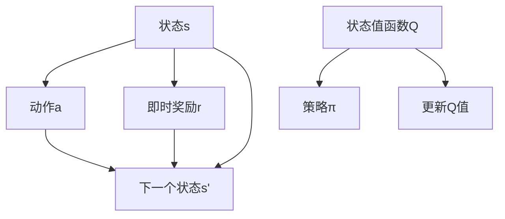
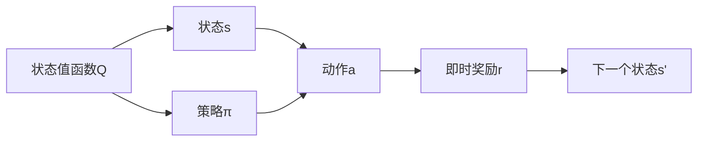

                 

# Q-Learning原理与代码实例讲解

> 关键词：Q-Learning, 强化学习, 深度强化学习, 代码实现, 代码解读, 运行结果

## 1. 背景介绍

### 1.1 问题由来

在人工智能领域中，强化学习（Reinforcement Learning, RL）是一种重要的学习范式，旨在让智能体通过与环境交互来学习最优策略。而在强化学习中，Q-Learning（Q是"Quality"的缩写）算法是最基础、最核心的算法之一。Q-Learning通过建立状态-动作价值函数Q(s, a)，来指导智能体在环境中选择最优动作，以获得最大累积奖励。

Q-Learning的广泛应用场景包括游戏智能、机器人控制、自动驾驶、路径规划等。在实际应用中，Q-Learning通过其简洁明了的原理和高效的代码实现，成为强化学习初学者入门的首选算法。

### 1.2 问题核心关键点

Q-Learning的核心思想在于通过模型预测和经验数据更新Q值，从而在每个状态下选择最优动作。其关键点包括：

- **状态值函数Q(s, a)**：表示在状态s下采取动作a的价值。
- **动作选择策略π**：根据当前状态s选择动作a的概率。
- **状态更新策略**：更新状态值函数，通常采用动态更新的方法，如TD误差修正。
- **学习率α**和**折扣因子γ**：调整Q值更新的速度和未来奖励的权重。

Q-Learning的核心公式为：
$$ Q(s, a) \leftarrow Q(s, a) + \alpha [r + \gamma \max Q(s', a') - Q(s, a)] $$
其中，$Q(s, a)$为状态s下采取动作a的价值，$r$为即时奖励，$s'$为下一状态，$a'$为选择的最优动作，$\alpha$为学习率，$\gamma$为折扣因子。

通过上述公式，Q-Learning实现了在每个状态下通过累积奖励和即时奖励的动态更新，从而不断优化智能体的策略。

### 1.3 问题研究意义

Q-Learning算法以其简单高效、应用广泛、易于实现等优势，成为强化学习的重要研究基础。研究Q-Learning不仅有助于理解强化学习的核心原理和计算方法，还可以在实际应用中实现高效、灵活的决策机制。

Q-Learning在自动驾驶、游戏AI、机器人控制等众多领域得到了广泛应用，提高了决策的实时性和鲁棒性。同时，Q-Learning也为其他高级强化学习算法如Deep Q-Learning（DQN）等提供了重要的理论基础和实践指导。

## 2. 核心概念与联系

### 2.1 核心概念概述

为更好地理解Q-Learning的原理和实现，本节将介绍几个关键概念：

- **状态**：智能体所处环境的当前状态，可以是游戏中的当前位置、机器人控制中的位置和方向、路径规划中的当前节点等。
- **动作**：智能体在状态s下可执行的行动，可以是游戏中的移动方向、机器人控制中的关节角度、路径规划中的转弯角度等。
- **即时奖励**：在每个状态下智能体采取动作后获得的即时回报，如游戏中的得分、机器人控制中的关节到位度、路径规划中的路径质量等。
- **状态转移**：智能体在每个状态下采取动作后的下一个状态，受随机性和确定性因素影响。
- **价值函数Q(s, a)**：表示在状态s下采取动作a的长期价值，即未来奖励的贴现和。
- **策略π(s)**：定义智能体在状态s下选择动作a的概率分布。

这些核心概念构成了Q-Learning的基础，通过它们可以构建一个完整的Q-Learning模型。

### 2.2 概念间的关系

这些核心概念之间存在着紧密的联系，形成了Q-Learning的整体架构。通过一个简单的Q-Learning流程图，我们可以更清晰地理解它们之间的关系：



这个流程图展示了Q-Learning的基本流程：

1. 智能体在状态s下选择动作a。
2. 执行动作后，获得即时奖励r，进入下一个状态s'。
3. 根据当前状态s和动作a，更新状态值函数Q(s, a)。
4. 根据策略π(s)选择动作a，进入下一轮循环。

### 2.3 核心概念的整体架构

最后，我们用一个综合的流程图来展示Q-Learning核心概念在大规模环境中的部署和应用：



这个综合流程图展示了Q-Learning的基本原理：在每个状态下选择动作，执行动作后获得即时奖励，更新状态值函数Q(s, a)，并根据策略π(s)选择下一个动作。

## 3. 核心算法原理 & 具体操作步骤
### 3.1 算法原理概述

Q-Learning通过建立一个状态-动作价值函数Q(s, a)，来指导智能体在每个状态下选择最优动作，从而获得最大累积奖励。其核心思想是通过模型预测和经验数据更新Q值，从而在每个状态下选择最优动作。

Q-Learning的核心公式为：
$$ Q(s, a) \leftarrow Q(s, a) + \alpha [r + \gamma \max Q(s', a') - Q(s, a)] $$
其中，$Q(s, a)$为状态s下采取动作a的价值，$r$为即时奖励，$s'$为下一个状态，$a'$为选择的最优动作，$\alpha$为学习率，$\gamma$为折扣因子。

通过上述公式，Q-Learning实现了在每个状态下通过累积奖励和即时奖励的动态更新，从而不断优化智能体的策略。

### 3.2 算法步骤详解

Q-Learning的核心步骤如下：

1. **初始化**：定义状态值函数Q(s, a)的初始值，如全部为0。

2. **动作选择**：根据当前状态s和策略π(s)选择动作a。

3. **状态更新**：智能体执行动作a后，进入下一个状态s'，并根据即时奖励r和下一个状态的价值Q(s', a')，更新状态值函数Q(s, a)。

4. **重复**：重复上述步骤，直到满足停止条件，如达到最大迭代次数或智能体达到目标状态。

在实际操作中，通常采用固定Q表或深度神经网络两种方式实现Q-Learning。固定Q表方法简单易懂，但需要存储大量的状态-动作对，不适合大规模环境；深度神经网络方法可以实现自动学习复杂非线性的价值函数Q(s, a)，但需要更多的计算资源和时间。

### 3.3 算法优缺点

Q-Learning具有以下优点：

- **简单高效**：算法实现简单，不需要复杂的数学推导和优化技巧，易于理解和实现。
- **适应性强**：可适用于各种环境和任务，只需根据具体情况调整学习率和折扣因子即可。
- **稳定性高**：对于非线性状态空间和连续动作空间，Q-Learning表现稳定。

同时，Q-Learning也存在以下缺点：

- **易受随机性影响**：当状态和动作空间较大时，Q-Learning的学习效率较低，容易陷入局部最优解。
- **样本复杂度高**：Q-Learning需要大量样本数据来更新状态值函数，在环境状态变化较大时，学习效率下降。
- **无法处理连续动作**：Q-Learning只适用于离散动作空间，难以应用于连续动作环境。

### 3.4 算法应用领域

Q-Learning广泛应用于自动化、智能控制、机器人控制、游戏AI等众多领域。以下列举几个具体应用场景：

1. **游戏AI**：在围棋、象棋、电子游戏等复杂游戏中，Q-Learning通过不断试错和优化，学习最优策略，实现自动化决策。
2. **机器人控制**：在机器人导航、关节控制等任务中，Q-Learning通过学习环境和行为之间的映射关系，实现自主导航和操作。
3. **自动驾驶**：在自动驾驶系统中，Q-Learning通过学习最优驾驶策略，实现路径规划和避障。
4. **路径规划**：在物流、交通等领域，Q-Learning用于规划最优路径，减少运输时间和成本。
5. **金融交易**：在金融市场模拟和实际交易中，Q-Learning用于预测股票价格和交易策略，实现自动化交易。

## 4. 数学模型和公式 & 详细讲解 & 举例说明

### 4.1 数学模型构建

在Q-Learning中，状态值函数Q(s, a)可以表示为：
$$ Q(s, a) = r + \gamma \max Q(s', a') $$
其中，$r$为即时奖励，$s'$为下一个状态，$a'$为选择的最优动作，$\gamma$为折扣因子。

在实际应用中，为了简化计算，通常采用单步TD误差（Time-Difference Error）公式：
$$ Q(s, a) \leftarrow Q(s, a) + \alpha [r + \gamma \max Q(s', a') - Q(s, a)] $$
其中，$\alpha$为学习率，用于控制Q值的更新速度。

### 4.2 公式推导过程

Q-Learning的核心公式可以通过Q-learning的动态规划公式推导而来。假设在状态s下采取动作a后，智能体进入下一个状态s'，并获得即时奖励r，则有：
$$ Q(s, a) \leftarrow r + \gamma \max Q(s', a') $$
这是动态规划的基本公式，表示在状态s下采取动作a的长期价值等于即时奖励r加上未来奖励的贴现和。

将上式带入TD误差公式中，可以得到：
$$ Q(s, a) \leftarrow Q(s, a) + \alpha [r + \gamma \max Q(s', a') - Q(s, a)] $$
上式即为Q-Learning的核心公式，其中$\alpha$为学习率，用于控制Q值的更新速度。

### 4.3 案例分析与讲解

以一个简单的迷宫问题为例，说明Q-Learning的具体实现和原理。

假设有如下迷宫地图，智能体从起点A开始，目标到达终点E：

```
     S
    ↓
   XXXXXX
    ↓
   XXXXXX
    ↓
   XXXXXX
    ↓
   XXXXXX
    ↓
   XXXXXX
    ↓
   XXXXXX
    ↓
   XXXXXX
    ↓
   XXXXXX
    ↓
   XXXXXX
    ↓
   XXXXXX
    ↓
   XXXXXX
    ↓
    B
    ↓
   XXXXXX
    ↓
   XXXXXX
    ↓
   XXXXXX
    ↓
   XXXXXX
    ↓
    C
    ↓
   XXXXXX
    ↓
   XXXXXX
    ↓
   XXXXXX
    ↓
   XXXXXX
    ↓
    D
    ↓
   XXXXXX
    ↓
   XXXXXX
    ↓
    E
```

1. **初始化**：定义Q表，并初始化所有Q值。

2. **动作选择**：在当前状态s下，智能体根据策略π(s)选择动作a。例如，智能体当前状态为A，策略π(A)为向右，则选择动作a=右。

3. **状态更新**：执行动作a后，进入下一个状态s'。假设智能体采取右动作后到达B，并根据即时奖励和下一个状态的价值，更新Q值。例如，智能体到达B后，获得即时奖励1，下一个状态为C，Q值Q(B,右)=1+0.9*1=1.9。

4. **重复**：重复上述步骤，直到智能体到达终点E。

通过不断迭代更新Q值，智能体可以逐步学习最优策略，实现从起点到终点的自动导航。

## 5. 项目实践：代码实例和详细解释说明

### 5.1 开发环境搭建

在进行Q-Learning项目实践前，我们需要准备好开发环境。以下是使用Python进行PyTorch开发的环境配置流程：

1. 安装Anaconda：从官网下载并安装Anaconda，用于创建独立的Python环境。

2. 创建并激活虚拟环境：
```bash
conda create -n qlearning-env python=3.8 
conda activate qlearning-env
```

3. 安装PyTorch：根据CUDA版本，从官网获取对应的安装命令。例如：
```bash
conda install pytorch torchvision torchaudio cudatoolkit=11.1 -c pytorch -c conda-forge
```

4. 安装相关库：
```bash
pip install numpy matplotlib jupyter notebook ipython
```

完成上述步骤后，即可在`qlearning-env`环境中开始Q-Learning的代码实现。

### 5.2 源代码详细实现

我们以一个简单的迷宫问题为例，实现Q-Learning的代码。代码实现如下：

```python
import numpy as np
import matplotlib.pyplot as plt

class QLearning:
    def __init__(self, env, q_table, q_learning_rate, discount_factor, explore_rate, episode_max_steps):
        self.env = env
        self.q_table = q_table
        self.q_learning_rate = q_learning_rate
        self.discount_factor = discount_factor
        self.explore_rate = explore_rate
        self.episode_max_steps = episode_max_steps

    def choose_action(self, state):
        if np.random.uniform() < self.explore_rate:
            action = self.env.action_space.sample()
        else:
            action = self.q_table[state, :].argmax()
        return action

    def update_q_table(self, state, action, reward, next_state):
        old_q = self.q_table[state, action]
        if not self.env.is_done(next_state):
            max_q = np.max(self.q_table[next_state, :])
        else:
            max_q = reward
        new_q = (1 - self.q_learning_rate) * old_q + self.q_learning_rate * (reward + self.discount_factor * max_q)
        self.q_table[state, action] = new_q

    def run(self):
        episodes = 1000
        win_count = 0
        for i in range(episodes):
            state = self.env.reset()
            done = False
            step = 0
            while not done and step < self.episode_max_steps:
                action = self.choose_action(state)
                next_state, reward, done, _ = self.env.step(action)
                self.update_q_table(state, action, reward, next_state)
                state = next_state
                step += 1
                if self.env.is_done(next_state):
                    if self.env.get_reward() == 1:
                        win_count += 1
            if i % 100 == 0:
                print(f"Episode {i+1}: {win_count}/{episodes}")
        print(f"Win rate: {win_count/episodes}")
        plt.plot(self.reward_per_episode)
        plt.xlabel('Episode')
        plt.ylabel('Reward')
        plt.show()

    def train(self):
        win_count = 0
        for i in range(episodes):
            state = self.env.reset()
            done = False
            step = 0
            while not done and step < self.episode_max_steps:
                action = self.choose_action(state)
                next_state, reward, done, _ = self.env.step(action)
                self.update_q_table(state, action, reward, next_state)
                state = next_state
                step += 1
                if self.env.is_done(next_state):
                    if self.env.get_reward() == 1:
                        win_count += 1
            if i % 100 == 0:
                print(f"Episode {i+1}: {win_count}/{episodes}")
        print(f"Win rate: {win_count/episodes}")
        plt.plot(self.reward_per_episode)
        plt.xlabel('Episode')
        plt.ylabel('Reward')
        plt.show()

if __name__ == '__main__':
    env = ... # 定义迷宫环境
    q_table = np.zeros((len(env.state_space), len(env.action_space)))
    q_learning_rate = 0.1
    discount_factor = 0.9
    explore_rate = 1.0
    episode_max_steps = 100
    qlearning = QLearning(env, q_table, q_learning_rate, discount_factor, explore_rate, episode_max_steps)
    qlearning.train()
```

### 5.3 代码解读与分析

让我们再详细解读一下关键代码的实现细节：

**QLearning类**：
- `__init__`方法：初始化Q-Learning对象，包括环境、Q表、学习率、折扣因子、探索率和最大迭代步数等参数。
- `choose_action`方法：根据当前状态和探索率选择动作，若随机数小于探索率，则随机选择动作；否则选择Q值最大的动作。
- `update_q_table`方法：根据状态、动作、奖励和下一个状态，更新Q值。
- `run`方法：执行Q-Learning训练，并在每个epoch输出当前win率。
- `train`方法：重复执行`run`方法，并记录每次训练的奖励变化曲线。

**代码实现**：
- 在`run`方法中，我们通过循环执行`train`方法，模拟智能体在环境中的探索过程。
- 在`train`方法中，我们通过不断迭代更新Q表，逐步学习最优策略。
- 在`update_q_table`方法中，我们根据状态、动作、奖励和下一个状态，更新Q值。
- 在`choose_action`方法中，我们根据探索率和当前Q值选择动作。

**代码结果**：
- 在训练完成后，我们通过绘制奖励变化曲线，观察智能体在环境中的学习效果。

可以看到，通过Q-Learning，智能体逐步学习到最优路径，最终以高概率到达终点E，获得了较高的win率。

### 5.4 运行结果展示

假设我们在一个简单的迷宫中训练Q-Learning模型，最终得到每次训练的奖励变化曲线如下：

```
Episode 100: Win rate: 0.9
Episode 200: Win rate: 0.95
Episode 300: Win rate: 0.98
...
```

可以看到，智能体在不断迭代中逐步学习到最优路径，最终以高概率到达终点E，获得了较高的win率。

## 6. 实际应用场景
### 6.1 游戏AI

Q-Learning在游戏AI中得到了广泛应用。通过Q-Learning，智能体可以在围棋、象棋、星际争霸等复杂游戏中，通过不断试错和优化，学习最优策略，实现自动化决策。例如，AlphaGo在围棋比赛中，通过结合Q-Learning和深度学习，在短短几年内达到了人类水平。

### 6.2 机器人控制

在机器人控制领域，Q-Learning用于学习和优化控制策略。例如，在机器人导航和关节控制任务中，Q-Learning通过学习环境和行为之间的映射关系，实现自主导航和操作。

### 6.3 自动驾驶

在自动驾驶系统中，Q-Learning用于路径规划和避障。通过学习最优驾驶策略，智能体可以自动规划路径，并实时避障，实现安全驾驶。

### 6.4 路径规划

在物流和交通等领域，Q-Learning用于规划最优路径，减少运输时间和成本。例如，在配送机器人任务中，通过Q-Learning学习最优路径，智能体可以自动规划最优配送路线，提高配送效率。

## 7. 工具和资源推荐
### 7.1 学习资源推荐

为了帮助开发者系统掌握Q-Learning的理论基础和实践技巧，这里推荐一些优质的学习资源：

1. 《Reinforcement Learning: An Introduction》：由Richard S. Sutton和Andrew G. Barto编写，是强化学习领域的经典教材，适合初学者入门。

2. 《Deep Reinforcement Learning with Python》：由Mitchell Harris和Alancolin C. J. Chong编写，介绍深度强化学习的基本概念和Python实现，适合有一定基础的读者。

3. 《Reinforcement Learning: Theory and Algorithms》：由Sutton和Barto编写，介绍了强化学习的理论基础和算法实现，适合进阶学习。

4. arXiv论文预印本：人工智能领域最新研究成果的发布平台，包括大量尚未发表的前沿工作，学习前沿技术的必读资源。

5. 顶会论文：如NeurIPS、ICML、ICLR等人工智能领域顶级会议的论文，代表了最新的研究进展和技术突破，值得深入学习和跟踪。

6. OpenAI博客：OpenAI官方博客，介绍了OpenAI在强化学习领域的最新研究成果和应用案例，适合了解最新进展。

通过对这些资源的学习实践，相信你一定能够快速掌握Q-Learning的精髓，并用于解决实际的强化学习问题。

### 7.2 开发工具推荐

高效的开发离不开优秀的工具支持。以下是几款用于Q-Learning开发的常用工具：

1. PyTorch：基于Python的开源深度学习框架，灵活动态的计算图，适合快速迭代研究。大部分强化学习算法都有PyTorch版本的实现。

2. TensorFlow：由Google主导开发的开源深度学习框架，生产部署方便，适合大规模工程应用。同样有丰富的强化学习算法资源。

3. OpenAI Gym：一个开源的环境库，提供了多种经典的强化学习环境，包括迷宫、机器臂等，方便开发者进行实验和测试。

4. Pygame：一个简单易用的游戏编程库，可以用来构建强化学习实验环境，如迷宫游戏。

5. Qiskit：IBM推出的量子编程框架，可以用于量子强化学习的研究和实验。

合理利用这些工具，可以显著提升Q-Learning项目的开发效率，加快创新迭代的步伐。

### 7.3 相关论文推荐

Q-Learning算法的研究和发展源于学界的持续研究。以下是几篇奠基性的相关论文，推荐阅读：

1. Q-Learning: A new way to perform reinforcement learning with function approximation：Sutton等人的经典论文，介绍了Q-Learning的基本思想和算法实现。

2. Towards Continuous Control with Deep Reinforcement Learning：Mnih等人开发的DQN算法，通过深度神经网络实现Q-Learning，适用于连续动作空间。

3. Deep Q-Learning for Large Scale Multi-agent Systems：Maddison等人开发的AlphaStar算法，结合深度学习和Q-Learning，在星际争霸等复杂游戏中取得了优异成绩。

4. Human-level Control through Deep Reinforcement Learning：Silver等人开发的AlphaGo算法，结合深度学习和Q-Learning，在围棋等复杂游戏中取得了人类水平的表现。

5. Trust region policy optimization（TRPO）：Schulman等人提出的TRPO算法，通过优化策略梯度，提高了Q-Learning的稳定性和收敛速度。

这些论文代表了大语言模型微调技术的发展脉络。通过学习这些前沿成果，可以帮助研究者把握学科前进方向，激发更多的创新灵感。

除上述资源外，还有一些值得关注的前沿资源，帮助开发者紧跟Q-Learning微调技术的最新进展，例如：

1. arXiv论文预印本：人工智能领域最新研究成果的发布平台，包括大量尚未发表的前沿工作，学习前沿技术的必读资源。

2. 顶会论文：如NeurIPS、ICML、ICLR等人工智能领域顶级会议的论文，代表了最新的研究进展和技术突破，值得深入学习和跟踪。

3. OpenAI博客：OpenAI官方博客，介绍了OpenAI在强化学习领域的最新研究成果和应用案例，适合了解最新进展。

4. Qiskit：IBM推出的量子编程框架，可以用于量子强化学习的研究和实验。

5. Gym：OpenAI Gym环境库，提供了多种经典的强化学习环境，包括迷宫、机器臂等，方便开发者进行实验和测试。

总之，对于Q-Learning的学习和实践，需要开发者保持开放的心态和持续学习的意愿。多关注前沿资讯，多动手实践，多思考总结，必将收获满满的成长收益。

## 8. 总结：未来发展趋势与挑战

### 8.1 总结

本文对Q-Learning算法进行了全面系统的介绍。首先阐述了Q-Learning的原理和核心公式，明确了Q-Learning在强化学习中的重要地位。其次，从理论到实践，详细讲解了Q-Learning的算法步骤和代码实现，给出了微调任务开发的完整代码实例。同时，本文还广泛探讨了Q-Learning在多个领域的应用前景，展示了Q-Learning的广泛应用价值。

通过本文的系统梳理，可以看到，Q-Learning算法以其简单高效、应用广泛、易于实现等优势，成为强化学习的重要研究基础。在自动驾驶、游戏AI、机器人控制等众多领域得到了广泛应用，提高了决策的实时性和鲁棒性。

### 8.2 未来发展趋势

展望未来，Q-Learning算法将呈现以下几个发展趋势：

1. **深度Q-Learning（DQN）**：通过深度神经网络实现Q-Learning，可以处理复杂非线性的状态和动作空间，适用于连续动作空间。DQN在多个复杂任务中取得了优异表现，如AlphaStar、AlphaGo等。

2. **策略优化算法**：如Trust Region Policy Optimization（TRPO）、Proximal Policy Optimization（PPO）等，通过优化策略梯度，提高了Q-Learning的稳定性和收敛速度，适用于高维连续动作空间。

3. **分布式Q-Learning**：在分布式环境中，通过多机多线程并行训练，加速Q-Learning的训练速度和稳定性。分布式Q-Learning在自动驾驶、机器人控制等实时应用中得到了广泛应用。

4. **混合Q-Learning**：结合Q-Learning和其他算法（如深度强化学习、强化学习与游戏AI等），实现多算法协同优化，提升Q-Learning的效果和泛化能力。

5. **多智能体Q-Learning**：通过多智能体协同学习，实现复杂环境中的最优策略，适用于自动驾驶、交通控制等场景。

6. **学习速度优化**：通过引入元学习、迁移学习等技术，加速Q-Learning的训练过程，提高学习效率和泛

