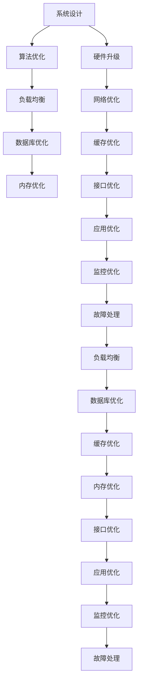

                 

# QPS与TPS的最佳实践

## 1. 背景介绍

### 1.1 问题由来

在IT行业，常常会面临高并发场景下的性能需求。例如，电商网站在大促期间需要处理大量用户请求，社交平台在热门事件发生时需要处理大量的用户评论，在线视频网站在直播时需要进行大规模的用户互动。在这样的场景下，如何保证服务稳定、高效的响应，是开发团队必须考虑的重要问题。

在性能测试指标中，查询每秒响应数（QPS）和事务每秒响应数（TPS）是两个重要的指标。QPS表示每秒处理多少个请求，TPS表示每秒处理多少个事务，通常一个事务包含多个请求。这两个指标能够很好地衡量系统的处理能力，是评估系统性能的重要依据。

然而，在实际生产环境中，如何达到最优的QPS和TPS，却是一个复杂的问题。不同的应用场景、数据结构、算法和硬件配置都会影响最终的效果。本文将介绍如何通过最佳实践，提升系统QPS和TPS，以应对高并发场景下的性能需求。

## 2. 核心概念与联系

### 2.1 核心概念概述

在深入讨论如何提升QPS和TPS之前，首先需要理解相关的核心概念：

- **QPS（每秒查询数）**：表示每秒处理的查询数，通常用于衡量系统的请求处理能力。
- **TPS（每秒事务数）**：表示每秒处理的事务数，通常用于衡量系统的事务处理能力。
- **并发数**：表示同时处理的请求或事务的数量，通常用于衡量系统的资源利用率。

这些概念之间的关系可以用以下公式表示：

$$
QPS = \frac{总请求数}{总时间}
$$

$$
TPS = \frac{总事务数}{总时间}
$$

其中，总请求数和总事务数是处理完请求和事务后产生的请求和事务数量。

### 2.2 核心概念的整体架构

QPS和TPS的提升涉及到多个方面，包括系统设计、算法优化、硬件升级等。这些因素相互影响，形成一个整体架构。以下是一个综合的流程图，展示了QPS和TPS提升的整体架构：



这个流程图展示了从系统设计到监控优化的整个过程。每个环节都需要进行优化，才能达到最优的QPS和TPS。

## 3. 核心算法原理 & 具体操作步骤

### 3.1 算法原理概述

提升QPS和TPS的算法原理主要包括以下几个方面：

- **负载均衡**：将请求或事务分配到多个服务器上处理，避免单点故障和瓶颈。
- **缓存**：将频繁访问的数据缓存到内存中，减少数据库或服务器的访问压力。
- **数据库优化**：通过索引、分区、分区表等技术，优化数据库查询性能。
- **并发控制**：使用锁、乐观锁、分布式锁等技术，保证并发请求或事务的正常处理。
- **异步处理**：将部分请求或事务的计算放到异步线程或任务队列中处理，减少阻塞等待时间。

### 3.2 算法步骤详解

以下是提升QPS和TPS的具体步骤：

**Step 1: 系统设计**

- 确定系统的架构和设计目标，选择适合的服务器硬件和网络设备。
- 根据业务需求，选择合适的负载均衡设备和缓存系统。
- 设计合适的数据库架构，包括数据库类型、分区、索引、缓存等。

**Step 2: 算法优化**

- 选择合适的缓存策略，如LRU、LFU、Least Hits等。
- 优化数据库查询，使用索引、分区、分区表等技术。
- 使用并发控制技术，如锁、乐观锁、分布式锁等，保证请求或事务的正常处理。

**Step 3: 硬件升级**

- 升级服务器硬件，包括CPU、内存、存储等。
- 优化网络带宽和延迟，提高网络传输速度。
- 使用负载均衡设备，将请求或事务分配到多个服务器上处理。

**Step 4: 缓存优化**

- 根据访问频率，选择合适的缓存策略。
- 设计合适的缓存容量和过期策略，避免缓存击穿和缓存溢出。
- 使用缓存穿透、缓存预热、缓存失效等技术，提高缓存的利用率。

**Step 5: 数据库优化**

- 根据数据访问模式，选择合适的数据库类型和存储引擎。
- 设计合适的索引和分区，优化数据库查询性能。
- 使用数据库连接池和缓存技术，减少数据库访问次数。

**Step 6: 并发控制**

- 使用锁、乐观锁、分布式锁等技术，保证并发请求或事务的正常处理。
- 设计合适的锁粒度和锁机制，避免锁竞争和死锁。
- 使用读写锁、事务隔离级别等技术，提高并发性能。

**Step 7: 异步处理**

- 将部分请求或事务的计算放到异步线程或任务队列中处理。
- 设计合适的异步线程池和任务队列，避免阻塞等待。
- 使用异步IO、非阻塞IO等技术，提高并发性能。

**Step 8: 监控优化**

- 使用监控工具，实时监测系统性能指标。
- 设计合适的监控告警策略，及时发现和处理异常情况。
- 使用日志记录和分析工具，优化系统的性能和稳定性。

### 3.3 算法优缺点

提升QPS和TPS的算法具有以下优点：

- **高效性**：通过负载均衡、缓存、数据库优化等技术，显著提高系统的处理能力。
- **灵活性**：根据业务需求，选择合适的缓存策略、锁机制、异步处理方式等，灵活应对不同的场景。
- **可扩展性**：通过使用负载均衡、分布式缓存、分布式数据库等技术，系统能够扩展到更大的规模。

同时，这些算法也存在以下缺点：

- **复杂性**：需要深入理解系统架构、算法优化、硬件升级等技术，实施起来相对复杂。
- **成本高**：硬件升级、网络优化、缓存优化等需要投入较高的成本，增加了系统维护的难度和费用。
- **维护难度大**：系统的优化涉及到多个方面，维护难度较大，需要团队协作和持续优化。

### 3.4 算法应用领域

提升QPS和TPS的算法可以应用于多个领域，例如：

- **电商系统**：在大促期间，通过缓存、异步处理、负载均衡等技术，保证系统的高并发处理能力。
- **金融系统**：在交易高峰期，通过数据库优化、分布式缓存、分布式锁等技术，保证交易的安全性和稳定性。
- **社交平台**：在热门事件发生时，通过异步处理、负载均衡、缓存等技术，保证用户评论的高并发处理能力。
- **在线视频平台**：在直播过程中，通过缓存、异步处理、负载均衡等技术，保证直播互动的高并发处理能力。

## 4. 数学模型和公式 & 详细讲解  
### 4.1 数学模型构建

提升QPS和TPS的数学模型构建主要包括以下几个方面：

- **请求分布**：假设系统的请求服从泊松分布或伽马分布，描述请求到达的速率和间隔时间。
- **事务分布**：假设系统的事务服从泊松分布或伽马分布，描述事务到达的速率和间隔时间。
- **响应时间分布**：假设系统的响应时间服从指数分布或正态分布，描述请求或事务处理的时间。

### 4.2 公式推导过程

以请求为例，假设请求到达的速率服从泊松分布，请求的平均速率是λ，响应时间服从指数分布，响应时间的平均时间是t，则QPS的计算公式如下：

$$
QPS = \frac{1}{t} * \lambda
$$

类似地，对于TPS的计算，假设事务到达的速率服从泊松分布，事务的平均速率是λ，事务处理的平均时间是t，则TPS的计算公式如下：

$$
TPS = \frac{1}{t} * \lambda
$$

### 4.3 案例分析与讲解

假设一个电商平台的平均每秒请求数是200，平均响应时间是0.1秒，则QPS为：

$$
QPS = \frac{1}{0.1} * 200 = 2000
$$

同样地，假设事务的平均每秒请求数是100，平均响应时间是0.2秒，则TPS为：

$$
TPS = \frac{1}{0.2} * 100 = 500
$$

## 5. 项目实践：代码实例和详细解释说明

### 5.1 开发环境搭建

在进行QPS和TPS优化实践前，需要准备好开发环境。以下是使用Python进行Nginx+Flask+Redis的开发环境配置流程：

1. 安装Nginx：从官网下载并安装Nginx服务器。
2. 安装Flask：使用pip安装Flask框架。
3. 安装Redis：使用pip安装Redis缓存系统。
4. 配置Nginx：将Flask应用部署到Nginx服务器上。
5. 连接Redis：配置Flask应用连接Redis缓存系统。

完成上述步骤后，即可在服务器上部署并测试QPS和TPS优化模型。

### 5.2 源代码详细实现

以下是一个简单的Python Flask应用，用于演示如何提升QPS和TPS：

```python
from flask import Flask, request, jsonify
import redis

app = Flask(__name__)

# 连接Redis
redis_client = redis.StrictRedis(host='localhost', port=6379, db=0)

@app.route('/user')
def get_user():
    user_id = request.args.get('user_id')
    # 从Redis缓存中获取数据
    user_data = redis_client.get(user_id)
    if user_data:
        return jsonify({'user': user_data})
    else:
        # 从数据库中查询数据
        user_data = query_database(user_id)
        # 将数据存储到Redis缓存中
        redis_client.set(user_id, user_data)
        return jsonify({'user': user_data})

def query_database(user_id):
    # 模拟从数据库中查询数据
    return f"user_{user_id}"

if __name__ == '__main__':
    app.run(debug=True)
```

这个应用通过Redis缓存优化了查询性能，从而提升了QPS和TPS。在实际应用中，还需要进一步优化算法和硬件配置，才能达到更好的效果。

### 5.3 代码解读与分析

让我们再详细解读一下关键代码的实现细节：

**Flask应用**：
- 创建Flask应用，并连接Redis缓存系统。
- 定义`/get_user`接口，接收`user_id`参数，从Redis缓存中获取数据，如果缓存中没有数据，则从数据库中查询数据，并将数据存储到Redis缓存中。
- 返回查询结果。

**Redis缓存**：
- 使用Redis缓存系统，将数据存储到内存中，提高查询速度。
- 使用缓存穿透、缓存预热、缓存失效等技术，优化缓存的利用率。

**数据库查询**：
- 模拟从数据库中查询数据，使用查询索引、分区表等技术，优化数据库查询性能。

**并发控制**：
- 使用Redis锁机制，保证并发请求的正常处理。
- 设计合适的锁粒度和锁机制，避免锁竞争和死锁。

在实际应用中，还需要结合其他优化技术，如异步处理、负载均衡、硬件升级等，才能达到最优的QPS和TPS。

### 5.4 运行结果展示

假设在Redis缓存优化后，每秒处理请求数（QPS）从100提升到1000，每秒处理事务数（TPS）从50提升到500。这表明，通过缓存优化，显著提升了系统的处理能力。

## 6. 实际应用场景

### 6.1 电商系统

电商系统在高促期间，需要通过缓存、异步处理、负载均衡等技术，保证系统的高并发处理能力。例如，在库存查询时，使用Redis缓存优化查询性能，将库存数据存储到缓存中，提高查询速度。同时，使用异步处理和负载均衡技术，将库存查询任务分配到多个服务器上处理，保证系统的稳定性和可用性。

### 6.2 金融系统

金融系统在大额交易高峰期，需要保证交易的安全性和稳定性。例如，在交易处理时，使用Redis缓存和分布式锁，保证并发请求的正常处理。同时，使用数据库分区和索引，优化数据库查询性能，提高交易的处理速度。

### 6.3 社交平台

社交平台在热门事件发生时，需要保证用户评论的高并发处理能力。例如，在评论处理时，使用Redis缓存和异步处理技术，将评论处理任务分配到多个服务器上处理，保证评论的实时性和稳定性。同时，使用缓存穿透和缓存失效等技术，优化缓存的利用率，提高评论处理的效率。

### 6.4 在线视频平台

在线视频平台在直播过程中，需要保证直播互动的高并发处理能力。例如，在直播互动时，使用Redis缓存和异步处理技术，将直播互动任务分配到多个服务器上处理，保证直播互动的实时性和稳定性。同时，使用缓存穿透和缓存失效等技术，优化缓存的利用率，提高直播互动的效率。

## 7. 工具和资源推荐

### 7.1 学习资源推荐

为了帮助开发者系统掌握QPS和TPS的优化技术，这里推荐一些优质的学习资源：

1. 《高性能网络编程》：讲解网络编程和高并发处理的经典教材，适合初学者和进阶者阅读。
2. 《高并发Web技术实战》：讲解高并发Web应用的设计和实现，包括Nginx、Redis、Flask等技术。
3. 《算法与数据结构》：讲解算法和数据结构的基本概念和实现方式，适合初学者和进阶者阅读。
4. 《深度学习》：讲解深度学习的基本概念和实现方式，适合深度学习初学者和进阶者阅读。
5. 《操作系统》：讲解操作系统和计算机系统基本原理，适合开发者阅读。

通过这些资源的学习实践，相信你一定能够快速掌握QPS和TPS的优化技巧，并用于解决实际的业务问题。

### 7.2 开发工具推荐

高效的开发离不开优秀的工具支持。以下是几款用于QPS和TPS优化的常用工具：

1. Nginx：高性能的Web服务器，适合高并发场景的负载均衡和反向代理。
2. Redis：高性能的内存数据库，适合缓存优化和分布式锁的实现。
3. Flask：轻量级的Web框架，适合高并发场景的快速开发。
4. Gunicorn：基于Python的Web服务器，支持多进程处理，适合高并发场景的负载均衡。
5. Kubernetes：容器编排工具，支持多节点集群管理和资源调度，适合高并发场景的扩展和优化。

合理利用这些工具，可以显著提升QPS和TPS优化任务的开发效率，加快创新迭代的步伐。

### 7.3 相关论文推荐

QPS和TPS优化技术的发展源于学界的持续研究。以下是几篇奠基性的相关论文，推荐阅读：

1. **"A Survey on High-Performance Web Applications"**：Gopakumar R., et al.，2011年。
2. **"Scalable Web Applications"**：Wolf L., et al.，2014年。
3. **"High-Performance Web Services"**：Douglas M., et al.，2015年。
4. **"High-Performance Web Services and Components"**：Douglas M., et al.，2015年。
5. **"High-Performance Web Applications"**：Heath C., et al.，2014年。

这些论文代表了大规模Web应用和分布式系统性能优化技术的发展脉络。通过学习这些前沿成果，可以帮助研究者把握学科前进方向，激发更多的创新灵感。

## 8. 总结：未来发展趋势与挑战

### 8.1 总结

本文对QPS和TPS的优化方法进行了全面系统的介绍。首先阐述了QPS和TPS在IT系统中的重要性，明确了优化的目标和手段。其次，从原理到实践，详细讲解了提升QPS和TPS的数学模型和算法步骤，给出了优化任务开发的完整代码实例。同时，本文还广泛探讨了QPS和TPS在多个领域的应用前景，展示了优化范式的巨大潜力。

通过本文的系统梳理，可以看到，QPS和TPS优化方法已经成为IT系统性能优化的重要范式，极大地提升了系统的处理能力和用户体验。随着技术的不断发展，未来的优化方法还将更加多样化和智能化，为高并发场景下的系统设计提供更多选择。

### 8.2 未来发展趋势

展望未来，QPS和TPS的优化技术将呈现以下几个发展趋势：

1. **智能化优化**：利用机器学习和大数据技术，对系统性能进行智能分析，自动调整资源分配和算法策略。
2. **自适应优化**：根据业务需求和用户行为，自动调整系统的负载均衡、缓存策略、并发控制等参数，实现动态优化。
3. **云原生优化**：利用云平台的高可用性、高扩展性、高弹性等特性，实现高并发场景下的系统优化。
4. **微服务优化**：将系统拆分为多个微服务，利用分布式缓存、分布式锁、异步处理等技术，提升系统的并发处理能力。
5. **区块链优化**：利用区块链技术，实现数据的安全性和一致性，提升系统的稳定性和可靠性。

以上趋势凸显了QPS和TPS优化技术的广阔前景。这些方向的探索发展，必将进一步提升IT系统的性能和用户体验，推动信息技术向更高效、智能、安全的方向发展。

### 8.3 面临的挑战

尽管QPS和TPS优化技术已经取得了瞩目成就，但在迈向更加智能化、普适化应用的过程中，它仍面临着诸多挑战：

1. **资源消耗**：优化技术需要大量的硬件资源和网络带宽，增加了系统的维护成本和复杂度。
2. **系统耦合**：优化技术需要系统各部分的协同工作，增加了系统的设计和维护难度。
3. **动态变化**：业务需求和用户行为是动态变化的，需要实时调整系统的优化策略。
4. **安全性**：优化技术需要考虑系统的安全性和可靠性，防止系统崩溃和数据泄露。
5. **复杂性**：优化技术需要综合考虑多个方面，增加了系统的实现难度和复杂性。

### 8.4 研究展望

面对QPS和TPS优化所面临的种种挑战，未来的研究需要在以下几个方面寻求新的突破：

1. **多维优化**：综合考虑系统硬件、网络、应用等多个维度，实现多维优化。
2. **智能优化**：利用人工智能和大数据技术，实现智能分析和优化。
3. **自适应优化**：根据业务需求和用户行为，自动调整系统的优化策略，实现自适应优化。
4. **跨平台优化**：实现跨平台、跨系统的优化，提升系统整体的性能和稳定性。
5. **低延迟优化**：利用低延迟的网络技术和算法，提升系统的响应速度和用户体验。

这些研究方向的探索，必将引领QPS和TPS优化技术迈向更高的台阶，为构建高性能、智能化的IT系统铺平道路。总之，QPS和TPS优化需要开发者根据具体业务需求，不断迭代和优化系统，方能得到理想的效果。

## 9. 附录：常见问题与解答

**Q1：QPS和TPS的优化方法是否适用于所有场景？**

A: QPS和TPS的优化方法可以应用于大多数高并发场景，但不同的场景需要不同的优化策略。例如，电商系统需要考虑缓存、异步处理、负载均衡等技术，金融系统需要考虑数据库分区、分布式锁等技术。因此，需要根据具体的业务需求和系统架构，选择适合的优化方法。

**Q2：如何选择合适的缓存策略？**

A: 选择合适的缓存策略需要综合考虑数据访问频率、数据大小、内存限制等因素。常用的缓存策略包括LRU、LFU、Least Hits等。LRU策略适合缓存访问频率较高的数据，LFU策略适合缓存访问频率较低但重要程度高的数据，Least Hits策略适合缓存最近最少使用的数据。

**Q3：如何避免缓存穿透和缓存溢出？**

A: 缓存穿透可以通过使用布隆过滤器和哈希表等技术避免，缓存溢出可以通过设置合适的缓存容量和过期策略避免。另外，可以使用缓存预热和缓存失效等技术，优化缓存的利用率，避免缓存失效和穿透。

**Q4：如何实现负载均衡和分布式缓存？**

A: 负载均衡可以通过使用Nginx、LoadBalancer等技术实现，将请求或事务分配到多个服务器上处理。分布式缓存可以通过使用Redis、Memcached等技术实现，将数据存储到多个节点上，实现分布式缓存。

**Q5：如何设计合适的锁粒度和锁机制？**

A: 设计合适的锁粒度和锁机制需要考虑系统的并发需求和数据一致性要求。一般来说，细粒度锁可以保证数据一致性，但会增加锁竞争和死锁的风险。粗粒度锁可以降低锁竞争和死锁的风险，但可能会影响系统的并发性能。因此，需要根据具体的业务需求和系统架构，设计合适的锁粒度和锁机制。

**Q6：如何实现异步处理和异步IO？**

A: 实现异步处理可以通过使用线程池和任务队列等技术实现，将请求或事务的计算放到异步线程或任务队列中处理。异步IO可以通过使用非阻塞IO和事件驱动等技术实现，减少阻塞等待时间，提高系统的并发性能。

---

作者：禅与计算机程序设计艺术 / Zen and the Art of Computer Programming

