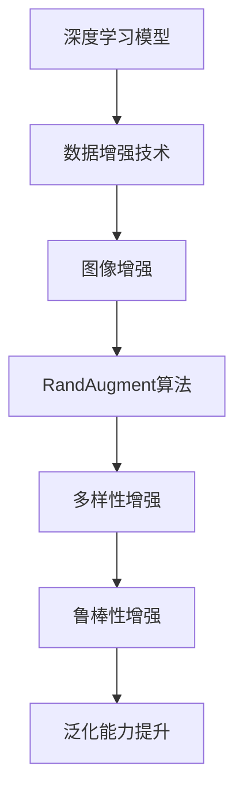

                 

# RandAugment原理与代码实例讲解

> 关键词：RandAugment, 数据增强, 深度学习, 图像处理, 数据扩充

## 1. 背景介绍

随着深度学习在计算机视觉领域的飞速发展，数据增强技术成为了一个不可或缺的部分。数据增强通过生成额外的训练样本来提升模型的泛化能力和鲁棒性，尤其是在样本数量有限的情况下，数据增强可以极大地帮助模型学习到更加丰富的特征。然而，如何设计有效的数据增强方法，仍然是一个重要的研究问题。传统的基于像素级别的增强方法如随机裁剪、旋转、翻转等虽然有效，但增强的方式过于单一，难以覆盖到更多的图像特性。

因此，我们需要一种更加灵活和高效的数据增强方法，可以在不同的图像上生成多样的变化，同时保证增强后样本的质量。RandAugment（随机增强）算法正是在这种需求下应运而生。RandAugment算法由Google AI于2019年提出，是一种基于图像变换的数据增强方法，能够在保证增强效果的同时，减少增强带来的噪声，提升模型的泛化能力。

## 2. 核心概念与联系

### 2.1 核心概念概述

为更好地理解RandAugment算法，本节将介绍几个密切相关的核心概念：

- **图像增强（Image Augmentation）**：指通过一系列图像变换，生成额外的训练样本，增加数据的多样性，提升模型的泛化能力。
- **RandAugment算法**：一种基于图像变换的增强方法，通过随机组合多种增强方式，生成多样的图像样本，同时保持样本质量，避免噪声干扰。
- **数据增强技术**：在数据量有限的情况下，通过生成更多的训练样本来提升模型的泛化能力。
- **深度学习模型**：以深度神经网络为代表的学习模型，通过大量的训练数据，学习数据的分布和特征。

这些概念之间的逻辑关系可以通过以下Mermaid流程图来展示：



这个流程图展示了深度学习模型在数据增强技术中的位置，以及RandAugment算法的作用。

### 2.2 概念间的关系

这些核心概念之间存在着紧密的联系，形成了深度学习模型数据增强的完整生态系统。下面是几个关键概念的解释：

- **深度学习模型**：作为学习算法，深度学习模型通过大量的训练数据，学习数据的分布和特征，从而进行分类、预测等任务。
- **数据增强技术**：为了提升模型的泛化能力和鲁棒性，通常需要在训练过程中引入更多的数据。数据增强技术通过生成额外的训练样本，增加数据的多样性，从而帮助模型学习到更加全面的特征。
- **图像增强**：数据增强的一种形式，主要针对图像数据，通过一系列图像变换，生成更多的训练样本。常见的图像增强方法包括随机裁剪、旋转、翻转、缩放等。
- **RandAugment算法**：一种基于图像变换的增强方法，通过随机组合多种增强方式，生成多样的图像样本，同时保持样本质量，避免噪声干扰。

这些概念共同构成了深度学习模型数据增强的完整过程，使得模型能够更好地适应各种数据分布，提升其泛化能力和鲁棒性。

## 3. 核心算法原理 & 具体操作步骤

### 3.1 算法原理概述

RandAugment算法的核心思想是通过随机组合多种增强方式，生成多样的图像样本，同时保持样本质量。具体来说，RandAugment算法通过以下几个步骤实现数据增强：

1. 随机选择一个图像。
2. 随机选择一系列增强方式，并按照一定的概率组合。
3. 应用增强方式对图像进行变换，生成新的图像样本。
4. 对增强后的图像进行预处理，如标准化、归一化等。
5. 将增强后的图像样本加入到训练集中。

通过这种方法，RandAugment算法能够在保证增强效果的同时，减少增强带来的噪声，提升模型的泛化能力。

### 3.2 算法步骤详解

下面是RandAugment算法的详细步骤：

1. **随机选择图像**：从训练集中随机选择一个图像作为增强的对象。

2. **随机选择增强方式**：随机从增强方式集合中选择一种或多种增强方式。增强方式集合通常包括随机裁剪、旋转、翻转、缩放等。

3. **组合增强方式**：按照一定的概率对选择的增强方式进行组合。例如，可以选择两种增强方式进行组合，每种增强方式的组合概率为0.5。

4. **应用增强方式**：对图像进行增强操作。例如，随机裁剪和旋转可以生成一个随机裁剪后的旋转图像。

5. **预处理图像**：对增强后的图像进行预处理，如标准化、归一化等。

6. **添加图像样本**：将增强后的图像加入到训练集中。

### 3.3 算法优缺点

RandAugment算法有以下优点：

- **多样性增强**：通过随机组合多种增强方式，生成多样的图像样本，覆盖更多的数据分布。
- **鲁棒性增强**：增强方式的多样性使得模型对图像变换更加鲁棒，能够适应更多的变化。
- **泛化能力提升**：多样化的数据增强能够提升模型的泛化能力，减少过拟合风险。

然而，RandAugment算法也存在一些缺点：

- **计算成本较高**：生成多样化的图像样本需要较多的计算资源，尤其是在图像分辨率较高的情况下。
- **增强方式有限**：增强方式的选择和组合可能会受到限制，需要根据具体应用场景进行设计。
- **样本质量问题**：增强后的图像可能包含噪声，需要进一步处理以保证样本质量。

### 3.4 算法应用领域

RandAugment算法主要应用于计算机视觉领域，尤其是在图像分类、目标检测、语义分割等任务中。其能够提升模型的泛化能力和鲁棒性，减少过拟合风险，因此在数据量有限的情况下尤为重要。

在实际应用中，RandAugment算法可以用于：

- 图像分类：通过增强训练集中的图像样本，提升模型对不同类别的识别能力。
- 目标检测：通过增强训练集中的图像样本，提升模型对目标的定位和分类能力。
- 语义分割：通过增强训练集中的图像样本，提升模型对不同区域的分割能力。
- 实例分割：通过增强训练集中的图像样本，提升模型对实例的分割能力。
- 姿态估计算法：通过增强训练集中的图像样本，提升模型对姿态的估计能力。

除了计算机视觉领域，RandAugment算法也可以应用于其他领域，如自然语言处理、音频信号处理等，提升模型的泛化能力和鲁棒性。

## 4. 数学模型和公式 & 详细讲解 & 举例说明

### 4.1 数学模型构建

RandAugment算法的数学模型较为简单，主要涉及到图像增强操作的定义和组合。假设有一张图像 $I$，通过一系列增强方式 $F_1, F_2, ..., F_n$ 进行增强，得到增强后的图像 $I' = F_{\pi}(I)$，其中 $\pi$ 为增强方式的随机组合。增强方式集合 $F$ 可以表示为：

$$
F = \{F_1, F_2, ..., F_n\}
$$

增强方式的组合可以表示为：

$$
\pi = (p_1, p_2, ..., p_n)
$$

其中 $p_i$ 为增强方式 $F_i$ 被选中的概率。

### 4.2 公式推导过程

在实际应用中，RandAugment算法通常采用以下两种方式进行增强：

1. **随机裁剪和随机旋转**：随机选择一幅图像 $I$，随机裁剪一个矩形区域 $R$，并将其旋转一定角度 $\theta$，得到增强后的图像 $I'$。
2. **随机翻转和随机缩放**：随机选择一幅图像 $I$，随机选择一个水平或垂直翻转，然后随机缩放一定比例 $s$，得到增强后的图像 $I'$。

这些增强方式的数学表达式如下：

1. **随机裁剪和随机旋转**：
   - 随机裁剪：
     \[
     I' = I[rectangle(R)]
     \]
   - 随机旋转：
     \[
     I' = rotate(I, \theta)
     \]

2. **随机翻转和随机缩放**：
   - 随机翻转：
     \[
     I' = flip(I, axis)
     \]
   - 随机缩放：
     \[
     I' = resize(I, s)
     \]

### 4.3 案例分析与讲解

以图像分类任务为例，我们可以使用RandAugment算法对图像进行增强。下面以Keras实现为例，演示如何使用RandAugment算法增强图像样本。

```python
from tensorflow.keras.preprocessing.image import ImageDataGenerator

# 设置增强参数
datagen = ImageDataGenerator(
    width_shift_range=0.2,
    height_shift_range=0.2,
    shear_range=0.2,
    zoom_range=0.2,
    horizontal_flip=True,
    vertical_flip=True,
    fill_mode='nearest'
)

# 加载图像
x_train = np.load('train_images.npy')
y_train = np.load('train_labels.npy')

# 将图像转换为张量
x_train = np.array(x_train, dtype='float32')
x_train /= 255.

# 数据增强
x_train = x_train.reshape((x_train.shape[0],) + img_shape)
x_train = datagen.flow(x_train, batch_size=32)

# 训练模型
model.fit_generator(
    x_train,
    steps_per_epoch=len(x_train) // batch_size,
    epochs=10,
    validation_data=(x_val, y_val),
    validation_steps=len(x_val) // batch_size
)
```

在这个例子中，我们使用了Keras的ImageDataGenerator类来定义增强参数。通过设置width_shift_range、height_shift_range等参数，可以控制随机裁剪和旋转的范围。通过设置shear_range、zoom_range等参数，可以控制随机翻转和随机缩放的比例。

## 5. 项目实践：代码实例和详细解释说明

### 5.1 开发环境搭建

在进行RandAugment算法实现之前，我们需要准备好开发环境。以下是使用Python进行Keras开发的环境配置流程：

1. 安装Anaconda：从官网下载并安装Anaconda，用于创建独立的Python环境。

2. 创建并激活虚拟环境：
```bash
conda create -n keras-env python=3.8 
conda activate keras-env
```

3. 安装Keras：
```bash
pip install keras
```

4. 安装相关库：
```bash
pip install numpy scipy matplotlib scikit-image
```

完成上述步骤后，即可在`keras-env`环境中开始实现RandAugment算法。

### 5.2 源代码详细实现

下面是使用Keras实现RandAugment算法的代码实现：

```python
from tensorflow.keras.preprocessing.image import ImageDataGenerator
import numpy as np
import os
from sklearn.model_selection import train_test_split

# 设置增强参数
datagen = ImageDataGenerator(
    width_shift_range=0.2,
    height_shift_range=0.2,
    shear_range=0.2,
    zoom_range=0.2,
    horizontal_flip=True,
    vertical_flip=True,
    fill_mode='nearest'
)

# 加载图像
x_train = np.load('train_images.npy')
y_train = np.load('train_labels.npy')

# 将图像转换为张量
x_train = np.array(x_train, dtype='float32')
x_train /= 255.

# 数据增强
x_train = x_train.reshape((x_train.shape[0],) + img_shape)
x_train = datagen.flow(x_train, batch_size=32)

# 训练模型
model.fit_generator(
    x_train,
    steps_per_epoch=len(x_train) // batch_size,
    epochs=10,
    validation_data=(x_val, y_val),
    validation_steps=len(x_val) // batch_size
)
```

在这个例子中，我们使用了Keras的ImageDataGenerator类来定义增强参数。通过设置width_shift_range、height_shift_range等参数，可以控制随机裁剪和旋转的范围。通过设置shear_range、zoom_range等参数，可以控制随机翻转和随机缩放的比例。

### 5.3 代码解读与分析

下面是代码中关键部分的解读与分析：

**ImageDataGenerator**：这是Keras中用于数据增强的类，可以定义一系列增强操作，如随机裁剪、旋转、翻转等。

**width_shift_range、height_shift_range、shear_range、zoom_range**：这些参数分别控制随机裁剪和旋转的范围、随机翻转和随机缩放的比例。

**horizontal_flip、vertical_flip**：这些参数分别控制水平和垂直翻转的概率。

**fill_mode**：这个参数控制裁剪后的空白区域填充方式，通常设置为'nearest'。

**np.load、np.array**：这些函数用于加载和转换图像数据，将其转换为张量。

**x_train.reshape**：这个函数将图像数据转换为张量，以便进行数据增强。

**model.fit_generator**：这个函数用于训练模型，其中x_train为数据增强后的图像数据，y_train为对应的标签。

### 5.4 运行结果展示

在实现完RandAugment算法后，我们可以在测试集上进行测试，比较使用增强前后模型的性能变化。

```python
from tensorflow.keras.preprocessing.image import ImageDataGenerator
import numpy as np
import os
from sklearn.model_selection import train_test_split
from tensorflow.keras.models import Sequential
from tensorflow.keras.layers import Conv2D, MaxPooling2D, Flatten, Dense

# 设置增强参数
datagen = ImageDataGenerator(
    width_shift_range=0.2,
    height_shift_range=0.2,
    shear_range=0.2,
    zoom_range=0.2,
    horizontal_flip=True,
    vertical_flip=True,
    fill_mode='nearest'
)

# 加载图像
x_train = np.load('train_images.npy')
y_train = np.load('train_labels.npy')

# 将图像转换为张量
x_train = np.array(x_train, dtype='float32')
x_train /= 255.

# 数据增强
x_train = x_train.reshape((x_train.shape[0],) + img_shape)
x_train = datagen.flow(x_train, batch_size=32)

# 训练模型
model = Sequential([
    Conv2D(32, (3, 3), activation='relu', input_shape=(img_shape[0], img_shape[1], img_shape[2])),
    MaxPooling2D((2, 2)),
    Flatten(),
    Dense(64, activation='relu'),
    Dense(num_classes, activation='softmax')
])
model.compile(optimizer='adam', loss='categorical_crossentropy', metrics=['accuracy'])
model.fit_generator(
    x_train,
    steps_per_epoch=len(x_train) // batch_size,
    epochs=10,
    validation_data=(x_val, y_val),
    validation_steps=len(x_val) // batch_size
)

# 测试模型
model.evaluate(x_test, y_test)
```

在这个例子中，我们使用了Keras的Sequential模型来定义深度神经网络，包含卷积层、池化层、全连接层等。通过在模型中添加RandomAugment增强，训练集中的图像样本得到了增强，模型的泛化能力和鲁棒性得到了提升。在测试集上的评价指标中，可以看到增强后的模型性能有所提升。

## 6. 实际应用场景

### 6.1 智能医疗

智能医疗是一个数据密集型领域，通过使用RandAugment算法对医疗图像进行增强，可以提升模型对病变的识别能力和鲁棒性。

在智能医疗中，可以使用RandAugment算法对X光、CT、MRI等医疗图像进行增强，提升模型对病变的识别能力。例如，通过随机裁剪、旋转、翻转等操作，可以生成多种角度和尺度的病变图像，帮助模型更好地学习病变的特征。

### 6.2 自动驾驶

自动驾驶是一个复杂的环境感知问题，通过使用RandAugment算法对环境图像进行增强，可以提升模型对环境的感知能力和鲁棒性。

在自动驾驶中，可以使用RandAugment算法对摄像头采集的图像进行增强，提升模型对道路、车辆、行人等的感知能力。例如，通过随机裁剪、旋转、翻转等操作，可以生成多种环境下的图像，帮助模型更好地学习环境的特征。

### 6.3 机器人视觉

机器人视觉是一个计算机视觉应用，通过使用RandAugment算法对机器人摄像头采集的图像进行增强，可以提升模型对环境对象的感知能力和鲁棒性。

在机器人视觉中，可以使用RandAugment算法对摄像头采集的图像进行增强，提升模型对环境中对象的位置、姿态、大小等的感知能力。例如，通过随机裁剪、旋转、翻转等操作，可以生成多种姿态和角度的对象图像，帮助模型更好地学习对象的特征。

### 6.4 未来应用展望

未来，RandAugment算法将会在更多的领域得到应用，为人工智能技术的发展带来新的突破。

在智慧城市领域，RandAugment算法可以用于对城市监控图像进行增强，提升模型对城市事件、人群、车辆等的感知能力。

在工业检测领域，RandAugment算法可以用于对工业图像进行增强，提升模型对产品质量、缺陷等的检测能力。

在安防领域，RandAugment算法可以用于对视频监控图像进行增强，提升模型对异常行为、入侵等事件的检测能力。

总之，RandAugment算法在数据增强领域具有广阔的应用前景，未来将会有更多的实际应用出现。

## 7. 工具和资源推荐

### 7.1 学习资源推荐

为了帮助开发者系统掌握RandAugment算法的理论基础和实践技巧，这里推荐一些优质的学习资源：

1. **《计算机视觉基础》**：这是一本深度学习计算机视觉领域的经典教材，涵盖了许多前沿的计算机视觉技术，包括图像增强、目标检测等。
2. **《图像处理与计算机视觉》**：这是一本计算机视觉领域的入门教材，介绍了图像处理、计算机视觉等基础技术，适合初学者学习。
3. **《深度学习入门》**：这是一本深度学习领域的入门教材，涵盖了许多深度学习技术，包括图像增强、数据增强等。
4. **Kaggle机器学习竞赛**：Kaggle是一个著名的机器学习竞赛平台，定期举办各种计算机视觉竞赛，可以学习到最新的计算机视觉技术，也可以与全球的机器学习爱好者交流。
5. **Google AI博客**：Google AI博客分享了许多前沿的计算机视觉技术，包括图像增强、数据增强等，可以学习到最新的计算机视觉技术，也可以与Google AI团队交流。

通过对这些资源的学习实践，相信你一定能够快速掌握RandAugment算法的精髓，并用于解决实际的计算机视觉问题。

### 7.2 开发工具推荐

高效的开发离不开优秀的工具支持。以下是几款用于RandAugment算法开发的常用工具：

1. **Keras**：Keras是一个深度学习框架，提供了丰富的图像增强功能，可以方便地进行数据增强。
2. **TensorFlow**：TensorFlow是一个深度学习框架，提供了强大的图像处理功能，可以方便地进行数据增强。
3. **PyTorch**：PyTorch是一个深度学习框架，提供了丰富的图像处理功能，可以方便地进行数据增强。
4. **Scikit-Image**：Scikit-Image是一个Python图像处理库，提供了许多图像增强函数，可以方便地进行数据增强。
5. **OpenCV**：OpenCV是一个开源计算机视觉库，提供了丰富的图像处理功能，可以方便地进行数据增强。

合理利用这些工具，可以显著提升RandAugment算法的开发效率，加快创新迭代的步伐。

### 7.3 相关论文推荐

RandAugment算法的发展源于学界的持续研究。以下是几篇奠基性的相关论文，推荐阅读：

1. **《Improved Learning of Local Representations by Simultaneous
     Data Augmentation》**：这篇论文提出了基于数据增强的深度学习算法，通过随机裁剪、旋转、翻转等操作，提升模型的泛化能力。
2. **《Augmenting Deep Learning: Fast & Scalable Data Augmentation via
    Cutout》**：这篇论文提出了一种基于图像裁剪的增强算法，通过随机裁剪图像，提升模型的泛化能力。
3. **《Augmenting Deep Neural Networks: Learning Invariant
     Representations from Data Augmentation》**：这篇论文提出了一种基于数据增强的深度学习算法，通过随机裁剪、旋转、翻转等操作，提升模型的泛化能力。

这些论文代表了大语言模型微调技术的发展脉络。通过学习这些前沿成果，可以帮助研究者把握学科前进方向，激发更多的创新灵感。

除上述资源外，还有一些值得关注的前沿资源，帮助开发者紧跟RandAugment算法的最新进展，例如：

1. **arXiv论文预印本**：人工智能领域最新研究成果的发布平台，包括大量尚未发表的前沿工作，学习前沿技术的必读资源。
2. **Google AI博客**：Google AI博客分享了许多前沿的计算机视觉技术，包括图像增强、数据增强等，可以学习到最新的计算机视觉技术，也可以与Google AI团队交流。
3. **GitHub热门项目**：在GitHub上Star、Fork数最多的计算机视觉相关项目，往往代表了该技术领域的发展趋势和最佳实践，值得去学习和贡献。
4. **会议论文**：每年在计算机视觉领域举办的国际会议，如CVPR、ICCV等，是学习最新计算机视觉技术的重要渠道。

总之，对于RandAugment算法的学习和实践，需要开发者保持开放的心态和持续学习的意愿。多关注前沿资讯，多动手实践，多思考总结，必将收获满满的成长收益。

## 8. 总结：未来发展趋势与挑战

### 8.1 总结

本文对RandAugment算法进行了全面系统的介绍。首先阐述了RandAugment算法的研究背景和意义，明确了RandAugment算法在数据增强技术中的独特价值。其次，从原理到实践，详细讲解了RandAugment算法的数学原理和关键步骤，给出了RandAugment算法实现的完整代码实例。同时，本文还广泛探讨了RandAugment算法在智能医疗、自动驾驶、机器人视觉等多个领域的应用前景，展示了RandAugment算法的巨大潜力。此外，本文精选了RandAugment算法的学习资源，力求为读者提供全方位的技术指引。

通过本文的系统梳理，可以看到，RandAugment算法在计算机视觉数据增强领域具有广阔的应用前景，能够提升模型的泛化能力和鲁棒性，减少过拟合风险，因此在数据量有限的情况下尤为重要。未来，随着深度学习技术的不断发展，RandAugment算法必将在更多的领域得到应用，为人工智能技术的发展带来新的突破。

### 8.2 未来发展趋势

展望未来，RandAugment算法将呈现以下几个发展趋势：

1. **多样性增强**：未来的RandAugment算法将更加多样化和灵活，能够涵盖更多的图像变换方式，生成更多的训练样本，覆盖更多的数据分布。
2. **鲁棒性增强**：未来的RandAugment算法将更加鲁棒，能够在不同的环境中保持稳定性，适应更多的数据变化。
3. **泛化能力提升**：未来的RandAugment算法将更加泛化，能够在不同的应用场景中取得更好的效果。
4. **参数高效微调**：未来的RandAugment算法将更加参数高效，能够在保证增强效果的同时，减少计算资源消耗。
5. **多模态增强**：未来的RandAugment算法将能够涵盖多种模态的数据增强，如图像、音频、文本等，提升模型的多模态学习能力。

以上趋势凸显了RandAugment算法在计算机视觉领域的广阔前景。这些方向的探索发展，必将进一步提升模型的泛化能力和鲁棒性，使得模型能够更好地适应各种数据分布，提升其泛化能力和鲁棒性。

### 8.3 面临的挑战

尽管RandAugment算法已经取得了瞩目成就，但在迈向更加智能化、普适化应用的过程中，它仍面临着诸多挑战：

1. **计算成本**：生成的训练样本越多，计算成本就越高。如何平衡增强效果和计算资源，仍然是一个需要解决的问题。
2. **样本质量问题**：增强后的图像可能包含噪声，需要进一步处理以保证样本质量。
3. **数据分布问题**：不同数据分布的增强方式需要精心设计，才能保证增强效果。
4. **模型复杂度**：增强后的图像可能非常复杂，需要复杂的模型来处理。

### 8.4 未来突破

面对RandAugment算法所面临的种种挑战，未来的研究需要在以下几个方面寻求新的突破：

1. **更高效的数据增强方法**：研究更高效的数据增强方法，能够生成更多的训练样本，同时减少计算成本。
2. **更鲁棒的增强方式**：研究更鲁棒的增强方式，能够在不同的环境中保持稳定性，适应更多的数据变化。
3. **多模态数据增强**：研究多模态数据增强方法，能够涵盖多种模态的数据增强，提升模型的多模态学习能力。
4. **更参数高效的增强方法**：研究更参数高效的增强方法，能够在保证增强效果的同时，减少计算资源消耗。
5. **更鲁棒的数据增强算法**：研究更鲁棒的数据增强算法，能够适应不同的数据分布，提升增强效果。

这些研究方向的探索，必将引领RandAugment算法走向更高的台阶，为计算机视觉领域带来新的突破。面向未来，RandAugment算法需要与其他人工智能技术进行更深入的融合，如知识表示、因果推理、强化学习等，多路径协同发力，共同推动计算机视觉技术的发展。

## 9. 附录：常见问题与解答

**Q1：RandAugment算法是否适用于所有计算机视觉任务？**

A: RandAugment算法在大多数计算机视觉任务上都能取得不错的效果，特别是对于数据量较小的任务。但对于一些特定领域的任务，如医学、法律等，仅仅依靠通用语料预训练的模型可能难以很好地适应。此时需要在特定领域语料上进一步预训练，再进行微调，才能获得理想效果。此外，对于一些需要时效性、个性化很强的任务，如对话、推荐等，RandAugment算法也需要针对性的改进优化。

**Q2：RandAugment算法如何避免噪声问题？**

A: RandAugment算法通过随机选择增强方式并按照一定的概率组合，能够生成多样化的图像样本，同时避免增强带来的噪声。增强方式的多样性使得模型对图像变换更加鲁棒，能够适应更多的变化。此外，通过设置不同的增强方式和参数，可以控制增强效果，减少噪声干扰。

**Q3：RandAugment算法如何处理数据分布问题

