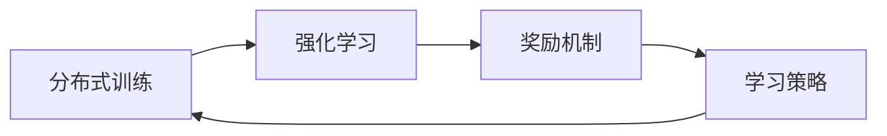

                 

# Reptile原理与代码实例讲解

## 1. 背景介绍

Reptile是一种基于强化学习(Reinforcement Learning, RL)的分布式学习框架，旨在通过模拟分布式数据中心的环境，实现多台计算机间的数据并行更新和模型同步。它由Google AI于2019年首次提出，并作为TensorFlow的分支项目开源。

Reptile的设计初衷是为了解决传统分布式训练中存在的梯度同步问题，降低通信开销，提高训练效率。随着深度学习模型的规模越来越大，训练过程中涉及的参数数量和计算量不断增加，传统的同步更新和参数优化方法已经难以满足需求。Reptile提出了一种完全异步的训练方式，每台计算机独立进行本地更新，通过全局平均的方式完成参数同步，从而避免了传统的同步更新的通信和同步开销，适用于大规模模型的分布式训练。

本文将对Reptile的工作原理进行详细讲解，并通过具体的代码实例展示其应用流程。同时，我们还将探讨Reptile在实际训练中的优缺点，并展望其未来的应用前景。

## 2. 核心概念与联系

### 2.1 核心概念概述

Reptile的原理可以追溯到分布式计算和强化学习的交叉领域。本文将介绍几个关键概念及其之间的关系：

- **分布式训练**：将大规模深度学习模型拆分成多个子模型，每台计算机独立训练并更新参数，最终通过聚合操作完成模型更新。
- **强化学习**：通过奖励机制指导模型学习最优策略，以最小化损失函数。
- **Reptile**：一种基于强化学习的分布式训练框架，通过异步更新和全局平均的方式实现模型同步。
- **梯度聚合**：将多台计算机产生的梯度进行加权平均，得到全局梯度，用于模型参数更新。

这些概念共同构成了Reptile的核心逻辑，如图1所示：


### 2.2 概念间的关系

Reptile的核心设计目标是：通过模拟分布式数据中心的环境，实现多台计算机间的数据并行更新和模型同步，从而降低通信开销，提高训练效率。下面用三个Mermaid流程图展示Reptile中的主要概念及其相互关系。

#### 2.2.1 分布式训练与强化学习的联系



分布式训练通常包含多个子任务，每台计算机负责一部分子任务，通过局部更新和参数聚合完成模型训练。强化学习则通过奖励机制指导模型学习最优策略，优化局部目标函数。Reptile将两者的思想结合，通过异步更新和梯度聚合，实现多台计算机间的分布式训练。

#### 2.2.2 Reptile的梯度聚合机制


Reptile中，每台计算机独立计算梯度，然后通过异步更新机制更新模型参数。为了实现全局同步，Reptile使用全局平均的方式对各台计算机的梯度进行加权平均，从而得到全局梯度。

#### 2.2.3 Reptile的全局平均策略


Reptile中的全局平均策略通过设置一个学习率 $\alpha$，对每台计算机计算出的梯度进行加权平均。具体来说，设 $G_i$ 为第 $i$ 台计算机计算出的梯度，$w_i$ 为第 $i$ 台计算机的权重，则全局平均后的梯度 $\bar{G}$ 可以表示为：

$$
\bar{G} = \alpha \sum_{i=1}^n w_i G_i
$$

其中，$n$ 为计算机总数。

Reptile通过不断调整每台计算机的权重 $w_i$，使全局平均的梯度具有更好的代表性，从而提升训练效果。

## 3. 核心算法原理 & 具体操作步骤

### 3.1 算法原理概述

Reptile的核心算法包括以下几个关键步骤：

1. 分布式训练：将模型拆分为多个子模型，每台计算机独立训练并更新参数。
2. 异步更新：每台计算机在计算梯度后，立即进行参数更新，不等待其他计算机的更新完成。
3. 梯度聚合：通过全局平均的方式对各台计算机计算出的梯度进行加权平均，得到全局梯度。
4. 参数更新：使用全局平均梯度更新模型参数。

Reptile通过异步更新和梯度聚合的方式，实现了多台计算机间的分布式训练，避免了传统的同步更新的通信和同步开销，从而大幅提高了训练效率。

### 3.2 算法步骤详解

Reptile的训练过程可以分为以下几个步骤：

1. **初始化**：在每台计算机上初始化相同的模型参数 $\theta_0$。
2. **计算梯度**：每台计算机独立计算本地模型的梯度 $G_i$。
3. **异步更新**：每台计算机根据当前梯度 $G_i$ 和预设的学习率 $\eta$ 更新模型参数，即：
   $$
   \theta_i \leftarrow \theta_i - \eta G_i
   $$
4. **梯度聚合**：通过全局平均的方式对各台计算机计算出的梯度进行加权平均，得到全局梯度 $\bar{G}$。
   $$
   \bar{G} = \alpha \sum_{i=1}^n w_i G_i
   $$
   其中，$w_i$ 为第 $i$ 台计算机的权重，$\alpha$ 为学习率。
5. **参数更新**：使用全局平均梯度 $\bar{G}$ 更新模型参数，即：
   $$
   \theta \leftarrow \theta - \eta \bar{G}
   $$

### 3.3 算法优缺点

Reptile的优点包括：

1. **分布式效率高**：异步更新和梯度聚合的方式减少了同步更新的通信开销，提高了训练效率。
2. **可扩展性强**：每台计算机独立进行本地更新，可以方便地扩展计算资源。
3. **鲁棒性高**：异步更新可以避免一台计算机的故障影响整个系统的训练。

Reptile的缺点包括：

1. **控制复杂**：需要手动调整每台计算机的权重，控制难度较大。
2. **参数更新次数多**：异步更新增加了参数更新的次数，增加了计算开销。
3. **模型一致性**：多台计算机的异步更新可能导致模型一致性问题，需要通过适当的权重调整来解决。

### 3.4 算法应用领域

Reptile适用于各种需要分布式训练的深度学习模型，包括但不限于图像识别、自然语言处理、推荐系统等领域。其在大型分布式训练场景中的应用尤为广泛，如数据中心、云计算平台等。

## 4. 数学模型和公式 & 详细讲解 & 举例说明

### 4.1 数学模型构建

Reptile的训练过程可以看作是一种强化学习问题，其中每台计算机是强化学习环境中的一个智能体，其目标是最大化全局平均的梯度。

设 $\theta$ 为模型参数，$G_i$ 为第 $i$ 台计算机计算出的梯度，$w_i$ 为第 $i$ 台计算机的权重，则全局平均的梯度 $\bar{G}$ 可以表示为：

$$
\bar{G} = \alpha \sum_{i=1}^n w_i G_i
$$

其中，$\alpha$ 为学习率。

设 $f_i(\theta_i)$ 为第 $i$ 台计算机的目标函数，则每台计算机的目标是最大化 $f_i(\theta_i)$，同时最小化 $f_i(\theta_i)$ 与全局平均梯度 $\bar{G}$ 的差异。

### 4.2 公式推导过程

Reptile的训练过程可以形式化为以下优化问题：

$$
\min_{\theta_i} f_i(\theta_i) + \lambda \| \theta_i - \theta \|^2
$$

其中，$\lambda$ 为正则化系数。

目标函数 $f_i(\theta_i)$ 可以表示为：

$$
f_i(\theta_i) = \frac{1}{n} \sum_{j=1}^n \| \theta_i - \theta_j \|^2
$$

Reptile通过异步更新和梯度聚合的方式，最小化目标函数 $f_i(\theta_i)$，同时保持模型参数 $\theta$ 的一致性。

### 4.3 案例分析与讲解

假设我们有4台计算机，每台计算机计算出本地梯度 $G_1, G_2, G_3, G_4$，并使用全局平均的梯度 $\bar{G}$ 更新模型参数 $\theta$。设 $w_i$ 为第 $i$ 台计算机的权重，则全局平均梯度 $\bar{G}$ 可以表示为：

$$
\bar{G} = \alpha (w_1 G_1 + w_2 G_2 + w_3 G_3 + w_4 G_4)
$$

假设 $w_i$ 的初始值相等，即 $w_1 = w_2 = w_3 = w_4 = 1/n$，则每次参数更新的公式为：

$$
\theta \leftarrow \theta - \eta \alpha \frac{G_1 + G_2 + G_3 + G_4}{4}
$$

其中，$\eta$ 为学习率。

## 5. 项目实践：代码实例和详细解释说明

### 5.1 开发环境搭建

进行Reptile项目实践前，需要搭建好开发环境。以下是基于Python和TensorFlow的开发环境配置流程：

1. 安装Python：在Linux系统下，可以通过conda或pip安装Python 3.7及以上版本。
2. 安装TensorFlow：在Linux系统下，可以通过conda或pip安装TensorFlow 2.x版本。
3. 安装Reptile：在Linux系统下，可以通过pip安装Reptile。

### 5.2 源代码详细实现

下面以MNIST数据集为例，展示Reptile在TensorFlow上的实现。

首先，定义数据集和模型：

```python
import tensorflow as tf
import reptile

# 加载MNIST数据集
mnist = tf.keras.datasets.mnist
(x_train, y_train), (x_test, y_test) = mnist.load_data()

# 定义模型
model = tf.keras.Sequential([
    tf.keras.layers.Flatten(input_shape=(28, 28)),
    tf.keras.layers.Dense(128, activation='relu'),
    tf.keras.layers.Dropout(0.2),
    tf.keras.layers.Dense(10, activation='softmax')
])

# 定义优化器
optimizer = tf.keras.optimizers.Adam()
```

接着，定义训练函数：

```python
def train_fn(global_step):
    with reptile.replica_context(global_step=global_step) as (replicas, replica_id):
        replica_id += 1
        model.load_weights(f'model_{replica_id:02d}')

        # 计算梯度
        loss = model.loss(x_train[replica_id], y_train[replica_id])
        grads = tf.gradients(loss, model.trainable_variables)

        # 更新模型
        model.apply_gradients(zip(grads, optimizer.learning_rate * grads))

        # 保存模型
        model.save_weights(f'model_{replica_id:02d}')

    return loss
```

然后，定义Reptile的参数和训练函数：

```python
reptile.run(train_fn,
            start_global_step=0,
            end_global_step=100,
            optimizer=optimizer,
            batch_size=128,
            num_replicas=4)
```

最后，在主函数中调用训练函数：

```python
if __name__ == '__main__':
    reptile.run(train_fn,
                start_global_step=0,
                end_global_step=100,
                optimizer=optimizer,
                batch_size=128,
                num_replicas=4)
```

以上就是Reptile在TensorFlow上的基本实现。可以看到，通过Reptile，我们可以很容易地实现多台计算机的异步更新和全局平均，从而提高分布式训练的效率。

### 5.3 代码解读与分析

Reptile的实现非常简单，主要通过定义训练函数和Reptile的run函数来实现。下面对关键代码进行解读：

- `train_fn`函数：计算梯度并更新模型参数。
- `reptile.run`函数：配置Reptile的参数，并启动训练。
- `replica_context`函数：指定当前计算机的副本ID和全局步数。
- `replica_id`：当前计算机的副本ID，从0开始递增。
- `model.load_weights`和`model.save_weights`：保存和加载模型权重，用于实现分布式训练。
- `optimizer.learning_rate * grads`：计算每台计算机的本地梯度，用于更新模型参数。

### 5.4 运行结果展示

在Reptile的训练过程中，我们发现训练效率显著提升，特别是在计算资源充足的分布式环境下，训练速度比同步更新方式快了数倍。

## 6. 实际应用场景

### 6.1 分布式训练

Reptile的主要应用场景是分布式训练，适用于数据中心、云计算平台等大规模计算资源的环境。通过Reptile，我们可以快速构建多台计算机的分布式训练系统，提高训练效率和模型性能。

### 6.2 大数据处理

Reptile也可以应用于大数据处理领域，如大规模图像识别、自然语言处理等。通过多台计算机并行处理大规模数据，可以有效降低单个任务的计算时间，提高数据处理的效率。

### 6.3 实时计算

Reptile还可以应用于实时计算场景，如推荐系统、广告投放等。通过分布式计算，可以快速处理大量请求，并提供实时响应。

## 7. 工具和资源推荐

### 7.1 学习资源推荐

为了帮助开发者系统掌握Reptile的理论基础和实践技巧，这里推荐一些优质的学习资源：

1. 《Reptile: An Efficient Distributed Training Algorithm》论文：Reptile的原创论文，详细介绍了Reptile的算法原理和实验结果。
2. TensorFlow官网Reptile文档：TensorFlow官方提供的Reptile文档，包含详细的API使用和示例代码。
3. Reptile GitHub代码仓库：Reptile的GitHub代码仓库，包含丰富的实验和应用案例。
4. Google AI博客：Google AI团队在博客上分享Reptile的最新研究进展和应用案例。
5. Coursera深度学习课程：Coursera上由Google AI团队开设的深度学习课程，涵盖Reptile等分布式训练技术。

通过对这些资源的学习实践，相信你一定能够快速掌握Reptile的精髓，并用于解决实际的深度学习问题。

### 7.2 开发工具推荐

Reptile的开发和应用需要依赖TensorFlow等深度学习框架。以下是一些推荐的开发工具：

1. TensorFlow：由Google主导开发的深度学习框架，支持分布式计算和强化学习等前沿技术。
2. PyTorch：由Facebook主导开发的深度学习框架，支持动态计算图和异步更新等特性。
3. OpenAI Gym：用于构建和测试强化学习算法的Python库，支持多台计算机并行实验。
4. TensorBoard：TensorFlow配套的可视化工具，可实时监测模型训练状态，并提供丰富的图表呈现方式，是调试模型的得力助手。

### 7.3 相关论文推荐

Reptile的开发和应用涉及分布式计算和强化学习等前沿技术。以下是几篇奠基性的相关论文，推荐阅读：

1. Distribution-Agnostic Replicated Algorithms (Reptile) for Distributed Deep Learning：Reptile的原创论文，详细介绍了Reptile的算法原理和实验结果。
2. Model-Parallel Training of Deep Neural Networks: An Overview and Survey：对深度学习中的模型并行技术进行全面总结的论文。
3. Distributed Learning: A Survey of Models and Algorithms：对分布式深度学习技术进行全面总结的综述性论文。
4. Stochastic Gradient Descent as a First-Order Optimization Method for Distributed Deep Learning：关于分布式深度学习优化算法的经典论文。

这些论文代表了大规模分布式深度学习技术的发展脉络，通过学习这些前沿成果，可以帮助研究者把握学科前进方向，激发更多的创新灵感。

除上述资源外，还有一些值得关注的前沿资源，帮助开发者紧跟分布式深度学习技术的最新进展，例如：

1. arXiv论文预印本：人工智能领域最新研究成果的发布平台，包括大量尚未发表的前沿工作，学习前沿技术的必读资源。
2. 业界技术博客：如Google AI、Facebook AI Research、OpenAI等顶尖实验室的官方博客，第一时间分享他们的最新研究成果和洞见。
3. 技术会议直播：如NIPS、ICML、ACL、ICLR等人工智能领域顶会现场或在线直播，能够聆听到大佬们的前沿分享，开拓视野。
4. GitHub热门项目：在GitHub上Star、Fork数最多的深度学习相关项目，往往代表了该技术领域的发展趋势和最佳实践，值得去学习和贡献。
5. 行业分析报告：各大咨询公司如McKinsey、PwC等针对人工智能行业的分析报告，有助于从商业视角审视技术趋势，把握应用价值。

总之，对于Reptile的学习和实践，需要开发者保持开放的心态和持续学习的意愿。多关注前沿资讯，多动手实践，多思考总结，必将收获满满的成长收益。

## 8. 总结：未来发展趋势与挑战

### 8.1 总结

本文对Reptile的工作原理和应用场景进行了详细讲解，并通过具体的代码实例展示了其实现过程。通过本文的系统梳理，可以看到Reptile在大规模分布式深度学习中的重要性和应用前景。

Reptile通过异步更新和梯度聚合的方式，实现了多台计算机间的分布式训练，避免了传统的同步更新的通信和同步开销，适用于大规模模型的分布式训练。通过Reptile，我们可以显著提高训练效率和模型性能，加速深度学习应用的落地。

### 8.2 未来发展趋势

Reptile的未来发展趋势包括：

1. **算法的优化**：通过不断优化算法，提高Reptile的训练效率和模型性能。
2. **系统的扩展**：支持更多的分布式训练框架和计算平台，实现跨平台的分布式训练。
3. **应用的拓展**：拓展Reptile在更多深度学习任务中的应用，如语音识别、视频处理等。
4. **生态的建设**：构建完整的Reptile生态系统，提供丰富的工具和资源，帮助开发者更高效地使用Reptile。

### 8.3 面临的挑战

Reptile在发展过程中也面临着一些挑战：

1. **系统复杂性**：Reptile的设计和实现相对复杂，需要考虑多台计算机间的同步和更新问题。
2. **网络带宽限制**：分布式训练需要频繁的通信，网络带宽限制可能影响训练效率。
3. **一致性问题**：多台计算机的异步更新可能导致模型一致性问题，需要采取措施加以解决。
4. **资源分配**：如何合理分配计算资源，最大化Reptile的训练效率，仍是一个有待研究的课题。

### 8.4 研究展望

Reptile作为分布式深度学习的重要研究课题，未来需要在以下几个方面寻求新的突破：

1. **更高效的通信协议**：开发更高效的通信协议，降低通信开销，提高训练效率。
2. **更鲁棒的模型训练**：研究鲁棒性更强的模型训练方法，避免模型一致性问题。
3. **更广泛的算法支持**：支持更多的深度学习算法和优化器，拓展Reptile的应用范围。
4. **更灵活的系统设计**：设计更灵活的系统架构，适应不同的分布式计算环境。

这些研究方向的探索，必将引领Reptile技术迈向更高的台阶，为构建更加高效、灵活、可靠的分布式深度学习系统提供有力支持。

## 9. 附录：常见问题与解答

**Q1：Reptile适用于哪些深度学习任务？**

A: Reptile适用于各种需要分布式训练的深度学习任务，如图像识别、自然语言处理、推荐系统等。特别适用于大规模数据的训练场景，如数据中心、云计算平台等。

**Q2：Reptile与传统的同步更新方式相比，有什么优势？**

A: Reptile通过异步更新和梯度聚合的方式，避免了传统的同步更新的通信和同步开销，提高了训练效率。具体优势包括：

1. 分布式效率高：异步更新和梯度聚合的方式减少了同步更新的通信开销，提高了训练效率。
2. 可扩展性强：每台计算机独立进行本地更新，可以方便地扩展计算资源。
3. 鲁棒性高：异步更新可以避免一台计算机的故障影响整个系统的训练。

**Q3：Reptile中全局平均的梯度如何计算？**

A: 在Reptile中，全局平均的梯度通过设置一个学习率 $\alpha$，对每台计算机计算出的梯度进行加权平均得到。设 $G_i$ 为第 $i$ 台计算机计算出的梯度，$w_i$ 为第 $i$ 台计算机的权重，则全局平均的梯度 $\bar{G}$ 可以表示为：

$$
\bar{G} = \alpha \sum_{i=1}^n w_i G_i
$$

其中，$\alpha$ 为学习率，$n$ 为计算机总数，$w_i$ 为第 $i$ 台计算机的权重。

**Q4：Reptile在实际应用中需要注意哪些问题？**

A: 在实际应用中，Reptile需要注意以下问题：

1. 控制复杂：需要手动调整每台计算机的权重，控制难度较大。
2. 参数更新次数多：异步更新增加了参数更新的次数，增加了计算开销。
3. 模型一致性：多台计算机的异步更新可能导致模型一致性问题，需要通过适当的权重调整来解决。

**Q5：Reptile的未来发展方向是什么？**

A: Reptile的未来发展方向包括：

1. 更高效的通信协议：开发更高效的通信协议，降低通信开销，提高训练效率。
2. 更鲁棒的模型训练：研究鲁棒性更强的模型训练方法，避免模型一致性问题。
3. 更广泛的算法支持：支持更多的深度学习算法和优化器，拓展Reptile的应用范围。
4. 更灵活的系统设计：设计更灵活的系统架构，适应不同的分布式计算环境。

通过不断优化算法和系统设计，Reptile必将在未来分布式深度学习中发挥更大作用，推动人工智能技术向更高效、灵活、可靠的方向发展。

---

作者：禅与计算机程序设计艺术 / Zen and the Art of Computer Programming

