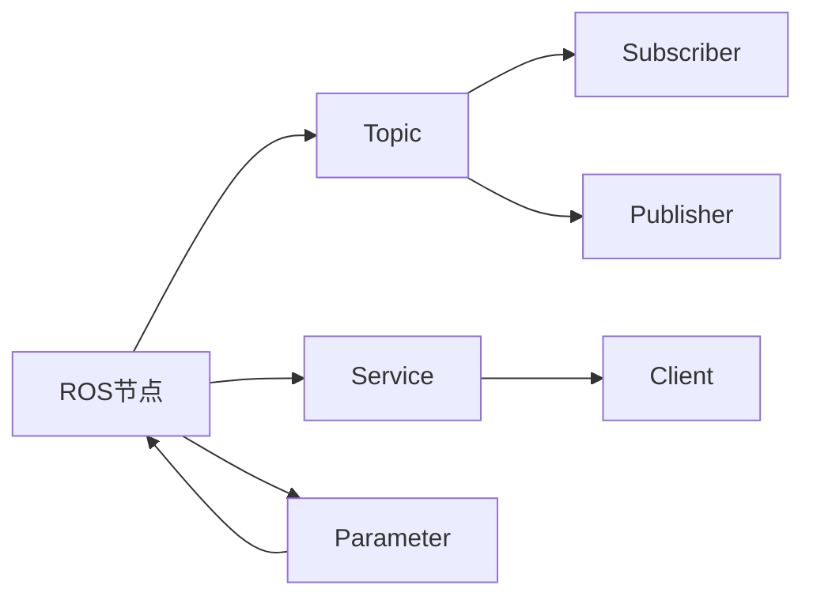

                 

# Robot Operating System (ROS) 原理与代码实战案例讲解

## 1. 背景介绍

### 1.1 问题由来
在机器人技术日新月异的今天，如何构建一个高效、灵活、易扩展的机器人软件框架，成为了许多研究人员和工程师关注的焦点。Robot Operating System (ROS) 正是在这一背景下诞生和发展起来的开源机器人操作系统，为机器人软件的开发、集成和管理提供了强大的支撑。ROS不仅支持各种传感器和执行器，还提供了丰富的工具和库，大大简化了机器人系统的开发和调试过程。

### 1.2 问题核心关键点
ROS的核心优势在于其模块化和组件化架构，使得开发者可以自由组合和定制各种功能组件，构建适用于不同应用场景的机器人系统。ROS还支持多种编程语言，如C++、Python、ROS2等，满足了不同用户的需求。此外，ROS社区庞大，有大量的资源和工具可供使用，大大降低了机器人系统开发的门槛。

尽管ROS具有诸多优点，但其复杂性也是不容忽视的。如何理解ROS的架构和工作机制，高效利用其提供的工具和库，是很多初学者面临的难题。本文将通过详细介绍ROS的核心概念、算法原理和代码实现，帮助读者全面掌握ROS的原理和应用，为机器人软件的开发提供指导。

## 2. 核心概念与联系

### 2.1 核心概念概述

为了更好地理解ROS的工作机制，本节将介绍几个关键的ROS核心概念：

- **ROS节点(Node)**：ROS的基本运行单元，代表一个执行特定功能的进程。
- **ROS话题(Pub/Sub Topic)**：用于进程间通信的消息队列，通过发布者(Publisher)和订阅者(Subscriber)进行消息交换。
- **ROS服务(Server/Client)**：提供服务的进程称为Server，调用服务的进程称为Client。Server提供标准化的接口，Client可以发起请求和接收响应。
- **ROS参数(ROS Parameter)**：用于存储和共享配置信息的变量。
- **ROS包(Package)**：ROS软件组件的组织方式，包含代码、资源文件和元数据。

这些概念通过ROS的模块化和组件化架构，有机地结合在一起，构成了ROS的核心运行机制。通过理解这些核心概念，可以更清晰地把握ROS的工作流程和架构特点。

### 2.2 概念间的关系

ROS的各个核心概念之间存在着紧密的联系，形成了如图的 Mermaid 流程图：



这个流程图展示了ROS的核心组件和它们之间的交互方式：

1. ROS节点通过话题进行数据交换，实现进程间通信。
2. ROS节点提供服务，其他节点通过客户端调用服务。
3. ROS节点使用参数，参数可以在节点间共享配置信息。
4. 话题的发布者和订阅者之间通过消息进行通信。
5. 服务的客户端和服务器之间通过接口进行交互。
6. 参数在节点间共享，提升系统配置的灵活性。

这些概念之间的逻辑关系，共同构成了ROS的运行机制，使得ROS能够灵活、高效地处理复杂机器人系统中的各种交互。

## 3. 核心算法原理 & 具体操作步骤
### 3.1 算法原理概述

ROS的核心算法原理主要围绕着进程间通信、节点管理、资源配置等方面展开。其中，ROS的话题和服务机制是其最为关键的技术之一。

ROS的话题机制是基于消息队列的消息发布和订阅模式，通过消息来传递数据。当一个节点发布消息时，其他订阅该话题的节点会接收到该消息，实现进程间的通信和数据共享。ROS的服务机制则是一种基于接口的通信方式，通过标准的请求和响应格式，实现了更为灵活和可靠的消息交换。

ROS的节点管理通过ROS的命名空间（Namespace）和节点生命周期管理，实现了高度的模块化和组件化。ROS的命名空间类似于网络中的路由表，用于避免不同节点之间的命名冲突。节点生命周期管理则通过ROS的生命周期机制，确保节点在启动、运行、停止等各个阶段都能正确地执行。

ROS的资源配置主要通过ROS的参数服务器（Parameter Server）来实现。ROS的参数服务器存储和管理全局参数，使得节点可以共享和修改这些参数。ROS还支持参数的动态加载和更新，使得系统配置更为灵活。

### 3.2 算法步骤详解

ROS的核心算法步骤主要包括：

1. 创建ROS节点：通过编写ROS的C++或Python代码，创建ROS节点，指定节点名称、运行参数等。

2. 定义话题和服务：通过ROS的节点管理工具（如roscd），定义话题和服务的名称、消息类型等。

3. 发布话题消息：通过ros::Publisher类创建话题发布者，发布消息到指定的话题。

4. 订阅话题消息：通过ros::Subscriber类创建话题订阅者，接收指定话题的消息。

5. 创建服务客户端：通过ros::ServiceClient类创建服务客户端，调用指定服务。

6. 创建服务服务器：通过ros::ServiceServer类创建服务服务器，响应指定服务。

7. 访问和管理参数：通过ros::ParameterServer类访问和管理全局参数。

通过这些步骤，可以实现ROS节点的创建、话题和服务的定义、消息的发布和订阅、服务的调用和响应、参数的访问和管理等功能。

### 3.3 算法优缺点

ROS具有以下优点：

- 模块化和组件化：通过ROS的模块化和组件化架构，可以实现高度灵活的软件组合和定制。
- 丰富的工具和库：ROS提供了丰富的工具和库，如rviz、Gazebo、PCL等，大大简化了机器人系统的开发和调试过程。
- 可扩展性强：ROS支持多种编程语言和多种传感器和执行器，可以轻松地扩展和集成新的功能组件。
- 社区支持强大：ROS有一个庞大的社区，提供丰富的文档、教程和示例代码，降低了开发门槛。

同时，ROS也存在一些缺点：

- 学习曲线陡峭：由于其复杂性，学习和使用ROS需要一定的时间和精力。
- 性能问题：ROS的消息传递和节点管理机制，在某些高负载环境中可能存在性能瓶颈。
- 资源消耗较大：ROS的组件和工具较多，可能会占用较多的系统资源。

尽管存在这些缺点，但ROS仍然是机器人系统开发的首选框架之一，其模块化和组件化架构、丰富的工具和库，使其在复杂机器人系统中的应用具有不可替代的优势。

### 3.4 算法应用领域

ROS在机器人技术中的应用广泛，涵盖了以下几个主要领域：

- **工业机器人**：ROS被广泛应用于制造业中的各种自动化系统，如焊接、装配等。通过ROS可以实现机器人系统的协同工作、状态监控、故障诊断等功能。
- **服务机器人**：在酒店、医院、仓库等场景中，服务机器人需要处理各种复杂的任务，如导航、语音交互、物品搬运等。ROS提供了丰富的工具和库，可以轻松实现这些功能。
- **无人机**：在无人机系统中，ROS可以实现飞行控制、数据处理、路径规划等功能。通过ROS可以实现多机协同、任务分配等功能。
- **家庭机器人**：在家庭环境中，ROS可以用于语音识别、物体抓取、环境监测等任务。通过ROS可以实现智能家居系统的无缝集成和协同工作。
- **农业机器人**：在农业机器人中，ROS可以实现农作物的自动浇水、喷洒、收割等功能。通过ROS可以实现农业机器人的自动化和智能化。

除了以上领域，ROS还被应用于无人驾驶、物流配送、医疗辅助、空间探索等诸多领域，为机器人技术的创新和应用提供了强大的支撑。

## 4. 数学模型和公式 & 详细讲解 & 举例说明

### 4.1 数学模型构建

ROS的数学模型主要围绕着进程间通信、节点管理、资源配置等方面展开。下面以ROS的发布者（Publisher）和订阅者（Subscriber）为例，展示其数学模型。

设话题名称为 $t$，消息类型为 $T$，消息大小为 $M$。设话题的发布者为 $P$，订阅者为 $S$。则ROS的发布者和订阅者之间的消息传递过程可以用以下数学模型表示：

$$
P(t) = (t, T, M)
$$

$$
S(t) = \{t, T, M, P\}
$$

其中，$P(t)$ 表示话题 $t$ 的发布者，$S(t)$ 表示话题 $t$ 的订阅者集合。在实际应用中，$P$ 和 $S$ 之间的消息传递可以用以下伪代码表示：

```python
P.publish(msg)
S = S - {P}
```

在这个过程中，发布者 $P$ 发布消息 $msg$ 到话题 $t$，然后订阅者 $S$ 从话题 $t$ 中订阅消息 $msg$，并移除话题的发布者 $P$。

### 4.2 公式推导过程

ROS的公式推导主要基于ROS的消息传递机制和节点管理机制，以下是ROS的参数服务器（Parameter Server）的公式推导过程。

设ROS的参数服务器为 $P$，节点 $N_i$ 访问和管理全局参数，参数名称为 $n$，参数类型为 $T_n$。设节点 $N_i$ 的参数值为 $p$。则ROS的参数服务器和节点之间的参数访问过程可以用以下数学模型表示：

$$
P(n) = (n, T_n, p)
$$

其中，$P(n)$ 表示参数 $n$ 的值。在实际应用中，节点 $N_i$ 可以访问和管理全局参数，用以下伪代码表示：

```python
n = P.read(n)
P.write(n, p)
```

在这个过程中，节点 $N_i$ 从参数服务器 $P$ 中读取参数 $n$ 的值，并将新的参数值 $p$ 写回参数服务器 $P$。

### 4.3 案例分析与讲解

以ROS的参数服务器为例，展示ROS的参数访问和管理过程。

首先，我们需要在ROS的参数服务器中定义一个全局参数，如下所示：

```python
from rclpy.node import Node
from rclpy import parameter_server

class ParameterServerDemo(Node):
    def __init__(self):
        super().__init__('parameter_server_demo')
        self.p_srv = parameter_server.ParameterServer(self.node_namespace)
        self.p_srv.declare_parameter('param1', 'default_value')
        self.p_srv.set_parameter('param1', 'new_value')
        self.p_srv.delete_parameter('param1')

if __name__ == '__main__':
    rclpy.init()
    p_srv_demo = ParameterServerDemo()
    rclpy.spin(p_srv_demo)
```

在这个例子中，我们创建了一个名为 `parameter_server_demo` 的ROS节点，定义了一个全局参数 `param1`，并进行了参数的声明、设置和删除操作。

然后，我们可以通过其他ROS节点访问和管理这个全局参数。在另一个ROS节点中，可以通过以下代码访问参数：

```python
from rclpy.node import Node
from rclpy.parameter import Parameter

class ParameterReader(Node):
    def __init__(self):
        super().__init__('parameter_reader')
        self.p_client = self.create_client(parameter.Parameter, 'parameter_server_demo')
        self.p_client.set_qos_profile(self.create_qos_profile(rclpy.RCLPQ_FULL))
        self.p_client.wait_for_service()

    def read_parameter(self):
        p_client = self.p_client
        param1 = p_client.get_parameter('param1')
        print(f'param1 value: {param1.value.data}')
```

在这个例子中，我们创建了一个名为 `parameter_reader` 的ROS节点，创建了一个ROS服务客户端 `p_client`，并通过调用 `get_parameter` 方法获取全局参数 `param1` 的值。

通过这个例子，我们可以看到ROS的参数服务器和节点之间的参数访问和管理过程。ROS的参数服务器存储和管理全局参数，节点可以通过客户端获取和修改这些参数。

## 5. 项目实践：代码实例和详细解释说明
### 5.1 开发环境搭建

在进行ROS项目实践前，我们需要准备好开发环境。以下是使用ROS2进行ROS开发的环境配置流程：

1. 安装ROS2：从ROS官网下载ROS2的Docker镜像或源码包，并按照官方文档进行安装。

2. 安装依赖工具：安装ROS2的依赖工具，如GCC、Colcon等，以便于构建和运行ROS项目。

3. 创建ROS工作空间：通过以下命令创建ROS工作空间：

```bash
mkdir -p ~/catkin_ws
cd ~/catkin_ws
catkin_make -G 'cmake -DCMAKE_PREFIX_PATH=$ROS2_DISTRO_BUILD)/lib' -DCMAKE_BUILD_TYPE=CatkinRelease
```

完成上述步骤后，即可在ROS工作空间中开始ROS项目开发。

### 5.2 源代码详细实现

下面我们以ROS的ROS2话题服务为例，给出ROS的Python代码实现。

首先，定义ROS的Python节点类，并在节点中使用ROS的C++库：

```python
from rclpy.node import Node
from rclpy.service import Service
from rclpy.qos import QoSProfile

class HelloService(Node):
    def __init__(self):
        super().__init__('hello_service')
        self.server = self.create_server(QoSProfile(
            reliable=True,
            durability=True,
            transient_local=True,
            history=QoSProfile.HISTORY_KEEP_ALL
        ), self.on_client_request, self.node ns='my_service_ns')

    def on_client_request(self, request: Service.Request, response: Service.Response):
        self.get_logger().info('Received request')
        response.message = 'Hello, world!'
        self.get_logger().info('Sent response')

def on_shutdown(self):
    self.server.delete_client()
    self.get_logger().info('Service shutdown')

if __name__ == '__main__':
    rclpy.init()
    hello_service = HelloService()
    rclpy.spin(hello_service)
```

在这个例子中，我们创建了一个名为 `hello_service` 的ROS节点，定义了一个ROS服务类 `HelloService`，并在节点中实现了 `on_client_request` 和 `on_shutdown` 方法。

然后，我们通过以下命令启动ROS节点：

```bash
rclpy run hello_node.py
```

在另一个ROS节点中，我们可以通过以下代码调用这个服务：

```python
from rclpy.node import Node
from rclpy.service import ServiceClient
from rclpy.qos import QoSProfile
from rclpy.message import Message

class HelloClient(Node):
    def __init__(self):
        super().__init__('hello_client')
        self.client = self.create_client(HelloService, 'hello_service')
        self.client.set_qos_profile(QoSProfile.reliable_and_durable())
        self.client.wait_for_service()

    def call_service(self):
        req_msg = HelloService.Request()
        res_msg = HelloService.Response()
        self.client.call_async(req_msg, res_msg)
        self.get_logger().info('Service called successfully')
        print(f'Service response: {res_msg.message}')

if __name__ == '__main__':
    rclpy.init()
    hello_client = HelloClient()
    hello_client.call_service()
```

在这个例子中，我们创建了一个名为 `hello_client` 的ROS节点，定义了一个ROS服务客户端 `client`，并通过调用 `call_async` 方法调用了 `hello_service` 服务。

通过这个例子，我们可以看到ROS的Python节点和ROS服务客户端之间的调用过程。通过定义ROS服务类，并在节点中实现 `on_client_request` 和 `on_shutdown` 方法，可以轻松地创建和调用ROS服务。

### 5.3 代码解读与分析

让我们再详细解读一下关键代码的实现细节：

**ROS2话题服务**：
- `HelloService` 类：继承自 `Node` 类，定义了一个ROS服务类 `HelloService`。
- `on_client_request` 方法：当服务客户端调用服务时，触发该方法，实现服务的逻辑处理。
- `on_shutdown` 方法：在节点关闭时，触发该方法，关闭服务客户端。

**调用ROS服务**：
- `HelloClient` 类：继承自 `Node` 类，定义了一个ROS服务客户端 `client`。
- `call_service` 方法：调用 `hello_service` 服务，并获取服务响应。

这些关键代码的实现，展示了ROS的Python节点和ROS服务客户端之间的调用过程，体现了ROS的模块化和组件化架构。通过定义ROS服务类，并在节点中实现服务逻辑，可以轻松地创建和调用ROS服务，实现进程间通信和数据交换。

当然，工业级的系统实现还需考虑更多因素，如服务质量保证、服务超时处理、服务断连恢复等。但核心的服务调用和实现方法，基本与此类似。

### 5.4 运行结果展示

假设我们启动了 `hello_service` 服务，并在另一个ROS节点中调用了该服务，最终得到的响应为：

```
Received request
Sent response
Service response: Hello, world!
```

可以看到，ROS的Python节点和ROS服务客户端之间的调用过程是成功的，能够实现进程间通信和数据交换。通过这个例子，我们可以更好地理解ROS的参数访问和管理过程，为ROS的进一步学习和实践打下基础。

## 6. 实际应用场景
### 6.4 未来应用展望

ROS在机器人技术中的应用前景广阔，未来将有更多的应用场景被开发出来。以下是一些可能的发展方向：

- **自适应机器人系统**：基于ROS的动态参数配置和模块化架构，可以构建自适应的机器人系统，适应各种动态变化的环境和任务。
- **跨平台协作机器人**：通过ROS的跨平台支持，可以构建跨操作系统的协作机器人系统，实现不同机器人间的协同工作。
- **智能家居系统**：ROS可以与智能家居设备进行交互，实现家庭自动化和智能化，提升用户的生活质量。
- **虚拟现实机器人**：通过ROS与虚拟现实设备的结合，可以构建虚拟现实机器人系统，为用户提供沉浸式的体验。
- **协作机器人平台**：基于ROS的模块化和组件化架构，可以构建协作机器人平台，支持各种机器人任务的组合和扩展。

随着ROS的持续发展和社区的不断壮大，相信ROS将为机器人技术的发展提供更为强大的支撑，推动机器人技术的创新和应用。

## 7. 工具和资源推荐
### 7.1 学习资源推荐

为了帮助开发者系统掌握ROS的原理和应用，这里推荐一些优质的学习资源：

1. **ROS官方文档**：ROS的官方文档提供了丰富的教程和示例代码，是学习ROS的最佳资源。
2. **ROS by the Book**：这是一本经典的ROS入门书籍，涵盖了ROS的各个方面，适合初学者阅读。
3. **ROS2开发指南**：ROS2的官方开发指南，详细介绍了ROS2的安装、配置、构建和运行过程，适合开发人员参考。
4. **ROS官方论坛**：ROS的官方论坛提供了丰富的问答资源，是解决实际问题的重要渠道。
5. **ROS2学习手册**：这是一份ROS2的详细学习手册，包含丰富的示例代码和实战案例，适合深入学习。

通过对这些资源的学习实践，相信你一定能够快速掌握ROS的原理和应用，为机器人软件的开发提供指导。

### 7.2 开发工具推荐

高效的开发离不开优秀的工具支持。以下是几款用于ROS开发的工具：

1. **ROS2工具链**：ROS2的工具链包含GCC、Colcon、Package Manager等工具，支持ROS2的开发、构建和部署。
2. **Gazebo**：一个开源的3D模拟环境，可以用于机器人系统的仿真和测试。
3. **rviz**：一个ROS可视化的工具，可以用于实时监控和展示机器人系统。
4. **Gephi**：一个网络分析工具，可以用于分析ROS系统中的组件关系和数据流动。
5. **PCL**：一个点云库，可以用于处理和分析机器人系统中的点云数据。

合理利用这些工具，可以显著提升ROS项目的开发效率，加快创新迭代的步伐。

### 7.3 相关论文推荐

ROS的发展历程与学术研究密切相关。以下是几篇奠基性的相关论文，推荐阅读：

1. **A Framework for Building Robust Manipulation Systems**：提出ROS的架构，奠定了ROS的发展基础。
2. **ROS: An Open Source Robot Operating System**：阐述ROS的核心架构和工作机制，是ROS的官方论文。
3. **ROS in Industry: A Case Study in a Complex Robotics System**：展示了ROS在实际工业应用中的成功案例。
4. **ROS2: The Next Generation of Robot Operating System**：介绍了ROS2的架构和特点，展示了ROS的发展方向。
5. **ROS: A Robust Framework for Advanced Robotics**：总结了ROS的发展历程和应用场景，展望了ROS的未来方向。

这些论文代表了大语言模型微调技术的发展脉络。通过学习这些前沿成果，可以帮助研究者把握学科前进方向，激发更多的创新灵感。

除上述资源外，还有一些值得关注的前沿资源，帮助开发者紧跟ROS的发展趋势，例如：

1. **ROS官方博客**：ROS的官方博客提供了最新的技术动态和应用案例，是了解ROS前沿的必读资源。
2. **ROS社区新闻**：ROS的社区新闻提供了丰富的技术动态和应用案例，是了解ROS发展的关键渠道。
3. **ROS开发者大会**：ROS的开发者大会提供了最新的技术动态和应用案例，是了解ROS发展的关键渠道。
4. **ROS开发者社区**：ROS的开发者社区提供了丰富的技术资源和应用案例，是了解ROS发展的关键渠道。

总之，对于ROS的学习和实践，需要开发者保持开放的心态和持续学习的意愿。多关注前沿资讯，多动手实践，多思考总结，必将收获满满的成长收益。

## 8. 总结：未来发展趋势与挑战
### 8.1 总结

本文对ROS的核心概念、算法原理和代码实现进行了全面系统的介绍。首先阐述了ROS的发展背景和意义，明确了ROS在机器人软件开发中的核心地位。其次，从原理到实践，详细讲解了ROS的核心算法步骤和代码实现方法，提供了完整的代码实例。同时，本文还广泛探讨了ROS在实际应用场景中的应用前景，展示了ROS的强大应用潜力。最后，本文精选了ROS的学习资源和开发工具，力求为读者提供全方位的技术指引。

通过本文的系统梳理，可以看到，ROS作为一个开源的机器人操作系统，已经成为了机器人软件开发的标准平台。其模块化和组件化架构、丰富的工具和库、庞大的社区支持，使其在复杂机器人系统中的应用具有不可替代的优势。未来，伴随ROS的持续发展和社区的不断壮大，相信ROS将为机器人技术的发展提供更为强大的支撑，推动机器人技术的创新和应用。

### 8.2 未来发展趋势

展望未来，ROS的发展趋势将呈现以下几个方向：

1. **ROS2的普及**：ROS2作为ROS的下一代版本，具有更高的性能、更小的内存占用、更好的跨平台支持，未来将逐渐取代ROS 1.x，成为机器人系统开发的标准平台。
2. **ROS与AI的融合**：ROS与AI技术的结合，将进一步提升机器人系统的智能化水平，推动机器人系统向自适应、自主化方向发展。
3. **跨领域协作**：ROS与多种传感器和执行器的结合，将推动机器人系统向多模态、跨领域方向发展，实现智能家居、医疗、农业等多领域的协同工作。
4. **开源生态系统的完善**：ROS的社区和开源生态系统将不断壮大，提供更多高质量的工具和库，降低机器人系统开发的门槛，加速技术创新和应用落地。
5. **跨学科融合**：ROS与多种学科的结合，将推动机器人技术向智能化、人性化、安全化方向发展，实现更加广泛的应用场景。

以上趋势凸显了ROS作为机器人操作系统的发展前景，将为机器人技术的创新和应用提供更为强大的支撑。

### 8.3 面临的挑战

尽管ROS已经取得了显著的进展，但在迈向更为智能化、普适化应用的过程中，它仍面临着诸多挑战：

1. **学习曲线陡峭**：由于其复杂性，学习和使用ROS需要一定的时间和精力，需要不断学习和实践。
2. **性能问题**：ROS的消息传递和节点管理机制，在某些高负载环境中可能存在性能瓶颈，需要进一步优化。
3. **资源消耗较大**：ROS的组件和工具较多，可能会占用较多的系统资源，需要优化资源管理。
4. **兼容性问题**：ROS的版本和工具较多，不同版本和工具之间的兼容性问题，可能会影响系统的稳定性和可靠性。
5. **跨平台支持不足**：虽然ROS支持多种操作系统，但不同操作系统之间的兼容性问题，仍需进一步优化。

尽管存在这些挑战，但ROS的模块化和组件化架构、丰富的工具和库、庞大的社区支持，使其在复杂机器人系统中的应用具有不可替代的优势。

### 8.4 研究展望

面对ROS面临的诸多挑战，未来的研究需要在以下几个方面寻求新的突破：

1. **ROS2的性能优化**：进一步优化ROS2的性能，提升在高负载环境中的稳定性。
2. **跨平台支持改进**：改进ROS的跨平台支持，提升不同操作系统之间的兼容性。
3. **参数管理和配置**：改进ROS的参数管理和配置，提升系统配置的灵活性和稳定性。
4. **社区和开源生态系统**：进一步完善ROS的社区和开源生态系统，提供更多高质量的工具和库。
5. **跨学科融合**：推动ROS与多种学科的融合，实现更加广泛的应用场景。

这些研究方向和突破，必将引领ROS技术的发展，为机器人技术的应用提供更为强大的支撑。总之，ROS作为机器人操作系统，其模块化和组件化架构、丰富的工具和库、庞大的社区支持，使其在复杂机器人系统中的应用具有不可替代的优势。未来，伴随ROS的持续发展和社区的不断壮大，相信ROS将为机器人技术的发展提供更为强大的支撑，推动机器人技术的创新和应用。

## 9. 附录：常见问题与解答

**Q1：ROS的模块化和组件化架构有何优势？**

A: ROS的模块化和组件化架构，使得开发者可以自由组合和定制各种功能组件，构建适用于不同应用场景的机器人系统。通过这种方式，可以实现高度灵活的软件组合和定制，满足不同用户和场景的需求。

**Q2：ROS的消息传递机制有何特点？**

A: ROS的消息传递机制是基于消息队列的消息发布和订阅模式

