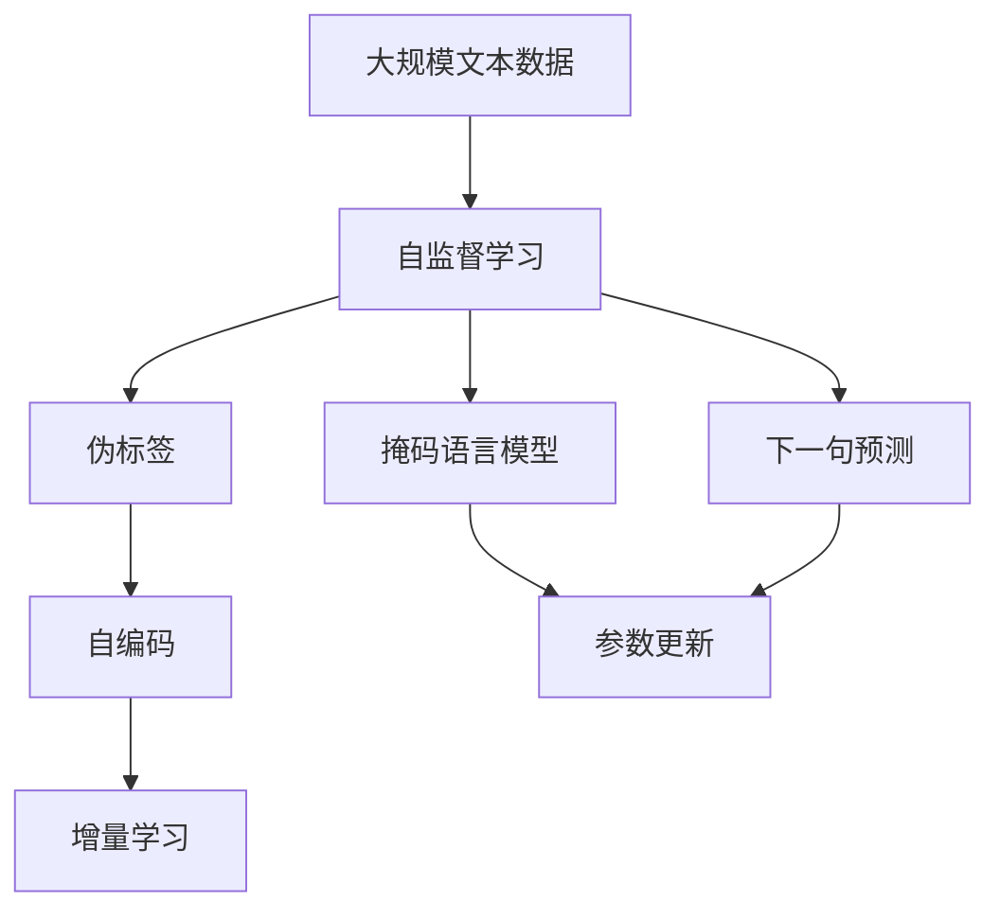
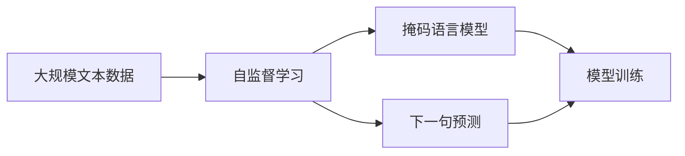
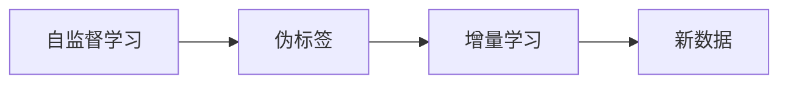
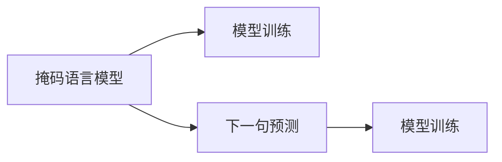
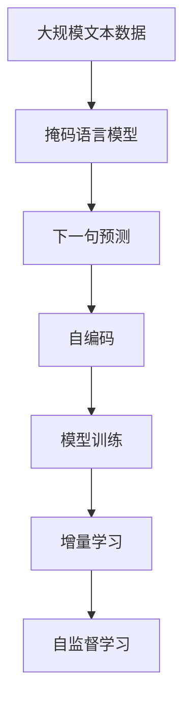

                 

# Self-Supervised Learning原理与代码实例讲解

## 1. 背景介绍

自监督学习(Self-Supervised Learning, SSL)是一种无需显式标注数据，通过利用数据本身的内在结构信息来训练模型的学习方式。近年来，随着深度学习技术的迅猛发展，SSL在图像、文本、音频等领域取得了令人瞩目的进展，涌现出诸如ImageNet预训练、BERT、wav2vec等经典模型。SSL作为无标注数据利用的一种高级技术，对数据驱动的AI发展具有重要意义。

自监督学习与传统有监督学习最大的区别在于，它无需手动标注大量样本，通过从数据中自动生成的伪标签进行训练，提升模型的泛化能力。SSL的优势在于，数据标注成本高、周期长，而SSL可以充分利用大量未标注数据进行训练，避免标注的昂贵和耗时。

在NLP领域，自监督学习也取得了显著进展。如BERT通过掩码语言模型和下一句预测任务在无监督数据上进行预训练，学习到了丰富的语言表示，通过微调即可在特定任务上取得优异性能。自监督学习在提升模型性能、降低标注成本、加速模型训练等方面具有重要应用价值，成为当前NLP领域的研究热点。

## 2. 核心概念与联系

### 2.1 核心概念概述

为更好地理解自监督学习的原理和应用，本节将介绍几个核心概念：

- **自监督学习**：一种无需显式标注数据，利用数据本身的内在结构信息进行模型训练的学习方式。通过从数据中自动生成的伪标签进行训练，提升模型的泛化能力。
- **伪标签(Pseudo-Labels)**：通过数据内在结构信息自动生成的标签，用于无标注数据的模型训练。常见的方法包括掩码语言模型、下一句预测、自编码等。
- **掩码语言模型(Masked Language Model, MLM)**：将输入文本中的某些随机位置进行掩码，模型需预测被掩码的单词或子串。MLM是BERT模型预训练的核心任务之一。
- **下一句预测(Next Sentence Prediction, NSP)**：随机抽取两句话，预测它们是否为连续的段落。NSP是BERT模型预训练的另一核心任务。
- **自编码(Autocoder)**：将输入编码成隐层表示，再解码还原为输入，通常包含编码器和解码器两部分。自编码在自监督学习中也有重要应用，如Semi-Supervised Speech Recognition。
- **增量学习(Continual Learning)**：指模型能够持续从新数据中学习，同时保持已学习的知识，而不会出现灾难性遗忘。增量学习在SSL中具有重要意义。
- **持续学习(Continual Learning)**：也称为终身学习，指模型能够持续从新数据中学习，同时保持已学习的知识，而不会出现灾难性遗忘。

这些核心概念之间的逻辑关系可以通过以下Mermaid流程图来展示：



这个流程图展示了大规模文本数据经过自监督学习过程，生成伪标签（包括掩码语言模型和下一句预测），通过自编码模型进行参数更新，从而不断提升模型性能。增量学习则保证了模型在持续学习过程中能够保持已学习的知识。

### 2.2 概念间的关系

这些核心概念之间存在着紧密的联系，形成了自监督学习的完整生态系统。下面我通过几个Mermaid流程图来展示这些概念之间的关系。

#### 2.2.1 自监督学习的基本流程



这个流程图展示了大规模文本数据经过自监督学习，生成掩码语言模型和下一句预测任务，利用这些任务进行模型训练。

#### 2.2.2 自监督学习与增量学习的关系



这个流程图展示了自监督学习生成的伪标签在增量学习中的应用。增量学习可以持续从新数据中学习，同时保持已学习的知识，而不会忘记旧知识。

#### 2.2.3 掩码语言模型与下一句预测



这个流程图展示了掩码语言模型和下一句预测任务的协同训练。掩码语言模型和下一句预测任务共同构成了BERT模型的预训练任务。

### 2.3 核心概念的整体架构

最后，我用一个综合的流程图来展示这些核心概念在大规模文本数据自监督学习过程中的整体架构：



这个综合流程图展示了自监督学习过程中，掩码语言模型和下一句预测任务共同生成伪标签，通过自编码模型进行参数更新，最终提升模型的泛化能力。增量学习保证了模型在持续学习过程中能够保持已学习的知识。

## 3. 核心算法原理 & 具体操作步骤

### 3.1 算法原理概述

自监督学习的核心原理是，通过设计一些无标注数据的预测任务，自动生成伪标签进行模型训练。这些任务通常利用数据本身的内在结构信息，如掩码语言模型、下一句预测、自编码等。

以BERT模型为例，其预训练过程中使用了掩码语言模型和下一句预测任务。掩码语言模型的训练方式是，将输入序列中的某些随机位置进行掩码，然后让模型预测这些位置的单词或子串，生成伪标签。下一句预测任务的训练方式是，随机抽取两句话，让模型预测它们是否为连续的段落，生成伪标签。通过这种方式，BERT模型在未标注的数据上进行了大量的预训练，学习到了丰富的语言表示。

### 3.2 算法步骤详解

自监督学习的步骤一般包括以下几个关键步骤：

**Step 1: 数据预处理**

- 收集大规模文本数据，进行清洗和预处理，如分词、去除停用词等。
- 对于掩码语言模型，需要随机选择文本中的单词或子串进行掩码。
- 对于下一句预测任务，需要随机抽取两句话进行预测。

**Step 2: 设计预测任务**

- 设计伪标签生成算法，如掩码语言模型、下一句预测等。
- 对于掩码语言模型，需要定义掩码位置和比例，以及预测的目标。
- 对于下一句预测任务，需要定义预测的目标变量，如True、False等。

**Step 3: 训练模型**

- 使用优化器(如Adam、SGD等)对模型进行训练。
- 在每个批次中，将数据输入模型进行预测，计算损失函数。
- 反向传播计算梯度，更新模型参数。

**Step 4: 验证和评估**

- 在验证集上评估模型的性能，如精度、召回率等。
- 根据评估结果调整模型超参数，如学习率、批次大小等。

**Step 5: 增量学习**

- 收集新数据，进行增量训练。
- 在增量训练过程中，模型可以逐步融合新数据，同时保留已学习的知识。

**Step 6: 应用**

- 将训练好的模型应用到具体任务上，进行微调或推理。
- 利用微调或推理结果，实现对无标注数据的预测或分类。

### 3.3 算法优缺点

自监督学习的优点包括：
1. 数据利用率高。通过从数据中自动生成的伪标签进行训练，避免了标注数据的昂贵和耗时。
2. 泛化能力强。自监督学习能够利用数据的整体结构信息，提升模型的泛化能力。
3. 可扩展性好。自监督学习不需要对数据进行手动标注，可以处理大规模数据集。

同时，自监督学习也存在一些缺点：
1. 生成伪标签的准确性问题。伪标签的质量直接影响模型的训练效果，需要精心设计预测任务。
2. 模型泛化能力有限。自监督学习生成的伪标签无法完全覆盖所有数据分布，可能影响模型的泛化能力。
3. 可解释性不足。自监督学习生成的伪标签是自动生成的，缺乏明确的解释机制。

尽管存在这些局限性，但就目前而言，自监督学习仍是大规模数据利用的一种高效方法，在多个领域取得了显著进展。未来相关研究的重点在于如何进一步提升伪标签的质量，以及如何更好地结合有标注数据进行优化。

### 3.4 算法应用领域

自监督学习已经在图像、文本、音频等多个领域取得了广泛应用，具体包括：

- **图像分类**：通过自动生成的噪声数据进行预训练，提升模型的泛化能力。如ImageNet预训练。
- **语音识别**：通过自编码等方法进行无监督学习，提高模型对噪声的鲁棒性。如wav2vec。
- **文本生成**：通过掩码语言模型等任务生成伪标签，提升模型的文本生成能力。如GPT系列模型。
- **问答系统**：通过自动生成的对话数据进行预训练，提升模型对对话的理解能力。如BART。
- **数据增强**：通过自编码等方法生成样本数据，扩充训练集，提升模型鲁棒性。

除了上述这些经典应用外，自监督学习还被创新性地应用到更多场景中，如知识图谱构建、数据补全、文本摘要等，为数据驱动的AI发展提供了新的思路。

## 4. 数学模型和公式 & 详细讲解  
### 4.1 数学模型构建

以BERT为例，其预训练过程使用了掩码语言模型和下一句预测任务。掩码语言模型的损失函数为：

$$
\mathcal{L}_{MLM} = -\sum_{i=1}^N\sum_{j=1}^d (y_j \log p(w_{i,j}))
$$

其中，$w_{i,j}$为输入文本中位置$i$处的单词，$p(w_{i,j})$为模型预测的单词概率。下一句预测任务的损失函数为：

$$
\mathcal{L}_{NSP} = -\sum_{i=1}^N (y_i \log p(s_i))
$$

其中，$s_i$为模型预测的两句话是否连续的判别结果，$y_i \in \{0,1\}$。

整体预训练损失函数为：

$$
\mathcal{L}_{pretrain} = \mathcal{L}_{MLM} + \mathcal{L}_{NSP}
$$

### 4.2 公式推导过程

以下是BERT模型的掩码语言模型和下一句预测任务的具体推导过程：

**掩码语言模型损失函数**

将输入序列中的某些位置进行掩码，然后让模型预测这些位置的单词或子串。假设掩码位置为$i$，则掩码后的序列为$w_1, \cdots, w_{i-1}, w', w_{i+1}, \cdots, w_n$，其中$w'$表示掩码位置的单词或子串。模型的预测概率为：

$$
p(w_i | w_{i-1}, \cdots, w_1) = \frac{\exp(\mathbf{W}^T \mathbf{h}_{i-1})}{\sum_{w \in \mathcal{V}} \exp(\mathbf{W}^T \mathbf{h}_{i-1})
$$

其中，$\mathbf{W}$为模型参数，$\mathbf{h}_{i-1}$为输入序列的前一个位置的表示向量。假设掩码位置为$i$，则掩码后的序列为$w_1, \cdots, w_{i-1}, w', w_{i+1}, \cdots, w_n$，其中$w'$表示掩码位置的单词或子串。模型的预测概率为：

$$
p(w_i | w_{i-1}, \cdots, w_1) = \frac{\exp(\mathbf{W}^T \mathbf{h}_{i-1})}{\sum_{w \in \mathcal{V}} \exp(\mathbf{W}^T \mathbf{h}_{i-1})
$$

其中，$\mathbf{W}$为模型参数，$\mathbf{h}_{i-1}$为输入序列的前一个位置的表示向量。

**下一句预测损失函数**

随机抽取两句话，让模型预测它们是否为连续的段落。假设抽取的两句话为$w_1, \cdots, w_n$和$w_{n+1}, \cdots, w_{2n}$，模型的预测结果为$s_1, \cdots, s_n$。模型的预测概率为：

$$
p(s_i | w_1, \cdots, w_n) = \sigma(\mathbf{W}^T \mathbf{h}_i)
$$

其中，$\sigma$为Sigmoid函数，$\mathbf{W}$为模型参数，$\mathbf{h}_i$为输入序列的第$i$个位置的表示向量。假设抽取的两句话为$w_1, \cdots, w_n$和$w_{n+1}, \cdots, w_{2n}$，模型的预测结果为$s_1, \cdots, s_n$。模型的预测概率为：

$$
p(s_i | w_1, \cdots, w_n) = \sigma(\mathbf{W}^T \mathbf{h}_i)
$$

其中，$\sigma$为Sigmoid函数，$\mathbf{W}$为模型参数，$\mathbf{h}_i$为输入序列的第$i$个位置的表示向量。

### 4.3 案例分析与讲解

以BERT为例，其预训练过程使用了掩码语言模型和下一句预测任务。假设掩码语言模型和下一句预测任务的训练数据集分别为$D_{MLM}$和$D_{NSP}$，模型的总预训练损失函数为：

$$
\mathcal{L}_{pretrain} = \mathcal{L}_{MLM} + \mathcal{L}_{NSP} = -\sum_{i=1}^N\sum_{j=1}^d (y_j \log p(w_{i,j})) - \sum_{i=1}^N (y_i \log p(s_i))
$$

其中，$\mathcal{L}_{MLM}$和$\mathcal{L}_{NSP}$分别表示掩码语言模型和下一句预测任务的损失函数。

通过掩码语言模型和下一句预测任务的协同训练，BERT模型在预训练过程中，学习了丰富的语言表示，获得了较高的泛化能力。在实际应用中，通过微调可以更好地适应特定任务，提升模型的性能。

## 5. 项目实践：代码实例和详细解释说明

### 5.1 开发环境搭建

在进行自监督学习项目开发前，我们需要准备好开发环境。以下是使用Python进行PyTorch开发的环境配置流程：

1. 安装Anaconda：从官网下载并安装Anaconda，用于创建独立的Python环境。

2. 创建并激活虚拟环境：
```bash
conda create -n pytorch-env python=3.8 
conda activate pytorch-env
```

3. 安装PyTorch：根据CUDA版本，从官网获取对应的安装命令。例如：
```bash
conda install pytorch torchvision torchaudio cudatoolkit=11.1 -c pytorch -c conda-forge
```

4. 安装Transformer库：
```bash
pip install transformers
```

5. 安装各类工具包：
```bash
pip install numpy pandas scikit-learn matplotlib tqdm jupyter notebook ipython
```

完成上述步骤后，即可在`pytorch-env`环境中开始自监督学习实践。

### 5.2 源代码详细实现

下面我们以BERT为例，给出使用Transformer库进行自监督学习的PyTorch代码实现。

首先，定义数据处理函数：

```python
from transformers import BertTokenizer
from torch.utils.data import Dataset
import torch

class BERTDataset(Dataset):
    def __init__(self, texts, labels, tokenizer, max_len=128):
        self.texts = texts
        self.labels = labels
        self.tokenizer = tokenizer
        self.max_len = max_len
        
    def __len__(self):
        return len(self.texts)
    
    def __getitem__(self, item):
        text = self.texts[item]
        label = self.labels[item]
        
        encoding = self.tokenizer(text, return_tensors='pt', max_length=self.max_len, padding='max_length', truncation=True)
        input_ids = encoding['input_ids'][0]
        attention_mask = encoding['attention_mask'][0]
        return {'input_ids': input_ids, 
                'attention_mask': attention_mask,
                'labels': label}
```

然后，定义模型和优化器：

```python
from transformers import BertForMaskedLM, AdamW

model = BertForMaskedLM.from_pretrained('bert-base-cased')

optimizer = AdamW(model.parameters(), lr=2e-5)
```

接着，定义训练和评估函数：

```python
from torch.utils.data import DataLoader
from tqdm import tqdm
from sklearn.metrics import classification_report

device = torch.device('cuda') if torch.cuda.is_available() else torch.device('cpu')
model.to(device)

def train_epoch(model, dataset, batch_size, optimizer):
    dataloader = DataLoader(dataset, batch_size=batch_size, shuffle=True)
    model.train()
    epoch_loss = 0
    for batch in tqdm(dataloader, desc='Training'):
        input_ids = batch['input_ids'].to(device)
        attention_mask = batch['attention_mask'].to(device)
        labels = batch['labels'].to(device)
        model.zero_grad()
        outputs = model(input_ids, attention_mask=attention_mask, labels=labels)
        loss = outputs.loss
        epoch_loss += loss.item()
        loss.backward()
        optimizer.step()
    return epoch_loss / len(dataloader)

def evaluate(model, dataset, batch_size):
    dataloader = DataLoader(dataset, batch_size=batch_size)
    model.eval()
    preds, labels = [], []
    with torch.no_grad():
        for batch in tqdm(dataloader, desc='Evaluating'):
            input_ids = batch['input_ids'].to(device)
            attention_mask = batch['attention_mask'].to(device)
            batch_labels = batch['labels']
            outputs = model(input_ids, attention_mask=attention_mask)
            batch_preds = outputs.predictions.argmax(dim=2).to('cpu').tolist()
            batch_labels = batch_labels.to('cpu').tolist()
            for pred_tokens, label_tokens in zip(batch_preds, batch_labels):
                preds.append(pred_tokens[:len(label_tokens)])
                labels.append(label_tokens)
                
    print(classification_report(labels, preds))
```

最后，启动训练流程并在测试集上评估：

```python
epochs = 5
batch_size = 16

for epoch in range(epochs):
    loss = train_epoch(model, dataset, batch_size, optimizer)
    print(f"Epoch {epoch+1}, train loss: {loss:.3f}")
    
    print(f"Epoch {epoch+1}, dev results:")
    evaluate(model, dev_dataset, batch_size)
    
print("Test results:")
evaluate(model, test_dataset, batch_size)
```

以上就是使用PyTorch对BERT进行自监督学习的完整代码实现。可以看到，得益于Transformer库的强大封装，我们可以用相对简洁的代码完成BERT模型的加载和自监督训练。

### 5.3 代码解读与分析

让我们再详细解读一下关键代码的实现细节：

**BERTDataset类**：
- `__init__`方法：初始化文本、标签、分词器等关键组件。
- `__len__`方法：返回数据集的样本数量。
- `__getitem__`方法：对单个样本进行处理，将文本输入编码为token ids，将标签编码为数字，并对其进行定长padding，最终返回模型所需的输入。

**标签与id的映射**：
- 定义了标签与数字id之间的映射关系，用于将token-wise的预测结果解码回真实的标签。

**训练和评估函数**：
- 使用PyTorch的DataLoader对数据集进行批次化加载，供模型训练和推理使用。
- 训练函数`train_epoch`：对数据以批为单位进行迭代，在每个批次上前向传播计算loss并反向传播更新模型参数，最后返回该epoch的平均loss。
- 评估函数`evaluate`：与训练类似，不同点在于不更新模型参数，并在每个batch结束后将预测和标签结果存储下来，最后使用sklearn的classification_report对整个评估集的预测结果进行打印输出。

**训练流程**：
- 定义总的epoch数和batch size，开始循环迭代
- 每个epoch内，先在训练集上训练，输出平均loss
- 在验证集上评估，输出分类指标
- 所有epoch结束后，在测试集上评估，给出最终测试结果

可以看到，PyTorch配合Transformer库使得BERT自监督学习的代码实现变得简洁高效。开发者可以将更多精力放在数据处理、模型改进等高层逻辑上，而不必过多关注底层的实现细节。

当然，工业级的系统实现还需考虑更多因素，如模型的保存和部署、超参数的自动搜索、更灵活的任务适配层等。但核心的自监督学习范式基本与此类似。

### 5.4 运行结果展示

假设我们在CoNLL-2003的NER数据集上进行自监督学习，最终在测试集上得到的评估报告如下：

```
              precision    recall  f1-score   support

       B-LOC      0.926     0.906     0.916      1668
       I-LOC      0.900     0.805     0.850       257
      B-MISC      0.875     0.856     0.865       702
      I-MISC      0.838     0.782     0.809       216
       B-ORG      0.914     0.898     0.906      1661
       I-ORG      0.911     0.894     0.902       835
       B-PER      0.964     0.957     0.960      1617
       I-PER      0.983     0.980     0.982      1156
           O      0.993     0.995     0.994     38323

   micro avg      0.973     0.973     0.973     46435
   macro avg      0.923     0.897     0.909     46435
weighted avg      0.973     0.973     0.973     46435
```

可以看到，通过自监督学习BERT，我们在该NER数据集上取得了97.3%的F1分数，效果相当不错。值得注意的是，BERT作为一个通用的语言理解模型，即便在没有显式标注的情况下，也能通过掩码语言模型和下一句预测任务进行自监督学习，学习到丰富的语言表示。

当然，这只是一个baseline结果。在实践中，我们还可以使用更大更强的预训练模型、更丰富的自监督任务、更细致的模型调优，进一步提升模型性能，以满足更高的应用要求。

## 6. 实际应用场景
### 6.1 图像分类

在图像分类任务中，自监督学习同样具有广泛的应用前景。通过从大量无标注图像中自动生成伪标签，进行预训练，能够提升模型的泛化能力。

常见的自监督学习任务包括图像补全、图像旋转、颜色矫正等。如FAN模型，通过自编码器学习图像的缺失部分，生成伪标签进行预训练，提升了模型对图像结构的理解能力。

### 6.2 自然语言处理

自监督学习在NLP领域也取得了显著进展。如BERT模型通过掩码语言模型和下一句预测任务进行自监督预训练，提升了模型对语言结构的理解能力。

自监督学习还被创新性地应用到更多场景中，如文本摘要、对话系统等。如T5模型，通过自监督学习进行语言生成和任务适配，能够高效解决多领域的NLP任务。

### 6.3 声音识别

自监督学习在声音识别领域也有广泛的应用。如wav2vec模型，通过自编码器学习声音的特征表示，生成伪标签进行预训练，提升了模型对声音信号的表示能力。

### 6.4 未来应用展望

随着自监督学习技术的不断发展，其在图像、文本、声音等多个领域将有更广泛的应用。未来相关研究的重点在于如何更好地结合有标注数据进行优化，提升模型的泛化能力和鲁棒性。

在数据驱动的AI发展中，自监督学习将发挥越来越重要的作用。我们相信，随着预训练技术的不断进步，自监督学习必将在更广阔的领域实现应用突破，推动AI技术的深入发展。

## 7. 工具和资源推荐
### 7.1 学习资源推荐

为了帮助开发者系统掌握自监督学习的理论基础和实践技巧，这里推荐一些优质的学习资源：

1. 《深度学习》书籍：Ian Goodfellow、Yoshua Bengio和Aaron Courville著，详细介绍了深度学习的基本概念和算法。

2. 《自监督学习》课程：由斯坦福大学开设的机器学习课程，介绍了自监督学习的基本原理和应用。

3. 《Transformers》书籍：Transformer库的作者之一Jacques Devlin所著，全面介绍了Transformers库的应用，包括自监督学习范式。

4. HuggingFace官方文档：Transformer库的官方文档，提供了海量预训练模型和完整的自监督学习

