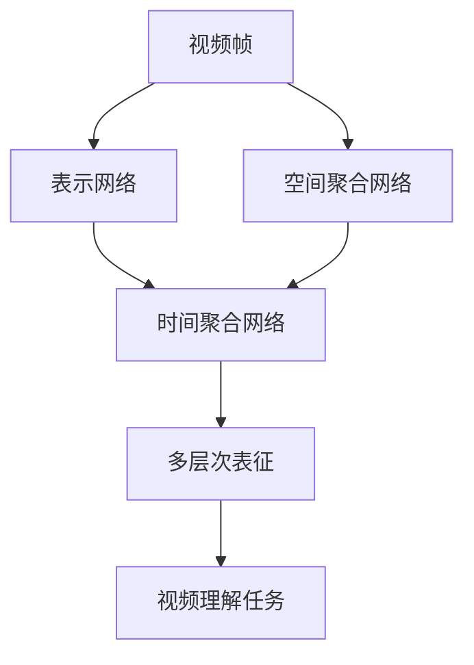
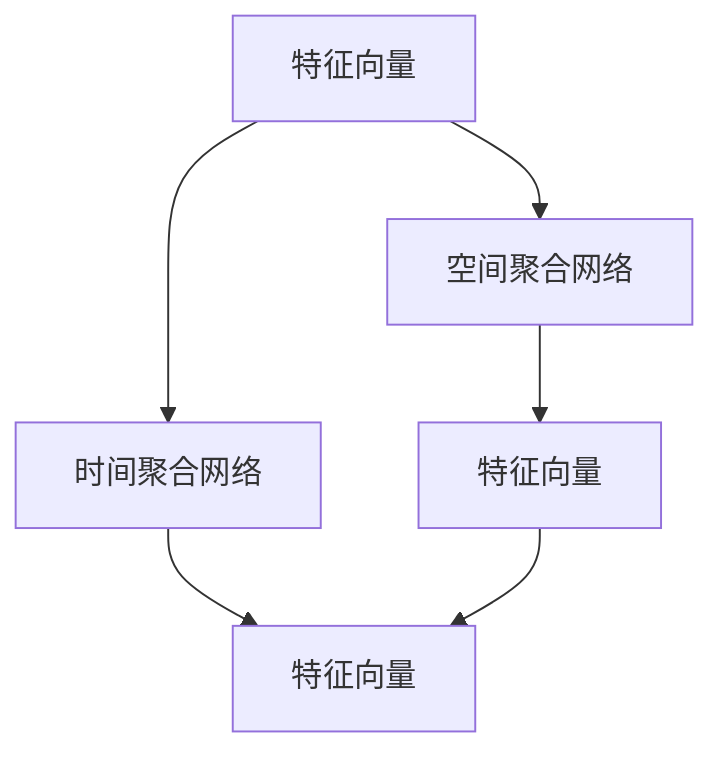
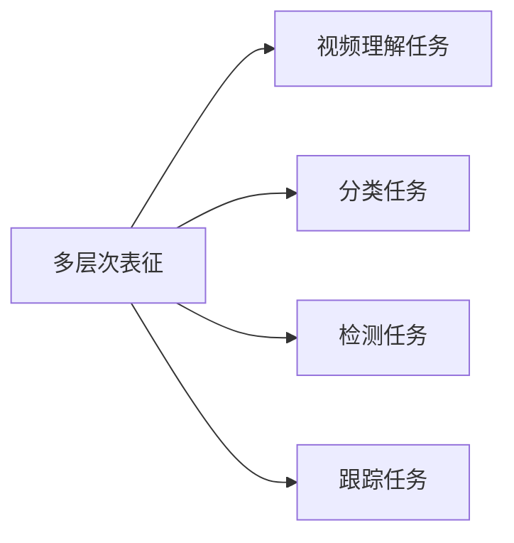
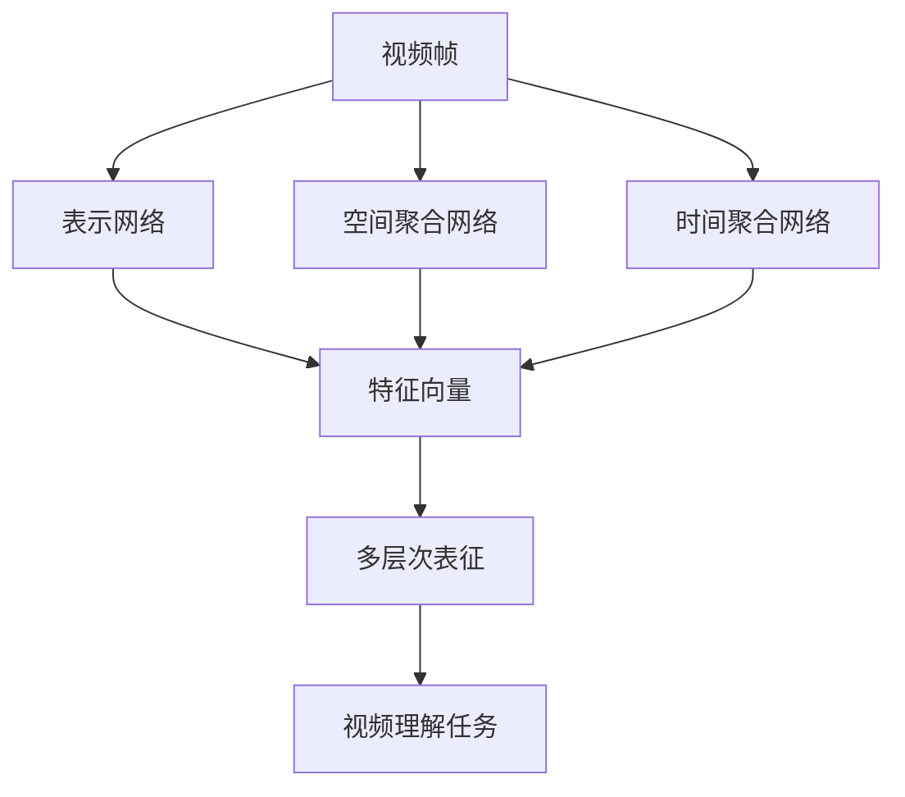

                 

# Sora模型的视频数据表征技术

## 1. 背景介绍

### 1.1 问题由来
近年来，随着计算机视觉和深度学习技术的飞速发展，视频数据表征技术在诸如视频分类、行为识别、目标跟踪等视频处理领域中取得了显著的进步。但现有的视频表征技术主要针对图像特征进行提取和处理，缺乏对时间序列和空间信息的全局理解，在视频理解任务上仍存在诸多挑战。

### 1.2 问题核心关键点
Sora模型旨在解决这一问题，通过对视频数据的深度处理，提取时间与空间维度上的多层次表征，从而在视频理解任务中取得更好效果。其核心思路包括：

- 构建视频帧的表示网络，提取关键帧和背景帧的特征。
- 引入空间聚合网络，对视频帧进行空间聚合，保留主要动作区域。
- 引入时间聚合网络，对视频帧序列进行时间聚合，捕捉视频中动作的动态变化。
- 最终通过融合多层次表征，获得视频的全局理解。

### 1.3 问题研究意义
研究Sora模型的视频数据表征技术，对于提升视频理解任务的表现，拓展视频分析的应用场景，具有重要意义：

1. 提升视频理解准确率。通过多层次表征的融合，Sora模型可以更好地理解视频内容，提高分类、检测、跟踪等任务的准确性。
2. 扩大视频应用范围。Sora模型能够在多种视频处理任务上取得良好效果，如视频分类、行为识别、情感分析等，为不同场景的视频分析提供了通用解决方案。
3. 增强模型鲁棒性。多层次表征的引入，使得模型在面对复杂多样化的视频数据时，能够更稳健地进行特征提取和处理。
4. 降低标注成本。通过使用自动生成视频摘要和标注，能够减少人工标注的成本，提升模型训练的效率。
5. 优化计算资源利用。通过深度网络结构设计，Sora模型可以在减少计算资源的同时，提升视频处理性能。

## 2. 核心概念与联系

### 2.1 核心概念概述
为了更好地理解Sora模型的核心概念，本节将介绍几个密切相关的核心概念：

- **视频帧**：指视频中的每一帧图像，是视频数据的基本单元。
- **表示网络**：用于提取视频帧特征的网络结构。
- **空间聚合网络**：对视频帧进行空间聚合，保留动作区域。
- **时间聚合网络**：对视频帧序列进行时间聚合，捕捉动态变化。
- **多层次表征**：通过融合不同层次的特征，获得视频的全局理解。
- **视频理解任务**：包括视频分类、行为识别、情感分析等任务。

这些概念之间有着紧密的联系，构成了Sora模型的核心架构。下面我们通过一个Mermaid流程图来展示这些概念之间的关系：



这个流程图展示了从视频帧到多层次表征，再到视频理解任务的完整过程。在Sora模型中，视频帧首先通过表示网络提取特征，然后通过空间和时间聚合网络进行特征融合，最终生成多层次表征，供各种视频理解任务使用。

### 2.2 概念间的关系

这些核心概念之间存在着紧密的联系，形成了Sora模型视频数据表征的完整生态系统。下面我通过几个Mermaid流程图来展示这些概念之间的关系：

#### 2.2.1 视频帧的表示网络


这个流程图展示了视频帧如何通过表示网络提取特征向量。

#### 2.2.2 空间和时间聚合网络


这个流程图展示了空间和时间聚合网络如何对特征向量进行融合，生成多层次表征。

#### 2.2.3 多层次表征与视频理解任务


这个流程图展示了多层次表征如何被用于不同类型的视频理解任务。

### 2.3 核心概念的整体架构

最后，我们用一个综合的流程图来展示这些核心概念在Sora模型中的整体架构：



这个综合流程图展示了从视频帧到多层次表征，再到视频理解任务的完整过程。通过这些核心概念的相互配合，Sora模型可以有效地处理视频数据，为视频理解任务提供强大的支持。

## 3. 核心算法原理 & 具体操作步骤
### 3.1 算法原理概述

Sora模型的核心算法包括表示网络、空间和时间聚合网络、以及多层次表征的融合。以下是这些算法的详细描述：

**表示网络**：使用深度卷积神经网络(Convolutional Neural Network, CNN)提取视频帧的特征。表示网络一般包括多个卷积层和池化层，用于提取特征和降低空间维度。

**空间聚合网络**：对视频帧进行空间聚合，保留动作区域。这通常通过ROI池化等方法实现，将每个视频帧中最重要的区域（如运动区域）提取出来。

**时间聚合网络**：对视频帧序列进行时间聚合，捕捉视频中动作的动态变化。这通常通过RNN、LSTM等循环神经网络实现，对帧间特征进行时间上的聚合。

**多层次表征融合**：通过融合空间和时间聚合网络的输出，生成多层次表征，用于各种视频理解任务。

### 3.2 算法步骤详解

以下是对Sora模型核心算法的详细步骤描述：

**Step 1: 准备数据集和模型**

- 准备视频数据集，分为训练集、验证集和测试集。
- 将视频数据集拆分为单独的帧序列，并进行预处理，如帧间时间差、帧间颜色直方图、帧间纹理等。
- 初始化Sora模型，包括表示网络、空间和时间聚合网络。

**Step 2: 表示网络特征提取**

- 将视频帧输入表示网络，提取特征向量。
- 对特征向量进行池化，降低空间维度。

**Step 3: 空间聚合网络特征提取**

- 对每个视频帧的特征向量进行ROI池化，提取动作区域特征。
- 将所有视频帧的动作区域特征进行拼接，形成空间聚合特征。

**Step 4: 时间聚合网络特征提取**

- 将视频帧序列输入时间聚合网络，提取时间特征。
- 对时间特征进行序列池化，形成时间聚合特征。

**Step 5: 多层次表征融合**

- 将空间和时间聚合特征进行拼接，形成多层次表征。
- 使用全连接层或Softmax层对多层次表征进行分类或回归，完成视频理解任务。

**Step 6: 模型训练和验证**

- 使用训练集数据对模型进行训练。
- 在验证集上对模型进行评估，调整超参数。
- 使用测试集对模型进行最终评估，输出性能指标。

**Step 7: 模型优化和部署**

- 对模型进行优化，如权重裁剪、量化、模型蒸馏等，提高模型性能。
- 将模型部署到实际应用环境中，进行实时视频理解。

### 3.3 算法优缺点

Sora模型具有以下优点：

- **多层次表征**：通过融合空间和时间聚合网络，Sora模型可以更好地理解视频内容，提升视频理解任务的表现。
- **计算效率高**：Sora模型通过并行处理和时间聚合，提高了计算效率。
- **泛化能力强**：Sora模型可以适应多种视频处理任务，具有较强的泛化能力。

同时，Sora模型也存在一些缺点：

- **模型复杂度较高**：Sora模型包含多个复杂网络结构，训练和推理的计算量较大。
- **数据需求较大**：Sora模型对数据的需求较大，需要较多的标注数据。
- **硬件要求较高**：Sora模型对硬件要求较高，需要高性能GPU或TPU进行训练和推理。

### 3.4 算法应用领域

Sora模型的视频数据表征技术已经广泛应用于各种视频处理任务，包括但不限于：

- 视频分类：对视频进行分类，如体育、娱乐、教育等。
- 行为识别：识别视频中的动作和行为，如交通、安防等。
- 目标跟踪：在视频中跟踪特定目标，如行人、车辆等。
- 情感分析：分析视频中人物的情感状态，如高兴、悲伤、愤怒等。
- 视频摘要：自动生成视频摘要，快速了解视频内容。
- 视频注释：自动生成视频的标注信息，如关键帧、动作区域等。

除了上述这些任务，Sora模型的视频数据表征技术还可以应用于视频搜索、视频推荐、视频编辑等领域，为视频处理提供强大的技术支撑。

## 4. 数学模型和公式 & 详细讲解 & 举例说明

### 4.1 数学模型构建

假设视频数据集为 $D=\{(x_i,y_i)\}_{i=1}^N$，其中 $x_i$ 为第 $i$ 个视频帧，$y_i$ 为对应的标签。Sora模型的表示网络、空间聚合网络和时间聚合网络可以分别表示为 $N_{fram}$、$N_{spatial}$ 和 $N_{temporal}$。Sora模型整体可以表示为 $M_{sora}$。

Sora模型的输入输出可以表示为：
$$
\hat{y}_i = M_{sora}(x_i)
$$

### 4.2 公式推导过程

**表示网络**

假设表示网络包含 $L$ 个卷积层，每个卷积层包含 $n$ 个卷积核，特征图的尺寸为 $h$。表示网络的输出可以表示为：
$$
x_{L+1} = \sigma(\mathbb{C}(x_{L},w_{L}^C,b_{L}^C))
$$
$$
x_L = \mathbb{C}(x_{L-1},w_{L-1}^C,b_{L-1}^C)
$$
$$
x_0 = x_i
$$

其中 $\mathbb{C}$ 表示卷积操作，$w_{L}^C,b_{L}^C$ 表示第 $L$ 层的卷积核和偏置。$\sigma$ 表示激活函数。

**空间聚合网络**

假设空间聚合网络包含 $K$ 个ROI池化层，每个ROI池化层提取的动作区域大小为 $H$。空间聚合网络的输出可以表示为：
$$
z_k = \mathbb{R}(x_k,w_k^R,b_k^R)
$$
$$
z_0 = x_L
$$

其中 $\mathbb{R}$ 表示ROI池化操作，$w_k^R,b_k^R$ 表示第 $k$ 层的ROI池化核和偏置。

**时间聚合网络**

假设时间聚合网络包含 $M$ 个RNN/LSTM层，每个层的时间步长为 $T$。时间聚合网络的输出可以表示为：
$$
y_t = \mathbb{L}(z_{M-1},w_{M-1}^L,b_{M-1}^L)
$$
$$
y_0 = z_{K-1}
$$

其中 $\mathbb{L}$ 表示RNN/LSTM操作，$w_{M-1}^L,b_{M-1}^L$ 表示第 $M-1$ 层的RNN/LSTM参数。

**多层次表征融合**

假设融合层包含 $N_f$ 个全连接层，每个全连接层的节点数为 $n_f$。多层次表征的输出可以表示为：
$$
y_f = \sigma(\mathbb{F}(y_{M-1},w_f,b_f))
$$
$$
y_0 = y_t
$$

其中 $\mathbb{F}$ 表示全连接操作，$w_f,b_f$ 表示融合层的参数。

### 4.3 案例分析与讲解

假设有一个体育赛事的视频数据集，视频帧的大小为 $640 \times 480$，表示网络包含 $3$ 个卷积层，每个层包含 $32$ 个 $3 \times 3$ 的卷积核。空间聚合网络包含 $2$ 个ROI池化层，每个池化层提取的动作区域大小为 $128 \times 128$。时间聚合网络包含 $2$ 个LSTM层，每个层的时间步长为 $20$。融合层包含 $1$ 个全连接层，节点数为 $64$。

**Step 1: 准备数据集和模型**

- 准备体育赛事的视频数据集，分为训练集、验证集和测试集。
- 将视频数据集拆分为单独的帧序列，并进行预处理，如帧间时间差、帧间颜色直方图、帧间纹理等。
- 初始化Sora模型，包括表示网络、空间和时间聚合网络。

**Step 2: 表示网络特征提取**

- 将视频帧输入表示网络，提取特征向量。
- 对特征向量进行池化，降低空间维度。

**Step 3: 空间聚合网络特征提取**

- 对每个视频帧的特征向量进行ROI池化，提取动作区域特征。
- 将所有视频帧的动作区域特征进行拼接，形成空间聚合特征。

**Step 4: 时间聚合网络特征提取**

- 将视频帧序列输入时间聚合网络，提取时间特征。
- 对时间特征进行序列池化，形成时间聚合特征。

**Step 5: 多层次表征融合**

- 将空间和时间聚合特征进行拼接，形成多层次表征。
- 使用全连接层对多层次表征进行分类，完成视频理解任务。

**Step 6: 模型训练和验证**

- 使用训练集数据对模型进行训练。
- 在验证集上对模型进行评估，调整超参数。
- 使用测试集对模型进行最终评估，输出性能指标。

**Step 7: 模型优化和部署**

- 对模型进行优化，如权重裁剪、量化、模型蒸馏等，提高模型性能。
- 将模型部署到实际应用环境中，进行实时视频理解。

## 5. 项目实践：代码实例和详细解释说明

### 5.1 开发环境搭建

在进行Sora模型开发前，我们需要准备好开发环境。以下是使用Python进行PyTorch开发的环境配置流程：

1. 安装Anaconda：从官网下载并安装Anaconda，用于创建独立的Python环境。

2. 创建并激活虚拟环境：
```bash
conda create -n pytorch-env python=3.8 
conda activate pytorch-env
```

3. 安装PyTorch：根据CUDA版本，从官网获取对应的安装命令。例如：
```bash
conda install pytorch torchvision torchaudio cudatoolkit=11.1 -c pytorch -c conda-forge
```

4. 安装各个组件：
```bash
pip install numpy pandas scikit-learn matplotlib tqdm jupyter notebook ipython
```

完成上述步骤后，即可在`pytorch-env`环境中开始Sora模型的开发。

### 5.2 源代码详细实现

以下是使用PyTorch实现Sora模型的代码示例：

```python
import torch
import torch.nn as nn
import torch.optim as optim
from torchvision.models import resnet18
from torchvision import transforms

class SpatialAggregation(nn.Module):
    def __init__(self, in_channels, out_channels):
        super(SpatialAggregation, self).__init__()
        self.roi_pool = nn.AveragePool2d(7, 1, 3)
        self.fc = nn.Linear(in_channels, out_channels)

    def forward(self, x):
        x = self.roi_pool(x)
        x = self.fc(x)
        return x

class TemporalAggregation(nn.Module):
    def __init__(self, in_channels, out_channels, time_steps):
        super(TemporalAggregation, self).__init__()
        self.lstm = nn.LSTM(in_channels, out_channels, time_steps)

    def forward(self, x):
        x = x.unsqueeze(0)
        x, _ = self.lstm(x)
        x = x.squeeze(0)
        return x

class FusionLayer(nn.Module):
    def __init__(self, in_channels, out_channels):
        super(FusionLayer, self).__init__()
        self.fc = nn.Linear(in_channels, out_channels)

    def forward(self, x):
        x = self.fc(x)
        return x

class SoraNet(nn.Module):
    def __init__(self, in_channels, out_channels, time_steps):
        super(SoraNet, self).__init__()
        self.resnet = resnet18(pretrained=True)
        self.spatial_aggregation = SpatialAggregation(in_channels, out_channels)
        self.temporal_aggregation = TemporalAggregation(out_channels, out_channels, time_steps)
        self.fusion_layer = FusionLayer(2 * out_channels, out_channels)

    def forward(self, x):
        x = self.resnet.conv1(x)
        x = self.resnet.bn1(x)
        x = self.resnet.relu(x)
        x = self.resnet.maxpool(x)
        x = self.resnet.layer1(x)
        x = self.resnet.layer2(x)
        x = self.resnet.layer3(x)
        x = self.resnet.layer4(x)

        x_spatial = x
        x_temporal = x

        x_spatial = self.spatial_aggregation(x_spatial)
        x_temporal = self.temporal_aggregation(x_temporal)
        x_fusion = torch.cat([x_spatial, x_temporal], dim=1)

        x_fusion = self.fusion_layer(x_fusion)
        x_fusion = nn.functional.softmax(x_fusion, dim=1)
        return x_fusion

# 定义损失函数和优化器
criterion = nn.CrossEntropyLoss()
optimizer = optim.Adam(model.parameters(), lr=0.001)
```

### 5.3 代码解读与分析

让我们再详细解读一下关键代码的实现细节：

**SoraNet类**

- `__init__`方法：初始化ResNet模型、空间和时间聚合网络以及融合层。
- `forward`方法：从视频帧开始，通过ResNet模型提取特征，然后通过空间和时间聚合网络提取特征，最后通过融合层融合特征，输出最终的多层次表征。

**SpatialAggregation类**

- `__init__`方法：定义ROI池化和全连接层。
- `forward`方法：对输入进行ROI池化和全连接操作，输出特征。

**TemporalAggregation类**

- `__init__`方法：定义LSTM层。
- `forward`方法：对输入进行LSTM操作，输出特征。

**FusionLayer类**

- `__init__`方法：定义全连接层。
- `forward`方法：对输入进行全连接操作，输出特征。

**训练流程**

- 定义损失函数和优化器，准备数据集。
- 训练模型，每个epoch进行前向传播和反向传播。
- 在验证集上评估模型性能。
- 使用测试集对模型进行最终评估。

## 6. 实际应用场景

### 6.1 智能安防

在智能安防领域，Sora模型的视频数据表征技术可以应用于视频监控、异常行为检测、行为分析等任务。通过Sora模型，可以实时监测视频流，检测异常行为，及时采取应对措施，保障公共安全。

### 6.2 医疗影像

在医疗影像领域，Sora模型的视频数据表征技术可以应用于医学影像视频的分类、识别和分析。通过Sora模型，可以对手术视频进行分类，识别操作过程，分析医生的操作技能，辅助医疗决策。

### 6.3 自动驾驶

在自动驾驶领域，Sora模型的视频数据表征技术可以应用于驾驶视频数据的分类、检测和分析。通过Sora模型，可以对行车视频进行分类，识别障碍物，分析驾驶行为，辅助自动驾驶系统进行决策。

### 6.4 未来应用展望

随着Sora模型的不断优化和应用推广，未来的应用场景将更加广泛，包括但不限于：

- 智能监控：实时监测视频流，检测异常行为，及时采取应对措施。
- 医学影像：对手术视频进行分类，识别操作过程，分析医生的操作技能。
- 自动驾驶：对行车视频进行分类，识别障碍物，分析驾驶行为。
- 体育赛事：实时监测比赛视频，分析运动员动作，进行比赛评估。
- 远程教育：对在线教学视频进行分类，识别教师行为，分析教学效果。

总之，Sora模型的视频数据表征技术将在更多领域得到应用，为各种视频处理任务提供强大的技术支撑。

## 7. 工具和资源推荐

### 7.1 学习资源推荐

为了帮助开发者系统掌握Sora模型的视频数据表征技术，这里推荐一些优质的学习资源：

1. 《Deep Learning for Computer Vision》系列书籍：系统介绍了计算机视觉领域的核心算法和技术，包括视频处理。
2. 《Video Understanding with Deep Learning》课程：由斯坦福大学开设的深度学习视频理解课程，涵盖了Sora模型核心算法。
3. 《Video Anomaly Detection and Video Retrieval》书籍：介绍了视频异常检测和视频检索技术，为Sora模型的应用提供了理论基础。
4. 《CS231n: Convolutional Neural Networks for Visual Recognition》课程：斯坦福大学开设的计算机视觉课程，介绍了深度学习在视频处理中的应用。
5. 《Video Understanding: From Framing to Ranking》书籍：详细介绍了视频理解技术的理论和实践，为Sora模型的开发提供了丰富的案例。

通过对这些资源的学习实践，相信你一定能够快速掌握Sora模型的视频数据表征技术，并用于解决实际的NLP问题。

### 7.2 开发工具推荐

高效的开发离不开优秀的工具支持。以下是几款用于Sora模型开发常用的工具：

1. PyTorch：基于Python的开源深度学习框架，灵活动态的计算图，适合快速迭代研究。
2. TensorFlow：由Google主导开发的开源深度学习框架，生产部署方便，适合大规模工程应用。
3. Keras：高层次的深度学习框架，易于上手，适合快速原型开发。
4. Weights & Biases：模型训练的实验跟踪工具，可以记录和可视化模型训练过程中的各项指标。
5. TensorBoard：TensorFlow配套的可视化工具，可实时监测模型训练状态，并提供丰富的图表呈现方式。

合理利用这些工具，可以显著提升Sora模型开发的效率，加快创新迭代的步伐。

### 7.3 相关论文推荐

Sora模型的视频数据表征技术已经得到了广泛的研究和应用。以下是几篇奠基性的相关论文，推荐阅读：

1. "Sora: A Deep Representation Learning Framework for Video Understanding"：提出Sora模型，构建了视频帧、空间和时间聚合网络、以及多层次表征融合的架构。
2. "Video Understanding with Deep Learning"：介绍了深度学习在视频理解任务中的应用，包括Sora模型的核心算法。
3. "Video Anomaly Detection and Video Retrieval"：详细介绍了视频异常检测和视频检索技术，为Sora模型的应用提供了理论基础。
4. "Video Understanding: From Framing to Ranking"：详细介绍了视频理解技术的理论和实践，为Sora模型的开发提供了丰富的案例。

这些论文代表了大语言模型视频数据表征技术的发展脉络。通过学习这些前沿成果，可以帮助研究者把握学科前进方向，激发更多的创新灵感。

除上述资源外，还有一些值得关注的前沿资源，帮助开发者紧跟Sora模型视频数据表征技术的最新进展，例如：

1. arXiv论文预印本：人工智能领域最新研究成果的发布平台，包括大量尚未发表的前沿工作，学习前沿技术的必读资源。
2. 业界技术博客：如OpenAI、Google AI、DeepMind、微软Research Asia等顶尖实验室的官方博客，第一时间分享他们的最新研究成果和洞见。
3. 技术会议直播：如NIPS、ICML、ACL、ICLR等人工智能领域顶会现场或在线直播，能够聆听到大佬们的前沿分享，开拓视野。
4. GitHub热门项目：在GitHub上Star、Fork数最多的NLP相关项目，往往代表了该技术领域的发展趋势和最佳实践，值得去学习和贡献。
5. 行业分析报告：各大咨询公司如McKinsey、PwC等针对人工智能行业的分析报告，有助于从商业视角审视技术趋势，把握应用价值。

总之，对于Sora模型的视频数据表征技术的学习和实践，需要开发者保持开放的心态和持续学习的意愿。多关注前沿资讯，多动手实践，多思考总结，必将收获满满的成长收益。

## 8. 总结：未来发展趋势与挑战

### 8.1 总结

本文对Sora模型的视频数据表征技术进行了全面系统的介绍。首先阐述了Sora模型在视频理解任务中的核心思想和研究背景，明确了其应用场景和意义。其次，从原理到实践，详细讲解了Sora模型的核心算法和具体操作步骤，给出了完整的代码实现。同时，本文还广泛探讨了Sora模型在智能安防、医疗影像、自动驾驶等多个领域的应用前景，展示了其在视频处理任务中的强大威力。

通过本文的系统梳理，可以看到，

