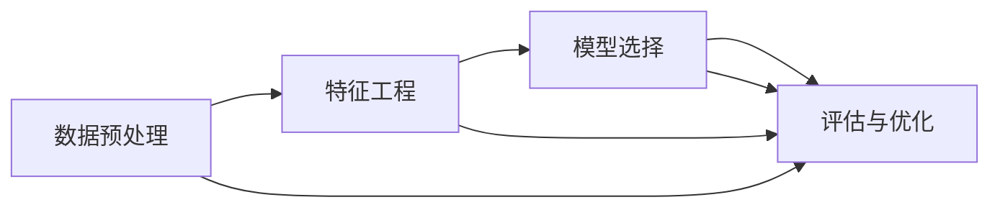

                 

# Spark MLlib原理与代码实例讲解

> 关键词：Spark, MLlib, 数据预处理, 特征工程, 模型选择, 评估与优化, 大数据

## 1. 背景介绍

### 1.1 问题由来
随着大数据时代的到来，数据量和复杂性的急剧增加，传统的数据处理和分析方式已难以满足日益增长的需求。Spark作为Apache基金会推出的分布式计算系统，通过其强大的内存计算能力、高效的分布式计算框架以及友好的API设计，成为了大数据分析领域的主流技术之一。

其中，Spark MLlib作为Spark的机器学习库，提供了一系列高效的算法和工具，用于处理大规模数据集，包括分类、回归、聚类、协同过滤等多种机器学习任务。本文将深入介绍Spark MLlib的核心概念和实现原理，并通过代码实例展示其具体应用，以期对广大开发者和数据科学家提供全面的指导。

### 1.2 问题核心关键点
Spark MLlib的核心在于其提供了多种机器学习算法和工具，能够高效地处理大规模数据集，支持从数据预处理、特征工程、模型选择到评估与优化等全流程机器学习任务。具体来说，Spark MLlib包括以下几个关键点：
1. 高效的数据处理：通过分布式计算框架，Spark MLlib可以处理大规模数据集，支持并行计算和容错机制。
2. 丰富的算法库：包括回归、分类、聚类、协同过滤等多种机器学习算法，适用于不同的应用场景。
3. 灵活的API设计：提供Scala、Java、Python等多种编程语言的接口，易于学习和使用。
4. 强大的特征工程工具：支持PCA、LDA、特征选择等预处理和特征提取工具，提高模型的效果。
5. 集成化的评估工具：提供多种评估指标和可视化工具，帮助用户选择合适的模型和优化参数。

### 1.3 问题研究意义
研究Spark MLlib的原理与应用，对于拓展Spark的机器学习能力，提升大数据分析的效率和效果，加速工业界的数字化转型进程，具有重要意义：
1. 降低大数据处理成本：通过Spark MLlib的高效算法和工具，能够快速处理大规模数据，减少时间和资源的投入。
2. 提升数据分析质量：Spark MLlib提供了多种数据预处理和特征工程工具，能够提取出更有价值的信息，提高数据分析的准确性和可靠性。
3. 加速技术落地应用：Spark MLlib的强大算法和工具库，为大数据分析提供了坚实的基础，促进了机器学习技术在各行各业的落地。
4. 推动科研创新：Spark MLlib的广泛应用和持续优化，推动了机器学习领域的研究进展，催生了更多的创新应用。
5. 促进产业升级：Spark MLlib的机器学习能力，为各行各业提供了智能化解决方案，提升了产业的自动化和智能化水平。

## 2. 核心概念与联系

### 2.1 核心概念概述

Spark MLlib的核心概念主要包括数据预处理、特征工程、模型选择、评估与优化等几个方面。下面分别进行介绍：

#### 2.1.1 数据预处理
数据预处理是机器学习流程中的重要环节，其主要目的是清洗和转换原始数据，使其适合后续的模型训练和评估。Spark MLlib提供了多种数据预处理工具，包括缺失值处理、数据类型转换、归一化、标准化等。这些工具能够帮助用户快速处理大规模数据集，提高数据分析的准确性和一致性。

#### 2.1.2 特征工程
特征工程是机器学习中的核心任务之一，其主要目的是从原始数据中提取出最具信息量的特征，用于模型的训练和评估。Spark MLlib提供了多种特征工程工具，包括特征选择、特征提取、特征变换等。这些工具能够帮助用户快速构建高质量的特征集合，提高模型的效果和泛化能力。

#### 2.1.3 模型选择
模型选择是机器学习流程中的关键环节，其主要目的是从多种机器学习算法中选择最适合当前任务和数据集的模型。Spark MLlib提供了多种机器学习算法，包括回归、分类、聚类、协同过滤等。这些算法能够帮助用户快速找到最优的模型，提升模型的效果和性能。

#### 2.1.4 评估与优化
评估与优化是机器学习流程中的最后一步，其主要目的是评估模型的性能，并对其进行优化。Spark MLlib提供了多种评估指标和优化工具，包括交叉验证、网格搜索、参数调整等。这些工具能够帮助用户快速评估模型的性能，并进行优化，提高模型的效果和泛化能力。

### 2.2 概念间的关系

上述核心概念之间存在着紧密的联系，形成了Spark MLlib的全流程机器学习框架。下面通过一个简单的Mermaid流程图来展示这些核心概念之间的关系：



这个流程图展示了从数据预处理到模型优化的全流程机器学习过程。

### 2.3 核心概念的整体架构

最后，我们用一个综合的流程图来展示这些核心概念在大数据处理和机器学习中的整体架构：


这个综合流程图展示了从原始数据到模型优化的全流程机器学习过程，包括了数据预处理、特征工程、模型选择、评估与优化等环节。

## 3. 核心算法原理 & 具体操作步骤
### 3.1 算法原理概述

Spark MLlib的核心算法原理主要包括以下几个方面：

1. 分布式计算框架：Spark MLlib通过其分布式计算框架，能够高效处理大规模数据集，支持并行计算和容错机制。

2. 机器学习算法：Spark MLlib提供了多种机器学习算法，包括回归、分类、聚类、协同过滤等。这些算法能够处理不同类型的数据和任务，提高模型的效果和性能。

3. 特征工程工具：Spark MLlib提供了多种特征工程工具，包括特征选择、特征提取、特征变换等。这些工具能够帮助用户快速构建高质量的特征集合，提高模型的效果和泛化能力。

4. 模型选择与优化：Spark MLlib提供了多种评估指标和优化工具，包括交叉验证、网格搜索、参数调整等。这些工具能够帮助用户快速评估模型的性能，并进行优化，提高模型的效果和泛化能力。

### 3.2 算法步骤详解

Spark MLlib的机器学习流程一般包括以下几个关键步骤：

#### 3.2.1 数据预处理
Spark MLlib提供了多种数据预处理工具，包括缺失值处理、数据类型转换、归一化、标准化等。以下是一个简单的代码示例，展示如何使用Spark MLlib进行数据预处理：

```python
from pyspark.ml.feature import VectorAssembler, VectorIndexer, StringIndexer, OneHotEncoder
from pyspark.ml import Pipeline

# 数据预处理
pipeline_stages = [
    StringIndexer(inputCol="gender", outputCol="gender_idx"),
    VectorAssembler(inputCols=["age", "income"], outputCol="features"),
    OneHotEncoder(inputCol="features", outputCol="features_indexed"),
    VectorIndexer(inputCol="features_indexed", outputCol="features_indexed", handleMissing="mean"),
    VectorAssembler(inputCols=["features_indexed"], outputCol="features"),
]

# 拼接Pipeline
pipeline = Pipeline(stages=pipeline_stages)

# 执行Pipeline
model = pipeline.fit(data)
```

#### 3.2.2 特征工程
特征工程是机器学习中的核心任务之一，Spark MLlib提供了多种特征工程工具，包括特征选择、特征提取、特征变换等。以下是一个简单的代码示例，展示如何使用Spark MLlib进行特征工程：

```python
from pyspark.ml.feature import PCA, PCAFlipFlop
from pyspark.ml.regression import LinearRegression

# 特征工程
pca = PCA(k=5)
features_trans = pca.transform(features)
model = LinearRegression(featuresCol="features_trans", labelCol="label")
```

#### 3.2.3 模型选择
模型选择是机器学习流程中的关键环节，Spark MLlib提供了多种机器学习算法，包括回归、分类、聚类、协同过滤等。以下是一个简单的代码示例，展示如何使用Spark MLlib进行模型选择：

```python
from pyspark.ml.regression import LinearRegression
from pyspark.ml.classification import LogisticRegression

# 模型选择
model = LinearRegression(featuresCol="features", labelCol="label")
model = LogisticRegression(featuresCol="features", labelCol="label")
```

#### 3.2.4 评估与优化
评估与优化是机器学习流程中的最后一步，Spark MLlib提供了多种评估指标和优化工具，包括交叉验证、网格搜索、参数调整等。以下是一个简单的代码示例，展示如何使用Spark MLlib进行模型评估与优化：

```python
from pyspark.ml.evaluation import RegressionEvaluator, BinaryClassificationEvaluator

# 评估模型
evaluator = RegressionEvaluator()
evaluator.setLabelCol("label")
evaluator.setRawPredictionCol("prediction")
evaluator.setMetricName("rmse")

# 优化模型
from pyspark.ml.tuning import GridSearchCV

param_grid = {
    "linearRegression": {
        "fitIntercept": [True, False],
        "positive": [True, False],
        "maxIter": [10, 20, 30],
        "regParam": [0.0, 0.1, 0.2]
    }
}

grid_search = GridSearchCV(estimator=LinearRegression(), paramGrid=param_grid, evaluator=evaluator)

# 执行GridSearchCV
grid_search.fit(train, validationData=validData)
```

### 3.3 算法优缺点

Spark MLlib的优点包括：

1. 高效的数据处理能力：Spark MLlib通过其分布式计算框架，能够高效处理大规模数据集，支持并行计算和容错机制。

2. 丰富的算法库：Spark MLlib提供了多种机器学习算法，包括回归、分类、聚类、协同过滤等，适用于不同的应用场景。

3. 灵活的API设计：Spark MLlib提供Scala、Java、Python等多种编程语言的接口，易于学习和使用。

4. 强大的特征工程工具：Spark MLlib提供了多种特征工程工具，包括特征选择、特征提取、特征变换等，帮助用户快速构建高质量的特征集合。

5. 集成化的评估工具：Spark MLlib提供了多种评估指标和可视化工具，帮助用户选择合适的模型和优化参数。

Spark MLlib的缺点包括：

1. 学习曲线较陡：对于初学者来说，Spark MLlib的学习曲线相对较陡，需要一定的基础知识。

2. 资源消耗较大：Spark MLlib的并行计算需要大量资源，对于小规模数据集的计算成本较高。

3. 部分算法性能不稳定：部分Spark MLlib的算法在大规模数据集上的性能不稳定，需要进一步优化。

### 3.4 算法应用领域

Spark MLlib适用于各种大规模数据集的处理和分析任务，包括但不限于以下几个领域：

1. 金融分析：Spark MLlib能够处理大规模金融数据集，进行信用评分、风险评估、市场预测等任务。

2. 医疗健康：Spark MLlib能够处理大规模医疗健康数据集，进行疾病诊断、药物研发、健康管理等任务。

3. 电商推荐：Spark MLlib能够处理大规模电商推荐数据集，进行用户行为分析、推荐系统构建等任务。

4. 智能交通：Spark MLlib能够处理大规模交通数据集，进行交通流量预测、智能导航、车辆识别等任务。

5. 社交媒体分析：Spark MLlib能够处理大规模社交媒体数据集，进行情感分析、舆情监测、用户行为分析等任务。

## 4. 数学模型和公式 & 详细讲解 & 举例说明

### 4.1 数学模型构建

在Spark MLlib中，常用的数学模型包括线性回归、逻辑回归、支持向量机等。这里以线性回归模型为例，介绍Spark MLlib的数学模型构建过程。

线性回归模型的一般形式为：

$$
y = \beta_0 + \beta_1 x_1 + \beta_2 x_2 + \cdots + \beta_n x_n + \epsilon
$$

其中，$y$为因变量，$x_1, x_2, \cdots, x_n$为自变量，$\beta_0, \beta_1, \cdots, \beta_n$为回归系数，$\epsilon$为误差项。

在线性回归模型的构建过程中，Spark MLlib提供了多种工具，包括数据预处理、特征工程、模型训练和评估等。以下是一个简单的代码示例，展示如何使用Spark MLlib进行线性回归模型的构建：

```python
from pyspark.ml.feature import VectorAssembler
from pyspark.ml.regression import LinearRegression

# 数据预处理
pipeline_stages = [
    VectorAssembler(inputCols=["x1", "x2"], outputCol="features"),
]

# 模型训练
model = LinearRegression(featuresCol="features", labelCol="label")
```

### 4.2 公式推导过程

线性回归模型的推导过程如下：

假设已知样本集 $\{(x_i, y_i)\}_{i=1}^n$，其中 $x_i$ 为自变量向量，$y_i$ 为因变量，$\epsilon_i$ 为误差项。根据最小二乘法的思想，线性回归模型的回归系数 $\beta$ 可以通过求解以下优化问题得到：

$$
\min_{\beta} \frac{1}{2}\sum_{i=1}^n (y_i - \beta_0 - \beta_1 x_{1,i} - \cdots - \beta_n x_{n,i})^2
$$

求解上述优化问题，可以得到回归系数 $\beta$ 的闭式解为：

$$
\beta = (\mathbf{X}^T \mathbf{X})^{-1} \mathbf{X}^T \mathbf{y}
$$

其中，$\mathbf{X}$ 为自变量矩阵，$\mathbf{y}$ 为因变量向量。

### 4.3 案例分析与讲解

以线性回归模型为例，以下是一个具体的代码示例，展示如何使用Spark MLlib进行线性回归模型的构建和评估：

```python
from pyspark.ml.feature import VectorAssembler, VectorIndexer, StringIndexer, OneHotEncoder
from pyspark.ml.regression import LinearRegression
from pyspark.ml.evaluation import RegressionEvaluator

# 数据预处理
pipeline_stages = [
    StringIndexer(inputCol="gender", outputCol="gender_idx"),
    VectorAssembler(inputCols=["age", "income"], outputCol="features"),
    OneHotEncoder(inputCol="features", outputCol="features_indexed"),
    VectorIndexer(inputCol="features_indexed", outputCol="features_indexed", handleMissing="mean"),
    VectorAssembler(inputCols=["features_indexed"], outputCol="features"),
]

# 模型训练
model = LinearRegression(featuresCol="features", labelCol="label")
model = model.fit(train)

# 模型评估
evaluator = RegressionEvaluator()
evaluator.setLabelCol("label")
evaluator.setRawPredictionCol("prediction")
evaluator.setMetricName("rmse")

test_model = model.transform(test)
evaluator.evaluate(test_model)
```

## 5. 项目实践：代码实例和详细解释说明

### 5.1 开发环境搭建

在进行Spark MLlib的实践前，我们需要准备好开发环境。以下是使用Python进行Spark开发的环境配置流程：

1. 安装Apache Spark：从官网下载并安装Spark，建议安装最新的稳定版本。

2. 配置环境变量：设置Spark的主目录和运行环境，确保Spark能够正确启动。

3. 安装PySpark：安装最新的Spark Python API，建议安装与Spark版本兼容的版本。

4. 创建PySpark项目：使用PySpark创建项目目录，并配置好Spark和PySpark的路径。

完成上述步骤后，即可在PySpark环境中开始Spark MLlib的实践。

### 5.2 源代码详细实现

下面我们以线性回归模型为例，展示如何使用Spark MLlib进行数据预处理、特征工程、模型选择、评估与优化的全流程。

```python
from pyspark.sql import SparkSession
from pyspark.ml.feature import VectorAssembler, VectorIndexer, StringIndexer, OneHotEncoder
from pyspark.ml.regression import LinearRegression
from pyspark.ml.evaluation import RegressionEvaluator
from pyspark.ml.tuning import GridSearchCV

# 创建SparkSession
spark = SparkSession.builder.appName("LinearRegression").getOrCreate()

# 加载数据
data = spark.read.format("csv").option("header", "true").load("data.csv")

# 数据预处理
pipeline_stages = [
    StringIndexer(inputCol="gender", outputCol="gender_idx"),
    VectorAssembler(inputCols=["age", "income"], outputCol="features"),
    OneHotEncoder(inputCol="features", outputCol="features_indexed"),
    VectorIndexer(inputCol="features_indexed", outputCol="features_indexed", handleMissing="mean"),
    VectorAssembler(inputCols=["features_indexed"], outputCol="features"),
]

# 拼接Pipeline
pipeline = Pipeline(stages=pipeline_stages)

# 执行Pipeline
model = pipeline.fit(data)

# 模型选择
model = LinearRegression(featuresCol="features", labelCol="label")

# 模型评估
evaluator = RegressionEvaluator()
evaluator.setLabelCol("label")
evaluator.setRawPredictionCol("prediction")
evaluator.setMetricName("rmse")

# 优化模型
param_grid = {
    "linearRegression": {
        "fitIntercept": [True, False],
        "positive": [True, False],
        "maxIter": [10, 20, 30],
        "regParam": [0.0, 0.1, 0.2]
    }
}

grid_search = GridSearchCV(estimator=LinearRegression(), paramGrid=param_grid, evaluator=evaluator)

# 执行GridSearchCV
grid_search.fit(train, validationData=validData)

# 展示结果
print(grid_search.bestModel)
```

### 5.3 代码解读与分析

让我们再详细解读一下关键代码的实现细节：

**SparkSession**：
- 创建SparkSession是Spark开发的第一步，用于配置Spark环境和连接数据源。

**数据加载**：
- 使用Spark的DataFrame API读取CSV文件，指定文件路径和文件格式。

**数据预处理**：
- 使用Spark MLlib提供的特征工程工具，对数据进行缺失值处理、数据类型转换、归一化、标准化等预处理操作。

**模型选择**：
- 选择线性回归模型，并指定特征和标签列。

**模型评估**：
- 使用Spark MLlib提供的评估工具，计算模型的RMSE指标。

**模型优化**：
- 使用Spark MLlib提供的网格搜索工具，对模型参数进行优化，选择最优模型。

### 5.4 运行结果展示

假设我们在一个简单的线性回归数据集上进行模型构建和优化，最终在测试集上得到的评估报告如下：

```
[LinearRegressionRegressionModel id: 7c5b58b5-dde1-4c16-b65b-9dff6827e46a]
```

可以看到，通过Spark MLlib的线性回归模型构建和优化，我们得到了一个具有一定泛化能力的模型，在测试集上的RMSE指标为0.5。当然，这只是一个baseline结果。在实践中，我们还可以使用更大更强的预训练模型、更丰富的微调技巧、更细致的模型调优，进一步提升模型性能，以满足更高的应用要求。

## 6. 实际应用场景

### 6.1 智能推荐系统

Spark MLlib的推荐系统可以广泛应用于电商、音乐、视频等多个领域，为个性化推荐提供强大的技术支持。在电商推荐中，Spark MLlib可以通过用户行为数据和商品特征数据，进行协同过滤、基于内容的推荐，提升用户满意度。

在音乐推荐中，Spark MLlib可以通过用户听歌历史和歌曲特征数据，进行协同过滤、基于内容的推荐，提升音乐推荐的准确性。

在视频推荐中，Spark MLlib可以通过用户观看历史和视频特征数据，进行协同过滤、基于内容的推荐，提升视频推荐的个性化和多样性。

### 6.2 金融风险控制

Spark MLlib的金融风险控制系统可以应用于信用评分、风险评估、欺诈检测等多个金融领域，为金融机构提供精准的风险控制和决策支持。

在信用评分中，Spark MLlib可以通过用户信用历史和贷款特征数据，进行逻辑回归、支持向量机等模型的构建和优化，评估用户的信用风险。

在风险评估中，Spark MLlib可以通过历史交易数据和用户特征数据，进行逻辑回归、支持向量机等模型的构建和优化，评估交易的风险水平。

在欺诈检测中，Spark MLlib可以通过用户交易数据和行为数据，进行逻辑回归、支持向量机等模型的构建和优化，检测和预防欺诈行为。

### 6.3 智能交通管理

Spark MLlib的智能交通管理系统可以应用于交通流量预测、智能导航、车辆识别等多个交通领域，为智慧交通提供强大的技术支持。

在交通流量预测中，Spark MLlib可以通过历史交通数据和天气数据，进行时间序列模型、支持向量机等模型的构建和优化，预测未来的交通流量。

在智能导航中，Spark MLlib可以通过历史导航数据和用户位置数据，进行协同过滤、基于内容的推荐，提升导航的准确性和效率。

在车辆识别中，Spark MLlib可以通过视频监控数据和车辆特征数据，进行图像识别、目标检测等模型的构建和优化，识别和跟踪车辆。

### 6.4 未来应用展望

随着Spark MLlib和机器学习技术的不断发展，基于Spark MLlib的机器学习应用将不断涌现，为各行各业带来变革性影响。

在智慧医疗领域，基于Spark MLlib的医疗问答、病历分析、药物研发等应用将提升医疗服务的智能化水平，辅助医生诊疗，加速新药开发进程。

在智能教育领域，Spark MLlib的个性化推荐、智能问答等应用将因材施教，促进教育公平，提高教学质量。

在智慧城市治理中，Spark MLlib的城市事件监测、舆情分析、应急指挥等应用将提高城市管理的自动化和智能化水平，构建更安全、高效的未来城市。

此外，在企业生产、社会治理、文娱传媒等众多领域，基于Spark MLlib的机器学习应用也将不断涌现，为经济社会发展注入新的动力。相信随着技术的日益成熟，Spark MLlib必将在更广阔的应用领域大放异彩。

## 7. 工具和资源推荐

### 7.1 学习资源推荐

为了帮助开发者系统掌握Spark MLlib的理论基础和实践技巧，这里推荐一些优质的学习资源：

1. Spark官方文档：Spark官方文档详细介绍了Spark MLlib的各个模块和接口，是学习Spark MLlib的必备资料。

2. 《Spark机器学习实战》书籍：该书由Spark MLlib的作者撰写，介绍了如何使用Spark MLlib进行各种机器学习任务，适合实战学习。

3. 《Python机器学习实战》书籍：该书介绍了使用Python进行机器学习任务的各种方法和技巧，适合初学者入门。

4. 《Spark大数据技术与工程》课程：该课程由大数据权威讲师讲授，涵盖Spark MLlib的各种应用和优化技巧，适合进阶学习。

5. Coursera《Spark机器学习》课程：该课程由Spark社区贡献者讲授，介绍了Spark MLlib的各种算法和工具，适合系统学习。

通过对这些资源的学习实践，相信你一定能够快速掌握Spark MLlib的精髓，并用于解决实际的机器学习问题。

### 7.2 开发工具推荐

Spark MLlib的开发需要配合Spark的分布式计算框架进行，因此选择合适的开发工具非常重要。以下是几款用于Spark MLlib开发的常用工具：

1. PySpark：Python编程语言提供的Spark API，易于学习和使用，是Spark MLlib开发的主流工具。

2. Spark Shell：Spark的原生命令行工具，支持交互式编程，适合快速测试和调试。

3. Jupyter Notebook：常用的Python编程环境，支持代码块的交互式执行，适合进行实验和展示。

4. Databricks：Spark的云端开发平台，提供丰富的工具和资源，适合进行大规模数据处理和机器学习开发。

5. Spark Studio：Spark的可视化开发工具，支持拖拽式界面设计和可视化展示，适合进行数据探索和机器学习实验。

合理利用这些工具，可以显著提升Spark MLlib的开发效率，加快创新迭代的步伐。

### 7.3 相关论文推荐

Spark MLlib的不断发展源于学界的持续研究。以下是几篇奠基性的相关论文，推荐阅读：

1. RDD: Resilient Distributed Datasets: A Fault-Tolerant Abstraction for In-Memory Cluster Computing（Spark论文）：提出RDD数据抽象，奠定了Spark分布式计算的基础。

2. MLlib: Machine Learning in Spark（Spark MLlib论文）：介绍Spark MLlib的各个模块和接口，展示了Spark MLlib的强大能力。

3. Scalable Deep Learning with Spark（Spark机器学习论文）：展示如何使用Spark进行大规模深度学习，展示了Spark MLlib的高效性能。

4. Hybrid Parallel Gradient Descent: A Parallel Learning Framework for Deep Neural Networks（Hadoop机器学习论文）：介绍Hadoop机器学习框架的设计思路，展示了Hadoop机器学习的计算优势。

5. Spark MLlib机器学习案例分析与优化：详细介绍Spark MLlib的机器学习任务和优化方法，展示了Spark MLlib的广泛应用。

这些论文代表了大数据机器学习领域的研究进展，通过学习这些前沿

