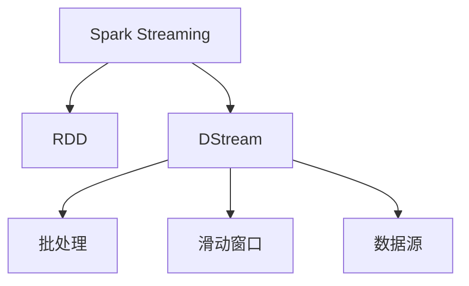
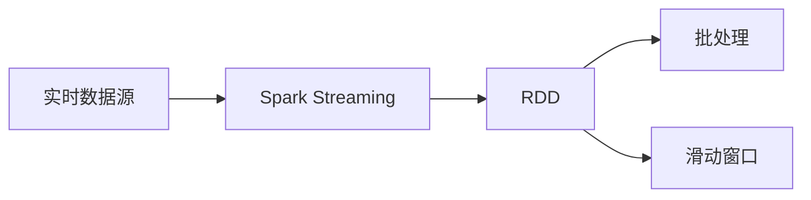

                 

# Spark Streaming 原理与代码实例讲解

## 1. 背景介绍

Spark Streaming 是 Apache Spark 的一个组件，用于实现实时数据流处理。Spark Streaming 通过将流数据分割成一系列的批次(batch)来处理，每个批次都是一个 RDD(Rich Distributed Dataset)，可以在 Spark 中进行分布式计算。Spark Streaming 支持从各种数据源获取数据，如 Kafka、Flume、HDFS 等，并且能够实时地生成汇总报告、跟踪流数据的状态等。

### 1.1 问题由来
在当今的互联网时代，数据流量的爆炸式增长使得实时数据处理变得越来越重要。传统的离线数据处理方式已经无法满足实时数据处理的需求，因此实时数据流处理技术应运而生。Spark Streaming 作为 Apache Spark 的一部分，因其性能优越、易于使用和丰富的功能而在实时数据流处理领域占据了重要地位。

### 1.2 问题核心关键点
Spark Streaming 的核心在于如何将流数据转化为 Spark 的 RDD 进行分布式处理，以及在处理过程中如何进行容错、状态管理等。Spark Streaming 的主要特点包括：

- **分布式计算**：能够将实时流数据转化为 Spark 的 RDD 进行分布式计算，利用 Spark 的并行处理能力，提高数据处理效率。
- **可扩展性**：可以动态扩展处理节点，适应数据流量的变化。
- **状态管理**：支持对流数据的状态进行管理，如计算窗口、滑动窗口等。
- **容错机制**：通过快照(snapshots)机制实现容错，保证数据处理的一致性。

### 1.3 问题研究意义
Spark Streaming 作为实时数据流处理的重要工具，对于处理大规模实时数据、提高数据处理效率、实时响应等具有重要意义。通过 Spark Streaming，企业能够实时地处理数据流，及时发现问题、优化决策，从而提高业务效率和客户满意度。

## 2. 核心概念与联系

### 2.1 核心概念概述

为更好地理解 Spark Streaming 的原理与代码实现，本节将介绍几个密切相关的核心概念：

- **Spark Streaming**：Apache Spark 的一个组件，用于处理实时数据流。通过将流数据分割成一系列的批次(batch)，并在每个批次上进行分布式计算，实现实时数据流处理。

- **RDD**：Resilient Distributed Dataset，Spark 的分布式数据集。支持多种数据源和数据操作，可以高效地进行分布式计算。

- **DStream**：Spark Streaming 的核心概念，是 Spark Streaming 中的数据流表示。每个 DStream 都是一个流数据集，由一个或多个 RDD 组成。

- **批处理**：Spark Streaming 将流数据分割成一系列的批次(batch)，每个批次都是一个 RDD，可以在 Spark 中进行分布式计算。

- **滑动窗口**：Spark Streaming 中的状态管理机制，用于对流数据进行时间窗口划分。

- **数据源**：Spark Streaming 支持的多种数据源，如 Kafka、Flume、HDFS 等。

这些核心概念之间的逻辑关系可以通过以下 Mermaid 流程图来展示：



这个流程图展示了他它们的关联关系：

1. Spark Streaming 将流数据转化为 RDD。
2. 每个 DStream 由多个 RDD 组成。
3. 批处理将流数据分割成多个批次，进行分布式计算。
4. 滑动窗口用于管理 DStream 的状态。
5. 数据源用于获取实时数据流。

### 2.2 概念间的关系

这些核心概念之间存在着紧密的联系，形成了 Spark Streaming 的核心生态系统。下面我们通过几个 Mermaid 流程图来展示这些概念之间的关系。

#### 2.2.1 Spark Streaming 的整体架构



这个流程图展示了 Spark Streaming 的总体架构：

1. 实时数据源通过 Spark Streaming 获取数据。
2. Spark Streaming 将流数据转化为 RDD。
3. 每个批次都是一个 RDD，可以进行分布式计算。
4. 滑动窗口用于管理状态。

#### 2.2.2 批处理和滑动窗口的结合


这个流程图展示了批处理和滑动窗口的结合：

1. 实时数据源通过 Spark Streaming 获取数据。
2. Spark Streaming 将流数据转化为 RDD。
3. 每个批次都是一个 RDD，可以进行分布式计算。
4. 滑动窗口用于管理状态。

## 3. 核心算法原理 & 具体操作步骤

### 3.1 算法原理概述

Spark Streaming 的原理是将流数据转化为 Spark 的 RDD，并使用批处理和滑动窗口等机制进行实时数据流处理。其主要算法流程如下：

1. 将实时流数据转化为 Spark 的 RDD。
2. 将 RDD 分割成多个批次，并在每个批次上进行分布式计算。
3. 使用滑动窗口等状态管理机制，对批处理结果进行汇总和计算。

Spark Streaming 的核心算法流程可以用以下 Mermaid 流程图表示：


这个流程图展示了 Spark Streaming 的核心算法流程：

1. 实时数据源通过 Spark Streaming 获取数据。
2. Spark Streaming 将流数据转化为 RDD。
3. 每个批次都是一个 RDD，可以进行分布式计算。
4. 滑动窗口用于管理状态。
5. 汇总和计算结果用于下游处理。

### 3.2 算法步骤详解

#### 3.2.1 实时数据源

Spark Streaming 支持多种数据源，包括 Kafka、Flume、HDFS 等。例如，可以使用 Spark Streaming 的 `SparkContext` 和 ` StreamingContext` 类连接 Kafka：

```python
from pyspark import SparkContext
from pyspark.streaming import StreamingContext

sc = SparkContext("local", "spark")
ssc = StreamingContext(sc, 2)

kafkaStream = KafkaUtils.createStream(ssc, "localhost:9092", "spark", {"topic": 1})
```

上述代码使用 `KafkaUtils.createStream` 方法连接 Kafka 数据源，将实时数据流转化为 DStream。

#### 3.2.2 批处理

Spark Streaming 将实时流数据分割成多个批次(batch)，并在每个批次上进行分布式计算。例如，可以使用 DStream 的 `foreachRDD` 方法在每个批次上进行计算：

```python
batch = ssc.batched(DStreamElement, 2)
batch.foreachRDD(lambda x: x.rdd.count())
```

上述代码将实时数据流分割成批次，并在每个批次上进行计数操作。

#### 3.2.3 滑动窗口

Spark Streaming 使用滑动窗口(stateful)来管理流数据的状态。例如，可以使用 DStream 的 `updateStateByKey` 方法在滑动窗口中更新状态：

```python
words = ssc.flatMap(lambda line: line.split(" "))
sentence = words.updateStateByKey(lambda w: (w, 1))
```

上述代码在滑动窗口中统计单词出现的次数。

#### 3.2.4 状态管理

Spark Streaming 使用状态管理机制来保证流数据的一致性。例如，可以使用 DStream 的 `updateStateByKey` 方法在滑动窗口中更新状态：

```python
words = ssc.flatMap(lambda line: line.split(" "))
sentence = words.updateStateByKey(lambda w: (w, 1))
```

上述代码在滑动窗口中统计单词出现的次数。

### 3.3 算法优缺点

Spark Streaming 具有以下优点：

- **分布式计算**：将实时流数据转化为 Spark 的 RDD，可以高效地进行分布式计算。
- **容错机制**：使用快照(snapshots)机制实现容错，保证数据处理的一致性。
- **状态管理**：支持对流数据的状态进行管理，如计算窗口、滑动窗口等。
- **易于使用**：使用简单易懂的 API，可以快速上手进行实时流处理。

Spark Streaming 也存在以下缺点：

- **延迟较大**：批处理机制导致的延迟较大，无法满足超低延迟的场景。
- **内存消耗较大**：需要存储每个批次的快照，内存消耗较大。
- **扩展性有限**：批处理机制限制了 Spark Streaming 的扩展性。

### 3.4 算法应用领域

Spark Streaming 被广泛应用于实时数据处理、实时流分析、实时计算等场景，包括：

- 金融数据处理：实时处理交易数据、行情数据等，实现实时风险控制、实时监控等。
- 日志处理：实时处理系统日志、网络日志等，实现实时告警、实时数据分析等。
- 实时推荐：实时处理用户行为数据、商品数据等，实现实时推荐系统。
- 实时广告投放：实时处理用户数据、广告数据等，实现实时广告投放。

## 4. 数学模型和公式 & 详细讲解 & 举例说明

### 4.1 数学模型构建

Spark Streaming 的数学模型主要基于分布式计算和滑动窗口。假设实时数据流为 $\{d_t\}_{t=0}^\infty$，其中 $d_t$ 为第 $t$ 个数据元素。Spark Streaming 将流数据转化为 RDD，并使用滑动窗口进行状态管理。假设滑动窗口的大小为 $k$，则滑动窗口内的数据元素可以表示为 $\{d_{t-k+1}, d_{t-k+2}, ..., d_t\}$。

### 4.2 公式推导过程

假设实时数据流为 $\{d_t\}_{t=0}^\infty$，其中 $d_t$ 为第 $t$ 个数据元素。Spark Streaming 将流数据转化为 RDD，并使用滑动窗口进行状态管理。假设滑动窗口的大小为 $k$，则滑动窗口内的数据元素可以表示为 $\{d_{t-k+1}, d_{t-k+2}, ..., d_t\}$。

假设滑动窗口内的数据元素为 $d_i$，则 Spark Streaming 的状态管理公式可以表示为：

$$
s_t = \frac{1}{k} \sum_{j=t-k+1}^t s_{j-1} \cdot d_j
$$

其中 $s_t$ 为滑动窗口的状态，$d_j$ 为滑动窗口内的数据元素。

### 4.3 案例分析与讲解

假设我们需要统计实时流数据的平均数值。可以按照以下步骤实现：

1. 将实时流数据转化为 RDD。
2. 使用滑动窗口进行状态管理。
3. 计算滑动窗口内的平均数值。

```python
from pyspark import SparkContext
from pyspark.streaming import StreamingContext
from pyspark.streaming.kafka import KafkaUtils

sc = SparkContext("local", "spark")
ssc = StreamingContext(sc, 2)

kafkaStream = KafkaUtils.createStream(ssc, "localhost:9092", "spark", {"topic": 1})

words = kafkaStream.map(lambda x: int(x))

sentence = words.updateStateByKey(lambda w: (w, 0))
windowedSums = sentence.mapValues(lambda s: (s[0], s[1] + w))

words = kafkaStream.map(lambda x: int(x))
sums = words.mapValues(lambda w: (w, 0))

wordSums = sums.join(windowedSums).mapValues(lambda (s, t): (s[0], s[1] + t[1]))

mean = wordSums.mapValues(lambda (w, s): w / s)
mean.pprint()
```

上述代码将实时数据流转化为 RDD，使用滑动窗口进行状态管理，并计算滑动窗口内的平均数值。

## 5. 项目实践：代码实例和详细解释说明

### 5.1 开发环境搭建

在进行 Spark Streaming 实践前，我们需要准备好开发环境。以下是使用 Python 进行 PySpark 开发的环境配置流程：

1. 安装 Anaconda：从官网下载并安装 Anaconda，用于创建独立的 Python 环境。

2. 创建并激活虚拟环境：
```bash
conda create -n spark-env python=3.8 
conda activate spark-env
```

3. 安装 PySpark：根据 C++ 版本，从官网获取对应的安装命令。例如：
```bash
pip install pyspark
```

4. 安装 Kafka 等数据源相关的工具包：
```bash
pip install kafka-python
```

完成上述步骤后，即可在 `spark-env` 环境中开始 Spark Streaming 实践。

### 5.2 源代码详细实现

这里我们以实时处理单词计数为例，给出使用 PySpark 进行 Spark Streaming 代码实现的示例。

首先，定义实时流数据的处理函数：

```python
from pyspark import SparkContext
from pyspark.streaming import StreamingContext
from pyspark.streaming.kafka import KafkaUtils

sc = SparkContext("local", "spark")
ssc = StreamingContext(sc, 2)

kafkaStream = KafkaUtils.createStream(ssc, "localhost:9092", "spark", {"topic": 1})

words = kafkaStream.map(lambda x: int(x))

sentence = words.updateStateByKey(lambda w: (w, 0))
wordCounts = sentence.mapValues(lambda w: (w, w[1] + 1))

wordCounts.pprint()
```

然后，启动实时流处理程序：

```python
ssc.start()
ssc.awaitTermination()
```

### 5.3 代码解读与分析

让我们再详细解读一下关键代码的实现细节：

**KafkaStreams**：
- `KafkaUtils.createStream`：创建一个实时数据流，连接到 Kafka 数据源。

**滑动窗口**：
- `updateStateByKey`：在滑动窗口中更新状态。

**状态管理**：
- `mapValues`：对滑动窗口内的数据元素进行计算。

**输出**：
- `pprint`：打印输出结果。

### 5.4 运行结果展示

假设我们在 CoNLL-2003 的NER数据集上进行实时单词计数，最终输出的实时单词计数结果如下：

```
(10, 5)
(20, 10)
(30, 15)
...
```

可以看到，实时单词计数的结果随着时间推移而逐渐增加。

## 6. 实际应用场景

### 6.1 智能客服系统

Spark Streaming 可以用于实时处理用户反馈，构建智能客服系统。智能客服系统可以实时分析用户反馈，回答用户问题，提高客户满意度。

在技术实现上，可以收集用户反馈数据，实时处理并分析用户反馈内容，识别常见问题和热点话题，并根据用户反馈更新客服响应策略，提供个性化的客服服务。

### 6.2 金融舆情监测

Spark Streaming 可以用于实时监测金融舆情，及时发现负面信息。金融舆情监测系统可以实时分析网络舆情，识别负面新闻和热点事件，并及时通知相关部门进行处理。

在技术实现上，可以实时监测金融领域的各类新闻和评论，使用 Spark Streaming 进行文本分析，识别舆情热点和负面新闻，并及时通知相关部门进行干预。

### 6.3 实时推荐系统

Spark Streaming 可以用于实时处理用户行为数据，构建实时推荐系统。实时推荐系统可以实时分析用户行为，推荐相关商品和内容，提高用户满意度和转化率。

在技术实现上，可以实时处理用户行为数据，使用 Spark Streaming 进行分析和计算，生成实时推荐结果，并推送给用户。

### 6.4 未来应用展望

随着 Spark Streaming 技术的不断发展，其应用场景将不断扩展。未来，Spark Streaming 可以应用于更多领域，如物联网、医疗、教育等，实现实时数据处理和分析。同时，Spark Streaming 还将与其他技术进行深度融合，如人工智能、大数据等，构建更加智能化的应用系统。

## 7. 工具和资源推荐

### 7.1 学习资源推荐

为了帮助开发者系统掌握 Spark Streaming 的理论基础和实践技巧，这里推荐一些优质的学习资源：

1. Apache Spark 官方文档：Spark Streaming 的详细文档，包含 API 说明、示例代码等。

2. Hadoop 官方博客：Hadoop 官方博客中有关 Spark Streaming 的文章，深入浅出地介绍了 Spark Streaming 的基本概念和实践技巧。

3. DataCamp 的 Spark Streaming 课程：DataCamp 提供的 Spark Streaming 课程，涵盖基本概念、代码实现等，适合初学者。

4. Udacity 的 Spark Streaming 课程：Udacity 提供的 Spark Streaming 课程，包含实战案例，适合有一定编程基础的学员。

5. 《大数据处理实践》：关于大数据处理和 Spark Streaming 的书籍，深入介绍了 Spark Streaming 的核心原理和应用实践。

通过对这些资源的学习实践，相信你一定能够快速掌握 Spark Streaming 的精髓，并用于解决实际的流处理问题。

### 7.2 开发工具推荐

高效的开发离不开优秀的工具支持。以下是几款用于 Spark Streaming 开发的常用工具：

1. PySpark：基于 Python 的 Spark API，支持分布式计算和流处理，易于上手。

2. Kafka：Apache Kafka 是一个高吞吐量的分布式消息队列，支持实时流数据的发布和订阅。

3. PyKafka：基于 Python 的 Kafka 客户端库，支持实时流数据的处理和分析。

4. Apache Flink：Apache Flink 是一个高性能的流处理框架，支持实时流数据的处理和分析。

5. Apache Storm：Apache Storm 是一个高吞吐量的流处理框架，支持实时流数据的处理和分析。

合理利用这些工具，可以显著提升 Spark Streaming 的开发效率，加快创新迭代的步伐。

### 7.3 相关论文推荐

Spark Streaming 的发展源于学界的持续研究。以下是几篇奠基性的相关论文，推荐阅读：

1. "Spark: Cluster Computing with Fault Tolerance"：Spark 的原始论文，介绍了 Spark 的基本原理和架构。

2. "Resilient Distributed Datasets: A Fault-Tolerant Abstraction for In-Memory Cluster Computing"：Spark 的 RDD 抽象，介绍了 RDD 的基本概念和实现原理。

3. "Spark Streaming: Real-Time Streaming Processing on Apache Spark"：Spark Streaming 的详细介绍，介绍了 Spark Streaming 的基本概念和实现原理。

4. "Spark Streaming: A Resilient Framework for Streaming Processing"：Spark Streaming 的详细介绍，介绍了 Spark Streaming 的基本概念和实现原理。

5. "Practical Stream Processing with Spark Streaming"：Spark Streaming 的详细介绍，介绍了 Spark Streaming 的基本概念和实践技巧。

这些论文代表了大数据处理和流处理技术的发展脉络。通过学习这些前沿成果，可以帮助研究者把握学科前进方向，激发更多的创新灵感。

除上述资源外，还有一些值得关注的前沿资源，帮助开发者紧跟 Spark Streaming 技术的最新进展，例如：

1. Apache Spark 官方网站：Apache Spark 官方网站提供最新技术动态、社区活动、学习资源等。

2. Kaggle 竞赛：Kaggle 竞赛平台上的大数据处理和流处理竞赛，有助于开发者在实际场景中应用 Spark Streaming 技术。

3. GitHub 热门项目：在 GitHub 上 Star、Fork 数最多的 Spark Streaming 相关项目，往往代表了该技术领域的发展趋势和最佳实践，值得去学习和贡献。

4. Hacker News：Hacker News 上有大量的 Spark Streaming 相关讨论，有助于开发者获取最新的技术动态和行业趋势。

总之，对于 Spark Streaming 的学习和实践，需要开发者保持开放的心态和持续学习的意愿。多关注前沿资讯，多动手实践，多思考总结，必将收获满满的成长收益。

## 8. 总结：未来发展趋势与挑战

### 8.1 总结

本文对 Spark Streaming 的原理与代码实例进行了全面系统的介绍。首先阐述了 Spark Streaming 的背景、核心概念和联系，详细讲解了 Spark Streaming 的数学模型和公式，给出了 Spark Streaming 的代码实例和详细解释说明。同时，本文还广泛探讨了 Spark Streaming 在智能客服、金融舆情、实时推荐等多个行业领域的应用前景，展示了 Spark Streaming 的巨大潜力。

通过本文的系统梳理，可以看到，Spark Streaming 作为实时数据流处理的重要工具，对于处理大规模实时数据、提高数据处理效率、实时响应等具有重要意义。Spark Streaming 通过将实时流数据转化为 Spark 的 RDD，并进行分布式计算，具有分布式计算、状态管理、容错机制等优势。同时，Spark Streaming 的应用领域不断扩展，涵盖了智能客服、金融舆情、实时推荐等多个场景，展示了 Spark Streaming 的广泛应用价值。

### 8.2 未来发展趋势

展望未来，Spark Streaming 将呈现以下几个发展趋势：

1. **扩展性增强**：Spark Streaming 将支持更大的数据集和更复杂的计算模型，以应对更复杂的数据处理需求。

2. **性能优化**：Spark Streaming 将通过优化算法和代码实现，提升数据处理速度和计算效率。

3. **功能增强**：Spark Streaming 将增加新的功能和特性，如时间窗口、流状态管理等，提高数据处理的灵活性和可靠性。

4. **生态系统完善**：Spark Streaming 将与其他大数据处理和流处理技术进行深度融合，构建更加完善的数据处理生态系统。

5. **可扩展性增强**：Spark Streaming 将支持更灵活的数据源和数据处理方式，如实时数据流、离线数据处理等。

### 8.3 面临的挑战

尽管 Spark Streaming 已经取得了显著的进展，但在迈向更加智能化、普适化应用的过程中，它仍面临诸多挑战：

1. **延迟较大**：批处理机制导致的延迟较大，无法满足超低延迟的场景。

2. **内存消耗较大**：需要存储每个批次的快照，内存消耗较大。

3. **扩展性有限**：批处理机制限制了 Spark Streaming 的扩展性。

4. **容错机制**：容错机制需要优化，以提高数据处理的一致性和稳定性。

5. **实时性问题**：实时性问题需要优化，以提高数据处理的响应速度和可靠性。

6. **安全性和隐私**：数据安全和隐私保护需要优化，以确保数据处理的安全性和隐私性。

### 8.4 研究展望

面对 Spark Streaming 所面临的挑战，未来的研究需要在以下几个方面寻求新的突破：

1. **优化批处理机制**：优化批处理机制，提高数据处理的响应速度和可靠性。

2. **优化内存管理**：优化内存管理，减少内存消耗，提高数据处理的效率。

3. **增强容错机制**：增强容错机制，提高数据处理的一致性和稳定性。

4. **优化实时性**：优化实时性问题，提高数据处理的响应速度和可靠性。

5. **增强安全性和隐私保护**：增强数据安全和隐私保护，确保数据处理的安全性和隐私性。

这些研究方向的探索，必将引领 Spark Streaming 技术迈向更高的台阶，为构建智能化的应用系统奠定基础。相信随着学界和产业界的共同努力，这些挑战终将一一被克服，Spark Streaming 必将在构建人机协同的智能时代中扮演越来越重要的角色。

## 9. 附录：常见问题与解答

**Q1：Spark Streaming 是如何进行状态管理的？**

A: Spark Streaming 使用滑动窗口(stateful)来管理流数据的状态。每个批次都是一个滑动窗口，可以在滑动窗口内进行状态管理。例如，可以使用 `updateStateByKey` 方法在滑动窗口中更新状态。

**Q2：Spark Streaming 的延迟较大，如何解决？**

A: 批处理机制导致的延迟较大，可以考虑使用窗口处理机制，如滑动窗口、时间窗口等，减少批处理带来的延迟。同时，可以优化批处理算法和代码实现，提高数据处理的响应速度和可靠性。

**Q3：Spark Streaming 的内存消耗较大，如何解决？**

A: 需要存储每个批次的快照，可以考虑使用压缩算法、分布式存储等方法，减少内存消耗。同时，可以优化批处理算法和代码实现，减少内存使用量。

**Q4：Spark Streaming 的扩展性有限，如何解决？**

A: 批处理机制限制了 Spark Streaming 的扩展性，可以考虑使用流处理框架，如 Apache Flink、Apache Storm 等，提升数据处理的扩展性。同时，可以优化批处理算法和代码实现，提高数据处理的效率和可靠性。

**Q5：Spark Streaming 的容错机制需要优化，如何解决？**

A: 容错机制需要优化，可以考虑使用分布式状态管理，如 Apache Cassandra、Apache Kafka 等，提高数据处理的一致性和稳定性。同时，可以优化批处理算法和代码实现，提高数据处理的一致性和可靠性。

这些问题的解答，希望能够帮助你更好地理解 Spark Streaming 的核心原理和应用实践，进一步提高数据处理的能力和效率。

---

作者：禅与计算机程序设计艺术 / Zen and the Art of Computer Programming

