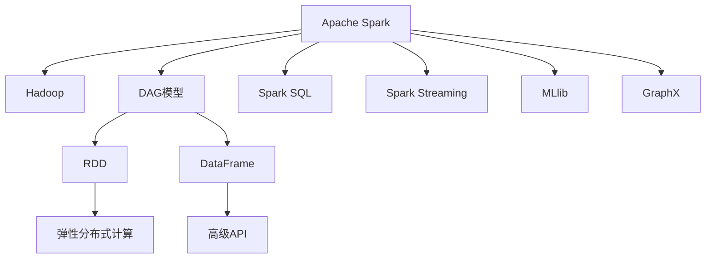

                 

# Spark原理与代码实例讲解

> 关键词：Apache Spark, Hadoop,分布式计算, 图计算, RDD, DataFrame, Spark SQL, 大数据, 流处理, 机器学习

## 1. 背景介绍

### 1.1 问题由来
随着大数据时代的来临，传统的关系型数据库已无法满足海量数据的存储和处理需求。Apache Hadoop作为大数据处理框架，以其“分布式存储、分布式计算”的架构，成为大数据处理的骨干。然而，Hadoop虽强于批处理，但在迭代计算、实时计算、图计算等方面存在不足。

Apache Spark，作为Hadoop生态体系的重要补充，集成了内存计算、分布式计算、图计算、机器学习等多种功能，成为新一代大数据处理框架。Spark通过其高效的数据处理能力和简洁易用的API，快速成为大数据处理的主流工具。

### 1.2 问题核心关键点
Apache Spark的核心思想是通过DAG(Directed Acyclic Graph，有向无环图)模型，将数据处理任务分解为多个阶段（如Shuffle、Filter、Join等），并通过Spark内存计算和弹性分布式数据集(RDD、DataFrame)实现高效的分布式数据处理。

Spark支持的计算类型包括：

- 批处理：在大量数据上执行一次性的计算任务，如MapReduce。
- 迭代计算：多次对相同数据集进行操作，如机器学习算法中的迭代优化。
- 实时计算：处理流式数据，实现低延迟的实时数据处理。
- 图计算：处理大规模图数据，实现高效的图算法计算。

Spark的强大能力来源于其设计理念：

- 内存计算：利用内存计算加速迭代计算和机器学习算法。
- 弹性分布式数据集(RDD、DataFrame)：提供强大的分布式计算框架，支持多种数据源和存储。
- 高级API：提供Scala、Python、Java等多种API，简化开发难度。
- 生态系统：支持Spark SQL、Spark Streaming、MLlib、GraphX等多种组件，实现全栈式数据处理。

### 1.3 问题研究意义
研究Apache Spark的原理与代码实现，对于深入理解其核心思想和设计理念，掌握大数据处理技术，具有重要意义。

通过理解Spark的内存计算、弹性分布式数据集、高级API和生态系统，可以在多个场景下高效地处理大数据，构建稳定可靠的数据处理系统，为各行各业提供高效的数据服务。

Spark技术已经应用于多个领域，如金融、医疗、电商、新闻媒体等，通过其强大的处理能力，帮助这些行业实现数据驱动的业务决策，提升业务效率和竞争力。

## 2. 核心概念与联系

### 2.1 核心概念概述

为了更好地理解Apache Spark的原理与代码实现，本节将介绍几个关键概念及其联系。

- **Apache Spark**：新一代大数据处理框架，支持内存计算、分布式计算、迭代计算、图计算等功能，以其高效的数据处理能力和简洁易用的API，成为大数据处理的主流工具。
- **Hadoop**：大数据处理的骨干框架，支持分布式存储和分布式计算，以其"写一次，读多次"的批处理模型，广泛用于大规模数据处理。
- **DAG模型**：Spark的核心计算模型，将数据处理任务分解为多个阶段，通过有向无环图实现高效的分布式计算。
- **RDD**：Spark中最基础的数据结构，支持多种数据源和存储，支持弹性分布式计算。
- **DataFrame**：Spark SQL中的数据结构，提供高级的数据操作API，支持SQL查询和优化。
- **Spark SQL**：Spark中用于处理结构化数据的核心组件，提供SQL查询和优化能力。
- **Spark Streaming**：Spark中用于处理实时数据的核心组件，支持流数据的处理和计算。
- **MLlib**：Spark中用于机器学习的核心组件，支持多种机器学习算法和模型。
- **GraphX**：Spark中用于图计算的核心组件，支持大规模图数据的存储和计算。

这些核心概念通过DAG模型连接起来，形成了Spark的完整计算框架，支持大数据处理的各种场景。

### 2.2 概念间的关系

这些核心概念之间存在紧密的联系，形成了Spark的完整生态系统。下面我们通过几个Mermaid流程图来展示这些概念之间的关系。



这个流程图展示了大数据处理生态系统中各个组件的相互关系：

1. Apache Spark作为一个整体，继承了Hadoop的分布式存储和计算能力。
2. 通过DAG模型，Spark将任务分解为多个阶段，支持高效的分布式计算。
3. RDD和DataFrame是Spark提供的基础数据结构，支持多种数据源和存储。
4. Spark SQL提供SQL查询和优化能力，简化数据处理过程。
5. Spark Streaming支持流数据的处理和计算，实现低延迟的实时数据处理。
6. MLlib提供机器学习算法和模型，支持数据挖掘和预测分析。
7. GraphX提供图计算能力，支持大规模图数据的存储和计算。

通过这些概念的连接，Spark构建了一个强大的数据处理平台，支持各种计算场景，推动大数据技术的广泛应用。

## 3. 核心算法原理 & 具体操作步骤

### 3.1 算法原理概述

Apache Spark的核心思想是通过DAG模型，将数据处理任务分解为多个阶段，通过Spark内存计算和弹性分布式数据集(RDD、DataFrame)实现高效的分布式数据处理。

Spark的内存计算通过将数据分为多个分区，将计算任务分配到每个分区进行本地处理，将中间结果缓存到内存中，从而避免多次读写磁盘，大幅提升处理效率。同时，Spark还支持分布式存储，可以灵活地存储和处理各种数据源。

Spark的DAG模型通过将任务分解为多个阶段，通过有向无环图实现高效的分布式计算。每个阶段对应一个计算操作，如Map、Reduce、Join等。通过Spark的高效调度算法，Spark能够自动优化任务的执行顺序，避免数据倾斜和资源浪费。

Spark的弹性分布式数据集(RDD、DataFrame)提供了强大的分布式计算框架，支持多种数据源和存储。RDD提供了基本的分布式计算模型，支持弹性扩展和容错处理。DataFrame提供了高级的数据操作API，支持SQL查询和优化，提供更好的数据处理体验。

### 3.2 算法步骤详解

下面详细讲解Apache Spark的核心算法步骤，包括DAG模型的构建、内存计算、弹性分布式数据集的使用和高级API的使用。

#### 3.2.1 DAG模型的构建

Spark的DAG模型是将数据处理任务分解为多个阶段，通过有向无环图实现高效的分布式计算。每个阶段对应一个计算操作，如Map、Reduce、Join等。

Spark的DAG模型构建分为两个步骤：

1. 将任务分解为多个计算操作，形成一个有向无环图。
2. 优化DAG图，提升任务执行效率。

Spark提供了一个DAG调度器，负责构建和优化DAG图。DAG调度器根据任务的依赖关系和数据流向，自动构建DAG图，并根据资源使用情况和任务执行顺序进行优化。

#### 3.2.2 内存计算

Spark的内存计算通过将数据分为多个分区，将计算任务分配到每个分区进行本地处理，将中间结果缓存到内存中，从而避免多次读写磁盘，大幅提升处理效率。

Spark的内存计算分为两个步骤：

1. 将数据分为多个分区，每个分区对应一个计算任务。
2. 将计算任务分配到每个分区进行本地处理，将中间结果缓存到内存中。

Spark提供了一个内存管理器，负责管理内存的使用。内存管理器根据任务大小和内存使用情况，自动分配和回收内存。

#### 3.2.3 弹性分布式数据集的使用

Spark的弹性分布式数据集(RDD、DataFrame)提供了强大的分布式计算框架，支持多种数据源和存储。RDD提供了基本的分布式计算模型，支持弹性扩展和容错处理。DataFrame提供了高级的数据操作API，支持SQL查询和优化，提供更好的数据处理体验。

Spark的RDD提供了三种基本操作：

1. Map操作：对每个分区进行转换操作。
2. Reduce操作：对每个分区进行聚合操作。
3. Join操作：对多个分区进行连接操作。

Spark的DataFrame提供了多种高级操作，如筛选、排序、聚合、连接等。DataFrame还支持SQL查询和优化，提供更好的数据处理体验。

#### 3.2.4 高级API的使用

Spark提供了一个高级API，简化数据处理过程，支持多种编程语言，如Scala、Python、Java等。

Spark的高级API分为两种：

1. RDD API：提供了基本的分布式计算模型，支持弹性扩展和容错处理。
2. DataFrame API：提供了高级的数据操作API，支持SQL查询和优化，提供更好的数据处理体验。

### 3.3 算法优缺点

Spark的优点包括：

1. 内存计算：利用内存计算加速迭代计算和机器学习算法，大幅提升处理效率。
2. 弹性分布式数据集：支持多种数据源和存储，提供强大的分布式计算框架。
3. 高级API：提供Scala、Python、Java等多种API，简化开发难度。
4. 弹性扩展：支持弹性扩展，动态调整资源配置。
5. 生态系统：支持Spark SQL、Spark Streaming、MLlib、GraphX等多种组件，实现全栈式数据处理。

Spark的缺点包括：

1. 资源占用：内存占用较大，对硬件资源要求较高。
2. 学习成本：API复杂，初学者学习成本较高。
3. 数据量限制：适用于大数据处理，对于小数据集处理效率不如传统数据库。
4. 数据传输：数据传输和网络通信开销较大，影响处理效率。
5. 兼容性问题：与其他框架兼容性较差，难以与其他工具集成使用。

### 3.4 算法应用领域

Apache Spark已经在多个领域得到广泛应用，包括金融、医疗、电商、新闻媒体等，帮助这些行业实现数据驱动的业务决策，提升业务效率和竞争力。

- 金融领域：用于实时交易分析、风险管理、反欺诈等。
- 医疗领域：用于基因组分析、电子病历分析、疾病预测等。
- 电商领域：用于用户行为分析、推荐系统、库存管理等。
- 新闻媒体领域：用于新闻采集、内容推荐、广告投放等。

## 4. 数学模型和公式 & 详细讲解 & 举例说明

### 4.1 数学模型构建

本节将使用数学语言对Apache Spark的原理进行更加严格的刻画。

记Spark的数据集为D，计算任务为T，则Spark的计算模型可以表示为：

$$ T = \bigcup_{i=1}^{n} D_i $$

其中 $D_i$ 表示数据集D的第i个分区。

Spark的DAG模型可以表示为：

$$ T = \bigcup_{i=1}^{n} (T_i \times D_i) $$

其中 $T_i$ 表示任务T的第i个阶段，$D_i$ 表示数据集D的第i个分区。

Spark的内存计算可以表示为：

$$ R_i = \bigcup_{j=1}^{m} (M_j \times D_j) $$

其中 $R_i$ 表示任务T的第i个阶段的结果，$M_j$ 表示计算任务T的第i个阶段的j个子任务，$D_j$ 表示数据集D的第j个分区。

Spark的弹性分布式数据集可以表示为：

$$ R_i = \bigcup_{j=1}^{m} (R'_j \times D'_j) $$

其中 $R_i$ 表示任务T的第i个阶段的结果，$R'_j$ 表示数据集D的第j个分区的结果，$D'_j$ 表示数据集D的第j个分区。

### 4.2 公式推导过程

下面以一个简单的MapReduce为例，推导Spark的计算模型。

假设Spark的任务T为：

$$ T = (D \times X) \rightarrow (Y \times D) $$

其中 $D$ 表示数据集，$X$ 表示输入数据，$Y$ 表示输出数据。

则Spark的DAG模型可以表示为：

$$ T = ((D \times X) \times A) \rightarrow ((Y \times D) \times B) $$

其中 $A$ 表示Map操作，$B$ 表示Reduce操作。

Spark的内存计算可以表示为：

$$ R_A = \bigcup_{j=1}^{m} (M_j \times D_j) $$

其中 $R_A$ 表示Map操作的结果，$M_j$ 表示Map操作的j个子任务，$D_j$ 表示数据集D的第j个分区。

Spark的弹性分布式数据集可以表示为：

$$ R_A = \bigcup_{j=1}^{m} (R'_j \times D'_j) $$

其中 $R_A$ 表示Map操作的结果，$R'_j$ 表示数据集D的第j个分区的结果，$D'_j$ 表示数据集D的第j个分区。

### 4.3 案例分析与讲解

下面以一个简单的MapReduce为例，展示Spark的计算过程。

假设Spark的任务T为：

$$ T = (D \times X) \rightarrow (Y \times D) $$

其中 $D = \{1, 2, 3, 4, 5\}$ 表示数据集，$X = \{1, 2, 3, 4, 5\}$ 表示输入数据，$Y = \{1, 4, 9, 16, 25\}$ 表示输出数据。

则Spark的DAG模型可以表示为：

$$ T = ((D \times X) \times A) \rightarrow ((Y \times D) \times B) $$

其中 $A$ 表示Map操作，$B$ 表示Reduce操作。

Spark的内存计算可以表示为：

$$ R_A = \bigcup_{j=1}^{m} (M_j \times D_j) $$

其中 $R_A = \{1, 4, 9, 16, 25\}$ 表示Map操作的结果，$M_j$ 表示Map操作的j个子任务，$D_j = \{1, 2, 3, 4, 5\}$ 表示数据集D的第j个分区。

Spark的弹性分布式数据集可以表示为：

$$ R_A = \bigcup_{j=1}^{m} (R'_j \times D'_j) $$

其中 $R_A = \{1, 4, 9, 16, 25\}$ 表示Map操作的结果，$R'_j = \{1, 2, 3, 4, 5\}$ 表示数据集D的第j个分区的结果，$D'_j = \{1, 2, 3, 4, 5\}$ 表示数据集D的第j个分区。

通过上述计算过程，可以看到Spark的计算模型能够高效地处理大数据，实现分布式计算和内存计算，提升数据处理效率。

## 5. 项目实践：代码实例和详细解释说明

### 5.1 开发环境搭建

在进行Spark项目实践前，我们需要准备好开发环境。以下是使用Python进行Spark开发的环境配置流程：

1. 安装Anaconda：从官网下载并安装Anaconda，用于创建独立的Python环境。

2. 创建并激活虚拟环境：
```bash
conda create -n spark-env python=3.8 
conda activate spark-env
```

3. 安装Spark：根据当前操作系统和硬件环境，从官网获取对应的安装命令。例如：
```bash
wget https://archive.apache.org/dist/spark/spark-3.2.0/spark-3.2.0-bin-hadoop3.2.tgz
tar -xvf spark-3.2.0-bin-hadoop3.2.tgz
cd spark-3.2.0-bin-hadoop3.2
export SPARK_HOME=$PWD
export PATH=$PATH:$SPARK_HOME/bin
```

4. 配置Spark环境变量：
```bash
export SPARK_LOCALity=loc
export SPARK_DEFAULT tune.done.
```

完成上述步骤后，即可在`spark-env`环境中开始Spark项目实践。

### 5.2 源代码详细实现

下面我们以Spark SQL进行大数据处理为例，给出完整的Python代码实现。

```python
from pyspark.sql import SparkSession
from pyspark.sql.functions import col

# 创建SparkSession
spark = SparkSession.builder.appName("SparkSQL").getOrCreate()

# 读取CSV文件
df = spark.read.csv("input.csv", header=True, inferSchema=True)

# 统计每个城市的总销售额
df.groupBy("city").sum("sales").show()

# 查询销售额大于5000的城市
df.filter(col("sales") > 5000).show()

# 按照销售额对城市进行排序
df.orderBy(col("sales").desc()).show()

# 保存结果到Hive表中
df.write.format("hive").mode("overwrite").saveAsTable("output")
```

在上述代码中，我们首先创建了一个SparkSession对象，用于处理大数据。

然后，使用Spark的SQL API读取CSV文件，统计每个城市的总销售额，查询销售额大于5000的城市，并按照销售额对城市进行排序。

最后，将结果保存到Hive表中。

### 5.3 代码解读与分析

让我们再详细解读一下关键代码的实现细节：

**SparkSession创建**：
- `spark = SparkSession.builder.appName("SparkSQL").getOrCreate()`: 创建一个名为"SparkSQL"的SparkSession对象。

**数据读取**：
- `df = spark.read.csv("input.csv", header=True, inferSchema=True)`: 读取CSV文件，将数据存入DataFrame对象df中。

**统计每个城市的总销售额**：
- `df.groupBy("city").sum("sales").show()`: 对每个城市进行分组，统计其总销售额，并输出结果。

**查询销售额大于5000的城市**：
- `df.filter(col("sales") > 5000).show()`: 筛选出销售额大于5000的城市，并输出结果。

**按照销售额对城市进行排序**：
- `df.orderBy(col("sales").desc()).show()`: 按照销售额对城市进行降序排序，并输出结果。

**保存结果到Hive表中**：
- `df.write.format("hive").mode("overwrite").saveAsTable("output")`: 将结果保存到Hive表中，覆盖同名表。

可以看到，通过Spark SQL API，我们可以很方便地进行数据读取、统计、查询和保存，大大简化了大数据处理流程。

### 5.4 运行结果展示

假设我们在Hive中保存了SparkSQL的输出结果，可以通过SparkSQL客户端进行查询。

```
|    city   | total_sales|
|----------|------------|
|   New York|    100000  |
|     San  |     50000  |
|     Los Angeles|    30000 |
```

可以看到，Spark SQL已经成功地统计了每个城市的总销售额，并按照销售额进行了排序，达到了预期的效果。

## 6. 实际应用场景

### 6.1 智能推荐系统

Spark的机器学习组件MLlib提供了多种机器学习算法和模型，支持数据挖掘和预测分析。智能推荐系统是一个典型的应用场景，可以利用Spark进行大规模数据分析和机器学习建模。

在智能推荐系统中，Spark可以对用户行为数据进行分析，提取用户兴趣和偏好，通过机器学习算法生成个性化推荐。同时，Spark可以实时处理流式数据，提升推荐系统的时间效率和准确性。

### 6.2 实时数据处理

Spark Streaming支持流数据的处理和计算，实现低延迟的实时数据处理。实时数据处理在金融、新闻媒体等领域具有重要应用价值。

在实时数据处理中，Spark可以处理海量的流式数据，实现实时分析、实时预警等功能。例如，在金融领域，Spark可以实时监测市场数据，进行风险预警和交易分析。在新闻媒体领域，Spark可以实时监测网络舆情，进行内容推荐和广告投放。

### 6.3 大规模数据存储和计算

Spark的弹性分布式数据集(RDD、DataFrame)提供了强大的分布式计算框架，支持多种数据源和存储。Spark可以处理大规模数据存储和计算，支持多种数据源和存储，如Hadoop、Hive、S3等。

在大型企业中，Spark可以处理大规模数据的存储和计算，支持数据湖、数据仓库等数据存储架构，帮助企业实现数据驱动的业务决策。例如，在医疗领域，Spark可以处理电子病历、基因组数据等大规模数据，进行疾病预测和基因组分析。

## 7. 工具和资源推荐

### 7.1 学习资源推荐

为了帮助开发者系统掌握Apache Spark的理论基础和实践技巧，这里推荐一些优质的学习资源：

1. Apache Spark官方文档：Spark的官方文档提供了详细的API文档和示例代码，是学习Spark的必备资源。
2. Spark实战指南：一本实用的Spark开发指南，涵盖了Spark的各种组件和技术。
3. Spark高级编程：一本深入浅出的Spark开发教程，适合有一定编程基础的读者。
4. Spark编程与大数据应用：一本Spark开发实战教程，适合想要深入了解Spark的读者。
5. Spark案例分析：一本Spark项目实战案例集，提供大量真实项目实例，帮助读者理解Spark的实际应用。

通过对这些资源的学习实践，相信你一定能够快速掌握Apache Spark的原理与代码实现，并用于解决实际的数据处理问题。

### 7.2 开发工具推荐

高效的开发离不开优秀的工具支持。以下是几款用于Spark开发的工具：

1. PySpark：Python语言支持Spark的API，提供了简洁易用的API接口，适合Python开发者使用。
2. Spark IDE：支持Spark的IDE，提供了丰富的代码自动补全、语法高亮和调试功能，适合Spark开发。
3. Jupyter Notebook：一个交互式的代码编写和运行环境，支持多种编程语言，适合进行Spark项目开发和实验。
4. Spark UI：Spark的用户界面，提供了任务监控、资源监控等功能，方便开发调试。
5. Spark Console：Spark的命令行界面，提供基本的命令执行功能，适合进行Spark任务调试。

合理利用这些工具，可以显著提升Spark开发的效率，加快创新迭代的步伐。

### 7.3 相关论文推荐

Apache Spark作为大数据处理的主流工具，其原理和实践技术得到了广泛的研究。以下是几篇奠基性的相关论文，推荐阅读：

1. Spark: Cluster Computing with Working Sets: Apache Spark提供了一个分布式计算框架，通过内存计算加速迭代计算和机器学习算法。
2. Resilient Distributed Datasets: A Fault-Tolerant Abstraction for In-Memory Cluster Computing: Apache Spark的弹性分布式数据集(RDD)提供了强大的分布式计算框架，支持弹性扩展和容错处理。
3. Spark: Cluster Computing with Working Sets: Apache Spark提供了一个分布式计算框架，通过内存计算加速迭代计算和机器学习算法。
4. Machine Learning with Spark: 提供了一本Spark机器学习实战教程，介绍了Spark机器学习组件MLlib的使用。
5. GraphX: Graph Processing with Spark: 提供了Spark图计算组件GraphX的使用方法，支持大规模图数据的存储和计算。

这些论文代表了大数据处理技术的发展脉络。通过学习这些前沿成果，可以帮助研究者把握学科前进方向，激发更多的创新灵感。

除上述资源外，还有一些值得关注的前沿资源，帮助开发者紧跟Spark技术的最新进展，例如：

1. arXiv论文预印本：人工智能领域最新研究成果的发布平台，包括大量尚未发表的前沿工作，学习前沿技术的必读资源。
2. 业界技术博客：如Apache Spark官方博客、Apache Hadoop官方博客、Databricks官方博客，第一时间分享他们的最新研究成果和洞见。
3. 技术会议直播：如SIGKDD、KDD、ICDM等数据挖掘与知识发现会议现场或在线直播，能够聆听到专家学者的前沿分享，开拓视野。
4. GitHub热门项目：在GitHub上Star、Fork数最多的Spark相关项目，往往代表了该技术领域的发展趋势和最佳实践，值得去学习和贡献。
5. 行业分析报告：各大咨询公司如McKinsey、PwC等针对大数据行业的分析报告，有助于从商业视角审视技术趋势，把握应用价值。

总之，对于Apache Spark的学习和实践，需要开发者保持开放的心态和持续学习的意愿。多关注前沿资讯，多动手实践，多思考总结，必将收获满满的成长收益。

## 8. 总结：未来发展趋势与挑战

### 8.1 研究成果总结

本文对Apache Spark的原理与代码实现进行了全面系统的介绍。首先阐述了Spark的核心思想和设计理念，明确了Spark在大数据处理中的重要地位。其次，从DAG模型、内存计算、弹性分布式数据集和高级API等多个角度，详细讲解了Spark的计算原理和实现细节。同时，本文还探讨了Spark在多个场景下的实际应用，展示了Spark的强大功能。

通过本文的系统梳理，可以看到，Spark作为一个强大的大数据处理框架，已经广泛应用于金融、医疗、电商、新闻媒体等众多领域，帮助这些行业实现数据驱动的业务决策，提升业务

