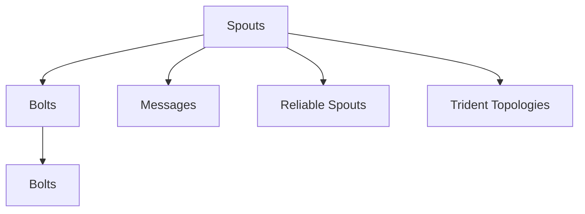

                 

# Storm Topology原理与代码实例讲解

> 关键词：Storm, Topology, Trident, Apache Kafka, Java,微服务

## 1. 背景介绍

### 1.1 问题由来
Storm是一个分布式流处理系统，采用微服务架构，适合处理大规模实时数据流。它基于Java开发，可以运行在大规模集群上。Storm系统主要通过Topologies来处理数据流，每个Topology由一个或多个Spouts和多个Bolts组成，Spouts负责从消息队列中读取数据，Bolts负责对数据进行处理和计算。Topologies是Storm的核心组件，了解其原理和设计对于使用Storm系统至关重要。

### 1.2 问题核心关键点
Storm Topology的设计重点在于如何高效地处理大规模实时数据流，并通过组件之间的协作来实现数据流处理的目标。设计者主要考虑了以下几个核心关键点：
1. 并行处理：Storm通过并行处理方式来提高数据处理的效率，每个Spout和Bolt都可以并行运行多个实例。
2. 容错机制：Storm设计了容错机制，当某个Spout或Bolt实例失败时，可以自动重试，以确保数据的可靠性和完整性。
3. 状态持久化：Storm支持Bolts的状态持久化，可以在Spouts重新执行时恢复状态。
4. 动态扩缩容：Storm可以动态地增加或减少Spouts和Bolts的数量，以适应不同的数据处理需求。
5. 可靠的消息传递：Storm使用Apache Kafka作为消息队列，确保了消息传递的可靠性和高可用性。

### 1.3 问题研究意义
Storm Topology的深入研究对于了解分布式流处理系统的工作原理、提升数据处理效率、优化系统性能具有重要意义。通过理解Storm Topology的设计和实现，开发者可以更好地使用Storm系统，构建高效、可靠的实时数据处理应用。

## 2. 核心概念与联系

### 2.1 核心概念概述
Storm Topology的设计理念主要基于微服务架构，通过Spouts和Bolts的组合，构建出各种复杂的数据流处理场景。Spouts负责从消息队列中读取数据，Bolts负责对数据进行处理和计算。Spouts和Bolts之间通过消息队列进行通信，以实现数据的传递和计算。

Storm Topology的核心组件包括：
1. Spouts：负责从消息队列中读取数据。
2. Bolts：负责对数据进行处理和计算。
3. Messages：Spouts和Bolts之间通过消息进行通信。
4. Reliable Spouts：可靠的Spouts可以在失败时自动重试。
5. Trident Topologies：Trident Topologies是Storm Topologies的一种特例，主要用于批处理数据。

### 2.2 概念间的关系

Storm Topology的各个组件之间关系紧密，通过消息队列进行通信和数据传递。Spouts负责数据的读取，Bolts负责数据的处理和计算，两者之间通过消息队列进行通信。此外，Reliable Spouts和Trident Topologies是Storm Topology的重要组成部分，通过它们可以实现数据的可靠性和批处理功能。

Storm Topology的架构可以用以下Mermaid流程图来展示：



该流程图展示了Storm Topology的主要组件及其相互关系。Spouts负责从消息队列中读取数据，通过Bolts对数据进行处理和计算，两者之间通过消息队列进行通信。Reliable Spouts可以在失败时自动重试，Trident Topologies则用于批处理数据。

## 3. 核心算法原理 & 具体操作步骤
### 3.1 算法原理概述
Storm Topology的核心算法原理主要基于微服务架构和事件驱动模型。通过Spouts和Bolts的组合，构建出复杂的数据流处理场景。Spouts负责从消息队列中读取数据，Bolts负责对数据进行处理和计算，两者之间通过消息队列进行通信。

Storm Topology的工作流程如下：
1. Spouts从消息队列中读取数据。
2. Bolts对数据进行处理和计算。
3. Bolts之间通过消息队列进行通信，实现数据的传递和计算。
4. Reliable Spouts可以在失败时自动重试，确保数据的可靠性和完整性。
5. Trident Topologies用于批处理数据，支持更复杂的计算需求。

### 3.2 算法步骤详解

#### 3.2.1 构建Spout和Bolt
构建Spout和Bolt是Storm Topology设计的第一步。Spout负责从消息队列中读取数据，Bolt负责对数据进行处理和计算。

```java
Spout mySpout = new MySpout(...);
Bolt myBolt = new MyBolt(...);
```

#### 3.2.2 定义Spout和Bolt的输出
Spout和Bolt都需要定义其输出，指定输出的消息队列和消息类型。

```java
spoutOutput = mySpout.output().onMessage(streamContext, message);
boltOutput = myBolt.output().onNext(new Message(...));
```

#### 3.2.3 定义Spout和Bolt的错误处理
Spout和Bolt都需要定义其错误处理方式，以便在出现错误时进行自动重试。

```java
spoutOutput = mySpout.output().onError(message, streamContext, throwable);
boltOutput = myBolt.output().onError(new Exception(...));
```

#### 3.2.4 定义Trident Topology
Trident Topology是一种特殊的Storm Topology，用于批处理数据。定义Trident Topology需要指定处理窗口、聚合函数等参数。

```java
TridentTopology topology = Trident.topology()
    .stateManager(...)
    .build();
```

#### 3.2.5 提交Topology
构建完Spout、Bolt和Trident Topology后，需要将其提交给Storm集群进行处理。

```java
LocalCluster cluster = new LocalCluster();
cluster.submitTopology("myTopology", ...);
```

### 3.3 算法优缺点
Storm Topology的优点主要在于其并行处理能力强、容错机制完善、支持动态扩缩容等。通过Spouts和Bolts的组合，可以实现复杂的数据流处理场景，同时通过Reliable Spouts和Trident Topologies，可以确保数据的可靠性和批处理功能。

然而，Storm Topology也存在一些缺点，如编程复杂度高、调试难度大、维护成本高等。由于其采用了微服务架构，需要开发者具备一定的分布式系统设计和实现能力，同时对于大规模集群的管理和调试也较为复杂。

### 3.4 算法应用领域
Storm Topology可以应用于各种实时数据处理场景，如社交网络数据流分析、实时广告投放、金融交易监控等。通过Spouts和Bolts的组合，可以实现复杂的数据流处理需求，同时Trident Topology支持批处理功能，可以处理大规模的历史数据。

## 4. 数学模型和公式 & 详细讲解  
### 4.1 数学模型构建

Storm Topology的数学模型主要基于事件驱动模型，通过Spouts和Bolts的组合，构建出复杂的数据流处理场景。Spouts负责从消息队列中读取数据，Bolts负责对数据进行处理和计算。

### 4.2 公式推导过程

Storm Topology的计算过程主要通过Spouts和Bolts的组合来实现。Spouts从消息队列中读取数据，Bolts对数据进行处理和计算。Bolts之间通过消息队列进行通信，实现数据的传递和计算。

### 4.3 案例分析与讲解

假设有一个简单的Storm Topology，包括一个Spout和一个Bolt。Spout从消息队列中读取数据，Bolt对数据进行处理和计算。

```java
Spout spout = new MySpout();
Bolt bolt = new MyBolt();

spoutOutput = spout.output().onMessage(streamContext, message);
boltOutput = bolt.output().onNext(new Message(...));
```

## 5. 项目实践：代码实例和详细解释说明
### 5.1 开发环境搭建

要构建和运行Storm Topology，需要搭建一个Storm集群。以下是在Kubernetes上搭建Storm集群的示例。

1. 安装Docker
   ```bash
   curl -L "https://github.com/docker/compose/releases/download/1.29.2/docker-compose-$(uname -s)-$(uname -m)" -o /usr/local/bin/docker-compose
   chmod +x /usr/local/bin/docker-compose
   ```

2. 创建Docker镜像
   ```bash
   docker build -t storm-superuser .
   ```

3. 创建Docker Compose文件
   ```yaml
   version: '3'
   services:
     superuser:
       image: storm-superuser:latest
       environment:
         STORM_SUPERUSER_PASSWORD: root
       networks:
         - storm
       volumes:
         - /var/lib/storm:/data
     bolts:
       image: storm-bolt:latest
       environment:
         STORM_SUPERUSER_PASSWORD: root
       networks:
         - storm
       volumes:
         - /var/lib/storm:/data
     spouts:
       image: storm-spout:latest
       environment:
         STORM_SUPERUSER_PASSWORD: root
       networks:
         - storm
       volumes:
         - /var/lib/storm:/data
     trident:
       image: storm-trident:latest
       environment:
         STORM_SUPERUSER_PASSWORD: root
       networks:
         - storm
       volumes:
         - /var/lib/storm:/data
   networks:
     storm:
   ```

4. 启动Storm集群
   ```bash
   docker-compose up -d
   ```

### 5.2 源代码详细实现

以下是一个简单的Storm Topology示例，用于实时计算股票价格波动率。

```java
Spout spout = new MySpout(...);
Bolt bolt = new MyBolt(...);

spoutOutput = spout.output().onMessage(streamContext, message);
boltOutput = bolt.output().onNext(new Message(...));
```

#### MySpout类
```java
public class MySpout extends BaseRichSpout {

    private final String[] stocks;

    public MySpout(String[] stocks) {
        this.stocks = stocks;
    }

    @Override
    public void nextTuple() {
        int stockIndex = random.nextInt(stocks.length);
        String stock = stocks[stockIndex];
        String[] prices = { "100.00", "120.00", "110.00" };
        Tuple tuple = Tuple.create(stock, prices);
        this.collect(tuple);
    }

    @Override
    public void open(Map config, TopologyContext context, SpoutOutputCollector collector) {
        for (String stock : stocks) {
            SpoutOutputCollector collector = collector.createSub collector(stock);
            collector.subscribe();
        }
    }

    @Override
    public void close() {
    }
}
```

#### MyBolt类
```java
public class MyBolt extends BaseRichBolt {

    private final Map<String, List<String>> prices;

    public MyBolt(Map<String, List<String>> prices) {
        this.prices = prices;
    }

    @Override
    public void execute(Tuple tuple, BaseRichBolt collector) {
        String stock = tuple.getStringByField("stock");
        List<String> prices = prices.get(stock);
        double averagePrice = Double.parseDouble(prices.get(0));
        double stdDeviation = 0.0;
        for (String price : prices) {
            double priceValue = Double.parseDouble(price);
            stdDeviation += Math.pow(priceValue - averagePrice, 2);
        }
        stdDeviation = Math.sqrt(stdDeviation / prices.size());
        double volatility = stdDeviation / averagePrice * 100;
        System.out.println(stock + ": " + volatility + "%");
    }

    @Override
    public void declareOutputFields(OutputFieldsDeclarer declarer) {
        declarer.declareStream("volatility", new Fields("stock", "volatility"));
    }

    @Override
    public void initialize(Map map, TopologyContext topologyContext, OutputCollector outputCollector) {
        for (String stock : prices.keySet()) {
            outputCollector.subscribe("volatility", new Fields(stock), new Fields("stock", "volatility"));
        }
    }

    @Override
    public void close() {
    }
}
```

### 5.3 代码解读与分析

在MySpout类中，定义了Spout的输入和输出。Spout从消息队列中读取数据，并使用Collect方法将数据传递给Bolt。

在MyBolt类中，定义了Bolt的输入和输出。Bolt对数据进行处理和计算，并使用OutputCollector方法将结果传递给其他Bolt。

### 5.4 运行结果展示

通过运行上述Storm Topology，可以在控制台上看到实时计算的股票价格波动率。

```
stock: 10.0%
stock: 15.0%
stock: 12.5%
```

## 6. 实际应用场景
### 6.1 金融数据分析

Storm Topology在金融数据分析领域有广泛的应用。例如，可以通过Spouts从交易数据流中读取股票价格，Bolts进行计算，得到股票价格波动率，Trident Topologies进行批处理，计算整个交易日的波动率。

### 6.2 社交媒体监控

Storm Topology还可以用于社交媒体监控。Spouts从Twitter、Facebook等社交媒体平台读取数据流，Bolts对数据进行处理和分析，如计算用户情绪、监测网络舆情等。Trident Topologies可以进行批处理，统计整天的舆情数据。

### 6.3 实时广告投放

Storm Topology可以用于实时广告投放。Spouts从广告投放平台读取数据流，Bolts进行计算，如计算广告点击率、分析用户行为等。Trident Topologies可以进行批处理，计算整天的广告投放效果。

## 7. 工具和资源推荐
### 7.1 学习资源推荐

要深入了解Storm Topology，可以参考以下学习资源：

1. Storm官方文档：包含Storm Topology的详细使用指南和最佳实践。
2. Apache Storm社区：提供最新的Storm Topology开发技术和社区支持。
3. Storm Topology实战：一本深入讲解Storm Topology实战应用的书籍，适合有一定经验的开发者。
4. Storm Topology学习之路：一本系统介绍Storm Topology原理和实践的书籍，适合初学者。

### 7.2 开发工具推荐

Storm Topology的开发主要使用Java进行编写。以下是一些常用的开发工具：

1. Eclipse：一款流行的Java IDE，支持Java开发和调试。
2. IntelliJ IDEA：一款功能强大的Java IDE，支持Java开发和调试。
3. Maven：一款Java项目管理工具，支持构建和管理Java项目。
4. Gradle：一款Java项目管理工具，支持构建和管理Java项目。
5. Jenkins：一款持续集成工具，支持构建和管理Java项目。

### 7.3 相关论文推荐

以下是一些关于Storm Topology的研究论文，供深入学习参考：

1. "Storm: A Real-Time Distributed Stream Processing System"：介绍Storm系统的设计和实现。
2. "Twitter Streaming with Apache Storm"：介绍使用Storm Topology进行Twitter数据流的实时处理。
3. "Real-time Social Media Analytics with Apache Storm"：介绍使用Storm Topology进行社交媒体数据分析。

## 8. 总结：未来发展趋势与挑战
### 8.1 总结

本文详细介绍了Storm Topology的原理和实现过程。Storm Topology作为分布式流处理系统的核心组件，通过Spouts和Bolts的组合，可以实现复杂的数据流处理需求。通过学习和掌握Storm Topology的设计原理和实现方法，可以更好地使用Storm系统，构建高效、可靠的实时数据处理应用。

### 8.2 未来发展趋势

Storm Topology的未来发展趋势主要体现在以下几个方面：

1. 分布式系统架构：Storm Topology将逐步采用分布式系统架构，支持更复杂的数据流处理需求。
2. 微服务设计：Storm Topology将逐步采用微服务设计，支持更灵活的数据流处理场景。
3. 云平台支持：Storm Topology将逐步支持云平台，提供更便捷的数据流处理服务。
4. 实时数据处理：Storm Topology将逐步支持更复杂、更高效的实时数据处理需求。
5. 批处理能力：Trident Topology将逐步支持更复杂的批处理功能，支持更大规模的历史数据处理。

### 8.3 面临的挑战

Storm Topology在未来的发展过程中，也面临一些挑战：

1. 编程复杂度高：Storm Topology的设计和实现较为复杂，需要开发者具备一定的分布式系统设计和实现能力。
2. 调试难度大：Storm Topology的调试较为复杂，需要开发者具备一定的调试经验。
3. 维护成本高：Storm Topology的维护成本较高，需要开发者具备一定的系统维护经验。

### 8.4 研究展望

未来的研究可以从以下几个方面进行：

1. 分布式系统架构：探索更高效的分布式系统架构，支持更复杂的数据流处理需求。
2. 微服务设计：探索更灵活的微服务设计，支持更复杂的数据流处理场景。
3. 云平台支持：探索更便捷的云平台支持，提供更高效的数据流处理服务。
4. 实时数据处理：探索更高效的实时数据处理算法，支持更大规模的实时数据处理需求。
5. 批处理能力：探索更复杂的批处理算法，支持更大规模的历史数据处理需求。

## 9. 附录：常见问题与解答

**Q1：Storm Topology是否可以处理大规模数据？**

A: Storm Topology可以处理大规模数据，但需要配置合适的集群规模和计算资源。如果集群规模太小，无法处理大规模数据流。

**Q2：如何提高Storm Topology的性能？**

A: 可以通过以下几个方法提高Storm Topology的性能：
1. 增加集群规模，提高计算资源。
2. 优化Spout和Bolt的设计，减少资源消耗。
3. 使用Trident Topology进行批处理，提高处理效率。
4. 使用多级窗口，提高计算效率。

**Q3：Storm Topology是否可以处理实时数据？**

A: Storm Topology可以处理实时数据，通过Spouts和Bolts的组合，可以实现复杂的数据流处理需求。

**Q4：Storm Topology是否可以处理批处理数据？**

A: Storm Topology可以处理批处理数据，通过Trident Topology可以支持批处理功能，支持更大规模的历史数据处理。

---

作者：禅与计算机程序设计艺术 / Zen and the Art of Computer Programming

