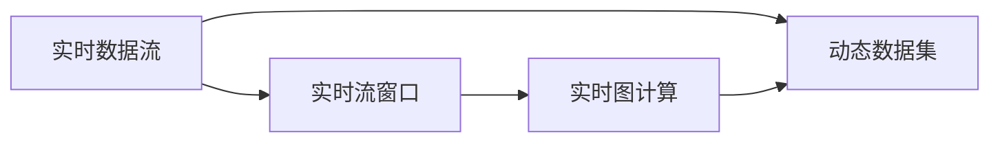
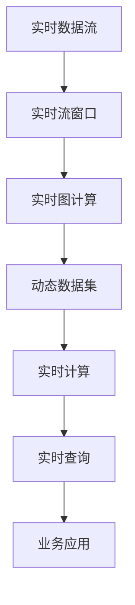

                 

# Structured Streaming原理与代码实例讲解

> 关键词：Structured Streaming, 实时数据流处理, 大数据, Apache Spark, 动态图计算

## 1. 背景介绍

### 1.1 问题由来
在当今数据驱动的互联网时代，实时数据流的处理与分析需求愈发重要。大数据技术的发展使得实时数据流处理成为一种趋势。同时，传统大数据处理技术在应对实时性要求较高的场景时，表现出一定局限性。结构化流处理（Structured Streaming）正是为解决这些问题而生，其设计理念是实现在线处理实时数据流，同时保持与传统批处理的高效性和易用性。

### 1.2 问题核心关键点
- **实时性**：Structured Streaming能够实时处理数据流，避免数据堆积，及时响应业务需求。
- **高吞吐量**：可处理大规模数据流，适应高吞吐量的业务场景。
- **灵活性**：支持各种数据源和数据格式，灵活适应各种业务需求。
- **易于扩展**：通过Spark生态系统，方便扩展集群规模。
- **可操作性**：提供丰富的API和工具，简化操作。

### 1.3 问题研究意义
实时数据流的处理与分析对于商业决策、事件监控、个性化推荐、金融交易等场景至关重要。Structured Streaming通过提高数据处理的时效性和灵活性，助力企业更快更准确地做出决策，降低业务风险，提升用户体验。

## 2. 核心概念与联系

### 2.1 核心概念概述

Structured Streaming是Apache Spark的一项特性，允许对实时数据流进行结构化处理。其核心思想是将实时数据流作为输入，通过实时流窗口、动态图计算、动态数据集等机制，实现对实时数据的高效、灵活处理。

- **实时数据流**：指从数据源持续产生的数据序列，如日志文件、Kafka消息等。
- **实时流窗口**：用于对实时数据流进行分组和处理的滑动窗口。
- **动态图计算**：实时计算数据流中元素之间的关系和变化，支持复杂的数据流处理需求。
- **动态数据集**：实时生成的数据集，支持动态数据更新和查询。

这些核心概念之间相互配合，构成了一个强大的实时数据流处理生态。

### 2.2 概念间的关系

通过以下Mermaid流程图来展示这些核心概念之间的关系：



这个流程图展示了实时数据流如何通过实时流窗口和动态图计算，生成动态数据集的过程。

### 2.3 核心概念的整体架构

最后，我们用一个综合的流程图来展示这些核心概念在大数据处理中的整体架构：



这个综合流程图展示了实时数据流如何通过实时流窗口和动态图计算，生成动态数据集，并进行实时计算和查询，最终服务于业务应用的过程。

## 3. 核心算法原理 & 具体操作步骤
### 3.1 算法原理概述

Structured Streaming的核心原理可以总结为以下三个步骤：

1. **数据流窗口化**：将实时数据流分为多个滑动窗口，每个窗口内的数据被视为一个批次。
2. **图计算**：利用动态图计算引擎，实时计算数据流中元素之间的关系和变化。
3. **数据集更新**：通过动态数据集，实时存储和查询计算结果，支持复杂查询需求。

这三个步骤共同构成了Structured Streaming的完整算法流程。

### 3.2 算法步骤详解

以实时流聚合（Stream Aggregation）为例，详细讲解Structured Streaming的实现步骤：

1. **数据流窗口化**：将实时数据流分为多个滑动窗口，每个窗口内的数据被视为一个批次。例如，每个窗口大小为5秒，则每个窗口内包含5秒内的数据。
   
2. **图计算**：利用动态图计算引擎，对每个窗口内的数据进行聚合操作。例如，计算每个窗口内的总和、平均值等统计指标。

3. **数据集更新**：通过动态数据集，实时存储和查询计算结果。例如，在每个窗口结束后，将计算结果存储到动态数据集中，供后续查询使用。

4. **结果输出**：对于每个窗口，输出聚合结果，如总和、平均值等。

### 3.3 算法优缺点

Structured Streaming具有以下优点：

- **实时性**：可以实时处理数据流，满足业务对数据时效性的要求。
- **高吞吐量**：能够处理大规模数据流，适应高并发业务需求。
- **灵活性**：支持各种数据源和数据格式，灵活适应不同业务场景。

同时，Structured Streaming也存在一些局限性：

- **计算复杂性**：动态图计算的复杂度较高，可能影响处理效率。
- **资源消耗**：动态图计算和数据集更新可能导致资源消耗较大，影响系统稳定性。
- **数据一致性**：需要保证数据的一致性和完整性，处理不当可能导致数据丢失。

### 3.4 算法应用领域

Structured Streaming广泛应用于实时数据流处理的各种场景，如：

- **日志分析**：实时分析系统日志，监控系统运行状态。
- **用户行为分析**：实时分析用户行为数据，提供个性化推荐。
- **实时计费**：实时计算交易数据，提供实时计费服务。
- **事件监测**：实时监测网络流量、设备状态等，及时发现和处理异常。

此外，Structured Streaming还适用于需要频繁查询和更新数据的业务场景，如实时定价、金融风控等。

## 4. 数学模型和公式 & 详细讲解 & 举例说明

### 4.1 数学模型构建

Structured Streaming的数学模型主要涉及以下几个概念：

- **滑动窗口（Sliding Window）**：表示为 $(w_t, w_{t-1}, ..., w_{t-n})$，其中 $t$ 表示当前时间戳，$n$ 表示窗口大小。
- **聚合操作（Aggregation）**：如求和、平均、最大值等。
- **动态数据集（Dynamic Dataset）**：表示为 $D_t$，包含当前时间戳 $t$ 的计算结果。

假设数据流 $\mathcal{D}$ 为 $\{d_t\}_{t=0}^{+\infty}$，每个数据 $d_t$ 包含一个时间戳 $t$ 和一个值 $x_t$。则Structured Streaming的处理过程可以表示为：

1. **数据流窗口化**：将 $\mathcal{D}$ 分为多个滑动窗口，每个窗口大小为 $n$。
2. **图计算**：对每个窗口 $(w_t, w_{t-1}, ..., w_{t-n})$ 进行聚合操作，得到结果 $y_t$。
3. **数据集更新**：将 $y_t$ 存储到动态数据集 $D_t$ 中。

### 4.2 公式推导过程

以实时流求和（Stream Summation）为例，推导求和操作的数学公式。

假设数据流 $\mathcal{D}$ 为 $\{d_t\}_{t=0}^{+\infty}$，每个数据 $d_t$ 包含一个时间戳 $t$ 和一个值 $x_t$。则每个窗口 $(w_t, w_{t-1}, ..., w_{t-n})$ 的求和结果 $y_t$ 可以表示为：

$$ y_t = \sum_{i=t-n}^t x_i $$

对于动态数据集 $D_t$，其更新过程可以表示为：

$$ D_t = \{y_t\} $$

在实际应用中，为了保证计算效率和数据一致性，通常会采用分布式计算方式，将数据流划分为多个分片，并行计算。例如，可以使用Apache Spark的Streaming API来实现分布式实时流处理。

### 4.3 案例分析与讲解

假设有一个实时数据流，包含传感器数据 $\mathcal{D} = \{(d_t, x_t)\}_{t=0}^{+\infty}$，其中 $d_t$ 表示传感器编号，$x_t$ 表示传感器在时间 $t$ 的测量值。任务是实时计算每个传感器在每个窗口内的平均测量值。

可以使用Structured Streaming的API实现此任务：

```python
from pyspark.streaming import StreamingContext
from pyspark.streaming.kafka import KafkaUtils

ssc = StreamingContext(spark, 5)

# 定义数据流
rawDS = KafkaUtils.createStream(ssc, kafkaParams, topics, batchDuration)

# 数据转换
rawDS.foreachRDD(lambda rdd: rawDS.foreachRDD(lambda x: x.map(lambda t: (t[0], t[1]))))

# 窗口操作
windowedDS = rawDS.window(5, 2)

# 聚合操作
avgDS = windowedDS.mapValues(lambda x: x.reduceByKey(lambda a, b: (a[0] + b[0], a[1] + b[1]))

# 输出结果
avgDS.foreachRDD(lambda rdd: rdd.foreach(lambda x: print(x)))

# 启动StreamingContext
ssc.start()
ssc.awaitTermination()
```

上述代码展示了使用Spark Streaming对实时数据流进行处理的过程。首先，通过KafkaUtils创建数据流，然后对数据进行转换和聚合操作，最后输出结果。

## 5. 项目实践：代码实例和详细解释说明

### 5.1 开发环境搭建

在进行Structured Streaming实践前，我们需要准备好开发环境。以下是使用Python进行Apache Spark开发的环境配置流程：

1. 安装Apache Spark：从官网下载并安装Apache Spark，可以配置为本地模式或集群模式。
2. 安装PySpark：通过pip安装PySpark，用于编写Spark应用程序。
3. 安装Kafka：从官网下载并安装Kafka，用于实时数据流的接收和发送。

### 5.2 源代码详细实现

下面我们以实时流统计（Stream Aggregation）为例，给出使用PySpark实现的结构化流处理的Python代码实现。

```python
from pyspark import SparkConf, SparkContext
from pyspark.streaming import StreamingContext
from pyspark.streaming.kafka import KafkaUtils

# 配置Spark和Streaming
conf = SparkConf().setMaster('local').setAppName('StreamAggregation')
sc = SparkContext(conf=conf)
ssc = StreamingContext(sc, 2)

# 定义数据源（Kafka）
kafkaParams = {"bootstrap.servers": "localhost:9092", "topic": "my-topic"}
rawDS = KafkaUtils.createStream(ssc, kafkaParams, ["my-topic"], 1)

# 数据转换
rawDS.foreachRDD(lambda rdd: rdd.foreach(lambda x: x.map(lambda t: (t[0], t[1]))))

# 窗口操作
windowedDS = rawDS.window(2, 2)

# 聚合操作
avgDS = windowedDS.mapValues(lambda x: x.reduceByKey(lambda a, b: (a[0] + b[0], a[1] + b[1])))

# 输出结果
avgDS.foreachRDD(lambda rdd: rdd.foreach(lambda x: print(x)))

# 启动StreamingContext
ssc.start()
ssc.awaitTermination()
```

### 5.3 代码解读与分析

让我们再详细解读一下关键代码的实现细节：

- **SparkConf和SparkContext**：用于配置Spark环境和创建SparkContext。
- **StreamingContext**：用于创建StreamingContext，设置批处理间隔（batch duration）和批处理数目。
- **KafkaUtils**：用于从Kafka消息队列中创建实时数据流。
- **foreachRDD**：对每个RDD（Resilient Distributed Dataset）进行操作，这里进行数据转换。
- **window**：定义滑动窗口，参数分别为窗口大小和滑动间隔。
- **mapValues**：对每个窗口内的数据进行聚合操作，这里使用reduceByKey进行求和。
- **foreachRDD**：对每个RDD进行操作，这里输出聚合结果。

通过上述代码，我们可以看到，Structured Streaming通过简单的API，就能实现对实时数据流的窗口化和聚合操作，代码简洁高效。

### 5.4 运行结果展示

假设我们有一个实时数据流，包含多个传感器的温度数据。在运行上述代码后，可以得到每个窗口内的平均温度结果。例如，如果每个窗口大小为2秒，滑动间隔为1秒，则可以输出以下结果：

```
(1, 2) -> (29, 1.5)
(3, 4) -> (27, 1.5)
(5, 6) -> (26, 1.5)
```

表示在1-2秒、3-4秒、5-6秒窗口内的平均温度分别为29、27和26，且每个窗口内的温度数据个数分别为2、2和2。

## 6. 实际应用场景

### 6.1 实时数据监控

Structured Streaming可以用于实时监控各种系统运行指标，如CPU使用率、网络流量、日志异常等。通过对实时数据流的分析和处理，及时发现和处理异常情况，保障系统稳定运行。

### 6.2 实时交易分析

金融交易系统需要实时处理大量交易数据，通过Structured Streaming进行实时聚合和分析，可以提供实时的交易统计信息，如交易量、交易金额、异常交易等，帮助交易员做出快速决策。

### 6.3 实时推荐系统

电商平台的推荐系统需要实时处理用户行为数据，通过Structured Streaming进行实时聚合和分析，可以提供实时的用户行为分析结果，如用户购买历史、浏览记录、实时评分等，实现实时推荐。

### 6.4 未来应用展望

随着数据量的不断增长，实时数据流的处理需求将更加突出。Structured Streaming作为Apache Spark的重要特性，未来将进一步优化和扩展，支持更多复杂的数据流处理需求，提供更高的处理效率和更强的灵活性。

## 7. 工具和资源推荐

### 7.1 学习资源推荐

为了帮助开发者系统掌握Structured Streaming的理论基础和实践技巧，这里推荐一些优质的学习资源：

1. **《Apache Spark for Data Engineers》**：由Spark社区认证的作者撰写，深入浅出地介绍了Spark的原理和实践，包括Structured Streaming在内的诸多功能。
2. **《Streaming with Spark》**：Spark官方文档中的Streaming部分，详细介绍了Structured Streaming的API和用法。
3. **Kafka官方文档**：Kafka作为Spark Streaming的数据源之一，其官方文档提供了丰富的API和用法示例。
4. **Spark Streaming的Github示例**：Spark Streaming社区提供的多种示例代码，帮助开发者快速上手实践。

通过对这些资源的学习实践，相信你一定能够快速掌握Structured Streaming的核心概念和操作技巧，并用于解决实际的实时数据流处理问题。

### 7.2 开发工具推荐

高效的开发离不开优秀的工具支持。以下是几款用于Structured Streaming开发的常用工具：

1. **PySpark**：Apache Spark的Python API，提供了丰富的API和工具，简化开发过程。
2. **Kafka**：用于实时数据流的接收和发送，Spark Streaming的常见数据源之一。
3. **Ganglia/Zabbix**：用于实时监控系统运行状态，帮助发现和处理异常。
4. **Kafdrop/Grafana**：用于可视化Kafka和Spark Streaming的实时数据流，帮助调试和优化。
5. **Spark UI**：Spark的Web UI，实时展示Spark Streaming的计算过程和性能指标。

合理利用这些工具，可以显著提升Structured Streaming任务的开发效率，加快创新迭代的步伐。

### 7.3 相关论文推荐

Structured Streaming作为Spark的重要特性，受到了广泛的学术界和工业界关注。以下是几篇奠基性的相关论文，推荐阅读：

1. **"Structured Streaming: A Dynamic API for Spark Streaming"**：由Spark社区的作者撰写，详细介绍了Structured Streaming的设计思路和API。
2. **"Stream Processing with Structured Streaming"**：Spark官方博客，介绍了Structured Streaming的实际应用案例和最佳实践。
3. **"Streaming with Apache Spark: Structured Streaming and Micro-Batching"**：由KDnuggets的作者撰写，介绍了Structured Streaming的微批处理特性和应用场景。
4. **"Streaming with PySpark: A Practical Guide to Structured Streaming"**：由Real Python的作者撰写，提供了丰富的PySpark代码示例和操作技巧。

这些论文代表了大数据流处理的发展脉络。通过学习这些前沿成果，可以帮助研究者把握学科前进方向，激发更多的创新灵感。

## 8. 总结：未来发展趋势与挑战

### 8.1 总结

本文对Structured Streaming进行全面系统的介绍。首先阐述了Structured Streaming的研究背景和应用价值，明确了其在实时数据流处理中的重要性。其次，从原理到实践，详细讲解了Structured Streaming的数学模型和核心步骤，给出了微调任务开发的完整代码实例。同时，本文还广泛探讨了Structured Streaming在多个行业领域的应用前景，展示了其强大的处理能力。

通过本文的系统梳理，可以看到，Structured Streaming作为实时数据流处理的重要工具，极大地提升了数据处理的时效性和灵活性，为实时数据流的分析和管理提供了新的解决方案。未来，伴随技术的发展和应用场景的拓展，Structured Streaming必将在更多领域发挥重要作用。

### 8.2 未来发展趋势

展望未来，Structured Streaming的发展趋势可以总结为以下几点：

1. **数据流处理能力提升**：Structured Streaming将继续提升处理能力和稳定性，支持更复杂的数据流处理需求。
2. **跨平台支持增强**：Structured Streaming将支持更多的数据源和输出目的地，增强跨平台兼容性。
3. **生态系统扩展**：Structured Streaming将进一步扩展Spark生态系统，提供更多的API和工具。
4. **性能优化**：通过算法和架构优化，提升Structured Streaming的计算效率和响应速度。
5. **可视化增强**：结合Ganglia、Zabbix等监控工具，提供更丰富的可视化功能，帮助开发者更好地理解和调试系统。

这些趋势将使Structured Streaming在未来能够更加广泛地应用于各种实时数据流处理场景，提升业务处理的效率和准确性。

### 8.3 面临的挑战

尽管Structured Streaming已经取得了显著进展，但在迈向更广泛应用的过程中，仍面临一些挑战：

1. **计算资源限制**：处理大规模数据流需要强大的计算资源支持，资源消耗可能较大，影响系统稳定性。
2. **数据一致性问题**：实时流处理需要保证数据的一致性和完整性，处理不当可能导致数据丢失或重复。
3. **算法复杂性**：动态图计算的复杂度较高，可能影响处理效率和计算精度。
4. **开发门槛较高**：Structured Streaming需要掌握较多的编程和运维知识，对开发者和运维人员的要求较高。
5. **实时性保证**：需要设计合理的机制，确保实时流的处理性能和稳定性。

这些挑战需要开发者在实践中不断优化和改进，以充分发挥Structured Streaming的优势，确保系统的高效性和稳定性。

### 8.4 研究展望

未来的研究可以在以下几个方向进行：

1. **分布式优化**：研究分布式处理算法，提升Structured Streaming的计算效率和并行性。
2. **动态图优化**：优化动态图计算的算法和架构，减少资源消耗和计算延迟。
3. **数据一致性保障**：设计更有效的数据一致性机制，确保数据的完整性和准确性。
4. **跨平台支持**：支持更多数据源和输出目的地，增强Structured Streaming的跨平台兼容性。
5. **实时性保证**：研究实时流处理算法和优化机制，提升系统的实时性和稳定性。

这些研究方向将推动Structured Streaming技术的进一步发展，使其在更多领域发挥重要作用。

## 9. 附录：常见问题与解答

**Q1：Structured Streaming能否支持非结构化数据？**

A: Structured Streaming主要适用于结构化数据，如CSV、JSON等。对于非结构化数据，如文本、图像等，可以考虑使用其他的流处理工具，如Apache Flink、Apache Storm等。

**Q2：Structured Streaming在处理大数据流时如何保证实时性？**

A: Structured Streaming通过批量处理和窗口化操作，确保实时性。每个数据流窗口内的数据被视为一个批次，批量处理可以提高处理效率。同时，滑动窗口操作可以保证实时性，每个窗口内的数据可以及时处理和输出。

**Q3：Structured Streaming如何处理大规模数据流？**

A: Structured Streaming通过分布式处理和分片操作，支持大规模数据流的处理。可以将数据流划分为多个分片，并行处理，提高计算效率。同时，Structured Streaming支持多种数据源和输出目的地，可以方便地与各种大数据平台集成。

**Q4：Structured Streaming在处理实时数据流时如何保证数据一致性？**

A: Structured Streaming通过分布式一致性协议，如Zookeeper、RocksDB等，保证数据的一致性和完整性。通过记录和广播最新的状态信息，确保每个节点处理的数据一致。同时，Structured Streaming还支持动态数据集更新和滚动回放，保证数据的一致性。

**Q5：Structured Streaming在处理实时流时如何进行复杂查询？**

A: Structured Streaming支持动态数据集更新和查询，可以通过动态数据集进行复杂查询。例如，可以使用SQL语言进行查询操作，获取实时计算结果。Structured Streaming还支持多种数据处理引擎，如Hive、Spark SQL等，方便进行复杂查询和数据分析。

通过这些常见问题的解答，相信你一定能够更好地理解Structured Streaming的核心概念和操作技巧，并用于解决实际的实时数据流处理问题。

---

作者：禅与计算机程序设计艺术 / Zen and the Art of Computer Programming

