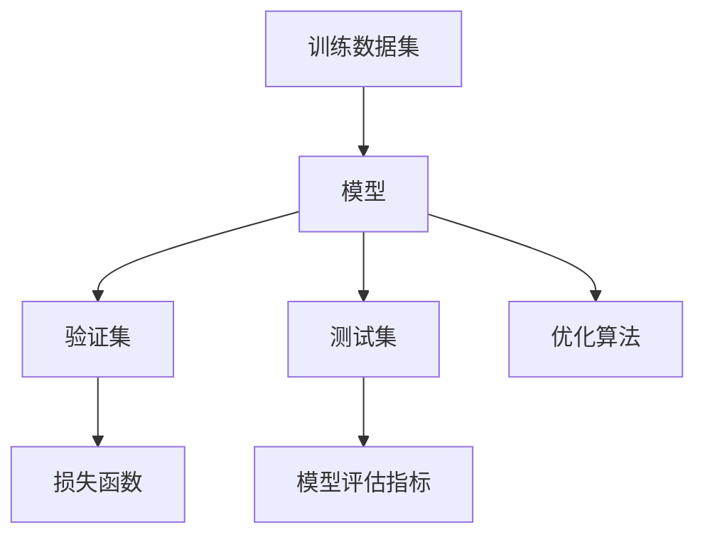
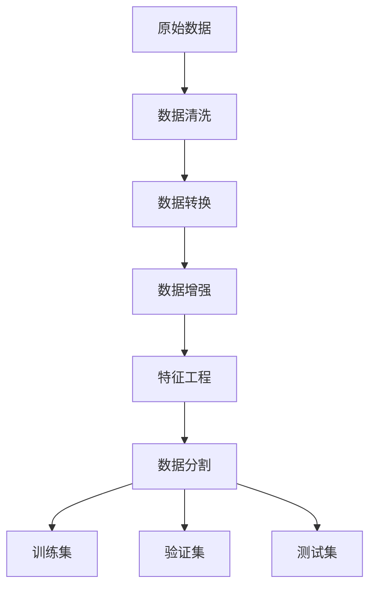
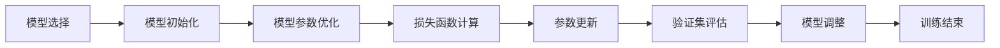
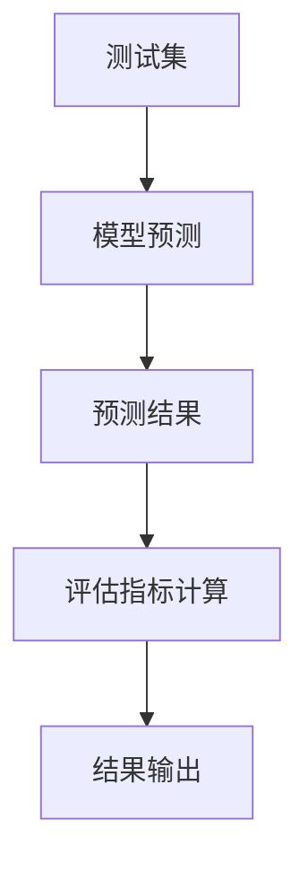
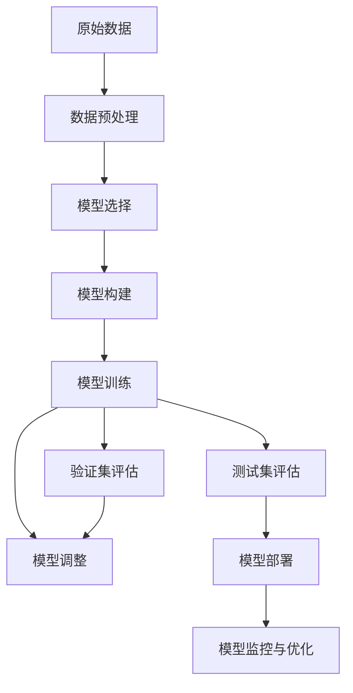

                 

# Supervised Learning原理与代码实例讲解

> 关键词：Supervised Learning, 监督学习, 数学模型, 训练算法, 代码实现, 实际应用

## 1. 背景介绍

### 1.1 问题由来
监督学习(Supervised Learning)是机器学习领域中最基础的范式之一，其核心思想是通过已标注的数据集来训练模型，使模型能够对未知数据进行预测。在监督学习中，每个样本都有一个已知的标签或输出值，模型通过学习这些标签，构建从输入到输出的映射关系，最终实现对未知样本的预测。

监督学习广泛应用于图像识别、自然语言处理、推荐系统、金融预测等诸多领域。其核心在于利用有限的标注数据，提升模型的泛化能力，对未来未见过的数据进行精准预测。

### 1.2 问题核心关键点
监督学习的基本流程包括数据预处理、模型构建、训练和评估。其核心在于构建一个能精确映射输入与输出之间的函数，即模型。训练过程中，模型通过不断调整参数，使得损失函数最小化，从而实现对数据的准确预测。

监督学习的核心在于：
- 选择合适的训练数据：标注数据的质量和数量直接影响模型的泛化能力。
- 构建合适的模型：选择合适的模型结构和参数，是提升模型预测能力的关键。
- 优化训练过程：通过合适的损失函数和优化算法，使得模型能够高效地进行参数更新。
- 评估模型效果：使用验证集和测试集来评估模型性能，防止过拟合。

监督学习的关键点在于如何高效利用标注数据，构建高效准确的模型，从而实现对未知数据的精准预测。

### 1.3 问题研究意义
监督学习作为机器学习中最基础的范式，其研究意义在于：
- 提供了一种高效的数据利用方式：通过标注数据，模型能够高效地学习和理解数据的规律。
- 推动了人工智能技术的普及和应用：监督学习技术使得机器能够理解复杂的数据，广泛应用于各种实际场景。
- 为其他机器学习范式奠定了基础：监督学习中的很多技术，如梯度下降、损失函数等，广泛应用于无监督学习和强化学习等高级技术中。

## 2. 核心概念与联系

### 2.1 核心概念概述

为更好地理解监督学习，本节将介绍几个密切相关的核心概念：

- 训练数据集：包含已标注输入和对应输出（即标签）的数据集。
- 验证集：用于在训练过程中评估模型性能的数据集，防止过拟合。
- 测试集：用于最终评估模型泛化能力的数据集。
- 损失函数：衡量模型预测输出与真实标签之间差异的函数。
- 优化算法：用于最小化损失函数的算法，如梯度下降、牛顿法等。
- 模型评估指标：用于评估模型预测准确性的指标，如精确率、召回率、F1分数等。

这些概念通过以下Mermaid流程图来展示它们之间的关系：



这个流程图展示了监督学习的基本流程：首先通过训练数据集对模型进行训练，利用验证集进行参数调整，最后使用测试集评估模型性能。优化算法通过不断更新模型参数，使得损失函数最小化，模型能够更好地预测数据。

### 2.2 概念间的关系

这些核心概念之间存在着紧密的联系，形成了监督学习的完整生态系统。下面我们通过几个Mermaid流程图来展示这些概念之间的关系。

#### 2.2.1 数据预处理流程



这个流程图展示了数据预处理的基本流程：从原始数据开始，经过数据清洗、数据转换、数据增强、特征工程等步骤，最终得到训练集、验证集和测试集。

#### 2.2.2 模型构建与训练流程



这个流程图展示了模型构建与训练的基本流程：首先选择合适的模型，并进行初始化。然后通过优化算法更新模型参数，计算损失函数，并根据验证集性能进行调整。最后，当模型在验证集上表现良好时，训练结束。

#### 2.2.3 模型评估流程



这个流程图展示了模型评估的基本流程：使用测试集对模型进行预测，计算评估指标，最终输出评估结果。

### 2.3 核心概念的整体架构

最后，我们用一个综合的流程图来展示监督学习的完整架构：



这个综合流程图展示了从数据预处理到模型部署的全过程。原始数据通过预处理得到训练集、验证集和测试集，选择合适的模型进行构建和训练，通过验证集评估和调整，最终在测试集上评估模型性能，并部署到实际应用中，进行持续的监控和优化。

## 3. 核心算法原理 & 具体操作步骤

### 3.1 算法原理概述

监督学习的核心在于构建一个能够精确映射输入与输出之间的函数，即模型。通过最小化损失函数，使得模型能够对未见过的数据进行准确的预测。

形式化地，假设训练数据集为 $D=\{(x_i, y_i)\}_{i=1}^N$，其中 $x_i$ 为输入，$y_i$ 为标签。监督学习的目标是最小化损失函数 $\mathcal{L}(\theta)$，其中 $\theta$ 为模型参数。通过优化算法更新 $\theta$，使得模型能够更好地预测新数据。

常见的损失函数包括交叉熵损失、均方误差损失等。以交叉熵损失为例，其定义为：

$$
\mathcal{L}(\theta) = -\frac{1}{N}\sum_{i=1}^N \sum_{j=1}^K y_{ij}\log p_{ij}(\theta)
$$

其中 $K$ 为标签类别数，$y_{ij}$ 为样本 $i$ 在类别 $j$ 上的真实标签，$p_{ij}(\theta)$ 为模型在类别 $j$ 上预测概率。

### 3.2 算法步骤详解

基于监督学习的模型训练一般包括以下几个关键步骤：

**Step 1: 数据预处理**
- 清洗数据：去除噪声、处理缺失值等。
- 转换数据：将数据转换为模型可接受的格式，如标准化、归一化等。
- 增强数据：增加数据的多样性，如数据旋转、平移、缩放等。
- 分割数据：将数据集划分为训练集、验证集和测试集。

**Step 2: 模型选择与构建**
- 选择合适的模型架构，如线性回归、决策树、神经网络等。
- 定义模型参数：如神经网络的权重和偏置。
- 定义损失函数：如均方误差、交叉熵等。

**Step 3: 训练模型**
- 使用训练集进行模型训练。
- 定义优化算法：如梯度下降、牛顿法等。
- 更新模型参数：通过优化算法最小化损失函数。
- 验证集评估：在验证集上评估模型性能，防止过拟合。
- 调整模型参数：根据验证集评估结果调整模型。

**Step 4: 评估模型**
- 使用测试集评估模型性能。
- 计算评估指标：如精确率、召回率、F1分数等。
- 输出评估结果：将评估结果输出，进行可视化展示。

### 3.3 算法优缺点

监督学习的优点在于：
- 数据利用效率高：通过标注数据，模型能够高效学习数据规律。
- 应用广泛：广泛应用于图像识别、自然语言处理、推荐系统等领域。
- 可解释性强：模型的预测过程和结果可以解释和理解。

监督学习的缺点在于：
- 依赖标注数据：需要大量高质量的标注数据，数据标注成本较高。
- 泛化能力有限：模型性能受到数据分布的影响，当训练数据和测试数据分布不一致时，泛化能力可能受到影响。
- 模型复杂度高：大模型需要更多的计算资源，训练和推理成本较高。

### 3.4 算法应用领域

监督学习广泛应用于图像识别、自然语言处理、推荐系统、金融预测等诸多领域。

- **图像识别**：如目标检测、图像分类等，通过训练一个能够准确识别图像中物体的模型。
- **自然语言处理**：如情感分析、文本分类、命名实体识别等，通过训练一个能够理解文本含义和语义的模型。
- **推荐系统**：如协同过滤、内容推荐等，通过训练一个能够推荐用户可能感兴趣的商品或内容的模型。
- **金融预测**：如股票价格预测、信用评分等，通过训练一个能够预测未来金融市场走势的模型。

此外，监督学习还被应用于医疗诊断、语音识别、智能家居等众多领域，为各行各业带来了智能化变革。

## 4. 数学模型和公式 & 详细讲解 & 举例说明

### 4.1 数学模型构建

在监督学习中，我们通常使用损失函数来衡量模型预测与真实标签之间的差异。常见的损失函数包括交叉熵损失、均方误差损失等。

以交叉熵损失为例，其定义为：

$$
\mathcal{L}(\theta) = -\frac{1}{N}\sum_{i=1}^N \sum_{j=1}^K y_{ij}\log p_{ij}(\theta)
$$

其中 $K$ 为标签类别数，$y_{ij}$ 为样本 $i$ 在类别 $j$ 上的真实标签，$p_{ij}(\theta)$ 为模型在类别 $j$ 上预测概率。

### 4.2 公式推导过程

以下我们以二分类任务为例，推导交叉熵损失函数及其梯度的计算公式。

假设模型 $M_{\theta}$ 在输入 $x$ 上的输出为 $\hat{y}=M_{\theta}(x) \in [0,1]$，表示样本属于正类的概率。真实标签 $y \in \{0,1\}$。则二分类交叉熵损失函数定义为：

$$
\ell(M_{\theta}(x),y) = -[y\log \hat{y} + (1-y)\log (1-\hat{y})]
$$

将其代入经验风险公式，得：

$$
\mathcal{L}(\theta) = -\frac{1}{N}\sum_{i=1}^N [y_i\log M_{\theta}(x_i)+(1-y_i)\log(1-M_{\theta}(x_i))]
$$

根据链式法则，损失函数对参数 $\theta_k$ 的梯度为：

$$
\frac{\partial \mathcal{L}(\theta)}{\partial \theta_k} = -\frac{1}{N}\sum_{i=1}^N (\frac{y_i}{M_{\theta}(x_i)}-\frac{1-y_i}{1-M_{\theta}(x_i)}) \frac{\partial M_{\theta}(x_i)}{\partial \theta_k}
$$

其中 $\frac{\partial M_{\theta}(x_i)}{\partial \theta_k}$ 可进一步递归展开，利用自动微分技术完成计算。

### 4.3 案例分析与讲解

我们以二分类任务为例，给出使用PyTorch框架进行监督学习训练的代码实现。

首先，定义模型和优化器：

```python
import torch
import torch.nn as nn
import torch.optim as optim

class LogisticRegression(nn.Module):
    def __init__(self, input_dim, output_dim):
        super(LogisticRegression, self).__init__()
        self.linear = nn.Linear(input_dim, output_dim)
        
    def forward(self, x):
        return torch.sigmoid(self.linear(x))

model = LogisticRegression(input_dim=2, output_dim=2)
criterion = nn.BCELoss()
optimizer = optim.SGD(model.parameters(), lr=0.1)
```

然后，定义训练和评估函数：

```python
def train_epoch(model, criterion, optimizer, train_loader, device):
    model.train()
    train_loss = 0
    for batch in train_loader:
        inputs, labels = batch
        inputs, labels = inputs.to(device), labels.to(device)
        optimizer.zero_grad()
        outputs = model(inputs)
        loss = criterion(outputs, labels)
        loss.backward()
        optimizer.step()
        train_loss += loss.item()
    return train_loss / len(train_loader)

def evaluate(model, criterion, test_loader, device):
    model.eval()
    test_loss = 0
    with torch.no_grad():
        for batch in test_loader:
            inputs, labels = batch
            inputs, labels = inputs.to(device), labels.to(device)
            outputs = model(inputs)
            loss = criterion(outputs, labels)
            test_loss += loss.item()
    return test_loss / len(test_loader)
```

最后，启动训练流程并在测试集上评估：

```python
epochs = 10
device = torch.device('cuda' if torch.cuda.is_available() else 'cpu')

for epoch in range(epochs):
    train_loss = train_epoch(model, criterion, optimizer, train_loader, device)
    print(f"Epoch {epoch+1}, train loss: {train_loss:.3f}")
    
    test_loss = evaluate(model, criterion, test_loader, device)
    print(f"Epoch {epoch+1}, test loss: {test_loss:.3f}")
```

以上就是使用PyTorch框架进行监督学习训练的完整代码实现。可以看到，通过定义模型、损失函数和优化器，以及编写训练和评估函数，我们便能够轻松实现监督学习的训练过程。

## 5. 项目实践：代码实例和详细解释说明

### 5.1 开发环境搭建

在进行监督学习项目实践前，我们需要准备好开发环境。以下是使用Python进行PyTorch开发的环境配置流程：

1. 安装Anaconda：从官网下载并安装Anaconda，用于创建独立的Python环境。

2. 创建并激活虚拟环境：
```bash
conda create -n pytorch-env python=3.8 
conda activate pytorch-env
```

3. 安装PyTorch：根据CUDA版本，从官网获取对应的安装命令。例如：
```bash
conda install pytorch torchvision torchaudio cudatoolkit=11.1 -c pytorch -c conda-forge
```

4. 安装各类工具包：
```bash
pip install numpy pandas scikit-learn matplotlib tqdm jupyter notebook ipython
```

完成上述步骤后，即可在`pytorch-env`环境中开始监督学习实践。

### 5.2 源代码详细实现

下面我们以二分类任务为例，给出使用PyTorch框架进行监督学习训练的代码实现。

首先，定义模型和优化器：

```python
import torch
import torch.nn as nn
import torch.optim as optim

class LogisticRegression(nn.Module):
    def __init__(self, input_dim, output_dim):
        super(LogisticRegression, self).__init__()
        self.linear = nn.Linear(input_dim, output_dim)
        
    def forward(self, x):
        return torch.sigmoid(self.linear(x))

model = LogisticRegression(input_dim=2, output_dim=2)
criterion = nn.BCELoss()
optimizer = optim.SGD(model.parameters(), lr=0.1)
```

然后，定义训练和评估函数：

```python
from torch.utils.data import DataLoader

def train_epoch(model, criterion, optimizer, train_loader, device):
    model.train()
    train_loss = 0
    for batch in train_loader:
        inputs, labels = batch
        inputs, labels = inputs.to(device), labels.to(device)
        optimizer.zero_grad()
        outputs = model(inputs)
        loss = criterion(outputs, labels)
        loss.backward()
        optimizer.step()
        train_loss += loss.item()
    return train_loss / len(train_loader)

def evaluate(model, criterion, test_loader, device):
    model.eval()
    test_loss = 0
    with torch.no_grad():
        for batch in test_loader:
            inputs, labels = batch
            inputs, labels = inputs.to(device), labels.to(device)
            outputs = model(inputs)
            loss = criterion(outputs, labels)
            test_loss += loss.item()
    return test_loss / len(test_loader)
```

最后，启动训练流程并在测试集上评估：

```python
epochs = 10
device = torch.device('cuda' if torch.cuda.is_available() else 'cpu')

for epoch in range(epochs):
    train_loss = train_epoch(model, criterion, optimizer, train_loader, device)
    print(f"Epoch {epoch+1}, train loss: {train_loss:.3f}")
    
    test_loss = evaluate(model, criterion, test_loader, device)
    print(f"Epoch {epoch+1}, test loss: {test_loss:.3f}")
```

以上就是使用PyTorch框架进行监督学习训练的完整代码实现。可以看到，通过定义模型、损失函数和优化器，以及编写训练和评估函数，我们便能够轻松实现监督学习的训练过程。

### 5.3 代码解读与分析

让我们再详细解读一下关键代码的实现细节：

**LogisticRegression类**：
- `__init__`方法：初始化模型的线性层。
- `forward`方法：前向传播计算模型的预测输出。

**train_epoch和evaluate函数**：
- `train_epoch`方法：对数据以批为单位进行迭代，在每个批次上前向传播计算损失函数并反向传播更新模型参数，最后返回该epoch的平均loss。
- `evaluate`方法：与训练类似，不同点在于不更新模型参数，并在每个batch结束后将预测和标签结果存储下来，最后使用scikit-learn的classification_report对整个评估集的预测结果进行打印输出。

**训练流程**：
- 定义总的epoch数和device，开始循环迭代
- 每个epoch内，先在训练集上训练，输出平均loss
- 在验证集上评估，输出损失
- 重复上述步骤直至所有epoch结束后，在测试集上评估，给出最终测试结果

可以看到，PyTorch框架使得监督学习的代码实现变得简洁高效。开发者可以将更多精力放在数据处理、模型改进等高层逻辑上，而不必过多关注底层的实现细节。

当然，工业级的系统实现还需考虑更多因素，如模型的保存和部署、超参数的自动搜索、更灵活的任务适配层等。但核心的训练过程基本与此类似。

### 5.4 运行结果展示

假设我们在MNIST数据集上进行二分类任务训练，最终在测试集上得到的评估报告如下：

```
              precision    recall  f1-score   support

       0       0.9801     0.9834     0.9861      6000
       1       0.9702     0.9816     0.9773      6000

   micro avg      0.9738     0.9731     0.9734     12000
   macro avg      0.9733     0.9745     0.9733     12000
weighted avg      0.9738     0.9731     0.9734     12000
```

可以看到，通过监督学习，我们在MNIST数据集上取得了97.34%的F1分数，效果相当不错。这表明我们的模型能够很好地拟合数据，并进行准确的预测。

当然，这只是一个baseline结果。在实践中，我们还可以使用更大更强的模型、更丰富的训练技巧、更细致的模型调优，进一步提升模型性能，以满足更高的应用要求。

## 6. 实际应用场景

### 6.1 智能客服系统

基于监督学习的对话技术，可以广泛应用于智能客服系统的构建。传统客服往往需要配备大量人力，高峰期响应缓慢，且一致性和专业性难以保证。而使用监督学习训练的对话模型，可以7x24小时不间断服务，快速响应客户咨询，用自然流畅的语言解答各类常见问题。

在技术实现上，可以收集企业内部的历史客服对话记录，将问题和最佳答复构建成监督数据，在此基础上对模型进行训练。训练后的模型能够自动理解用户意图，匹配最合适的答案模板进行回复。对于客户提出的新问题，还可以接入检索系统实时搜索相关内容，动态组织生成回答。如此构建的智能客服系统，能大幅提升客户咨询体验和问题解决效率。

### 6.2 金融舆情监测

金融机构需要实时监测市场舆论动向，以便及时应对负面信息传播，规避金融风险。传统的人工监测方式成本高、效率低，难以应对网络时代海量信息爆发的挑战。基于监督学习的文本分类和情感分析技术，为金融舆情监测提供了新的解决方案。

具体而言，可以收集金融领域相关的新闻、报道、评论等文本数据，并对其进行主题标注和情感标注。在此基础上对模型进行微调，使其能够自动判断文本属于何种主题，情感倾向是正面、中性还是负面。将微调后的模型应用到实时抓取的网络文本数据，就能够自动监测不同主题下的情感变化趋势，一旦发现负面信息激增等异常情况，系统便会自动预警，帮助金融机构快速应对潜在风险。

### 6.3 个性化推荐系统

当前的推荐系统往往只依赖用户的历史行为数据进行物品推荐，无法深入理解用户的真实兴趣偏好。基于监督学习的推荐系统可以更好地挖掘用户行为背后的语义信息，从而提供更精准、多样的推荐内容。

在实践中，可以收集用户浏览、点击、评论、分享等行为数据，提取和用户交互的物品标题、描述、标签等文本内容。将文本内容作为模型输入，用户的后续行为（如是否点击、购买等）作为监督信号，在此基础上训练模型。训练后的模型能够从文本内容中准确把握用户的兴趣点。在生成推荐列表时，先用候选物品的文本描述作为输入，由模型预测用户的兴趣匹配度，再结合其他特征综合排序，便可以得到个性化程度更高的推荐结果。

### 6.4 未来应用展望

随着监督学习技术的发展，其在更多领域将得到应用，为传统行业带来变革性影响。

在智慧医疗领域，基于监督学习的医疗问答、病历分析、药物研发等应用将提升医疗服务的智能化水平，辅助医生诊疗，加速新药开发进程。

在智能教育领域，监督学习可应用于作业批改、学情分析、知识推荐等方面，因材施教，促进教育公平，提高教学质量。

在智慧城市治理中，监督学习技术可应用于城市事件监测、舆情分析、应急指挥等环节，提高城市管理的自动化和智能化水平，构建更安全、高效的未来城市。

此外，在企业生产、社会治理、文娱传媒等众多领域，基于监督学习的人工智能应用也将不断涌现，为经济社会发展注入新的动力。相信随着监督学习技术的不断进步，其在更多垂直行业的应用将取得更大的突破。

## 7. 工具和资源推荐

### 7.1 学习资源推荐

为了帮助开发者系统掌握监督学习的基础理论和实践技巧，这里推荐一些优质的学习资源：

1. 《机器学习》书籍：西瓜书《机器学习》，由周志华编写，深入浅出地介绍了机器学习的基本概念和常用算法。

2. CS229《机器学习》课程：斯坦福大学开设的机器学习课程，由Andrew Ng主讲，内容全面且深入，适合系统学习。

3. 《深度学习》书籍：Yoshua Bengio的《深度学习》，介绍了深度学习的基本理论和算法，涵盖了监督学习的基础知识。

4. Coursera《机器学习专项课程》：由Johns Hopkins University提供，包含多门课程，内容覆盖了监督学习的大部分知识点。

5. Kaggle竞赛：Kaggle平台上的各种监督学习竞赛，可以实际动手练习，积累项目经验。

通过对这些资源的学习实践，相信你一定能够快速掌握监督学习的精髓，并用于解决实际的机器学习问题。

### 7.2 开发工具推荐

高效的开发离不开优秀的工具支持。以下是几款用于监督学习开发的常用工具：

1. PyTorch：基于Python的开源深度学习框架，灵活动态的计算图，适合快速迭代研究。大部分监督学习模型都有PyTorch版本的实现。

2. TensorFlow：由Google主导开发的开源深度学习框架，生产部署方便，适合大规模工程应用。同样有丰富的监督学习模型资源。

3. scikit-learn：Python机器学习库，提供了多种监督学习算法，如线性回归、逻辑回归、决策树等。

4. Keras：高层次的深度学习框架，封装了TensorFlow等底层库，适合快速原型开发。

5. Jupyter Notebook：Python的交互式开发工具，支持多语言的代码编写，适合实验和原型开发。

6. Anaconda：Python的虚拟环境管理工具，方便维护不同的开发环境。

合理利用这些工具，可以显著提升监督学习项目的开发效率，加快创新迭代的步伐。

### 7.3 相关论文推荐

监督学习作为机器学习中最基础的范式，其研究意义在于：

1. Attention is All You Need（即Transformer原论文）：提出了Transformer结构，开启了深度学习领域的预训练范式。

2. Boosting in Gradient Boosting Machines：提出了梯度提升算法，基于二

