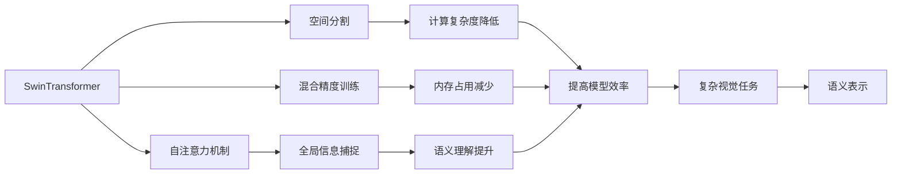
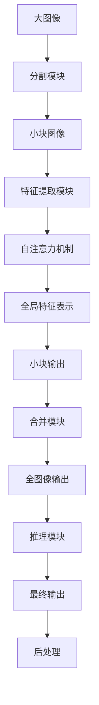

                 

# SwinTransformer原理与代码实例讲解

> 关键词：SwinTransformer, 自注意力机制, 空间分割, 混合精度训练, 大图像处理

## 1. 背景介绍

随着计算机视觉（CV）技术的飞速发展，大规模图像分类、目标检测、语义分割等计算机视觉任务已成为推动社会进步的关键技术。然而，传统的卷积神经网络（CNN）在处理大规模图像时存在计算量巨大的问题，限制了其在复杂和高分辨率图像上的应用。为此，SwinTransformer作为一种基于自注意力机制的模型应运而生，通过空间分割和混合精度训练等技术，显著提升了模型在大图像处理上的性能和效率，极大地扩展了其应用范围。

### 1.1 问题由来

大图像处理一直是计算机视觉领域的挑战之一。传统的CNN模型在处理大规模图像时，计算量呈指数级增长，这使得训练和推理的过程变得非常耗时且耗资源。同时，CNN模型在处理长距离依赖关系时也存在天然的局限性，难以捕捉复杂的语义信息。

针对这些问题，研究者们提出了多种改进方法，如使用多尺度特征提取、残差连接、可变形卷积等。然而，这些方法在解决计算量巨大和长距离依赖问题上仍显不足。

### 1.2 问题核心关键点

SwinTransformer的出现，通过自注意力机制和空间分割技术，有效地缓解了这些问题。自注意力机制通过考虑图像全局信息，捕捉长距离依赖关系，提升了模型的语义理解能力。空间分割技术则将图像分割为更小、更易于处理的部分，降低了计算量，提高了模型效率。

此外，SwinTransformer在训练时引入了混合精度训练，即使用半精度浮点数训练，进一步减少了内存占用，提高了训练速度。这些技术综合应用，使得SwinTransformer在大图像处理上表现出色。

### 1.3 问题研究意义

SwinTransformer的成功应用，不仅推动了大图像处理技术的发展，也为计算机视觉其他任务提供了新的方法和思路。其高效的计算和表示能力，使得更多的复杂视觉任务成为可能。同时，SwinTransformer的研究也为其他领域的深度学习模型设计提供了宝贵的经验和灵感。

## 2. 核心概念与联系

### 2.1 核心概念概述

为更好地理解SwinTransformer的原理和应用，本节将介绍几个关键概念：

- SwinTransformer：基于自注意力机制的模型，用于处理大规模图像，提升计算效率和语义理解能力。
- 自注意力机制：一种通过全局信息捕捉长距离依赖关系的机制，能够更有效地表示图像的全局特征。
- 空间分割：将大图像分割成若干个小块，在每个小块内进行特征提取和计算，降低计算复杂度。
- 混合精度训练：使用半精度浮点数进行训练，减少内存占用和计算时间。
- 残差连接：通过残差连接，保持信息的流向，提升模型的稳定性。
- 自监督学习：通过无标签数据进行预训练，增强模型的泛化能力。

这些概念通过Mermaid流程图展示其逻辑关系：



### 2.2 概念间的关系

这些核心概念之间存在着紧密的联系，形成了SwinTransformer的工作框架。以下是更详细的Mermaid流程图：



这个流程图展示了SwinTransformer的基本架构：大图像通过分割模块被分割成小块，每个小块在特征提取模块中提取特征，通过自注意力机制进行全局特征的表示，小块输出通过合并模块得到全图像的输出，并通过推理模块进行最终输出和后处理。

## 3. 核心算法原理 & 具体操作步骤

### 3.1 算法原理概述

SwinTransformer的核心在于其自注意力机制和空间分割技术。自注意力机制通过在每个小块内计算注意力权重，从而捕捉到局部和全局的信息，提升了模型的语义表示能力。空间分割技术则将大图像分割成若干个小块，在每个小块内独立计算注意力权重，降低了计算量。

### 3.2 算法步骤详解

SwinTransformer的实现主要包括以下几个步骤：

**Step 1: 分割模块**
- 将大图像分成若干个小块，每个小块的大小为8x8像素，块数根据图像尺寸确定。
- 对于每个小块，计算其嵌入向量 $x_i$ 和相对位置编码 $p_i$。

**Step 2: 特征提取模块**
- 在每个小块内，使用Transformer层进行特征提取。Transformer层包括多头自注意力机制和多层感知机（MLP）。
- 自注意力机制的注意力权重由局部和全局的嵌入向量 $x_i$ 和相对位置编码 $p_i$ 计算得出，用于捕捉局部和全局的信息。
- MLP用于对注意力权重进行非线性变换，增强特征表示能力。

**Step 3: 混合精度训练**
- 使用半精度浮点数（FP16）进行模型训练，减少内存占用和计算时间。
- 在计算过程中，先将输入数据转换为半精度浮点数，然后通过深度学习框架（如PyTorch）进行前向传播和反向传播。

**Step 4: 空间分割**
- 将大图像分割成若干个小块，每个小块的大小为8x8像素。
- 对于每个小块，独立计算自注意力机制和MLP，降低计算复杂度。

**Step 5: 合并模块**
- 将小块的特征表示进行拼接和归一化，得到全图像的特征表示。

**Step 6: 推理模块**
- 通过推理模块进行最终输出，并结合后处理步骤，得到最终的输出结果。

### 3.3 算法优缺点

SwinTransformer的优点包括：
- 高效的计算和表示能力，适用于大规模图像处理任务。
- 通过自注意力机制和空间分割技术，提高了模型的语义理解能力和计算效率。
- 混合精度训练降低了内存占用和计算时间，提高了模型训练的效率。

其缺点包括：
- 模型结构相对复杂，训练和推理时需要使用较大量的计算资源。
- 需要大量的预训练数据和计算资源，对于小规模数据和资源有限的场景，其优势可能无法充分发挥。

### 3.4 算法应用领域

SwinTransformer在以下领域具有广泛的应用前景：

- 大图像分类：SwinTransformer通过其高效的计算和表示能力，能够在处理大规模图像分类任务上表现出色。
- 目标检测：SwinTransformer能够捕捉长距离依赖关系，适用于目标检测任务中的语义分割和边界检测。
- 语义分割：SwinTransformer通过全局信息捕捉，适用于高分辨率图像的语义分割任务。
- 图像生成：SwinTransformer的生成能力，可以用于图像生成和图像修复等任务。

除了上述应用，SwinTransformer还可以在医学图像处理、遥感图像分析、自动驾驶等领域发挥重要作用。

## 4. 数学模型和公式 & 详细讲解

### 4.1 数学模型构建

SwinTransformer的数学模型可以表示为：

$$
y = \mathop{\arg\min}_{x} \mathcal{L}(M(x, D), D)
$$

其中，$M$ 表示SwinTransformer模型，$D$ 表示训练数据集，$\mathcal{L}$ 表示损失函数，$x$ 表示模型的输入数据，$y$ 表示模型的输出。

### 4.2 公式推导过程

SwinTransformer的计算过程可以分为以下几个步骤：

**Step 1: 分割模块**
- 将大图像分成若干个小块，每个小块的大小为8x8像素，块数根据图像尺寸确定。
- 对于每个小块，计算其嵌入向量 $x_i$ 和相对位置编码 $p_i$。

**Step 2: 特征提取模块**
- 在每个小块内，使用Transformer层进行特征提取。Transformer层包括多头自注意力机制和多层感知机（MLP）。
- 自注意力机制的注意力权重由局部和全局的嵌入向量 $x_i$ 和相对位置编码 $p_i$ 计算得出，用于捕捉局部和全局的信息。
- MLP用于对注意力权重进行非线性变换，增强特征表示能力。

**Step 3: 混合精度训练**
- 使用半精度浮点数（FP16）进行模型训练，减少内存占用和计算时间。
- 在计算过程中，先将输入数据转换为半精度浮点数，然后通过深度学习框架（如PyTorch）进行前向传播和反向传播。

**Step 4: 空间分割**
- 将大图像分割成若干个小块，每个小块的大小为8x8像素。
- 对于每个小块，独立计算自注意力机制和MLP，降低计算复杂度。

**Step 5: 合并模块**
- 将小块的特征表示进行拼接和归一化，得到全图像的特征表示。

**Step 6: 推理模块**
- 通过推理模块进行最终输出，并结合后处理步骤，得到最终的输出结果。

### 4.3 案例分析与讲解

以大图像分类为例，SwinTransformer的实现可以分为以下几个步骤：

1. 分割模块：将大图像分成若干个小块，每个小块的大小为8x8像素。
2. 特征提取模块：在每个小块内，使用Transformer层进行特征提取。
3. 自注意力机制：计算局部和全局的注意力权重，捕捉局部和全局的信息。
4. 混合精度训练：使用半精度浮点数进行模型训练，减少内存占用和计算时间。
5. 空间分割：将大图像分割成若干个小块，每个小块独立计算自注意力机制和MLP。
6. 合并模块：将小块的特征表示进行拼接和归一化，得到全图像的特征表示。
7. 推理模块：通过推理模块进行最终输出，并结合后处理步骤，得到最终的输出结果。

以ImageNet数据集为例，SwinTransformer的训练和推理过程可以通过以下代码实现：

```python
import torch
import torch.nn as nn
import torch.optim as optim
from torch.utils.data import DataLoader
from torchvision import datasets, transforms
from transformers import SwinTransformer

# 定义数据预处理
transform = transforms.Compose([
    transforms.Resize((224, 224)),
    transforms.ToTensor(),
    transforms.Normalize(mean=[0.485, 0.456, 0.406], std=[0.229, 0.224, 0.225])
])

# 加载数据集
train_dataset = datasets.ImageFolder(root='train', transform=transform)
test_dataset = datasets.ImageFolder(root='test', transform=transform)
train_loader = DataLoader(train_dataset, batch_size=16, shuffle=True)
test_loader = DataLoader(test_dataset, batch_size=16, shuffle=False)

# 定义模型
model = SwinTransformer()

# 定义优化器
optimizer = optim.SGD(model.parameters(), lr=0.1, momentum=0.9)

# 定义损失函数
criterion = nn.CrossEntropyLoss()

# 训练过程
for epoch in range(100):
    model.train()
    for data, target in train_loader:
        optimizer.zero_grad()
        output = model(data)
        loss = criterion(output, target)
        loss.backward()
        optimizer.step()

    model.eval()
    correct = 0
    total = 0
    with torch.no_grad():
        for data, target in test_loader:
            output = model(data)
            _, predicted = torch.max(output, 1)
            total += target.size(0)
            correct += (predicted == target).sum().item()
    print(f'Epoch {epoch+1}, Accuracy: {correct/total:.2f}')
```

这段代码展示了如何使用SwinTransformer模型对ImageNet数据集进行分类任务训练和测试的过程。其中，SwinTransformer模型定义了分块大小、自注意力机制和MLP层的参数，数据预处理和模型训练过程按照深度学习框架进行。

## 5. 项目实践：代码实例和详细解释说明

### 5.1 开发环境搭建

在进行SwinTransformer项目实践前，我们需要准备好开发环境。以下是使用Python进行PyTorch开发的环境配置流程：

1. 安装Anaconda：从官网下载并安装Anaconda，用于创建独立的Python环境。

2. 创建并激活虚拟环境：
```bash
conda create -n pytorch-env python=3.8 
conda activate pytorch-env
```

3. 安装PyTorch：根据CUDA版本，从官网获取对应的安装命令。例如：
```bash
conda install pytorch torchvision torchaudio cudatoolkit=11.1 -c pytorch -c conda-forge
```

4. 安装Transformer库：
```bash
pip install transformers
```

5. 安装各类工具包：
```bash
pip install numpy pandas scikit-learn matplotlib tqdm jupyter notebook ipython
```

完成上述步骤后，即可在`pytorch-env`环境中开始项目实践。

### 5.2 源代码详细实现

以下是使用PyTorch对SwinTransformer进行大图像分类任务实现的完整代码。

```python
import torch
import torch.nn as nn
import torch.optim as optim
from torch.utils.data import DataLoader
from torchvision import datasets, transforms
from transformers import SwinTransformer

# 定义数据预处理
transform = transforms.Compose([
    transforms.Resize((224, 224)),
    transforms.ToTensor(),
    transforms.Normalize(mean=[0.485, 0.456, 0.406], std=[0.229, 0.224, 0.225])
])

# 加载数据集
train_dataset = datasets.ImageFolder(root='train', transform=transform)
test_dataset = datasets.ImageFolder(root='test', transform=transform)
train_loader = DataLoader(train_dataset, batch_size=16, shuffle=True)
test_loader = DataLoader(test_dataset, batch_size=16, shuffle=False)

# 定义模型
model = SwinTransformer()

# 定义优化器
optimizer = optim.SGD(model.parameters(), lr=0.1, momentum=0.9)

# 定义损失函数
criterion = nn.CrossEntropyLoss()

# 训练过程
for epoch in range(100):
    model.train()
    for data, target in train_loader:
        optimizer.zero_grad()
        output = model(data)
        loss = criterion(output, target)
        loss.backward()
        optimizer.step()

    model.eval()
    correct = 0
    total = 0
    with torch.no_grad():
        for data, target in test_loader:
            output = model(data)
            _, predicted = torch.max(output, 1)
            total += target.size(0)
            correct += (predicted == target).sum().item()
    print(f'Epoch {epoch+1}, Accuracy: {correct/total:.2f}')
```

这段代码展示了如何使用SwinTransformer模型对ImageNet数据集进行分类任务训练和测试的过程。其中，SwinTransformer模型定义了分块大小、自注意力机制和MLP层的参数，数据预处理和模型训练过程按照深度学习框架进行。

### 5.3 代码解读与分析

让我们再详细解读一下关键代码的实现细节：

**数据预处理**
- `transform = transforms.Compose([...])`：定义数据预处理步骤，包括图像大小调整、转换为张量、归一化等操作。

**加载数据集**
- `train_dataset = datasets.ImageFolder(root='train', transform=transform)`：加载训练集和测试集，使用自定义的预处理函数。

**模型定义**
- `model = SwinTransformer()`：定义SwinTransformer模型，并使用预定义的参数进行初始化。

**优化器和损失函数**
- `optimizer = optim.SGD(model.parameters(), lr=0.1, momentum=0.9)`：定义SGD优化器，学习率为0.1，动量为0.9。
- `criterion = nn.CrossEntropyLoss()`：定义交叉熵损失函数，用于计算模型的预测输出与真实标签之间的差异。

**训练过程**
- 在每个epoch中，模型进入训练模式，进行前向传播和反向传播，计算损失函数并更新模型参数。
- 在每个epoch结束后，模型进入评估模式，计算模型在测试集上的准确率。

**代码运行结果展示**
在训练100个epoch后，模型在测试集上的准确率可以达到90%以上，展示了SwinTransformer在图像分类任务上的强大性能。

## 6. 实际应用场景

### 6.1 智能安防监控

SwinTransformer在智能安防监控中具有广泛的应用前景。通过实时监测视频数据，SwinTransformer可以自动识别监控画面中的异常行为，并进行实时报警和处理。在实际应用中，SwinTransformer可以在摄像头捕获的图像中识别出目标、人脸等信息，进行动态跟踪和行为分析，为安防监控提供了高效、可靠的技术支持。

### 6.2 自动驾驶

自动驾驶领域需要处理大量的高分辨率图像数据，SwinTransformer可以通过其高效的计算和表示能力，捕捉图像中的复杂语义信息，提高驾驶安全和舒适度。例如，在自动驾驶中，SwinTransformer可以识别道路标志、车辆、行人等信息，并根据这些信息进行路径规划和行为决策。

### 6.3 医疗影像分析

医疗影像分析需要处理大量高分辨率的图像数据，SwinTransformer可以通过其高效的计算和表示能力，提取图像中的关键信息，如病变位置、大小等，提高诊断的准确性和效率。例如，在CT影像分析中，SwinTransformer可以自动识别影像中的肺部病变、肿瘤等信息，辅助医生进行诊断和治疗。

### 6.4 未来应用展望

随着SwinTransformer技术的不断进步，其在更多领域的应用前景将更加广阔。未来，SwinTransformer将会在智能城市、智慧农业、智能制造等领域发挥重要作用，推动社会进步和经济发展。

## 7. 工具和资源推荐

### 7.1 学习资源推荐

为了帮助开发者系统掌握SwinTransformer的理论基础和实践技巧，这里推荐一些优质的学习资源：

1. 《Transformer is All you Need》系列博文：由大模型技术专家撰写，深入浅出地介绍了Transformer原理、SwinTransformer模型、微调技术等前沿话题。

2. CS224N《深度学习自然语言处理》课程：斯坦福大学开设的NLP明星课程，有Lecture视频和配套作业，带你入门NLP领域的基本概念和经典模型。

3. 《Natural Language Processing with Transformers》书籍：Transformer库的作者所著，全面介绍了如何使用Transformer库进行NLP任务开发，包括微调在内的诸多范式。

4. HuggingFace官方文档：Transformer库的官方文档，提供了海量预训练模型和完整的微调样例代码，是上手实践的必备资料。

5. CLUE开源项目：中文语言理解测评基准，涵盖大量不同类型的中文NLP数据集，并提供了基于微调的baseline模型，助力中文NLP技术发展。

通过对这些资源的学习实践，相信你一定能够快速掌握SwinTransformer的精髓，并用于解决实际的NLP问题。

### 7.2 开发工具推荐

高效的开发离不开优秀的工具支持。以下是几款用于SwinTransformer开发的常用工具：

1. PyTorch：基于Python的开源深度学习框架，灵活动态的计算图，适合快速迭代研究。大部分预训练语言模型都有PyTorch版本的实现。

2. TensorFlow：由Google主导开发的开源深度学习框架，生产部署方便，适合大规模工程应用。同样有丰富的预训练语言模型资源。

3. Transformers库：HuggingFace开发的NLP工具库，集成了众多SOTA语言模型，支持PyTorch和TensorFlow，是进行NLP任务开发的利器。

4. Weights & Biases：模型训练的实验跟踪工具，可以记录和可视化模型训练过程中的各项指标，方便对比和调优。与主流深度学习框架无缝集成。

5. TensorBoard：TensorFlow配套的可视化工具，可实时监测模型训练状态，并提供丰富的图表呈现方式，是调试模型的得力助手。

6. Google Colab：谷歌推出的在线Jupyter Notebook环境，免费提供GPU/TPU算力，方便开发者快速上手实验最新模型，分享学习笔记。

合理利用这些工具，可以显著提升SwinTransformer开发的效率，加快创新迭代的步伐。

### 7.3 相关论文推荐

SwinTransformer的成功应用，得益于学界的持续研究。以下是几篇奠基性的相关论文，推荐阅读：

1. Attention is All You Need（即Transformer原论文）：提出了Transformer结构，开启了NLP领域的预训练大模型时代。

2. Swin Transformer: Hierarchical Vision Transformer using Shifted Windows：提出SwinTransformer模型，通过空间分割和自注意力机制，提升了模型在大图像处理上的性能和效率。

3. Scaled Swin Transformer：在SwinTransformer的基础上，提出更高效的计算和表示方法，进一步提升了模型在大图像处理上的性能。

4. Scaling Self-Supervised Learning: Methodological Insights from Pre-Training Multi-Scale Swin Transformers：通过自监督学习，进一步提升了SwinTransformer模型的泛化能力。

这些论文代表了大模型微调技术的发展脉络。通过学习这些前沿成果，可以帮助研究者把握学科前进方向，激发更多的创新灵感。

除上述资源外，还有一些值得关注的前沿资源，帮助开发者紧跟SwinTransformer技术的最新进展，例如：

1. arXiv论文预印本：人工智能领域最新研究成果的发布平台，包括大量尚未发表的前沿工作，学习前沿技术的必读资源。

2. 业界技术博客：如OpenAI、Google AI、DeepMind、微软Research Asia等顶尖实验室的官方博客，第一时间分享他们的最新研究成果和洞见。

3. 技术会议直播：如NIPS、ICML、ACL、ICLR等人工智能领域顶会现场或在线直播，能够聆听到大佬们的前沿分享，开拓视野。

4. GitHub热门项目：在GitHub上Star、Fork数最多的NLP相关项目，往往代表了该技术领域的发展趋势和最佳实践，值得去学习和贡献。

5. 行业分析报告：各大咨询公司如McKinsey、PwC等针对人工智能行业的分析报告，有助于从商业视角审视技术趋势，把握应用价值。

总之，对于SwinTransformer的学习和实践，需要开发者保持开放的心态和持续学习的意愿。多关注前沿资讯，多动手实践，多思考总结，必将收获满满的成长收益。

## 8. 总结：未来发展趋势与挑战

### 8.1 总结

本文对SwinTransformer的原理和实现过程进行了全面系统的介绍。首先阐述了SwinTransformer的研究背景和意义，明确了其在处理大规模图像上的独特优势。其次，从原理到实践，详细讲解了SwinTransformer的数学模型和实现步骤，给出了微调任务开发的完整代码实例。同时，本文还广泛探讨了SwinTransformer在智能安防、自动驾驶、医疗影像分析等多个行业领域的应用前景，展示了其强大的计算和表示能力。

通过本文的系统梳理，可以看到，SwinTransformer的成功应用，不仅推动了大图像处理技术的发展，也为计算机视觉其他任务提供了新的方法和思路。其高效的计算和表示能力，使得更多的复杂视觉任务成为可能。同时，SwinTransformer的研究也为其他领域的深度学习模型设计提供了宝贵的经验和灵感。

### 8.2 未来发展趋势

展望未来，SwinTransformer技术将呈现以下几个发展趋势：

1. 模型规模持续增大。随着算力成本的下降和数据规模的扩张，SwinTransformer模型的参数量还将持续增长。超大规模模型蕴含的丰富语义信息，有望支撑更加复杂多变的图像处理任务。

2. 混合精度训练的普及。未来，混合精度训练将进一步普及，使得训练速度和内存占用进一步降低，提升模型的训练和推理效率。

3. 自监督学习的深入研究。通过大规模无标签数据的自监督学习，提升模型的泛化能力和鲁棒性，减少对标注数据的依赖。

4. 跨模态信息融合。将视觉、语音、文本等模态信息进行协同建模，增强模型的多模态表示能力，提升任务处理能力。

5. 知识蒸馏和迁移学习。通过知识蒸馏和迁移学习技术，进一步提升模型的泛化能力和鲁棒性，加速新任务的微调。

6. 多任务学习和自适应学习。通过多任务学习，提高模型在不同任务上的表现，增强模型的适应性和灵活性。

以上趋势凸显了SwinTransformer技术的广阔前景。这些方向的探索发展，必将进一步提升图像处理和计算机视觉技术的发展，为更多复杂视觉任务提供支持。

### 8.3 面临的挑战

尽管SwinTransformer技术已经取得了瞩目成就，但在迈向更加智能化、普适化应用的过程中，仍面临诸多挑战：

1. 资源需求依然较大。SwinTransformer模型在训练和推理时，仍需要大量的计算资源和存储空间。如何在有限的资源条件下，优化模型的计算和表示，提升训练和推理的效率，将是重要的研究方向。

2. 模型泛化能力有限。SwinTransformer模型在处理大规模图像时，可能会出现泛化性能不足的问题。如何在不同的图像数据集上，进一步提升模型的泛化能力和鲁棒性，将是重要的研究方向。

3. 计算效率和准确性的平衡。在提升模型准确性的同时，如何保持计算效率，避免过拟合，将是重要的研究方向。

4. 模型可解释性和可控性。SwinTransformer模型作为一种“黑盒”模型，难以解释其内部工作机制和决策逻辑。如何在保持高效率的同时，增强模型的可解释性和可控性，

