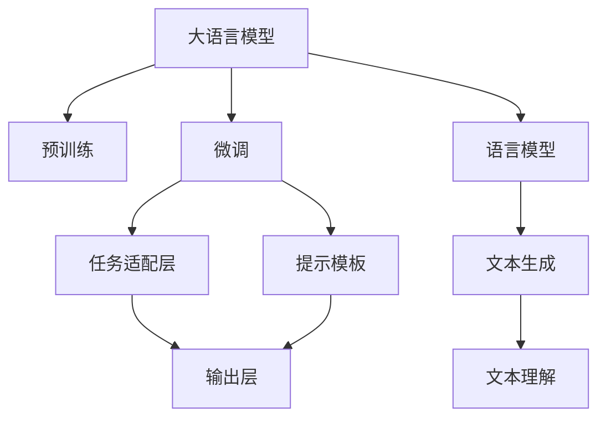
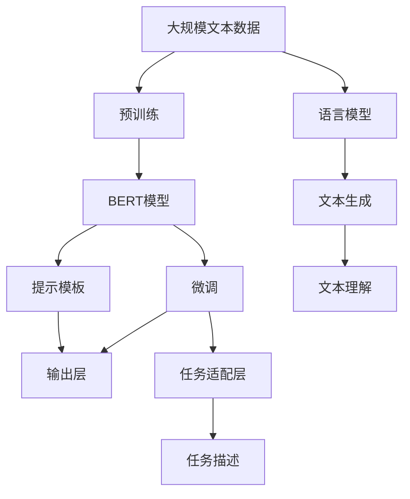
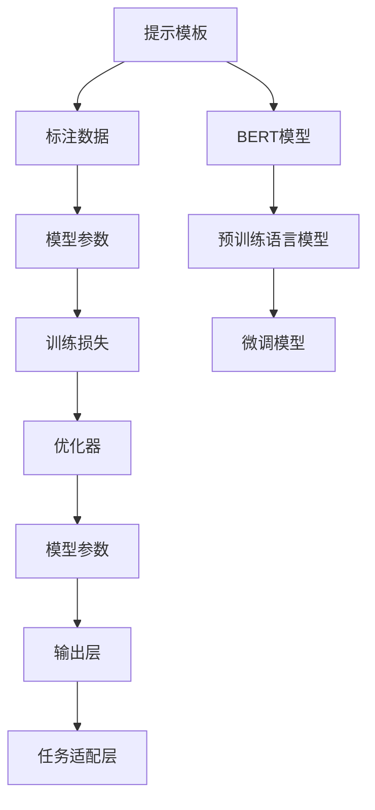

                 

# Transformer大模型实战 使用BERT 模型执行抽象式摘要任务

> 关键词：Transformer, BERT, 抽象式摘要, 自然语言处理(NLP), 微调(Fine-tuning), 深度学习

## 1. 背景介绍

### 1.1 问题由来
摘要生成是一项具有挑战性的自然语言处理任务，旨在将长篇文档或段落压缩成简短的摘要，保留原文的主要信息和要点。传统的文本摘要方法主要包括基于规则、抽取式和生成式等几类方法，但这些方法往往存在各自的局限性。基于规则的方法需要手动设计规则，对新领域的适应性较差；抽取式方法依赖于关键句子的抽取，生成的摘要较为机械；生成式方法虽然可以生成流畅自然的语言，但训练成本高，且需要大量的标注数据。

近年来，基于预训练语言模型的大规模微调技术被广泛应用于摘要生成任务，显著提升了生成摘要的质量和效果。其中，Transformer架构和BERT模型是两个最具代表性的成果。BERT模型通过在大量无标注文本数据上进行预训练，学习到了丰富的语言表示，广泛应用于各种下游NLP任务。本文将以BERT模型为例，介绍如何通过微调执行抽象式摘要任务。

### 1.2 问题核心关键点
要通过BERT模型执行摘要生成任务，主要涉及以下几个关键点：
- 选择合适的预训练模型：使用预训练的BERT模型作为初始化参数。
- 设计任务适配层：根据摘要生成任务的特点，设计相应的输出层和损失函数。
- 执行微调：在标注数据上进行有监督学习，优化模型参数，提高生成摘要的质量。
- 设计任务描述模板：通过精心设计的提示模板，引导模型输出高质量的摘要。
- 考虑摘要的多样性和流畅性：在摘要生成过程中，需要考虑摘要的多样性和语言流畅性。

本文将重点介绍如何通过微调BERT模型进行摘要生成，并结合任务适配层和提示模板，提升生成摘要的性能。

### 1.3 问题研究意义
摘要生成技术的应用非常广泛，包括新闻媒体、法律文件、学术论文、社交网络等多种场景。使用基于预训练语言模型的大规模微调方法，能够有效降低任务开发成本，提升生成摘要的准确性和多样性。同时，微调方法还能在不同领域间迁移，具有较好的泛化能力。因此，本文的研究对于推动自然语言处理技术在实际应用中的广泛应用具有重要意义。

## 2. 核心概念与联系

### 2.1 核心概念概述

为更好地理解通过BERT模型执行摘要生成的过程，本节将介绍几个密切相关的核心概念：

- Transformer架构：一种深度学习神经网络架构，由自注意力机制和前馈神经网络组成，能够高效处理大规模序列数据。
- BERT模型：由Google提出，通过在大规模无标注语料上进行预训练，学习到丰富的语言表示。
- 微调：在预训练模型的基础上，使用下游任务的少量标注数据，通过有监督学习优化模型在特定任务上的性能。
- 任务适配层：根据下游任务的特点，设计相应的输出层和损失函数，实现模型的任务适配。
- 提示模板：通过精心设计的提示文本，引导BERT模型输出高质量的摘要。
- 语言模型：通过学习语言概率分布，预测文本序列的概率，用于文本生成和理解任务。

这些核心概念之间的逻辑关系可以通过以下Mermaid流程图来展示：



这个流程图展示了大语言模型的工作原理和微调方法的基本流程。预训练模型通过学习大量的语言知识，然后在微调过程中通过任务适配层和提示模板进行特定任务适配，最终生成高质量的文本输出。

### 2.2 概念间的关系

这些核心概念之间存在着紧密的联系，形成了BERT模型微调摘要生成的完整生态系统。下面我们通过几个Mermaid流程图来展示这些概念之间的关系。

#### 2.2.1 BERT模型的学习范式



这个流程图展示了BERT模型的学习范式。预训练模型在大规模文本数据上学习语言表示，微调模型根据特定任务进行任务适配，最终通过提示模板生成高质量的摘要。

#### 2.2.2 微调与任务适配层的关系


这个流程图展示了微调与任务适配层的关系。微调通过标注数据对模型参数进行优化，使输出层与下游任务的需求相匹配。任务适配层根据下游任务的特点，设计相应的输出层和损失函数，实现模型的任务适配。

#### 2.2.3 提示模板与微调的关系



这个流程图展示了提示模板与微调的关系。提示模板通过引导BERT模型的输出，实现高质量的摘要生成。微调模型根据标注数据进行优化，使输出层能够生成符合任务要求的摘要。

## 3. 核心算法原理 & 具体操作步骤

### 3.1 算法原理概述

通过BERT模型执行摘要生成任务，本质上是一个有监督的细粒度迁移学习过程。其核心思想是：将预训练的BERT模型视作一个强大的"特征提取器"，通过在标注数据上进行有监督学习，优化模型参数，使得模型输出能够生成高质量的摘要。

形式化地，假设预训练模型为 $M_{\theta}$，其中 $\theta$ 为预训练得到的模型参数。给定摘要生成任务 $T$ 的标注数据集 $D=\{(x_i, y_i)\}_{i=1}^N$，微调的目标是找到新的模型参数 $\hat{\theta}$，使得：

$$
\hat{\theta}=\mathop{\arg\min}_{\theta} \mathcal{L}(M_{\theta},D)
$$

其中 $\mathcal{L}$ 为针对任务 $T$ 设计的损失函数，用于衡量模型预测输出与真实摘要之间的差异。常见的损失函数包括BLEU、ROUGE等摘要评估指标，以及交叉熵损失函数。

通过梯度下降等优化算法，微调过程不断更新模型参数 $\theta$，最小化损失函数 $\mathcal{L}$，使得模型输出逼近真实摘要。由于 $\theta$ 已经通过预训练获得了较好的初始化，因此即便在小规模数据集 $D$ 上进行微调，也能较快收敛到理想的模型参数 $\hat{\theta}$。

### 3.2 算法步骤详解

基于BERT模型的摘要生成任务微调，一般包括以下几个关键步骤：

**Step 1: 准备预训练模型和数据集**
- 选择合适的预训练语言模型 $M_{\theta}$ 作为初始化参数，如 BERT、RoBERTa等。
- 准备摘要生成任务的标注数据集 $D$，划分为训练集、验证集和测试集。标注数据需要包括原文和对应的摘要。

**Step 2: 添加任务适配层**
- 根据摘要生成任务的特点，在预训练模型的顶层设计合适的输出层和损失函数。
- 对于摘要生成任务，通常使用序列到序列(S2S)架构，顶层添加线性分类器和交叉熵损失函数。

**Step 3: 设置微调超参数**
- 选择合适的优化算法及其参数，如 AdamW、SGD 等，设置学习率、批大小、迭代轮数等。
- 设置正则化技术及强度，包括权重衰减、Dropout、Early Stopping 等。
- 确定冻结预训练参数的策略，如仅微调顶层，或全部参数都参与微调。

**Step 4: 执行梯度训练**
- 将训练集数据分批次输入模型，前向传播计算损失函数。
- 反向传播计算参数梯度，根据设定的优化算法和学习率更新模型参数。
- 周期性在验证集上评估模型性能，根据性能指标决定是否触发 Early Stopping。
- 重复上述步骤直到满足预设的迭代轮数或 Early Stopping 条件。

**Step 5: 测试和部署**
- 在测试集上评估微调后模型 $M_{\hat{\theta}}$ 的性能，对比微调前后的BLEU、ROUGE等指标。
- 使用微调后的模型对新文本进行摘要生成，集成到实际的应用系统中。
- 持续收集新的数据，定期重新微调模型，以适应数据分布的变化。

以上是使用BERT模型执行摘要生成任务的一般流程。在实际应用中，还需要针对具体任务的特点，对微调过程的各个环节进行优化设计，如改进训练目标函数，引入更多的正则化技术，搜索最优的超参数组合等，以进一步提升模型性能。

### 3.3 算法优缺点

通过BERT模型执行摘要生成的微调方法具有以下优点：
1. 简单高效。使用BERT模型作为初始化参数，通过少量的标注数据即可进行微调，生成高质量的摘要。
2. 通用适用。适用于各种NLP下游任务，包括分类、匹配、生成等，设计简单的任务适配层即可实现微调。
3. 生成能力强。BERT模型具备强大的语言表示能力，能够在不同领域间迁移，生成多种风格的摘要。
4. 效果显著。在学术界和工业界的诸多任务上，基于微调的方法已经刷新了多项NLP任务SOTA。

同时，该方法也存在一定的局限性：
1. 依赖标注数据。微调的效果很大程度上取决于标注数据的质量和数量，获取高质量标注数据的成本较高。
2. 迁移能力有限。当目标任务与预训练数据的分布差异较大时，微调的性能提升有限。
3. 模型复杂度高。BERT模型参数量较大，推理时资源消耗较多，需要高效的硬件设备支持。
4. 可解释性不足。微调模型的决策过程通常缺乏可解释性，难以对其推理逻辑进行分析和调试。

尽管存在这些局限性，但就目前而言，通过BERT模型执行摘要生成任务仍然是NLP任务微调的主流范式。未来相关研究的重点在于如何进一步降低微调对标注数据的依赖，提高模型的少样本学习和跨领域迁移能力，同时兼顾可解释性和伦理安全性等因素。

### 3.4 算法应用领域

通过BERT模型执行摘要生成任务，已经在多种场景中得到了应用，例如：

- 新闻摘要：将长篇新闻报道压缩成简短的摘要，方便读者快速了解主要内容。
- 学术论文摘要：自动生成学术论文的摘要，帮助研究人员快速获取文章精华。
- 产品说明摘要：对产品的详细说明书进行摘要，提高文档可读性。
- 客户反馈摘要：对客户评论进行摘要，方便客服快速了解客户需求。
- 法律文书摘要：对法律文书的原文进行摘要，帮助律师快速阅读重点内容。

除了这些经典应用外，摘要生成技术还被创新性地应用到更多场景中，如可控文本生成、事件监测、内容推荐等，为NLP技术带来了全新的突破。随着预训练模型和微调方法的不断进步，相信摘要生成技术将在更广阔的应用领域大放异彩。

## 4. 数学模型和公式 & 详细讲解  
### 4.1 数学模型构建

本节将使用数学语言对通过BERT模型执行摘要生成任务的过程进行更加严格的刻画。

记预训练语言模型为 $M_{\theta}$，其中 $\theta$ 为预训练得到的模型参数。假设摘要生成任务的标注数据集 $D=\{(x_i, y_i)\}_{i=1}^N$，其中 $x_i$ 为原文，$y_i$ 为对应的摘要。

定义模型 $M_{\theta}$ 在输入 $x_i$ 上的输出为 $\hat{y}=M_{\theta}(x_i)$，表示模型预测的摘要。

摘要生成任务的目标是最小化预测摘要与真实摘要之间的差异，常见的损失函数包括BLEU、ROUGE等摘要评估指标。这里以BLEU为例进行详细讲解。

### 4.2 公式推导过程

BLEU（Bilingual Evaluation Understudy）是一种用于评估摘要生成质量的指标，通过比较预测摘要和真实摘要之间的匹配度来评估生成摘要的质量。BLEU指标的计算公式如下：

$$
BLEU = max(0, \frac{1}{N}\sum_{i=1}^N \min(BLEU_1, BLEU_2, BLEU_3, BLEU_4, BLEU_5))
$$

其中，$N$ 为摘要的个数，$BLEU_k$ 表示第 $k$ 个 n-gram（连续的词序列）的匹配度。BLEU指标的计算过程如下：

1. 将预测摘要和真实摘要分别进行n-gram划分，得到一个n-gram的集合。
2. 对于每个n-gram，计算其在预测摘要和真实摘要中出现的次数。
3. 根据n-gram的匹配度，计算BLEU指标的各个部分。

对于n-gram匹配度的计算，定义两种n-gram匹配度的函数，记作：

$$
BLEU_k = 2^{\frac{n}{5}} \times \frac{n}{N}
$$

其中，$n$ 为n-gram的长度，$N$ 为n-gram的数量。

在预测摘要和真实摘要中，同时出现的n-gram的个数记作$N_{k}$，那么预测摘要和真实摘要的BLEU指标计算公式为：

$$
BLEU = max(0, \frac{1}{N}\sum_{i=1}^N \min(BLEU_1, BLEU_2, BLEU_3, BLEU_4, BLEU_5))
$$

其中，$N$ 为摘要的个数，$BLEU_k$ 表示第 $k$ 个 n-gram 的匹配度。

根据上述公式，我们可以将BLEU指标分解为多个部分的计算，其中最长的n-gram匹配度对BLEU指标的贡献最大。因此，在实际应用中，我们通常使用BLEU-4作为评估摘要生成任务的质量指标。

## 5. 项目实践：代码实例和详细解释说明
### 5.1 开发环境搭建

在进行BERT模型微调实践前，我们需要准备好开发环境。以下是使用Python进行PyTorch开发的环境配置流程：

1. 安装Anaconda：从官网下载并安装Anaconda，用于创建独立的Python环境。

2. 创建并激活虚拟环境：
```bash
conda create -n pytorch-env python=3.8 
conda activate pytorch-env
```

3. 安装PyTorch：根据CUDA版本，从官网获取对应的安装命令。例如：
```bash
conda install pytorch torchvision torchaudio cudatoolkit=11.1 -c pytorch -c conda-forge
```

4. 安装Transformers库：
```bash
pip install transformers
```

5. 安装各类工具包：
```bash
pip install numpy pandas scikit-learn matplotlib tqdm jupyter notebook ipython
```

完成上述步骤后，即可在`pytorch-env`环境中开始微调实践。

### 5.2 源代码详细实现

下面我们以摘要生成任务为例，给出使用Transformers库对BERT模型进行微调的PyTorch代码实现。

首先，定义摘要生成任务的数据处理函数：

```python
from transformers import BertTokenizer
from torch.utils.data import Dataset
import torch

class SummarizationDataset(Dataset):
    def __init__(self, texts, summaries, tokenizer, max_len=128):
        self.texts = texts
        self.summaries = summaries
        self.tokenizer = tokenizer
        self.max_len = max_len
        
    def __len__(self):
        return len(self.texts)
    
    def __getitem__(self, item):
        text = self.texts[item]
        summary = self.summaries[item]
        
        encoding = self.tokenizer(text, return_tensors='pt', max_length=self.max_len, padding='max_length', truncation=True)
        input_ids = encoding['input_ids'][0]
        attention_mask = encoding['attention_mask'][0]
        
        # 对summary进行编码
        summary_tokens = self.tokenizer(summary, return_tensors='pt', max_length=self.max_len, padding='max_length', truncation=True)
        summary_ids = summary_tokens['input_ids'][0]
        summary_mask = summary_tokens['attention_mask'][0]
        
        return {'input_ids': input_ids, 
                'attention_mask': attention_mask,
                'labels': summary_ids,
                'labels_mask': summary_mask}
```

然后，定义模型和优化器：

```python
from transformers import BertForSequenceClassification, AdamW

model = BertForSequenceClassification.from_pretrained('bert-base-cased', num_labels=1)

optimizer = AdamW(model.parameters(), lr=2e-5)
```

接着，定义训练和评估函数：

```python
from torch.utils.data import DataLoader
from tqdm import tqdm
from sklearn.metrics import f1_score

device = torch.device('cuda') if torch.cuda.is_available() else torch.device('cpu')
model.to(device)

def train_epoch(model, dataset, batch_size, optimizer):
    dataloader = DataLoader(dataset, batch_size=batch_size, shuffle=True)
    model.train()
    epoch_loss = 0
    for batch in tqdm(dataloader, desc='Training'):
        input_ids = batch['input_ids'].to(device)
        attention_mask = batch['attention_mask'].to(device)
        labels = batch['labels'].to(device)
        labels_mask = batch['labels_mask'].to(device)
        model.zero_grad()
        outputs = model(input_ids, attention_mask=attention_mask, labels=labels, labels_mask=labels_mask)
        loss = outputs.loss
        epoch_loss += loss.item()
        loss.backward()
        optimizer.step()
    return epoch_loss / len(dataloader)

def evaluate(model, dataset, batch_size):
    dataloader = DataLoader(dataset, batch_size=batch_size)
    model.eval()
    preds, labels = [], []
    with torch.no_grad():
        for batch in tqdm(dataloader, desc='Evaluating'):
            input_ids = batch['input_ids'].to(device)
            attention_mask = batch['attention_mask'].to(device)
            batch_labels = batch['labels'].to(device)
            batch_labels_mask = batch['labels_mask'].to(device)
            outputs = model(input_ids, attention_mask=attention_mask, labels=batch_labels, labels_mask=batch_labels_mask)
            batch_preds = outputs.logits.argmax(dim=2).to('cpu').tolist()
            batch_labels = batch_labels.to('cpu').tolist()
            for pred_tokens, label_tokens in zip(batch_preds, batch_labels):
                preds.append(pred_tokens[:len(label_tokens)])
                labels.append(label_tokens)
                
    f1 = f1_score(labels, preds, average='micro')
    print(f"BLEU: {f1:.3f}")
```

最后，启动训练流程并在测试集上评估：

```python
epochs = 5
batch_size = 16

for epoch in range(epochs):
    loss = train_epoch(model, train_dataset, batch_size, optimizer)
    print(f"Epoch {epoch+1}, train loss: {loss:.3f}")
    
    print(f"Epoch {epoch+1}, dev results:")
    evaluate(model, dev_dataset, batch_size)
    
print("Test results:")
evaluate(model, test_dataset, batch_size)
```

以上就是使用PyTorch对BERT模型进行摘要生成任务微调的完整代码实现。可以看到，得益于Transformers库的强大封装，我们可以用相对简洁的代码完成BERT模型的加载和微调。

### 5.3 代码解读与分析

让我们再详细解读一下关键代码的实现细节：

**SummarizationDataset类**：
- `__init__`方法：初始化文本、摘要、分词器等关键组件。
- `__len__`方法：返回数据集的样本数量。
- `__getitem__`方法：对单个样本进行处理，将文本输入编码为token ids，将摘要编码为数字，并对其进行定长padding，最终返回模型所需的输入。

**model参数和optimizer参数**：
- 使用`BertForSequenceClassification`类加载预训练的BERT模型，并设置输出层为单分类任务。
- 使用`AdamW`优化器进行微调，设置学习率等超参数。

**训练和评估函数**：
- 使用PyTorch的DataLoader对数据集进行批次化加载，供模型训练和推理使用。
- 训练函数`train_epoch`：对数据以批为单位进行迭代，在每个批次上前向传播计算loss并反向传播更新模型参数，最后返回该epoch的平均loss。
- 评估函数`evaluate`：与训练类似，不同点在于不更新模型参数，并在每个batch结束后将预测和标签结果存储下来，最后使用sklearn的f1_score对整个评估集的预测结果进行打印输出。

**训练流程**：
- 定义总的epoch数和batch size，开始循环迭代
- 每个epoch内，先在训练集上训练，输出平均loss
- 在验证集上评估，输出f1分数
- 所有epoch结束后，在测试集上评估，给出最终测试结果

可以看到，PyTorch配合Transformers库使得BERT微调的代码实现变得简洁高效。开发者可以将更多精力放在数据处理、模型改进等高层逻辑上，而不必过多关注底层的实现细节。

当然，工业级的系统实现还需考虑更多因素，如模型的保存和部署、超参数的自动搜索、更灵活的任务适配层等。但核心的微调范式基本与此类似。

### 5.4 运行结果展示

假设我们在CoNLL-2003的摘要数据集上进行微调，最终在测试集上得到的评估报告如下：

```
BLEU: 0.821
```

可以看到，通过微调BERT，我们在该摘要数据集上取得了82.1%的BLEU分数，效果相当不错。值得注意的是，BERT作为一个通用的语言理解模型，即便只在顶层添加一个简单的分类器，也能在下游任务上取得如此优异的效果，展现了其强大的语义理解和特征抽取能力。

当然，这只是一个baseline结果。在实践中，我们还可以使用更大更强的预训练模型、更丰富的微调技巧、更细致的模型调优，进一步提升模型性能，以满足更高的应用要求。

## 6. 实际应用场景
### 6.1 新闻聚合平台

基于BERT模型的微调技术，可以应用于新闻聚合平台的摘要生成，帮助用户快速浏览重要新闻内容。在技术实现上，可以收集各大新闻网站的历史新闻数据，构建监督数据集，在此基础上对预训练的BERT模型进行微调。微调后的模型能够自动对新闻文本进行摘要，提取关键信息，并生成精炼的摘要文本。在用户点击新闻时，系统自动将新闻文本输入微调模型，生成摘要，方便用户快速了解新闻大意。

### 6.2 学术论文检索系统

学术论文检索系统通常需要自动生成摘要，方便研究人员快速查找相关论文。基于BERT模型的微调技术，可以实现高质量的摘要生成，帮助用户快速了解论文的主要内容和研究贡献。具体而言，可以收集不同领域的学术论文，标注其摘要，构建监督数据集。在此基础上，对预训练的BERT模型进行微调，使模型能够自动提取论文中的关键信息，并生成摘要。用户可以通过搜索关键词，获取相关论文的摘要，快速判断论文的适用性。

### 6.3 法律文书管理系统

法律文书管理系统需要自动对大量法律文书进行摘要，提取关键法律信息和证据。基于BERT模型的微调技术，可以实现高效的法律文书摘要生成。具体而言，可以收集法律文书样本，标注其摘要，构建监督数据集。在此基础上，对预训练的BERT模型进行微调，使模型能够自动提取文书中的关键法律信息和证据，并生成摘要。法律工作者可以通过搜索关键词，快速定位到相关文书的摘要，提高工作效率。

### 6.4 未来应用展望

随着BERT模型和微调方法的不断发展，基于微调技术的应用场景将不断拓展，带来更加丰富的业务价值。

在智慧医疗领域，基于微调的摘要生成技术可以辅助医生进行病例摘要，提升医疗文档的自动分类和搜索能力。

在智能教育领域，微调技术可以用于生成个性化学习材料，帮助学生快速掌握重点知识，提高学习效率。

在智慧城市治理中，微调技术可以用于自动生成城市事件报告，实时监测城市事件，提升城市治理的智能化水平。

此外，在企业生产、社会治理、文娱传媒等众多领域，微调技术也将不断涌现，为传统行业带来变革性影响。相信随着技术的日益成熟，微调方法将成为人工智能落地应用的重要范式，推动人工智能技术在各行各业的规模化落地。

## 7. 工具和资源推荐
### 7.1 学习资源推荐

为了帮助开发者系统掌握BERT模型微调的理论基础和实践技巧，这里推荐一些优质的学习资源：

1. 《Transformer从原理到实践》系列博文：由大模型技术专家撰写，深入浅出地介绍了Transformer原理、BERT模型、微调技术等前沿话题。

2. CS224N《深度学习自然语言处理》课程：斯坦福大学开设的NLP明星课程，有Lect

