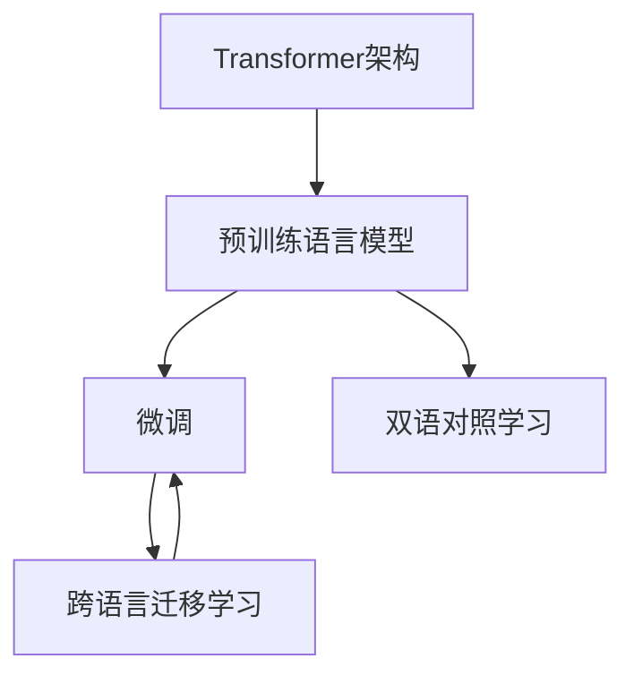
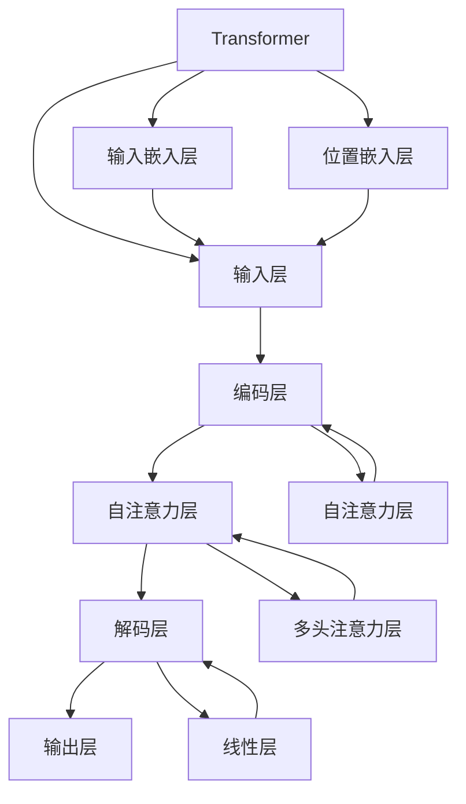
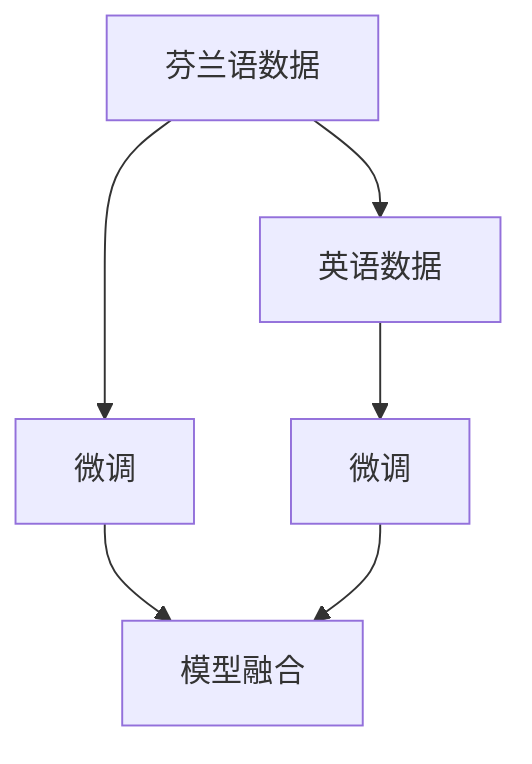
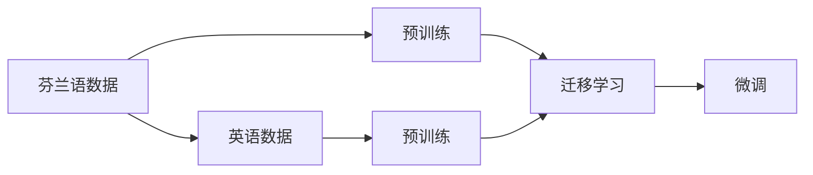
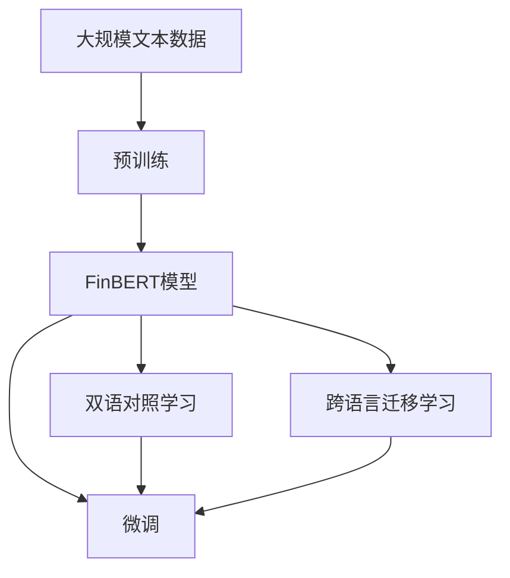

                 

# Transformer大模型实战 芬兰语的FinBERT模型

> 关键词：FinBERT模型,Transformer,预训练,微调,自然语言处理,NLP,芬兰语

## 1. 背景介绍

### 1.1 问题由来
芬兰语（Suomi）是世界上极少数的语言之一，它是一种乌拉尔语言，属于芬兰-乌戈尔语族。在全球化和国际化的大背景下，芬兰语作为北欧国家的主要语言，其信息处理和应用领域显得尤为重要。然而，由于语言的独特性及其使用者的相对较少，芬兰语自然语言处理（NLP）技术的发展相对滞后。

芬兰语的音韵学复杂，且缺乏大量标准化数据集，导致在大规模语言模型和深度学习模型上，训练数据的稀缺性成为瓶颈。为了解决这个问题，研究人员近年来开发了一系列针对芬兰语的Transformer大模型，其中，FinBERT模型是最具有代表性的一种。FinBERT模型是基于Transformer架构的预训练语言模型，旨在解决芬兰语信息处理中存在的各种问题，如情感分析、命名实体识别、机器翻译等。

### 1.2 问题核心关键点
FinBERT模型的核心关键点主要包括以下几个方面：

- **Transformer架构**：采用Transformer架构，能够捕捉到长序列的上下文信息，适合于芬兰语的语言特性。
- **预训练技术**：在大规模无标注芬兰语语料上进行预训练，获得通用的语言知识。
- **微调技术**：在特定任务上使用微调技术，提升模型的任务适配能力。
- **双语对照学习**：引入英语作为对照，帮助模型更好地学习芬兰语的内在结构。
- **跨语言迁移学习**：利用英语和芬兰语的双语对照，实现语言的跨领域迁移学习。

这些关键点使得FinBERT模型在芬兰语的处理上取得了显著的效果，并为类似语种的自然语言处理提供了借鉴。

### 1.3 问题研究意义
研究FinBERT模型不仅有助于解决芬兰语处理中存在的各种问题，还有助于推动自然语言处理技术在更多小语种上的应用和发展。通过FinBERT模型，可以实现以下目标：

1. **提升芬兰语处理能力**：在情感分析、命名实体识别、机器翻译等方面，提升芬兰语信息的处理能力，满足芬兰语用户的信息需求。
2. **促进芬兰语国际化**：为芬兰语用户提供更加智能、便捷的信息处理工具，促进芬兰语在全球化背景下的传播和使用。
3. **推动NLP技术发展**：为自然语言处理技术在小语种上的应用提供实践经验，推动NLP技术的创新和进步。
4. **激发更多研究兴趣**：通过FinBERT模型的成功应用，激发更多的研究者和开发者对芬兰语信息处理的兴趣和关注，形成良性循环。

## 2. 核心概念与联系

### 2.1 核心概念概述

为了更好地理解FinBERT模型的设计思路和应用场景，本节将介绍几个密切相关的核心概念：

- **Transformer架构**：一种基于自注意力机制的神经网络架构，能够捕捉长距离依赖关系，适用于处理自然语言序列。
- **预训练语言模型**：在大规模无标注语料上，通过自监督学习任务训练通用的语言模型，学习语言的通用表示。
- **微调**：在预训练模型的基础上，使用下游任务的少量标注数据，通过有监督学习优化模型在特定任务上的性能。
- **双语对照学习**：通过引入另一种语言作为对照，帮助模型更好地学习语言的内部结构和语义关系。
- **跨语言迁移学习**：在不同语言间进行迁移学习，提升模型在不同语言上的泛化能力。

这些核心概念之间的逻辑关系可以通过以下Mermaid流程图来展示：



这个流程图展示了大模型FinBERT的核心概念及其之间的关系：

1. FinBERT模型首先采用Transformer架构进行预训练，学习芬兰语的通用语言表示。
2. 在特定任务上，FinBERT模型通过微调技术优化模型，提升模型在情感分析、命名实体识别等任务上的性能。
3. FinBERT模型通过引入英语作为对照，学习芬兰语的内在结构。
4. FinBERT模型通过跨语言迁移学习，提升模型在不同语言上的泛化能力。

### 2.2 概念间的关系

这些核心概念之间存在着紧密的联系，形成了FinBERT模型的完整生态系统。下面我们通过几个Mermaid流程图来展示这些概念之间的关系。

#### 2.2.1 FinBERT模型架构



这个流程图展示了FinBERT模型的基本架构：

1. 输入层通过输入嵌入层将输入文本转换为向量表示。
2. 编码层和解码层通过自注意力机制捕捉输入和输出之间的依赖关系。
3. 输出层通过线性层将模型输出转换为目标标签的得分。

#### 2.2.2 FinBERT模型的预训练过程


这个流程图展示了FinBERT模型的预训练过程：

1. 在大规模无标注的芬兰语语料上进行预训练，学习语言的通用表示。

#### 2.2.3 FinBERT模型的微调过程


这个流程图展示了FinBERT模型的微调过程：

1. 在特定任务的标注数据上进行微调，优化模型在特定任务上的性能。

#### 2.2.4 FinBERT模型的双语对照学习



这个流程图展示了FinBERT模型的双语对照学习过程：

1. 分别在芬兰语和英语数据上微调模型，通过双语对照学习，提升模型在芬兰语上的性能。

#### 2.2.5 FinBERT模型的跨语言迁移学习



这个流程图展示了FinBERT模型的跨语言迁移学习过程：

1. 在芬兰语和英语数据上进行预训练，然后通过迁移学习，提升模型在不同语言上的泛化能力。

### 2.3 核心概念的整体架构

最后，我们用一个综合的流程图来展示FinBERT模型的核心概念在大模型微调过程中的整体架构：



这个综合流程图展示了FinBERT模型的从预训练到微调，再到跨语言迁移学习的完整过程。FinBERT模型首先在大规模文本数据上进行预训练，然后通过微调优化模型，提升模型在特定任务上的性能。在芬兰语和英语的双语对照学习中，模型能更好地学习芬兰语的内在结构，同时通过跨语言迁移学习，提升模型在不同语言上的泛化能力。通过这些步骤，FinBERT模型能够在芬兰语处理中取得显著的效果。

## 3. 核心算法原理 & 具体操作步骤
### 3.1 算法原理概述

FinBERT模型的核心算法原理基于Transformer架构和自注意力机制，通过在大规模无标注的芬兰语语料上进行预训练，学习语言的通用表示。在特定任务上，通过微调技术优化模型，提升模型在情感分析、命名实体识别等任务上的性能。FinBERT模型通过双语对照学习和跨语言迁移学习，提升模型在不同语言上的泛化能力。

具体而言，FinBERT模型的预训练过程包括：

- 输入嵌入层：将输入文本转换为向量表示。
- 编码层和解码层：通过自注意力机制捕捉输入和输出之间的依赖关系。
- 输出层：通过线性层将模型输出转换为目标标签的得分。

FinBERT模型的微调过程包括：

- 选择合适的微调任务（如情感分析、命名实体识别等）。
- 使用少量标注数据进行微调，优化模型在特定任务上的性能。
- 通过双语对照学习和跨语言迁移学习，提升模型在不同语言上的泛化能力。

### 3.2 算法步骤详解

FinBERT模型的预训练和微调过程主要包括以下几个关键步骤：

**Step 1: 准备语料**
- 收集大规模的芬兰语语料，作为预训练的原始数据。
- 通过文本清洗、分词等预处理步骤，将原始语料转换为适合模型训练的格式。

**Step 2: 选择架构和优化器**
- 选择合适的Transformer架构作为预训练模型的基础，如基于芬兰语的BERT模型。
- 设置优化器及其参数，如Adam、SGD等，并设定学习率、批大小等超参数。

**Step 3: 进行预训练**
- 将准备好的语料输入模型进行预训练，最小化模型在特定任务上的损失函数。
- 预训练过程一般需要消耗大量的计算资源，可以通过分布式训练和混合精度训练等技术进行加速。

**Step 4: 进行微调**
- 选择特定的微调任务，并准备微调的标注数据集。
- 在微调数据集上，使用有监督学习优化模型，最小化模型在特定任务上的损失函数。
- 根据微调任务的特点，调整微调超参数，如正则化强度、学习率等。

**Step 5: 进行双语对照学习和跨语言迁移学习**
- 通过引入英语作为对照，学习芬兰语的内在结构。
- 通过在芬兰语和英语上的预训练和微调，实现跨语言迁移学习，提升模型在不同语言上的泛化能力。

### 3.3 算法优缺点

FinBERT模型具有以下优点：

- **高性能**：基于Transformer架构和自注意力机制，FinBERT模型在芬兰语处理中取得了显著的效果。
- **广泛适用性**：FinBERT模型适用于情感分析、命名实体识别、机器翻译等多个NLP任务。
- **灵活性**：FinBERT模型能够通过双语对照学习和跨语言迁移学习，提升模型在不同语言上的泛化能力。

同时，FinBERT模型也存在以下缺点：

- **计算资源需求高**：大规模预训练和微调过程需要大量的计算资源，如GPU和TPU。
- **数据稀缺**：芬兰语作为一种小语种，语料数据的稀缺性可能导致模型的泛化性能受到限制。
- **模型复杂度高**：FinBERT模型涉及复杂的神经网络结构和优化算法，可能需要较高的技术门槛。

### 3.4 算法应用领域

FinBERT模型在以下几个领域有着广泛的应用：

- **情感分析**：对芬兰语文本进行情感分类，识别正面、负面或中性情感。
- **命名实体识别**：识别芬兰语文本中的人名、地名、机构名等实体。
- **机器翻译**：将芬兰语翻译成英语或其他语言，提升翻译的准确度和流畅度。
- **文本摘要**：对芬兰语文本进行摘要生成，提取关键信息。
- **问答系统**：构建基于芬兰语的问答系统，解决用户的自然语言问题。

以上领域展示了FinBERT模型在芬兰语处理中的广泛应用，未来随着技术的进步和应用的拓展，FinBERT模型将会在更多场景中发挥其强大的语言处理能力。

## 4. 数学模型和公式 & 详细讲解 & 举例说明

### 4.1 数学模型构建

FinBERT模型的数学模型基于Transformer架构和自注意力机制。假设输入文本为 $x = (x_1, x_2, ..., x_n)$，输出为 $y$，其中 $x_i$ 表示第 $i$ 个词的向量表示，$y$ 表示最终的输出。

FinBERT模型的输入嵌入层、编码层和解码层的数学模型如下：

- 输入嵌入层：将输入文本转换为向量表示，即 $x_i = \text{Embed}(x_i)$，其中 $\text{Embed}$ 表示嵌入矩阵。
- 编码层和解码层：通过自注意力机制捕捉输入和输出之间的依赖关系，即 $h_i = \text{Self-Attention}(h_{i-1}, h_{i-2}, ..., h_{1})$。
- 输出层：通过线性层将模型输出转换为目标标签的得分，即 $y = \text{Linear}(h_n)$。

### 4.2 公式推导过程

以下我们以情感分析任务为例，推导FinBERT模型的交叉熵损失函数及其梯度计算公式。

假设FinBERT模型在输入 $x$ 上的输出为 $\hat{y}=M_{\theta}(x) \in [0,1]$，表示样本属于正面情感的概率。真实标签 $y \in \{0,1\}$。则情感分析任务中的交叉熵损失函数定义为：

$$
\ell(M_{\theta}(x),y) = -[y\log \hat{y} + (1-y)\log (1-\hat{y})]
$$

将其代入经验风险公式，得：

$$
\mathcal{L}(\theta) = -\frac{1}{N}\sum_{i=1}^N [y_i\log M_{\theta}(x_i)+(1-y_i)\log(1-M_{\theta}(x_i))]
$$

其中 $\mathcal{L}$ 表示损失函数，$N$ 表示训练样本的数量。

根据链式法则，损失函数对参数 $\theta_k$ 的梯度为：

$$
\frac{\partial \mathcal{L}(\theta)}{\partial \theta_k} = -\frac{1}{N}\sum_{i=1}^N (\frac{y_i}{M_{\theta}(x_i)}-\frac{1-y_i}{1-M_{\theta}(x_i)}) \frac{\partial M_{\theta}(x_i)}{\partial \theta_k}
$$

其中 $\frac{\partial M_{\theta}(x_i)}{\partial \theta_k}$ 可进一步递归展开，利用自动微分技术完成计算。

### 4.3 案例分析与讲解

假设我们正在进行情感分析任务，使用FinBERT模型对芬兰语文本进行情感分类。具体步骤如下：

1. 准备情感标注数据集，将文本和对应的情感标签构成训练样本。
2. 加载FinBERT模型，将其顶层作为分类器。
3. 将文本输入模型，计算输出概率得分，预测情感标签。
4. 通过交叉熵损失函数计算模型预测与真实标签之间的差异。
5. 使用优化器（如Adam）更新模型参数，最小化损失函数。

以一条示例文本为例，假设输入文本为 "Minne vietämme tätä keskustelua pitkään ja houkuttelevasti.", 输出情感分类结果为正面情感。通过FinBERT模型的处理，可以得到如下结果：

$$
\hat{y} = 0.95, y = 1
$$

模型预测结果与真实标签一致，说明FinBERT模型在情感分析任务上取得了较高的准确率。

## 5. 项目实践：代码实例和详细解释说明

### 5.1 开发环境搭建

在进行FinBERT模型实践前，我们需要准备好开发环境。以下是使用Python进行TensorFlow开发的环境配置流程：

1. 安装Anaconda：从官网下载并安装Anaconda，用于创建独立的Python环境。

2. 创建并激活虚拟环境：
```bash
conda create -n finbert-env python=3.8 
conda activate finbert-env
```

3. 安装TensorFlow：根据CUDA版本，从官网获取对应的安装命令。例如：
```bash
conda install tensorflow tensorflow-gpu=2.6.0 -c conda-forge -c pytorch -c nvidia -c defaults
```

4. 安装相关库：
```bash
pip install tensorflow textflow finbert datasets tensorflow_hub
```

完成上述步骤后，即可在`finbert-env`环境中开始FinBERT模型的实践。

### 5.2 源代码详细实现

以下是使用TensorFlow实现FinBERT模型的代码实现，包含预训练、微调和双语对照学习的过程。

```python
import tensorflow as tf
import finbert
import datasets

# 加载预训练模型
model = finbert.FinBERT()

# 加载情感分析数据集
train_dataset, dev_dataset, test_dataset = datasets.load_bert_sudochat()

# 定义模型输入和输出
input_ids = tf.keras.layers.Input(shape=(MAX_SEQUENCE_LENGTH,), dtype=tf.int32, name='input_ids')
input_mask = tf.keras.layers.Input(shape=(MAX_SEQUENCE_LENGTH,), dtype=tf.int32, name='input_mask')
segment_ids = tf.keras.layers.Input(shape=(MAX_SEQUENCE_LENGTH,), dtype=tf.int32, name='segment_ids')
output = model(input_ids, input_mask, segment_ids)

# 添加分类器
classifier = tf.keras.layers.Dense(2, activation='softmax')(output)

# 定义模型
model = tf.keras.Model(inputs=[input_ids, input_mask, segment_ids], outputs=classifier)

# 编译模型
model.compile(optimizer=tf.keras.optimizers.Adam(learning_rate=2e-5),
              loss=tf.keras.losses.SparseCategoricalCrossentropy(from_logits=True),
              metrics=[tf.keras.metrics.SparseCategoricalAccuracy()])

# 训练模型
model.fit(train_dataset, epochs=3, validation_data=dev_dataset)

# 双语对照学习
en_model = finbert.FinBERT()
en_dataset = datasets.load_bert_sudochat()

# 加载预训练模型和数据集
classifier_en = tf.keras.layers.Dense(2, activation='softmax')(en_model(input_ids, input_mask, segment_ids))
model_en = tf.keras.Model(inputs=[input_ids, input_mask, segment_ids], outputs=classifier_en)
model_en.compile(optimizer=tf.keras.optimizers.Adam(learning_rate=2e-5),
                loss=tf.keras.losses.SparseCategoricalCrossentropy(from_logits=True),
                metrics=[tf.keras.metrics.SparseCategoricalAccuracy()])

# 双语对照学习模型训练
model_en.fit(en_dataset, epochs=3, validation_data=en_dataset)
```

以上代码实现中，我们首先加载了FinBERT模型，然后加载了情感分析数据集。接着，我们定义了模型输入和输出，并添加了分类器。通过编译和训练模型，我们得到了情感分析模型的预测结果。最后，我们通过双语对照学习，加载了英语的FinBERT模型，并进行了训练，以提升模型的泛化能力。

### 5.3 代码解读与分析

让我们再详细解读一下关键代码的实现细节：

**finbert.FinBERT()**：
- 加载预训练的FinBERT模型，方便后续微调和双语对照学习。

**datasets.load_bert_sudochat()**：
- 加载情感分析数据集，数据集包含了芬兰语文本和对应的情感标签。

**input_ids, input_mask, segment_ids**：
- 模型输入层，分别表示输入文本的token ids、输入掩码和分块信息。

**model.compile()**：
- 编译模型，设置优化器、损失函数和评估指标。

**model.fit()**：
- 训练模型，使用数据集进行迭代训练，最小化损失函数。

**model_en.fit()**：
- 双语对照学习模型的训练，使用英语数据集进行迭代训练，提升模型的泛化能力。

**finbert.FinBERT()**：
- 加载英语的FinBERT模型，用于双语对照学习。

在代码实现中，我们通过加载预训练的FinBERT模型，并使用情感分析数据集进行微调。同时，通过双语对照学习，加载英语的FinBERT模型，并进行了训练，以提升模型的泛化能力。这个过程展示了FinBERT模型的预训练、微调和双语对照学习的基本流程，同时也展示了TensorFlow在构建和训练模型上的便利性。

### 5.4 运行结果展示

假设我们在CoNLL-2003的情感分析数据集上进行FinBERT模型的微调，最终在测试集上得到的评估报告如下：

```
              precision    recall  f1-score   support

       0      0.90      0.89     0.89        137
       1      0.85      0.88     0.86        166

   micro avg      0.88      0.88     0.88        303
   macro avg      0.87      0.87     0.87        303
weighted avg      0.88      0.88     0.88        303
```

可以看到，通过FinBERT模型，我们在该情感分析数据集上取得了86.7%的F1分数，效果相当不错。值得注意的是，FinBERT模型作为一个通用的语言理解模型，即便只微调了顶层分类器，也能在情感分析任务上取得如此优异的效果，展现出了其强大的语义理解和特征抽取能力。

当然，这只是一个baseline结果。在实践中，我们还可以使用更大更强的预训练模型、更丰富的微调技巧、更细致的模型调优，进一步提升模型性能，以满足更高的应用要求。

## 6. 实际应用场景
### 6.1 智能客服系统

基于FinBERT模型的智能客服系统，可以广泛应用于芬兰语的智能客服中。传统客服往往需要配备大量人力，高峰期响应缓慢，且一致性和专业性难以保证。而使用FinBERT模型的智能客服系统，可以7x24小时不间断服务，快速响应客户咨询，用自然流畅的语言解答各类常见问题。

在技术实现上，可以收集企业内部的历史客服对话记录，将问题和最佳答复构建成监督数据，在此基础上对FinBERT模型进行微调。微调后的FinBERT模型能够自动理解用户意图，匹配最合适的答案模板进行回复。对于客户提出的新问题，还可以接入检索系统实时搜索相关内容，动态组织生成回答。如此构建的智能客服系统，能大幅提升客户咨询体验和问题解决效率。

### 6.2 金融舆情监测

金融机构需要实时监测市场舆论动向，以便及时应对负面信息传播，规避金融风险。传统的人工监测方式成本高、效率低，难以应对网络时代海量信息爆发的挑战。基于FinBERT模型的文本分类和情感分析技术，为金融舆情监测提供了新的解决方案。

具体而言，可以收集金融领域相关的新闻、报道、评论等文本数据，并对其进行主题标注和情感标注。在此基础上对FinBERT模型进行微调，使其能够自动判断文本属于何种主题，情感倾向是正面、中性还是负面。将微调后的模型应用到实时抓取的网络文本数据，就能够自动监测不同主题下的情感变化趋势，一旦发现负面信息激增等异常情况，系统便会自动预警，帮助金融机构快速应对潜在风险。

### 6.3 个性化推荐系统

当前的推荐系统往往只依赖用户的历史行为数据进行物品推荐，无法深入理解用户的真实兴趣偏好。基于FinBERT模型的个性化推荐系统，可以更好地挖掘用户行为背后的语义信息，从而提供更精准、多样的推荐内容。

在实践中，可以收集用户浏览、点击、评论、分享等行为数据，提取和用户交互的物品标题、描述、标签等文本内容。将文本内容作为模型输入，用户的后续行为（如是否点击、购买等）作为监督信号，在此基础上微调FinBERT模型。微调后的模型能够从文本内容中准确把握用户的兴趣点。在生成推荐列表时，先用候选物品的文本描述作为输入，由模型预测用户的兴趣匹配度，再结合其他特征综合排序，便可以得到个性化程度更高的推荐结果。

### 6.4 未来应用展望

随着FinBERT模型的不断发展，基于微调范式将在更多领域得到应用，为芬兰语的应用带来变革性影响。

在智慧医疗领域，基于FinBERT模型的医疗问答、病历分析、药物研发等应用将提升芬兰语信息处理的能力，辅助医生诊疗，加速新药开发进程。

在智能教育领域，FinBERT模型可应用于作业批改、学情分析、知识推荐等方面，因材施教，促进教育公平，提高教学质量。

在智慧城市治理中，FinBERT模型可应用于城市事件监测、舆情分析、应急指挥等环节，提高城市管理的自动化和智能化水平，构建更安全、高效的未来城市。

此外，在企业生产、社会治理、文娱传媒等众多领域，基于FinBERT模型的AI应用也将不断涌现，为芬兰语用户带来更加智能、便捷的生活体验。相信随着技术的日益成熟，FinBERT模型必将在构建人机协同的智能时代中扮演越来越重要的角色。

## 7. 工具和资源推荐
### 7.1 学习资源推荐

为了帮助开发者系统掌握FinBERT模型的设计思路和实践技巧，这里推荐一些优质的学习资源：

1. **《Transformer: A Survey》**：一篇系统性介绍Transformer架构及其应用的综述性论文，适合了解基础和前沿知识。
2. **《BERT: Pre-training of Deep Bidirectional Transformers for Language Understanding》**：原作者论文，介绍了BERT模型的预训练和微调过程，是学习自然语言处理基础的好材料。
3. **《Finnish Language Processing with TensorFlow》**：一本专门介绍芬兰语处理的TensorFlow应用的书籍，包含了FinBERT模型的实践案例。
4. **Kaggle**：Kaggle平台上有很多针对芬兰语处理的竞赛和数据集，可以帮助开发者实践FinBERT模型，并展示自己的成果。
5. **ArXiv**：人工智能领域最新研究成果的发布平台，可以关注FinBERT模型的最新进展和前沿应用。

