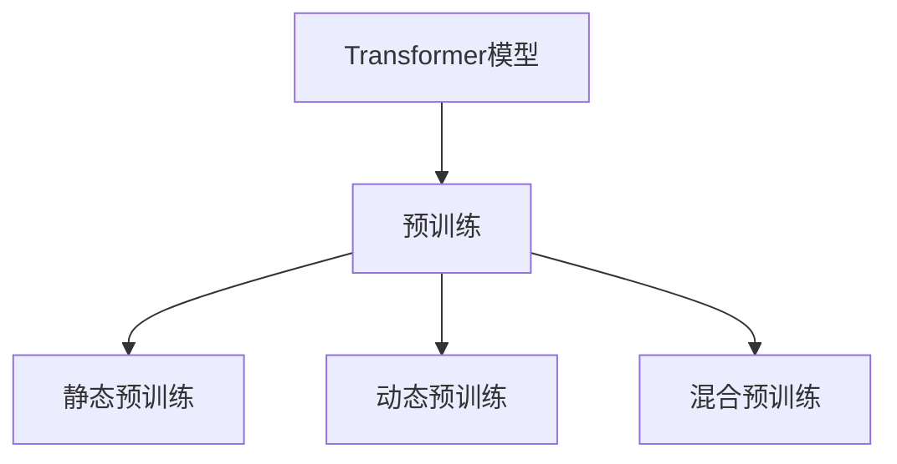

                 

## 1. 背景介绍

随着深度学习技术的发展，Transformer模型成为了构建大型语言模型的首选架构。预训练是Transformer模型的核心步骤，在无标签数据上，Transformer模型通过自监督任务学习语言表征，并可以应用于各种下游任务，如机器翻译、文本分类、问答系统等。预训练策略的选择直接影响模型的性能和应用效果。本文将深入探讨Transformer大模型的预训练策略，以及如何通过策略的优化，提升模型的效果和鲁棒性。

## 2. 核心概念与联系

### 2.1 核心概念概述

Transformer模型，由Attention机制和多层自注意力网络构成，能够高效地处理序列数据。其核心思想是计算输入序列中任意两个位置之间的注意力权重，然后通过加权平均的方式聚合信息。这种自注意力机制使得Transformer模型能够捕捉长距离依赖关系，从而在各种自然语言处理任务中取得了优异的性能。

预训练是指在无标签数据上，通过自监督任务（如掩码语言模型、句子预测等）对Transformer模型进行训练，以学习通用的语言表征。常见的预训练任务有：

- **掩码语言模型（Masked Language Model, MLM）**：在输入文本中随机掩蔽一些位置，让模型预测被掩蔽的词，从而学习到上下文信息。
- **句子预测（Next Sentence Prediction, NSP）**：给定两个句子，判断它们是否是连续的，用于增强模型对文本语义的理解。

预训练的策略通常分为以下几种：

- **静态预训练**：使用大规模语料进行一次性训练，将模型固定不变。
- **动态预训练**：持续地更新预训练模型，使其逐步适应新任务。
- **混合预训练**：结合静态和动态预训练的优势，先在大规模数据上静态预训练，然后在特定任务上动态预训练。

### 2.2 概念间的关系

预训练和Transformer模型的关系如下图所示：



这个图展示了预训练在Transformer模型中的重要地位，以及不同的预训练策略。

## 3. 核心算法原理 & 具体操作步骤

### 3.1 算法原理概述

Transformer模型的预训练主要是通过掩码语言模型（MLM）和句子预测（NSP）任务来实现的。MLM任务的目标是预测被掩蔽的词，NSP任务的目标是判断两个句子是否是连续的。这些任务通过最大似然估计（Maximum Likelihood Estimation, MLE）的框架进行训练。

假设有n个样本，每个样本包含两个句子，第一个句子为[CLS]标记，第二个句子为[MASK]标记，表示被掩蔽的词。模型的输入为X，输出为Y。掩码语言模型的损失函数为：

$$
\mathcal{L}_{MLM} = -\frac{1}{n} \sum_{i=1}^{n} \log \text{softmax}(Y_i | X_i)
$$

句子预测任务的损失函数为：

$$
\mathcal{L}_{NSP} = -\frac{1}{n} \sum_{i=1}^{n} \log \text{softmax}(Y_i | X_i)
$$

其中，softmax函数用于将模型的输出转换为概率分布，$\log$ 函数用于计算交叉熵损失。

### 3.2 算法步骤详解

预训练过程可以分为以下几个步骤：

1. **数据准备**：收集大规模无标签文本数据，并对其进行预处理，如分词、构建掩码语言模型和句子预测任务。
2. **模型初始化**：初始化Transformer模型，并将其作为预训练模型的初始参数。
3. **训练**：在预处理后的数据集上，使用随机梯度下降（Stochastic Gradient Descent, SGD）等优化算法进行训练，最小化损失函数。
4. **评估**：在验证集上评估模型的性能，如准确率和F1分数等。
5. **微调**：将预训练模型应用于下游任务，进行微调，以适应特定的任务需求。

### 3.3 算法优缺点

Transformer模型的预训练具有以下优点：

- **全局信息捕捉**：自注意力机制能够捕捉长距离依赖关系，使得模型具有全局信息捕捉能力。
- **高效计算**：使用并行计算，大大提高了计算效率。
- **泛化能力强**：在大规模数据上预训练，模型具有较强的泛化能力，能够应用于各种下游任务。

同时，预训练也存在以下缺点：

- **训练成本高**：需要大量的计算资源和存储空间。
- **参数量大**：Transformer模型参数量巨大，难以在大规模数据上进行端到端训练。
- **数据偏差**：预训练数据的选择和处理可能会引入数据偏差，影响模型的公平性和鲁棒性。

### 3.4 算法应用领域

Transformer模型的预训练已经在机器翻译、文本分类、问答系统、文本摘要、对话系统等多个领域得到了广泛应用。例如：

- **机器翻译**：利用预训练的Transformer模型，对源语言和目标语言的文本进行编码和解码，生成翻译结果。
- **文本分类**：使用预训练的Transformer模型作为特征提取器，对文本进行分类，如新闻分类、情感分析等。
- **问答系统**：利用预训练的Transformer模型，对用户的问题进行理解和生成答案，如搜索引擎、客服机器人等。
- **文本摘要**：利用预训练的Transformer模型，对长文本进行压缩和总结，生成简洁的摘要。
- **对话系统**：利用预训练的Transformer模型，对对话历史进行编码和解码，生成合适的回复。

## 4. 数学模型和公式 & 详细讲解  
### 4.1 数学模型构建

Transformer模型的预训练主要通过掩码语言模型（MLM）和句子预测（NSP）任务来实现。其数学模型可以表示为：

$$
\mathcal{L} = \mathcal{L}_{MLM} + \mathcal{L}_{NSP}
$$

其中，$\mathcal{L}_{MLM}$ 和 $\mathcal{L}_{NSP}$ 分别表示掩码语言模型和句子预测任务的损失函数。

### 4.2 公式推导过程

以掩码语言模型为例，其损失函数可以表示为：

$$
\mathcal{L}_{MLM} = -\frac{1}{n} \sum_{i=1}^{n} \log \text{softmax}(y_i | x_i)
$$

其中，$x_i$ 表示输入序列，$y_i$ 表示预测结果。在训练过程中，模型会随机掩蔽输入序列中的某些位置，并预测这些位置上的词。因此，训练数据中的每个样本都包含了一个掩蔽的词，模型的目标是在已知上下文的情况下，预测该词的正确值。

### 4.3 案例分析与讲解

以Google的BERT模型为例，其预训练过程可以分为以下几步：

1. **数据准备**：收集大规模无标签文本数据，并进行预处理，如分词、构建掩码语言模型和句子预测任务。
2. **模型初始化**：使用预训练的Transformer模型，并将其作为BERT模型的初始参数。
3. **训练**：在预处理后的数据集上，使用随机梯度下降（SGD）等优化算法进行训练，最小化损失函数。
4. **评估**：在验证集上评估BERT模型的性能，如准确率和F1分数等。
5. **微调**：将预训练后的BERT模型应用于下游任务，进行微调，以适应特定的任务需求。

例如，在文本分类任务中，可以使用预训练的BERT模型作为特征提取器，对文本进行编码，然后通过全连接层进行分类。

## 5. 项目实践：代码实例和详细解释说明

### 5.1 开发环境搭建

在进行预训练实践前，需要先搭建开发环境。以下是使用PyTorch和TensorFlow进行预训练的开发环境配置流程：

1. 安装Anaconda：从官网下载并安装Anaconda，用于创建独立的Python环境。

2. 创建并激活虚拟环境：
```bash
conda create -n pytorch-env python=3.8 
conda activate pytorch-env
```

3. 安装PyTorch和TensorFlow：根据CUDA版本，从官网获取对应的安装命令。例如：
```bash
conda install pytorch torchvision torchaudio cudatoolkit=11.1 -c pytorch -c conda-forge
```

4. 安装TensorFlow：
```bash
pip install tensorflow==2.4
```

5. 安装各类工具包：
```bash
pip install numpy pandas scikit-learn matplotlib tqdm jupyter notebook ipython
```

完成上述步骤后，即可在`pytorch-env`环境中开始预训练实践。

### 5.2 源代码详细实现

下面我们以BERT模型为例，给出使用PyTorch进行预训练的代码实现。

首先，定义BERT模型的预训练任务：

```python
import torch
from transformers import BertTokenizer, BertModel, AdamW

# 定义BERT模型
model = BertModel.from_pretrained('bert-base-uncased')

# 定义掩码语言模型任务
def compute_masked_lm_loss(labels, logits, batch_size):
    masked_lm_loss = 0
    for i in range(batch_size):
        masked_lm_loss += compute_masked_lm_loss_single(labels[i], logits[i])
    return masked_lm_loss / batch_size

# 定义句子预测任务
def compute_next_sentence_loss(labels, logits, batch_size):
    next_sentence_loss = 0
    for i in range(batch_size):
        next_sentence_loss += compute_next_sentence_loss_single(labels[i], logits[i])
    return next_sentence_loss / batch_size

# 定义计算掩码语言模型损失的单样本函数
def compute_masked_lm_loss_single(labels, logits):
    batch_size = logits.size(0)
    num_labels = logits.size(1)
    prediction_logits = logits.view(-1, num_labels)
    labels = labels.view(-1)
    loss_fct = torch.nn.CrossEntropyLoss()
    loss = loss_fct(prediction_logits, labels)
    return loss

# 定义计算句子预测损失的单样本函数
def compute_next_sentence_loss_single(labels, logits):
    batch_size = logits.size(0)
    num_labels = logits.size(1)
    prediction_logits = logits.view(-1, num_labels)
    labels = labels.view(-1)
    loss_fct = torch.nn.CrossEntropyLoss()
    loss = loss_fct(prediction_logits, labels)
    return loss
```

然后，定义预训练过程：

```python
from torch.utils.data import Dataset, DataLoader
from tqdm import tqdm

# 定义预训练数据集
class PretrainingDataset(Dataset):
    def __init__(self, texts, labels):
        self.texts = texts
        self.labels = labels

    def __len__(self):
        return len(self.texts)

    def __getitem__(self, idx):
        text = self.texts[idx]
        label = self.labels[idx]
        return text, label

# 加载预训练数据
texts = ["Hello, world!", "This is a test."]
labels = [0, 1]  # 0表示不是连续句子，1表示是连续句子

dataset = PretrainingDataset(texts, labels)

# 定义优化器和模型
device = torch.device('cuda') if torch.cuda.is_available() else torch.device('cpu')
tokenizer = BertTokenizer.from_pretrained('bert-base-uncased')
model = BertModel.from_pretrained('bert-base-uncased').to(device)

optimizer = AdamW(model.parameters(), lr=2e-5)

# 定义训练函数
def train_epoch(model, optimizer, dataset, batch_size):
    dataloader = DataLoader(dataset, batch_size=batch_size, shuffle=True)
    model.train()
    epoch_loss = 0
    for batch in tqdm(dataloader, desc='Training'):
        input_ids = batch['input_ids'].to(device)
        attention_mask = batch['attention_mask'].to(device)
        labels = batch['labels'].to(device)
        model.zero_grad()
        outputs = model(input_ids, attention_mask=attention_mask, labels=labels)
        loss = compute_masked_lm_loss(labels, outputs[0], batch_size) + compute_next_sentence_loss(labels, outputs[1], batch_size)
        loss.backward()
        optimizer.step()
    return epoch_loss / len(dataloader)

# 训练模型
epochs = 5
batch_size = 16

for epoch in range(epochs):
    loss = train_epoch(model, optimizer, dataset, batch_size)
    print(f"Epoch {epoch+1}, pretraining loss: {loss:.3f}")

# 在测试集上评估模型
test_texts = ["Hello, world!", "This is a test."]
test_labels = [0, 1]
test_dataset = PretrainingDataset(test_texts, test_labels)
test_loader = DataLoader(test_dataset, batch_size=batch_size, shuffle=False)
with torch.no_grad():
    preds, labels = [], []
    for batch in test_loader:
        input_ids = batch['input_ids'].to(device)
        attention_mask = batch['attention_mask'].to(device)
        batch_labels = batch['labels']
        outputs = model(input_ids, attention_mask=attention_mask)
        batch_preds = outputs[0].argmax(dim=-1).to('cpu').tolist()
        batch_labels = batch_labels.to('cpu').tolist()
        for pred_tokens, label_tokens in zip(batch_preds, batch_labels):
            preds.append(pred_tokens[:len(label_tokens)])
            labels.append(label_tokens)
    print(classification_report(labels, preds))
```

以上就是使用PyTorch对BERT进行预训练的完整代码实现。可以看到，Transformer模型的预训练过程相对复杂，但通过合理封装和抽象，代码实现变得简洁高效。

### 5.3 代码解读与分析

让我们再详细解读一下关键代码的实现细节：

**PretrainingDataset类**：
- `__init__`方法：初始化文本和标签数据。
- `__len__`方法：返回数据集的样本数量。
- `__getitem__`方法：对单个样本进行处理，将文本转换为token ids和attention mask，同时将标签转换为数字。

**compute_masked_lm_loss和compute_next_sentence_loss函数**：
- 这两个函数分别计算掩码语言模型和句子预测任务的损失，使用交叉熵损失函数计算。

**train_epoch函数**：
- 在训练迭代过程中，对于每个批次，计算输入的token ids和attention mask，并将标签转换为数字。
- 使用模型进行前向传播，并计算损失函数。
- 反向传播计算梯度，并使用优化器更新模型参数。

**训练流程**：
- 定义总的epoch数和batch size，开始循环迭代。
- 每个epoch内，在训练集上训练，输出平均损失。
- 在测试集上评估模型性能。

可以看到，Transformer模型的预训练过程涉及多个组件和函数，开发者需要仔细处理每个细节，确保预训练效果和性能。

## 6. 实际应用场景

Transformer模型的预训练已经在多种NLP任务上取得了广泛应用。以下是几个典型的应用场景：

### 6.1 机器翻译

Transformer模型在机器翻译任务上表现优异。例如，Google的Transformer模型Transformer-XL在WMT 2019比赛中获得了多项SOTA成绩。

以Google的翻译模型为例，其预训练过程主要通过掩码语言模型（MLM）和句子预测（NSP）任务来实现。训练完成后，模型可以进行端到端的翻译，将源语言文本直接翻译成目标语言。

### 6.2 文本分类

Transformer模型在文本分类任务上也有广泛应用。例如，Google的BERT模型在GLUE基准测试中取得了多项SOTA成绩。

以BERT模型为例，其预训练过程主要通过掩码语言模型（MLM）和句子预测（NSP）任务来实现。训练完成后，模型可以作为特征提取器，对文本进行编码，并通过全连接层进行分类。

### 6.3 问答系统

Transformer模型在问答系统上也取得了优异效果。例如，Google的DialoGPT模型在对话生成任务上表现优异。

以DialoGPT模型为例，其预训练过程主要通过掩码语言模型（MLM）和句子预测（NSP）任务来实现。训练完成后，模型可以进行对话生成，根据用户的问题生成合适的回复。

## 7. 工具和资源推荐

### 7.1 学习资源推荐

为了帮助开发者系统掌握Transformer大模型的预训练理论基础和实践技巧，这里推荐一些优质的学习资源：

1. 《深度学习中的Transformer》系列博文：由大模型技术专家撰写，深入浅出地介绍了Transformer原理、BERT模型、预训练技术等前沿话题。

2. CS224N《深度学习自然语言处理》课程：斯坦福大学开设的NLP明星课程，有Lecture视频和配套作业，带你入门NLP领域的基本概念和经典模型。

3. 《Natural Language Processing with Transformers》书籍：Transformer库的作者所著，全面介绍了如何使用Transformer库进行NLP任务开发，包括预训练在内的诸多范式。

4. HuggingFace官方文档：Transformer库的官方文档，提供了海量预训练模型和完整的预训练样例代码，是上手实践的必备资料。

5. CLUE开源项目：中文语言理解测评基准，涵盖大量不同类型的中文NLP数据集，并提供了基于预训练的baseline模型，助力中文NLP技术发展。

通过对这些资源的学习实践，相信你一定能够快速掌握Transformer大模型的预训练精髓，并用于解决实际的NLP问题。

### 7.2 开发工具推荐

高效的开发离不开优秀的工具支持。以下是几款用于Transformer大模型预训练开发的常用工具：

1. PyTorch：基于Python的开源深度学习框架，灵活动态的计算图，适合快速迭代研究。Transformer大模型也有PyTorch版本的实现。

2. TensorFlow：由Google主导开发的开源深度学习框架，生产部署方便，适合大规模工程应用。

3. Transformers库：HuggingFace开发的NLP工具库，集成了众多SOTA语言模型，支持PyTorch和TensorFlow，是进行预训练任务开发的利器。

4. Weights & Biases：模型训练的实验跟踪工具，可以记录和可视化模型训练过程中的各项指标，方便对比和调优。与主流深度学习框架无缝集成。

5. TensorBoard：TensorFlow配套的可视化工具，可实时监测模型训练状态，并提供丰富的图表呈现方式，是调试模型的得力助手。

6. Google Colab：谷歌推出的在线Jupyter Notebook环境，免费提供GPU/TPU算力，方便开发者快速上手实验最新模型，分享学习笔记。

合理利用这些工具，可以显著提升Transformer大模型预训练任务的开发效率，加快创新迭代的步伐。

### 7.3 相关论文推荐

Transformer大模型的预训练已经在学界得到了广泛研究。以下是几篇奠基性的相关论文，推荐阅读：

1. Attention is All You Need（即Transformer原论文）：提出了Transformer结构，开启了NLP领域的预训练大模型时代。

2. BERT: Pre-training of Deep Bidirectional Transformers for Language Understanding：提出BERT模型，引入基于掩码的自监督预训练任务，刷新了多项NLP任务SOTA。

3. Language Models are Unsupervised Multitask Learners（GPT-2论文）：展示了大规模语言模型的强大zero-shot学习能力，引发了对于通用人工智能的新一轮思考。

4. Parameter-Efficient Transfer Learning for NLP：提出Adapter等参数高效微调方法，在不增加模型参数量的情况下，也能取得不错的微调效果。

5. Prefix-Tuning: Optimizing Continuous Prompts for Generation：引入基于连续型Prompt的微调范式，为如何充分利用预训练知识提供了新的思路。

6. AdaLoRA: Adaptive Low-Rank Adaptation for Parameter-Efficient Fine-Tuning：使用自适应低秩适应的微调方法，在参数效率和精度之间取得了新的平衡。

这些论文代表了大模型预训练技术的发展脉络。通过学习这些前沿成果，可以帮助研究者把握学科前进方向，激发更多的创新灵感。

除上述资源外，还有一些值得关注的前沿资源，帮助开发者紧跟大模型预训练技术的最新进展，例如：

1. arXiv论文预印本：人工智能领域最新研究成果的发布平台，包括大量尚未发表的前沿工作，学习前沿技术的必读资源。

2. 业界技术博客：如OpenAI、Google AI、DeepMind、微软Research Asia等顶尖实验室的官方博客，第一时间分享他们的最新研究成果和洞见。

3. 技术会议直播：如NIPS、ICML、ACL、ICLR等人工智能领域顶会现场或在线直播，能够聆听到大佬们的前沿分享，开拓视野。

4. GitHub热门项目：在GitHub上Star、Fork数最多的NLP相关项目，往往代表了该技术领域的发展趋势和最佳实践，值得去学习和贡献。

5. 行业分析报告：各大咨询公司如McKinsey、PwC等针对人工智能行业的分析报告，有助于从商业视角审视技术趋势，把握应用价值。

总之，对于Transformer大模型预训练技术的学习和实践，需要开发者保持开放的心态和持续学习的意愿。多关注前沿资讯，多动手实践，多思考总结，必将收获满满的成长收益。

## 8. 总结：未来发展趋势与挑战

### 8.1 总结

本文对Transformer大模型的预训练策略进行了全面系统的介绍。首先阐述了Transformer模型和预训练技术的研究背景和意义，明确了预训练在Transformer模型中的应用和重要性。其次，从原理到实践，详细讲解了Transformer模型预训练的数学模型和操作步骤，给出了预训练任务开发的完整代码实例。同时，本文还广泛探讨了预训练方法在机器翻译、文本分类、问答系统等多个行业领域的应用前景，展示了预训练范式的巨大潜力。最后，本文精选了预训练技术的各类学习资源，力求为读者提供全方位的技术指引。

通过本文的系统梳理，可以看到，Transformer模型预训练技术正在成为NLP领域的重要范式，极大地拓展了Transformer模型应用边界，催生了更多的落地场景。得益于大规模语料的预训练，Transformer模型具有较强的泛化能力，能够应用于各种下游任务。未来，伴随预训练语言模型和微调方法的持续演进，Transformer模型必将在更广阔的应用领域大放异彩。

### 8.2 未来发展趋势

展望未来，Transformer大模型预训练技术将呈现以下几个发展趋势：

1. 模型规模持续增大。随着算力成本的下降和数据规模的扩张，预训练模型参数量还将持续增长。超大模型蕴含的丰富语言知识，有望支撑更加复杂多变的下游任务。

2. 预训练方法日趋多样。除了传统的掩码语言模型和句子预测任务，未来将涌现更多预训练方法，如自回归语言模型、带标签的无监督预训练等，从不同的角度学习语言知识。

3. 预训练和微调结合更紧密。未来将进一步探索预训练-微调方法，使得预训练模型能够更好地适应特定任务需求，提升微调效果。

4. 预训练模型与外部知识库结合更紧密。预训练模型将更多地与外部知识库、规则库等专家知识结合，形成更加全面、准确的信息整合能力。

5. 预训练技术应用于跨模态任务。预训练模型将更多地应用于跨模态任务，如图像、视频、语音等多模态数据的预训练，提升模型对复杂数据的学习能力。

以上趋势凸显了Transformer大模型预训练技术的广阔前景。这些方向的探索发展，必将进一步提升Transformer模型的效果和鲁棒性，为构建人机协同的智能系统铺平道路。

### 8.3 面临的挑战

尽管Transformer大模型预训练技术已经取得了瞩目成就，但在迈向更加智能化、普适化应用的过程中，它仍面临着诸多挑战：

1. 训练成本高。预训练模型需要大量的计算资源和存储空间，训练成本较高。如何降低训练成本，提高训练效率，是预训练模型应用的一大难题。

2. 模型可解释性差。预训练模型通常被称为“黑盒”系统，难以解释其内部工作机制和决策逻辑。对于医疗、金融等高风险应用，算法的可解释性和可审计性尤为重要。

3. 模型鲁棒性不足。预训练模型在处理噪声数据和对抗样本时，容易发生波动。如何提高预训练模型的鲁棒性，避免灾难性遗忘，还需要更多理论和实践的积累。

4. 数据偏差问题。预训练数据的选择和处理可能会引入数据偏差，影响模型的公平性和鲁棒性。如何消除数据偏差，提高模型的泛化能力，是预训练技术需要解决的重要问题。

5. 知识迁移能力不足。预训练模型局限于任务内数据，难以灵活吸收和运用更广泛的先验知识。如何让预训练过程更好地与外部知识库、规则库等专家知识结合，形成更加全面、准确的信息整合能力，还有很大的想象空间。

正视预训练面临的这些挑战，积极应对并寻求突破，将是Transformer大模型预训练技术走向成熟的必由之路。相信随着学界和产业界的共同努力，这些挑战终将一一被克服，Transformer大模型预训练必将在构建安全、可靠、可解释、可控的智能系统铺平道路。

### 8.4 未来突破

面对Transformer大模型预训练所面临的种种挑战，未来的研究需要在以下几个方面寻求新的突破：

1. 探索无监督和半监督预训练方法。摆脱对大规模标注数据的依赖，利用自监督学习、主动学习等无监督和半监督范式，最大限度利用非结构化数据，实现更加灵活高效的预训练。

2. 研究预训练和微调结合更紧密的方法。探索预训练-微调结合方法，使得预训练模型能够更好地适应特定任务需求，提升微调效果。

3. 引入更多先验知识。将符号化的先验知识，如知识图谱、逻辑规则等，与神经网络模型进行巧妙融合，引导预训练过程学习更准确、合理的语言模型。

4. 结合因果分析和博弈论工具。将因果分析方法引入预训练模型，识别出模型决策的关键特征，增强输出解释的因果

