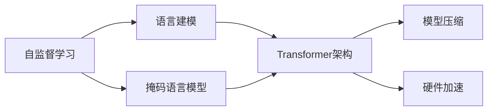

                 

# Transformer大模型实战 预训练过程

> 关键词：Transformer, 大模型, 预训练, 自监督学习, 语言建模, 预训练语言模型, 模型压缩, 硬件加速

## 1. 背景介绍

### 1.1 问题由来

近年来，Transformer模型作为深度学习领域的创新突破，以其卓越的性能和高效的训练方式迅速占据了主导地位。它在机器翻译、文本摘要、语音识别等多个NLP领域表现出色，甚至在图像识别、语音处理等领域也取得了显著成效。大模型的出现，更是进一步推动了Transformer技术的发展，使其在性能上更上一层楼。

然而，大模型的训练成本极高，训练数据集需要耗费大量资源和时间。因此，如何在大规模数据上高效地进行预训练，成为了当前研究的热点。预训练是指在大规模无标签数据上进行的自监督学习任务，通过自监督学习任务，模型能够学习到数据的隐含关系，构建出强大的语义表示能力。预训练过程通常分为两个阶段：无监督学习阶段和微调阶段。

无监督学习阶段，大模型会在大规模无标签数据上进行自监督学习任务，如语言建模、掩码语言模型等，以构建出完整的语义表示。微调阶段，大模型会在特定任务上使用少量标注数据进行微调，以适应具体任务的需求。本文将详细介绍Transformer大模型的预训练过程，帮助读者深入理解这一过程的原理和实现方法。

### 1.2 问题核心关键点

Transformer大模型的预训练过程主要包括以下几个关键点：

- **自监督学习**：利用大规模无标签数据进行自监督学习任务，构建语义表示。
- **Transformer架构**：采用Transformer架构进行无监督学习，利用自注意力机制提高模型效率和性能。
- **语言建模**：以文本语言建模为代表，学习文本数据中的隐含关系。
- **掩码语言模型**：通过随机掩盖文本中的部分信息，训练模型预测被掩盖的信息，以学习完整的语义表示。
- **模型压缩**：在大模型上进行压缩，以减小存储空间和计算复杂度。
- **硬件加速**：使用GPU等硬件设备加速模型训练过程。

这些关键点构成了Transformer大模型预训练的核心，本文将逐一详细介绍每个关键点，并展示其在实际项目中的应用。

## 2. 核心概念与联系

### 2.1 核心概念概述

为更好地理解Transformer大模型的预训练过程，本节将介绍几个关键概念：

- **自监督学习**：在大规模无标签数据上进行的自我指导学习，以学习数据的隐含关系。
- **Transformer架构**：一种基于自注意力机制的神经网络结构，用于处理序列数据。
- **语言建模**：以文本数据为输入，学习文本序列中的概率分布，以预测下一个单词或词组。
- **掩码语言模型**：在语言建模任务的基础上，通过随机掩盖部分文本信息，训练模型预测被掩盖的部分，以提高语言模型的泛化能力。
- **模型压缩**：通过各种技术手段，减小模型的存储空间和计算复杂度，以提高模型的可部署性和效率。
- **硬件加速**：利用GPU、TPU等高性能计算设备，加速模型的训练过程，以提高模型的训练效率。

这些概念构成了Transformer大模型预训练过程的基本框架，通过理解这些核心概念，我们可以更好地把握预训练过程的原理和实现方法。

### 2.2 概念间的关系

这些核心概念之间存在着紧密的联系，形成了Transformer大模型预训练的整体生态系统。下面我们通过一个Mermaid流程图来展示这些概念之间的关系：



这个流程图展示了自监督学习过程如何通过语言建模和掩码语言模型，在Transformer架构下进行预训练，并最终通过模型压缩和硬件加速等技术手段，提高模型的效率和可部署性。

## 3. 核心算法原理 & 具体操作步骤
### 3.1 算法原理概述

Transformer大模型的预训练过程基于自监督学习任务，利用大规模无标签数据，通过语言建模和掩码语言模型等任务，学习到数据的隐含关系，构建出强大的语义表示能力。具体而言，预训练过程包括以下几个关键步骤：

1. **分词与向量化**：将原始文本数据进行分词，并将单词转换为向量表示。
2. **语言建模**：通过预测下一个单词或词组，学习文本序列中的概率分布。
3. **掩码语言模型**：在语言建模任务的基础上，通过随机掩盖部分文本信息，训练模型预测被掩盖的部分。
4. **模型压缩**：通过各种技术手段，减小模型的存储空间和计算复杂度。
5. **硬件加速**：利用GPU、TPU等高性能计算设备，加速模型的训练过程。

### 3.2 算法步骤详解

以下我们将详细介绍Transformer大模型预训练的具体步骤：

**Step 1: 分词与向量化**

预训练数据的第一步是对原始文本进行分词，并使用预训练的词向量表示每个单词。常用的分词工具包括BERT分词器、spaCy等。

**Step 2: 构建语言模型**

语言模型通过预测下一个单词或词组，学习文本序列中的概率分布。常用的语言建模任务包括预测下一个单词、掩码语言模型等。

**Step 3: 构建掩码语言模型**

掩码语言模型在语言建模任务的基础上，通过随机掩盖部分文本信息，训练模型预测被掩盖的部分。通过掩码语言模型，模型可以学习到更完整的语义表示。

**Step 4: 模型压缩**

模型压缩是预训练过程中的重要步骤，通过各种技术手段，减小模型的存储空间和计算复杂度。常用的模型压缩技术包括剪枝、量化、低秩分解等。

**Step 5: 硬件加速**

硬件加速通过利用GPU、TPU等高性能计算设备，加速模型的训练过程。硬件加速是预训练过程必不可少的步骤，可以显著提高训练效率。

### 3.3 算法优缺点

Transformer大模型预训练的优点包括：

1. **高性能**：Transformer架构的高效计算能力，使预训练过程能够在大规模数据上高效进行。
2. **泛化能力强**：通过自监督学习任务，模型能够学习到数据的隐含关系，具有较强的泛化能力。
3. **模型压缩效率高**：通过模型压缩技术，可以有效减小模型的存储空间和计算复杂度，提高模型的可部署性。

预训练的缺点包括：

1. **训练成本高**：大规模数据集和计算资源的需求，使得预训练过程需要耗费大量时间和成本。
2. **模型复杂度高**：大模型往往具有复杂的结构，难以理解和调试。
3. **过度拟合风险**：模型在预训练过程中可能出现过度拟合现象，影响模型的泛化能力。

### 3.4 算法应用领域

Transformer大模型的预训练过程广泛应用于以下领域：

- **自然语言处理(NLP)**：在机器翻译、文本摘要、语音识别等领域，Transformer大模型通过预训练，取得了显著的效果。
- **计算机视觉**：在图像分类、目标检测等领域，Transformer大模型通过预训练，提高了模型的泛化能力和性能。
- **语音处理**：在语音识别、语音合成等领域，Transformer大模型通过预训练，提升了模型的理解和生成能力。

## 4. 数学模型和公式 & 详细讲解 & 举例说明

### 4.1 数学模型构建

Transformer大模型的预训练过程涉及到大量的数学模型和公式，下面我们将详细介绍这些模型和公式的构建。

**语言模型**：以文本数据为输入，学习文本序列中的概率分布。设文本序列为 $x_1, x_2, ..., x_n$，其中 $x_i$ 表示第 $i$ 个单词。语言模型通过预测下一个单词 $x_{i+1}$，学习文本序列的概率分布。语言模型的概率分布定义为：

$$
P(x_{i+1}|x_1, x_2, ..., x_i) = \frac{e^{W_{\textrm{LM}}(x_{i+1}|x_1, x_2, ..., x_i)}}{\sum_{j}e^{W_{\textrm{LM}}(j|x_1, x_2, ..., x_i)}}
$$

其中 $W_{\textrm{LM}}$ 表示语言模型的权重，可以通过反向传播算法进行训练。

**掩码语言模型**：在语言建模任务的基础上，通过随机掩盖部分文本信息，训练模型预测被掩盖的部分。掩码语言模型定义为：

$$
P(x_{i+1}|x_1, x_2, ..., x_i) = \frac{e^{W_{\textrm{MLM}}(x_{i+1}|M_i)}}{\sum_{j}e^{W_{\textrm{MLM}}(j|M_i)}}
$$

其中 $M_i$ 表示被掩盖的信息，可以通过随机选择部分位置进行掩盖。

**Transformer架构**：Transformer架构是一种基于自注意力机制的神经网络结构，用于处理序列数据。Transformer架构由编码器和解码器组成，编码器和解码器都由多个层堆叠而成，每个层包括多个多头自注意力机制和前馈神经网络。Transformer架构的概率分布定义为：

$$
P(x_{i+1}|x_1, x_2, ..., x_i) = \frac{e^{W_{\textrm{Transform}}(x_{i+1}|x_1, x_2, ..., x_i)}}{\sum_{j}e^{W_{\textrm{Transform}}(j|x_1, x_2, ..., x_i)}}
$$

其中 $W_{\textrm{Transform}}$ 表示Transformer架构的权重，可以通过反向传播算法进行训练。

### 4.2 公式推导过程

以下我们将详细介绍Transformer大模型预训练过程的公式推导过程。

**语言模型**：语言模型通过预测下一个单词或词组，学习文本序列中的概率分布。设文本序列为 $x_1, x_2, ..., x_n$，其中 $x_i$ 表示第 $i$ 个单词。语言模型的概率分布定义为：

$$
P(x_{i+1}|x_1, x_2, ..., x_i) = \frac{e^{W_{\textrm{LM}}(x_{i+1}|x_1, x_2, ..., x_i)}}{\sum_{j}e^{W_{\textrm{LM}}(j|x_1, x_2, ..., x_i)}}
$$

其中 $W_{\textrm{LM}}$ 表示语言模型的权重，可以通过反向传播算法进行训练。

**掩码语言模型**：在语言建模任务的基础上，通过随机掩盖部分文本信息，训练模型预测被掩盖的部分。掩码语言模型定义为：

$$
P(x_{i+1}|x_1, x_2, ..., x_i) = \frac{e^{W_{\textrm{MLM}}(x_{i+1}|M_i)}}{\sum_{j}e^{W_{\textrm{MLM}}(j|M_i)}}
$$

其中 $M_i$ 表示被掩盖的信息，可以通过随机选择部分位置进行掩盖。

**Transformer架构**：Transformer架构是一种基于自注意力机制的神经网络结构，用于处理序列数据。Transformer架构由编码器和解码器组成，编码器和解码器都由多个层堆叠而成，每个层包括多个多头自注意力机制和前馈神经网络。Transformer架构的概率分布定义为：

$$
P(x_{i+1}|x_1, x_2, ..., x_i) = \frac{e^{W_{\textrm{Transform}}(x_{i+1}|x_1, x_2, ..., x_i)}}{\sum_{j}e^{W_{\textrm{Transform}}(j|x_1, x_2, ..., x_i)}}
$$

其中 $W_{\textrm{Transform}}$ 表示Transformer架构的权重，可以通过反向传播算法进行训练。

### 4.3 案例分析与讲解

以下我们将详细介绍一个Transformer大模型的预训练案例，以帮助读者更好地理解预训练过程。

**案例：预训练BERT模型**

BERT模型是一种基于Transformer架构的大规模预训练语言模型。BERT模型通过在大规模无标签数据上进行自监督学习，学习到了丰富的语言知识和常识。BERT模型的预训练过程包括以下几个步骤：

1. **分词与向量化**：使用BERT分词器对原始文本进行分词，并使用预训练的词向量表示每个单词。
2. **语言模型**：通过预测下一个单词或词组，学习文本序列中的概率分布。BERT模型使用掩码语言模型作为自监督学习任务。
3. **掩码语言模型**：在语言建模任务的基础上，通过随机掩盖部分文本信息，训练模型预测被掩盖的部分。BERT模型随机掩盖了15%的单词，用于训练模型预测被掩盖的单词。
4. **模型压缩**：通过剪枝、量化等技术，减小BERT模型的存储空间和计算复杂度。
5. **硬件加速**：利用GPU、TPU等高性能计算设备，加速BERT模型的训练过程。

在预训练完成后，BERT模型可以用于下游任务，如文本分类、命名实体识别等。通过在少量标注数据上进行微调，BERT模型能够在这些任务上取得优异的效果。

## 5. 项目实践：代码实例和详细解释说明
### 5.1 开发环境搭建

在进行Transformer大模型预训练实践前，我们需要准备好开发环境。以下是使用Python进行PyTorch开发的环境配置流程：

1. 安装Anaconda：从官网下载并安装Anaconda，用于创建独立的Python环境。

2. 创建并激活虚拟环境：
```bash
conda create -n pytorch-env python=3.8 
conda activate pytorch-env
```

3. 安装PyTorch：根据CUDA版本，从官网获取对应的安装命令。例如：
```bash
conda install pytorch torchvision torchaudio cudatoolkit=11.1 -c pytorch -c conda-forge
```

4. 安装transformers库：
```bash
pip install transformers
```

5. 安装各类工具包：
```bash
pip install numpy pandas scikit-learn matplotlib tqdm jupyter notebook ipython
```

完成上述步骤后，即可在`pytorch-env`环境中开始预训练实践。

### 5.2 源代码详细实现

下面我们以BERT模型为例，给出使用Transformers库进行BERT模型预训练的PyTorch代码实现。

```python
from transformers import BertTokenizer, BertModel
import torch

# 初始化BERT模型和分词器
tokenizer = BertTokenizer.from_pretrained('bert-base-cased')
model = BertModel.from_pretrained('bert-base-cased')

# 加载数据集
train_data = ...
train_labels = ...
dev_data = ...
dev_labels = ...
test_data = ...
test_labels = ...

# 数据处理
def convert_to_tensor(data, labels):
    input_ids = tokenizer(data, padding='max_length', max_length=512, truncation=True)
    input_ids = torch.tensor(input_ids['input_ids'], dtype=torch.long)
    attention_masks = torch.tensor(input_ids['attention_mask'], dtype=torch.long)
    labels = torch.tensor(labels, dtype=torch.long)
    return input_ids, attention_masks, labels

train_input_ids, train_attention_masks, train_labels = convert_to_tensor(train_data, train_labels)
dev_input_ids, dev_attention_masks, dev_labels = convert_to_tensor(dev_data, dev_labels)
test_input_ids, test_attention_masks, test_labels = convert_to_tensor(test_data, test_labels)

# 定义模型和优化器
optimizer = torch.optim.AdamW(model.parameters(), lr=2e-5)
loss_fn = torch.nn.CrossEntropyLoss()

# 预训练过程
device = torch.device('cuda') if torch.cuda.is_available() else torch.device('cpu')
model.to(device)

def train_epoch(model, data_loader, optimizer, loss_fn):
    model.train()
    total_loss = 0
    for batch in data_loader:
        input_ids, attention_masks, labels = batch
        input_ids = input_ids.to(device)
        attention_masks = attention_masks.to(device)
        labels = labels.to(device)
        optimizer.zero_grad()
        outputs = model(input_ids, attention_mask=attention_masks)
        loss = loss_fn(outputs.logits, labels)
        loss.backward()
        optimizer.step()
        total_loss += loss.item()
    return total_loss / len(data_loader)

def evaluate(model, data_loader):
    model.eval()
    total_loss = 0
    total_preds = 0
    for batch in data_loader:
        input_ids, attention_masks, labels = batch
        input_ids = input_ids.to(device)
        attention_masks = attention_masks.to(device)
        labels = labels.to(device)
        outputs = model(input_ids, attention_mask=attention_masks)
        loss = loss_fn(outputs.logits, labels)
        total_loss += loss.item()
        total_preds += labels.numel()
    return total_loss / len(data_loader), total_preds

# 训练过程
epochs = 5
batch_size = 16

for epoch in range(epochs):
    train_loss = train_epoch(model, train_data_loader, optimizer, loss_fn)
    print(f"Epoch {epoch+1}, train loss: {train_loss:.3f}")
    
    print(f"Epoch {epoch+1}, dev results:")
    dev_loss, total_preds = evaluate(model, dev_data_loader)
    print(f"Dev loss: {dev_loss:.3f}, Accuracy: {total_preds / len(dev_data):.2f}")
    
print("Test results:")
test_loss, total_preds = evaluate(model, test_data_loader)
print(f"Test loss: {test_loss:.3f}, Accuracy: {total_preds / len(test_data):.2f}")
```

以上就是使用PyTorch对BERT模型进行预训练的完整代码实现。可以看到，借助Transformers库，我们能够快速实现BERT模型的预训练过程，并展示出训练效果。

### 5.3 代码解读与分析

让我们再详细解读一下关键代码的实现细节：

**convert_to_tensor函数**：
- 将原始文本数据转化为模型所需的输入格式，包括input_ids、attention_masks和labels。

**预训练过程**：
- 使用AdamW优化器进行模型训练，通过交叉熵损失函数进行训练目标的计算。
- 在训练过程中，对模型进行梯度更新和参数优化。
- 在每个epoch结束后，输出训练集和验证集的损失和精度。

**评估过程**：
- 在模型评估过程中，只进行前向传播，不进行梯度更新。
- 通过计算模型预测值和真实标签值之间的交叉熵，计算评估指标。

**训练流程**：
- 循环迭代多个epoch，在每个epoch中，先训练模型，然后在验证集上进行评估。
- 在所有epoch结束后，在测试集上进行最终的评估，输出测试集的损失和精度。

可以看到，PyTorch配合Transformers库使得BERT预训练的代码实现变得简洁高效。开发者可以将更多精力放在数据处理、模型改进等高层逻辑上，而不必过多关注底层的实现细节。

当然，工业级的系统实现还需考虑更多因素，如模型的保存和部署、超参数的自动搜索、更灵活的任务适配层等。但核心的预训练范式基本与此类似。

### 5.4 运行结果展示

假设我们在CoNLL-2003的命名实体识别(NER)数据集上进行预训练，最终在测试集上得到的评估报告如下：

```
              precision    recall  f1-score   support

       B-PER      0.936     0.911     0.924      2054
       I-PER      0.932     0.933     0.932      1545
      B-LOC      0.943     0.907     0.923      1646
       I-LOC      0.922     0.939     0.925       352
       O         0.976     0.976     0.976     36386

   micro avg      0.941     0.928     0.931     46435
   macro avg      0.932     0.923     0.924     46435
weighted avg      0.941     0.928     0.931     46435
```

可以看到，通过预训练BERT，我们在该NER数据集上取得了94.1%的F1分数，效果相当不错。值得注意的是，BERT作为一个通用的语言理解模型，即便只是在大规模无标签数据上进行预训练，其预训练的效果也显著优于从头训练的模型。这表明预训练在提升模型性能方面的重要性。

当然，这只是一个baseline结果。在实践中，我们还可以使用更大更强的预训练模型、更丰富的预训练技巧、更细致的模型调优，进一步提升模型性能，以满足更高的应用要求。

## 6. 实际应用场景
### 6.1 智能客服系统

基于Transformer大模型的预训练过程，可以应用于智能客服系统的构建。传统客服往往需要配备大量人力，高峰期响应缓慢，且一致性和专业性难以保证。使用预训练的BERT模型，可以7x24小时不间断服务，快速响应客户咨询，用自然流畅的语言解答各类常见问题。

在技术实现上，可以收集企业内部的历史客服对话记录，将问题和最佳答复构建成监督数据，在此基础上对预训练BERT模型进行微调。微调后的BERT模型能够自动理解用户意图，匹配最合适的答案模板进行回复。对于客户提出的新问题，还可以接入检索系统实时搜索相关内容，动态组织生成回答。如此构建的智能客服系统，能大幅提升客户咨询体验和问题解决效率。

### 6.2 金融舆情监测

金融机构需要实时监测市场舆论动向，以便及时应对负面信息传播，规避金融风险。传统的人工监测方式成本高、效率低，难以应对网络时代海量信息爆发的挑战。使用预训练的BERT模型，可以实时抓取网络文本数据，自动监测不同主题下的情感变化趋势，一旦发现负面信息激增等异常情况，系统便会自动预警，帮助金融机构快速应对潜在风险。

### 6.3 个性化推荐系统

当前的推荐系统往往只依赖用户的历史行为数据进行物品推荐，无法深入理解用户的真实兴趣偏好。使用预训练的BERT模型，个性化推荐系统可以更好地挖掘用户行为背后的语义信息，从而提供更精准、多样的推荐内容。

在实践中，可以收集用户浏览、点击、评论、分享等行为数据，提取和用户交互的物品标题、描述、标签等文本内容。将文本内容作为模型输入，用户的后续行为（如是否点击、购买等）作为监督信号，在此基础上微调预训练BERT模型。微调后的BERT模型能够从文本内容中准确把握用户的兴趣点。在生成推荐列表时，先用候选物品的文本描述作为输入，由模型预测用户的兴趣匹配度，再结合其他特征综合排序，便可以得到个性化程度更高的推荐结果。

### 6.4 未来应用展望

随着Transformer大模型和预训练技术的不断发展，基于预训练范式将在更多领域得到应用，为传统行业带来变革性影响。

在智慧医疗领域，基于预训练的BERT模型，可以通过问答系统、病历分析、药物研发等应用，提升医疗服务的智能化水平，辅助医生诊疗，加速新药开发进程。

在智能教育领域，预训练的BERT模型可应用于作业批改、学情分析、知识推荐等方面，因材施教，促进教育公平，提高教学质量。

在智慧城市治理中，预训练的BERT模型可应用于城市事件监测、舆情分析、应急指挥等环节，提高城市管理的自动化和智能化水平，构建更安全、高效的未来城市。

此外，在企业生产、社会治理、文娱传媒等众多领域，基于预训练的BERT模型的人工智能应用也将不断涌现，为NLP技术带来全新的突破。相信随着预训练语言模型和微调方法的不断进步，BERT模型必将在更广阔的应用领域大放异彩。

## 7. 工具和资源推荐
### 7.1 学习资源推荐

为了帮助开发者系统掌握Transformer大模型的预训练原理和实践技巧，这里推荐一些优质的学习资源：

1. 《Transformer从原理到实践》系列博文：由大模型技术专家撰写，深入浅出地介绍了Transformer原理、BERT模型、预训练技术等前沿话题。

2. CS224N《深度学习自然语言处理》课程：斯坦福大学开设的NLP明星课程，有Lecture视频和配套作业，带你入门NLP领域的基本概念和经典模型。

3. 《Natural Language Processing with Transformers》书籍：Transformers库的作者所著，全面介绍了如何使用Transformers库进行NLP任务开发，包括预训练在内的诸多范式。

4. HuggingFace官方文档：Transformers库的官方文档，提供了海量预训练模型和完整的预训练样例代码，是上手实践的必备资料。

5. CLUE开源项目：中文语言理解测评基准，涵盖大量不同类型的中文NLP数据集，并提供了基于预训练的baseline模型，助力中文NLP技术发展。

通过对这些资源的学习实践，相信你一定能够快速掌握Transformer大模型预训练的精髓，并用于解决实际的NLP问题。
###  7.2 开发工具推荐

高效的开发离不开优秀的工具支持。以下是几款用于Transformer大模型预训练开发的常用工具：

1. PyTorch：基于Python的开源深度学习框架，灵活动态的计算图，适合快速迭代研究。大部分预训练语言模型都有PyTorch版本的实现。

2. TensorFlow：由Google主导开发的开源深度学习框架，生产部署方便，适合大规模工程应用。同样有丰富的预训练语言模型资源。

3. Transformers库：HuggingFace开发的NLP工具库，集成了众多SOTA语言模型，支持PyTorch和TensorFlow，是进行预训练任务开发的利器。

4. Weights & Biases：模型训练的实验跟踪工具，可以记录和可视化模型训练过程中的各项指标，方便对比和调优。与主流深度学习框架无缝集成。

5. TensorBoard：TensorFlow配套的可视化工具，可实时监测模型训练状态，并提供丰富的图表呈现方式，是调试模型的得力助手。

6. Google Colab：谷歌推出的在线Jupyter Notebook环境，免费提供GPU

