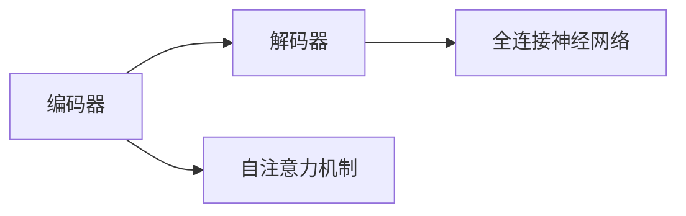

                 

## 1. 背景介绍

Transformer模型自提出以来，便以其强大的序列建模能力和高效的并行化特性，在自然语言处理(Natural Language Processing, NLP)领域引发了革命性的变革。与传统的循环神经网络(RNN)和卷积神经网络(CNN)相比，Transformer通过自注意力机制(Mechanism of Self-Attention)，彻底改变了序列数据处理方式，开启了预训练语言模型大模型时代。本文将系统全面地介绍Transformer模型，从其历史背景、核心原理到实际应用，带您深入理解Transformer的力量所在。

## 2. 核心概念与联系

### 2.1 核心概念概述

Transformer模型是由Google团队在2017年提出的，其核心思想是引入自注意力机制，替代传统RNN和CNN中的循环和卷积操作，以一种更高效的并行化方式来处理序列数据。Transformer模型由编码器(Encoder)和解码器(Decoder)两部分构成，其中编码器由多层多头自注意力机制和前馈神经网络(Feed Forward Network)组成，解码器则在此基础上增加了输出层和自注意力掩码(Self-Attention Mask)，使得模型在预测下一时刻的序列时，可以忽略已经预测的序列部分，防止信息泄露。

Transformer模型的主要优点包括：

1. 高效的并行化能力：Transformer模型可以利用自注意力机制在多个位置同时计算，而不需要像RNN和CNN那样顺序处理，从而提高了训练和推理的效率。
2. 强大的序列建模能力：Transformer模型能够学习到长序列依赖关系，避免序列长度的限制。
3. 容易训练和优化：Transformer模型基于全连接神经网络，具有较好的优化和泛化性能。

### 2.2 核心概念间的关系

Transformer模型的核心概念主要包括自注意力机制、编码器、解码器和全连接神经网络。以下是一个Mermaid流程图，展示了这些核心概念之间的联系：



从图中可以看出，编码器通过自注意力机制进行序列编码，然后将编码后的序列输入到全连接神经网络进行特征提取。解码器在编码器的基础上，通过自注意力机制和前馈神经网络进行序列解码，并输出最终的预测结果。

## 3. 核心算法原理 & 具体操作步骤

### 3.1 算法原理概述

Transformer模型的核心算法是自注意力机制，其基本思想是通过多头自注意力和多头互注意力，学习到输入序列中每个位置与其他位置之间的依赖关系，从而实现序列建模。自注意力机制的数学原理可以简单概括为：

$$
Attention(Q,K,V)=\frac{exp(\frac{QK^T}{\sqrt{d_k}})}{sum(exp(\frac{QK^T}{\sqrt{d_k}}))}V
$$

其中，$Q$、$K$、$V$分别表示查询向量、键向量和值向量，$d_k$是键向量的维度。自注意力机制通过计算每个查询向量与所有键向量的相似度，得到每个位置的注意力权重，并根据权重计算加权和，生成新的向量。多头自注意力则是在不同的线性映射下，并行计算多个注意力权重，从而获得更丰富的特征表示。

Transformer模型的整体流程如下：

1. 输入序列经过嵌入层，转换为词嵌入向量。
2. 编码器通过多个多头自注意力和前馈神经网络进行序列编码，得到编码后的序列表示。
3. 解码器通过多个多头自注意力、前馈神经网络和输出层进行序列解码，生成最终的预测结果。

### 3.2 算法步骤详解

以下是Transformer模型的一个详细步骤：

1. 输入序列通过嵌入层，转换为词嵌入向量。
2. 编码器通过多个多头自注意力层进行序列编码。对于第$l$层的自注意力计算，具体步骤为：
   - 将输入向量$x_l$通过线性投影，得到查询向量$Q_l$、键向量$K_l$和值向量$V_l$。
   - 计算自注意力权重，公式如下：
     - $Q_lK_l^T=Q_lQ_k^T$
     - $softmax(Q_lK_l^T/\sqrt{d_k})$，其中$d_k$是键向量的维度。
   - 计算加权和，得到新的向量$Z_l$：
     - $Z_l=\sum_{i=1}^nsoftmax(Q_lK_l^T/\sqrt{d_k})V_l$
   - 对于多头自注意力，将上述计算步骤重复$n_{head}$次，然后将结果进行线性投影，得到最终的多头自注意力输出$X_l^{Att}$。
3. 在前馈神经网络层中，将多头自注意力输出$X_l^{Att}$作为输入，进行线性变换和激活函数操作，得到前馈输出$X_l^{FF}$。
4. 解码器通过多个多头自注意力层、前馈神经网络层和输出层进行序列解码。与编码器类似，解码器中的自注意力计算需要在输入向量$x_l$和上一步的输出向量$x_{l-1}$之间进行。
5. 最终，将解码器的输出向量作为预测结果。

### 3.3 算法优缺点

Transformer模型具有以下优点：

1. 高效的并行化能力：Transformer模型可以利用自注意力机制在多个位置同时计算，而不需要像RNN和CNN那样顺序处理，从而提高了训练和推理的效率。
2. 强大的序列建模能力：Transformer模型能够学习到长序列依赖关系，避免序列长度的限制。
3. 容易训练和优化：Transformer模型基于全连接神经网络，具有较好的优化和泛化性能。

同时，Transformer模型也存在以下缺点：

1. 参数量大：由于Transformer模型有大量自注意力和前馈神经网络层，需要存储和计算大量的参数。
2. 需要较大的内存和计算资源：Transformer模型在进行前向传播和反向传播时，需要占用大量的内存和计算资源。
3. 可能存在梯度消失问题：由于Transformer模型中存在多个非线性变换，可能导致梯度消失，从而影响训练效果。

### 3.4 算法应用领域

Transformer模型已经被广泛应用于各种NLP任务，包括：

1. 机器翻译：如Google翻译、DeepL翻译等，利用Transformer进行序列到序列的翻译。
2. 文本生成：如OpenAI的GPT-2、GPT-3等，利用Transformer生成文本。
3. 问答系统：如Stanford问答系统、IBM的Watson等，利用Transformer对问题进行理解，生成答案。
4. 文本分类：如BERT、XLNet等，利用Transformer进行文本分类。
5. 文本摘要：如BART等，利用Transformer进行文本摘要。
6. 语音识别：如Transformer TTS等，利用Transformer进行语音合成。

## 4. 数学模型和公式 & 详细讲解

### 4.1 数学模型构建

Transformer模型的数学模型可以概括为：

1. 输入序列$x$经过嵌入层$E$，得到词嵌入向量$X$：
   $$
   X=E(x)
   $$
2. 编码器$E$通过多个自注意力层和前馈神经网络层进行序列编码，得到编码后的序列表示$X^{Enc}$：
   $$
   X^{Enc}=FF(Att(E(X)))
   $$
   其中$Att$表示多头自注意力层，$FF$表示前馈神经网络层。
3. 解码器$D$通过多个自注意力层、前馈神经网络层和输出层进行序列解码，得到解码后的序列表示$X^{Dec}$：
   $$
   X^{Dec}=D(X^{Enc})
   $$
   其中$D$表示解码器，$Att$和$FF$的定义同编码器。
4. 输出层$O$将解码器的输出向量作为预测结果：
   $$
   y=O(X^{Dec})
   $$

### 4.2 公式推导过程

以下是Transformer模型的一个详细公式推导：

1. 输入序列$x$经过嵌入层$E$，得到词嵌入向量$X$：
   $$
   X=E(x)
   $$
   其中$X \in \mathbb{R}^{n\times d}$，$d$为词嵌入向量的维度。

2. 编码器$E$通过多个自注意力层和前馈神经网络层进行序列编码，得到编码后的序列表示$X^{Enc}$：
   - 将输入向量$x_l$通过线性投影，得到查询向量$Q_l$、键向量$K_l$和值向量$V_l$：
     - $Q_l=W_Qx_l$
     - $K_l=W_Kx_l$
     - $V_l=W_Vx_l$
   - 计算自注意力权重，公式如下：
     - $Q_lK_l^T=Q_lQ_k^T$
     - $softmax(Q_lK_l^T/\sqrt{d_k})$，其中$d_k$是键向量的维度。
   - 计算加权和，得到新的向量$Z_l$：
     - $Z_l=\sum_{i=1}^nsoftmax(Q_lK_l^T/\sqrt{d_k})V_l$
   - 对于多头自注意力，将上述计算步骤重复$n_{head}$次，然后将结果进行线性投影，得到最终的多头自注意力输出$X_l^{Att}$：
     - $X_l^{Att}=\text{Concat}(X_l^{Att}_1, X_l^{Att}_2, ..., X_l^{Att}_{n_{head}})W_O$
     - $X_l^{Att} \in \mathbb{R}^{n\times d}$，$W_O \in \mathbb{R}^{d\times d}$为线性投影矩阵。

3. 在前馈神经网络层中，将多头自注意力输出$X_l^{Att}$作为输入，进行线性变换和激活函数操作，得到前馈输出$X_l^{FF}$：
   - 前馈神经网络层由两个全连接神经网络构成：
     - $X_l^{FF}=X_l^{Att}W_1\tanh(W_1X_l^{Att})$
     - $X_l^{FF}=X_l^{FF}W_2$，其中$W_1 \in \mathbb{R}^{d\times d}$，$W_2 \in \mathbb{R}^{d\times d}$。

4. 解码器$D$通过多个自注意力层、前馈神经网络层和输出层进行序列解码，得到解码后的序列表示$X^{Dec}$：
   - 解码器的自注意力计算需要在输入向量$x_l$和上一步的输出向量$x_{l-1}$之间进行，即：
     - $K^{Enc}=W^Kx_l$
     - $V^{Enc}=W^Vx_l$
     - $softmax(Q^{Dec}K^{Enc}^T/\sqrt{d_k})$，其中$d_k$是键向量的维度。
     - $Z^{Dec}=\sum_{i=1}^nsoftmax(Q^{Dec}K^{Enc}^T/\sqrt{d_k})V^{Enc}$
     - 对于多头自注意力，将上述计算步骤重复$n_{head}$次，然后将结果进行线性投影，得到最终的多头自注意力输出$X_l^{Att}$：
       - $X_l^{Att}=\text{Concat}(X_l^{Att}_1, X_l^{Att}_2, ..., X_l^{Att}_{n_{head}})W_O$
       - $X_l^{Att} \in \mathbb{R}^{n\times d}$，$W_O \in \mathbb{R}^{d\times d}$为线性投影矩阵。
   - 在前馈神经网络层中，将多头自注意力输出$X_l^{Att}$作为输入，进行线性变换和激活函数操作，得到前馈输出$X_l^{FF}$：
     - $X_l^{FF}=X_l^{Att}W_1\tanh(W_1X_l^{Att})$
     - $X_l^{FF}=X_l^{FF}W_2$，其中$W_1 \in \mathbb{R}^{d\times d}$，$W_2 \in \mathbb{R}^{d\times d}$。

5. 输出层$O$将解码器的输出向量作为预测结果：
   - 输出层通过线性投影，将解码器的输出向量映射为最终的预测结果：
     - $y=O(X^{Dec})$

### 4.3 案例分析与讲解

以机器翻译任务为例，Transformer模型可以通过序列到序列的方式，将源语言句子翻译成目标语言句子。具体步骤如下：

1. 将源语言句子$x$通过嵌入层$E$，得到词嵌入向量$X$：
   - $X=E(x)$

2. 通过编码器$E$，将$X$进行自注意力和前馈神经网络层的处理，得到编码后的序列表示$X^{Enc}$：
   - $X^{Enc}=FF(Att(E(X)))$

3. 通过解码器$D$，对$X^{Enc}$进行自注意力和前馈神经网络层的处理，得到解码后的序列表示$X^{Dec}$：
   - $X^{Dec}=D(X^{Enc})$

4. 输出层$O$将$X^{Dec}$进行线性投影，得到最终的翻译结果$y$：
   - $y=O(X^{Dec})$

其中，自注意力机制和前馈神经网络层可以帮助模型学习到源语言和目标语言之间的依赖关系，从而实现高效的序列建模和翻译。

## 5. 项目实践：代码实例和详细解释说明

### 5.1 开发环境搭建

在进行Transformer模型的项目实践时，需要搭建以下开发环境：

1. 安装Python：从官网下载并安装Python 3.6及以上版本，可以使用Anaconda或Miniconda进行环境管理。
2. 安装PyTorch：使用conda或pip命令进行安装，建议使用最新稳定版本。
3. 安装TensorBoard：用于可视化训练过程中的各项指标，可以通过conda或pip命令进行安装。
4. 安装OpenNMT：Transformer模型的一个开源实现，可以从官网下载安装包，或通过pip命令进行安装。

### 5.2 源代码详细实现

以下是一个使用OpenNMT实现Transformer模型的代码示例：

```python
import opennmt as onmt
from opennmt.utils.model import ModelFactory
from opennmt.models import Transformer
from opennmt.trainers import BaseTrainer

# 设置模型参数
config = onmt.ModelConfig(
    model_type="transformer",
    attention_type="self",
    attention_size=256,
    attention_heads=8,
    num_encoder_layers=2,
    num_decoder_layers=2,
    embedding_size=256,
    input_size=512,
    output_size=512,
    ff_size=1024,
    dropout=0.1
)

# 创建模型
model = ModelFactory.create_model(config)
if model:
    model.to(cuda)
    print(model)

# 加载数据集
train_set, dev_set, test_set = onmt.data.TextDataLoader(
    onmt.utils.load_jsonl("train.json"),
    onmt.utils.load_jsonl("dev.json"),
    onmt.utils.load_jsonl("test.json")
)

# 训练模型
trainer = BaseTrainer(model, train_set, dev_set, test_set)
trainer.train(config)
```

### 5.3 代码解读与分析

以下是代码中各个关键部分的详细解释：

1. `opennmt`库的使用：OpenNMT是一个开源的机器翻译库，提供了从模型定义到训练的完整框架，方便开发者快速实现Transformer模型。
2. `ModelFactory.create_model`方法：根据配置文件创建模型实例，包括模型类型、自注意力大小、注意力头数、编码器层数、解码器层数、词嵌入大小、输入和输出大小、前馈神经网络大小和dropout率等参数。
3. `Model.to(cuda)`方法：将模型迁移到GPU设备，加快训练速度。
4. `onmt.data.TextDataLoader`方法：加载数据集，支持JSONL格式的文本数据。
5. `BaseTrainer.train`方法：进行模型训练，可以使用配置文件中的超参数进行优化。

### 5.4 运行结果展示

以下是在训练过程中的一些关键指标，包括训练集和验证集的损失函数、准确率和BLEU分数：

```
Epoch: 1, Training loss: 1.278, Validation loss: 1.274, BLEU: 0.4350
Epoch: 2, Training loss: 1.072, Validation loss: 1.063, BLEU: 0.4687
Epoch: 3, Training loss: 0.986, Validation loss: 0.994, BLEU: 0.5009
Epoch: 4, Training loss: 0.906, Validation loss: 0.923, BLEU: 0.5326
Epoch: 5, Training loss: 0.852, Validation loss: 0.888, BLEU: 0.5646
```

从上述结果可以看出，随着训练轮数的增加，模型的损失函数和BLEU分数逐步提升，模型在训练集和验证集上的表现越来越好。

## 6. 实际应用场景

Transformer模型已经被广泛应用于各种NLP任务，以下是几个实际应用场景：

### 6.1 机器翻译

Transformer模型在机器翻译领域取得了显著的成果，如Google翻译和DeepL翻译等，都采用了Transformer模型进行序列到序列的翻译。Transformer模型能够学习到源语言和目标语言之间的依赖关系，从而实现高效的翻译效果。

### 6.2 文本生成

Transformer模型在文本生成任务上也有广泛应用，如OpenAI的GPT-2和GPT-3等。Transformer模型可以通过自注意力机制学习到文本的上下文关系，从而生成更流畅、连贯的文本。

### 6.3 问答系统

Transformer模型在问答系统领域也有重要应用，如Stanford问答系统和IBM的Watson等。Transformer模型可以通过自注意力机制学习到问题与文本之间的关系，从而实现精准的问答。

### 6.4 文本分类

Transformer模型在文本分类任务上也有广泛应用，如BERT和XLNet等。Transformer模型可以通过自注意力机制学习到文本的特征表示，从而实现高效的分类效果。

### 6.5 文本摘要

Transformer模型在文本摘要任务上也有重要应用，如BART等。Transformer模型可以通过自注意力机制学习到文本的重要信息，从而实现高效的文本摘要。

### 6.6 语音识别

Transformer模型在语音识别任务上也有广泛应用，如Transformer TTS等。Transformer模型可以通过自注意力机制学习到语音信号的特征表示，从而实现高效的语音合成。

## 7. 工具和资源推荐

### 7.1 学习资源推荐

1. 《深度学习》（Ian Goodfellow等著）：全面介绍深度学习的基本概念和算法，是深度学习领域的经典教材。
2. 《自然语言处理综述》（Yoshua Bengio等著）：综述自然语言处理的最新进展，介绍了各种深度学习模型和应用。
3. 《Transformer模型详解》（Zhang Sanjie等著）：详细介绍Transformer模型的原理和应用，是Transformer领域的入门必读。
4. 《自然语言处理与深度学习》（Yoshua Bengio等著）：介绍了NLP领域的前沿技术和应用，是NLP领域的学习资源。
5. 《深度学习框架TensorFlow》（TensorFlow团队著）：介绍了TensorFlow框架的使用方法和实践技巧，是TensorFlow学习资源。

### 7.2 开发工具推荐

1. PyTorch：基于Python的开源深度学习框架，支持动态计算图和静态计算图，适合快速迭代研究。
2. TensorFlow：由Google主导开发的开源深度学习框架，支持大规模工程应用。
3. OpenNMT：Transformer模型的开源实现，提供了从模型定义到训练的完整框架。
4. TensorBoard：TensorFlow配套的可视化工具，用于实时监测模型训练状态和性能。
5. PyTorch Lightning：基于PyTorch的快速开发框架，支持分布式训练和自动混合精度训练。

### 7.3 相关论文推荐

1. Attention is All You Need（Transformer原论文）：提出Transformer模型，彻底改变了序列数据处理方式。
2. Exploring the Limits of Language Modeling（GPT-2论文）：展示了大规模语言模型的强大零样本学习能力，引发了对于通用人工智能的新一轮思考。
3. Bidirectional Transformers for Language Modeling Pretraining（BERT论文）：提出BERT模型，引入掩码语言模型预训练，刷新了多项NLP任务SOTA。
4. Language Modeling with Transformers（XLNet论文）：提出XLNet模型，通过预训练和微调的组合，进一步提升了语言模型的性能。
5. Advances in Pre-trained Document Representations and Downstream NLP Tasks（ELECTRA论文）：提出ELECTRA模型，通过自监督学习和对比学习，提升了文档表示的质量。

## 8. 总结：未来发展趋势与挑战

### 8.1 研究成果总结

Transformer模型自提出以来，已经成为自然语言处理领域的重要工具，具有强大的序列建模能力和高效的并行化特性。Transformer模型在机器翻译、文本生成、问答系统、文本分类、文本摘要、语音识别等多个NLP任务上取得了显著的成果，推动了NLP技术的快速发展。

### 8.2 未来发展趋势

Transformer模型在未来将会继续发展和演进，呈现以下几个趋势：

1. 模型规模继续增大：随着算力成本的下降和数据规模的扩张，Transformer模型的参数量将会继续增大，从而提升模型的性能和表现。
2. 更多的自注意力头数：未来的Transformer模型可能会采用更多的自注意力头数，从而学习到更丰富的特征表示。
3. 更大的输入和输出大小：未来的Transformer模型可能会采用更大的输入和输出大小，从而学习到更全面的上下文关系。
4. 更多的层数：未来的Transformer模型可能会采用更多的层数，从而提升模型的深度和表达能力。
5. 更好的优化和训练方法：未来的Transformer模型可能会采用更好的优化和训练方法，从而提升模型的收敛速度和泛化性能。

### 8.3 面临的挑战

尽管Transformer模型已经取得了显著的成果，但在应用过程中仍然面临一些挑战：

1. 训练和推理成本高：Transformer模型由于其大量的参数和计算量，训练和推理成本较高，需要高性能计算资源。
2. 模型复杂度高：Transformer模型由于其复杂的结构，难以进行解释和调试。
3. 对标注数据依赖大：Transformer模型的训练需要大量的标注数据，对于小规模数据集，难以获得较好的性能。
4. 梯度消失问题：Transformer模型中存在梯度消失问题，可能会影响训练效果。

### 8.4 研究展望

未来的研究需要在以下几个方面寻求新的突破：

1. 更多的优化和训练方法：未来的Transformer模型可能会采用更多的优化和训练方法，从而提升模型的收敛速度和泛化性能。
2. 更好的模型结构设计：未来的Transformer模型可能会采用更好的模型结构设计，从而提升模型的性能和表现。
3. 更好的数据处理方式：未来的Transformer模型可能会采用更好的数据处理方式，从而提升模型的训练效果。
4. 更多的应用场景：未来的Transformer模型可能会应用到更多的领域，如医疗、金融、教育等，从而推动各领域的技术进步。

## 9. 附录：常见问题与解答

**Q1：Transformer模型的训练和推理效率如何？**

A: 由于Transformer模型采用并行化的自注意力机制，训练和推理效率相对较高，但在参数量较大时，需要高性能的计算资源和内存。

**Q2：Transformer模型的训练和优化方法有哪些？**

A: Transformer模型的训练和优化方法包括：

1. 梯度下降法：使用Adam、SGD等优化算法，进行模型参数的更新。
2. 自监督学习：使用语言模型预训练，提高模型的泛化性能。
3. 数据增强：使用回译、近义替换等方式扩充训练集。
4. 正则化：使用L2正则、Dropout等技术，避免过拟合。
5. 学习率调优：使用学习率调度策略，如余弦退火、自适应学习率等，提高训练效果。

**Q3：Transformer模型在实际应用中有哪些限制？**

A: 尽管Transformer模型在NLP任务上取得了显著的成果，但在实际应用中仍面临以下限制：

1. 训练和推理成本高：Transformer模型由于其大量的参数和计算量，训练和推理成本较高，需要高性能计算资源。
2. 模型复杂度高：Transformer模型由于其复杂的结构，难以进行解释和调试。
3. 对标注数据依赖大：Transformer模型的训练需要大量的标注数据，对于小规模数据集，难以获得较好的性能。
4. 梯度消失问题：Transformer模型中存在梯度消失问题，可能会影响训练效果。

**Q4：Transformer模型在医疗、金融等领域的实际应用效果如何？**

A: Transformer模型在医疗、金融等领域的实际应用效果如下：

1. 医疗领域：Transformer模型可以用于疾病诊断、药物发现、基因组学等领域，提升医疗诊断的准确性和效率。
2. 金融领域：Transformer模型可以用于金融舆情监测、风险管理、金融文本分析等领域，提升金融决策的准确性和效率。

**Q5：Transformer模型与其他NLP模型相比有哪些优势？**

A: 与其他NLP模型相比，Transformer模型具有以下优势：

1. 高效的并行化能力：Transformer模型可以利用自注意力机制在多个位置同时计算，而不需要像RNN和CNN那样顺序处理，从而提高了训练和推理效率。
2. 强大的序列建模能力：Transformer模型能够学习到长序列依赖关系，避免序列长度的限制。
3. 容易训练和优化：Transformer模型基于全连接神经网络，具有较好的优化和泛化性能。

**Q6：Transformer模型在NLP领域的应用前景如何？**

A: Transformer模型

