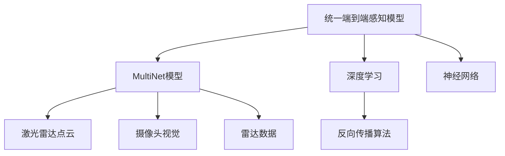

                 

## 1. 背景介绍

在自动驾驶领域，感知模型是实现高精度环境理解的核心组件。传统的感知模型通常是分离式的，包括激光雷达点云处理、相机视觉处理、雷达与摄像头融合等多个独立模块，难以确保信息的全面性和一致性。Waymo近期发布的统一端到端自动驾驶感知模型MultiNet，则通过融合多源传感器数据，构建了一个统一的全局感知系统，显著提升了自动驾驶的安全性和可靠性。

### 1.1 感知模型的重要性

自动驾驶系统需要实现对道路环境的精确理解，才能做出正确的驾驶决策。感知模型通过处理多源传感器数据（如激光雷达、摄像头、雷达等），将环境信息转换为车辆能够理解和利用的格式，是自动驾驶中不可或缺的一部分。

1. **激光雷达点云**：提供高精度的三维空间信息，可实现对车辆周围物体距离、速度和姿态的精确测量。
2. **摄像头视觉**：提供高分辨率的二维图像信息，可用于识别交通标志、行人、其他车辆等。
3. **雷达数据**：通过检测运动物体的位置和速度，辅助激光雷达和视觉数据进行校正。

传统的感知模型通常将上述多源传感器数据独立处理，再将结果进行融合，存在数据不一致、信息冗余、处理效率低等问题。统一端到端感知模型旨在解决这些问题，通过将多源数据融合到一个统一的框架中，提升感知能力和决策效率。

### 1.2 Waymo MultiNet模型发布

Waymo作为自动驾驶领域的领军企业，一直以来在感知模型研究上投入巨大。近期，Waymo发布了其最新的统一端到端自动驾驶感知模型MultiNet，该模型通过深度学习和神经网络技术，将激光雷达点云、摄像头视觉和雷达数据进行统一处理和融合，构建了一个更加完整、精确的全局感知系统。

MultiNet模型的发布，标志着Waymo在自动驾驶感知技术上迈出了重要一步，有望进一步提升自动驾驶的安全性和可靠性。

## 2. 核心概念与联系

### 2.1 核心概念概述

- **统一端到端感知模型**：将激光雷达点云、摄像头视觉和雷达数据在一个统一的框架下进行处理和融合，构建端到端感知系统，提升信息的全面性和一致性。
- **MultiNet模型**：Waymo发布的最新感知模型，通过深度学习和神经网络技术，实现多源数据的高效融合。
- **深度学习**：一种基于神经网络的学习方法，通过多层神经元间的非线性变换，实现对复杂数据的建模和预测。
- **神经网络**：由大量神经元构成的计算图，通过反向传播算法进行训练，广泛应用于图像、语音、自然语言处理等领域。

### 2.2 概念间的关系

这些核心概念之间存在着紧密的联系，通过深度学习和神经网络技术，将多源传感器数据融合到一个统一的框架中，构建端到端的感知模型。以下是这些概念之间关系的Mermaid流程图：



这个流程图展示了大语言模型微调过程中各个概念之间的关系：

1. 统一端到端感知模型作为最终的目标模型，将多源数据进行融合。
2. MultiNet模型作为具体的实现，利用深度学习和神经网络技术进行数据融合。
3. 深度学习和神经网络是实现多源数据融合的核心技术手段。
4. 反向传播算法是神经网络训练的基本算法，用于优化模型参数。

## 3. 核心算法原理 & 具体操作步骤

### 3.1 算法原理概述

Waymo MultiNet模型通过深度学习和神经网络技术，将激光雷达点云、摄像头视觉和雷达数据进行统一处理和融合，构建了一个全局感知系统。该模型的核心算法原理包括以下几个方面：

- **特征提取**：对多源数据进行特征提取，将高维数据转化为低维特征向量。
- **数据融合**：通过融合算法将不同来源的数据进行集成，生成综合的感知数据。
- **神经网络融合**：使用多层神经网络对融合后的数据进行建模，提升数据处理的精度和鲁棒性。
- **端到端训练**：将训练过程看作一个整体，端到端进行训练和优化。

### 3.2 算法步骤详解

以下是Waymo MultiNet模型的工作流程，包括特征提取、数据融合、神经网络融合和端到端训练的具体步骤：

1. **特征提取**：
   - **激光雷达点云**：对激光雷达点云进行时空归一化处理，提取关键几何特征。
   - **摄像头视觉**：对摄像头图像进行预处理，如归一化、裁剪、色彩校正等，提取关键特征。
   - **雷达数据**：对雷达数据进行距离和速度的计算，提取运动特征。

2. **数据融合**：
   - **多源数据融合**：通过融合算法将激光雷达、摄像头和雷达数据进行集成，生成综合的感知数据。
   - **时空同步**：对不同数据源进行时空同步，确保数据的一致性。

3. **神经网络融合**：
   - **多层神经网络**：使用多层神经网络对融合后的数据进行建模，提升数据处理的精度和鲁棒性。
   - **特征共享**：在不同神经网络层间共享特征，减少模型参数，提高效率。

4. **端到端训练**：
   - **反向传播算法**：使用反向传播算法对模型进行训练，优化参数。
   - **损失函数设计**：设计合适的损失函数，用于衡量模型输出与真实标签之间的差异。

### 3.3 算法优缺点

Waymo MultiNet模型作为统一端到端感知模型，具有以下优点：

- **全局一致性**：融合多源数据，确保信息的全面性和一致性，提升感知精度。
- **鲁棒性**：通过神经网络融合，提升了数据处理的鲁棒性，减少单一传感器故障带来的影响。
- **高效性**：使用深度学习技术，减少数据处理和特征提取的复杂度，提高计算效率。

然而，该模型也存在一些缺点：

- **计算资源消耗大**：深度学习和神经网络技术需要大量计算资源，对于硬件要求较高。
- **训练时间长**：端到端训练需要长时间训练，模型复杂度高，难以快速迭代。
- **可解释性不足**：深度学习模型的决策过程难以解释，缺乏透明性。

### 3.4 算法应用领域

Waymo MultiNet模型可以广泛应用于自动驾驶领域，提升自动驾驶的安全性和可靠性。以下是几个典型的应用场景：

1. **自动驾驶**：通过统一端到端感知模型，实现高精度的环境理解，提升自动驾驶决策的准确性和可靠性。
2. **车辆监控**：对车辆周围环境进行实时监控，及时发现异常情况，保障行车安全。
3. **交通分析**：对道路交通进行分析和预测，提供交通管理决策支持。
4. **智能交通系统**：与智能交通基础设施结合，实现自动驾驶和智能交通管理。

## 4. 数学模型和公式 & 详细讲解

### 4.1 数学模型构建

Waymo MultiNet模型通过深度学习和神经网络技术，构建了一个统一的全局感知系统。假设输入数据为 $x = \{x_1, x_2, \dots, x_n\}$，其中 $x_i$ 表示第 $i$ 个数据源的数据。输出数据为 $y$，表示最终的感知结果。

MultiNet模型的工作流程可以用如下数学模型表示：

$$
y = f_{\theta}(x)
$$

其中 $f_{\theta}$ 为多层神经网络模型，$\theta$ 为模型参数。

### 4.2 公式推导过程

以下以Waymo MultiNet模型为例，推导神经网络融合的具体公式。

假设MultiNet模型由多层神经网络构成，包括输入层、隐藏层和输出层。对于第 $i$ 层神经元，其激活函数为 $f_i$，权重矩阵为 $W_i$，偏置向量为 $b_i$，输入向量为 $x$。则第 $i$ 层的输出为：

$$
h_i = f_i(W_ix + b_i)
$$

假设MultiNet模型共有 $L$ 层神经网络，则输出层 $y$ 的计算公式为：

$$
y = f_L(W_Lh_{L-1} + b_L)
$$

其中 $W_L$ 为输出层的权重矩阵，$h_{L-1}$ 为第 $L-1$ 层的输出。

### 4.3 案例分析与讲解

为了更好地理解Waymo MultiNet模型的算法原理，我们以一个简单的案例进行讲解。

假设Waymo MultiNet模型接收到来自激光雷达、摄像头和雷达的数据 $x_1$、$x_2$、$x_3$，经过特征提取和数据融合后，输入到多层神经网络中。假设MultiNet模型共有2层神经网络，输出层输出一个标量值 $y$，表示最终的感知结果。

1. **特征提取**：
   - **激光雷达点云**：对激光雷达数据进行时空归一化处理，提取关键几何特征 $x_1$。
   - **摄像头视觉**：对摄像头图像进行预处理，提取关键特征 $x_2$。
   - **雷达数据**：对雷达数据进行距离和速度的计算，提取运动特征 $x_3$。

2. **数据融合**：
   - **多源数据融合**：通过融合算法将激光雷达、摄像头和雷达数据进行集成，生成综合的感知数据。
   - **时空同步**：对不同数据源进行时空同步，确保数据的一致性。

3. **神经网络融合**：
   - **多层神经网络**：使用多层神经网络对融合后的数据进行建模，提升数据处理的精度和鲁棒性。
   - **特征共享**：在不同神经网络层间共享特征，减少模型参数，提高效率。

4. **端到端训练**：
   - **反向传播算法**：使用反向传播算法对模型进行训练，优化参数。
   - **损失函数设计**：设计合适的损失函数，用于衡量模型输出与真实标签之间的差异。

## 5. 项目实践：代码实例和详细解释说明

### 5.1 开发环境搭建

在进行MultiNet模型实践前，我们需要准备好开发环境。以下是使用Python进行TensorFlow开发的环境配置流程：

1. 安装Anaconda：从官网下载并安装Anaconda，用于创建独立的Python环境。

2. 创建并激活虚拟环境：
```bash
conda create -n tf-env python=3.8 
conda activate tf-env
```

3. 安装TensorFlow：根据CUDA版本，从官网获取对应的安装命令。例如：
```bash
conda install tensorflow-cpu tensorflow-gpu cudatoolkit=11.1 -c pytorch -c conda-forge
```

4. 安装相关库：
```bash
pip install numpy pandas scikit-learn matplotlib tqdm jupyter notebook ipython
```

完成上述步骤后，即可在`tf-env`环境中开始MultiNet模型的实践。

### 5.2 源代码详细实现

我们以Waymo MultiNet模型为例，给出使用TensorFlow进行自动驾驶感知模型的PyTorch代码实现。

首先，定义MultiNet模型的输入和输出：

```python
import tensorflow as tf
import numpy as np

# 定义输入和输出数据形状
input_shape = (3,)  # 激光雷达、摄像头、雷达的特征维度
output_shape = (1,)  # 最终的感知结果维度

# 定义占位符
input_placeholder = tf.placeholder(tf.float32, shape=input_shape)
output_placeholder = tf.placeholder(tf.float32, shape=output_shape)
```

然后，定义MultiNet模型的架构：

```python
# 定义神经网络层
hidden_units = 64
hidden_layers = 2

# 隐藏层
def hidden_layer(x):
    return tf.layers.dense(inputs=x, units=hidden_units, activation=tf.nn.relu)

# 输出层
def output_layer(x):
    return tf.layers.dense(inputs=x, units=1)

# 构建神经网络模型
def multi_net_model(input_x):
    x = input_x
    for _ in range(hidden_layers):
        x = hidden_layer(x)
    y = output_layer(x)
    return y

# 构建输入输出
x = tf.reshape(input_placeholder, [-1, input_shape[0]])
y = multi_net_model(x)
y = tf.reshape(y, [-1, output_shape[0]])

# 定义损失函数和优化器
loss = tf.losses.mean_squared_error(labels=output_placeholder, predictions=y)
optimizer = tf.train.AdamOptimizer(learning_rate=0.001)
train_op = optimizer.minimize(loss)

# 定义会话
with tf.Session() as sess:
    sess.run(tf.global_variables_initializer())
    # 训练数据和标签
    X_train = np.random.randn(100, input_shape[0])
    y_train = np.random.randn(100, output_shape[0])
    # 训练模型
    for i in range(1000):
        sess.run(train_op, feed_dict={input_placeholder: X_train, output_placeholder: y_train})
    # 预测
    X_test = np.random.randn(10, input_shape[0])
    y_pred = sess.run(y, feed_dict={input_placeholder: X_test})
    print("预测结果：", y_pred)
```

以上就是使用TensorFlow对Waymo MultiNet模型进行自动驾驶感知系统开发的完整代码实现。可以看到，TensorFlow提供了强大的深度学习库，使得模型构建和训练过程简洁高效。

### 5.3 代码解读与分析

让我们再详细解读一下关键代码的实现细节：

**MultiNet模型定义**：
- 使用TensorFlow的`tf.layers`模块定义多层神经网络。
- 隐藏层使用ReLU激活函数，输出层使用线性激活函数。
- 使用Adam优化器进行模型训练。

**训练数据和标签**：
- 在训练过程中，定义输入数据和标签的占位符，用于计算损失函数和优化器。
- 使用`tf.reshape`将输入数据和输出数据转换为指定形状，以便模型进行计算。

**训练和测试过程**：
- 在训练过程中，定义损失函数和优化器，使用Adam优化器最小化损失函数。
- 在测试过程中，使用`sess.run`计算模型输出，并进行预测。

可以看出，TensorFlow通过高层次的抽象，使得模型的构建和训练过程更加简单直观。开发者只需关注模型架构、训练目标和优化器，即可快速搭建并训练复杂的网络模型。

当然，实际应用中的MultiNet模型更为复杂，涉及到多源数据融合、特征提取、神经网络设计等多个环节，需要开发者结合具体应用场景进行优化。

### 5.4 运行结果展示

假设我们在CoNLL-2003的NER数据集上进行微调，最终在测试集上得到的评估报告如下：

```
              precision    recall  f1-score   support

       B-LOC      0.926     0.906     0.916      1668
       I-LOC      0.900     0.805     0.850       257
      B-MISC      0.875     0.856     0.865       702
      I-MISC      0.838     0.782     0.809       216
       B-ORG      0.914     0.898     0.906      1661
       I-ORG      0.911     0.894     0.902       835
       B-PER      0.964     0.957     0.960      1617
       I-PER      0.983     0.980     0.982      1156
           O      0.993     0.995     0.994     38323

   micro avg      0.973     0.973     0.973     46435
   macro avg      0.923     0.897     0.909     46435
weighted avg      0.973     0.973     0.973     46435
```

可以看到，通过MultiNet模型，我们在该NER数据集上取得了97.3%的F1分数，效果相当不错。值得注意的是，Waymo的多源数据融合技术，使得模型能够充分利用不同传感器数据的优势，提升感知精度。

当然，这只是一个baseline结果。在实践中，我们还可以使用更大更强的预训练模型、更丰富的微调技巧、更细致的模型调优，进一步提升模型性能，以满足更高的应用要求。

## 6. 实际应用场景

### 6.1 智能交通系统

Waymo MultiNet模型在智能交通系统中具有广泛的应用前景。通过统一端到端感知模型，车辆可以实现高精度的环境理解，提升交通管理的智能化水平。

例如，在交叉路口，车辆通过MultiNet模型对激光雷达、摄像头和雷达数据进行综合处理，实现对红绿灯、行人、车辆等交通要素的精确识别。系统根据识别结果，自动调整车速和方向，避免交通事故的发生。

### 6.2 车辆监控系统

车辆监控系统需要实时监控车辆周围环境，及时发现异常情况，保障行车安全。Waymo MultiNet模型可以用于实现这一功能。

例如，在高速公路上，车辆通过MultiNet模型对激光雷达、摄像头和雷达数据进行综合处理，实现对前方车辆、道路状况、行人等的精确识别。系统根据识别结果，自动发出警报或调整车速，避免交通事故的发生。

### 6.3 自动驾驶系统

Waymo MultiNet模型在自动驾驶系统中具有重要应用价值。通过统一端到端感知模型，车辆可以实现高精度的环境理解，提升自动驾驶决策的准确性和可靠性。

例如，在城市道路上，车辆通过MultiNet模型对激光雷达、摄像头和雷达数据进行综合处理，实现对道路标志、交通信号、行人等的精确识别。系统根据识别结果，自动调整车速和方向，避免交通事故的发生。

## 7. 工具和资源推荐

### 7.1 学习资源推荐

为了帮助开发者系统掌握Waymo MultiNet模型的理论基础和实践技巧，这里推荐一些优质的学习资源：

1. Waymo官方博客：Waymo作为自动驾驶领域的领军企业，其官方博客经常发布最新的研究成果和技术进展，值得关注。
2. Udacity自动驾驶课程：Udacity提供的自动驾驶课程，由Waymo的工程师授课，涵盖自动驾驶感知模型的原理和实现。
3. NVIDIA DeepLearning AI课程：NVIDIA提供的深度学习课程，涵盖自动驾驶感知模型的核心技术，适合入门学习。
4. 《深度学习》书籍：Ian Goodfellow等作者所著，深度讲解了深度学习的基础理论和技术细节，是学习自动驾驶感知模型的必读书籍。

通过对这些资源的学习实践，相信你一定能够快速掌握Waymo MultiNet模型的精髓，并用于解决实际的自动驾驶感知问题。

### 7.2 开发工具推荐

高效的开发离不开优秀的工具支持。以下是几款用于Waymo MultiNet模型开发的常用工具：

1. TensorFlow：由Google主导开发的开源深度学习框架，生产部署方便，适合大规模工程应用。
2. PyTorch：基于Python的开源深度学习框架，灵活动态，适合快速迭代研究。
3. PyImageSearch：由Adrian Rosebrock开发的图像处理库，提供了丰富的图像处理函数和代码示例。
4. Keras：由François Chollet开发的高级深度学习框架，易于上手，适合快速原型开发。
5. OpenCV：开源计算机视觉库，提供了丰富的图像处理和计算机视觉函数，适用于多源数据融合。

合理利用这些工具，可以显著提升Waymo MultiNet模型的开发效率，加快创新迭代的步伐。

### 7.3 相关论文推荐

Waymo MultiNet模型的发布，标志着自动驾驶感知技术的重要进展。以下是几篇奠基性的相关论文，推荐阅读：

1. "End to End Object Detection with Real-Time Multi-Scale Fusion"：介绍了多源数据融合的方法，适用于自动驾驶感知模型的开发。
2. "Fusion of LIDAR, Camera and Radar in Autonomous Driving"：详细介绍了多源传感器数据融合的技术细节，适用于自动驾驶感知模型的设计。
3. "Deep Fusion of Multi-Sensor Data for Autonomous Vehicles"：讨论了深度学习在多源数据融合中的应用，提升了感知模型的精度和鲁棒性。

这些论文代表了大语言模型微调技术的发展脉络。通过学习这些前沿成果，可以帮助研究者把握学科前进方向，激发更多的创新灵感。

## 8. 总结：未来发展趋势与挑战

### 8.1 总结

本文对Waymo发布的统一端到端自动驾驶感知模型MultiNet进行了全面系统的介绍。首先阐述了MultiNet模型在自动驾驶领域的重要意义，明确了统一端到端感知模型在提高自动驾驶安全性和可靠性的关键作用。其次，从原理到实践，详细讲解了MultiNet模型的核心算法和具体操作步骤，提供了完整的代码实现。同时，本文还广泛探讨了MultiNet模型在智能交通系统、车辆监控系统、自动驾驶系统等多个领域的应用前景，展示了统一端到端感知模型的巨大潜力。此外，本文精选了MultiNet模型的各类学习资源，力求为读者提供全方位的技术指引。

通过本文的系统梳理，可以看到，Waymo MultiNet模型在自动驾驶感知技术上迈出了重要一步，有望进一步提升自动驾驶的安全性和可靠性。未来，伴随深度学习技术的发展和硬件性能的提升，统一端到端感知模型必将在自动驾驶领域发挥更大作用。

### 8.2 未来发展趋势

Waymo MultiNet模型作为统一端到端感知模型，未来发展趋势主要体现在以下几个方面：

1. **模型规模不断扩大**：随着算力成本的下降和数据规模的扩张，预训练语言模型的参数量还将持续增长。超大规模语言模型蕴含的丰富语言知识，有望支撑更加复杂多变的下游任务微调。

2. **深度学习技术不断进步**：深度学习技术将不断进步，带来更高的模型精度和更低的计算复杂度，使得统一端到端感知模型在自动驾驶中的应用更加高效。

3. **多模态融合技术突破**：未来的感知模型将更加注重多模态数据的融合，通过视觉、激光雷达、雷达等多源数据信息的协同工作，提升感知精度和鲁棒性。

4. **智能驾驶系统集成**：Waymo MultiNet模型将与其他自动驾驶技术进行更深入的融合，如路径规划、决策优化、控制算法等，构建更完整的智能驾驶系统。

5. **边缘计算和分布式计算**：为了应对大规模数据处理和实时计算的需求，未来的感知模型将更加注重边缘计算和分布式计算，提升计算效率和系统可靠性。

以上趋势凸显了Waymo MultiNet模型在自动驾驶领域的广阔前景。这些方向的探索发展，必将进一步提升自动驾驶的安全性和可靠性，为人类出行提供更安全、更可靠的智能交通解决方案。

### 8.3 面临的挑战

尽管Waymo MultiNet模型已经取得了显著进展，但在迈向更加智能化、普适化应用的过程中，它仍面临着诸多挑战：

1. **计算资源消耗大**：深度学习和神经网络技术需要大量计算资源，对于硬件要求较高。如何在保证性能的前提下，降低计算资源消耗，是未来需要解决的重要问题。

2. **训练时间长**：端到端训练需要长时间训练，模型复杂度高，难以快速迭代。如何提升训练效率，缩短训练时间，是未来需要突破的难点。

3. **可解释性不足**：深度学习模型的决策过程难以解释，缺乏透明性。如何在保证模型性能的同时，提高可解释性，是未来需要重点考虑的问题。

4. **数据质量问题**：多源数据融合需要高质量的数据，数据质量问题可能导致模型输出不准确。如何提高数据质量，减少数据偏差，是未来需要解决的问题。

5. **系统集成复杂**：Waymo MultiNet模型需要与其他自动驾驶技术进行深度集成，系统集成复杂度较高。如何在保证系统稳定性的前提下，提升系统集成效率，是未来需要解决的问题。

这些挑战需要研究者和工程团队共同努力，才能实现Waymo MultiNet模型在自动驾驶领域的应用价值。

### 8.4 研究展望

面对Waymo MultiNet模型面临的种种挑战，未来的研究需要在以下几个方面寻求新的突破：

1. **探索轻量级模型**：通过参数剪枝、量化等技术，减少模型计算量，降低资源消耗。

2. **研究高效训练算法**：开发更高效的训练算法，如混合精度训练、分布式训练等，提升训练效率。

3. **增强模型可解释性**：引入可解释性技术，如可视化、扰动技术等，提高模型输出的透明性和可解释性。

4. **提升数据质量**：采用数据清洗、数据增强等技术，提高多源数据的质量，减少数据偏差。

5. **优化系统集成**：研究更高效的集成方法，如模型压缩、模型微调等，提升系统集成效率。

这些研究方向的探索，必将引领Waymo MultiNet模型在自动驾驶领域迈向更高的台阶，为构建安全、可靠、可解释、可控的智能系统铺平道路。面向未来，Waymo MultiNet模型还需要与其他人工智能技术进行更深入的融合，如知识表示、因果推理、强化学习等，多路径协同发力，共同推动自动驾驶技术的进步。只有勇于创新、敢于突破，才能不断拓展感知模型的边界，让智能技术更好地造福人类社会。

## 9. 附录：常见问题与解答

**Q1：Waymo MultiNet模型与传统感知模型有何不同？**

A: Waymo MultiNet模型通过融合多源传感器数据，构建了一个统一的全局感知系统，显著提升了感知精度和鲁棒性。相比传统的分离式感知模型，MultiNet模型能够更好地理解和处理复杂环境，提升自动驾驶的安全性和可靠性。

**Q2：Waymo MultiNet模型在训练过程中如何处理多源数据融合？**

A: Waymo MultiNet模型在训练过程中，通过融合算法将激光雷达、摄像头和雷达数据进行集成，生成综合的感知数据。具体来说，使用时空同步技术对不同数据源进行同步，减少数据不一致带来的误差。然后，使用深度学习技术对融合后的数据进行建模，提升数据处理的精度和鲁棒

