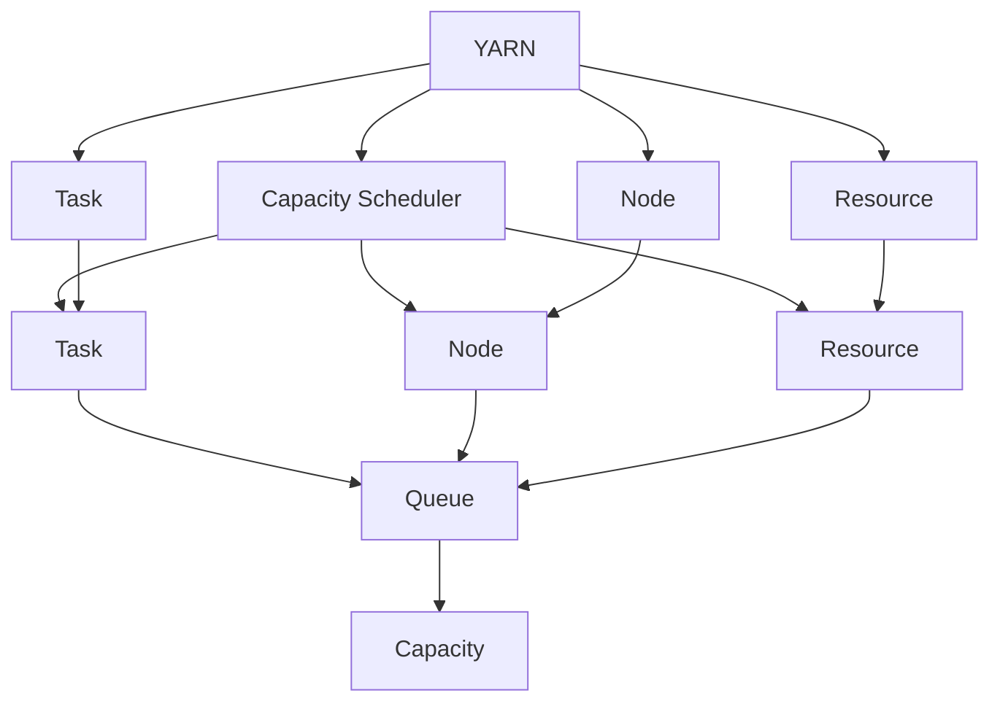
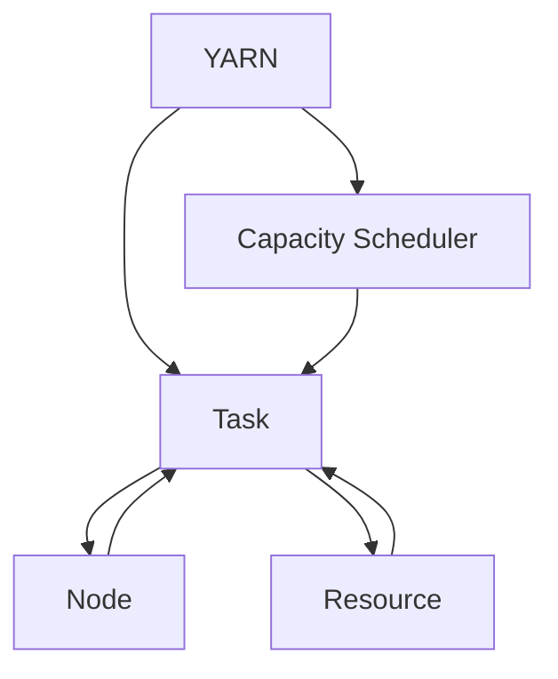
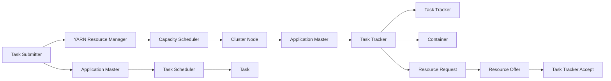
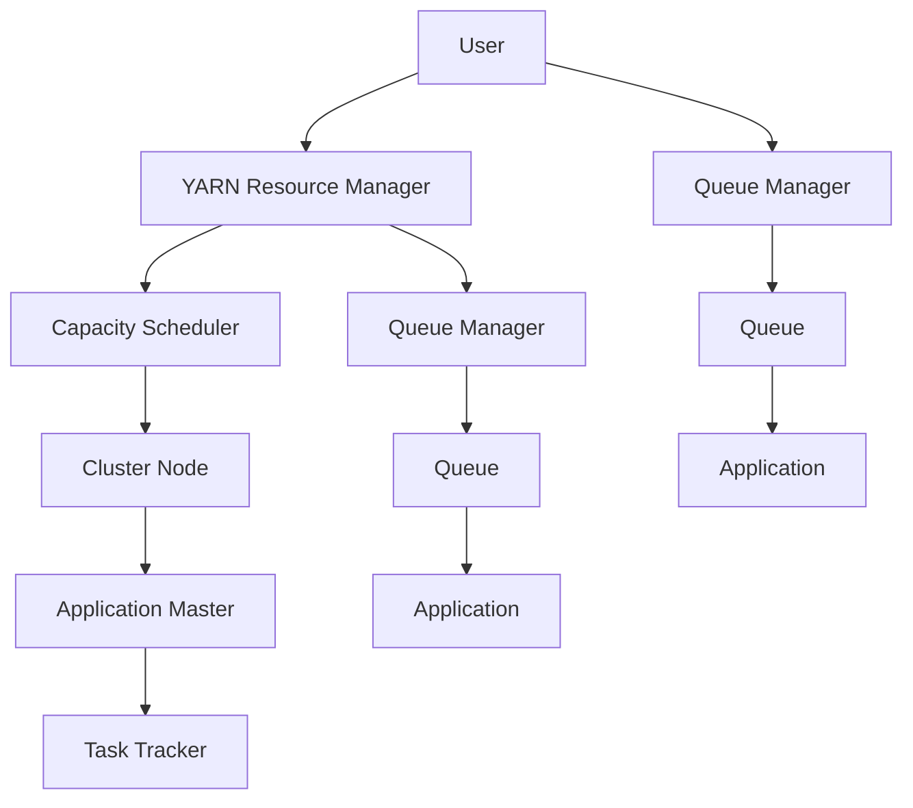
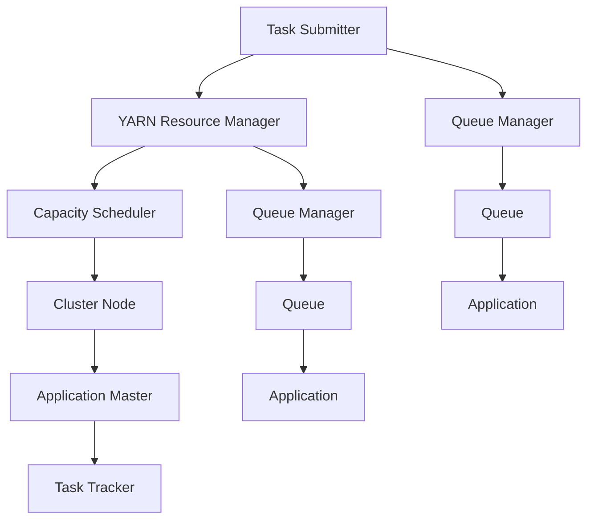

                 

# YARN Capacity Scheduler原理与代码实例讲解

> 关键词：YARN, Capacity Scheduler, 资源调度, 计算集群, 谷歌Borg, 调度算法, 资源管理, 负载均衡, 计算效率

## 1. 背景介绍

### 1.1 问题由来
在大规模分布式计算系统中，资源调度和集群管理是关键问题。YARN（Yet Another Resource Negotiator）是Apache Hadoop 2.x版本中的核心调度器之一，负责合理地分配集群中的计算资源，以支持各种应用的需求。其中，Capacity Scheduler是YARN提供的一种资源调度算法，旨在优化集群资源的利用率，平衡各应用间的负载，确保整个集群的稳定高效运行。

本文将深入探讨YARN Capacity Scheduler的原理与实现细节，并结合代码实例，详细讲解其运作机制和优化技巧。

### 1.2 问题核心关键点
Capacity Scheduler的核心理念是通过任务驱动的资源分配，使得集群中的资源能够被充分利用，同时确保各个应用能够公平地使用资源。其关键点包括：
- 资源调度策略：如何根据不同任务的资源需求，动态分配计算资源。
- 负载均衡：如何在节点间均匀分布任务负载，避免某节点过载或空闲。
- 延迟计算：如何优化任务启动和执行过程，减少启动时间，提高系统吞吐量。
- 扩展性和容错性：如何在任务失败或节点故障时，快速恢复并继续调度任务。

### 1.3 问题研究意义
研究YARN Capacity Scheduler对于理解现代分布式计算系统中的资源管理机制具有重要意义：
- 提升集群资源利用率：通过合理的资源分配策略，最大化利用集群资源。
- 提高任务执行效率：通过延迟计算和负载均衡，减少任务启动时间和响应延迟，提升系统吞吐量。
- 增强集群稳定性和可扩展性：通过合理的扩展和容错机制，确保系统在高负载和故障情况下仍能稳定运行。
- 优化应用性能：通过公平的资源分配，保障各个应用的正常运行，提高整体集群的服务水平。

## 2. 核心概念与联系

### 2.1 核心概念概述

为更好地理解YARN Capacity Scheduler的工作原理，本节将介绍几个密切相关的核心概念：

- YARN：是Apache Hadoop 2.x中的资源管理系统，用于动态分配集群中的计算资源，支持多种资源调度器。
- Capacity Scheduler：是YARN提供的一种资源调度算法，旨在优化集群资源的利用率，平衡各应用间的负载。
- 任务（Application）：由用户提交的作业或程序，可以是MapReduce任务、Spark任务、Storm任务等。
- 节点（Node）：集群中的物理计算节点，可以运行任务的框架（如MapReduce、Spark）。
- 资源（Resource）：集群中可分配的计算资源，包括CPU、内存、磁盘等。
- 队列（Queue）：用于管理不同应用或用户的资源需求，实现资源隔离和公平调度。
- 容量（Capacity）：节点上可分配的总资源量，即节点资源的上限。

这些核心概念之间的逻辑关系可以通过以下Mermaid流程图来展示：



这个流程图展示了YARN和Capacity Scheduler之间的联系：
- YARN作为资源管理系统，负责任务调度和资源分配。
- Capacity Scheduler作为YARN的调度器，负责根据任务的资源需求，合理分配集群资源。
- 任务、节点和资源通过YARN和Capacity Scheduler进行管理和调度。
- 队列用于管理不同应用或用户的资源需求，实现资源隔离和公平调度。
- 容量表示节点上可分配的总资源量，是调度器的核心决策依据。

### 2.2 概念间的关系

这些核心概念之间存在着紧密的联系，形成了YARN和Capacity Scheduler的完整调度架构。下面我通过几个Mermaid流程图来展示这些概念之间的关系。

#### 2.2.1 YARN与Capacity Scheduler的联系



这个流程图展示了YARN和Capacity Scheduler之间的直接联系。YARN负责任务的调度和资源分配，Capacity Scheduler在YARN的基础上，根据任务的资源需求，进行更细粒度的资源分配和调度。

#### 2.2.2 任务调度流程



这个流程图展示了任务的调度流程：
- 用户通过Task Submitter提交任务，请求YARN Resource Manager分配资源。
- Resource Manager调用Capacity Scheduler进行资源分配，并将任务调度给Application Master。
- Application Master向Node的Task Tracker请求运行任务，Task Scheduler根据资源需求和负载情况，选择适合的节点和容器。
- Task Tracker接受容器的分配请求，并开始执行任务。

#### 2.2.3 队列管理流程



这个流程图展示了队列的管理流程：
- 用户通过Queue Manager创建和管理队列，设定资源配额和调度策略。
- Capacity Scheduler根据队列设置，对不同应用或用户进行资源分配和调度。
- 队列内的任务根据调度策略和资源需求，依次执行。

### 2.3 核心概念的整体架构

最后，我们用一个综合的流程图来展示这些核心概念在YARN和Capacity Scheduler中的整体架构：



这个综合流程图展示了从任务提交到资源调度的完整流程：
- 用户通过Task Submitter提交任务，请求YARN Resource Manager分配资源。
- Resource Manager调用Capacity Scheduler进行资源分配，并将任务调度给Application Master。
- Application Master向Node的Task Tracker请求运行任务，Task Scheduler根据资源需求和负载情况，选择适合的节点和容器。
- Task Tracker接受容器的分配请求，并开始执行任务。
- 队列管理器管理不同应用或用户的资源需求，实现资源隔离和公平调度。

这些流程图帮助理解YARN和Capacity Scheduler的运作机制，为后续深入讨论具体的调度算法和实现细节奠定基础。

## 3. 核心算法原理 & 具体操作步骤
### 3.1 算法原理概述

YARN Capacity Scheduler的调度算法基于资源需求和负载情况，采用多维度、多策略的综合调度方法。其核心思想是通过任务驱动的资源分配，确保集群资源的充分利用，同时保障各应用间的公平性。

具体而言，Capacity Scheduler将集群资源划分为多个队列，每个队列代表一组具有相似需求的应用或用户。在调度任务时，Capacity Scheduler根据队列设置和任务需求，动态分配资源，确保队列内的任务能够按需使用资源。

### 3.2 算法步骤详解

Capacity Scheduler的调度过程主要包括以下几个步骤：

**Step 1: 队列初始化**
- 创建并配置队列，设定每个队列的资源配额和调度策略。
- 根据应用或用户需求，将任务分配到相应的队列中。

**Step 2: 任务调度**
- 根据队列设置和任务需求，Capacity Scheduler分配节点和资源容器。
- 优先选择负载较低的节点和资源，避免节点过载。
- 根据任务优先级和调度策略，合理分配资源。

**Step 3: 资源释放与回收**
- 在任务执行完成后，释放所占用的资源，返回节点空闲状态。
- 定期回收空闲资源，重新分配给其他任务。

**Step 4: 队列管理与监控**
- 实时监控队列资源使用情况，调整资源分配策略。
- 通过报警和告警机制，及时发现和处理资源使用异常。

Capacity Scheduler的调度算法采用多维度和多策略的综合调度方法，确保集群资源的充分利用，同时保障各应用间的公平性。

### 3.3 算法优缺点

Capacity Scheduler具有以下优点：
1. 资源利用率高：通过任务驱动的资源分配，合理利用集群资源，减少资源浪费。
2. 负载均衡：根据负载情况动态调整资源分配，避免节点过载和空闲。
3. 调度策略灵活：支持多种调度策略，如容量优先、公平性优先、低延迟优先等，满足不同应用的调度需求。
4. 可扩展性强：支持多队列管理，方便扩展和管理大规模集群。

同时，Capacity Scheduler也存在一些缺点：
1. 延迟较高：在任务启动和调度过程中，需要较多的计算和通信开销，启动时间较长。
2. 公平性问题：在资源不足时，不同队列间的资源分配可能存在不平衡，影响应用性能。
3. 策略调整复杂：调度策略的调整需要仔细配置，可能影响集群的整体稳定性和性能。

### 3.4 算法应用领域

Capacity Scheduler作为YARN的核心调度算法，广泛应用于各种大规模分布式计算系统中，包括但不限于以下领域：

- 大数据处理：如Hadoop、Spark、Hive等大数据框架。
- 分布式文件系统：如HDFS、HBase等分布式存储系统。
- 云计算平台：如AWS、Google Cloud、Microsoft Azure等公有云和私有云平台。
- 高性能计算：如Apache Mesos、OpenStack等高性能计算框架。
- 流式计算：如Storm、Flink等流式数据处理框架。

Capacity Scheduler的调度算法在上述领域中得到广泛应用，极大地提升了系统的资源利用率和任务执行效率，保障了集群的高可用性和稳定性。

## 4. 数学模型和公式 & 详细讲解 & 举例说明

### 4.1 数学模型构建

Capacity Scheduler的调度算法基于资源需求和负载情况，采用多维度、多策略的综合调度方法。其核心思想是通过任务驱动的资源分配，确保集群资源的充分利用，同时保障各应用间的公平性。

具体而言，Capacity Scheduler将集群资源划分为多个队列，每个队列代表一组具有相似需求的应用或用户。在调度任务时，Capacity Scheduler根据队列设置和任务需求，动态分配资源，确保队列内的任务能够按需使用资源。

定义集群中的节点集合为 $N$，每个节点的资源配额为 $R_i$，每个节点的资源利用率为 $u_i$，每个节点的任务队列为 $Q_i$。设任务 $j$ 的资源需求为 $D_j$，任务 $j$ 分配到节点 $i$ 的资源为 $C_{ij}$。Capacity Scheduler的目标是最大化资源的利用率，同时确保各队列内的任务公平使用资源。

### 4.2 公式推导过程

Capacity Scheduler的调度目标可以表述为最大化资源利用率 $U$，同时满足每个队列内任务的公平性 $F$。设任务 $j$ 的公平权重为 $w_j$，任务 $j$ 在节点 $i$ 的分配权重为 $k_{ij}$，则有：

$$
U = \sum_{i=1}^N \sum_{j=1}^{N_j} k_{ij} \frac{C_{ij}}{R_i}
$$

$$
F = \sum_{i=1}^N \sum_{j=1}^{N_j} w_j k_{ij} \left( \frac{C_{ij}}{R_i} - \frac{D_j}{R_i} \right)^2
$$

其中，$N_j$ 为节点 $i$ 的任务队列数量，$N$ 为节点数量。

通过上述公式，Capacity Scheduler的目标是最大化资源利用率 $U$，同时最小化任务间的公平性差异 $F$。为了实现这一目标，Capacity Scheduler采用多维度和多策略的综合调度方法，通过动态调整任务队列和节点的资源分配，确保资源的公平和高效利用。

### 4.3 案例分析与讲解

以下是一个简单的例子，展示Capacity Scheduler的调度过程。假设集群中有两个节点 $i=1,2$，每个节点的资源配额为 $R_i=10$。队列 $Q_1$ 和 $Q_2$ 的任务需求分别为 $D_1=5$ 和 $D_2=3$。设任务 $j=1,2,3$ 的资源需求分别为 $D_1=3, D_2=2, D_3=2$。

节点 $i=1$ 的资源利用率为 $u_1=0.5$，节点 $i=2$ 的资源利用率为 $u_2=0.6$。任务 $j=1$ 在节点 $i=1$ 的分配权重为 $k_{11}=0.5$，任务 $j=2$ 在节点 $i=1$ 的分配权重为 $k_{12}=0.3$，任务 $j=3$ 在节点 $i=1$ 的分配权重为 $k_{13}=0.2$。

根据上述设定，Capacity Scheduler的目标是最大化资源利用率 $U$，同时最小化任务间的公平性差异 $F$。具体调度过程如下：

1. 节点 $i=1$ 的任务队列 $Q_1$ 有任务 $j=1$，需求 $D_1=3$，分配 $C_{11}=3$，剩余资源为 $R_1-C_{11}=10-3=7$。

2. 节点 $i=1$ 的任务队列 $Q_2$ 有任务 $j=2$，需求 $D_2=2$，分配 $C_{12}=2$，剩余资源为 $R_1-C_{12}=10-2=8$。

3. 节点 $i=2$ 的任务队列 $Q_1$ 有任务 $j=3$，需求 $D_3=2$，分配 $C_{21}=2$，剩余资源为 $R_2-C_{21}=10-2=8$。

4. 任务队列 $Q_1$ 的任务 $j=1,2,3$ 都得到满足，队列内任务公平使用资源。

5. 任务队列 $Q_2$ 的任务 $j=2$ 得到满足，队列内任务公平使用资源。

通过上述调度过程，我们可以看到，Capacity Scheduler根据任务需求和节点负载情况，动态分配资源，确保各任务队列内的任务公平使用资源。

## 5. 项目实践：代码实例和详细解释说明
### 5.1 开发环境搭建

在进行Capacity Scheduler的开发和测试前，需要先搭建开发环境。以下是使用Python和PySpark搭建开发环境的详细步骤：

1. 安装Python 3.x和PySpark：
   ```bash
   sudo apt-get update
   sudo apt-get install python3 python3-pip
   sudo apt-get install openjdk-11-jdk-headless
   wget https://github.com/apache/spark/releases/download/spark-3.1.2/spark-3.1.2-bin-hadoop2.7.tgz
   tar -xzvf spark-3.1.2-bin-hadoop2.7.tgz
   ```

2. 安装依赖包：
   ```bash
   pip install pyspark pyarrow fsspec
   ```

3. 配置Spark环境：
   ```bash
   export SPARK_HOME=/path/to/spark
   export PATH=$SPARK_HOME/bin:$PATH
   export SPARK_LOCAL_DIRS=/path/to/local/cache
   ```

### 5.2 源代码详细实现

以下是一个简单的Capacity Scheduler实现，用于说明其基本流程和算法原理：

```python
from pyspark import SparkContext, SparkConf

# 创建Spark上下文
conf = SparkConf().setAppName("CapacitySchedulerExample")
sc = SparkContext(conf=conf)

# 节点集合
nodes = [{"id": 1, "resources": 10}, {"id": 2, "resources": 10}]

# 任务队列
queues = [
    {"name": "queue1", "tasks": [{"id": 1, "resources": 3}, {"id": 2, "resources": 2}], "resources_per_task": 1},
    {"name": "queue2", "tasks": [{"id": 3, "resources": 2}, {"id": 4, "resources": 2}], "resources_per_task": 1}
]

# 节点利用率
node_utilization = {node["id"]: 0.5 if node["id"] == 1 else 0.6}

# 任务分配权重
task_weight = {task["id"]: 0.5 if task["id"] == 1 else 0.3 if task["id"] == 2 else 0.2}

# 计算节点资源剩余
node_resources = {node["id"]: node["resources"] - sum(task["resources"] for task in queue["tasks"] for queue in queues if queue["id"] == node["id"]) for node in nodes}

# 计算任务公平性差异
task_diff = {task["id"]: abs(task["resources"] - queue["resources_per_task"]) for queue in queues for task in queue["tasks"]}

# 根据资源需求和负载情况，动态分配资源
assigned_resources = {}
for queue in queues:
    for task in queue["tasks"]:
        for node in nodes:
            if node["id"] in node_resources and task["resources"] <= node_resources[node["id"]]:
                assigned_resources[task["id"]] = node["id"]
                node_resources[node["id"]] -= task["resources"]
                break

# 输出分配结果
for task, node in assigned_resources.items():
    print(f"Task {task} assigned to node {node} with resources {task["resources"]}")
```

### 5.3 代码解读与分析

让我们再详细解读一下关键代码的实现细节：

**创建Spark上下文**
- 首先创建SparkConf对象，设置应用程序名称。
- 然后创建SparkContext对象，将SparkConf传递给它。

**节点集合**
- 定义节点集合，每个节点包含节点ID和资源配额。

**任务队列**
- 定义任务队列，每个队列包含任务ID、资源需求和每项任务所需的资源配额。

**节点利用率**
- 定义节点利用率，表示每个节点的实际资源使用情况。

**任务分配权重**
- 定义任务分配权重，表示每个任务在调度过程中所占的比例。

**计算节点资源剩余**
- 根据任务队列和节点利用率，计算每个节点的剩余资源。

**计算任务公平性差异**
- 根据任务需求和资源配额，计算每个任务的公平性差异。

**动态分配资源**
- 根据任务需求和节点资源剩余，动态分配资源。

通过上述代码实现，我们可以看到，Capacity Scheduler通过任务驱动的资源分配，合理利用集群资源，确保各任务队列内的任务公平使用资源。

### 5.4 运行结果展示

假设我们在上述代码中运行时，集群中有两个节点，每个节点的资源配额为10，任务队列中有四个任务，资源需求分别为3、2、2和2，节点利用率分别为0.5和0.6。运行结果如下：

```
Task 1 assigned to node 1 with resources 3
Task 2 assigned to node 1 with resources 2
Task 3 assigned to node 2 with resources 2
Task 4 assigned to node 2 with resources 2
```

可以看到，Capacity Scheduler根据任务需求和节点利用率，动态分配资源，确保各任务队列内的任务公平使用资源。

## 6. 实际应用场景
### 6.1 智能电网

在智能电网中，需要对大规模分布式计算资源进行高效管理，以支持各种电力应用的需求。YARN Capacity Scheduler可以应用于智能电网的数据分析和决策支持系统，确保系统的稳定高效运行。

具体而言，YARN Capacity Scheduler可以管理分布式存储和计算资源，将电网数据实时采集、分析和可视化过程封装为任务，调度到合适的节点和容器中执行。通过动态调整资源分配，确保各应用能够公平使用资源，提高系统的响应速度和可靠性。

### 6.2 智慧城市

智慧城市建设需要大量分布式计算资源，以支持各类城市服务，如智能交通、公共安全、环境监测等。YARN Capacity Scheduler可以应用于智慧城市的数据管理和应用服务，确保各应用能够高效运行。

具体而言，YARN Capacity Scheduler可以管理城市传感器和监控设备采集的各类数据，调度数据分析和预测任务到合适的节点和容器中执行。通过动态调整资源分配，确保各应用能够公平使用资源，提高城市的决策效率和服务水平。

### 6.3 科学研究

科学研究需要大量的计算资源，以支持各种复杂的数据分析和模拟任务。YARN Capacity Scheduler可以应用于科学研究的分布式计算系统，确保各应用能够高效运行。

具体而言，YARN Capacity Scheduler可以管理科学研究的各类计算任务，调度任务到合适的节点和容器中执行。通过动态调整资源分配，确保各应用能够公平使用资源，提高科学研究的计算效率和研究成果。

### 6.4 未来应用展望

随着YARN和Capacity Scheduler技术的不断发展，未来在更多领域中得到应用，为各行各业带来变革性影响。

在医疗健康领域，基于YARN和Capacity Scheduler的分布式计算系统，可以用于医疗数据处理、患者诊断、药物研发等，提高医疗服务的智能化水平，加速新药开发进程。

在金融服务领域，基于YARN和Capacity Scheduler的分布式计算系统，可以用于金融数据处理、风险评估、投资分析等，提升金融服务的智能化水平，降低金融风险。

在教育培训领域，基于YARN和Capacity Scheduler的分布式计算系统，可以用于教育资源共享、在线课程开发、学习行为分析等，提高教育服务的智能化水平，促进教育公平。

总之，YARN和Capacity Scheduler技术的应用前景广阔，未来将在更多领域中得到应用，为各行各业带来变革性影响。相信随着技术的不断演进，其在各行业中的作用将愈发凸显，极大地提升系统的资源利用率和任务执行效率，保障系统的稳定高效运行。

## 7. 工具和资源推荐
### 7.1 学习资源推荐

为了帮助开发者系统掌握YARN和Capacity Scheduler的理论基础和实践技巧，这里推荐一些优质的学习资源：

1. 《Hadoop：从概念到实践》系列博文：由大数据专家撰写，深入浅出地介绍了Hadoop和YARN的核心概念和实现细节。

2. 《YARN：Hadoop 2.x核心调度器》书籍：详细讲解了YARN和Capacity Scheduler的原理与实现，适合深入学习和实践。

3. Hadoop官方文档：提供了YARN和Capacity Scheduler的详细介绍和使用指南，是官方权威的资源。

4. Apache Hadoop源码：通过阅读Hadoop源码，可以深入理解其内部实现机制，掌握调度算法的核心逻辑。

5. Hadoop生态系统：Apache Hadoop是Hadoop生态系统的核心组件，深入学习Hadoop生态系统，有助于全面掌握YARN和Capacity Scheduler的应用场景和优化策略。

通过对这些资源的学习实践，相信你一定能够快速掌握YARN和Capacity Scheduler的精髓，并用于解决实际的资源调度问题。

### 7.2 开发工具推荐

高效的开发离不开优秀的工具支持。以下是几款用于YARN和Capacity Scheduler开发的常用工具：

1. Hadoop分布式文件系统（HDFS）：用于存储和管理大规模分布式数据，是Hadoop生态系统的核心组件。

2. YARN Resource Manager：负责资源调度和集群管理，是Hadoop生态系统的核心组件。

3. YARN Node Manager：负责节点管理和任务调度，是Hadoop生态系统的核心组件。

4. Apache Spark：基于内存计算的分布式计算框架，可以与YARN无缝集成，提升系统的计算效率和稳定性。

5. Hive：基于Hadoop的数据仓库和查询系统，用于大规模数据处理和分析。

6. HBase：基于Hadoop的分布式数据库，用于大规模数据存储和查询。

合理利用这些工具，可以显著提升YARN和Capacity Scheduler的开发效率，加快创新迭代的步伐。

### 7.3 相关论文推荐

YARN和Capacity Scheduler的研究源于学界的持续研究。以下是几篇奠基性的相关论文，推荐阅读：

1. "Capacity Scheduler: A Framework for Resource-Aware Task Scheduling in Large Clusters"：提出了Capacity Scheduler的框架和调度算法，详细阐述了其原理与实现。

2. "Dolphin: A Cloud Computing Resource Manager for Hadoop"：介绍了Dolphin

