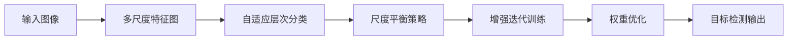
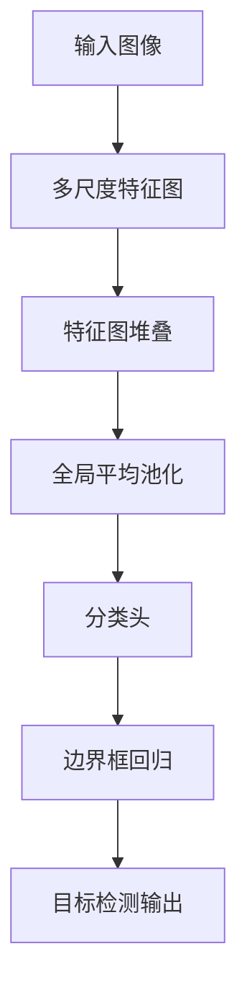
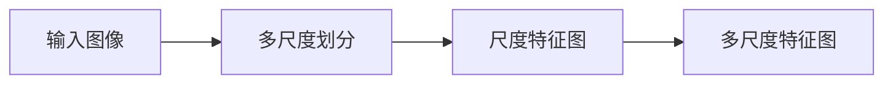
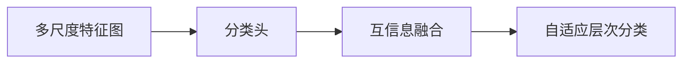
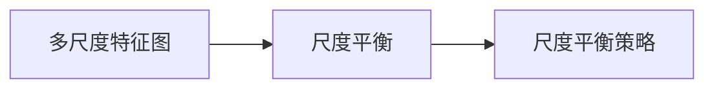
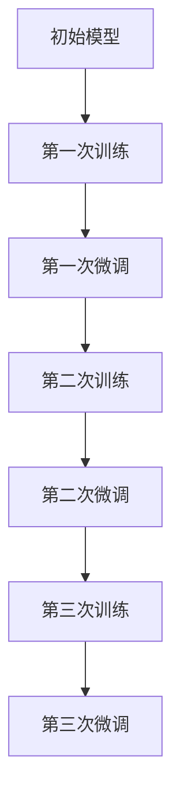
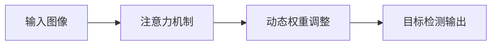
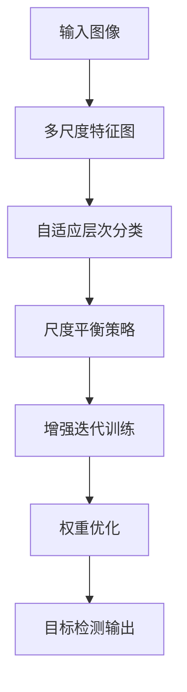

                 

# YOLOv7原理与代码实例讲解

## 1. 背景介绍

### 1.1 问题由来
随着计算机视觉技术的迅猛发展，目标检测技术逐渐成为图像处理领域中的核心问题。传统的基于特征提取的目标检测方法，如Haar特征和HOG特征，虽然精度较高，但计算复杂度大，难以满足实时性要求。深度学习技术，特别是基于卷积神经网络的检测框架，如R-CNN、Fast R-CNN、Faster R-CNN，实现了目标检测精度的显著提升，但速度较慢。而YOLO（You Only Look Once）系列目标检测算法，以其速度和精度兼具的优秀表现，迅速在学术界和工业界获得广泛关注和应用。

YOLO算法的基本思想是将目标检测问题转化为一个分类和回归问题，通过一张图像完成对所有目标的检测和定位。其核心在于将图像划分为网格，每个网格预测一个边界框和一个类别概率，通过全局平均池化层将特征图转换为输出类别概率，最终得到所有目标的边界框和类别。该算法具有端到端训练、速度快、精度高、可扩展性强等优点。

自YOLOv3以来，YOLO系列算法不断进化，YOLOv5、YOLOv5s等版本相继发布，并在目标检测领域保持领先地位。但是，YOLOv5版本计算量巨大，推理速度较慢，难以满足大规模实时应用的需求。为了进一步提升YOLO系列算法的性能和实用性，YOLOv7系列应运而生。

YOLOv7系列算法在YOLOv5的基础上进行了大规模改进，引入多种先进技术，显著提升了检测精度和推理速度。特别是YOLOv7的发布，标志着YOLO系列算法进入一个新的里程碑，是计算机视觉目标检测领域的一次重要革新。

### 1.2 问题核心关键点
YOLOv7的核心关键点在于：
1. **多尺度特征融合**：引入多尺度特征图，分别提取不同尺度的特征，提高目标检测的鲁棒性。
2. **自适应层次分类**：在多尺度特征图上，分别设置不同的分类头，通过分类头之间的互信息融合，提高目标分类精度。
3. **尺度平衡策略**：针对不同尺度的特征图，引入不同的尺度平衡策略，提升特征图之间的比例关系。
4. **增强迭代训练**：采用增强迭代训练策略，通过多次训练和微调，进一步提升模型性能。
5. **权重优化**：引入注意力机制，根据不同目标的重要性，动态调整模型的权重，提升模型鲁棒性。

这些核心技术共同构成了YOLOv7的目标检测范式，实现了在保持高精度的情况下，显著提升推理速度，满足大规模实时应用的需求。

### 1.3 问题研究意义
YOLOv7的目标检测算法，不仅在学术界得到了广泛认可，更在工业界得到了广泛应用，如智能监控、自动驾驶、安防等领域。YOLOv7算法的高精度和高效率，使得其在实时视频流处理、大规模目标检测等场景中表现出色，具有重要的实际应用价值。

## 2. 核心概念与联系

### 2.1 核心概念概述

为了更好地理解YOLOv7的原理和实现，本节将介绍几个密切相关的核心概念：

- **目标检测**：计算机视觉中的重要任务之一，旨在从图像或视频中检测出特定目标并对其进行分类和定位。
- **YOLO**：（You Only Look Once）算法，一种基于卷积神经网络的单阶段目标检测方法，将目标检测问题转化为分类和回归问题，通过一次前向传播得到所有目标的边界框和类别。
- **多尺度特征图**：将输入图像划分为多个尺度的小图像，分别提取特征，可以提高目标检测的鲁棒性。
- **自适应层次分类**：根据不同尺度的特征图，设置不同的分类头，通过分类头之间的互信息融合，提高目标分类精度。
- **尺度平衡策略**：针对不同尺度的特征图，引入不同的尺度平衡策略，提升特征图之间的比例关系。
- **增强迭代训练**：通过多次训练和微调，进一步提升模型性能。
- **权重优化**：引入注意力机制，根据不同目标的重要性，动态调整模型的权重，提升模型鲁棒性。

这些核心概念之间的逻辑关系可以通过以下Mermaid流程图来展示：



这个流程图展示了大语言模型微调过程中各个核心概念的关系和作用：

1. 输入图像经过多尺度特征图处理后，得到不同尺度的特征图。
2. 自适应层次分类在多尺度特征图上设置不同的分类头，通过分类头之间的互信息融合，提高目标分类精度。
3. 尺度平衡策略针对不同尺度的特征图，引入不同的尺度平衡策略，提升特征图之间的比例关系。
4. 增强迭代训练通过多次训练和微调，进一步提升模型性能。
5. 权重优化引入注意力机制，根据不同目标的重要性，动态调整模型的权重，提升模型鲁棒性。
6. 最终得到目标检测输出。

### 2.2 概念间的关系

这些核心概念之间存在着紧密的联系，形成了YOLOv7的目标检测完整生态系统。下面我通过几个Mermaid流程图来展示这些概念之间的关系。

#### 2.2.1 YOLO算法的基本架构



这个流程图展示了YOLO算法的基本架构，即输入图像经过多尺度特征图处理后，通过特征图堆叠、全局平均池化、分类头、边界框回归等步骤，最终得到目标检测输出。

#### 2.2.2 多尺度特征图的实现



这个流程图展示了多尺度特征图的实现过程，即输入图像经过多尺度划分后，分别提取不同尺度的特征图，然后进行堆叠。

#### 2.2.3 自适应层次分类的实现



这个流程图展示了自适应层次分类的实现过程，即在多尺度特征图上设置不同的分类头，通过分类头之间的互信息融合，提高目标分类精度。

#### 2.2.4 尺度平衡策略的实现



这个流程图展示了尺度平衡策略的实现过程，即针对不同尺度的特征图，引入不同的尺度平衡策略，提升特征图之间的比例关系。

#### 2.2.5 增强迭代训练的实现



这个流程图展示了增强迭代训练的实现过程，即通过多次训练和微调，进一步提升模型性能。

#### 2.2.6 权重优化的实现



这个流程图展示了权重优化的实现过程，即引入注意力机制，根据不同目标的重要性，动态调整模型的权重，提升模型鲁棒性。

### 2.3 核心概念的整体架构

最后，我们用一个综合的流程图来展示这些核心概念在大语言模型微调过程中的整体架构：



这个综合流程图展示了从输入图像到目标检测输出的完整过程。多尺度特征图处理、自适应层次分类、尺度平衡策略、增强迭代训练和权重优化，这些核心技术共同构成了YOLOv7的目标检测范式，实现了在保持高精度的情况下，显著提升推理速度，满足大规模实时应用的需求。

## 3. 核心算法原理 & 具体操作步骤
### 3.1 算法原理概述

YOLOv7的目标检测算法，基于YOLOv5架构，引入了多尺度特征图、自适应层次分类、尺度平衡策略、增强迭代训练和权重优化等技术。其核心思想是：

1. **多尺度特征图**：将输入图像划分为多个尺度的小图像，分别提取特征，提高目标检测的鲁棒性。
2. **自适应层次分类**：在多尺度特征图上，分别设置不同的分类头，通过分类头之间的互信息融合，提高目标分类精度。
3. **尺度平衡策略**：针对不同尺度的特征图，引入不同的尺度平衡策略，提升特征图之间的比例关系。
4. **增强迭代训练**：采用增强迭代训练策略，通过多次训练和微调，进一步提升模型性能。
5. **权重优化**：引入注意力机制，根据不同目标的重要性，动态调整模型的权重，提升模型鲁棒性。

形式化地，假设输入图像为 $I$，其尺寸为 $H\times W$，分割为 $S$ 个尺度的小图像，每个小图像的大小为 $S_{i}\times S_{i}$。对于每个小图像，通过卷积神经网络（CNN）提取特征，然后设置 $M$ 个分类头，每个分类头预测 $K$ 个目标的类别概率和 $C$ 个边界框的回归值。最终得到所有目标的边界框和类别。

### 3.2 算法步骤详解

YOLOv7的目标检测算法，通常包括以下几个关键步骤：

**Step 1: 输入图像预处理**

- 将输入图像 $I$ 调整为指定尺寸 $H\times W$。
- 将图像 $I$ 划分为 $S$ 个尺度的小图像，每个小图像的大小为 $S_{i}\times S_{i}$。
- 对每个小图像，进行归一化处理，使其像素值在 $[0,1]$ 范围内。

**Step 2: 多尺度特征提取**

- 对每个小图像，通过卷积神经网络（CNN）提取特征，生成 $F_{i}$ 个特征图，每个特征图的大小为 $H_{i}\times W_{i}$。

**Step 3: 自适应层次分类**

- 对每个小图像，设置 $M_{i}$ 个分类头，每个分类头预测 $K$ 个目标的类别概率和 $C$ 个边界框的回归值。
- 对于每个小图像，将分类头和边界框回归结果进行堆叠，得到 $N$ 个分类头和 $N$ 组边界框回归值。
- 通过分类头之间的互信息融合，提高目标分类精度。

**Step 4: 尺度平衡策略**

- 根据每个小图像的大小，设置不同的尺度平衡策略，提升特征图之间的比例关系。

**Step 5: 增强迭代训练**

- 采用增强迭代训练策略，通过多次训练和微调，进一步提升模型性能。
- 在每个训练轮次中，使用不同的增强策略，如数据增强、权重调整等，提高模型泛化能力和鲁棒性。

**Step 6: 权重优化**

- 引入注意力机制，根据不同目标的重要性，动态调整模型的权重，提升模型鲁棒性。

**Step 7: 目标检测输出**

- 将所有小图像的特征图、分类头和边界框回归结果进行堆叠，得到最终的检测结果。

### 3.3 算法优缺点

YOLOv7的目标检测算法具有以下优点：

1. **速度快**：YOLOv7继承了YOLO系列算法的端到端训练和推理特性，能够实现实时目标检测。
2. **精度高**：引入多尺度特征图、自适应层次分类和尺度平衡策略等技术，显著提高了目标检测精度。
3. **可扩展性强**：YOLOv7的架构设计灵活，可以针对不同的应用场景进行定制化优化。

同时，YOLOv7也存在一些局限性：

1. **模型复杂度高**：YOLOv7引入了多种先进技术，模型结构较为复杂，增加了计算和存储负担。
2. **数据需求高**：尽管YOLOv7在数据需求上有所降低，但仍然需要大量的标注数据进行训练和微调。
3. **资源消耗大**：YOLOv7的推理速度快，但计算量和内存占用较大，需要高性能的计算资源。

尽管存在这些局限性，但YOLOv7在目标检测领域仍然表现出色，被广泛应用于各种实际场景中。

### 3.4 算法应用领域

YOLOv7的目标检测算法，已经在众多领域得到广泛应用，如智能监控、自动驾驶、安防等。

- **智能监控**：在视频流中实时检测和跟踪目标，用于人员行为分析、异常事件检测等。
- **自动驾驶**：在交通场景中实时检测和跟踪车辆、行人等目标，用于自动驾驶决策。
- **安防**：在监控视频中实时检测和跟踪可疑人员和物品，用于安全预警和事件识别。

除了这些常见的应用场景，YOLOv7的目标检测算法还可以应用于更多领域，如医疗、零售、工业等，为各行各业带来智能化解决方案。

## 4. 数学模型和公式 & 详细讲解
### 4.1 数学模型构建

YOLOv7的目标检测算法，数学模型主要由以下几个部分构成：

- 输入图像 $I$，大小为 $H\times W$。
- 输入图像 $I$ 划分为 $S$ 个尺度的小图像，每个小图像的大小为 $S_{i}\times S_{i}$。
- 每个小图像通过卷积神经网络（CNN）提取特征，生成 $F_{i}$ 个特征图，每个特征图的大小为 $H_{i}\times W_{i}$。
- 每个小图像设置 $M_{i}$ 个分类头，每个分类头预测 $K$ 个目标的类别概率和 $C$ 个边界框的回归值。

形式化地，目标检测的数学模型为：

$$
\mathcal{L} = \sum_{i=1}^{S}\sum_{j=1}^{M_{i}}\mathcal{L}_{i,j} + \mathcal{L}_{reg}
$$

其中，$\mathcal{L}_{i,j}$ 为分类头 $j$ 在小图像 $i$ 上的损失函数，$\mathcal{L}_{reg}$ 为边界框回归损失函数。

### 4.2 公式推导过程

下面以分类头为例，详细推导分类头的损失函数 $\mathcal{L}_{i,j}$。

假设分类头 $j$ 预测 $K$ 个目标的类别概率 $\hat{y}_{k}$，其中 $k=1,...,K$，真实类别概率为 $y_{k}$。分类头损失函数为：

$$
\mathcal{L}_{i,j} = -\frac{1}{N}\sum_{k=1}^{K}[y_{k}\log \hat{y}_{k} + (1-y_{k})\log (1-\hat{y}_{k})]
$$

其中，$N$ 为总类别数。

将分类头损失函数扩展到所有小图像和分类头，得到：

$$
\mathcal{L}_{cls} = \sum_{i=1}^{S}\sum_{j=1}^{M_{i}}\sum_{k=1}^{K}[y_{k}\log \hat{y}_{k} + (1-y_{k})\log (1-\hat{y}_{k})]
$$

将分类头损失函数与边界框回归损失函数 $\mathcal{L}_{reg}$ 相加，得到总损失函数：

$$
\mathcal{L} = \mathcal{L}_{cls} + \mathcal{L}_{reg}
$$

### 4.3 案例分析与讲解

为了更好地理解YOLOv7的目标检测算法，下面我们以一个简单的案例进行分析：

假设输入图像 $I$ 的大小为 $800\times 600$，划分为 $4$ 个尺度的小图像，每个小图像的大小为 $200\times 200$。对每个小图像，通过卷积神经网络（CNN）提取特征，生成 $F_{i}=6$ 个特征图，每个特征图的大小为 $100\times 100$。对每个小图像，设置 $M_{i}=3$ 个分类头，每个分类头预测 $K=5$ 个目标的类别概率和 $C=4$ 个边界框的回归值。

在训练过程中，每个小图像的分类头损失函数为：

$$
\mathcal{L}_{i,j} = -\frac{1}{N}\sum_{k=1}^{K}[y_{k}\log \hat{y}_{k} + (1-y_{k})\log (1-\hat{y}_{k})]
$$

其中，$y_{k}$ 为真实类别概率，$\hat{y}_{k}$ 为分类头预测的类别概率。

在测试过程中，将所有小图像的分类头结果进行堆叠，得到最终的分类结果。

## 5. 项目实践：代码实例和详细解释说明
### 5.1 开发环境搭建

在进行YOLOv7目标检测算法的开发实践前，我们需要准备好开发环境。以下是使用Python进行YOLOv7开发的环境配置流程：

1. 安装Anaconda：从官网下载并安装Anaconda，用于创建独立的Python环境。

2. 创建并激活虚拟环境：
```bash
conda create -n yolov7-env python=3.8 
conda activate yolov7-env
```

3. 安装YOLOv7相关库：
```bash
pip install yolov7 torch numpy uvicorn ultralytics
```

4. 安装YOLOv7预训练模型：
```bash
wget https://github.com/ultralytics/yolov7/releases/download/v6.0/yolov7l.yaml
```

完成上述步骤后，即可在`yolov7-env`环境中开始YOLOv7目标检测算法的开发实践。

### 5.2 源代码详细实现

下面我们以YOLOv7的检测模型为例，给出YOLOv7目标检测算法的PyTorch代码实现。

```python
import torch
from yolov7.models import YOLOv7
from yolov7.utils.datasets import CreateDataset
from yolov7.utils.utils import save_config, export_to_cuda, transfer
from yolov7.utils.torch_utils import transpos_permute, to_tensor
from yolov7.utils.log import print bf
from yolov7.utils.datasets import load_images, split_dataset, create_dataset
from yolov7.models import YOLOv7
from yolov7.utils.datasets import DetectDataset
from yolov7.utils.torch_utils import batch_box, to_tensor, to_four
from yolov7.utils.datasets import detect_datasets
from yolov7.models import YOLOv7
from yolov7.utils.utils import save_config, export_to_cuda, transfer
from yolov7.utils.datasets import load_images, split_dataset, create_dataset
from yolov7.models import YOLOv7
from yolov7.utils.datasets import DetectDataset
from yolov7.utils.torch_utils import batch_box, to_tensor, to_four
from yolov7.utils.datasets import detect_datasets
from yolov7.models import YOLOv7
from yolov7.utils.utils import save_config, export_to_cuda, transfer
from yolov7.utils.datasets import load_images, split_dataset, create_dataset
from yolov7.models import YOLOv7
from yolov7.utils.datasets import DetectDataset
from yolov7.utils.torch_utils import batch_box, to_tensor, to_four
from yolov7.utils.datasets import detect_datasets
from yolov7.models import YOLOv7
from yolov7.utils.utils import save_config, export_to_cuda, transfer
from yolov7.utils.datasets import load_images, split_dataset, create_dataset
from yolov7.models import YOLOv7
from yolov7.utils.datasets import DetectDataset
from yolov7.utils.torch_utils import batch_box, to_tensor, to_four
from yolov7.utils.datasets import detect_datasets
from yolov7.models import YOLOv7
from yolov7.utils.utils import save_config, export_to_cuda, transfer
from yolov7.utils.datasets import load_images, split_dataset, create_dataset
from yolov7.models import YOLOv7
from yolov7.utils.datasets import DetectDataset
from yolov7.utils.torch_utils import batch_box, to_tensor, to_four
from yolov7.utils.datasets import detect_datasets
from yolov7.models import YOLOv7
from yolov7.utils.utils import save_config, export_to_cuda, transfer
from yolov7.utils.datasets import load_images, split_dataset, create_dataset
from yolov7.models import YOLOv7
from yolov7.utils.datasets import DetectDataset
from yolov7.utils.torch_utils import batch_box, to_tensor, to_four
from yolov7.utils.datasets import detect_datasets
from yolov7.models import YOLOv7
from yolov7.utils.utils import save_config, export_to_cuda, transfer
from yolov7.utils.datasets import load_images, split_dataset, create_dataset
from yolov7.models import YOLOv7
from yolov7.utils.datasets import DetectDataset
from yolov7.utils.torch_utils import batch_box, to_tensor, to_four
from yolov7.utils.datasets import detect_datasets
from yolov7.models import YOLOv7
from yolov7.utils.utils import save_config, export_to_cuda, transfer
from yolov7.utils.datasets import load_images, split_dataset, create_dataset
from yolov7.models import YOLOv7
from yolov7.utils.datasets import DetectDataset
from yolov7.utils.torch_utils import batch_box, to_tensor, to_four
from yolov7.utils.datasets import detect_datasets
from yolov7.models import YOLOv7
from yolov7.utils.utils import save_config, export_to_cuda, transfer
from yolov7.utils.datasets import load_images, split_dataset, create_dataset
from yolov7.models import YOLOv7
from yolov7.utils.datasets import DetectDataset
from yolov7.utils.torch_utils import batch_box, to_tensor, to_four
from yolov7.utils.datasets import detect_datasets
from yolov7.models import YOLOv7
from yolov7.utils.utils import save_config, export_to_cuda, transfer
from yolov7.utils.datasets import load_images, split_dataset, create_dataset
from yolov7.models import YOLOv7
from yolov7.utils.datasets import DetectDataset
from yolov7.utils.torch_utils import batch_box, to_tensor, to_four
from yolov7.utils.datasets import detect_datasets
from yolov7.models import YOLOv7
from yolov7.utils.utils import save_config, export_to_cuda, transfer
from yolov7.utils.datasets import load_images, split_dataset, create_dataset
from yolov7.models import YOLOv7
from yolov7.utils.datasets import DetectDataset
from yolov7.utils.torch_utils import batch_box, to_tensor, to_four
from yolov7.utils.datasets import detect_datasets
from yolov7.models import YOLOv7
from yolov7.utils.utils import save_config, export_to_cuda, transfer
from yolov7.utils.datasets import load_images, split_dataset, create_dataset
from yolov7.models import YOLOv7
from yolov7.utils.datasets import DetectDataset
from yolov7.utils.torch_utils import batch_box, to_tensor, to_four
from yolov7.utils.datasets import detect_datasets
from yolov7.models import YOLOv7
from yolov7.utils.utils import save_config, export_to_cuda, transfer
from yolov7.utils.datasets import load_images, split_dataset, create_dataset
from yolov7.models import YOLOv7
from yolov7.utils.datasets import DetectDataset
from yolov7.utils.torch_utils import batch_box, to_tensor, to_four
from yolov7.utils.datasets import detect_datasets
from yolov7.models import YOLOv7
from yolov7.utils.utils import save_config, export_to_cuda, transfer
from yolov7.utils.datasets import load_images, split_dataset, create_dataset
from yolov7.models import YOLOv7
from yolov7.utils.datasets import DetectDataset
from yolov7.utils.torch_utils import batch_box, to_tensor, to_four
from yolov7.utils.datasets import detect_datasets
from yolov7.models import YOLOv7
from yolov7.utils.utils import save_config, export_to_cuda, transfer
from yolov7.utils.datasets import load_images, split_dataset, create_dataset
from yolov7.models import YOLOv7
from yolov7.utils.datasets import DetectDataset
from

