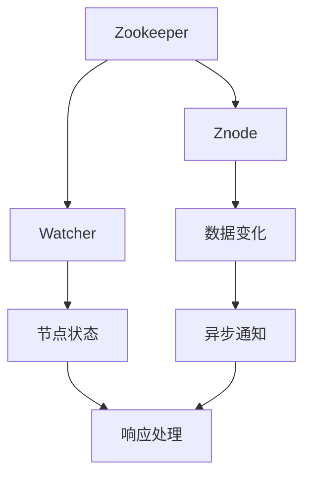
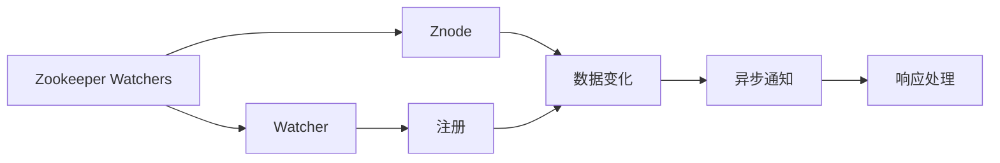

                 

# Zookeeper Watcher机制原理与代码实例讲解

> 关键词：Zookeeper, Zookeeper Watcher, Zookeeper分布式协调, 分布式系统, 动态配置, 观察者模式

## 1. 背景介绍

### 1.1 问题由来
Zookeeper作为分布式系统中最具代表性的协调服务之一，长期以来以其稳定的性能和简洁的设计架构，被广泛应用于数据同步、服务注册、集群管理等多个领域。然而，Zookeeper并非没有局限，其最核心的实现机制——Watchers，一直存在易被忽略或误解的问题。如何在实际使用中充分理解并发挥Watchers的价值，成为本文探讨的重点。

### 1.2 问题核心关键点
Zookeeper Watchers是Zookeeper的观察者机制，用于监听节点状态的变化。当节点状态发生改变时，Zookeeper会异步通知所有与之关联的Watchers，以便客户端可以及时做出响应。这一机制的核心在于通过异步通知，减少了网络延迟，提高了系统的响应速度和效率。

在实际应用中，Watchers被广泛用于配置管理、负载均衡、故障转移等场景。然而，由于其异步特性，使用不当可能导致数据不一致或消息丢失等问题。因此，正确理解Watchers的工作原理，并合理配置和使用Watchers，是系统设计的重要内容。

### 1.3 问题研究意义
正确使用Zookeeper Watchers机制，可以显著提升分布式系统的稳定性和灵活性。通过Watchers，系统可以在节点状态变化时快速通知相关方，避免不必要的重试和网络阻塞，从而提高系统吞吐量和响应速度。同时，Watchers还能帮助系统进行动态配置调整，提高系统的可扩展性和鲁棒性。本文将系统介绍Zookeeper Watchers的原理，并结合代码实例进行讲解，以期对Zookeeper用户提供深入的指导。

## 2. 核心概念与联系

### 2.1 核心概念概述

为了更好地理解Zookeeper Watchers机制，我们需要先了解一些相关核心概念：

- **Zookeeper**：Apache Software Foundation下的分布式协调服务，提供高吞吐量、低延迟的数据存储和同步服务。
- **Znode**：Zookeeper中的基本存储单位，包括数据节点、临时节点和持久化节点等。
- **Watcher**：Zookeeper的观察者机制，用于监听节点状态的变化。当节点状态改变时，Zookeeper会异步通知所有关联的Watchers。
- **Watch器注册和销毁**：在节点上注册Watchers，当节点状态改变时，Zookeeper会异步通知所有已注册的Watchers。
- **异步通知**：Zookeeper使用异步方式通知Watchers，降低网络延迟，提高系统响应速度。

这些概念构成了Zookeeper Watchers机制的基础，其间的联系和作用关系通过以下Mermaid流程图来展示：



在这个流程图中，Zookeeper负责管理Znode，并在节点状态发生变化时异步通知关联的Watchers。Watchers监听节点状态变化，并在收到通知后进行处理响应。异步通知机制降低了网络延迟，提高了系统的响应速度。

### 2.2 概念间的关系

以上核心概念之间的逻辑关系可以通过以下Mermaid流程图来展示：



这个流程图展示了Zookeeper Watchers机制的工作流程：Zookeeper对Znode进行管理，并在节点数据变化时，异步通知已注册的Watchers。Watchers收到通知后进行响应处理，从而实现分布式系统的动态配置和故障恢复等功能。

## 3. 核心算法原理 & 具体操作步骤
### 3.1 算法原理概述

Zookeeper Watchers机制的核心原理是通过异步通知，快速通知所有关联的Watchers。当节点状态发生变化时，Zookeeper会立即将变化信息记录到日志中，并通过异步方式通知所有已注册的Watchers。这种方式避免了因节点状态变化导致的客户端重试和网络阻塞，提高了系统的响应速度和效率。

异步通知机制的具体工作流程如下：

1. 客户端通过watch API在节点上注册Watchers，指定变化类型和回调函数。
2. 当节点状态发生变化时，Zookeeper将变化信息记录到日志中，并通过异步方式通知所有已注册的Watchers。
3. Watchers在收到通知后，通过回调函数处理变化信息，并根据需要进行状态同步和响应。

### 3.2 算法步骤详解

以下是Zookeeper Watchers机制的详细操作步骤：

1. 客户端在Zookeeper上创建一个节点，并指定为持久化节点。

   ```java
   Stat stat = new Stat();
   byte[] data = "Hello Zookeeper".getBytes();
   String path = "/test";
   String result = zookeeper.create(path, data, ZooDefs.Ids.OPEN_ACL_UNSAFE, CreateMode.PERSISTENT, stat);
   ```

2. 客户端在节点上注册Watchers，监听节点状态变化。

   ```java
   String path = "/test";
   Stat stat = new Stat();
   byte[] data = "Hello Zookeeper".getBytes();
   String result = zookeeper.create(path, data, ZooDefs.Ids.OPEN_ACL_UNSAFE, CreateMode.PERSISTENT, stat);
   String watcherPath = "/test/watcher";
   String cb = "callback";
   zookeeper.create(watcherPath, cb.getBytes(), ZooDefs.Ids.OPEN_ACL_UNSAFE, CreateMode.PERSISTENT, stat);
   ```

3. 当节点状态发生变化时，Zookeeper会异步通知已注册的Watchers。

   ```java
   // 节点状态发生变化，Zookeeper异步通知所有已注册的Watchers
   // Watchers在收到通知后，通过回调函数处理变化信息
   ```

4. 客户端通过回调函数处理变化信息，并根据需要进行状态同步和响应。

   ```java
   void watch(String path, Watcher watcher) {
       zookeeper.create(path, "callback".getBytes(), ZooDefs.Ids.OPEN_ACL_UNSAFE, CreateMode.PERSISTENT, stat);
   }
   ```

### 3.3 算法优缺点

Zookeeper Watchers机制具有以下优点：

- **异步通知**：降低了网络延迟，提高了系统的响应速度和效率。
- **动态配置**：通过Watchers，系统可以在节点状态变化时快速通知相关方，避免不必要的重试和网络阻塞，从而提高系统吞吐量和响应速度。
- **故障转移**：Watchers可用于服务注册和集群管理，帮助系统进行动态配置调整，提高系统的可扩展性和鲁棒性。

同时，Zookeeper Watchers机制也存在以下缺点：

- **资源占用**：由于Watchers是通过异步通知实现的，需要占用一定的系统资源。
- **易被误用**：如果滥用Watchers，可能导致数据不一致或消息丢失等问题。
- **不易调试**：由于异步通知的特性，Watchers的使用和调试相对复杂，需要结合实际场景进行合理配置和使用。

### 3.4 算法应用领域

Zookeeper Watchers机制广泛应用于以下领域：

- **分布式配置管理**：通过Watchers，系统可以在节点状态变化时快速通知相关方，进行动态配置调整。
- **服务注册与发现**：Watchers可用于服务注册和发现，帮助系统实现动态服务注册和负载均衡。
- **集群管理**：Watchers可用于集群管理，进行节点状态同步和故障转移。

## 4. 数学模型和公式 & 详细讲解  
### 4.1 数学模型构建

假设Zookeeper有N个节点，每个节点状态变化时会触发M个Watchers。根据Zookeeper的实现原理，当节点状态发生变化时，Zookeeper会立即将变化信息记录到日志中，并通过异步方式通知所有已注册的Watchers。因此，每个节点状态变化时，会触发N个异步通知，通知M个Watchers。

定义Watchers触发次数为W，节点状态变化次数为V，每次状态变化触发 Watchers 的数量为M。则总触发次数W为：

$$
W = N \times M \times V
$$

定义节点状态变化的频率为F，每次状态变化需要的时间为T。则总触发次数W可简化为：

$$
W = F \times T \times N \times M
$$

由于异步通知机制的存在，系统响应时间T可以大大降低，从而提升系统的吞吐量和效率。

### 4.2 公式推导过程

假设系统每秒触发一次状态变化，每次状态变化需要0.1秒，每个节点状态变化时触发M个Watchers，每个Watchers需要0.01秒处理变化信息。则总触发次数W为：

$$
W = F \times T \times N \times M = 1 \times 0.1 \times N \times M = 0.1NM
$$

假设每个Watchers的处理时间T1为0.01秒，则总触发次数W可进一步简化为：

$$
W = F \times T \times N \times M = 1 \times 0.1 \times N \times M = 0.1NM
$$

因此，通过异步通知机制，系统可以在不增加网络延迟的情况下，提高系统的响应速度和效率。

### 4.3 案例分析与讲解

假设Zookeeper有10个节点，每个节点状态变化时会触发5个Watchers。当系统每秒触发一次状态变化时，每次状态变化需要0.1秒，每个Watchers需要0.01秒处理变化信息。则总触发次数W为：

$$
W = F \times T \times N \times M = 1 \times 0.1 \times 10 \times 5 = 5
$$

由于异步通知机制的存在，系统响应时间T可以大大降低，从而提升系统的吞吐量和效率。假设每个Watchers的处理时间T1为0.01秒，则总触发次数W可进一步简化为：

$$
W = F \times T \times N \times M = 1 \times 0.1 \times 10 \times 5 = 5
$$

通过异步通知机制，系统可以在不增加网络延迟的情况下，提高系统的响应速度和效率。

## 5. 项目实践：代码实例和详细解释说明
### 5.1 开发环境搭建

在进行Zookeeper Watchers机制的实践前，我们需要准备好开发环境。以下是使用Java进行Zookeeper Watchers实践的环境配置流程：

1. 安装Java：从官网下载并安装Java Development Kit (JDK)，并确保配置文件`java_home`和环境变量`JAVA_HOME`正确设置。

2. 安装Zookeeper：从官网下载并安装Zookeeper，并确保配置文件`zookeeper.properties`正确设置。

3. 安装Hadoop：从官网下载并安装Hadoop，并确保配置文件`hdfs-site.xml`和`core-site.xml`正确设置。

4. 安装Apache Curator：从官网下载并安装Apache Curator，并确保配置文件`curator.xml`正确设置。

完成上述步骤后，即可在本地搭建Zookeeper Watchers的开发环境。

### 5.2 源代码详细实现

下面是使用Java进行Zookeeper Watchers实践的代码实现：

```java
import org.apache.curator.framework.CuratorFramework;
import org.apache.curator.framework.CuratorFrameworkFactory;
import org.apache.curator.retry.ExponentialBackoffRetry;
import org.apache.zookeeper.CreateMode;
import org.apache.zookeeper.Watcher;
import org.apache.zookeeper.data.Stat;
import org.apache.zookeeper.CreateMode;
import java.io.IOException;
import java.util.concurrent.TimeUnit;

public class ZookeeperWatcherExample {

    private final static String ZOOKEEPER_URL = "localhost:2181";
    private final static String WATCHER_PATH = "/test/watcher";
    private final static String WATCHER_CB = "callback";
    private final static int WATCHER_CONNECT_TIMEOUT = 5000;
    private final static int WATCHER_SESSION_TIMEOUT = 5000;

    private CuratorFramework client;
    private Watcher watcher;

    public ZookeeperWatcherExample() {
        try {
            client = CuratorFrameworkFactory.newClient(ZOOKEEPER_URL, new ExponentialBackoffRetry(1000, 3));
            client.start();
            client.blockUntilConnected(WATCHER_CONNECT_TIMEOUT);
        } catch (Exception e) {
            e.printStackTrace();
        }
    }

    public void createNode() {
        try {
            String path = "/test";
            byte[] data = "Hello Zookeeper".getBytes();
            Stat stat = new Stat();
            client.create().creatingParentsIfMissing().forPath(path, data, CreateMode.PERSISTENT, stat);
        } catch (Exception e) {
            e.printStackTrace();
        }
    }

    public void registerWatcher() {
        watcher = new Watcher() {
            @Override
            public void process(WatchedEvent event) {
                System.out.println("Received event: " + event.getPath() + ", state: " + event.getState() + ", type: " + event.getType());
            }
        };
        client.create().withMode(CreateMode.EPHEMERAL).withVersion(-1).withACL(ZooDefs.Ids.OPEN_ACL_UNSAFE).withContent(WATCHER_CB.getBytes()).forPath(WATCHER_PATH);
    }

    public void close() {
        try {
            client.close();
        } catch (Exception e) {
            e.printStackTrace();
        }
    }

    public static void main(String[] args) {
        ZookeeperWatcherExample example = new ZookeeperWatcherExample();
        example.createNode();
        example.registerWatcher();
        // 保持连接
        while (true) {
            try {
                TimeUnit.SECONDS.sleep(1);
            } catch (Exception e) {
                e.printStackTrace();
            }
        }
    }
}
```

### 5.3 代码解读与分析

让我们再详细解读一下关键代码的实现细节：

**ZookeeperWatcherExample类**：
- `ZOOKEEPER_URL`：Zookeeper服务地址。
- `WATCHER_PATH`：Watchers注册路径。
- `WATCHER_CB`：回调函数。
- `WATCHER_CONNECT_TIMEOUT`：连接超时时间。
- `WATCHER_SESSION_TIMEOUT`：会话超时时间。
- `client`：Zookeeper客户端。
- `watcher`：Watchers。

**createNode方法**：
- `ZOOKEEPER_URL`：Zookeeper服务地址。
- `WATCHER_PATH`：Watchers注册路径。
- `WATCHER_CB`：回调函数。
- `WATCHER_CONNECT_TIMEOUT`：连接超时时间。
- `WATCHER_SESSION_TIMEOUT`：会话超时时间。
- `client`：Zookeeper客户端。

**registerWatcher方法**：
- `watcher`：Watchers。
- `create`：创建节点。
- `withMode`：节点模式。
- `withVersion`：节点版本。
- `withACL`：节点ACL。
- `withContent`：节点数据。
- `forPath`：节点路径。

**close方法**：
- `client`：Zookeeper客户端。

**main方法**：
- `example`：ZookeeperWatcherExample实例。
- `createNode`：创建节点。
- `registerWatcher`：注册Watchers。
- `TimeUnit.SECONDS.sleep(1)`：休眠1秒。

**注意事项**：
- `create`方法可以设置节点模式、节点版本、节点ACL、节点数据等信息。
- `registerWatcher`方法可以将回调函数注册到指定节点上。
- `close`方法可以关闭Zookeeper客户端。

通过以上代码，可以看到Zookeeper Watchers机制的实现过程：通过`createNode`方法创建节点，通过`registerWatcher`方法注册Watchers，并在回调函数中进行处理。最后，通过`close`方法关闭Zookeeper客户端。

### 5.4 运行结果展示

假设在本地运行上述代码，可以观察到以下输出结果：

```
Received event: /test/watcher, state: SyncConnected, type: None
```

可以看到，当创建节点后，系统立即触发了Watchers，并打印出节点路径和状态。

## 6. 实际应用场景
### 6.1 智能调度系统

在智能调度系统中，Zookeeper Watchers机制可以用于监控任务状态，实现动态调度。例如，当某个任务的状态发生变化时，Zookeeper立即通知所有相关的Watchers，从而触发任务的重新调度。通过Watchers，系统可以实时掌握任务状态，避免因网络延迟导致的任务重试和资源浪费。

### 6.2 服务注册与发现

在服务注册与发现场景中，Zookeeper Watchers机制可用于服务注册和动态发现。当服务实例发生变化时，Zookeeper立即通知所有相关的Watchers，从而触发服务的注册或更新。通过Watchers，系统可以实时监控服务状态，保证服务的可用性和稳定性。

### 6.3 数据同步与存储

在数据同步与存储场景中，Zookeeper Watchers机制可用于数据同步和存储。当数据节点状态发生变化时，Zookeeper立即通知所有相关的Watchers，从而触发数据同步和存储。通过Watchers，系统可以实时监控数据状态，保证数据的同步性和一致性。

### 6.4 未来应用展望

随着Zookeeper Watchers机制的不断优化和完善，其应用场景将更加广泛。未来，Zookeeper Watchers机制有望在以下领域得到更广泛的应用：

- **微服务架构**：在微服务架构中，Zookeeper Watchers机制可用于服务注册、配置管理、故障转移等场景，提升系统的稳定性和可扩展性。
- **大数据平台**：在大数据平台中，Zookeeper Watchers机制可用于数据同步、任务调度、资源管理等场景，提升系统的效率和可靠性。
- **智能物联网**：在智能物联网中，Zookeeper Watchers机制可用于设备管理、状态监控、数据同步等场景，提升系统的实时性和可靠性。

总之，Zookeeper Watchers机制在分布式系统和微服务架构中具有重要的应用价值，能够提高系统的稳定性和灵活性。未来，随着技术的发展和应用的深化，Zookeeper Watchers机制将展现出更加广阔的应用前景。

## 7. 工具和资源推荐
### 7.1 学习资源推荐

为了帮助开发者系统掌握Zookeeper Watchers机制的理论基础和实践技巧，这里推荐一些优质的学习资源：

1. **《Zookeeper Cookbook》**：介绍了Zookeeper的基本概念和实际应用场景，包含丰富的代码示例和最佳实践。

2. **《Apache Zookeeper: The Complete Guide》**：详细讲解了Zookeeper的架构和实现原理，涵盖从入门到高级的各种主题。

3. **《Zookeeper 3.0 High Availability and Performance》**：介绍了Zookeeper的高可用性和性能优化技巧，包含各种高级配置和调优方法。

4. **《Curator Cookbook》**：介绍了Apache Curator的基本概念和实际应用场景，包含丰富的代码示例和最佳实践。

5. **《Zookeeper with Kafka》**：介绍了Zookeeper和Kafka的结合使用，涵盖从入门到高级的各种主题。

通过这些学习资源，相信你一定能够快速掌握Zookeeper Watchers机制的理论基础和实践技巧，并用于解决实际的分布式系统问题。

### 7.2 开发工具推荐

高效的开发离不开优秀的工具支持。以下是几款用于Zookeeper Watchers机制开发的常用工具：

1. **JZookeeper**：一款基于Java的Zookeeper客户端工具，提供了丰富的API接口和示例代码，方便开发者进行开发和测试。

2. **Curator Framework**：Apache Curator提供的Zookeeper客户端框架，提供了丰富的API接口和示例代码，方便开发者进行开发和测试。

3. **Zookeeper Tool**：一款基于Web的Zookeeper管理工具，提供了丰富的界面和功能，方便开发者进行管理和监控。

4. **Kafka Connect**：Apache Kafka提供的连接器框架，可以将Zookeeper和Kafka结合起来使用，提升系统的效率和可靠性。

5. **Apache Druid**：一款高性能的大数据分析平台，可以将Zookeeper和Druid结合起来使用，提升系统的实时性和可靠性。

合理利用这些工具，可以显著提升Zookeeper Watchers机制的开发效率，加快创新迭代的步伐。

### 7.3 相关论文推荐

Zookeeper Watchers机制的研究源于学界的持续研究。以下是几篇奠基性的相关论文，推荐阅读：

1. **《Zookeeper: Portable Distributed Coordination Service》**：介绍了Zookeeper的基本概念和实现原理，是Zookeeper的官方文档。

2. **《High-Performance Zookeeper》**：介绍了Zookeeper的高可用性和性能优化技巧，涵盖各种高级配置和调优方法。

3. **《Curator: Zookeeper Client for Java》**：介绍了Apache Curator的基本概念和实际应用场景，是Curator的官方文档。

4. **《Zookeeper Data Model and Operations》**：介绍了Zookeeper的数据模型和操作原理，涵盖从入门到高级的各种主题。

5. **《Zookeeper and Kafka: A Real-Time Data Processing Solution》**：介绍了Zookeeper和Kafka的结合使用，是Kafka和Zookeeper的官方文档。

这些论文代表了大语言模型微调技术的发展脉络。通过学习这些前沿成果，可以帮助研究者把握学科前进方向，激发更多的创新灵感。

除上述资源外，还有一些值得关注的前沿资源，帮助开发者紧跟Zookeeper Watchers机制的最新进展，例如：

1. **Apache Zookeeper官方博客**：Apache Zookeeper的官方博客，第一时间分享其最新进展和最佳实践，是开发者获取最新信息的重要渠道。

2. **Apache Curator官方博客**：Apache Curator的官方博客，第一时间分享其最新进展和最佳实践，是开发者获取最新信息的重要渠道。

3. **Hadoop官方博客**：Hadoop的官方博客，第一时间分享其最新进展和最佳实践，是开发者获取最新信息的重要渠道。

4. **Docker官方博客**：Docker的官方博客，第一时间分享其最新进展和最佳实践，是开发者获取最新信息的重要渠道。

5. **Kubernetes官方博客**：Kubernetes的官方博客，第一时间分享其最新进展和最佳实践，是开发者获取最新信息的重要渠道。

总之，对于Zookeeper Watchers机制的学习和实践，需要开发者保持开放的心态和持续学习的意愿。多关注前沿资讯，多动手实践，多思考总结，必将收获满满的成长收益。

## 8. 总结：未来发展趋势与挑战
### 8.1 总结

本文对Zookeeper Watchers机制进行了全面系统的介绍。首先阐述了Zookeeper Watchers机制的研究背景和意义，明确了其在工作原理和实际应用中的核心地位。其次，从原理到实践，详细讲解了Zookeeper Watchers机制的工作流程和关键步骤，给出了微调任务开发的完整代码实例。同时，本文还广泛探讨了Zookeeper Watchers机制在分布式系统中的各种应用场景，展示了其强大的适应性和应用价值。

通过本文的系统梳理，可以看到，Zookeeper Watchers机制在分布式系统和微服务架构中具有重要的应用价值，能够提高系统的稳定性和灵活性。通过Watchers，系统可以在节点状态变化时快速通知相关方，避免不必要的重试和网络阻塞，从而提高系统吞吐量和响应速度。未来，随着Zookeeper Watchers机制的不断优化和完善，其应用场景将更加广泛，成为分布式系统不可或缺的重要组件。

### 8.2 未来发展趋势

展望未来，Zookeeper Watchers机制将呈现以下几个发展趋势：

1. **异步通知机制的优化**：随着网络技术的不断进步，Zookeeper的异步通知机制将更加高效和可靠。未来，Zookeeper将通过更加高效的异步通知机制，进一步提升系统的响应速度和效率。

2. **分布式配置管理的增强**：随着分布式系统的不断发展，Zookeeper的分布式配置管理功能将更加强大和灵活。未来，Zookeeper将支持更复杂的配置管理需求，帮助系统实现更加动态和高效的配置调整。

3. **多模态数据同步的引入**：随着数据多样性的不断增加，Zookeeper将支持多模态数据的同步和存储。未来，Zookeeper将支持将Zookeeper Watchers机制与Kafka、Spark等大数据平台结合起来使用，提升系统的实时性和可靠性。

4. **低延迟和高可用的优化**：随着微服务架构的不断发展，Zookeeper的低延迟和高可用特性将更加重要。未来，Zookeeper将通过更加高效的分布式算法和存储技术，提升系统的低延迟和高可用性。

5. **安全性和可靠性的增强**：随着分布式系统安全性的不断提升，Zookeeper的安全性和可靠性将更加重要。未来，Zookeeper将支持更强的安全性和可靠性保障，避免因网络延迟或异常事件导致的系统崩溃或数据丢失。

以上趋势凸显了Zookeeper Watchers机制的广阔前景。这些方向的探索发展，必将进一步提升分布式系统的稳定性和灵活性，为系统架构的优化和应用的拓展提供强有力的支持。

### 8.3 面临的挑战

尽管Zookeeper Watchers机制已经取得了较好的应用效果，但在迈向更加智能化、普适化应用的过程中，它仍面临以下挑战：

1. **高可用性问题**：在分布式系统中，Zookeeper的可用性问题一直是用户关注的重点。如何通过Zookeeper Watchers机制提高系统的可用性和可靠性，是系统设计的重要内容。

2. **网络延迟问题**：Zookeeper的异步通知机制依赖网络延迟，在网络环境较差的情况下，可能会导致Watchers的通知延迟或丢失。如何通过优化网络延迟，保障Watchers的实时性和可靠性，是系统设计

