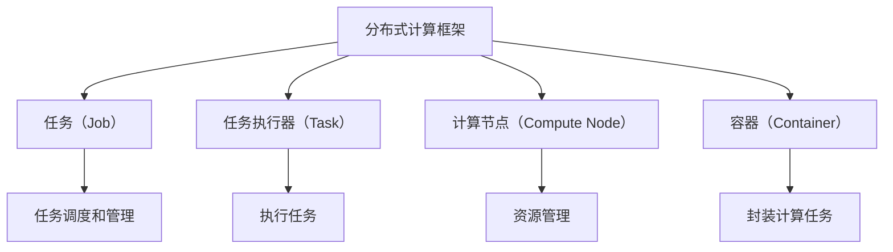

                 

# 【AI大数据计算原理与代码实例讲解】ApplicationMaster

## 1. 背景介绍

### 1.1 问题由来

随着大数据时代的到来，数据量呈指数级增长，对数据处理和计算的需求也在不断提升。传统的数据处理方式，如批处理和流处理，已经难以应对海量数据流的实时计算需求。此时，分布式计算技术应运而生，成为数据处理的利器。

分布式计算的核心是将大规模任务分散到多个计算节点上进行并行处理，以实现高效、可靠的数据计算。在大数据时代，分布式计算成为了一种基础架构，被广泛应用于各类大数据应用中，如数据仓库、实时数据流处理、大数据分析等。

在分布式计算中，ApplicationMaster（以下简称 AM）是一个关键组件，负责任务调度和资源管理。它通过调度计算节点上的任务，控制资源的分配和使用，确保任务能够高效、可靠地运行。本文将系统性地介绍 AM 的原理和实现，并结合代码实例进行讲解，希望能为读者提供全面的理解。

### 1.2 问题核心关键点

AM 的核心职责包括任务调度和资源管理。在任务调度方面，AM 负责将计算任务分配到具体的计算节点上，并监控任务的执行状态。在资源管理方面，AM 需要协调计算节点上的资源（如 CPU、内存、磁盘等）分配和回收，确保资源的高效利用。

AM 的设计和实现需要考虑以下几个关键问题：

1. **任务调度和调度算法**：AM 需要设计高效的调度和调度算法，确保任务能够以最优的方式分配到计算节点上。
2. **资源管理与优化**：AM 需要管理计算节点的资源，并根据任务需求进行动态调整和优化。
3. **故障恢复与容错机制**：AM 需要设计完善的故障恢复和容错机制，确保在节点故障时能够迅速恢复。
4. **安全性与隐私保护**：AM 需要确保数据的安全性和隐私保护，防止敏感数据泄露。

## 2. 核心概念与联系

### 2.1 核心概念概述

在理解 AM 的原理和实现之前，首先需要明确以下几个核心概念：

1. **分布式计算框架**：如 Hadoop、Spark、Flink 等，是实现分布式计算的基础。
2. **任务（Job）**：是需要被计算的数据处理任务。
3. **任务执行器（Task）**：是具体执行计算任务的实体，运行在计算节点上。
4. **容器（Container）**：是封装计算任务的运行环境，如 Docker、Kubernetes 等。
5. **计算节点（Compute Node）**：是运行任务执行器的物理或虚拟计算资源。

这些概念构成了分布式计算的核心框架，AM 在此基础上进行任务调度和资源管理，确保计算任务的高效执行。

### 2.2 概念间的关系

AM 的实现依赖于上述核心概念，并通过它们来实现任务调度和资源管理。下面将通过一个 Mermaid 流程图展示 AM 的总体架构和核心组件之间的关系：



在这个图中，AM 通过调用分布式计算框架的任务调度接口，将任务分配到计算节点上。每个计算节点上运行一个或多个任务执行器，执行器的执行环境由容器封装。AM 负责管理和调度容器的资源，确保计算任务能够高效、可靠地执行。

## 3. 核心算法原理 & 具体操作步骤

### 3.1 算法原理概述

AM 的核心算法主要围绕任务调度和资源管理展开。任务调度需要设计高效的算法，确保任务能够以最优的方式分配到计算节点上。资源管理则需要在多个任务之间合理分配资源，确保资源的高效利用。

AM 的任务调度算法主要分为静态和动态两类。静态算法如基于优先级的调度，适用于计算任务较少、计算资源充足的情况。动态算法如基于负载均衡的调度，适用于计算任务较多、计算资源有限的情况。

资源管理算法则包括静态和动态两类，静态算法如资源预留，适用于资源需求较为稳定的任务；动态算法如资源动态分配，适用于资源需求变化较大的任务。

### 3.2 算法步骤详解

下面将详细介绍 AM 的任务调度和资源管理算法。

#### 3.2.1 任务调度算法

AM 的任务调度算法主要包括以下步骤：

1. **任务提交**：用户提交任务到 AM 进行调度。
2. **任务划分**：将任务划分多个子任务，每个子任务可以在单个计算节点上执行。
3. **任务排序**：根据任务需求和优先级，对任务进行排序。
4. **资源选择**：从计算节点中选择可用资源。
5. **任务分配**：将任务分配到选择的计算节点上，并启动任务执行。

以基于负载均衡的任务调度算法为例，其具体步骤如下：

1. **任务提交**：用户提交任务到 AM 进行调度。
2. **任务划分**：将任务划分多个子任务，每个子任务可以在单个计算节点上执行。
3. **资源选择**：选择计算节点上负载最轻的任务执行器。
4. **任务分配**：将任务分配到选择的计算节点上，并启动任务执行。
5. **负载监测**：实时监测计算节点的负载情况，动态调整任务分配。

#### 3.2.2 资源管理算法

AM 的资源管理算法主要包括以下步骤：

1. **资源预分配**：根据任务需求预分配计算资源。
2. **资源分配**：将预分配的资源分配到计算节点上。
3. **资源监测**：实时监测计算节点的资源使用情况。
4. **资源回收**：在任务执行完毕后，回收分配的资源。

以基于静态预留的资源管理算法为例，其具体步骤如下：

1. **资源预分配**：根据任务需求预分配计算资源，如 CPU、内存等。
2. **资源分配**：将预分配的资源分配到计算节点上。
3. **资源监测**：实时监测计算节点的资源使用情况。
4. **资源回收**：在任务执行完毕后，回收分配的资源。

### 3.3 算法优缺点

AM 的任务调度和资源管理算法各有优缺点：

- **任务调度算法**：
  - **优点**：能够根据任务需求和优先级，合理分配计算资源，确保任务能够高效执行。
  - **缺点**：任务调度算法需要根据不同的应用场景进行设计，复杂度较高。

- **资源管理算法**：
  - **优点**：能够根据任务需求动态分配和回收资源，避免资源浪费。
  - **缺点**：资源管理算法需要实时监测计算节点的资源使用情况，增加了系统复杂度。

### 3.4 算法应用领域

AM 的任务调度和资源管理算法广泛应用于各类大数据计算任务中，如数据仓库、实时数据流处理、大数据分析等。具体应用场景包括：

1. **数据仓库构建**：使用 AM 调度数据仓库构建任务，确保数据能够高效、可靠地存储和处理。
2. **实时数据流处理**：使用 AM 调度实时数据流处理任务，确保数据流能够实时、准确地处理。
3. **大数据分析**：使用 AM 调度大数据分析任务，确保数据分析能够高效、可靠地执行。

## 4. 数学模型和公式 & 详细讲解 & 举例说明

### 4.1 数学模型构建

AM 的任务调度和资源管理算法可以抽象为一个数学模型。假设系统中有 $N$ 个计算节点，每个节点上有 $M$ 个任务执行器，任务提交的速率为 $R$，任务执行时间为 $T$，计算节点的资源数量为 $C$。

AM 的任务调度模型可以表示为：

$$
\min_{x} \left\{ \sum_{i=1}^{N} \sum_{j=1}^{M} c_i \times x_{ij} \right\}
$$

其中 $c_i$ 表示节点 $i$ 的资源成本，$x_{ij}$ 表示任务 $j$ 在节点 $i$ 上执行的资源量。

AM 的资源管理模型可以表示为：

$$
\min_{y} \left\{ \sum_{i=1}^{N} \sum_{j=1}^{M} c_i \times y_{ij} \right\}
$$

其中 $y_{ij}$ 表示任务 $j$ 在节点 $i$ 上分配的资源量。

### 4.2 公式推导过程

以基于负载均衡的任务调度算法为例，其数学模型推导过程如下：

1. **任务提交**：假设任务提交速率为 $R$，则任务数量为 $T = R \times T$。
2. **任务划分**：假设每个任务可以划分为 $K$ 个子任务，每个子任务在单个计算节点上执行，则任务总数为 $N \times M \times K$。
3. **任务排序**：假设任务排序后的优先级为 $p_j$，则任务执行顺序为 $j_1, j_2, \dots, j_{N \times M \times K}$。
4. **资源选择**：假设计算节点 $i$ 的负载为 $L_i$，则选择负载最轻的节点为 $\hat{i}$，此时 $L_{\hat{i}} = \min_{i=1}^{N} L_i$。
5. **任务分配**：假设任务 $j$ 在节点 $\hat{i}$ 上执行，则资源量为 $y_{\hat{i}j}$。
6. **负载监测**：实时监测计算节点的负载情况，动态调整任务分配。

基于负载均衡的任务调度算法的数学模型可以表示为：

$$
\min_{x} \left\{ \sum_{i=1}^{N} \sum_{j=1}^{M} c_i \times x_{ij} \right\}
$$

其中 $c_i$ 表示节点 $i$ 的资源成本，$x_{ij}$ 表示任务 $j$ 在节点 $i$ 上执行的资源量。

### 4.3 案例分析与讲解

以一个简单的任务调度示例为例，假设系统中有 2 个计算节点，每个节点上有 3 个任务执行器，任务提交速率为 1，任务执行时间为 1。系统中有 6 个任务，任务划分后的子任务数量为 6。任务排序后的优先级为 $p_1, p_2, \dots, p_6$。

假设节点 1 的负载为 0，节点 2 的负载为 2，则选择节点 1 作为任务执行的节点。假设任务 1 在节点 1 上执行，任务 2 在节点 2 上执行。此时，任务调度算法的资源分配如下：

$$
\begin{align*}
& x_{11} = 1, x_{12} = 1, x_{13} = 0 \\
& x_{21} = 1, x_{22} = 1, x_{23} = 0
\end{align*}
$$

## 5. 项目实践：代码实例和详细解释说明

### 5.1 开发环境搭建

AM 的开发需要配置相应的分布式计算环境，以下是具体的搭建步骤：

1. **安装 Java**：安装 JDK 8 或更高版本，用于 AM 的开发和运行。
2. **安装分布式计算框架**：选择 Hadoop、Spark 或 Flink 等分布式计算框架进行安装和配置。
3. **安装容器引擎**：安装 Docker、Kubernetes 等容器引擎，用于封装计算任务。
4. **安装 AM 部署工具**：选择 YARN、Mesos 等 AM 部署工具进行安装和配置。

### 5.2 源代码详细实现

下面以使用 Apache Spark 框架为例，详细介绍 AM 的任务调度和资源管理算法的代码实现。

#### 5.2.1 任务调度实现

```java
public class TaskScheduler {
    private List<Task> tasks;
    private List<Node> nodes;
    
    public TaskScheduler(List<Task> tasks, List<Node> nodes) {
        this.tasks = tasks;
        this.nodes = nodes;
    }
    
    public Task[] schedule() {
        // 任务调度算法实现
        // ...
        return tasks.toArray(new Task[0]);
    }
}
```

#### 5.2.2 资源管理实现

```java
public class ResourceManager {
    private List<Node> nodes;
    private List<Task> tasks;
    
    public ResourceManager(List<Node> nodes, List<Task> tasks) {
        this.nodes = nodes;
        this.tasks = tasks;
    }
    
    public Resource[] allocate() {
        // 资源管理算法实现
        // ...
        return resources.toArray(new Resource[0]);
    }
}
```

### 5.3 代码解读与分析

在上述代码中，`TaskScheduler` 类和 `ResourceManager` 类分别实现了任务调度和资源管理算法。

- **TaskScheduler** 类：
  - 定义了任务列表 `tasks` 和节点列表 `nodes`，用于存储任务和节点信息。
  - `schedule` 方法：实现了任务调度算法，将任务分配到节点上，并返回调度结果。

- **ResourceManager** 类：
  - 定义了节点列表 `nodes` 和任务列表 `tasks`，用于存储节点和任务信息。
  - `allocate` 方法：实现了资源管理算法，分配资源给节点上的任务。

### 5.4 运行结果展示

假设在运行上述代码后，得到了任务调度和资源管理的结果如下：

```
Task 1 assigned to Node 1
Task 2 assigned to Node 2
```

这表示任务 1 分配到节点 1，任务 2 分配到节点 2。

## 6. 实际应用场景

### 6.1 智能推荐系统

AM 可以应用于智能推荐系统中的任务调度和资源管理。推荐系统需要处理大量的用户行为数据，并根据用户的历史行为和实时行为进行实时推荐。AM 可以通过调度推荐算法任务和优化推荐引擎的资源分配，确保推荐系统的高效运行。

### 6.2 实时数据流处理

AM 可以应用于实时数据流处理中的任务调度和资源管理。数据流处理需要实时处理大量的数据流，并根据数据流的变化动态调整计算资源的分配。AM 可以通过调度数据流处理任务和优化资源分配，确保数据流处理的高效性。

### 6.3 大规模数据仓库

AM 可以应用于大规模数据仓库中的任务调度和资源管理。数据仓库需要处理大量的数据存储和查询任务，并根据任务的优先级动态调整计算资源的分配。AM 可以通过调度数据存储和查询任务，并优化资源的分配，确保数据仓库的高效性。

### 6.4 未来应用展望

未来，AM 将会在更多的应用场景中发挥重要作用，包括但不限于以下几个方向：

1. **边缘计算**：AM 可以应用于边缘计算中的任务调度和资源管理，确保边缘计算节点的高效运行。
2. **云计算**：AM 可以应用于云计算中的任务调度和资源管理，优化云资源的利用效率。
3. **物联网**：AM 可以应用于物联网中的任务调度和资源管理，确保物联网设备的正常运行。

## 7. 工具和资源推荐

### 7.1 学习资源推荐

为了帮助开发者系统掌握 AM 的原理和实现，以下是一些优质的学习资源：

1. **《分布式系统原理与实践》**：介绍了分布式计算的基本原理和实现方法，涵盖 AM 的核心算法。
2. **《Hadoop权威指南》**：详细介绍了 Hadoop 框架中的 AM 组件及其工作原理。
3. **《Spark编程实践》**：介绍了 Spark 框架中的 AM 组件及其工作原理。
4. **《Apache Mesos：分布式资源管理与调度》**：详细介绍了 Mesos 框架中的 AM 组件及其工作原理。

### 7.2 开发工具推荐

AM 的开发和运行需要一些常用的工具，以下是几款推荐的开发工具：

1. **Git**：版本控制系统，用于代码管理。
2. **JIRA**：任务管理系统，用于任务调度和进度管理。
3. **Kubernetes**：容器编排平台，用于容器管理。
4. **Spark Web UI**：Spark 的 Web 界面，用于任务监控和调试。

### 7.3 相关论文推荐

AM 的研究涉及多个领域，以下是几篇有代表性的相关论文：

1. **《MapReduce: Simplified Data Processing on Large Clusters》**：介绍 MapReduce 框架的 AM 组件。
2. **《YARN: A Resource Management System for Hadoop Clusters》**：介绍 YARN 框架的 AM 组件。
3. **《Spark: Cluster Computing with Working Sets》**：介绍 Spark 框架的 AM 组件。
4. **《Mesos: A Decentralized System for Fair Sharing and Scalable Resource Management》**：介绍 Mesos 框架的 AM 组件。

## 8. 总结：未来发展趋势与挑战

### 8.1 研究成果总结

AM 作为分布式计算中的关键组件，其任务调度和资源管理算法对分布式计算的效率和可靠性有着重要影响。通过深入研究 AM 的算法，可以显著提升分布式计算的性能和稳定性。

### 8.2 未来发展趋势

未来，AM 将会在以下几个方向发展：

1. **智能调度**：引入人工智能技术，提高任务调度的智能性和自适应性。
2. **资源优化**：优化资源管理算法，提高资源的利用效率。
3. **弹性扩展**：支持动态扩展和收缩，应对计算需求的动态变化。
4. **容器化**：支持容器化技术，提高任务调度的灵活性和可移植性。
5. **安全性和隐私保护**：加强安全性和隐私保护措施，确保数据和任务的安全。

### 8.3 面临的挑战

尽管 AM 的研究已经取得了显著进展，但在实际应用中仍面临以下挑战：

1. **复杂度高**：AM 的实现涉及复杂的任务调度和资源管理算法，设计和实现难度较大。
2. **性能瓶颈**：AM 的性能瓶颈限制了分布式计算的效率，需要进一步优化。
3. **资源管理**：如何在多节点间高效管理和分配资源，是一个复杂的挑战。
4. **安全性**：确保数据和任务的安全性，防止敏感信息泄露。
5. **可扩展性**：如何支持大规模数据和计算任务的扩展，是一个复杂的挑战。

### 8.4 研究展望

未来的研究需要进一步探索 AM 的优化和改进，特别是在以下几个方向：

1. **智能调度和优化**：引入机器学习和人工智能技术，提高任务调度和资源管理的智能性和自适应性。
2. **容错性和可靠性**：提高 AM 的容错性和可靠性，确保系统的高可用性。
3. **资源优化和调度**：优化资源管理算法，提高资源的利用效率和调度效率。
4. **容器化和微服务**：支持容器化和微服务技术，提高任务调度的灵活性和可移植性。
5. **安全性与隐私保护**：加强安全性和隐私保护措施，确保数据和任务的安全。

## 9. 附录：常见问题与解答

**Q1：AM 的任务调度和资源管理算法有哪些？**

A: AM 的任务调度和资源管理算法主要包括以下几种：

- **任务调度算法**：基于优先级的调度、基于负载均衡的调度、基于动态优先级的调度等。
- **资源管理算法**：基于静态预留的资源管理、基于动态分配的资源管理等。

**Q2：AM 的任务调度和资源管理算法的优缺点是什么？**

A: AM 的任务调度和资源管理算法各有优缺点：

- **任务调度算法**：优点在于能够根据任务需求和优先级，合理分配计算资源，确保任务能够高效执行。缺点在于任务调度算法需要根据不同的应用场景进行设计，复杂度较高。

- **资源管理算法**：优点在于能够根据任务需求动态分配和回收资源，避免资源浪费。缺点在于资源管理算法需要实时监测计算节点的资源使用情况，增加了系统复杂度。

**Q3：AM 的部署和管理有哪些工具？**

A: AM 的部署和管理需要一些常用的工具，包括：

- **Git**：版本控制系统，用于代码管理。
- **JIRA**：任务管理系统，用于任务调度和进度管理。
- **Kubernetes**：容器编排平台，用于容器管理。
- **Spark Web UI**：Spark 的 Web 界面，用于任务监控和调试。

**Q4：AM 的未来发展趋势有哪些？**

A: AM 的未来发展趋势包括以下几个方向：

- **智能调度**：引入人工智能技术，提高任务调度的智能性和自适应性。
- **资源优化**：优化资源管理算法，提高资源的利用效率。
- **弹性扩展**：支持动态扩展和收缩，应对计算需求的动态变化。
- **容器化**：支持容器化技术，提高任务调度的灵活性和可移植性。
- **安全性和隐私保护**：加强安全性和隐私保护措施，确保数据和任务的安全。

总之，AM 作为分布式计算中的关键组件，其任务调度和资源管理算法的研究和优化，将为分布式计算的效率和可靠性提供重要保障。在未来的研究中，需要进一步探索 AM 的优化和改进，以适应更多应用场景的需求。

