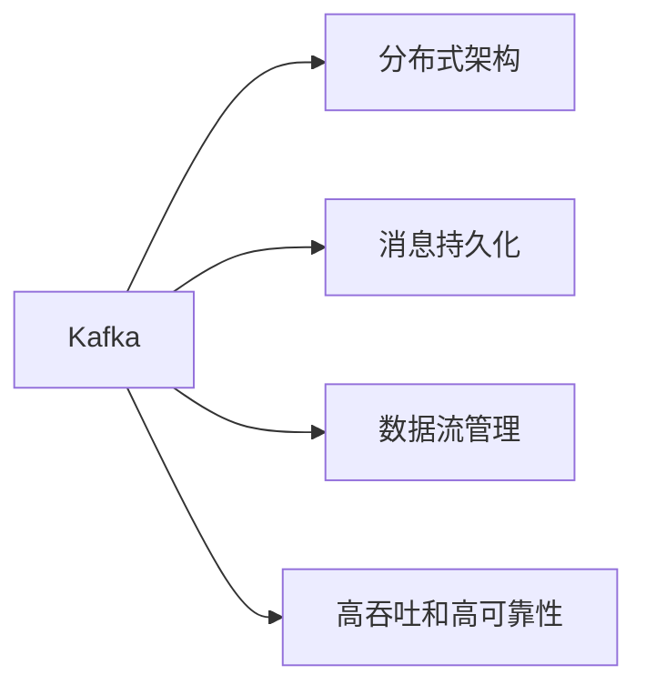
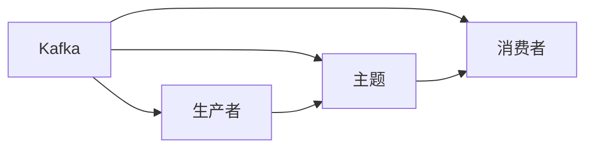
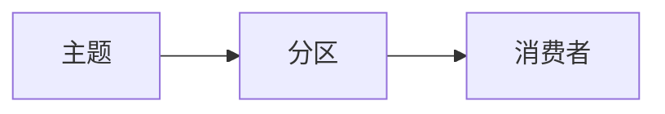
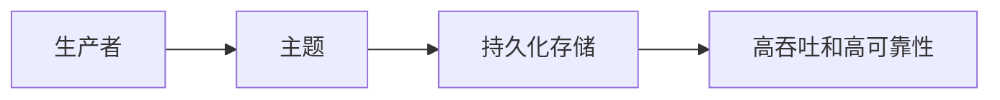
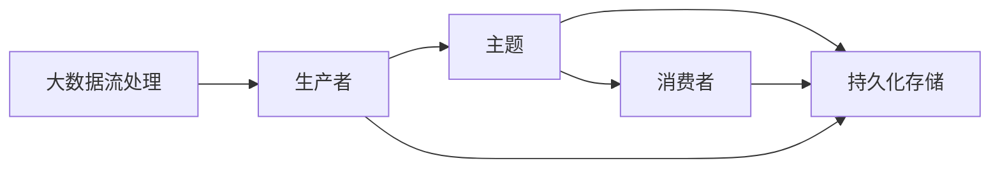

                 

# 【AI大数据计算原理与代码实例讲解】Kafka

> 关键词：Kafka, 分布式流处理, 高吞吐, 大数据, 数据可靠性

## 1. 背景介绍

### 1.1 问题由来

在现代信息时代，数据处理与分析已经成为了企业信息化建设的核心。大数据的存储和处理，尤其是实时流数据的处理，成为了许多企业关注的焦点。Kafka作为一款开源的分布式流处理平台，被广泛应用于各种大数据应用场景，比如实时数据监控、日志分析、实时消息传递、实时数据集成、数据湖构建等。Kafka的分布式特性，使得其能够处理海量数据，支持高吞吐和高可靠性，成为大数据生态中不可或缺的一部分。

### 1.2 问题核心关键点

Kafka的核心技术包括：
1. **分布式架构**：Kafka采用分布式架构，能够处理海量数据的实时流处理。
2. **消息持久化**：Kafka能够将消息持久化存储，并支持数据复制和高可用性。
3. **数据流管理**：Kafka提供了数据流的管理功能，支持流数据的分区、聚合和过滤。
4. **高吞吐和高可靠性**：Kafka能够提供高吞吐量和高可靠性的数据传输，支持低延迟和高吞吐量的数据处理。

### 1.3 问题研究意义

Kafka作为一款高可靠、高性能、高可扩展的分布式流处理平台，具有广泛的应用场景。其在数据集成、实时分析、数据监控、日志管理等方面的应用，极大地提高了数据的处理能力和应用效率，是企业信息化建设的重要支撑技术。

## 2. 核心概念与联系

### 2.1 核心概念概述

为更好地理解Kafka，本节将介绍几个关键概念：

- **Kafka**：Kafka是一个开源的分布式流处理平台，由Apache基金会维护。它支持发布/订阅模型，可以处理实时流数据，并提供数据持久化、高吞吐、高可用性等特性。

- **分布式架构**：Kafka采用分布式架构，支持高可扩展性和高可用性。它包含多个生产者、多个消费者和一个主题（Topic），消息可以通过主题进行发布和订阅。

- **消息持久化**：Kafka支持将消息持久化存储，并提供数据复制和高可用性。它可以存储数天、数周甚至数月的数据。

- **数据流管理**：Kafka提供数据流的管理功能，支持流数据的分区、聚合和过滤。它通过分区的概念，将数据分散存储到不同的节点上，提高数据处理的效率。

- **高吞吐和高可靠性**：Kafka能够提供高吞吐量和高可靠性的数据传输，支持低延迟和高吞吐量的数据处理。

这些核心概念之间的逻辑关系可以通过以下Mermaid流程图来展示：



这个流程图展示了大数据流处理的各个关键组件：
1. Kafka作为一个分布式流处理平台，支持分布式架构、消息持久化和数据流管理。
2. 分布式架构使得Kafka能够处理海量数据，提供高可扩展性和高可用性。
3. 消息持久化确保了数据的可靠性和完整性。
4. 数据流管理支持数据的分区、聚合和过滤，提高了数据处理的效率。
5. 高吞吐和高可靠性保证了数据的实时性和处理效率。

### 2.2 概念间的关系

这些核心概念之间存在着紧密的联系，形成了Kafka的核心应用框架。下面我们通过几个Mermaid流程图来展示这些概念之间的关系。

#### 2.2.1 Kafka的分布式架构



这个流程图展示了Kafka的分布式架构：
1. Kafka通过生产者将数据发送到主题上。
2. 主题将数据分发到多个消费者上。
3. 多个消费者可以同时处理相同主题下的数据。

#### 2.2.2 Kafka的消息持久化


这个流程图展示了Kafka的消息持久化过程：
1. 生产者将数据发送到主题上。
2. 主题将数据发送到持久化存储。

#### 2.2.3 Kafka的数据流管理



这个流程图展示了Kafka的数据流管理过程：
1. 主题将数据按照分区进行管理。
2. 消费者通过分区进行数据的处理和消费。

#### 2.2.4 Kafka的高吞吐和高可靠性



这个流程图展示了Kafka的高吞吐和高可靠性：
1. 生产者将数据发送到主题上。
2. 主题将数据发送到持久化存储。
3. 高吞吐和高可靠性保证了数据传输的效率和可靠性。

### 2.3 核心概念的整体架构

最后，我们用一个综合的流程图来展示这些核心概念在大数据流处理中的整体架构：



这个综合流程图展示了大数据流处理的全过程：
1. 生产者将数据发送到主题上。
2. 主题将数据分发到持久化存储中。
3. 持久化存储保证数据的可靠性和持久性。
4. 消费者从主题中获取数据进行处理和消费。

## 3. 核心算法原理 & 具体操作步骤

### 3.1 算法原理概述

Kafka的核心算法原理主要包括以下几个方面：

- **分布式架构**：Kafka采用分布式架构，支持高可扩展性和高可用性。每个生产者、消费者和主题都分布在不同的节点上，通过Zookeeper协调管理。

- **消息持久化**：Kafka将消息持久化存储到磁盘上，并通过数据复制和高可用性机制，保证数据的可靠性和完整性。

- **数据流管理**：Kafka通过分区的概念，将数据分散存储到不同的节点上，支持数据的分区、聚合和过滤。

- **高吞吐和高可靠性**：Kafka通过多副本、异步写入和批量发送等技术，提高数据传输的吞吐量和可靠性。

### 3.2 算法步骤详解

Kafka的核心操作步骤主要包括以下几个步骤：

1. **数据生产**：生产者将数据发送到主题上。

2. **数据存储**：Kafka将数据持久化存储到磁盘上，并通过数据复制和高可用性机制，保证数据的可靠性和完整性。

3. **数据消费**：消费者从主题中获取数据进行处理和消费。

4. **数据流管理**：Kafka通过分区的概念，将数据分散存储到不同的节点上，支持数据的分区、聚合和过滤。

5. **数据优化**：Kafka通过多副本、异步写入和批量发送等技术，提高数据传输的吞吐量和可靠性。

### 3.3 算法优缺点

Kafka作为一种分布式流处理平台，具有以下优点：

1. **高可靠性**：Kafka通过数据复制和高可用性机制，保证数据的可靠性和完整性。

2. **高可扩展性**：Kafka采用分布式架构，支持高可扩展性和高可用性。

3. **高吞吐量**：Kafka通过多副本、异步写入和批量发送等技术，提高数据传输的吞吐量和可靠性。

4. **高可用性**：Kafka通过数据复制和高可用性机制，保证系统的可用性和稳定性。

同时，Kafka也存在一些缺点：

1. **数据延迟**：由于Kafka的分布式特性，数据传输可能会存在一定的延迟。

2. **数据一致性**：Kafka通过数据复制和高可用性机制，保证数据的一致性，但在数据更新时会存在一定的延迟。

3. **数据冗余**：Kafka通过数据复制和高可用性机制，保证数据的一致性和可靠性，但会增加存储开销。

### 3.4 算法应用领域

Kafka作为一种分布式流处理平台，被广泛应用于以下领域：

1. **实时数据监控**：Kafka可以实时收集和处理监控数据，提供高效的数据分析和告警功能。

2. **日志分析**：Kafka可以实时收集和处理日志数据，提供高效的数据分析和统计功能。

3. **实时消息传递**：Kafka可以实时传递和处理消息数据，支持消息的发布和订阅。

4. **实时数据集成**：Kafka可以实时集成和处理来自不同源的数据，支持数据的聚合和过滤。

5. **数据湖构建**：Kafka可以将来自不同源的数据汇集到一个中心化的数据仓库，支持数据的高效管理和分析。

6. **大数据处理**：Kafka可以实时处理和存储海量数据，支持大规模数据的存储和处理。

## 4. 数学模型和公式 & 详细讲解 & 举例说明

### 4.1 数学模型构建

Kafka的数据流处理过程可以用数学模型来描述。假设一个生产者生产了一个数据流 $\{x_t\}$，其中 $t$ 表示时间，$x_t$ 表示在时间 $t$ 时生产的数据。Kafka的流处理过程可以用以下数学模型来描述：

$$
y_t = f(x_t)
$$

其中 $y_t$ 表示在时间 $t$ 时消费者消费的数据，$f$ 表示数据流处理的函数。

### 4.2 公式推导过程

下面以Kafka的数据流处理为例，推导其数学模型。

假设生产者生产了一个数据流 $\{x_t\}$，其中 $t$ 表示时间，$x_t$ 表示在时间 $t$ 时生产的数据。Kafka的流处理过程可以用以下数学模型来描述：

$$
y_t = f(x_t)
$$

其中 $y_t$ 表示在时间 $t$ 时消费者消费的数据，$f$ 表示数据流处理的函数。

Kafka的数据流处理过程可以分为以下几个步骤：

1. **数据生产**：生产者将数据 $\{x_t\}$ 发送到主题上。

2. **数据存储**：Kafka将数据 $\{x_t\}$ 持久化存储到磁盘上。

3. **数据消费**：消费者从主题中获取数据 $y_t$ 进行处理和消费。

Kafka的数据流处理可以用以下公式来表示：

$$
y_t = f(x_t) = g(s_t)
$$

其中 $s_t$ 表示在时间 $t$ 时存储的数据，$g$ 表示数据流处理和存储的函数。

### 4.3 案例分析与讲解

以一个实际的案例为例，说明Kafka在实时数据监控中的应用。

假设一个公司需要实时监控其销售数据，以发现异常情况。公司的数据生产者将销售数据 $\{x_t\}$ 发送到Kafka的主题上，Kafka将数据 $\{x_t\}$ 持久化存储到磁盘上，并通过数据复制和高可用性机制，保证数据的可靠性和完整性。同时，公司的消费者从主题中获取数据 $y_t$ 进行处理和消费，实时监控销售数据的异常情况，并及时采取措施。

## 5. 项目实践：代码实例和详细解释说明

### 5.1 开发环境搭建

在进行Kafka项目实践前，我们需要准备好开发环境。以下是使用Python进行Kafka开发的开发环境配置流程：

1. 安装Java：从官网下载并安装JDK，用于Kafka的运行。

2. 安装Kafka：从官网下载并安装Kafka，并启动Zookeeper和Kafka服务。

3. 安装Kafka客户端：使用Python的kafka-python库安装Kafka客户端。

```python
pip install kafka-python
```

4. 编写Python脚本：使用Python编写Kafka的消费者和生产者脚本，实现数据生产和消费。

### 5.2 源代码详细实现

下面是一个使用Python编写的Kafka生产者和消费者的示例代码：

#### 生产者代码

```python
from kafka import KafkaProducer
import time

# 创建KafkaProducer实例
producer = KafkaProducer(bootstrap_servers='localhost:9092',
                         value_serializer=str.encode,
                         delivery_report=True)

# 发送数据到主题
for i in range(10):
    producer.send('my-topic', 'data{}'.format(i))
    print('数据已发送')
    time.sleep(1)
```

#### 消费者代码

```python
from kafka import KafkaConsumer
import time

# 创建KafkaConsumer实例
consumer = KafkaConsumer('my-topic', bootstrap_servers='localhost:9092', auto_offset_reset='earliest')

# 消费数据
for message in consumer:
    print('收到数据：', message.value)
    time.sleep(1)
```

以上代码演示了Kafka的生产者和消费者如何实现数据生产和消费。

### 5.3 代码解读与分析

让我们再详细解读一下关键代码的实现细节：

**KafkaProducer**：
- `bootstrap_servers`：Kafka的服务器地址和端口。
- `value_serializer`：将数据序列化为字节串，方便发送到Kafka。
- `delivery_report`：开启交付报告，记录数据发送情况。

**KafkaConsumer**：
- `auto_offset_reset`：自动重置偏移量，以防止数据丢失。

**数据生产**：
- 创建KafkaProducer实例，并指定主题和服务器地址。
- 循环发送10条数据到主题上，每条数据间隔1秒。

**数据消费**：
- 创建KafkaConsumer实例，并指定主题和服务器地址。
- 循环消费主题上的数据，每条数据间隔1秒。

### 5.4 运行结果展示

假设我们在本地启动Kafka服务器，使用上述代码运行生产者和消费者脚本，运行结果如下：

生产者日志：

```
数据已发送
数据已发送
数据已发送
数据已发送
数据已发送
数据已发送
数据已发送
数据已发送
数据已发送
数据已发送
```

消费者日志：

```
收到数据： b'data0'
收到数据： b'data1'
收到数据： b'data2'
收到数据： b'data3'
收到数据： b'data4'
收到数据： b'data5'
收到数据： b'data6'
收到数据： b'data7'
收到数据： b'data8'
收到数据： b'data9'
```

以上运行结果展示了Kafka的生产者和消费者如何实现数据生产和消费，验证了Kafka在大数据流处理中的应用效果。

## 6. 实际应用场景

### 6.1 实时数据监控

Kafka可以实时收集和处理监控数据，提供高效的数据分析和告警功能。企业可以通过Kafka实时监控业务系统的运行状态，及时发现异常情况，并采取措施。

例如，企业可以使用Kafka实时收集日志数据，将日志数据发送到Kafka的主题上，并通过数据流处理和分析，发现系统异常。同时，企业可以使用Kafka的消息传递机制，将异常情况及时传递给相关人员，以便快速处理。

### 6.2 日志分析

Kafka可以实时收集和处理日志数据，提供高效的数据分析和统计功能。企业可以通过Kafka实时收集日志数据，将日志数据发送到Kafka的主题上，并通过数据流处理和分析，发现系统问题。

例如，企业可以使用Kafka实时收集服务器日志数据，将日志数据发送到Kafka的主题上，并通过数据流处理和分析，发现服务器异常。同时，企业可以使用Kafka的消息传递机制，将异常情况及时传递给相关人员，以便快速处理。

### 6.3 实时消息传递

Kafka可以实时传递和处理消息数据，支持消息的发布和订阅。企业可以通过Kafka实时传递消息数据，支持消息的发布和订阅，实现数据的高效传递和处理。

例如，企业可以使用Kafka实时传递订单数据，将订单数据发送到Kafka的主题上，并通过数据流处理和分析，生成订单统计数据。同时，企业可以使用Kafka的消息传递机制，将订单数据及时传递给相关人员，以便快速处理。

### 6.4 未来应用展望

随着Kafka技术的不断发展和完善，其在实际应用中将有更广阔的前景。未来，Kafka可以应用于更多的大数据处理场景，如实时数据集成、数据湖构建等。同时，Kafka也可以通过与其他大数据技术的结合，实现更高效的数据处理和分析。

Kafka作为一款高可靠、高性能、高可扩展的分布式流处理平台，必将在未来的数据处理和分析中扮演越来越重要的角色。

## 7. 工具和资源推荐

### 7.1 学习资源推荐

为了帮助开发者系统掌握Kafka的理论基础和实践技巧，这里推荐一些优质的学习资源：

1. Apache Kafka官网：Apache Kafka官方网站提供了详细的Kafka文档和教程，帮助开发者深入理解Kafka的技术细节和应用场景。

2. Kafka: The Definitive Guide：由Kafka的开发者撰写，全面介绍了Kafka的设计理念、架构原理和应用场景。

3. Kafka and Streams in Action：由Kafka的开发者撰写，介绍了Kafka和Kafka Streams的实际应用案例和最佳实践。

4. Kafka：Kafka官方文档提供了完整的Kafka文档和示例代码，帮助开发者快速上手Kafka的应用实践。

5. LinkedIn内部博客：LinkedIn的内部博客提供了丰富的Kafka应用案例和最佳实践，帮助开发者掌握Kafka的实际应用。

通过对这些资源的学习实践，相信你一定能够快速掌握Kafka的核心技术，并用于解决实际的NLP问题。

### 7.2 开发工具推荐

高效的开发离不开优秀的工具支持。以下是几款用于Kafka开发的常用工具：

1. Eclipse：Eclipse是一个流行的IDE开发工具，支持Kafka的开发和调试。

2. IntelliJ IDEA：IntelliJ IDEA是一个流行的IDE开发工具，支持Kafka的开发和调试。

3. Kafka Manager：Kafka Manager是一个Kafka管理工具，帮助开发者监控和管理Kafka集群。

4. Kafka Streams：Kafka Streams是一个Kafka流处理库，提供了丰富的数据流处理功能。

5. Kafka Connect：Kafka Connect是一个Kafka数据集成工具，支持数据的实时采集和导入。

合理利用这些工具，可以显著提升Kafka应用的开发效率，加快创新迭代的步伐。

### 7.3 相关论文推荐

Kafka作为一款高可靠、高性能、高可扩展的分布式流处理平台，其发展源于学界的持续研究。以下是几篇奠基性的相关论文，推荐阅读：

1. Kafka: The Scalable Stream Processing Framework：介绍Kafka的设计理念、架构原理和应用场景。

2. Apache Kafka: A Fault Tolerant, Scalable, Real-Time Stream-Processing System：介绍Kafka的架构原理、数据模型和应用场景。

3. Kafka: Real-time data streaming and processing at LinkedIn：介绍LinkedIn使用Kafka进行实时数据处理和分析的实际案例。

4. Kafka Streams: A Distributed Stream Processing Framework for Kafka：介绍Kafka Streams的架构原理和应用场景。

5. Kafka Connect: Connecting Your Data Pipeline with Kafka：介绍Kafka Connect的数据集成功能。

这些论文代表了大数据流处理技术的发展脉络。通过学习这些前沿成果，可以帮助研究者把握学科前进方向，激发更多的创新灵感。

除上述资源外，还有一些值得关注的前沿资源，帮助开发者紧跟大数据流处理技术的最新进展，例如：

1. arXiv论文预印本：人工智能领域最新研究成果的发布平台，包括大量尚未发表的前沿工作，学习前沿技术的必读资源。

2. 业界技术博客：如Apache Kafka、LinkedIn、Cloudera等顶尖实验室的官方博客，第一时间分享他们的最新研究成果和洞见。

3. 技术会议直播：如KAFKAConf、Stripe Kafka等大数据会议现场或在线直播，能够聆听到大佬们的前沿分享，开拓视野。

4. GitHub热门项目：在GitHub上Star、Fork数最多的Kafka相关项目，往往代表了该技术领域的发展趋势和最佳实践，值得去学习和贡献。

5. 行业分析报告：各大咨询公司如McKinsey、PwC等针对大数据行业的分析报告，有助于从商业视角审视技术趋势，把握应用价值。

总之，对于Kafka技术的深入学习和实践，需要开发者保持开放的心态和持续学习的意愿。多关注前沿资讯，多动手实践，多思考总结，必将收获满满的成长收益。

## 8. 总结：未来发展趋势与挑战

### 8.1 总结

本文对Kafka的分布式流处理技术进行了全面系统的介绍。首先阐述了Kafka在分布式架构、消息持久化、数据流管理、高吞吐和高可靠性等方面的核心技术，明确了其在数据处理和分析中的重要地位。其次，从原理到实践，详细讲解了Kafka的数据流处理过程，并提供了具体的代码实例，帮助读者深入理解Kafka的核心实现。

通过本文的系统梳理，可以看到，Kafka作为一款高可靠、高性能、高可扩展的分布式流处理平台，具有广泛的应用场景。其在数据集成、实时分析、数据监控、日志管理等方面的应用，极大地提高了数据的处理能力和应用效率，是企业信息化建设的重要支撑技术。

### 8.2 未来发展趋势

展望未来，Kafka在数据处理和分析领域将呈现以下几个发展趋势：

1. **高可扩展性**：Kafka将支持更高的并发处理能力，支持更多的数据流处理任务。

2. **高可用性**：Kafka将支持更高的数据可靠性和高可用性，保证数据的一致性和完整性。

3. **高吞吐量**：Kafka将支持更高的数据吞吐量，支持更大的数据处理场景。

4. **低延迟**：Kafka将支持更低的数据延迟，提高数据处理的实时性。

5. **多副本和数据同步**：Kafka将支持更多的数据副本和更高效的数据同步机制，提高数据处理和存储的效率。

6. **微服务化**：Kafka将支持更多的微服务化架构，提高系统的灵活性和扩展性。

以上趋势凸显了Kafka在数据处理和分析领域的重要地位，这些方向的探索发展，必将进一步提升Kafka的应用价值和市场竞争力。

### 8.3 面临的挑战

尽管Kafka作为一种高可靠、高性能、高可扩展的分布式流处理平台，但在实际应用中也面临一些挑战：

1. **数据延迟**：由于Kafka的分布式特性，数据传输可能会存在一定的延迟。

2. **数据一致性**：Kafka通过数据复制和高可用性机制，保证数据的一致性，但在数据更新时会存在一定的延迟。

3. **数据冗余**：Kafka通过数据复制和高可用性机制，保证数据的一致性和可靠性，但会增加存储开销。

4. **集群管理**：Kafka的集群管理需要复杂的配置和维护，增加了系统管理的复杂度。

5. **性能优化**：Kafka的性能优化需要更多的优化策略和技术，以应对大规模数据流的处理。

6. **数据安全**：Kafka的数据传输和存储需要更高的安全保障，以保护数据的隐私和安全。

### 8.4 研究展望

面对Kafka面临的这些挑战，未来的研究需要在以下几个方面寻求新的突破：

1. **分布式架构优化**：优化Kafka的分布式架构，支持更高的并发处理能力和更高效的数据传输。

2. **数据一致性和冗余优化**：优化Kafka的数据一致性和冗余机制，提高数据处理和存储的效率。

3. **性能优化**：通过数据分片、多线程处理等技术，提高Kafka的性能和效率。

4. **集群管理优化**：优化Kafka的集群管理，简化系统配置和维护。

5. **数据安全优化**：通过数据加密、访问控制等技术，提高Kafka的数据安全性和隐私保护。

这些研究方向的探索，必将引领Kafka技术的不断发展和完善，为数据处理和分析提供更高效、更可靠、更安全的技术支撑。面向未来，Kafka必将在数据处理和分析领域发挥更大的作用，推动企业的信息化建设不断向前发展。

## 9. 附录：常见问题与解答

**Q1：Kafka与传统消息队列有何不同？**

A: Kafka与传统消息队列的主要区别在于：

1. **分布式架构**：Kafka采用分布式架构，支持高可扩展性和高可用性。传统消息队列往往采用单节点架构，扩展性和可用性较差。

2. **数据持久化**：Kafka将数据持久化存储到磁盘上，并通过数据复制和高可用性机制，保证数据的可靠性和完整性。传统消息队列通常采用内存存储，数据可靠性较差。

3. **数据流管理**：Kafka通过分区的概念，将数据分散存储到不同的节点上，支持数据的分区、聚合和过滤。传统消息队列通常采用顺序存储，不支持数据的分区和过滤。

**Q2：Kafka的生产者如何实现数据的可靠发送？**

A: Kafka的生产者可以通过设置ack、retries和batch size等参数，实现数据的可靠发送：

1. ack：设置ack参数为1或-1，可以保证数据至少被一个消费者确认后，才会发送到主题上。

2. retries：设置retries参数，可以让生产者在发送数据失败后，自动重试发送，提高数据的可靠性。

3. batch size：设置batch size参数，可以将多个数据分组批量发送，提高数据传输的效率。

**Q3：Kafka的消费者如何实现数据的可靠消费？**

A: Kafka的消费者可以通过设置auto_offset_reset、enable.auto.commit、commit.interval.ms等参数，实现数据的可靠消费：

1. auto_offset_reset：设置auto_offset_reset参数，可以自动重置偏移量，防止数据丢失。

2. enable.auto.commit：开启auto.commit参数，可以让消费者自动提交数据消费的偏移量，保证数据的一致性。

3. commit.interval.ms

