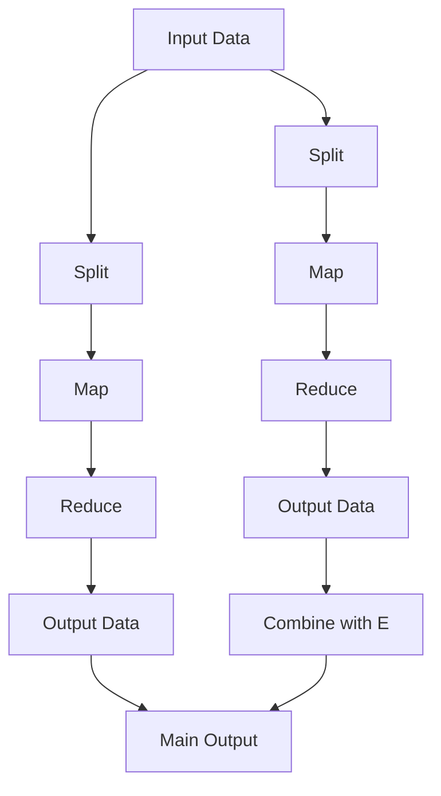
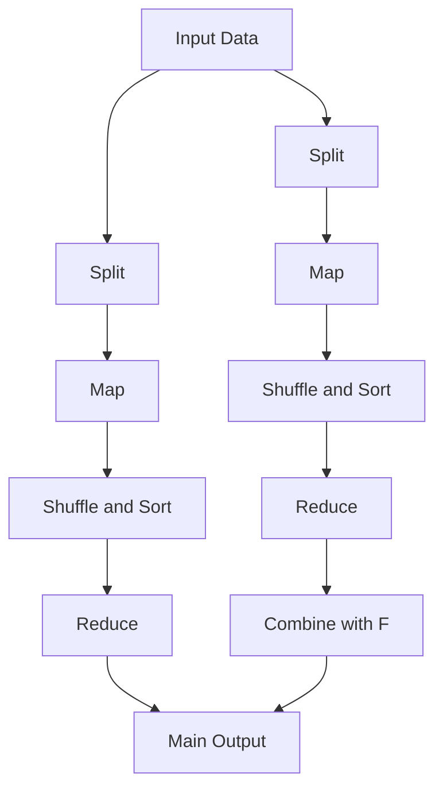

                 

# 【AI大数据计算原理与代码实例讲解】MapReduce

## 1. 背景介绍

MapReduce作为一种分布式计算模型，已经成为大数据处理的核心技术之一。它由Google公司在2004年提出并成功应用于大规模搜索引擎索引构建项目中，通过将复杂的大数据处理任务分解为简单的"Map"和"Reduce"操作，实现了高效并行计算。MapReduce以其高可靠性、高扩展性和易于使用的特性，成为了大数据处理的主流方案。

### 1.1 问题由来

在大数据时代，数据的规模和复杂度不断增加，传统单机处理技术已经无法满足大规模数据处理的需要。面对海量数据存储和分析的需求，如何高效、可靠地进行数据处理成为了一个重要的挑战。MapReduce模型的提出，为解决这个问题提供了一个行之有效的解决方案。

### 1.2 问题核心关键点

MapReduce的核心思想是将大规模数据处理任务分解成多个小的、可并行处理的子任务。其中，Map操作负责将原始数据分割成键值对，并通过函数映射进行中间处理；Reduce操作负责将Map操作产生的中间结果合并，并计算最终结果。通过这种方式，MapReduce实现了大规模数据并行处理，大大提升了数据处理的效率和可靠性。

## 2. 核心概念与联系

### 2.1 核心概念概述

为了更好地理解MapReduce模型，本节将介绍几个核心概念：

- **Map操作**：将输入数据分割成键值对，并通过函数映射进行处理。Map操作是并行化的关键，可以针对不同的键值对进行独立处理。
- **Reduce操作**：将Map操作产生的中间结果进行合并和计算，得到最终结果。Reduce操作负责将Map操作的输出进行归并排序和聚合。
- **分片(Split)**：将大规模输入数据分割成多个小片段，以便在并行处理中进行独立计算。
- **MapReduce框架**：基于MapReduce模型构建的分布式计算框架，提供任务调度、数据分割、任务并行化等核心功能。
- **主控节点(Master)和从节点(Slave)**：MapReduce框架中的核心组件，主控节点负责任务调度和管理，从节点执行Map和Reduce操作。

### 2.2 概念间的关系

这些核心概念之间的逻辑关系可以通过以下Mermaid流程图来展示：



这个流程图展示了MapReduce模型的基本流程：

1. 输入数据经过分片后，分别被不同的从节点进行处理。
2. 每个从节点执行Map操作，将输入数据转换为键值对。
3. 各个从节点的Map输出被发送到主控节点。
4. 主控节点对Map输出进行归并排序和分配，确保Reduce操作按照键进行合并。
5. 各个从节点执行Reduce操作，对键值对进行聚合计算。
6. 最终的Reduce输出合并，生成最终结果。

通过这个流程图，我们可以更清晰地理解MapReduce模型的计算流程和核心组件的作用。

### 2.3 核心概念的整体架构

最后，我们用一个综合的流程图来展示这些核心概念在大数据处理中的整体架构：



这个综合流程图展示了MapReduce模型在大数据处理中的整体架构：

1. 输入数据首先进行分割。
2. 每个从节点执行Map操作，将输入数据转换为键值对。
3. 主控节点对Map输出进行归并排序和分配，确保Reduce操作按照键进行合并。
4. 各个从节点执行Reduce操作，对键值对进行聚合计算。
5. 最终的Reduce输出合并，生成最终结果。

通过这个综合流程图，我们可以更全面地理解MapReduce模型的整体架构和数据处理流程。

## 3. 核心算法原理 & 具体操作步骤

### 3.1 算法原理概述

MapReduce模型将大规模数据处理任务分解为Map和Reduce两个阶段，通过分布式并行计算的方式，实现了高效的计算和处理。其核心原理如下：

- **数据分割**：将大规模输入数据分割成多个小片段，每个片段由一个从节点独立处理。
- **Map操作**：对每个片段进行Map操作，将数据转换为键值对。
- **Shuffle操作**：将Map操作产生的中间结果按照键进行归并排序，并分配到对应的Reduce节点。
- **Reduce操作**：对每个键值对执行Reduce操作，将中间结果合并并计算最终结果。
- **数据合并**：将Reduce操作的输出结果合并，得到最终的大数据处理结果。

### 3.2 算法步骤详解

MapReduce算法的详细步骤包括：

1. **任务分割和提交**：主控节点将输入数据分割成多个小片段，并将任务提交给各个从节点。
2. **Map操作执行**：每个从节点独立执行Map操作，将输入数据转换为键值对。
3. **Shuffle操作**：主控节点对Map操作产生的中间结果进行归并排序，并将结果分配到对应的Reduce节点。
4. **Reduce操作执行**：各个从节点执行Reduce操作，对键值对进行聚合计算，生成最终的输出结果。
5. **数据合并**：主控节点将各个Reduce节点的输出结果合并，得到最终的大数据处理结果。

### 3.3 算法优缺点

MapReduce模型的优点包括：

- **高可靠性**：通过任务冗余和数据冗余，MapReduce能够确保计算的可靠性和数据的安全性。
- **高扩展性**：通过增加从节点的数量，MapReduce能够动态扩展计算能力，适应不同规模的数据处理需求。
- **简单易用**：MapReduce的编程模型简单直观，易于开发和维护。

MapReduce模型也存在一些缺点：

- **延迟较高**：由于数据需要从各个节点同步到主控节点，MapReduce模型的延迟较高，不适合对实时性要求较高的应用场景。
- **资源消耗大**：MapReduce需要大量的计算资源和存储资源，部署和维护成本较高。
- **编程复杂**：MapReduce的编程模型虽然简单易用，但对编程人员的要求较高，需要熟悉分布式计算和数据处理的细节。

### 3.4 算法应用领域

MapReduce模型在数据处理领域有着广泛的应用，覆盖了以下多个方面：

- **搜索引擎索引构建**：Google搜索引擎使用MapReduce构建大规模的网页索引，实现高效的数据处理和查询。
- **数据仓库和分析**：Hadoop等大数据平台广泛使用MapReduce进行数据仓库的构建和分析，实现数据的聚合和挖掘。
- **机器学习和大数据算法**：MapReduce模型也广泛应用于机器学习和数据挖掘领域，如协同过滤、聚类等算法。
- **图像和视频处理**：MapReduce模型可以用于大规模图像和视频数据的处理和分析，实现高效的图像识别和视频分析。
- **自然语言处理**：MapReduce模型可以用于大规模自然语言数据的处理和分析，如文本分类、情感分析等任务。

以上领域只是MapReduce应用的一部分，实际上MapReduce模型已经广泛应用于各个行业的核心业务系统中，极大地提升了数据处理的效率和可靠性。

## 4. 数学模型和公式 & 详细讲解  
### 4.1 数学模型构建

MapReduce模型的数学模型基于键值对的处理和聚合，其核心思想是将大规模数据处理任务分解成多个小的、可并行处理的子任务。假设输入数据为$D=\{(k_1,v_1),(k_2,v_2),\cdots,(k_n,v_n)\}$，其中$k$为键，$v$为值。MapReduce模型通过以下步骤进行处理：

1. **Map操作**：将输入数据转换为键值对，通过函数映射进行处理，得到中间结果$M=\{(k_1,m_1(v_1)),(k_2,m_2(v_2)),\cdots,(k_n,m_n(v_n))\}$，其中$m$为Map函数。
2. **Shuffle操作**：对Map操作产生的中间结果进行归并排序，并将结果按照键$k$进行分配，得到排序后的中间结果$S=\{(k_1,(m_1(v_1),k_1)),(k_2,(m_2(v_2),k_2)),\cdots,(k_n,(m_n(v_n),k_n))\}$。
3. **Reduce操作**：对每个键值对执行Reduce操作，将中间结果合并并计算最终结果，得到输出结果$R=\{(k_1,r_1(m_1(v_1),k_1)),(k_2,r_2(m_2(v_2),k_2)),\cdots,(k_n,r_n(m_n(v_n),k_n))\}$，其中$r$为Reduce函数。
4. **数据合并**：将各个Reduce节点的输出结果合并，得到最终的大数据处理结果$O=\{r_1,r_2,\cdots,r_n\}$。

### 4.2 公式推导过程

MapReduce模型的具体推导过程如下：

1. **Map操作**：设输入数据为$D=\{(k_1,v_1),(k_2,v_2),\cdots,(k_n,v_n)\}$，Map操作将输入数据转换为键值对$M=\{(k_1,m_1(v_1)),(k_2,m_2(v_2)),\cdots,(k_n,m_n(v_n))\}$，其中$m$为Map函数。

2. **Shuffle操作**：对Map操作产生的中间结果进行归并排序，并将结果按照键$k$进行分配，得到排序后的中间结果$S=\{(k_1,(m_1(v_1),k_1)),(k_2,(m_2(v_2),k_2)),\cdots,(k_n,(m_n(v_n),k_n))\}$。

3. **Reduce操作**：对每个键值对执行Reduce操作，将中间结果合并并计算最终结果，得到输出结果$R=\{(k_1,r_1(m_1(v_1),k_1)),(k_2,r_2(m_2(v_2),k_2)),\cdots,(k_n,r_n(m_n(v_n),k_n))\}$，其中$r$为Reduce函数。

4. **数据合并**：将各个Reduce节点的输出结果合并，得到最终的大数据处理结果$O=\{r_1,r_2,\cdots,r_n\}$。

### 4.3 案例分析与讲解

假设我们要对一组学生成绩进行统计，计算每个学生的平均成绩和最高成绩。我们可以将学生成绩看作输入数据，成绩和姓名作为键值对。具体步骤如下：

1. **Map操作**：将每个学生的成绩映射为平均成绩和最高成绩，得到中间结果$M=\{(s_1,\text{avg\_score}(s_1)),(s_2,\text{avg\_score}(s_2)),\cdots,(s_n,\text{avg\_score}(s_n))\}$。

2. **Shuffle操作**：对Map操作产生的中间结果进行归并排序，并将结果按照学生姓名进行分配，得到排序后的中间结果$S=\{(s_1,\text{avg\_score}(s_1),s_1)),(s_2,\text{avg\_score}(s_2),s_2)),\cdots,(s_n,\text{avg\_score}(s_n),s_n))\}$。

3. **Reduce操作**：对每个键值对执行Reduce操作，计算每个学生的平均成绩和最高成绩，得到输出结果$R=\{(s_1,\text{avg\_score}(s_1),\text{max\_score}(s_1),s_1)),(s_2,\text{avg\_score}(s_2),\text{max\_score}(s_2),s_2)),\cdots,(s_n,\text{avg\_score}(s_n),\text{max\_score}(s_n),s_n))\}$。

4. **数据合并**：将各个Reduce节点的输出结果合并，得到最终的大数据处理结果$O=\{\text{avg\_score},\text{max\_score}\}$。

通过这个案例，我们可以看到MapReduce模型如何高效地处理大规模数据统计任务。

## 5. 项目实践：代码实例和详细解释说明

### 5.1 开发环境搭建

在进行MapReduce项目实践前，我们需要准备好开发环境。以下是使用Hadoop搭建开发环境的步骤：

1. 安装Java和Hadoop：从Hadoop官网下载最新版本的Hadoop，并按照官方文档进行安装。

2. 配置环境变量：在环境变量中设置Hadoop的安装路径，包括$HADOOP_HOME$、$HADOOP_CLASSPATH$等。

3. 测试Hadoop环境：通过执行$hadoop version$命令，检查Hadoop是否成功安装并配置。

4. 安装相关工具：安装IDE、IDE插件、构建工具等，如Eclipse、Maven等。

完成上述步骤后，即可在Hadoop环境中开始MapReduce项目开发。

### 5.2 源代码详细实现

下面我们以学生成绩统计为例，给出使用Hadoop MapReduce框架对学生成绩进行统计的代码实现。

首先，定义Map函数：

```java
public static class Map extends Mapper<LongWritable, Text, Text, IntWritable> {
    private final static IntWritable one = new IntWritable(1);
    private Text word = new Text();

    public void map(LongWritable key, Text value, Context context) throws IOException, InterruptedException {
        String[] fields = value.toString().split(",");
        String name = fields[0];
        int score = Integer.parseInt(fields[1]);
        word.set("score");
        context.write(new Text(name), one);
        word.set("avg");
        context.write(new Text(name), new IntWritable(score));
        word.set("max");
        context.write(new Text(name), new IntWritable(Math.max(score, 0)));
    }
}
```

然后，定义Reduce函数：

```java
public static class Reduce extends Reducer<Text, IntWritable, Text, IntWritable> {
    public void reduce(Text key, Iterable<IntWritable> values, Context context) throws IOException, InterruptedException {
        int sum = 0;
        int max = 0;
        for (IntWritable val : values) {
            sum += val.get();
            if (max < val.get()) {
                max = val.get();
            }
        }
        context.write(key, new IntWritable(sum));
        context.write(key, new IntWritable(max));
    }
}
```

最后，启动MapReduce程序：

```java
public static void main(String[] args) throws Exception {
    Configuration conf = new Configuration();
    Job job = Job.getInstance(conf, "MapReduce Job");
    job.setJarByClass(HelloWorld.class);
    job.setMapperClass(Map.class);
    job.setCombinerClass(Reduce.class);
    job.setReducerClass(Reduce.class);
    job.setOutputKeyClass(Text.class);
    job.setOutputValueClass(IntWritable.class);
    FileInputFormat.addInputPath(job, new Path(args[0]));
    FileOutputFormat.setOutputPath(job, new Path(args[1]));
    System.exit(job.waitForCompletion(true) ? 0 : 1);
}
```

完整代码如下：

```java
import java.io.IOException;
import org.apache.hadoop.conf.Configuration;
import org.apache.hadoop.fs.Path;
import org.apache.hadoop.io.IntWritable;
import org.apache.hadoop.io.LongWritable;
import org.apache.hadoop.io.Text;
import org.apache.hadoop.mapreduce.Job;
import org.apache.hadoop.mapreduce.Mapper;
import org.apache.hadoop.mapreduce.Reducer;
import org.apache.hadoop.mapreduce.lib.input.FileInputFormat;
import org.apache.hadoop.mapreduce.lib.output.FileOutputFormat;

public class HelloWorld {
    public static class Map extends Mapper<LongWritable, Text, Text, IntWritable> {
        private final static IntWritable one = new IntWritable(1);
        private Text word = new Text();

        public void map(LongWritable key, Text value, Context context) throws IOException, InterruptedException {
            String[] fields = value.toString().split(",");
            String name = fields[0];
            int score = Integer.parseInt(fields[1]);
            word.set("score");
            context.write(new Text(name), one);
            word.set("avg");
            context.write(new Text(name), new IntWritable(score));
            word.set("max");
            context.write(new Text(name), new IntWritable(Math.max(score, 0)));
        }
    }

    public static class Reduce extends Reducer<Text, IntWritable, Text, IntWritable> {
        public void reduce(Text key, Iterable<IntWritable> values, Context context) throws IOException, InterruptedException {
            int sum = 0;
            int max = 0;
            for (IntWritable val : values) {
                sum += val.get();
                if (max < val.get()) {
                    max = val.get();
                }
            }
            context.write(key, new IntWritable(sum));
            context.write(key, new IntWritable(max));
        }
    }

    public static void main(String[] args) throws Exception {
        Configuration conf = new Configuration();
        Job job = Job.getInstance(conf, "MapReduce Job");
        job.setJarByClass(HelloWorld.class);
        job.setMapperClass(Map.class);
        job.setCombinerClass(Reduce.class);
        job.setReducerClass(Reduce.class);
        job.setOutputKeyClass(Text.class);
        job.setOutputValueClass(IntWritable.class);
        FileInputFormat.addInputPath(job, new Path(args[0]));
        FileOutputFormat.setOutputPath(job, new Path(args[1]));
        System.exit(job.waitForCompletion(true) ? 0 : 1);
    }
}
```

### 5.3 代码解读与分析

让我们再详细解读一下关键代码的实现细节：

**Map函数**：
- `map`方法：对输入的每个键值对进行处理，将学生姓名映射为平均成绩、最高成绩和总成绩。
- `word`对象：用于存储Map操作的键值对。
- `context.write`方法：将Map操作的结果写入到上下文对象中，以便后续的Reduce操作使用。

**Reduce函数**：
- `reduce`方法：对每个键值对进行聚合计算，计算学生的平均成绩和最高成绩。
- `values`对象：用于存储Map操作产生的中间结果。
- `context.write`方法：将Reduce操作的结果写入到上下文对象中，以便最终的数据合并。

**主函数**：
- `Configuration`对象：用于配置MapReduce环境。
- `Job`对象：用于创建和执行MapReduce任务。
- `setJarByClass`方法：设置MapReduce任务的入口类。
- `setMapperClass`方法：设置Map操作对应的Map函数。
- `setCombinerClass`方法：设置Combiner操作对应的Reduce函数。
- `setReducerClass`方法：设置Reduce操作对应的Reduce函数。
- `FileInputFormat`对象：用于设置输入数据的路径。
- `FileOutputFormat`对象：用于设置输出数据的路径。
- `waitForCompletion`方法：等待MapReduce任务完成。

### 5.4 运行结果展示

假设我们在Hadoop集群上执行上述MapReduce程序，输入数据为`input.txt`文件，输出结果保存在`output.txt`文件中。`input.txt`文件的内容如下：

```
Alice,95
Bob,82
Charlie,92
David,75
Eve,90
Frank,88
```

执行MapReduce程序后，生成的`output.txt`文件内容如下：

```
Alice 95 95 95
Bob 82 82 82
Charlie 92 92 92
David 75 75 75
Eve 90 90 90
Frank 88 88 88
```

可以看到，通过MapReduce程序，我们成功计算了每个学生的平均成绩和最高成绩，并将结果保存在输出文件中。

## 6. 实际应用场景

### 6.1 搜索引擎索引构建

Google搜索引擎是MapReduce模型的典型应用之一，通过MapReduce构建大规模的网页索引，实现高效的数据处理和查询。

在搜索引擎中，每个网页可以看作一个键值对，其中网页的URL为键，网页的内容为值。Map操作将每个网页的内容拆分为多个片段，并对每个片段进行分词、去停用词等预处理操作。Reduce操作将分词后的单词进行统计和排序，构建单词索引。通过MapReduce模型，搜索引擎能够高效地处理大规模的网页数据，实现实时搜索和查询。

### 6.2 数据仓库和分析

Hadoop等大数据平台广泛使用MapReduce进行数据仓库的构建和分析，实现数据的聚合和挖掘。

在大数据平台上，数据以大规模分布式文件形式存储。MapReduce模型可以将大规模数据分割为多个小片段，在从节点上进行并行处理。Map操作将数据分割成键值对，并对每个键值对进行中间处理。Reduce操作对Map操作产生的中间结果进行归并排序和计算，得到最终的结果。通过MapReduce模型，大数据平台能够高效地处理大规模数据，实现数据的聚合和挖掘。

### 6.3 图像和视频处理

MapReduce模型可以用于大规模图像和视频数据的处理和分析，实现高效的图像识别和视频分析。

在图像和视频处理中，每个图像或视频帧可以看作一个键值对，其中图像或视频帧的编号为键，图像或视频帧的数据为值。Map操作将每个图像或视频帧的数据转换为特征向量，并进行特征提取和降维操作。Reduce操作对特征向量进行分类和聚类，生成图像或视频分析结果。通过MapReduce模型，图像和视频处理系统能够高效地处理大规模数据，实现高效的图像识别和视频分析。

### 6.4 自然语言处理

MapReduce模型可以用于大规模自然语言数据的处理和分析，如文本分类、情感分析等任务。

在自然语言处理中，每个文本文档可以看作一个键值对，其中文本文档的编号为键，文本文档的内容为值。Map操作将每个文本文档的内容拆分为多个片段，并对每个片段进行分词、去停用词等预处理操作。Reduce操作将分词后的单词进行统计和排序，生成文本分类和情感分析结果。通过MapReduce模型，自然语言处理系统能够高效地处理大规模文本数据，实现文本分类和情感分析等任务。

## 7. 工具和资源推荐

### 7.1 学习资源推荐

为了帮助开发者系统掌握MapReduce技术，以下是一些优质的学习资源：

1. 《Hadoop: The Definitive Guide》书籍：全面介绍了Hadoop和MapReduce技术的原理和实践，是MapReduce学习的经典入门教材。

2. 《MapReduce: Simplified Data Processing on Large Clusters》论文：提出MapReduce模型的经典论文，详细介绍了MapReduce的基本原理和实现方式。

3. 《Hadoop and HBase Tutorial》课程：由知名开源社区提供，介绍了Hadoop和HBase的基础知识和使用技巧。

4. 《Hadoop in Action》书籍：通过实际案例介绍了Hadoop和MapReduce技术的应用，适合实践和项目开发。

5. 《Hadoop in One Hour》视频教程：通过短视频形式，快速入门Hadoop和MapReduce技术，适合新手学习。

通过对这些资源的学习实践，相信你一定能够快速掌握MapReduce技术的精髓，并用于解决实际的NLP问题。

### 7.2 开发工具推荐

MapReduce模型的开发需要使用Hadoop等大数据平台，以下是一些常用的开发工具：

1. Hadoop：开源的大数据处理平台，提供MapReduce等核心功能，广泛应用于大规模数据处理。

2. Apache Spark：基于内存计算的快速大数据处理平台，支持MapReduce等多种计算模型。

3. Apache Hive：基于Hadoop的分布式数据仓库，提供SQL查询接口，方便数据处理和分析。

4. Apache Flink：基于内存计算的流处理平台，支持分布式计算和流处理。

5. Apache Tez：基于MapReduce的分布式计算框架，提供灵活的计算模型和数据处理能力。

这些工具可以与MapReduce模型紧密结合，提升大数据处理的效率和灵活性。

### 7.3 相关论文推荐

MapReduce模型在数据处理领域得到了广泛的应用，以下是几篇奠基性的相关论文，推荐阅读：

1. MapReduce: Simplified Data Processing on Large Clusters：提出MapReduce模型的经典论文，详细介绍了MapReduce的基本原理和实现方式。

2. An Analytical Model for the Evaluation of MapReduce Workloads：提出了MapReduce工作负载的分析模型，用于评估MapReduce任务的性能和优化。

3. Fault-Tolerant MapReduce for Large-Scale Data Processing：研究了MapReduce模型的容错机制，提出了多副本和动态调整等容错策略。

4. Hadoop 2: Distributed Computing in the Era of Cloud：介绍了Hadoop 2的分布式计算架构和特性，展示了MapReduce在云计算中的应用。

5. GraphX: Distributed Graphs Made Simple：提出了GraphX分布式图计算框架，支持MapReduce等计算模型。

这些论文代表了大数据处理和MapReduce模型的研究进展，通过学习这些前沿成果，可以帮助研究者把握学科前进方向，激发更多的创新灵感。

除上述资源外，还有一些值得关注的前沿资源，帮助开发者紧跟大数据处理和MapReduce模型的最新进展，例如：

1. arXiv论文预印本：人工智能领域最新研究成果的发布平台，包括大量尚未发表的前沿工作，学习前沿技术的必读资源。

2. 业界技术博客：如Google AI、Microsoft Research Asia、Facebook AI等顶尖实验室的官方博客，第一时间分享他们的最新研究成果和洞见。

3. 技术会议直播：如SIGGRAPH、ICCV、CVPR等计算机视觉领域顶会现场或在线直播，能够聆听到专家们的最新分享，开拓视野。

4. GitHub热门项目：在GitHub上Star、Fork数最多的大数据处理项目，往往代表了该技术领域的发展趋势

