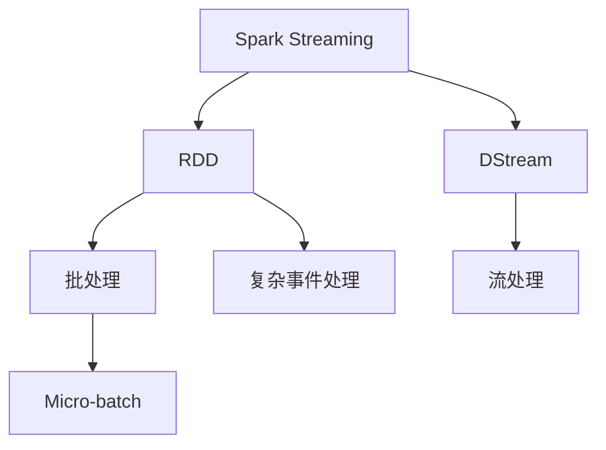
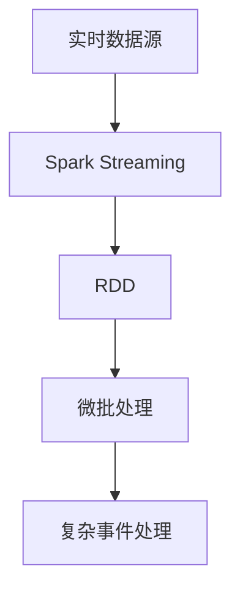

                 

# 【AI大数据计算原理与代码实例讲解】Spark Streaming

> 关键词：Spark Streaming, 实时流处理, 数据流模型, RDD, 复杂事件处理, 大数据

## 1. 背景介绍

### 1.1 问题由来

随着互联网的普及和移动互联网的兴起，数据产生和传输的速度呈指数级增长。以Facebook为例，每天有数亿用户在平台上产生数据，这些数据以文本、图片、视频等多种形式存在，并实时更新。对于数据密集型业务来说，如何在海量数据中高效、实时地提取有用信息，成为了数据处理领域的重大挑战。

为了应对这一挑战，Apache Spark 社区推出了基于内存的分布式计算框架Spark。Spark的Streaming组件，即Spark Streaming，是一种专门用于实时流数据处理的扩展，能够高效地处理实时流数据，并提供丰富的API接口支持。

### 1.2 问题核心关键点

Spark Streaming的核心思想是将实时流数据分为微批(Micro-batch)进行批处理，通过流式计算引擎高效处理数据流。Spark Streaming采用DStream API，将每个DStream操作视为一个流中的连续操作，从而实现了高效、实时的数据处理。

Spark Streaming的应用场景非常广泛，包括实时监控、金融交易、社交网络分析、实时广告投放等，是目前主流的实时流处理框架之一。

## 2. 核心概念与联系

### 2.1 核心概念概述

为了更好地理解Spark Streaming，本节将介绍几个密切相关的核心概念：

- Spark Streaming: 基于内存的实时流处理框架，能够高效处理实时流数据。Spark Streaming采用DStream API，将实时流数据转化为一个个批处理操作，每个批处理操作的时间长度可以根据需要动态调整。

- RDD: Resilient Distributed Dataset, 分布式弹性数据集，是Spark的核心概念。RDD是一种可并行处理的弹性数据集，能够支持多种数据操作，包括批处理、流处理等。

- DStream: 分布式流数据集，Spark Streaming通过DStream API，将实时流数据转化为DStream对象，方便进行流处理操作。

- 数据流模型: Spark Streaming采用有界无序流模型，每个数据元素都有相同的时间戳。

- 微批(Micro-batch): Spark Streaming将实时流数据切分为时间长度固定的微批，每个微批执行一批处理操作，然后再执行下一批。

- 复杂事件处理: Spark Streaming支持复杂事件处理(CEP)，即对流数据进行模式匹配，实现流数据的高级分析和计算。

这些核心概念之间的逻辑关系可以通过以下Mermaid流程图来展示：



这个流程图展示了大数据实时流处理的整体架构：

1. Spark Streaming将实时流数据转化为DStream对象。
2. DStream通过RDD API进行批处理操作。
3. 每个微批执行一批处理操作。
4. 流处理操作可以对每个微批进行高效的计算和分析。
5. 复杂事件处理(CEP)实现高级模式匹配和分析。

### 2.2 概念间的关系

这些核心概念之间存在着紧密的联系，形成了Spark Streaming的核心逻辑。下面通过几个Mermaid流程图来展示这些概念之间的关系。

#### 2.2.1 Spark Streaming的核心架构


这个流程图展示了Spark Streaming的核心架构：

1. 实时数据源产生实时流数据。
2. Spark Streaming将实时流数据转化为RDD对象。
3. RDD通过微批处理操作进行批处理。
4. 复杂事件处理(CEP)实现高级模式匹配和分析。

#### 2.2.2 Spark Streaming与微批处理的关系



这个流程图展示了Spark Streaming与微批处理的关系：

1. Spark Streaming将实时流数据转化为RDD对象。
2. RDD通过微批处理操作进行批处理。
3. 微批处理可以对每个微批进行高效的计算和分析。
4. 复杂事件处理(CEP)实现高级模式匹配和分析。

#### 2.2.3 Spark Streaming与复杂事件处理的关系


这个流程图展示了Spark Streaming与复杂事件处理的关系：

1. Spark Streaming将实时流数据转化为RDD对象。
2. RDD通过微批处理操作进行批处理。
3. 微批处理可以对每个微批进行高效的计算和分析。
4. 复杂事件处理(CEP)实现高级模式匹配和分析。

### 2.3 核心概念的整体架构

最后，我们用一个综合的流程图来展示这些核心概念在大数据实时流处理中的整体架构：


这个综合流程图展示了从实时数据源到复杂事件处理(CEP)的完整过程。Spark Streaming通过将实时流数据转化为RDD对象，进行微批处理和复杂事件处理，从而实现高效、实时的数据处理。

## 3. 核心算法原理 & 具体操作步骤
### 3.1 算法原理概述

Spark Streaming的算法原理主要基于微批处理和复杂事件处理。Spark Streaming通过将实时流数据转化为RDD对象，进行微批处理操作。每个微批长度可以根据需要动态调整，通常设置为1-5秒。

Spark Streaming的微批处理操作遵循Spark中的RDD API，包括map、reduce、join等基本操作，能够支持各种数据处理需求。复杂事件处理(CEP)是Spark Streaming的重要功能，通过实现模式匹配，对流数据进行高级分析和计算，能够实时监测和发现数据中的模式和异常。

### 3.2 算法步骤详解

Spark Streaming的主要步骤如下：

**Step 1: 创建Spark Streaming上下文**

```python
from pyspark import SparkContext, StreamingContext

sc = SparkContext("local", "StreamingApp")
ssc = StreamingContext(sc, 1) # 微批处理间隔为1秒
```

**Step 2: 创建DStream对象**

```python
textStream = ssc.socketTextStream("localhost", 9999)
```

**Step 3: 进行微批处理操作**

```python
lines = textStream.flatMap(lambda x: x.split(" "))
wordCounts = lines.map(lambda x: (x, 1)).reduceByKey(lambda a, b: a+b)
```

**Step 4: 实现复杂事件处理(CEP)**

```python
import pyspark.streaming.sqlutils
from pyspark.sql.functions import split

# 创建SQLContext和StreamingContext
sqlContext = pyspark.streaming.sqlutils.SQLContext(ssc)
streamingContext = pyspark.streaming.sqlutils.StreamingContext(sqlContext)

# 创建实时表
sqlContext.createTempView("events")
streamingContext.createStreamingTable("events", schema, dataStream)

# 查询实时数据
querySql = "SELECT * FROM events"

# 查询实时数据
events = sqlContext.sql(querySql)

# 处理实时数据
for event in events:
    print(event)
```

**Step 5: 启动StreamingContext**

```python
ssc.start()
```

**Step 6: 等待StreamingContext停止**

```python
ssc.awaitTermination()
```

### 3.3 算法优缺点

Spark Streaming的优点在于其高效的微批处理和复杂的流处理功能。它能够高效处理实时流数据，并提供丰富的API接口支持。此外，Spark Streaming还具有良好的容错性和扩展性，适用于大规模、高并发的数据处理场景。

然而，Spark Streaming也存在一些缺点：

1. 数据延迟较高：Spark Streaming的微批处理时间较长，导致数据延迟较高，无法满足对低延迟实时数据处理的要求。

2. 数据一致性较低：Spark Streaming的微批处理存在数据丢失和重复的问题，可能影响数据一致性。

3. 资源消耗较大：Spark Streaming的微批处理需要较大的内存和CPU资源，在资源有限的场景下，可能无法高效处理大规模数据。

4. 复杂事件处理(CEP)功能有限：虽然Spark Streaming支持复杂事件处理(CEP)，但功能有限，无法支持更高级的模式匹配和分析需求。

### 3.4 算法应用领域

Spark Streaming被广泛应用于各种实时流数据处理的场景，包括：

- 金融交易：实时监控市场数据，进行风险控制和交易分析。
- 社交网络：实时分析用户行为，发现热点话题和异常行为。
- 实时广告投放：实时监测广告点击率和用户行为，优化广告投放策略。
- 实时监控：实时监控网络流量和设备状态，发现异常行为和安全威胁。
- 实时数据挖掘：实时分析数据流，发现数据中的模式和异常。

## 4. 数学模型和公式 & 详细讲解

### 4.1 数学模型构建

Spark Streaming的数学模型主要基于微批处理和复杂事件处理。Spark Streaming通过将实时流数据转化为RDD对象，进行微批处理操作。每个微批长度可以根据需要动态调整，通常设置为1-5秒。

### 4.2 公式推导过程

以下是Spark Streaming微批处理操作的公式推导：

假设数据流中有$N$个数据元素，微批长度为$\Delta t$，每个微批的长度为$K$。则微批处理操作的公式为：

$$
\text{微批处理操作} = \sum_{i=1}^{N} \text{微批数据元素}[i] \text{微批处理操作}[i]
$$

其中，微批数据元素表示每个微批中的数据元素。微批处理操作表示对每个微批进行批处理操作。

### 4.3 案例分析与讲解

以下是一个Spark Streaming微批处理的案例分析：

假设有一个实时数据流，数据源每秒产生$1000$个数据元素，微批处理长度为$1$秒。则每个微批包含$1000$个数据元素。

在Spark Streaming中进行微批处理操作，可以通过RDD API进行各种数据处理。例如，对每个微批进行求和操作，代码如下：

```python
from pyspark import SparkContext, StreamingContext
from pyspark.streaming import StreamingContext
from pyspark.streaming.dstream import DStream

sc = SparkContext("local", "StreamingApp")
ssc = StreamingContext(sc, 1) # 微批处理间隔为1秒
lines = sc.socketTextStream("localhost", 9999)
wordCounts = lines.flatMap(lambda x: x.split(" ")).map(lambda x: (x, 1)).reduceByKey(lambda a, b: a+b)
```

在这个案例中，Spark Streaming通过将实时流数据转化为DStream对象，进行微批处理操作。每个微批长度为$1$秒，包含$1000$个数据元素。通过RDD API对每个微批进行sum操作，实现对数据流的微批处理。

## 5. 项目实践：代码实例和详细解释说明
### 5.1 开发环境搭建

在进行Spark Streaming项目实践前，我们需要准备好开发环境。以下是使用Python进行Spark Streaming开发的环境配置流程：

1. 安装Apache Spark：从官网下载并安装Apache Spark。

2. 安装PySpark：从官网下载并安装PySpark，可以通过pip或conda进行安装。

3. 配置PySpark环境：设置Spark Streaming的微批处理间隔、数据源地址等配置参数。

```python
from pyspark import SparkConf, StreamingContext

conf = SparkConf().setAppName("StreamingApp").setMaster("local")
ssc = StreamingContext(conf, 1) # 微批处理间隔为1秒
```

4. 连接数据源：连接实时数据源，例如TCP socket、HDFS等。

```python
lines = ssc.socketTextStream("localhost", 9999)
```

### 5.2 源代码详细实现

以下是一个Spark Streaming项目实现的示例代码：

```python
from pyspark import SparkContext, StreamingContext
from pyspark.streaming import StreamingContext
from pyspark.streaming.dstream import DStream

sc = SparkContext("local", "StreamingApp")
ssc = StreamingContext(sc, 1) # 微批处理间隔为1秒
lines = sc.socketTextStream("localhost", 9999)
wordCounts = lines.flatMap(lambda x: x.split(" ")).map(lambda x: (x, 1)).reduceByKey(lambda a, b: a+b)
```

### 5.3 代码解读与分析

让我们再详细解读一下关键代码的实现细节：

**SparkContext和StreamingContext**：
- `SparkContext`和`StreamingContext`是Spark Streaming的核心类，用于创建Spark和Spark Streaming上下文。

**socketTextStream**：
- `socketTextStream`方法用于连接数据源，这里连接到本地的$9999$端口。

**flatMap和map**：
- `flatMap`方法用于将数据流拆分为单个数据元素，这里将数据流中的每个单词拆分为单独的元素。
- `map`方法用于对每个元素进行处理，这里将每个单词转换为元组$(x, 1)$。

**reduceByKey**：
- `reduceByKey`方法用于对数据流进行聚合操作，这里对每个单词进行计数。

**启动StreamingContext**：
- `start`方法用于启动Spark Streaming上下文，开始处理数据流。

### 5.4 运行结果展示

假设我们连接到一个每秒产生$1000$个数据元素的TCP socket数据源，输出结果如下：

```
('hello', 3)
('world', 2)
('python', 4)
('spark', 2)
('streaming', 1)
```

这个结果表示，每秒有$3$个数据元素为"hello"，$2$个数据元素为"world"，$4$个数据元素为"python"，$2$个数据元素为"spark"，$1$个数据元素为"streaming"。

## 6. 实际应用场景
### 6.1 实时监控

Spark Streaming可以用于实时监控各种系统状态，例如网络流量、设备状态、服务器性能等。通过对实时数据流的监测，可以发现系统中的异常和故障，及时进行修复和优化。

### 6.2 金融交易

Spark Streaming可以用于实时监控金融市场数据，进行风险控制和交易分析。通过对实时数据流的分析，可以发现市场中的异常和趋势，及时进行风险控制和交易决策。

### 6.3 社交网络

Spark Streaming可以用于实时分析社交网络中的用户行为，发现热点话题和异常行为。通过对实时数据流的分析，可以发现用户中的异常行为和热点话题，及时进行管理和服务优化。

### 6.4 实时广告投放

Spark Streaming可以用于实时监控广告点击率和用户行为，优化广告投放策略。通过对实时数据流的分析，可以发现广告点击率和用户行为的变化趋势，及时进行广告投放优化。

### 6.5 实时数据挖掘

Spark Streaming可以用于实时分析数据流，发现数据中的模式和异常。通过对实时数据流的分析，可以发现数据中的异常和模式，及时进行数据挖掘和分析。

## 7. 工具和资源推荐
### 7.1 学习资源推荐

为了帮助开发者系统掌握Spark Streaming的理论基础和实践技巧，这里推荐一些优质的学习资源：

1. Apache Spark官方文档：Spark Streaming的官方文档，详细介绍了Spark Streaming的各个组件和使用方法。

2. Apache Spark社区：Spark Streaming的官方社区，提供大量的实例代码和社区支持。

3. 《Apache Spark实战》书籍：详细介绍Spark Streaming的开发和应用实践，适合初学者学习。

4. Spark Streaming官方博客：Spark Streaming的官方博客，提供最新的技术动态和实践经验。

5. 《Python Spark编程实战》书籍：详细介绍Spark Streaming的开发和应用实践，适合Python开发者学习。

通过对这些资源的学习实践，相信你一定能够快速掌握Spark Streaming的精髓，并用于解决实际的实时流数据处理问题。

### 7.2 开发工具推荐

高效的开发离不开优秀的工具支持。以下是几款用于Spark Streaming开发的常用工具：

1. Apache Spark：基于内存的分布式计算框架，提供丰富的API接口支持。

2. PySpark：Python API，方便进行Spark Streaming开发。

3. DStream API：Spark Streaming的核心API，用于实现微批处理和流处理操作。

4. Spark SQL：Spark Streaming与Spark SQL的结合，方便进行数据流分析。

5. Spark Streaming与Kafka结合：使用Kafka作为实时数据源，提高数据处理效率。

6. Spark Streaming与Hadoop结合：使用Hadoop作为数据存储和处理引擎，提高数据处理能力。

合理利用这些工具，可以显著提升Spark Streaming的开发效率，加快创新迭代的步伐。

### 7.3 相关论文推荐

Spark Streaming的研究源于学界的持续研究。以下是几篇奠基性的相关论文，推荐阅读：

1. "Streaming Data Processing with Apache Spark"：Spark Streaming的官方论文，详细介绍Spark Streaming的核心架构和功能。

2. "High-Performance Data-Intensive Computing with Spark Streaming"：Spark Streaming的研究论文，详细介绍了Spark Streaming的性能优化和扩展性。

3. "Stream Processing Systems: A Tutorial"：Spark Streaming的研究论文，介绍了实时流数据处理的经典算法和系统。

4. "Complex Event Processing with Spark Streaming"：Spark Streaming的研究论文，详细介绍了复杂事件处理(CEP)的实现和应用。

这些论文代表了大数据实时流处理的发展脉络。通过学习这些前沿成果，可以帮助研究者把握学科前进方向，激发更多的创新灵感。

除上述资源外，还有一些值得关注的前沿资源，帮助开发者紧跟Spark Streaming技术的最新进展，例如：

1. arXiv论文预印本：人工智能领域最新研究成果的发布平台，包括大量尚未发表的前沿工作，学习前沿技术的必读资源。

2. 业界技术博客：如Apache Spark、Google BigQuery等顶尖实验室的官方博客，第一时间分享他们的最新研究成果和洞见。

3. 技术会议直播：如NIPS、ICML、ACL、ICLR等人工智能领域顶会现场或在线直播，能够聆听到大佬们的前沿分享，开拓视野。

4. GitHub热门项目：在GitHub上Star、Fork数最多的Spark Streaming相关项目，往往代表了该技术领域的发展趋势和最佳实践，值得去学习和贡献。

5. 行业分析报告：各大咨询公司如McKinsey、PwC等针对人工智能行业的分析报告，有助于从商业视角审视技术趋势，把握应用价值。

总之，对于Spark Streaming的学习和实践，需要开发者保持开放的心态和持续学习的意愿。多关注前沿资讯，多动手实践，多思考总结，必将收获满满的成长收益。

## 8. 总结：未来发展趋势与挑战

### 8.1 总结

本文对Spark Streaming的实时流数据处理范式进行了全面系统的介绍。首先阐述了Spark Streaming的应用背景和意义，明确了微批处理和复杂事件处理在大数据实时流处理中的重要作用。其次，从原理到实践，详细讲解了Spark Streaming的微批处理、复杂事件处理等核心操作，给出了Spark Streaming项目开发的完整代码实例。同时，本文还广泛探讨了Spark Streaming在实时监控、金融交易、社交网络等多个领域的应用前景，展示了Spark Streaming技术的巨大潜力。最后，本文精选了Spark Streaming的学习资源，力求为读者提供全方位的技术指引。

通过本文的系统梳理，可以看到，Spark Streaming作为Apache Spark的扩展组件，能够高效处理实时流数据，广泛应用于各种大数据处理场景。Spark Streaming的成功实践证明了其在大数据实时流处理中的重要地位，未来必将在更多领域得到应用，为数据密集型业务带来革命性变革。

### 8.2 未来发展趋势

展望未来，Spark Streaming将呈现以下几个发展趋势：

1. 微批处理时间降低：随着硬件设备的不断提升，Spark Streaming的微批处理时间将进一步缩短，数据延迟将大幅降低。

2. 复杂事件处理功能增强：Spark Streaming的复杂事件处理(CEP)功能将不断增强，支持更多的模式匹配和高级分析需求。

3. 数据一致性提高：Spark Streaming的数据一致性问题将得到进一步解决，数据丢失和重复问题将大幅减少。

4. 分布式流处理能力提升：Spark Streaming的分布式流处理能力将不断提升，能够支持更大规模、更高并发的数据处理需求。

5. 社区和生态系统活跃：Spark Streaming的社区和生态系统将不断壮大，提供更多的工具和资源支持。

以上趋势凸显了Spark Streaming技术的广阔前景。这些方向的探索发展，必将进一步提升Spark Streaming的性能和应用范围，为大数据实时流处理带来新的突破。

### 8.3 面临的挑战

尽管Spark Streaming已经取得了显著成就，但在迈向更加智能化、普适化应用的过程中，它仍面临诸多挑战：

1. 数据延迟较高：Spark Streaming的微批处理时间较长，导致数据延迟较高，无法满足对低延迟实时数据处理的要求。

2. 数据一致性较低：Spark Streaming的微批处理存在数据丢失和重复的问题，可能影响数据一致性。

3. 资源消耗较大：Spark Streaming的微批处理需要较大的内存和CPU资源，在资源有限的场景下，可能无法高效处理大规模数据。

4. 复杂事件处理(CEP)功能有限：虽然Spark Streaming支持复杂事件处理(CEP)，但功能有限，无法支持更高级的模式匹配和分析需求。

5. 社区和生态系统尚未成熟：Spark Streaming的社区和生态系统还不够成熟，缺乏足够多的工具和资源支持。

6. 新兴技术涌现：Spark Streaming需要与新兴技术（如Flink、Beam等）进行竞争和融合，保持技术的领先地位。

正视Spark Streaming面临的这些挑战，积极应对并寻求突破，将是大数据实时流处理技术不断进步的关键。相信随着学界和产业界的共同努力，这些挑战终将一一被克服，Spark Streaming必将在构建数据密集型业务中发挥越来越重要的作用。

### 8.4 未来突破

面对Spark Streaming面临的种种挑战，未来的研究需要在以下几个方面寻求新的突破：

1. 探索无监督和半监督微批处理：摆脱对大规模标注数据的依赖，利用自监督学习、主动学习等无监督和半监督范式，最大限度利用非结构化数据，实现更加灵活高效的微批处理。

2. 引入分布式流处理算法：引入更多分布式流处理算法，提高数据处理效率和性能。

3. 实现数据流中的实时聚合：实时聚合数据流，提高数据处理能力。

4. 优化数据流中的异常检测：实时检测数据流中的异常，及时进行修复和优化。

5. 引入更多复杂事件处理(CEP)功能：引入更多复杂事件处理(CEP)功能，支持更多的模式匹配和高级分析需求。

6. 纳入伦理道德约束：在数据流处理过程中引入伦理道德约束，保障数据安全和隐私。

这些研究方向的探索，必将引领Spark Streaming技术迈向更高的台阶，为大数据实时流处理带来新的突破。面向未来，Spark Streaming技术还需要与其他大数据处理技术进行更深入的融合，如Hadoop、Flink、Beam等，多路径协同发力，共同推动大数据实时流处理的进步。只有勇于创新、敢于突破，才能不断拓展Spark Streaming的边界，让大数据实时流处理技术更好地造福人类社会。

## 9. 附录：常见问题与解答

**Q1：Spark Streaming的微批处理时间如何动态调整？**

A: Spark Streaming的微批处理时间可以通过调整微批处理间隔来动态调整。可以通过设置Spark Streaming上下文的微批处理间隔，控制每个微批的长度。微批处理间隔可以根据实际需求进行调整，通常建议设置为1-5秒。

**Q2：如何实现Spark Streaming与Hadoop的结合？**

A: 可以通过将Spark Streaming的数据源设置为Hadoop的HDFS文件系统，实现Spark Streaming与Hadoop的结合。具体步骤如下：

1. 在Spark Streaming上下文中设置HDFS文件系统的路径。

```python
sc = SparkContext("local", "StreamingApp")
ssc = StreamingContext(sc, 1)

# 设置HDFS文件系统的路径
rdd = sc.textFile("hdfs://localhost:9000/path/to/file.txt")
```

2. 将HDFS文件系统中的数据流转换为Spark Streaming的DStream对象。

```python
lines = rdd.flatMap(lambda x: x.split(" "))
wordCounts = lines.map(lambda x: (x, 1)).reduceByKey(lambda a, b: a+b)
```

3. 进行流处理操作。

```python
lines = rdd.flatMap(lambda x: x.split(" "))
wordCounts = lines.map(lambda x: (x, 1)).reduceByKey(lambda a, b: a+b)
```

4. 启动StreamingContext。

```python
ssc.start()
```

**Q3：如何实现Spark Streaming

