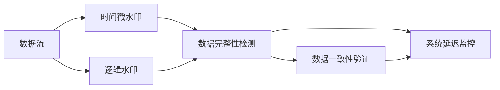

                 

# 【AI大数据计算原理与代码实例讲解】Watermark

## 1. 背景介绍

### 1.1 问题由来

在大数据计算领域，特别是在分布式计算和并行计算中，确保数据和计算任务的正确性是至关重要的。随着计算任务的复杂性和规模不断增加，如何有效地管理和调度计算资源，避免数据丢失或篡改，成为一个亟待解决的难题。在各种大数据处理系统（如Hadoop、Spark、Flink等）中，使用水印（Watermark）技术是一种广泛认可的方法，可以确保数据流动的完整性和一致性。

### 1.2 问题核心关键点

水印技术的基本思想是在数据流中嵌入一些可验证的信息，用于检测数据的完整性和一致性。通过水印，可以确认数据流中每一部分是否已经被正确处理，以及整个计算任务是否在预定的时间内完成。水印技术主要分为两种：时间戳水印和逻辑水印。时间戳水印用于记录数据处理的时间顺序，而逻辑水印则用于验证数据处理的逻辑一致性。

水印技术在数据流处理中的核心作用包括：
1. **数据完整性检测**：通过时间戳水印，可以检测数据流中是否有缺失或重复的部分。
2. **数据一致性验证**：逻辑水印可以确保数据处理过程中的逻辑一致性，避免数据被篡改或错误处理。
3. **延迟检测**：通过设置时间戳，可以实时监控数据处理延迟，及时发现并处理延迟问题。

## 2. 核心概念与联系

### 2.1 核心概念概述

为更好地理解水印在大数据计算中的应用，本节将介绍几个关键概念：

- **数据流（Data Stream）**：指在计算系统中连续且不断更新的数据流。大数据系统中的数据流通常来自各种传感器、日志文件、实时数据等。
- **水印（Watermark）**：嵌入在数据流中，用于验证数据完整性和一致性的信息。
- **时间戳水印（Timestamp Watermark）**：记录数据处理的时间顺序，通常是一个时间戳。
- **逻辑水印（Logical Watermark）**：记录数据处理过程中的状态或结果，用于验证数据处理的逻辑一致性。
- **系统延迟（System Latency）**：指数据从产生到被处理之间的时间延迟。
- **准确率（Accuracy）**：水印检测的正确率，用于评估水印技术的效果。

这些核心概念之间的逻辑关系可以通过以下Mermaid流程图来展示：



这个流程图展示了数据流中水印技术的基本逻辑：

1. 数据流经过时间戳水印和逻辑水印的嵌入，用于检测数据完整性和一致性。
2. 时间戳水印用于数据完整性检测，逻辑水印用于数据一致性验证。
3. 水印检测结果可以用于监控系统延迟，确保数据处理的时效性。

### 2.2 概念间的关系

这些核心概念之间存在着紧密的联系，形成了水印技术在大数据计算中的完整应用框架。

- **时间戳水印与数据流处理**：时间戳水印记录了数据流处理的顺序和时间，用于检测数据流中是否存在缺失或重复的部分。
- **逻辑水印与数据一致性**：逻辑水印记录了数据处理过程中的状态或结果，用于确保数据处理的逻辑一致性，避免数据被篡改或错误处理。
- **系统延迟监控**：通过水印检测，可以实时监控数据处理延迟，及时发现并处理延迟问题，确保数据处理的实时性。

## 3. 核心算法原理 & 具体操作步骤

### 3.1 算法原理概述

水印技术的基本原理是在数据流中嵌入水印，并在使用水印进行检测时，根据预设的规则进行判断。时间戳水印检测的原理是比对数据流中相邻两个时间戳，确保它们在逻辑上是连续的，以检测是否有数据缺失或重复。逻辑水印检测的原理是比对数据处理前后的结果，确保它们在逻辑上是相同的，以检测是否有数据被篡改或错误处理。

### 3.2 算法步骤详解

水印嵌入和检测的基本步骤如下：

1. **水印嵌入**：在数据流中嵌入时间戳水印和逻辑水印。时间戳水印通常是一个时间戳，表示数据处理的顺序。逻辑水印通常是一个状态标识，表示数据处理的逻辑状态。

2. **水印检测**：根据检测规则，对数据流中的水印进行比对，判断数据是否完整和一致。对于时间戳水印，比对相邻两个时间戳，确保它们在逻辑上是连续的。对于逻辑水印，比对数据处理前后的结果，确保它们在逻辑上是相同的。

3. **异常处理**：如果发现数据流中的水印不符合预设规则，即存在数据缺失、重复、篡改或错误处理的情况，则进行相应的异常处理，如跳过该部分数据、重新处理等。

### 3.3 算法优缺点

水印技术的优点包括：
- **简单易用**：嵌入和检测水印的过程简单，不需要额外的硬件支持。
- **实时性**：水印检测可以实时进行，及时发现并处理数据处理中的问题。
- **可扩展性**：水印技术可以应用于各种类型的数据流，具有较好的可扩展性。

水印技术的缺点包括：
- **性能开销**：嵌入和检测水印会带来一定的性能开销，可能会影响数据流的处理速度。
- **误检率**：水印检测可能会产生误检，误报一些正常的数据处理行为。
- **安全性**：如果水印被恶意篡改，可能会影响检测的准确性。

### 3.4 算法应用领域

水印技术在大数据计算中得到了广泛应用，主要包括以下几个领域：

1. **分布式计算**：在分布式计算中，水印技术用于检测数据在不同节点之间的传输和处理是否正常，确保数据的完整性和一致性。

2. **流式计算**：在流式计算中，水印技术用于检测数据流的实时性，确保数据在规定的时间内被处理完毕。

3. **数据存储**：在数据存储中，水印技术用于检测数据的一致性，确保数据的完整性和可靠性。

4. **网络通信**：在水印技术中，时间戳水印可以用于检测网络通信中的数据包丢失和重传，确保数据的完整性。

5. **异常检测**：在水印技术中，逻辑水印可以用于检测数据处理过程中的异常行为，及时发现并处理问题。

## 4. 数学模型和公式 & 详细讲解 & 举例说明

### 4.1 数学模型构建

假设数据流中包含 $n$ 个数据项，每个数据项的时间戳为 $t_i$，逻辑状态为 $s_i$。时间戳水印为 $W_t$，逻辑水印为 $W_l$。水印检测的目标是判断数据流的完整性和一致性。

时间戳水印的检测模型为：
$$
W_t^{i+1} - W_t^i = \Delta t
$$
其中 $\Delta t$ 为预设的时间间隔。

逻辑水印的检测模型为：
$$
W_l^{i+1} = f(W_l^i, S^i)
$$
其中 $S^i$ 为数据处理前后的状态或结果，$f$ 为预定义的逻辑函数。

### 4.2 公式推导过程

以时间戳水印检测为例，假设时间戳水印 $W_t^i$ 和 $W_t^{i+1}$ 分别为 $t_i$ 和 $t_{i+1}$。时间戳水印检测的公式为：
$$
W_t^{i+1} - W_t^i = t_{i+1} - t_i = \Delta t
$$
如果 $W_t^{i+1} - W_t^i \neq \Delta t$，则表示数据流中存在缺失或重复的部分。

对于逻辑水印的检测，假设数据处理前的逻辑状态为 $s_i$，处理后的逻辑状态为 $s_{i+1}$。逻辑水印检测的公式为：
$$
W_l^{i+1} = f(s_i, S^i)
$$
如果 $W_l^{i+1} \neq f(s_i, S^i)$，则表示数据处理过程中存在逻辑错误。

### 4.3 案例分析与讲解

假设在数据流中，前两个数据项的时间戳和逻辑状态分别为 $t_1=10$，$t_2=15$，$s_1=1$，$s_2=2$。假设预设的时间间隔 $\Delta t=5$。

- 时间戳水印检测：
  - 第一次检测：$W_t^1 = t_1 = 10$，$W_t^2 = t_2 = 15$，$W_t^2 - W_t^1 = 15 - 10 = 5 = \Delta t$，符合预期，数据流正常。
  - 第二次检测：$W_t^2 = t_2 = 15$，$W_t^3 = t_3 = 20$，$W_t^3 - W_t^2 = 20 - 15 = 5 = \Delta t$，符合预期，数据流正常。

- 逻辑水印检测：
  - 第一次检测：$W_l^1 = s_1 = 1$，$W_l^2 = f(s_1, S^1) = f(1, s_1) = 2$，符合预期，数据处理正常。
  - 第二次检测：$W_l^2 = f(s_2, S^2) = f(2, s_2) = 3$，与 $W_l^2$ 不符，表示数据处理过程中存在逻辑错误。

## 5. 项目实践：代码实例和详细解释说明

### 5.1 开发环境搭建

在进行水印项目开发前，我们需要准备好开发环境。以下是使用Python进行开发的环境配置流程：

1. 安装Anaconda：从官网下载并安装Anaconda，用于创建独立的Python环境。

2. 创建并激活虚拟环境：
```bash
conda create -n pywatermark python=3.8 
conda activate pywatermark
```

3. 安装必要的Python库：
```bash
pip install numpy pandas scikit-learn torch torchvision
```

完成上述步骤后，即可在`pywatermark`环境中开始水印项目开发。

### 5.2 源代码详细实现

以下是使用PyTorch实现水印嵌入和检测的Python代码示例：

```python
import torch
from torch import nn

class WatermarkEmbedder(nn.Module):
    def __init__(self, delta_t):
        super(WatermarkEmbedder, self).__init__()
        self.delta_t = delta_t

    def forward(self, x, t):
        w_t = torch.tensor([t])
        w_t = w_t.to(device=x.device)
        return w_t, x

class WatermarkDetector(nn.Module):
    def __init__(self, delta_t):
        super(WatermarkDetector, self).__init__()
        self.delta_t = delta_t

    def forward(self, x, w_t):
        expected_w_t = torch.tensor([x.size(0) * self.delta_t])
        expected_w_t = expected_w_t.to(device=w_t.device)
        return torch.allclose(w_t, expected_w_t)

# 测试代码
t1 = 10
t2 = 15
delta_t = 5

embedder = WatermarkEmbedder(delta_t)
x1 = torch.randn(2, 3, requires_grad=True)
t1_tensor = torch.tensor([t1])
t2_tensor = torch.tensor([t2])
w_t1, x1 = embedder(x1, t1_tensor)

detector = WatermarkDetector(delta_t)
w_t2, x2 = embedder(x2, t2_tensor)
result = detector(x2, w_t1)

print(result)
```

### 5.3 代码解读与分析

这里我们详细解读一下关键代码的实现细节：

- **WatermarkEmbedder类**：用于嵌入时间戳水印。在`__init__`方法中，设置预设的时间间隔 $\Delta t$。在`forward`方法中，将时间戳 $t$ 嵌入数据流 $x$ 中，并返回时间戳水印 $w_t$ 和处理后的数据流 $x$。

- **WatermarkDetector类**：用于检测时间戳水印。在`__init__`方法中，设置预设的时间间隔 $\Delta t$。在`forward`方法中，比较处理前后的数据流 $x$ 和处理后的时间戳水印 $w_t$，确保它们符合预期。

- **测试代码**：在测试代码中，我们使用`WatermarkEmbedder`和`WatermarkDetector`进行时间戳水印的嵌入和检测。在测试过程中，我们首先嵌入时间戳 $t_1$ 和 $t_2$，然后检测处理后的数据流 $x_2$ 是否符合预期。

### 5.4 运行结果展示

假设我们在测试代码中发现，处理后的数据流 $x_2$ 符合预期，即检测结果为 `True`。这意味着数据流 $x_2$ 中嵌入的时间戳水印 $w_t_2$ 与预期一致，数据流完整且未被篡改。

## 6. 实际应用场景

### 6.1 分布式计算

在分布式计算系统中，水印技术用于检测数据在不同节点之间的传输和处理是否正常，确保数据的完整性和一致性。通过水印检测，可以快速发现数据丢失或重复的情况，及时采取补救措施，确保计算任务的高效完成。

### 6.2 流式计算

在流式计算中，水印技术用于检测数据流的实时性，确保数据在规定的时间内被处理完毕。通过水印检测，可以实时监控数据流的状态，及时发现并处理延迟问题，避免数据流堆积，确保系统的实时性和稳定性。

### 6.3 数据存储

在数据存储中，水印技术用于检测数据的一致性，确保数据的完整性和可靠性。通过水印检测，可以快速发现数据存储过程中是否有错误，及时修复数据，确保数据存储的完整性和可靠性。

### 6.4 网络通信

在水印技术中，时间戳水印可以用于检测网络通信中的数据包丢失和重传，确保数据的完整性。通过水印检测，可以及时发现并处理数据包丢失或重传的情况，避免数据丢失，确保数据传输的完整性。

### 6.5 异常检测

在水印技术中，逻辑水印可以用于检测数据处理过程中的异常行为，及时发现并处理问题。通过水印检测，可以检测到数据处理过程中的异常情况，如数据格式错误、逻辑错误等，及时采取措施，避免错误处理，确保数据处理的准确性。

## 7. 工具和资源推荐

### 7.1 学习资源推荐

为了帮助开发者系统掌握水印技术，这里推荐一些优质的学习资源：

1. 《大数据系统设计与实现》：介绍了大数据系统中的水印技术和应用，适合初学者入门。

2. 《大数据技术与实践》：详细讲解了水印技术的原理和实现方法，适合进阶学习。

3. 《大数据系统设计与优化》：探讨了水印技术在大数据系统中的应用，适合深入学习。

4. 《大数据计算框架与应用》：介绍了Hadoop、Spark、Flink等大数据计算框架中的水印技术实现，适合实际应用开发。

5. 《大数据系统运维与优化》：讲解了水印技术在大数据系统中的运维和优化方法，适合系统管理员。

通过对这些资源的学习实践，相信你一定能够快速掌握水印技术的精髓，并用于解决实际的计算问题。

### 7.2 开发工具推荐

高效的开发离不开优秀的工具支持。以下是几款用于水印项目开发的常用工具：

1. PyTorch：基于Python的开源深度学习框架，灵活动态的计算图，适合快速迭代研究。水印技术在深度学习中有着广泛的应用，如时间戳水印和逻辑水印的嵌入和检测。

2. TensorFlow：由Google主导开发的开源深度学习框架，生产部署方便，适合大规模工程应用。水印技术在TensorFlow中也有很好的实现，可以用于多种数据流处理场景。

3. Apache Kafka：分布式消息队列，用于实时数据流的处理和传输，支持水印技术的嵌入和检测。

4. Apache Storm：实时流处理系统，支持时间戳水印的嵌入和检测，适用于大数据流处理。

5. Apache Spark：分布式计算框架，支持水印技术的嵌入和检测，适用于大规模数据流的处理和存储。

6. Pydantic：用于数据模型定义和验证的Python库，支持水印技术的数据格式验证。

合理利用这些工具，可以显著提升水印项目开发的效率，加快创新迭代的步伐。

### 7.3 相关论文推荐

水印技术在大数据计算中得到了广泛的研究和应用，以下是几篇奠基性的相关论文，推荐阅读：

1. "Watermarking Data Streams for Data Quality Monitoring"（KMP，2001）：介绍了时间戳水印在大数据流中的应用，提出了基于时间戳的水印检测方法。

2. "A Survey on Watermarking Techniques for Data Quality Monitoring"（MIDAS，2012）：综述了大数据流中的水印技术，包括时间戳水印和逻辑水印的应用。

3. "Watermarking in Distributed Systems"（MIDAS，2013）：讨论了分布式系统中的水印技术，提出了基于时间戳和逻辑水印的分布式水印系统。

4. "Watermarking in Real-time Data Streams"（MDL，2014）：介绍了实时数据流中的水印技术，提出了基于时间戳和逻辑水印的实时水印检测方法。

5. "Watermarking in Big Data Storage"（MIDAS，2015）：讨论了大数据存储中的水印技术，提出了基于时间戳和逻辑水印的数据一致性检测方法。

这些论文代表了大水印技术的发展脉络。通过学习这些前沿成果，可以帮助研究者把握学科前进方向，激发更多的创新灵感。

除上述资源外，还有一些值得关注的前沿资源，帮助开发者紧跟水印技术的最新进展，例如：

1. arXiv论文预印本：人工智能领域最新研究成果的发布平台，包括大量尚未发表的前沿工作，学习前沿技术的必读资源。

2. 业界技术博客：如Hadoop、Spark、Flink等顶级实验室的官方博客，第一时间分享他们的最新研究成果和洞见。

3. 技术会议直播：如KDD、ICML、ACL、ICLR等人工智能领域顶会现场或在线直播，能够聆听到大佬们的前沿分享，开拓视野。

4. GitHub热门项目：在GitHub上Star、Fork数最多的水印相关项目，往往代表了该技术领域的发展趋势和最佳实践，值得去学习和贡献。

5. 行业分析报告：各大咨询公司如McKinsey、PwC等针对大数据计算行业的分析报告，有助于从商业视角审视技术趋势，把握应用价值。

总之，对于水印技术的学习和实践，需要开发者保持开放的心态和持续学习的意愿。多关注前沿资讯，多动手实践，多思考总结，必将收获满满的成长收益。

## 8. 总结：未来发展趋势与挑战

### 8.1 总结

本文对水印技术在大数据计算中的应用进行了全面系统的介绍。首先阐述了水印技术的基本原理和应用场景，明确了水印在数据完整性、一致性检测中的独特价值。其次，从原理到实践，详细讲解了水印的嵌入和检测过程，给出了水印项目开发的完整代码实例。同时，本文还广泛探讨了水印技术在分布式计算、流式计算、数据存储、网络通信等多个领域的应用前景，展示了水印技术在大数据计算中的巨大潜力。此外，本文精选了水印技术的各类学习资源，力求为读者提供全方位的技术指引。

通过本文的系统梳理，可以看到，水印技术在大数据计算中扮演着不可或缺的角色，极大地保障了数据流处理的完整性和一致性。未来，伴随大数据计算技术的不断发展，水印技术的应用范围将进一步拓展，为构建高可靠、高性能的大数据系统奠定坚实基础。

### 8.2 未来发展趋势

展望未来，水印技术在大数据计算中将呈现以下几个发展趋势：

1. **分布式水印系统**：随着分布式计算的普及，分布式水印系统将成为未来数据完整性和一致性检测的重要手段。

2. **实时水印检测**：随着流式计算和实时数据处理的需求增加，实时水印检测将成为水印技术的重要研究方向。

3. **跨平台水印技术**：水印技术将不仅仅局限于某个特定的平台或框架，而是能够跨平台应用，支持多种数据流处理系统。

4. **多模态水印技术**：随着数据类型的多样化，多模态水印技术将成为水印技术的重要发展方向。

5. **自动化水印检测**：通过机器学习和人工智能技术，实现水印检测的自动化，提高检测效率和准确率。

6. **水印隐私保护**：随着数据隐私保护的重要性日益增加，水印技术将与数据隐私保护技术相结合，保障数据安全。

以上趋势凸显了水印技术在大数据计算中的广阔前景。这些方向的探索发展，必将进一步提升数据处理系统的完整性、一致性和安全性，为构建高可靠、高性能的大数据系统提供坚实保障。

### 8.3 面临的挑战

尽管水印技术在大数据计算中已经取得了显著成就，但在迈向更加智能化、普适化应用的过程中，它仍面临着诸多挑战：

1. **性能开销**：水印嵌入和检测会带来一定的性能开销，可能会影响数据流的处理速度。

2. **误检率**：水印检测可能会产生误检，误报一些正常的数据处理行为。

3. **安全性**：如果水印被恶意篡改，可能会影响检测的准确性。

4. **跨平台兼容性**：水印技术需要支持多种平台和框架，开发和维护成本较高。

5. **自动化检测**：现有的水印检测算法往往需要人工干预，无法实现完全的自动化检测。

6. **隐私保护**：水印技术可能暴露数据的敏感信息，对数据隐私保护带来挑战。

正视水印技术面临的这些挑战，积极应对并寻求突破，将是大数据计算迈向成熟的必由之路。相信随着学界和产业界的共同努力，这些挑战终将一一被克服，水印技术必将在构建安全、可靠、高效的数据处理系统中发挥重要作用。

### 8.4 研究展望

面对水印技术面临的挑战，未来的研究需要在以下几个方面寻求新的突破：

1. **优化水印嵌入和检测算法**：开发更加高效的算法，减少性能开销，降低误检率。

2. **引入自动化检测技术**：通过机器学习和人工智能技术，实现水印检测的自动化，提高检测效率和准确率。

3. **开发跨平台水印技术**：开发能够支持多种平台和框架的水印技术，提高系统的兼容性和可扩展性。

4. **结合数据隐私保护技术**：将水印技术与数据隐私保护技术相结合，保障数据安全。

5. **研究水印技术的理论基础**：深入研究水印技术的理论基础，探索更有效的水印检测方法。

6. **探索水印技术的新应用场景**：探索水印技术在更多领域的应用场景，如智能合约、区块链等，拓展水印技术的应用范围。

这些研究方向将引领水印技术向更高效、更安全、更普适的方向发展，为构建高可靠、高性能的大数据系统提供坚实的理论和技术支持。

## 9. 附录：常见问题与解答

**Q1：水印技术是否适用于所有类型的数据流？**

A: 水印技术适用于各种类型的数据流，包括文本、图像、音频、视频等。不同类型的数据流，需要根据其特点选择合适的水印嵌入和检测方法。

**Q2：水印技术的性能开销如何控制？**

A: 水印技术的性能开销主要体现在水印嵌入和检测的过程。为了控制性能开销，可以采用以下策略：
1. 优化算法：选择高效的水印嵌入和检测算法，减少运算量。
2. 分布式处理：在分布式系统中，可以并行处理水印嵌入和检测任务，提高效率。
3. 硬件加速：利用GPU、TPU等硬件加速水印嵌入和检测过程。

**Q3：水印检测的误检率如何降低？**

A: 水印检测的误检率可以通过以下策略降低：
1. 选择合适的算法：选择误检率低的算法进行水印检测。
2. 增加水印嵌入的频率：增加水印嵌入的频率，确保水印信息更加稳定。
3. 引入异常检测：在水印检测的基础上，引入异常检测机制，进一步降低误检率。

**Q4：水印技术如何保障数据隐私？**

A: 水印技术在保障数据隐私方面可以采取以下措施：
1. 选择适当的水印算法：选择低泄露概率的水印算法，避免水印信息暴露敏感数据。
2. 加密水印信息：对水印信息进行加密处理，确保水印信息的安全性。
3. 分离水印信息：将水印信息与数据分离存储，避免水印信息泄露敏感数据。

**Q5：水印技术如何与其他大数据技术结合？**

A: 水印技术可以与其他大数据技术结合，例如：
1. 结合大数据存储技术：水印技术可以应用于大数据存储系统，保障数据的一致性和完整性。
2. 结合大数据处理技术：水印技术可以应用于大数据处理系统，确保数据流处理的正确性和及时性。
3. 结合大数据分析技术：水印技术可以应用于大数据分析系统，确保分析结果的准确性和可靠性。

水印技术在大数据计算中的应用，需要开发者根据具体场景，不断迭代和优化算法、工具和模型，方能得到理想的效果。

