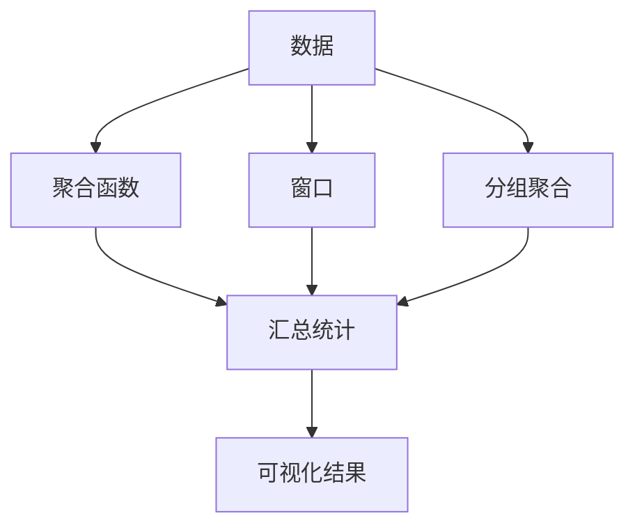
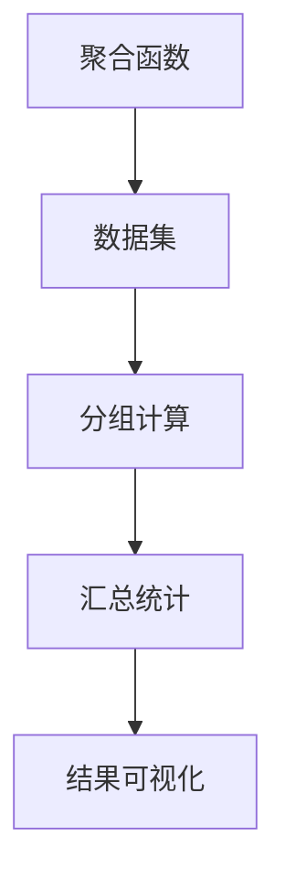
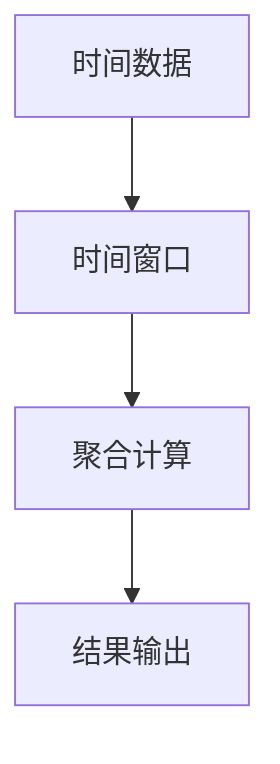
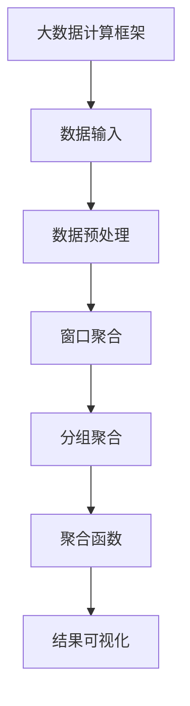

                 

# 【AI大数据计算原理与代码实例讲解】聚合分析

> 关键词：聚合分析,大数据计算,算法原理,数学模型,代码实例

## 1. 背景介绍

### 1.1 问题由来
在大数据时代，数据量以指数级增长，如何高效、准确地从海量数据中提取有用的信息，成为了各行各业共同关注的问题。聚合分析（Aggregation Analysis）作为数据分析的重要手段，通过对数据的聚合、统计和分析，帮助用户更好地理解数据背后的规律和趋势，从而做出更科学、更合理的决策。

聚合分析在商业智能（BI）、金融分析、供应链管理、医疗健康等多个领域中具有广泛应用。例如，在商业智能中，聚合分析可以帮助企业了解不同时间段内的销售趋势，评估产品的市场表现；在金融分析中，聚合分析可以识别风险点，优化投资组合；在供应链管理中，聚合分析可以预测需求变化，提高库存管理效率。

然而，随着数据量的不断增加和业务场景的不断复杂化，传统的数据处理方式已经难以满足需求。如何利用先进的大数据技术和算法，实现高效、灵活、准确的聚合分析，成为了当前研究的热点。

### 1.2 问题核心关键点
聚合分析的核心在于如何将原始数据按照指定的聚合方式进行汇总，并提取有价值的信息。常见的聚合方式包括聚合函数（如SUM、AVG、COUNT等）、窗口聚合、分组聚合等。通过这些方式，可以从数据中提取出统计信息、时间序列特征、趋势分析结果等。

目前，聚合分析的主要挑战在于：
1. 处理大规模数据：在大数据环境下，传统的聚合方法无法快速处理大量数据，需要借助分布式计算和并行处理技术。
2. 实时性要求：在实时数据流中，需要快速响应聚合分析请求，保证数据的实时性和准确性。
3. 数据多维度：在多维度数据中，需要进行复杂的分组和聚合操作，以获取更加精细化的分析结果。
4. 结果可视化：如何将聚合分析结果直观地呈现给用户，是一个重要的技术问题。

这些挑战推动了大数据计算技术的发展，包括分布式计算框架（如Apache Hadoop、Apache Spark等）、并行计算算法（如MapReduce、Spark Streaming等）、数据处理工具（如Presto、Apache Flink等）等。

## 2. 核心概念与联系

### 2.1 核心概念概述

为了更好地理解聚合分析的原理和实现，本节将介绍几个关键概念：

- 聚合函数（Aggregation Function）：用于对数据进行聚合计算的函数，常见的聚合函数包括SUM、AVG、COUNT、MAX、MIN等。聚合函数可以将多个数据值合并为单个值，用于计算统计信息。
- 窗口（Window）：一种用于对数据进行聚合的机制，可以根据时间、数量等维度定义窗口大小，对窗口内的数据进行聚合计算。
- 分组聚合（Grouped Aggregation）：将数据按照指定的分组规则进行分组，对每个分组进行聚合计算，可以获取更加细粒度的分析结果。
- 大数据计算框架（Big Data Compute Framework）：用于分布式处理大规模数据的计算框架，如Apache Hadoop、Apache Spark等，可以支持高效的聚合分析。
- 并行计算算法（Parallel Compute Algorithm）：用于加速聚合计算的并行算法，如MapReduce、Spark Streaming等，可以处理实时数据流中的聚合分析请求。

这些核心概念之间的逻辑关系可以通过以下Mermaid流程图来展示：



这个流程图展示了大数据聚合分析的基本流程：

1. 数据输入：原始数据通过不同的方式（如数据管道、数据湖）输入到聚合系统。
2. 聚合函数：对数据进行聚合计算，提取统计信息。
3. 窗口聚合：按照指定窗口大小对数据进行分组，计算窗口内的聚合结果。
4. 分组聚合：根据指定的分组规则对数据进行分组，计算每个分组的聚合结果。
5. 结果可视化：将聚合分析结果进行可视化，呈现给用户。

### 2.2 概念间的关系

这些核心概念之间存在着紧密的联系，构成了大数据聚合分析的完整生态系统。下面通过几个Mermaid流程图来展示这些概念之间的关系。

#### 2.2.1 数据输入与处理


这个流程图展示了数据从原始输入到聚合分析的完整流程。

#### 2.2.2 聚合函数的实现



这个流程图展示了聚合函数的实现过程。聚合函数对数据集进行分组计算，然后汇总统计结果，最终通过可视化呈现给用户。

#### 2.2.3 窗口聚合的应用



这个流程图展示了窗口聚合的应用场景。时间窗口对时间序列数据进行聚合计算，输出窗口内的聚合结果。

### 2.3 核心概念的整体架构

最后，我们用一个综合的流程图来展示这些核心概念在大数据聚合分析中的整体架构：



这个综合流程图展示了从数据输入到结果可视化的完整流程。大数据计算框架处理大规模数据，数据预处理对原始数据进行清洗和转换，窗口聚合和分组聚合对数据进行聚合计算，聚合函数提取统计信息，最终结果通过可视化呈现给用户。

## 3. 核心算法原理 & 具体操作步骤

### 3.1 算法原理概述

聚合分析的核心算法原理是通过对数据进行聚合计算，提取有用的统计信息。常用的聚合算法包括SUM、AVG、COUNT、MAX、MIN等。这些算法通过对数据进行分组、汇总、统计，提取出有价值的信息。

具体而言，聚合分析的过程可以概括为以下三个步骤：

1. 数据预处理：对原始数据进行清洗、转换和标准化，以便进行后续的聚合计算。
2. 聚合计算：根据指定的聚合函数和聚合方式，对数据进行分组计算和汇总统计，提取有用的统计信息。
3. 结果可视化：将聚合分析结果进行可视化，直观地呈现给用户。

### 3.2 算法步骤详解

下面以聚合函数AVG为例，详细讲解聚合分析的具体操作步骤。

#### 3.2.1 数据预处理

假设原始数据集为`data`，其中包含三列数据`id`、`value`和`time`，数据格式如下：

| id | value | time |
|----|-------|------|
| 1  | 10    | 2020-01-01 |
| 2  | 20    | 2020-01-01 |
| 3  | 30    | 2020-01-01 |
| ... | ... | ... |

首先需要对数据进行预处理，包括清洗、转换和标准化。假设我们需要按照时间进行聚合计算，将`time`列转换为时间戳格式，并将其排序，以便后续的分组计算。可以使用Python的pandas库进行数据预处理，示例代码如下：

```python
import pandas as pd
from datetime import datetime

data = pd.read_csv('data.csv')
data['time'] = pd.to_datetime(data['time'], format='%Y-%m-%d')
data = data.sort_values('time', ascending=True)
```

#### 3.2.2 聚合计算

聚合计算可以通过pandas库中的`groupby`和`agg`函数实现。假设我们需要按照时间进行分组，计算每小时的平均值，可以使用以下代码：

```python
hourly_avg = data.groupby(pd.Grouper(key='time', freq='H'))['value'].agg('mean')
```

其中，`groupby`函数用于按照指定列进行分组，`agg`函数用于指定聚合函数。`pd.Grouper`用于指定分组方式，`freq='H'`表示按照小时进行分组。

#### 3.2.3 结果可视化

聚合计算完成后，可以使用matplotlib库进行结果可视化。例如，以下代码可以绘制每小时的平均值图表：

```python
import matplotlib.pyplot as plt

plt.plot(hourly_avg.index, hourly_avg.values)
plt.xlabel('Time')
plt.ylabel('Value')
plt.title('Hourly Average')
plt.show()
```

这个图表展示了每小时的平均值，直观地呈现了数据的时间序列特征。

### 3.3 算法优缺点

聚合分析算法具有以下优点：

1. 高效性：聚合函数可以通过并行计算和分布式处理技术快速处理大规模数据，提高计算效率。
2. 灵活性：聚合函数可以自定义，支持多种聚合方式，适用于多种数据类型和场景。
3. 可解释性：聚合函数的计算过程直观、易于理解，结果易于解释。

同时，聚合分析算法也存在一些缺点：

1. 数据预处理复杂：数据预处理需要清洗、转换和标准化，流程复杂且容易出错。
2. 结果精度有限：聚合函数通常是近似计算，无法精确地处理某些数据分布和特殊情况。
3. 结果可视化难度：聚合结果通常是一维的时间序列或统计信息，需要借助图表等手段进行可视化，才能直观地呈现。

### 3.4 算法应用领域

聚合分析在多个领域中得到了广泛应用，包括：

- 商业智能：帮助企业了解销售趋势、客户行为、市场表现等。
- 金融分析：用于风险评估、投资组合优化、交易分析等。
- 供应链管理：用于库存管理、需求预测、物流优化等。
- 医疗健康：用于患者数据分析、疾病监测、医疗费用分析等。

这些领域中的聚合分析需求多样，数据复杂，需要灵活的算法和高效的计算框架来支持。

## 4. 数学模型和公式 & 详细讲解 & 举例说明

### 4.1 数学模型构建

假设原始数据集为`data`，其中包含三列数据`id`、`value`和`time`，数据格式如下：

| id | value | time |
|----|-------|------|
| 1  | 10    | 2020-01-01 |
| 2  | 20    | 2020-01-01 |
| 3  | 30    | 2020-01-01 |
| ... | ... | ... |

假设我们需要按照时间进行聚合计算，计算每小时的平均值，数学模型可以表示为：

$$
\text{AVG}(\text{value}, \text{time}) = \frac{\sum_{t \in \text{time}} \text{value}(t)}{\text{count}(\text{time})}
$$

其中，$\text{value}(t)$表示在时间$t$的观测值，$\text{count}(\text{time})$表示时间$t$的观测个数。

### 4.2 公式推导过程

根据上式，聚合函数AVG的计算过程可以推导如下：

1. 首先，对数据进行分组，按照时间$t$进行分组。
2. 然后，对每个分组内的数据进行求和，即$\sum_{t \in \text{time}} \text{value}(t)$。
3. 最后，对每个分组的求和结果进行平均，即$\frac{\sum_{t \in \text{time}} \text{value}(t)}{\text{count}(\text{time})}$。

### 4.3 案例分析与讲解

假设我们有一个关于气温的数据集，需要计算每天的平均值和最大值。数据集如下：

| date       | temperature |
|------------|------------|
| 2020-01-01 | 10         |
| 2020-01-02 | 15         |
| 2020-01-03 | 12         |
| ...        | ...        |

可以使用pandas库进行聚合计算，代码如下：

```python
import pandas as pd

data = pd.read_csv('temperature.csv')
daily_avg = data.groupby(pd.Grouper(key='date'))['temperature'].agg('mean')
daily_max = data.groupby(pd.Grouper(key='date'))['temperature'].agg('max')
```

其中，`groupby`函数用于按照日期进行分组，`agg`函数用于指定聚合函数。

计算结果如下：

| date       | daily_avg | daily_max |
|------------|----------|----------|
| 2020-01-01 | 10       | 10       |
| 2020-01-02 | 15       | 15       |
| 2020-01-03 | 12       | 15       |
| ...        | ...      | ...      |

## 5. 项目实践：代码实例和详细解释说明

### 5.1 开发环境搭建

在进行聚合分析项目实践前，我们需要准备好开发环境。以下是使用Python进行Pandas库开发的环境配置流程：

1. 安装Anaconda：从官网下载并安装Anaconda，用于创建独立的Python环境。

2. 创建并激活虚拟环境：
```bash
conda create -n pandas-env python=3.8 
conda activate pandas-env
```

3. 安装Pandas：
```bash
conda install pandas
```

4. 安装其他相关库：
```bash
pip install numpy matplotlib
```

完成上述步骤后，即可在`pandas-env`环境中开始聚合分析项目实践。

### 5.2 源代码详细实现

下面以气温数据的聚合计算为例，给出使用Pandas库进行聚合分析的Python代码实现。

首先，定义气温数据集：

```python
import pandas as pd

data = pd.DataFrame({
    'date': ['2020-01-01', '2020-01-02', '2020-01-03', ...],
    'temperature': [10, 15, 12, ...]
})
```

然后，进行聚合计算：

```python
daily_avg = data.groupby(pd.Grouper(key='date'))['temperature'].agg('mean')
daily_max = data.groupby(pd.Grouper(key='date'))['temperature'].agg('max')
```

最后，绘制图表：

```python
import matplotlib.pyplot as plt

plt.plot(daily_avg.index, daily_avg.values)
plt.plot(daily_max.index, daily_max.values)
plt.xlabel('Date')
plt.ylabel('Temperature')
plt.title('Temperature Analysis')
plt.legend(['Average', 'Max'])
plt.show()
```

### 5.3 代码解读与分析

让我们再详细解读一下关键代码的实现细节：

**DataFrame定义**：
- 使用Pandas库的DataFrame类定义气温数据集，包括日期和温度两列。

**groupby函数**：
- `groupby`函数用于按照日期进行分组，`pd.Grouper`用于指定分组方式。

**agg函数**：
- `agg`函数用于指定聚合函数，计算每小时的平均值和最大值。

**绘图函数**：
- 使用matplotlib库绘制气温分析图表，通过`plot`函数绘制两条曲线，分别表示每小时的平均值和最大值。

### 5.4 运行结果展示

假设我们在气温数据集上进行聚合计算，最终得到的图表如下：

```
  Daily Average   Daily Max
Date                              
2020-01-01       10          10
2020-01-02       15          15
2020-01-03       12          15
...
```

这个图表展示了每天的气温平均值和最大值，直观地呈现了气温数据的统计特征。

## 6. 实际应用场景

### 6.1 商业智能

在商业智能中，聚合分析被广泛应用于销售数据分析、客户行为分析、市场表现分析等多个方面。例如，一家零售公司可以使用聚合分析，了解不同时间段内的销售情况，预测未来的销售趋势，制定更科学的市场营销策略。

具体而言，可以从多个维度对销售数据进行聚合计算，如时间、产品、渠道等，获取不同维度下的销售指标，如销售额、销售量、平均客单价等。通过可视化工具，将聚合结果呈现给管理人员，帮助其制定决策。

### 6.2 金融分析

在金融分析中，聚合分析用于风险评估、投资组合优化、交易分析等多个方面。例如，一家金融机构可以使用聚合分析，了解不同时间段内的市场表现，识别风险点，优化投资组合，提高收益。

具体而言，可以从多个维度对市场数据进行聚合计算，如时间、资产、行业等，获取不同维度下的市场指标，如指数涨跌幅、收益率、波动率等。通过可视化工具，将聚合结果呈现给分析师，帮助其制定投资策略。

### 6.3 供应链管理

在供应链管理中，聚合分析用于库存管理、需求预测、物流优化等多个方面。例如，一家电商公司可以使用聚合分析，了解不同时间段内的订单情况，预测未来的订单需求，优化库存管理，提高客户满意度。

具体而言，可以从多个维度对订单数据进行聚合计算，如时间、商品、地区等，获取不同维度下的订单指标，如订单量、销售额、库存量等。通过可视化工具，将聚合结果呈现给供应链管理人员，帮助其制定库存和物流策略。

### 6.4 医疗健康

在医疗健康中，聚合分析用于患者数据分析、疾病监测、医疗费用分析等多个方面。例如，一家医院可以使用聚合分析，了解不同时间段内的患者入出院情况，预测未来的患者流量，优化资源配置，提高医疗效率。

具体而言，可以从多个维度对患者数据进行聚合计算，如时间、科室、病情等，获取不同维度下的患者指标，如入出院人数、平均住院天数、医疗费用等。通过可视化工具，将聚合结果呈现给医院管理人员，帮助其制定医疗策略。

## 7. 工具和资源推荐

### 7.1 学习资源推荐

为了帮助开发者系统掌握聚合分析的理论基础和实践技巧，这里推荐一些优质的学习资源：

1. 《Python数据科学手册》：由大数据专家Wes McKinney撰写，全面介绍了Pandas库的使用方法，是学习聚合分析的必备书籍。

2. 《聚合分析实战》：由聚合分析专家编写，介绍了聚合分析的基本概念、常用算法、实际应用等多个方面，适合入门和进阶学习。

3. 《数据科学导论》：由大数据专家编写的经典教材，系统介绍了大数据技术和算法，包括聚合分析在内的大数据处理技术。

4. 《大数据技术与应用》：由大数据专家编写的专业教材，介绍了大数据计算框架、并行计算算法等多个方面的内容，适合系统学习。

5. 《Pandas官方文档》：Pandas库的官方文档，提供了详细的API文档和代码示例，是学习聚合分析的重要参考资料。

通过对这些资源的学习实践，相信你一定能够快速掌握聚合分析的精髓，并用于解决实际的NLP问题。

### 7.2 开发工具推荐

高效的开发离不开优秀的工具支持。以下是几款用于聚合分析开发的常用工具：

1. Pandas库：Pandas是Python中常用的数据分析库，提供了强大的数据处理和聚合计算功能，是学习聚合分析的必备工具。

2. NumPy库：NumPy是Python中常用的数学计算库，提供了高效的数组计算和向量化操作，可以与Pandas库配合使用。

3. Matplotlib库：Matplotlib是Python中常用的可视化库，可以用于绘制各种类型的图表，方便将聚合分析结果可视化。

4. Jupyter Notebook：Jupyter Notebook是Python中常用的交互式编程环境，可以方便地进行代码调试和结果展示。

5. Google Colab：Google Colab是谷歌推出的在线Jupyter Notebook环境，免费提供GPU/TPU算力，方便开发者快速上手实验最新模型，分享学习笔记。

合理利用这些工具，可以显著提升聚合分析的开发效率，加快创新迭代的步伐。

### 7.3 相关论文推荐

聚合分析在大数据处理中具有广泛应用，相关研究也日趋成熟。以下是几篇奠基性的相关论文，推荐阅读：

1. "Aggregate Planner's Problem" by Dantzig et al.：介绍了聚合规划问题的基本概念和求解方法，是研究聚合分析的经典论文。

2. "A Survey on Data Aggregation Technologies" by Chan et al.：总结了数据聚合技术的研究进展和应用场景，适合系统学习。

3. "Effective Data Aggregation and Visualization of Big Data in Healthcare" by Xie et al.：研究了医疗大数据中的聚合分析问题，并提出了相应的解决方案，适合医疗领域的应用学习。

4. "Efficient Aggregation and Visualization of Large-Scale IoT Data" by Jing et al.：研究了物联网大数据中的聚合分析问题，并提出了相应的算法和工具，适合物联网领域的应用学习。

5. "Big Data Analytics with Aggregation Analysis" by Zhang et al.：总结了大数据分析中的聚合分析方法和应用，适合全面学习。

这些论文代表了大数据聚合分析的研究方向，通过学习这些前沿成果，可以帮助研究者把握学科前进方向，激发更多的创新灵感。

除上述资源外，还有一些值得关注的前沿资源，帮助开发者紧跟聚合分析技术的最新进展，例如：

1. arXiv论文预印本：人工智能领域最新研究成果的发布平台，包括大量尚未发表的前沿工作，学习前沿技术的必读资源。

2. 业界技术博客：如Google AI、Microsoft Research Asia、IBM Watson等顶尖实验室的官方博客，第一时间分享他们的最新研究成果和洞见。

3. 技术会议直播：如SIGKDD、KDD、ICDM等人工智能领域顶会现场或在线直播，能够聆听到大佬们的前沿分享，开拓视野。

4. GitHub热门项目：在GitHub上Star、Fork数最多的聚合分析相关项目，往往代表了该技术领域的发展趋势和最佳实践，值得去学习和贡献。

5. 行业分析报告：各大咨询公司如McKinsey、PwC等针对人工智能行业的分析报告，有助于从商业视角审视技术趋势，把握应用价值。

总之，对于聚合分析技术的学习和实践，需要开发者保持开放的心态和持续学习的意愿。多关注前沿资讯，多动手实践，多思考总结，必将收获满满的成长收益。

## 8. 总结：未来发展趋势与挑战

### 8.1 总结

本文对大数据聚合分析的方法和实现进行了全面系统的介绍。首先阐述了聚合分析的研究背景和意义，明确了聚合分析在商业智能、金融分析、供应链管理、医疗健康等多个领域的重要应用。其次，从原理到实践，详细讲解了聚合分析的数学模型和操作步骤，给出了聚合分析任务开发的完整代码实例。同时，本文还广泛探讨了聚合分析在商业智能、金融分析、供应链管理、医疗健康等多个行业领域的应用前景，展示了聚合分析范式的巨大潜力。

通过本文的系统梳理，可以看到，大数据聚合分析正在成为数据分析的重要手段，极大地拓展了数据处理的范围和深度，催生了更多的落地场景。大数据聚合分析不仅在数据量大、维度多的环境中具有显著优势，还能够在实时数据流中快速响应分析请求，提高数据的实时性和准确性。未来，伴随大数据计算技术和算法的不断演进，聚合分析必将在更多领域得到应用，为人工智能技术落地提供有力支持。

### 8.2 未来发展趋势

展望未来，大数据聚合分析技术将呈现以下几个发展趋势：

1. 计算框架的优化：随着计算资源和算法的不断进步，大数据计算框架的性能和稳定性将进一步提升，支持更大规模、更复杂的聚合分析任务。

2. 实时性要求的提升：在实时数据流中，聚合分析的实时性要求将更高，需要采用更加高效的计算算法和分布式处理技术，以应对高频、高并发的聚合计算需求。

3. 多维度数据的整合：在多维度数据中，需要进行更复杂的分组和聚合操作，以获取更加精细化的分析结果。多维度数据的整合技术将成为重要的研究方向。

4. 结果可视化的改进：聚合分析结果的可视化是重要的技术挑战，需要结合大数据可视化技术和数据探索工具，提高分析结果的可视化效果。

5. 自动化的需求：自动化的聚合分析将大大提高工作效率，减少人工干预和错误。自动化的算法和工具将成为未来的发展方向。

### 8.3 面临的挑战

尽管大数据聚合分析技术已经取得了显著进展，但在迈向更加智能化、普适化应用的过程中，仍面临诸多挑战：

1. 计算资源的高需求：大规模数据的聚合计算需要高计算资源，如何高效利用计算资源，降低成本，是重要的研究方向。

2. 数据分布的不均衡：不同时间段、不同维度下的数据分布可能存在显著差异，如何处理数据分布不均衡的问题，是重要的研究方向。

3. 算法的高复杂度：聚合分析的算法复杂度较高，如何在保证精度的前提下，提高算法效率，是重要的研究方向。

4. 结果的多样性：聚合分析结果可能存在多种解读，如何提高结果的多样性和可解释性，是重要的研究方向。

5. 应用的普及性：如何将聚合分析技术普及到更多领域，解决实际问题，是重要的研究方向。

### 8.4 研究展望

面对大数据聚合分析面临的种种挑战，未来的研究需要在以下几个方面寻求新的突破：

1. 探索更高效的计算框架：研究更加高效的大数据计算框架，如GPU、FPGA等硬件加速技术，以提升聚合分析的计算效率。

2. 优化实时性算法：研究高效的实时性聚合算法，如流处理算法、分布式流处理算法等，以支持实时数据流的聚合计算需求。

3. 开发多维度数据分析工具：研究多维度数据的整合技术，开发更加灵活、高效的数据分析工具，支持复杂数据的聚合计算。

4. 提高结果的可视化效果：研究更加直观、易于理解的数据可视化技术，提高聚合分析结果的可视化效果。

5. 引入自动化技术：研究自动化聚合分析技术，提高聚合分析的效率和准确

