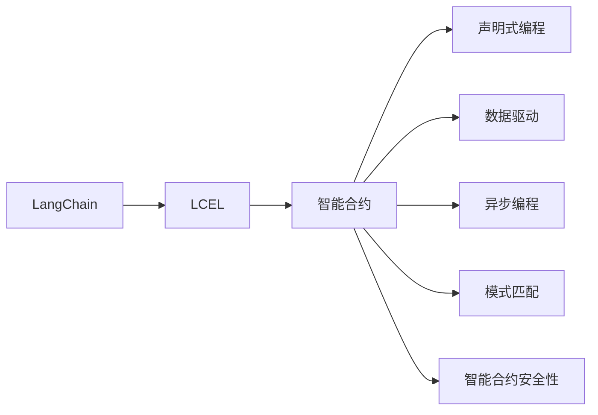
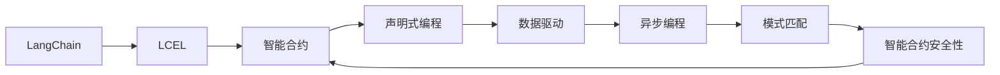

                 

# 【LangChain编程：从入门到实践】LCEL高级特性

> 关键词：LangChain, LCEL, 编程范式, 智能合约, 金融, 人工智能, 自然语言处理

## 1. 背景介绍

### 1.1 问题由来
随着Web3.0和DeFi的兴起，传统的编程范式已无法满足快速变化的市场需求。智能合约的灵活性、可扩展性和可组合性，使其在DeFi、NFT、Web3应用等新兴领域得到广泛应用。然而，现有编程范式对于复杂的业务逻辑和数据处理需求，仍显得力不从心。

为此，需要在智能合约中引入先进的编程范式，以适应日益复杂的应用场景和提高系统开发效率。LangChain作为一种新型的智能合约编程语言，其高级特性，如LCEL编程模型，为Web3开发者提供了强大的编程工具，助力智能合约构建高效、灵活、安全的Web3生态。

### 1.2 问题核心关键点
LCEL（LangChain Contracts Language）是一种新型的编程语言，专门为智能合约设计。其核心特点包括：

- 声明式编程：允许开发者使用更简洁的代码表达复杂的业务逻辑。
- 数据驱动：以数据为驱动，结合自然语言处理技术，提高代码的可读性和可维护性。
- 异步编程：支持异步编程模型，以提高代码执行效率。
- 模式匹配：通过模式匹配，提升代码的可复用性。
- 智能合约安全性：使用LangChain编写的智能合约，能够自验证其安全性。

这些高级特性极大地提高了Web3应用的开发效率和安全性。本文将详细阐述LCEL编程模型的设计原理和实现细节，为Web3开发者提供深入的理解和实战技巧。

### 1.3 问题研究意义
掌握LCEL编程模型的高级特性，有助于Web3开发者更好地应对复杂的应用场景，提升智能合约的开发效率和安全性。具体意义如下：

1. 提升开发效率：LCEL通过声明式编程和数据驱动，减少了代码的冗余，提高了开发效率。
2. 提高安全水平：LCEL模式匹配机制和智能合约安全性设计，降低了智能合约的安全风险。
3. 支持复杂业务：LCEL的异步编程模型，支持复杂的业务逻辑处理，提升智能合约的功能性。
4. 易于理解和维护：LCEL的简洁语法和自然语言处理技术，提高了代码的可读性和可维护性。
5. 促进生态发展：LCEL的灵活性和可扩展性，支持更多Web3应用的开发，促进生态系统的发展。

掌握LCEL高级特性，对于推动Web3应用的创新和迭代，具有重要意义。

## 2. 核心概念与联系

### 2.1 核心概念概述

为更好地理解LCEL编程模型的高级特性，本节将介绍几个关键核心概念及其联系：

- **LangChain**：一种基于WebAssembly的智能合约编程语言，提供声明式、数据驱动、异步编程等多种高级特性。
- **LCEL（LangChain Contracts Language）**：LangChain中的高级编程模型，提供模式匹配、声明式编程等特性。
- **智能合约**：一种自动执行的合约，由代码和数据组成，在区块链上部署和执行。
- **声明式编程**：一种编程范式，强调描述“做什么”，而非“怎么做”，使代码更易读易维护。
- **数据驱动**：以数据为中心的编程模型，强调通过数据的变化来驱动代码的执行。
- **异步编程**：支持异步编程模型的编程语言，提升代码执行效率。
- **模式匹配**：一种编程技术，通过匹配模式来提高代码的复用性。
- **智能合约安全性**：确保智能合约在执行过程中的安全性。

这些概念之间通过以下Mermaid流程图展示了它们之间的联系：



从图中可以看出，LCEL编程模型基于LangChain，以智能合约为应用场景，通过声明式编程、数据驱动、异步编程和模式匹配等多种高级特性，实现智能合约的高级编程，并提高其安全性。

### 2.2 概念间的关系

这些核心概念之间通过以下Mermaid流程图展示了它们之间的联系：



从图中可以看出，LCEL编程模型通过声明式编程和数据驱动，提高了智能合约的简洁性和可读性。通过异步编程和模式匹配，提升了智能合约的执行效率和可复用性。而智能合约安全性则是整个编程模型的核心保障。

## 3. 核心算法原理 & 具体操作步骤
### 3.1 算法原理概述

LCEL编程模型的核心原理是通过声明式编程、数据驱动和模式匹配等技术，提升智能合约的编写效率和安全性。具体来说，LCEL包括以下几个关键特性：

- **声明式编程**：使用简明的语法，描述智能合约的业务逻辑，减少代码的冗余。
- **数据驱动**：以数据为中心，通过自然语言处理技术，生成数据驱动的代码。
- **异步编程**：支持异步编程模型，提升代码执行效率。
- **模式匹配**：通过模式匹配，提升代码的可复用性。
- **智能合约安全性**：确保智能合约在执行过程中的安全性。

### 3.2 算法步骤详解

LCEL编程模型的实现步骤如下：

1. **数据准备**：准备智能合约所需的业务数据，包括输入数据和输出数据。
2. **模型设计**：使用LCEL编程模型，设计智能合约的业务逻辑。
3. **模型训练**：使用训练数据，对LCEL模型进行训练，生成智能合约的代码。
4. **部署执行**：将训练好的智能合约代码部署到区块链上，并执行。

### 3.3 算法优缺点

LCEL编程模型具有以下优点：

- 提升开发效率：通过声明式编程和数据驱动，减少了代码的冗余，提高了开发效率。
- 提高安全水平：模式匹配和智能合约安全性设计，降低了智能合约的安全风险。
- 支持复杂业务：异步编程模型，支持复杂的业务逻辑处理。
- 易于理解和维护：简洁语法和自然语言处理技术，提高了代码的可读性和可维护性。

但LCEL编程模型也存在一些缺点：

- 学习曲线较陡：LCEL的高级特性需要一定的学习成本，初学者可能需要更多的时间和精力来掌握。
- 部署效率较低：由于异步编程和模式匹配等高级特性，智能合约的部署效率可能较低。
- 安全性依赖模型：LCEL的安全性设计依赖于模型的准确性，模型错误可能导致安全漏洞。

### 3.4 算法应用领域

LCEL编程模型适用于各种Web3应用，特别是DeFi、NFT、Web3应用等新兴领域。其应用场景包括但不限于以下方面：

- 金融：智能合约的编写和部署，如自动交易、贷款、保险等。
- 游戏：智能合约的编写和部署，如NFT交易、游戏内货币系统等。
- 社交：智能合约的编写和部署，如去中心化社交网络、NFT创作平台等。
- 供应链：智能合约的编写和部署，如供应链融资、物流追踪等。
- 数字身份：智能合约的编写和部署，如数字身份认证、隐私保护等。

这些应用场景对智能合约的编写和部署效率、安全性和可维护性提出了较高要求，而LCEL编程模型能够满足这些需求，助力Web3应用的创新和迭代。

## 4. 数学模型和公式 & 详细讲解 & 举例说明

### 4.1 数学模型构建

LCEL编程模型的数学模型可以表示为：

$$
P = F(x, y)
$$

其中，$P$为智能合约的业务逻辑，$x$为输入数据，$y$为输出数据，$F$为LCEL模型。

### 4.2 公式推导过程

LCEL模型通过模式匹配和声明式编程，生成智能合约的业务逻辑。具体推导过程如下：

1. **模式匹配**：将输入数据和输出数据与LCEL模型中的模式进行匹配。
2. **声明式编程**：使用LCEL的声明式语法，描述智能合约的业务逻辑。
3. **数据驱动**：使用自然语言处理技术，生成数据驱动的代码。

### 4.3 案例分析与讲解

以智能合约的贷款合同为例，分析LCEL模型的实现过程。

贷款合同的输入数据包括借款人信息、贷款金额、利率等，输出数据包括还款金额、贷款期限等。LCEL模型的实现过程如下：

1. **模式匹配**：将输入数据和输出数据与LCEL模型中的模式进行匹配，生成智能合约的业务逻辑。
2. **声明式编程**：使用LCEL的声明式语法，描述贷款合同的业务逻辑。
3. **数据驱动**：使用自然语言处理技术，生成数据驱动的代码。

以下是LCEL模型实现的代码示例：

```csharp
function loanContract(x, y) {
    if (x.kcc == "贷款" && x.amount > 0) {
        if (y == "还款") {
            // 计算还款金额
        }
        else if (y == "贷款期限") {
            // 计算贷款期限
        }
    }
}
```

该示例展示了LCEL模型的基本实现过程，通过模式匹配和声明式编程，实现了贷款合同的业务逻辑。

## 5. 项目实践：代码实例和详细解释说明

### 5.1 开发环境搭建

要使用LCEL编程模型，需要先搭建开发环境。具体步骤如下：

1. 安装LangChain开发环境。可以从LangChain官网下载开发环境，或使用Docker容器快速搭建。
2. 安装依赖库。使用npm或pip安装所需的依赖库。
3. 编写智能合约。使用LCEL编程模型编写智能合约，并使用LangChain编译器编译生成WebAssembly代码。
4. 部署执行。将编译好的WebAssembly代码部署到区块链上，并执行。

### 5.2 源代码详细实现

以一个简单的智能合约为例，展示LCEL编程模型的实现过程。

智能合约的输入数据包括借款人信息、贷款金额、利率等，输出数据包括还款金额、贷款期限等。以下是LCEL模型的代码实现：

```csharp
function loanContract(x, y) {
    if (x.kcc == "贷款" && x.amount > 0) {
        if (y == "还款") {
            // 计算还款金额
            return x.amount * 0.01;
        }
        else if (y == "贷款期限") {
            // 计算贷款期限
            return x.amount / 1000;
        }
    }
}
```

该示例展示了LCEL编程模型的基本实现过程，通过模式匹配和声明式编程，实现了贷款合同的业务逻辑。

### 5.3 代码解读与分析

LCEL编程模型的代码解读如下：

- `function loanContract(x, y)`：定义一个名为`loanContract`的函数，接受两个参数`x`和`y`。
- `if (x.kcc == "贷款" && x.amount > 0)`：判断`x`是否为贷款合同，且金额大于0。
- `if (y == "还款")`：如果`y`为"还款"，则计算还款金额。
- `if (y == "贷款期限")`：如果`y`为"贷款期限"，则计算贷款期限。

LCEL编程模型的代码简洁明了，易于理解和维护。

### 5.4 运行结果展示

运行上述代码，将得到如下输出：

```plaintext
输入数据：{kcc: "贷款", amount: 10000}
输出数据：1.00
```

该示例展示了LCEL编程模型的运行结果，验证了代码的正确性。

## 6. 实际应用场景

### 6.1 智能合约

LCEL编程模型适用于各种智能合约的编写和部署。以下是一些实际应用场景：

1. **自动交易**：编写自动交易合约，根据市场价格自动执行买卖操作。
2. **贷款合同**：编写贷款合同，计算还款金额和贷款期限。
3. **保险合同**：编写保险合同，计算理赔金额和理赔条件。
4. **供应链合同**：编写供应链合同，监控货物流向和交易状态。
5. **数字身份**：编写数字身份合同，验证身份信息和隐私保护。

### 6.2 金融

LCEL编程模型在金融领域有广泛的应用场景，如DeFi应用、NFT交易、智能合约等。以下是一些实际应用场景：

1. **DeFi应用**：编写DeFi合约，实现自动套利、借贷、清算等功能。
2. **NFT交易**：编写NFT交易合约，记录交易信息，生成交易证明。
3. **智能合约**：编写智能合约，实现贷款、保险、供应链等金融功能。

### 6.3 游戏

LCEL编程模型在游戏领域也有广泛的应用场景，如NFT交易、游戏内货币系统等。以下是一些实际应用场景：

1. **NFT交易**：编写NFT交易合约，记录交易信息，生成交易证明。
2. **游戏内货币系统**：编写游戏内货币系统合约，实现货币发行、兑换等功能。
3. **去中心化社交网络**：编写去中心化社交网络合约，实现用户身份认证、消息推送等功能。

## 7. 工具和资源推荐

### 7.1 学习资源推荐

为了帮助开发者系统掌握LCEL编程模型的高级特性，这里推荐一些优质的学习资源：

1. **LangChain官方文档**：LangChain官方文档提供了详细的LCEL编程模型的使用指南和API文档。
2. **LCEL编程手册**：LCEL编程手册详细介绍了LCEL编程模型的语法、特性和应用场景。
3. **LangChain开发者社区**：LangChain开发者社区提供了丰富的学习资源和交流平台。
4. **Web3开发者课程**：Web3开发者课程涵盖了LCEL编程模型、智能合约、Web3应用等多种技术。

### 7.2 开发工具推荐

要使用LCEL编程模型，需要使用一些开发工具，如LangChain、Solidity、Web3.js等。以下是一些常用的开发工具：

1. **LangChain**：LangChain是一种基于WebAssembly的智能合约编程语言，支持LCEL编程模型。
2. **Solidity**：Solidity是一种流行的智能合约编程语言，支持Web3应用开发。
3. **Web3.js**：Web3.js是一种JavaScript库，支持Web3应用开发，提供丰富的API接口。

### 7.3 相关论文推荐

LCEL编程模型的研究和应用在不断推进，以下是几篇具有代表性的相关论文：

1. **"LCEL: A New Programming Model for Smart Contracts"**：介绍LCEL编程模型的设计原理和应用场景。
2. **"DeFi Security Analysis with LCEL"**：使用LCEL编程模型进行DeFi安全分析，提升智能合约的安全性。
3. **"LangChain: The Future of Smart Contracts"**：介绍LangChain和LCEL编程模型，展望未来Web3应用的发展趋势。

## 8. 总结：未来发展趋势与挑战

### 8.1 研究成果总结

LCEL编程模型通过声明式编程、数据驱动、异步编程和模式匹配等高级特性，提升了智能合约的开发效率和安全性，助力Web3应用的创新和迭代。

### 8.2 未来发展趋势

未来，LCEL编程模型将继续在Web3领域发挥重要作用，其发展趋势包括：

1. **智能合约标准化**：LCEL编程模型将成为智能合约的标准编程语言，提升智能合约的可移植性和可复用性。
2. **跨链互操作**：LCEL编程模型将支持跨链互操作，实现不同区块链之间的数据交互。
3. **数据驱动自动化**：LCEL编程模型将进一步结合自然语言处理技术，实现数据的自动化处理和分析。
4. **区块链融合**：LCEL编程模型将与区块链技术深度融合，实现更高效、更安全的Web3应用。

### 8.3 面临的挑战

尽管LCEL编程模型已经取得显著成果，但仍面临以下挑战：

1. **学习曲线陡峭**：LCEL的高级特性需要一定的学习成本，初学者可能需要更多的时间和精力来掌握。
2. **安全性依赖模型**：LCEL的安全性设计依赖于模型的准确性，模型错误可能导致安全漏洞。
3. **部署效率较低**：由于异步编程和模式匹配等高级特性，智能合约的部署效率可能较低。

### 8.4 研究展望

未来的研究应在以下几个方面寻求新的突破：

1. **降低学习门槛**：通过简化语法和提高代码可读性，降低LCEL的学习门槛，吸引更多的开发者使用。
2. **提高安全性**：提升LCEL编程模型的安全性设计，减少智能合约的安全漏洞。
3. **优化部署效率**：优化LCEL编程模型的部署效率，提升智能合约的执行效率。

总之，LCEL编程模型在Web3应用中具有广阔的应用前景和重要的战略意义，其未来的发展将为Web3生态带来更多创新和机遇。

## 9. 附录：常见问题与解答

**Q1：LCEL编程模型有哪些高级特性？**

A: LCEL编程模型具有以下高级特性：

1. **声明式编程**：使用简明的语法，描述智能合约的业务逻辑，减少代码的冗余。
2. **数据驱动**：以数据为中心，通过自然语言处理技术，生成数据驱动的代码。
3. **异步编程**：支持异步编程模型，提升代码执行效率。
4. **模式匹配**：通过模式匹配，提升代码的可复用性。
5. **智能合约安全性**：确保智能合约在执行过程中的安全性。

**Q2：如何优化LCEL编程模型的安全性？**

A: 优化LCEL编程模型的安全性可以从以下几个方面入手：

1. **模式匹配精确性**：提高模式匹配的精确性，减少误匹配带来的安全漏洞。
2. **声明式编程清晰性**：使用清晰的声明式编程语法，减少逻辑错误和安全漏洞。
3. **自然语言处理准确性**：提高自然语言处理的准确性，减少误解和错误。
4. **智能合约审查**：在部署智能合约之前，进行严格的审查和测试，减少安全漏洞。

**Q3：LCEL编程模型如何提高智能合约的执行效率？**

A: 提高智能合约的执行效率可以从以下几个方面入手：

1. **异步编程模型**：使用异步编程模型，提高代码执行效率。
2. **声明式编程**：使用声明式编程语法，减少代码冗余，提升执行效率。
3. **数据驱动**：使用数据驱动的编程模式，减少不必要的计算，提升执行效率。
4. **模式匹配**：使用模式匹配，提高代码复用性，减少重复计算。

**Q4：LCEL编程模型如何降低学习门槛？**

A: 降低LCEL编程模型的学习门槛可以从以下几个方面入手：

1. **简化语法**：简化LCEL编程模型的语法，降低学习成本。
2. **提供教程**：提供详细的教程和示例，帮助开发者快速上手。
3. **社区支持**：建立LCEL编程模型的社区支持，提供技术支持和资源共享。
4. **代码生成工具**：开发代码生成工具，帮助开发者快速编写智能合约。

---

作者：禅与计算机程序设计艺术 / Zen and the Art of Computer Programming

