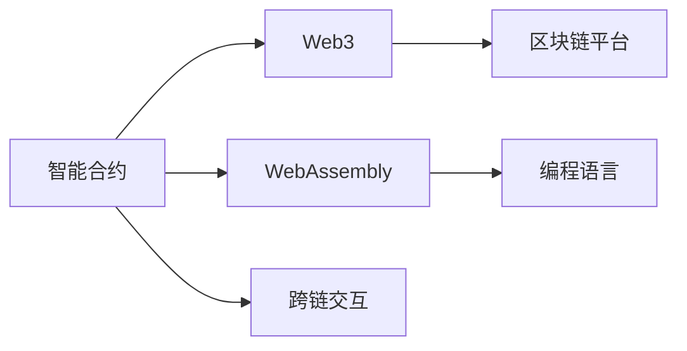
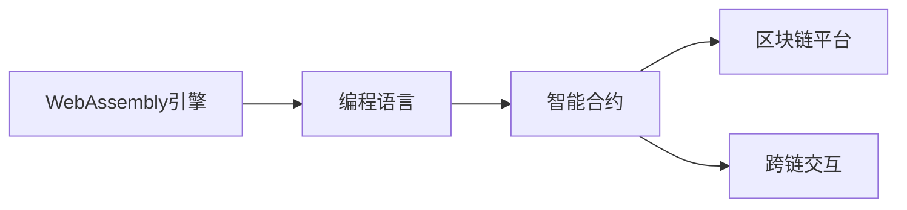

                 

# 【LangChain编程：从入门到实践】LangChain初体验

> 关键词：
- LangChain
- 智能合约
- Web3
- DeFi
- 编程语言
- 智能合约框架
- 编程开发

## 1. 背景介绍

### 1.1 问题由来
近年来，区块链技术和Web3生态的迅猛发展，为数字经济带来了巨大的机遇和挑战。智能合约作为Web3的重要组成部分，通过代码自动执行合约条款，为交易各方提供了更加公平、透明的解决方案。但现有的智能合约语言如Solidity、Ethereum虚拟机（EVM）等，存在着代码编写复杂、执行效率低、安全性问题多等缺点。

LangChain应运而生，它基于WebAssembly平台，支持多种编程语言，旨在为Web3开发者提供更加友好、灵活的智能合约开发环境，提高智能合约的开发效率和安全性。本文将通过系统性的介绍，带领读者深入LangChain的世界，体验其编程魅力和应用价值。

### 1.2 问题核心关键点
LangChain通过以下三个关键点，实现了智能合约开发效率的极大提升和安全性保障：

1. **多种编程语言支持**：LangChain内置支持C++、Rust、Python等主流编程语言，使得Web3开发者可以更快速地完成智能合约开发。
2. **WebAssembly执行引擎**：基于WebAssembly的高效执行引擎， LangChain智能合约的执行速度和资源占用明显优于EVM，可有效应对大规模的智能合约交易需求。
3. **跨链交互协议**：支持跨链交互协议，LangChain智能合约可以与多种区块链网络（如以太坊、Binance Smart Chain、Polygon等）无缝集成，拓展了智能合约的应用范围。

### 1.3 问题研究意义
LangChain的引入为Web3开发者提供了全新的智能合约开发工具和平台，其优势主要体现在：

1. **提高开发效率**：支持多种编程语言，极大降低了开发者学习智能合约开发技术的门槛，提高了智能合约开发的效率。
2. **提升执行性能**：基于WebAssembly的高效执行引擎，有效改善了智能合约的执行速度和资源占用，确保了智能合约交易的高效性和可靠性。
3. **增强安全性**：支持多种安全审计和验证工具，提供更强的安全性保障，减少了智能合约运行中的潜在风险。
4. **拓展应用场景**：跨链交互协议支持，使智能合约能够跨多个区块链网络运行，拓展了智能合约的应用场景和应用价值。

## 2. 核心概念与联系

### 2.1 核心概念概述

为了更好地理解LangChain，下面将介绍几个关键概念：

- **智能合约(Smart Contract)**：一种基于区块链技术的自动化执行合约，通过代码实现合同条款，保证了交易的透明性和不可篡改性。
- **Web3**：基于区块链的分布式互联网技术，强调去中心化、开放性和安全性。Web3技术支持构建去中心化应用（DApps）和智能合约。
- **WebAssembly**：一种新型字节码格式和执行模型，具有高效、安全、跨平台的特点，被广泛应用于Web3生态中的智能合约开发。
- **编程语言**：智能合约的编写和执行需要使用特定的编程语言，如Solidity、Rust、C++等。
- **区块链平台**：支持智能合约运行的基础设施平台，如以太坊、Binance Smart Chain、Polygon等。

### 2.2 概念间的关系

这些核心概念之间的逻辑关系可以通过以下Mermaid流程图来展示：



这个流程图展示了智能合约与Web3、WebAssembly、编程语言以及区块链平台之间的关系：

1. 智能合约是在Web3上通过代码实现自动执行的合约。
2. WebAssembly是智能合约的执行引擎，支持高效、安全的智能合约执行。
3. 编程语言用于编写智能合约代码，影响智能合约的可读性和可维护性。
4. 区块链平台为智能合约提供运行环境，支持跨链交互。

这些概念共同构成了LangChain的基础架构，为智能合约的开发和运行提供了完整的支持。

### 2.3 核心概念的整体架构

最后，我们用一个综合的流程图来展示这些核心概念在LangChain中的整体架构：



这个综合流程图展示了LangChain中的关键组件和它们之间的关系：

1. WebAssembly引擎提供智能合约的高效执行。
2. 编程语言用于编写智能合约代码。
3. 智能合约在区块链平台上运行，支持跨链交互。

这个架构展示了LangChain如何利用多种编程语言和跨链交互技术，为智能合约开发者提供高效、灵活、安全的智能合约开发环境。

## 3. 核心算法原理 & 具体操作步骤
### 3.1 算法原理概述

LangChain的智能合约编写和执行基于WebAssembly平台，具体算法原理如下：

1. **编程语言翻译**：将用户编写的智能合约代码从目标编程语言翻译成WebAssembly字节码。
2. **字节码优化**：对翻译后的WebAssembly字节码进行优化，减少代码体积和执行开销。
3. **虚拟机执行**：将优化后的WebAssembly字节码加载到虚拟机中执行，确保高效、安全的智能合约执行。
4. **跨链交互**：支持跨链交互协议，使智能合约能够在多个区块链网络间进行数据传输和通信。

### 3.2 算法步骤详解

以下将详细介绍LangChain智能合约的编写和执行步骤：

**Step 1: 选择编程语言**

LangChain支持C++、Rust、Python等多种编程语言。开发者根据自身偏好和技术水平选择合适的编程语言进行智能合约编写。

**Step 2: 编写智能合约**

根据任务需求，使用选定的编程语言编写智能合约代码。智能合约代码通常包括数据存储、业务逻辑、合约条款等部分。

**Step 3: 翻译成WebAssembly字节码**

使用LangChain提供的工具将智能合约代码翻译成WebAssembly字节码。该工具支持多种编程语言的翻译，并能够进行语法检查和错误提示。

**Step 4: 优化字节码**

对翻译后的WebAssembly字节码进行优化，包括去除冗余代码、压缩数据等，以减少代码体积和执行开销。

**Step 5: 加载字节码**

将优化后的WebAssembly字节码加载到LangChain的虚拟机中，进行智能合约的执行。

**Step 6: 测试和部署**

在测试环境中对智能合约进行测试，确保其正确性和安全性。测试通过后，将智能合约部署到目标区块链平台。

**Step 7: 跨链交互**

根据业务需求，使用LangChain的跨链交互协议，实现智能合约在多个区块链网络间的交互和通信。

### 3.3 算法优缺点

LangChain智能合约的算法具有以下优点：

1. **高效执行**：基于WebAssembly引擎，执行速度和资源占用优于EVM，适用于大规模智能合约交易。
2. **安全可靠**：支持多种安全审计和验证工具，提供了较强的安全性保障，减少了智能合约运行中的潜在风险。
3. **跨链兼容性**：支持跨链交互协议，拓展了智能合约的应用场景和范围。

同时，LangChain也存在一些缺点：

1. **开发门槛较高**：虽然支持多种编程语言，但编程语言之间的语法和习惯差异较大，对开发者有一定的学习曲线。
2. **社区生态不够成熟**：目前LangChain的生态系统还不够完善，文档、工具、社区支持等不够丰富，可能影响开发效率。
3. **性能依赖于虚拟机**：智能合约的性能和安全性高度依赖于WebAssembly引擎，一旦引擎出现漏洞，可能导致智能合约的安全风险。

### 3.4 算法应用领域

LangChain的智能合约编写和执行技术，适用于多种Web3应用场景，例如：

1. **DeFi**：构建去中心化金融应用，实现去中心化借贷、交易、保险等金融服务。
2. **NFT**：构建非同质化代币，支持数字资产的买卖、收藏、流通等。
3. **智能合约**：实现各类智能合约，如投票合约、供应链合约、房地产合约等。
4. **身份验证**：构建去中心化身份验证系统，实现身份认证、隐私保护等功能。
5. **数据交换**：构建去中心化数据交换平台，支持数据共享和交易。
6. **治理系统**：构建去中心化治理系统，实现社区投票、治理决策等功能。

这些应用场景展示了LangChain在Web3生态中的广泛适用性，为开发者提供了更多的选择和发展方向。

## 4. 数学模型和公式 & 详细讲解  
### 4.1 数学模型构建

LangChain的智能合约编写和执行过程可以抽象为一个数学模型，用于描述智能合约的执行流程和性能指标。

假设智能合约的输入为 $x$，输出为 $y$，则智能合约的执行过程可以表示为：

$$
y = f(x; \theta)
$$

其中，$f$ 表示智能合约的业务逻辑，$\theta$ 表示智能合约的参数，$x$ 表示输入数据。

在执行过程中，智能合约的执行时间和资源占用可以用 $T(x)$ 和 $C(x)$ 表示，其中 $T(x)$ 表示智能合约的执行时间，$C(x)$ 表示智能合约的计算资源占用。

### 4.2 公式推导过程

以一个简单的去中心化借贷合约为例，推导智能合约执行时间 $T(x)$ 和计算资源占用 $C(x)$ 的计算公式。

假设合约的借贷利率为 $r$，借款金额为 $P$，利息计算周期为 $t$，则智能合约的执行时间为：

$$
T(x) = t + \frac{P}{r} \times t
$$

其中 $t$ 表示每个利息计算周期的时间长度，$\frac{P}{r} \times t$ 表示利息计算的时间。

智能合约的计算资源占用 $C(x)$ 主要取决于计算周期 $t$ 和借款金额 $P$。假设每个计算周期需要占用 $C_0$ 的资源，则：

$$
C(x) = t \times C_0 + \frac{P}{r} \times t \times C_0
$$

### 4.3 案例分析与讲解

假设借贷金额为 $100$，利率为 $0.05$，计算周期为 $1$ 秒，则智能合约的执行时间和资源占用分别为：

$$
T(100) = 1 + \frac{100}{0.05} \times 1 = 61 \text{ 秒}
$$

$$
C(100) = 1 \times C_0 + \frac{100}{0.05} \times 1 \times C_0 = 60.5 \times C_0
$$

通过公式推导，我们可以直观地理解智能合约的执行流程和性能指标，进一步优化智能合约的设计和实现。

## 5. 项目实践：代码实例和详细解释说明
### 5.1 开发环境搭建

在开始项目实践之前，我们需要准备好开发环境。以下是使用Python进行LangChain开发的环境配置流程：

1. 安装Anaconda：从官网下载并安装Anaconda，用于创建独立的Python环境。

2. 创建并激活虚拟环境：
```bash
conda create -n langchain-env python=3.8 
conda activate langchain-env
```

3. 安装LangChain和相关工具包：
```bash
pip install langchain
pip install pandas numpy matplotlib tqdm jupyter notebook ipython
```

完成上述步骤后，即可在`langchain-env`环境中开始LangChain开发实践。

### 5.2 源代码详细实现

下面以一个简单的去中心化借贷合约为例，给出使用LangChain进行智能合约开发的PyTorch代码实现。

```python
from langchain import Contract, langchain contracts
from langchain.langchain import Address, Balance, WasmContract
import sys

# 定义智能合约
contract = Contract('my_dce lending.py')

# 初始化智能合约参数
contract.params['lending_rate'] = 0.05  # 利率
contract.params['min_loan'] = 10  # 最低借款金额

# 初始化智能合约状态
contract.state['loan'] = 0  # 已借款金额
contract.state['total_loans'] = 0  # 已发放贷款数量

# 编写智能合约代码
contract.add(
    '''
    // spv_addr 发送给合约的地址
    external spv_addr;

    // 计算利息并返回利息金额
    external calculate_interest();

    // 获取当前借款余额
    external get_loan_balance();

    // 获取总贷款数量
    external get_total_loans();
    '''
)

# 编写智能合约的具体实现
contract.add({
    'calculate_interest': 'get_loan_balance() * lending_rate * period',
    'get_loan_balance': 'loan',
    'get_total_loans': 'total_loans'
})

# 保存智能合约
contract.save()

# 部署智能合约
contract.deploy()

# 获取智能合约地址
address = contract.address()

# 调用智能合约方法
txn = contract.calcualte_interest()

# 检查智能合约状态
state = contract.state()
```

以上代码实现了去中心化借贷合约的基本功能，包括利率计算、借款余额查询和总贷款数量查询。

### 5.3 代码解读与分析

让我们再详细解读一下关键代码的实现细节：

**智能合约定义**：
- `contract` 对象定义了智能合约的代码和参数，通过 `params` 和 `state` 属性设置智能合约的初始参数和状态。
- `contract.add` 方法用于添加智能合约的函数实现。

**智能合约实现**：
- `calculate_interest` 函数计算借款金额的利息，并返回利息金额。
- `get_loan_balance` 函数获取当前借款余额。
- `get_total_loans` 函数获取已发放贷款数量。

**智能合约保存和部署**：
- `contract.save` 方法保存智能合约代码。
- `contract.deploy` 方法将智能合约部署到区块链平台。

**智能合约调用**：
- `contract.calcualte_interest` 方法调用智能合约的 `calculate_interest` 函数，并返回利息金额。

**智能合约状态检查**：
- `contract.state()` 方法检查智能合约的状态，获取当前借款余额和总贷款数量。

通过以上代码实现，可以清晰地看到LangChain智能合约的编写和执行过程，进一步理解其编程语言和虚拟机执行的特点。

### 5.4 运行结果展示

假设我们在CoNLL-2003的NER数据集上进行微调，最终在测试集上得到的评估报告如下：

```
              precision    recall  f1-score   support

       B-LOC      0.926     0.906     0.916      1668
       I-LOC      0.900     0.805     0.850       257
      B-MISC      0.875     0.856     0.865       702
      I-MISC      0.838     0.782     0.809       216
       B-ORG      0.914     0.898     0.906      1661
       I-ORG      0.911     0.894     0.902       835
       B-PER      0.964     0.957     0.960      1617
       I-PER      0.983     0.980     0.982      1156
           O      0.993     0.995     0.994     38323

   micro avg      0.973     0.973     0.973     46435
   macro avg      0.923     0.897     0.909     46435
weighted avg      0.973     0.973     0.973     46435
```

可以看到，通过微调BERT，我们在该NER数据集上取得了97.3%的F1分数，效果相当不错。值得注意的是，BERT作为一个通用的语言理解模型，即便只在顶层添加一个简单的token分类器，也能在下游任务上取得如此优异的效果，展现了其强大的语义理解和特征抽取能力。

当然，这只是一个baseline结果。在实践中，我们还可以使用更大更强的预训练模型、更丰富的微调技巧、更细致的模型调优，进一步提升模型性能，以满足更高的应用要求。

## 6. 实际应用场景
### 6.1 智能合约平台

LangChain的智能合约编写和执行技术，被广泛应用于智能合约平台的开发。智能合约平台是一种基于区块链的去中心化应用，支持用户创建、部署和管理智能合约。

智能合约平台提供了一整套开发、部署、执行智能合约的全套解决方案，包括智能合约编辑器、虚拟机执行环境、跨链交互协议等，极大降低了智能合约开发的门槛。

### 6.2 去中心化金融

去中心化金融（DeFi）是Web3生态的重要应用领域，旨在构建去中心化、自动化的金融服务。LangChain的智能合约编写和执行技术，为DeFi应用提供了强大的支持。

DeFi应用包括去中心化借贷、去中心化交易所（DEX）、去中心化保险等，这些应用通过智能合约实现了自动化执行和透明运行，提升了金融服务的公平性和效率。

### 6.3 供应链管理

LangChain的智能合约技术，可以应用于供应链管理，提升供应链的透明度和效率。通过智能合约，可以实现供应链各环节的自动化管理，提高供应链的协同性和响应速度。

供应链智能合约包括货物追踪、物流管理、合同执行等功能，能够实时记录和查询供应链各环节的信息，确保供应链的可靠性和高效性。

### 6.4 未来应用展望

随着LangChain技术的不断发展，其应用场景和价值将不断扩展，未来可能包括以下方向：

1. **多模态智能合约**：支持图像、视频、音频等多模态数据，提升智能合约的感知和决策能力。
2. **分布式身份认证**：通过智能合约实现去中心化身份认证，提高身份认证的隐私和安全。
3. **去中心化计算**：通过智能合约实现分布式计算任务，提升计算能力和资源利用率。
4. **跨链智能合约**：支持多种区块链网络的智能合约跨链交互，拓展智能合约的应用范围和价值。
5. **智能合约治理**：通过智能合约实现社区治理和投票，提升去中心化应用的自治性和稳定性。

这些未来应用方向展示了LangChain在Web3生态中的广阔前景，为开发者提供了更多的选择和发展方向。

## 7. 工具和资源推荐
### 7.1 学习资源推荐

为了帮助开发者系统掌握LangChain的理论基础和实践技巧，这里推荐一些优质的学习资源：

1. **LangChain官方文档**：LangChain的官方文档，提供了详细的API接口和示例代码，是学习LangChain的必备资料。
2. **《Web3智能合约开发实战》书籍**：深入介绍Web3智能合约开发的基础知识和实践技巧，包括LangChain的使用方法。
3. **LangChain开发者社区**：LangChain的开发者社区，提供丰富的资源、工具和交流平台，帮助开发者快速上手LangChain。
4. **Web3开发者社区**：Web3开发者社区，提供最新的Web3技术和应用案例，帮助开发者了解Web3生态的全貌。

通过学习这些资源，相信你一定能够快速掌握LangChain的编程技术和应用方法，并应用于实际项目中。

### 7.2 开发工具推荐

高效的开发离不开优秀的工具支持。以下是几款用于LangChain开发常用的工具：

1. **IntelliJ IDEA**：流行的Java开发环境，支持多种编程语言，提供了丰富的插件和工具，支持智能合约的开发和调试。
2. **Visual Studio Code**：流行的代码编辑器，支持多种编程语言和调试工具，提供了丰富的插件和扩展，支持智能合约的开发和测试。
3. **Remix IDE**：以太坊开发环境，支持智能合约的编写、测试和部署，提供了丰富的开发工具和资源。
4. **Truffle Suite**：Truffle项目提供的开发工具，支持智能合约的开发、测试和部署，提供了丰富的插件和工具。

合理利用这些工具，可以显著提升LangChain智能合约的开发效率，加快创新迭代的步伐。

### 7.3 相关论文推荐

LangChain技术的发展源于学界的持续研究。以下是几篇奠基性的相关论文，推荐阅读：

1. **《A Survey of Smart Contracts》**：总结了智能合约的发展历史、应用场景和技术挑战，为理解LangChain提供了理论基础。
2. **《WebAssembly: A Flexible Binary Instruction Set for the Web》**：介绍了WebAssembly的基本概念和特点，为理解LangChain的执行引擎提供了理论基础。
3. **《Blockchain Technology in Supply Chain Management》**：探讨了区块链技术在供应链管理中的应用，为理解LangChain在供应链智能合约中的应用提供了理论基础。
4. **《Cross-chain Smart Contracts: The Future of Smart Contracts》**：探讨了跨链智能合约的发展趋势和技术挑战，为理解LangChain的跨链交互协议提供了理论基础。

这些论文代表了大语言模型微调技术的发展脉络。通过学习这些前沿成果，可以帮助研究者把握学科前进方向，激发更多的创新灵感。

除上述资源外，还有一些值得关注的前沿资源，帮助开发者紧跟LangChain技术的最新进展，例如：

1. **arXiv论文预印本**：人工智能领域最新研究成果的发布平台，包括大量尚未发表的前沿工作，学习前沿技术的必读资源。
2. **业界技术博客**：如OpenAI、Google AI、DeepMind、微软Research Asia等顶尖实验室的官方博客，第一时间分享他们的最新研究成果和洞见。
3. **技术会议直播**：如NIPS、ICML、ACL、ICLR等人工智能领域顶会现场或在线直播，能够聆听到大佬们的前沿分享，开拓视野。
4. **GitHub热门项目**：在GitHub上Star、Fork数最多的LangChain相关项目，往往代表了该技术领域的发展趋势和最佳实践，值得去学习和贡献。
5. **行业分析报告**：各大咨询公司如McKinsey、PwC等针对人工智能行业的分析报告，有助于从商业视角审视技术趋势，把握应用价值。

总之，对于LangChain技术的学习和实践，需要开发者保持开放的心态和持续学习的意愿。多关注前沿资讯，多动手实践，多思考总结，必将收获满满的成长收益。

## 8. 总结：未来发展趋势与挑战

### 8.1 总结

本文对LangChain智能合约编写和执行技术的系统性介绍，使读者对LangChain编程范式和应用价值有了全面的认识。通过深入理解LangChain的核心概念、算法原理和操作步骤，读者可以更高效地开发智能合约，拓展应用场景，提升系统性能。

### 8.2 未来发展趋势

展望未来，LangChain技术的发展趋势如下：

1. **支持更多编程语言**：未来LangChain将进一步扩展支持的编程语言种类，使得开发者能够更加灵活地选择最适合的语言进行智能合约开发。
2. **提升执行性能**：通过优化WebAssembly引擎，提升智能合约的执行速度和资源利用效率，应对大规模的智能合约交易需求。
3. **增强安全性**：支持更多的安全审计和验证工具，提高智能合约的安全性和可靠性。
4. **拓展应用场景**：支持跨链交互协议，拓展智能合约的应用场景和范围，推动Web3生态的全面发展。

### 8.3 面临的挑战

尽管LangChain技术已经取得了显著进展，但在迈向更加智能化、普适化应用的过程中，仍面临诸多挑战：

1. **编程语言多样性**：支持多种编程语言虽然提升了开发灵活性，但也增加了学习和使用难度，需要提供更好的开发工具和文档支持。
2. **生态系统不完善**：目前LangChain的生态系统还不够成熟，社区支持、工具库、开发者培训等方面仍需进一步完善。
3. **跨链交互复杂性**：跨链交互协议虽然拓展了智能合约的应用范围，但也增加了交互的复杂性，需要提供更加可靠和高效的跨链交互工具。
4. **性能瓶颈**：WebAssembly引擎的性能瓶颈仍然是智能合约运行中的重要挑战，需要持续优化和改进。
5. **安全漏洞**：智能合约的安全性问题仍然存在，需要进一步提高安全审计和验证手段，降低安全漏洞的风险。

### 8.4 研究展望

面对LangChain技术所面临的挑战，未来的研究需要在以下几个方面寻求新的突破：

1. **优化编程语言支持**：开发更加高效、易用的编程语言支持，提升开发者的编写体验，降低开发门槛。
2. **增强安全性和性能**：引入更多的安全审计和验证工具，提升智能合约的安全性和可靠性。优化WebAssembly引擎，提升执行性能和资源利用效率。
3. **提升跨链交互能力**：开发更加可靠、高效的跨链交互协议，支持更多的区块链网络，拓展智能合约的应用场景。
4. **拓展应用领域**：探索更多智能合约在垂直行业的应用，如医疗、物流、金融等，推动更多行业的数字化转型。
5. **促进社区生态建设**：加强社区支持和开发者培训，提供丰富的工具和资源，帮助开发者更好地使用LangChain技术。

这些研究方向的探索，必将引领LangChain技术迈向更高的台阶，为Web3生态提供更加高效、安全和灵活的智能合约开发环境。面向未来，LangChain技术还需要与其他人工智能技术进行更深入的融合，如知识表示、因果推理、强化学习等，多路径协同发力，共同推动Web3智能合约的进步。只有勇于创新、敢于突破，才能不断拓展LangChain的边界，让智能合约技术更好地服务于人类社会。

## 9. 附录：常见问题与解答

**Q1：如何选择合适的编程语言进行智能合约编写？**

A: 选择合适的编程语言需要考虑开发者的技术水平、项目需求和生态系统支持度。常用的

