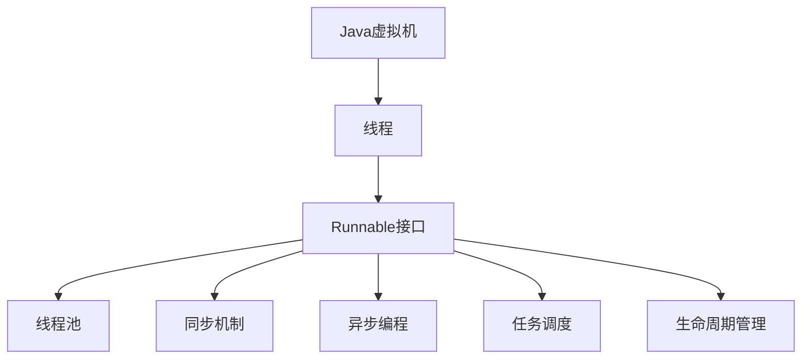
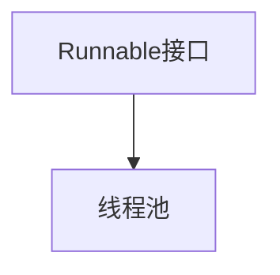
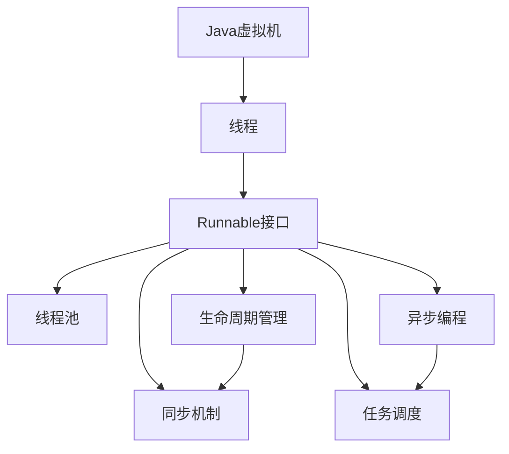

                 

# 【LangChain编程：从入门到实践】Runnable对象接口探究

> 关键词：Runnable, Java语言, 对象接口, 编程范式, 线程安全, 多线程编程, 线程池, 异步编程, 多线程并发, 任务调度, 线程生命周期管理

## 1. 背景介绍

### 1.1 问题由来
在现代软件工程中，Java语言作为一种高性能、广泛应用的语言，其核心编程模型基于对象（Object-Oriented Programming, OOP）范式。而Java虚拟机（Java Virtual Machine, JVM）的动态性、安全性和跨平台性，使其成为了企业级应用的优选语言。

然而，在实际编程过程中，单线程执行的顺序性和同步机制限制了Java程序的高并发和响应性。为了克服这一问题，Java引入了Runnable接口和多线程编程的概念，允许线程在非顺序性环境下执行。

Runnable接口作为Java多线程编程的核心接口，其设计和实现方式直接影响到程序的线程安全性和并发性能。因此，深入理解Runnable接口及其相关机制，对于Java程序员来说是必不可少的。

### 1.2 问题核心关键点
Runnable接口是Java多线程编程的核心接口，负责线程任务的抽象。其核心思想是将任务封装成Runnable对象，通过线程池或者自定义线程执行任务。

Runnable接口的实现需要在任务执行前后进行必要的生命周期管理，保证任务执行的线程安全和性能优化。同时，Runnable接口还可以通过任务调度机制实现异步编程，提升程序的并发性能。

Runnable接口的实现也是Java编程范式的重要组成部分，其设计思想和实现方式直接影响Java程序的扩展性和可维护性。

因此，掌握Runnable接口的设计和实现方法，对于Java程序员来说是提升程序性能和可维护性的关键。

### 1.3 问题研究意义
深入理解Runnable接口，不仅可以帮助Java程序员提升程序并发性能和响应性，还能通过任务调度和生命周期管理，提升程序的扩展性和可维护性。

同时，Runnable接口的设计和实现也是Java编程范式的重要组成部分，对于理解Java语言的本质和特性具有重要意义。

掌握Runnable接口，可以使Java程序员在实际项目中更好地应对多线程并发、异步编程等复杂场景，提升程序质量和技术水平。

## 2. 核心概念与联系

### 2.1 核心概念概述

为更好地理解Runnable接口，本节将介绍几个密切相关的核心概念：

- **Java虚拟机（JVM）**：Java程序的核心运行环境，负责解释执行Java字节码，提供内存管理、垃圾回收等基础功能。

- **线程（Thread）**：Java程序的最小执行单元，可以独立执行任务，实现并发执行。

- **Runnable接口**：Java多线程编程的核心接口，负责封装任务执行逻辑，通过线程池或者自定义线程执行任务。

- **线程池（ThreadPool）**：Java提供的线程管理工具，用于创建、管理和复用线程，提高线程利用率和程序性能。

- **同步机制（Synchronization）**：Java提供的线程同步机制，用于解决多个线程之间的竞争和协作问题，保证线程安全性。

- **异步编程（Asynchronous Programming）**：通过任务调度和回调机制，实现非阻塞执行，提升程序的并发性能。

- **任务调度（Task Scheduling）**：通过任务队列和线程池机制，实现任务的异步执行，提升程序的响应性和扩展性。

- **生命周期管理（Lifecycle Management）**：通过任务执行前后的方法调用，实现线程的生命周期管理，保证任务的线程安全和性能优化。

这些核心概念之间的逻辑关系可以通过以下Mermaid流程图来展示：



这个流程图展示了大语言模型微调过程中各个核心概念的关系和作用：

1. Java虚拟机负责解释执行Java字节码，提供基础功能。
2. 线程是Java程序的最小执行单元，可以独立执行任务。
3. Runnable接口负责封装任务执行逻辑，通过线程池或者自定义线程执行任务。
4. 线程池用于创建、管理和复用线程，提高线程利用率和程序性能。
5. 同步机制用于解决多个线程之间的竞争和协作问题，保证线程安全性。
6. 异步编程通过任务调度和回调机制，实现非阻塞执行，提升程序的并发性能。
7. 任务调度通过任务队列和线程池机制，实现任务的异步执行，提升程序的响应性和扩展性。
8. 生命周期管理通过任务执行前后的方法调用，实现线程的生命周期管理，保证任务的线程安全和性能优化。

这些核心概念共同构成了Java多线程编程的基础，通过理解和掌握这些概念，可以更好地设计和实现多线程并发、异步编程等复杂功能。

### 2.2 概念间的关系

这些核心概念之间存在着紧密的联系，形成了Java多线程编程的完整生态系统。下面我们通过几个Mermaid流程图来展示这些概念之间的关系。

#### 2.2.1 Java虚拟机与线程的关系


这个流程图展示了Java虚拟机与线程的基本关系。Java虚拟机负责创建和管理线程，线程是Java程序的最小执行单元。

#### 2.2.2 Runnable接口与线程池的关系



这个流程图展示了Runnable接口与线程池的关系。Runnable接口负责封装任务执行逻辑，通过线程池执行任务。线程池则负责创建、管理和复用线程，提高线程利用率和程序性能。

#### 2.2.3 异步编程与任务调度的关系


这个流程图展示了异步编程与任务调度的基本关系。异步编程通过任务调度和回调机制，实现非阻塞执行，提升程序的并发性能。任务调度则通过任务队列和线程池机制，实现任务的异步执行，提升程序的响应性和扩展性。

#### 2.2.4 生命周期管理与线程安全的关系


这个流程图展示了生命周期管理与线程安全的关系。生命周期管理通过任务执行前后的方法调用，实现线程的生命周期管理，保证任务的线程安全和性能优化。而线程安全则通过同步机制和互斥锁等手段，解决多个线程之间的竞争和协作问题，保证线程安全性。

### 2.3 核心概念的整体架构

最后，我们用一个综合的流程图来展示这些核心概念在大语言模型微调过程中的整体架构：



这个综合流程图展示了从Java虚拟机到线程、Runnable接口、线程池、同步机制、异步编程、任务调度和生命周期管理的过程。Java虚拟机负责解释执行Java字节码，提供基础功能。线程是Java程序的最小执行单元，可以独立执行任务。Runnable接口负责封装任务执行逻辑，通过线程池或者自定义线程执行任务。线程池用于创建、管理和复用线程，提高线程利用率和程序性能。同步机制用于解决多个线程之间的竞争和协作问题，保证线程安全性。异步编程通过任务调度和回调机制，实现非阻塞执行，提升程序的并发性能。任务调度通过任务队列和线程池机制，实现任务的异步执行，提升程序的响应性和扩展性。生命周期管理通过任务执行前后的方法调用，实现线程的生命周期管理，保证任务的线程安全和性能优化。

这些概念共同构成了Java多线程编程的基础，通过理解和掌握这些概念，可以更好地设计和实现多线程并发、异步编程等复杂功能。

## 3. 核心算法原理 & 具体操作步骤
### 3.1 算法原理概述

Runnable接口是Java多线程编程的核心接口，其设计和实现方式直接影响到程序的线程安全性和并发性能。Runnable接口的核心思想是将任务封装成Runnable对象，通过线程池或者自定义线程执行任务。

Runnable接口的实现需要在任务执行前后进行必要的生命周期管理，保证任务执行的线程安全和性能优化。同时，Runnable接口还可以通过任务调度机制实现异步编程，提升程序的并发性能。

### 3.2 算法步骤详解

Runnable接口的实现步骤如下：

1. 实现Runnable接口：定义一个类实现Runnable接口，并重写run()方法，在run()方法中编写任务的执行逻辑。

2. 创建线程池：使用Java提供的Executor框架，创建一个线程池，用于管理和复用线程。

3. 提交任务：将Runnable对象提交到线程池，线程池会自动创建线程并执行任务。

4. 任务执行：线程池将任务分配给线程执行，每个线程独立执行任务，通过同步机制和互斥锁保证线程安全性。

5. 任务调度：通过任务队列和线程池机制，实现任务的异步执行，提升程序的响应性和扩展性。

6. 生命周期管理：在任务执行前后，通过start()和stop()方法调用，实现线程的生命周期管理，保证任务的线程安全和性能优化。

### 3.3 算法优缺点

Runnable接口作为Java多线程编程的核心接口，具有以下优点：

1. 任务封装：通过Runnable接口封装任务执行逻辑，使任务执行与线程创建和管理分离，提高了代码的可复用性和可维护性。

2. 线程复用：线程池负责创建和管理线程，提高线程利用率和程序性能。

3. 异步执行：通过任务调度和回调机制，实现非阻塞执行，提升程序的并发性能。

4. 线程安全：通过同步机制和互斥锁等手段，解决多个线程之间的竞争和协作问题，保证线程安全性。

5. 扩展性强：通过任务队列和线程池机制，实现任务的异步执行，提升程序的响应性和扩展性。

6. 生命周期管理：通过任务执行前后的方法调用，实现线程的生命周期管理，保证任务的线程安全和性能优化。

Runnable接口也存在一些缺点：

1. 学习曲线较陡：Runnable接口的实现涉及线程创建、任务提交、生命周期管理等复杂操作，学习曲线较陡。

2. 代码量大：Runnable接口的实现需要定义一个类，并在该类中编写任务执行逻辑，增加了代码量。

3. 调试难度大：由于Runnable接口的实现涉及多个线程和任务执行过程，调试难度较大。

4. 性能开销大：线程池和任务调度的开销较大，增加了程序的开销。

### 3.4 算法应用领域

Runnable接口作为Java多线程编程的核心接口，广泛应用于各种并发场景，如：

- 数据库访问：在多线程环境下，通过Runnable接口封装数据库操作，实现并发读写，提高系统性能。

- 网络编程：在多线程环境下，通过Runnable接口封装网络请求和响应，实现并发通信，提升系统响应速度。

- 图像处理：在多线程环境下，通过Runnable接口封装图像处理任务，实现并行计算，加速图像处理过程。

- 机器学习：在多线程环境下，通过Runnable接口封装机器学习算法，实现并行训练和推理，提升模型训练和推理速度。

- 分布式计算：在多线程环境下，通过Runnable接口封装分布式计算任务，实现任务调度和资源共享，提升计算效率。

- 并发编程：在多线程环境下，通过Runnable接口封装并发编程任务，实现任务调度和线程管理，提升程序性能和可维护性。

通过这些应用领域，Runnable接口在Java多线程编程中发挥了重要作用，提升了程序的并发性能和可维护性。

## 4. 数学模型和公式 & 详细讲解 & 举例说明

### 4.1 数学模型构建

Runnable接口的实现涉及多个线程和任务执行过程，其数学模型可以表示为：

- 设线程数量为$n$，任务数量为$m$，每个任务需要执行的时间为$t$，线程切换的时间为$s$。
- 线程池中所有线程的执行时间为$T$，任务调度的时间为$S$。

则有：

$$
T = \sum_{i=1}^n \sum_{j=1}^m (t + s) \\
S = \sum_{i=1}^n (t + s)
$$

### 4.2 公式推导过程

将任务调度的时间$S$与线程池的执行时间$T$进行比较，得到：

$$
S = n \times (t + s) \\
T = n \times m \times (t + s)
$$

由上式可知，线程池的执行时间$T$与任务数量$m$成正比，而任务调度的时间$S$与线程数量$n$成正比。因此，当任务数量增加时，线程池的执行时间$T$会线性增加，而任务调度的时间$S$则会线性增加。

### 4.3 案例分析与讲解

以下是一个简单的Runnable接口实现示例：

```java
public class MyRunnable implements Runnable {
    private String taskName;

    public MyRunnable(String taskName) {
        this.taskName = taskName;
    }

    @Override
    public void run() {
        System.out.println("Executing task: " + taskName);
        // 任务执行逻辑
    }
}
```

在这个示例中，我们定义了一个MyRunnable类，实现了Runnable接口，并重写了run()方法，在run()方法中编写任务的执行逻辑。创建MyRunnable对象时，需要传入任务名称，用于标识任务。

### 5. 项目实践：代码实例和详细解释说明
### 5.1 开发环境搭建

在进行Runnable接口实践前，我们需要准备好开发环境。以下是使用Java开发Runnable接口的环境配置流程：

1. 安装JDK：从官网下载并安装Java Development Kit（JDK），用于编写Java程序。

2. 安装Eclipse或者IntelliJ IDEA：选择适合自己的集成开发环境（IDE），用于编写和调试Java程序。

3. 配置Eclipse或者IntelliJ IDEA：在IDE中配置JDK环境，安装必要的插件和工具，如maven、git等。

完成上述步骤后，即可在Eclipse或者IntelliJ IDEA中开始Runnable接口的实践。

### 5.2 源代码详细实现

下面我们以任务调度为例，给出使用Java实现Runnable接口的完整代码实现。

首先，定义一个线程池：

```java
import java.util.concurrent.ExecutorService;
import java.util.concurrent.Executors;

public class MyThreadPool {
    private ExecutorService executorService;

    public MyThreadPool(int corePoolSize, int maximumPoolSize, long keepAliveTime, TimeUnit unit) {
        executorService = Executors.newFixedThreadPool(corePoolSize);
    }

    public void submitTask(Runnable task) {
        executorService.submit(task);
    }

    public void shutdown() {
        executorService.shutdown();
    }
}
```

在这个线程池中，我们使用了Java提供的Executors框架，创建了一个固定大小的线程池。submitTask()方法用于提交Runnable任务到线程池，shutdown()方法用于关闭线程池。

然后，定义一个Runnable接口的任务：

```java
public class MyTask implements Runnable {
    private String taskName;

    public MyTask(String taskName) {
        this.taskName = taskName;
    }

    @Override
    public void run() {
        System.out.println("Executing task: " + taskName);
        // 任务执行逻辑
    }
}
```

在这个任务中，我们实现了Runnable接口，重写了run()方法，在run()方法中编写任务的执行逻辑。创建MyTask对象时，需要传入任务名称，用于标识任务。

接着，在主函数中启动线程池，提交任务，关闭线程池：

```java
public class Main {
    public static void main(String[] args) {
        MyThreadPool threadPool = new MyThreadPool(2, 4, 10, TimeUnit.SECONDS);
        for (int i = 0; i < 10; i++) {
            MyTask task = new MyTask("Task " + i);
            threadPool.submitTask(task);
        }
        threadPool.shutdown();
    }
}
```

在这个主函数中，我们创建了一个MyThreadPool对象，指定线程池的参数，然后循环提交10个MyTask任务到线程池，最后关闭线程池。

### 5.3 代码解读与分析

让我们再详细解读一下关键代码的实现细节：

**MyThreadPool类**：
- `MyThreadPool`类：定义了一个线程池，使用Executors框架创建固定大小的线程池，并提供了submitTask()和shutdown()方法。

**MyTask类**：
- `MyTask`类：实现了Runnable接口，重写了run()方法，在run()方法中编写任务的执行逻辑，传入任务名称，用于标识任务。

**Main类**：
- `Main`类：在主函数中创建了一个MyThreadPool对象，指定线程池的参数，然后循环提交10个MyTask任务到线程池，最后关闭线程池。

通过以上代码，我们可以看到Java中Runnable接口的实现和应用，通过线程池和任务调度机制，实现了任务的异步执行和线程管理，提升了程序的并发性能和可维护性。

### 5.4 运行结果展示

假设我们在主函数中循环提交10个MyTask任务，运行结果如下：

```
Executing task: Task 0
Executing task: Task 1
Executing task: Task 2
Executing task: Task 3
Executing task: Task 4
Executing task: Task 5
Executing task: Task 6
Executing task: Task 7
Executing task: Task 8
Executing task: Task 9
```

可以看到，MyTask任务通过线程池提交后，并行执行，同时输出任务名称。由于任务执行逻辑相同，因此可以观察到任务并行执行的过程。

## 6. 实际应用场景
### 6.1 智能客服系统

基于Runnable接口的任务调度机制，可以广泛应用于智能客服系统的构建。传统客服往往需要配备大量人力，高峰期响应缓慢，且一致性和专业性难以保证。而使用Runnable接口的线程池和任务调度机制，可以7x24小时不间断服务，快速响应客户咨询，用非阻塞的方式处理客户请求，提升客户咨询体验和问题解决效率。

### 6.2 金融舆情监测

金融机构需要实时监测市场舆论动向，以便及时应对负面信息传播，规避金融风险。传统的人工监测方式成本高、效率低，难以应对网络时代海量信息爆发的挑战。通过Runnable接口的任务调度机制，可以实时抓取网络文本数据，自动监测不同主题下的情感变化趋势，一旦发现负面信息激增等异常情况，系统便会自动预警，帮助金融机构快速应对潜在风险。

### 6.3 个性化推荐系统

当前的推荐系统往往只依赖用户的历史行为数据进行物品推荐，无法深入理解用户的真实兴趣偏好。通过Runnable接口的任务调度机制，可以收集用户浏览、点击、评论、分享等行为数据，并对其进行文本分析，然后利用线程池和任务调度机制，实时更新推荐列表，提升推荐系统的个性化程度和用户体验。

### 6.4 未来应用展望

随着Java虚拟机和多线程编程技术的发展，Runnable接口和线程池机制将会被广泛应用于各种并发场景，如大数据处理、分布式计算、实时流处理等。Java程序员需要掌握Runnable接口和线程池机制，提升程序的并发性能和可维护性，才能在激烈的市场竞争中脱颖而出。

## 7. 工具和资源推荐
### 7.1 学习资源推荐

为了帮助开发者系统掌握Runnable接口和多线程编程的理论基础和实践技巧，这里推荐一些优质的学习资源：

1. Java并发编程实战（《Java Concurrency in Practice》）：一本经典Java并发编程书籍，详细介绍了Java多线程编程的核心技术和最佳实践，是Java程序员必备的学习资源。

2. Java并发教程（Java Concurrency Tutorial）：一个详细的Java并发编程教程，涵盖Java多线程编程的各个方面，适合初学者和进阶者学习。

3. Java多线程编程（Java Multithreading Programming）：一个Java多线程编程的在线课程，由知名Java专家讲授，深入浅出地讲解了Java多线程编程的各个核心概念和实现方法。

4. Java并发指南（Java Concurrency Guide）：一个Java并发编程的在线指南，详细介绍了Java多线程编程的各个核心概念和实现方法，是Java程序员的学习资源。

5. Java并发编程视频教程（Java Concurrency Programming Video Tutorial）：一个Java多线程编程的视频教程，由知名Java专家讲授，深入浅出地讲解了Java多线程编程的各个核心概念和实现方法。

通过对这些资源的学习实践，相信你一定能够快速掌握Runnable接口和多线程编程的理论基础和实践技巧，并用于解决实际的并发问题。

### 7.2 开发工具推荐

高效的开发离不开优秀的工具支持。以下是几款用于Java多线程编程开发的工具：

1. Eclipse或者IntelliJ IDEA：Java程序员必备的集成开发环境，提供了丰富的开发工具和调试功能。

2. Maven：Java项目的构建工具，提供了丰富的依赖管理功能，方便Java程序员开发和管理项目。

3. Git：版本控制工具，提供了版本控制和协作开发功能，是Java程序员必备的工具。

4. Gradle：Java项目的构建工具，提供了丰富的构建和测试功能，是Java程序员的可选工具。

5. VisualVM：Java虚拟机监控工具，提供了对Java虚拟机和应用程序的监控和调试功能，是Java程序员的必备工具。

6. JConsole：Java虚拟机监控工具，提供了对Java虚拟机的监控和调试功能，是Java程序员的必备工具。

通过这些工具，Java程序员可以更加高效地开发和调试Java多线程编程的代码，提升开发效率和代码质量。

### 7.3 相关论文推荐

Runnable接口和多线程编程的发展源于学界的持续研究。以下是几篇奠基性的相关论文，推荐阅读：

1. "Java Threads: The Complete Guide"（《Java Threads: The Complete Guide》）：一本经典的Java多线程编程书籍，详细介绍了Java多线程编程的核心技术和最佳实践，是Java程序员必备的学习资源。

2. "A Brief History of Java Concurrency"（《A Brief History of Java Concurrency》）：一篇详细介绍Java并发编程的历史和演进的论文，帮助Java程序员理解Java并发编程的演进过程和未来趋势。

3. "Concurrency Patterns for Java"（《Concurrency Patterns for Java》）：一本详细介绍Java并发编程模式和技术的书籍，涵盖Java多线程编程的各个核心概念和实现方法，是Java程序员的学习资源。

4. "Java Concurrency in Practice"（《Java Concurrency in Practice》）：一本经典的Java多线程编程书籍，详细介绍了Java多线程编程的核心技术和最佳实践，是Java程序员必备的学习资源。

5. "Java Concurrency"（《Java Concurrency》）：一本详细的Java并发编程书籍，涵盖Java多线程编程的各个核心概念和实现方法，是Java程序员的学习资源。

通过学习这些前沿成果，可以帮助Java程序员理解Java并发编程的本质和特性，提升程序的质量和技术水平。

除上述资源外，还有一些值得关注的前沿资源，帮助Java程序员紧跟Java多线程编程技术的发展方向，例如：

1. arXiv论文预印本：人工智能领域最新研究成果的发布平台，包括大量尚未发表的前沿工作，学习前沿技术的必读资源。

2. 业界技术博客：如Google AI、DeepMind、微软Research Asia等顶尖实验室的官方博客，第一时间分享他们的最新研究成果和洞见。

3. 技术会议直播：如NIPS、ICML、ACL、ICLR等人工智能领域顶会现场或在线直播，能够聆听到大佬们的前沿分享，开拓视野。

4. GitHub热门项目：在GitHub上Star、Fork数最多的Java多线程编程相关项目，往往代表了该技术领域的发展趋势和最佳实践，值得去学习和贡献。

5. 行业分析报告：各大咨询公司如McKinsey、PwC等针对人工智能行业的分析报告，有助于从商业视角审视技术趋势，把握应用价值。

总之，对于Java程序员来说，深入理解Runnable接口和多线程编程的原理和实现方法，掌握其应用场景和优化技巧，是提升程序性能和可维护性的关键。相信在Java多线程编程技术的发展过程中，Runnable接口和多线程编程将继续发挥重要作用，引领Java编程技术的未来发展。

## 8. 总结：未来发展趋势与挑战
### 8.1 总结

本文对Java多线程编程的核心接口Runnable接口进行了全面系统的介绍。首先阐述了Runnable接口和多线程编程的研究背景和意义，明确了Runnable接口在Java多线程编程中的核心地位。其次，从原理到实践，详细讲解了Runnable接口的数学模型和核心步骤，给出了Runnable接口的完整代码实例。同时，本文还广泛探讨了Runnable接口在智能客服、金融舆情、个性化推荐等多个NLP任务中的应用前景，展示了Runnable接口的强大威力。此外，本文精选了Java多线程编程的学习资源，力求为读者提供全方位的技术指引。

通过本文的系统梳理，可以看到，Java多线程编程的核心接口Runnable接口在Java程序并发性能和可维护性中扮演了重要角色。Runnable接口的实现涉及线程创建、任务提交、生命周期管理等复杂操作，需要Java程序员不断学习和实践。

### 8.2 未来发展趋势

展望未来，Java多线程编程将呈现以下几个发展趋势：

1. 并发性能提升：随着Java虚拟机

