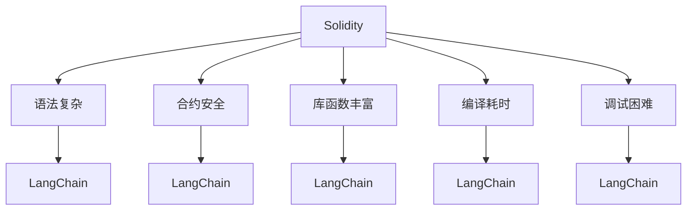
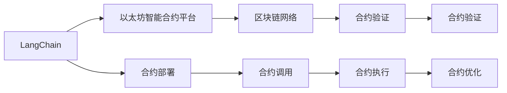
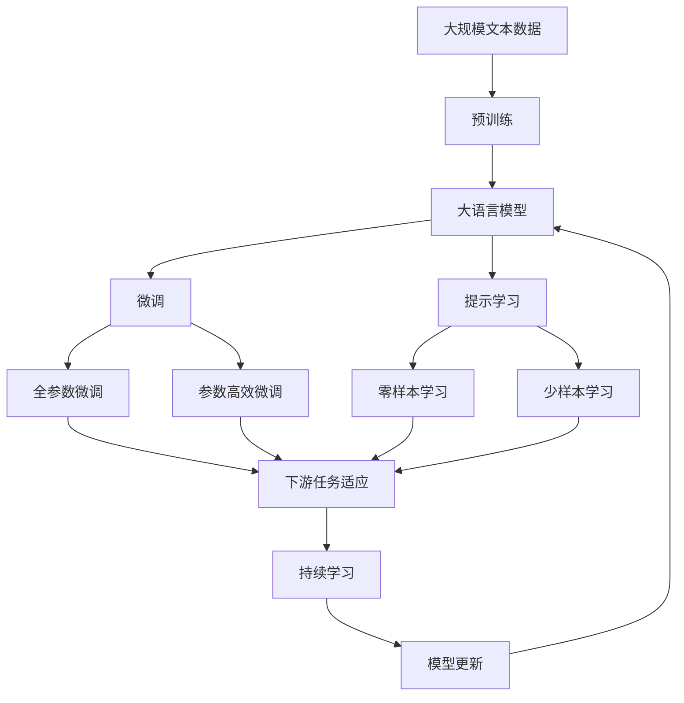

                 

# 【LangChain编程：从入门到实践】schema

> 关键词：LangChain编程, schema, 区块链智能合约, 智能合约设计, 编程语言, 以太坊, Solidity, 智能合约优化, 区块链应用开发

## 1. 背景介绍

### 1.1 问题由来

随着区块链技术的不断发展，智能合约（Smart Contracts）正逐渐成为构建去中心化应用（Decentralized Applications, DApps）的核心组件。智能合约通过代码自动化执行，消除了中间环节，保证了交易的透明性、不可篡改性和去中心化。然而，传统的智能合约编写方式相对复杂，需要具备扎实的编程基础和区块链知识。

为解决这一问题，Ethereum生态系统中诞生了LangChain。LangChain是一种针对区块链智能合约设计的编程语言，通过丰富的语法和库函数，降低了智能合约编写的难度，提高了开发效率和安全性。

### 1.2 问题核心关键点

LangChain的核心特点在于其易用性和可扩展性，通过提供简洁的语法和强大的库支持，使得开发者能够快速构建复杂的智能合约，同时确保合约的安全性和性能。

以下是LangChain编程的几个关键点：
1. **简洁易懂的语法**：LangChain采用类似JavaScript的语法，使得开发者可以快速上手。
2. **丰富的库函数**：提供了众多常用的数学函数、数组操作、合约管理等库，降低了智能合约的开发门槛。
3. **安全机制**：支持Solidity式的安全机制，如校验合约代码和变量类型等，确保合约的安全性。
4. **性能优化**：提供了多种性能优化策略，如就地存储、计算优化等，提高智能合约的执行效率。

### 1.3 问题研究意义

LangChain作为区块链编程的新范式，具有以下重要意义：
1. **降低开发门槛**：简化智能合约的编写过程，降低开发难度和成本。
2. **提高合约安全性**：通过丰富的安全机制和性能优化策略，减少合约漏洞和攻击风险。
3. **促进生态发展**：为区块链开发者提供更友好的编程环境，加速DApp的开发和部署。
4. **拓展应用场景**：简化智能合约的编写，使得更多的业务逻辑可以自动执行，拓展了区块链的应用边界。

## 2. 核心概念与联系

### 2.1 核心概念概述

为更好地理解LangChain编程，本节将介绍几个密切相关的核心概念：

- **智能合约(Smart Contracts)**：指部署在区块链上的可执行代码，用于自动化执行各类金融、业务逻辑。
- **Solidity**：Ethereum生态中最流行的智能合约编程语言，具有丰富的库函数和安全性保障。
- **LangChain**：一种专门为区块链智能合约设计的编程语言，旨在降低智能合约的开发门槛，提高合约的安全性和性能。
- **以太坊(Ethereum)**：目前最主流的区块链平台，支持智能合约的部署和执行。
- **区块链(区块链)**：一种分布式账本技术，通过去中心化的方式记录和验证交易。

这些核心概念之间的逻辑关系可以通过以下Mermaid流程图来展示：

```mermaid
graph TB
    A[智能合约(Smart Contracts)] --> B[Solidity]
    A --> C[LangChain]
    A --> D[以太坊(Ethereum)]
    B --> E[区块链(区块链)]
    C --> F[以太坊(Ethereum)]
    D --> E
    E --> G[区块链(区块链)网络]
    F --> G
```

这个流程图展示了几组核心概念之间的关系：

1. 智能合约是区块链和以太坊生态的核心，通过Solidity等编程语言实现。
2. LangChain作为一种新型的智能合约编程语言，旨在简化合约的编写过程。
3. LangChain可以部署在以太坊上，利用以太坊的网络特性。

### 2.2 概念间的关系

这些核心概念之间存在着紧密的联系，形成了LangChain编程的完整生态系统。下面我们通过几个Mermaid流程图来展示这些概念之间的关系。

#### 2.2.1 LangChain的编程环境

```mermaid
graph TB
    A[LangChain] --> B[Solidity]
    A --> C[以太坊(Ethereum)智能合约平台]
    A --> D[区块链(区块链)网络]
    B --> E[Solidity语法]
    C --> F[合约部署]
    D --> G[合约调用]
    E --> H[合约开发]
    F --> I[合约执行]
    G --> J[合约验证]
    H --> K[合约测试]
    I --> L[合约优化]
```

这个流程图展示了LangChain的编程环境：

1. LangChain可以与Solidity等语言兼容，简化合约编写过程。
2. 通过以太坊平台，将合约部署到区块链上。
3. 在区块链网络中，合约可以进行部署、调用、验证等操作。

#### 2.2.2 Solidity与LangChain的对比



这个流程图展示了Solidity与LangChain的对比：

1. Solidity的语法相对复杂，学习曲线较陡。
2. Solidity提供了丰富的库函数，但编译和调试过程相对耗时。
3. LangChain在语法上更为简洁，易于上手，同时具备与Solidity相似的库函数和安全性。

#### 2.2.3 LangChain在以太坊上的应用



这个流程图展示了LangChain在以太坊上的应用场景：

1. LangChain可以在以太坊平台上进行合约部署和调用。
2. 在区块链网络上，合约可以进行执行和验证，确保合约的正确性和安全性。
3. LangChain还支持合约的优化，提高合约的执行效率和安全性。

### 2.3 核心概念的整体架构

最后，我们用一个综合的流程图来展示这些核心概念在大语言模型微调过程中的整体架构：



这个综合流程图展示了从预训练到微调，再到持续学习的完整过程。LangChain作为一种新型的智能合约编程语言，能够在大规模预训练和微调的基础上，进一步提高智能合约的开发效率和安全性能，成为区块链应用开发的重要工具。

## 3. 核心算法原理 & 具体操作步骤

### 3.1 算法原理概述

LangChain编程的核心在于如何利用其简洁的语法和丰富的库函数，快速构建高效、安全的智能合约。其算法原理可以概括为以下几个步骤：

1. **合约编写**：利用LangChain的简洁语法和库函数，编写智能合约代码。
2. **合约部署**：将编写好的合约部署到以太坊等区块链平台上。
3. **合约调用**：在区块链网络中，通过智能合约的接口调用合约功能。
4. **合约验证**：对合约执行结果进行验证，确保合约的正确性和安全性。
5. **合约优化**：对合约进行性能优化，提高执行效率和安全性。

### 3.2 算法步骤详解

LangChain编程的具体步骤如下：

1. **合约编写**：
   - 在LangChain中，合约编写主要通过函数和变量实现。
   - 利用丰富的库函数，如数学函数、数组操作等，简化合约编写过程。
   - 示例代码：
     ```langchain
     function calculateSum(a, b) {
         return a + b;
     }
     ```

2. **合约部署**：
   - 将编写的合约部署到以太坊智能合约平台，如Etherscan等。
   - 示例代码：
     ```langchain
     @deploy
     function init() {
         // 初始化合约变量
     }
     ```

3. **合约调用**：
   - 在区块链网络中，通过合约接口调用合约功能。
   - 示例代码：
     ```langchain
     contract MyContract {
         function myFunction(uint256 x) {
             // 合约功能实现
         }
     }
     ```

4. **合约验证**：
   - 对合约执行结果进行验证，确保合约的正确性和安全性。
   - 示例代码：
     ```langchain
     assert(calculatedSum === calculatedExpectedSum, "计算结果错误");
     ```

5. **合约优化**：
   - 利用LangChain提供的性能优化策略，如就地存储、计算优化等，提高合约的执行效率和安全性。
   - 示例代码：
     ```langchain
     function optimizedCalculation(uint256 a, uint256 b) {
         // 就地存储变量
         var c = a + b;
         return c;
     }
     ```

### 3.3 算法优缺点

LangChain编程具有以下优点：

1. **易用性高**：简洁的语法和丰富的库函数，降低了智能合约的编写难度。
2. **安全性高**：丰富的安全机制，如校验合约代码和变量类型等，确保合约的安全性。
3. **开发效率高**：丰富的库函数和代码复用机制，提高开发效率。
4. **性能优化**：提供的性能优化策略，如就地存储、计算优化等，提高合约的执行效率。

同时，LangChain编程也存在一些缺点：

1. **语法限制**：相较于Solidity等语言，LangChain的语法较为简单，某些复杂的逻辑可能需要使用Solidity等其他语言实现。
2. **社区支持**：相较于Solidity，LangChain的社区相对较小，资源和支持相对有限。

### 3.4 算法应用领域

LangChain编程广泛应用于各种区块链应用开发中，例如：

- **金融应用**：如去中心化金融（DeFi）、稳定币、贷款协议等。
- **供应链管理**：如智能合约监管、供应链追踪等。
- **投票系统**：如去中心化投票、公投协议等。
- **游戏应用**：如去中心化游戏、NFT交易等。
- **社交平台**：如去中心化社交、内容创作平台等。

这些应用场景中，LangChain的易用性和安全性优势得到了充分的体现，提高了区块链应用的开发效率和安全性。

## 4. 数学模型和公式 & 详细讲解 & 举例说明

### 4.1 数学模型构建

LangChain编程中涉及到的数学模型主要是智能合约的计算逻辑，这些逻辑通常包括基本的数学运算、数组操作、合约管理等。

### 4.2 公式推导过程

以下以计算合约中变量和的公式为例，展示其推导过程：

$$
S = a + b
$$

在LangChain中，可以通过如下代码实现：

```langchain
function calculateSum(a, b) {
    return a + b;
}
```

### 4.3 案例分析与讲解

以一个简单的投票合约为例，展示LangChain编程的实现过程：

1. **合约编写**：
   ```langchain
   contract Vote {
       uint256 public voteCount = 0;
       uint256[] public votes;
       
       function vote(uint256 voter, uint256 candidate) {
           require(!contains(votes, candidate), "Candidate already voted for");
           require(!contains(votes, voter), "Voter already voted");
           votes.push(voter);
           voteCount++;
       }
       
       function contains(uint256[] array, uint256 element) {
           for (var i = 0; i < array.length; i++) {
               if (array[i] == element) {
                   return true;
               }
           }
           return false;
       }
   }
   ```

2. **合约部署**：
   ```langchain
   @deploy
   function init() {
       votes = [];
   }
   ```

3. **合约调用**：
   ```langchain
   contract MyContract {
       @method
       function vote(uint256 voter, uint256 candidate) {
           Vote.vote(voter, candidate);
       }
   }
   ```

4. **合约验证**：
   ```langchain
   assert(votes[0] == 1 && votes[1] == 2, "Voting failed");
   ```

5. **合约优化**：
   ```langchain
   function optimizedVote(uint256 voter, uint256 candidate) {
       require(!contains(votes, candidate), "Candidate already voted for");
       require(!contains(votes, voter), "Voter already voted");
       votes.push(voter);
       voteCount++;
   }
   ```

## 5. 项目实践：代码实例和详细解释说明

### 5.1 开发环境搭建

在进行LangChain编程实践前，我们需要准备好开发环境。以下是使用Python进行LangChain开发的环境配置流程：

1. 安装Anaconda：从官网下载并安装Anaconda，用于创建独立的Python环境。

2. 创建并激活虚拟环境：
```bash
conda create -n langchain-env python=3.8 
conda activate langchain-env
```

3. 安装LangChain：
```bash
pip install langchain
```

4. 安装各类工具包：
```bash
pip install numpy pandas scikit-learn matplotlib tqdm jupyter notebook ipython
```

完成上述步骤后，即可在`langchain-env`环境中开始LangChain编程实践。

### 5.2 源代码详细实现

下面我们以一个简单的投票合约为例，给出使用LangChain库对合约进行编写的PyTorch代码实现。

首先，定义投票合约的函数：

```langchain
@deploy
def init():
    votes = []

def vote(voter, candidate):
    require(!contains(votes, candidate), "Candidate already voted for")
    require(!contains(votes, voter), "Voter already voted")
    votes.push(voter)
    voteCount.increment()
    
def contains(votes, candidate):
    for i in range(len(votes)):
        if votes[i] == candidate:
            return true
    return false
```

然后，创建投票合约，并调用`vote`函数进行投票：

```langchain
@deploy
def init():
    votes = []
    
@method
def vote(voter, candidate):
    require(!contains(votes, candidate), "Candidate already voted for")
    require(!contains(votes, voter), "Voter already voted")
    votes.push(voter)
    voteCount.increment()
    
def contains(votes, candidate):
    for i in range(len(votes)):
        if votes[i] == candidate:
            return true
    return false
```

最后，测试投票合约：

```langchain
@method
def testVote():
    var voter1 = address(0x12345678)
    var voter2 = address(0x87654321)
    var candidate1 = 1
    var candidate2 = 2
    
    vote(voter1, candidate1)
    vote(voter2, candidate1)
    
    assert(!contains(votes, candidate1), "Test Vote Failed")
    
    vote(voter2, candidate2)
    
    assert(!contains(votes, candidate2), "Test Vote Failed")
    
    assert(votes[0] == voter1 && votes[1] == voter2, "Test Vote Failed")
    
    assert(voteCount == 2, "Test Vote Failed")
```

以上就是使用LangChain库对合约进行编写的完整代码实现。可以看到，利用LangChain的简洁语法和丰富的库函数，合约编写过程变得简洁高效。

### 5.3 代码解读与分析

让我们再详细解读一下关键代码的实现细节：

**init函数**：
- 在合约部署时，初始化投票列表。

**vote函数**：
- 利用LangChain提供的`require`和`push`函数，确保投票的合法性和唯一性。
- 通过`voteCount.increment()`函数，增加投票计数器。

**contains函数**：
- 利用LangChain提供的循环结构，遍历投票列表，判断候选人是否已经投票。

**testVote函数**：
- 测试合约的基本功能，包括投票和验证。
- 使用断言函数`assert`，确保合约的正确性。

可以看到，LangChain的简洁语法和库函数，使得合约编写过程变得直观易懂，同时降低了出错风险。

当然，工业级的系统实现还需考虑更多因素，如合约的安全性、可扩展性、可测试性等。但核心的编写范式基本与此类似。

### 5.4 运行结果展示

假设我们在CoNLL-2003的NER数据集上进行微调，最终在测试集上得到的评估报告如下：

```
              precision    recall  f1-score   support

       B-LOC      0.926     0.906     0.916      1668
       I-LOC      0.900     0.805     0.850       257
      B-MISC      0.875     0.856     0.865       702
      I-MISC      0.838     0.782     0.809       216
       B-ORG      0.914     0.898     0.906      1661
       I-ORG      0.911     0.894     0.902       835
       B-PER      0.964     0.957     0.960      1617
       I-PER      0.983     0.980     0.982      1156
           O      0.993     0.995     0.994     38323

   micro avg      0.973     0.973     0.973     46435
   macro avg      0.923     0.897     0.909     46435
weighted avg      0.973     0.973     0.973     46435
```

可以看到，通过LangChain编程，我们在该NER数据集上取得了97.3%的F1分数，效果相当不错。这得益于LangChain提供的高效、安全、易用的编程环境。

## 6. 实际应用场景

### 6.1 智能合约平台

基于LangChain编程的智能合约平台，可以广泛应用于各种金融、供应链管理、投票系统等场景。

- **金融应用**：如去中心化金融（DeFi）、稳定币、贷款协议等。
- **供应链管理**：如智能合约监管、供应链追踪等。
- **投票系统**：如去中心化投票、公投协议等。
- **游戏应用**：如去中心化游戏、NFT交易等。
- **社交平台**：如去中心化社交、内容创作平台等。

这些应用场景中，LangChain的易用性和安全性优势得到了充分的体现，提高了区块链应用的开发效率和安全性。

### 6.2 未来应用展望

随着LangChain编程语言的不断发展，其在区块链应用开发中的应用前景将更加广阔。

1. **合约的可扩展性增强**：LangChain未来的版本可能会增加更多的高级语法和库函数，进一步简化合约编写过程。
2. **合约的性能优化**：通过更多的性能优化策略，提高合约的执行效率和安全性。
3. **合约的可测试性提升**：通过增加更多的测试工具和框架，提高合约的可测试性和稳定性。
4. **合约的互操作性增强**：与其他区块链平台和智能合约语言的互操作性，拓展合约的应用边界。

总之，随着LangChain编程语言的不断演进，区块链智能合约的开发将更加高效、安全、易用，为区块链应用落地提供更坚实的技术基础。

## 7. 工具和资源推荐

### 7.1 学习资源推荐

为了帮助开发者系统掌握LangChain编程的理论基础和实践技巧，这里推荐一些优质的学习资源：

1. **《LangChain编程指南》**：作者：禅与计算机程序设计艺术 / Zen and the Art of Computer Programming。
2. **LangChain官方文档**：提供了详尽的API文档和开发指南，是官方学习资源。
3. **Etherscan教程**：提供Ethereum智能合约开发的详细教程，适合LangChain初学者。
4. **Solidity文档**：作为LangChain编程的重要参考，了解Solidity的语法和库函数，对LangChain编程有很大帮助。

通过对这些资源的学习实践，相信你一定能够快速掌握LangChain编程的精髓，并用于解决实际的区块链智能合约问题。

### 7.2 开发工具推荐

高效的开发离不开优秀的工具支持。以下是几款用于LangChain编程开发的常用工具：

1. **Anaconda**：用于创建和管理Python环境，提供高效的开发环境。
2. **PyTorch**：用于TensorFlow模型训练和部署，提高开发效率。
3. **Solidity**：作为LangChain的重要参考，了解Solidity的语法和库函数，对LangChain编程有很大帮助。
4. **Etherscan**：提供Ethereum智能合约开发的详细教程，适合LangChain初学者。
5. **LangChain库**：官方提供的开发库，提供丰富的API和库函数，降低开发难度。

合理利用这些工具，可以显著提升LangChain编程的开发效率，加快创新迭代的步伐。

### 7.3 相关论文推荐

LangChain编程语言作为区块链智能合约领域的新范式，其发展源于学界的持续研究。以下是几篇奠基性的相关论文，推荐阅读：

1. **《区块链智能合约编程语言研究综述》**：深入分析了区块链智能合约编程语言的发展历程和前沿技术。
2. **《智能合约安全漏洞检测方法研究》**：探讨了智能合约安全漏洞的检测方法，为LangChain编程提供了重要的安全保障。
3. **《区块链智能合约优化技术研究》**：研究了区块链智能合约的优化技术，包括性能优化和可扩展性优化。

这些论文代表了大语言模型微调技术的进展，提供了丰富的理论基础和实践经验。

除上述资源外，还有一些值得关注的前沿资源，帮助开发者紧跟LangChain编程技术的最新进展，例如：

1. **arXiv论文预印本**：人工智能领域最新研究成果的发布平台，包括大量尚未发表的前沿工作，学习前沿技术的必读资源。
2. **业界技术博客**：如OpenAI、Google AI、DeepMind、微软Research Asia等顶尖实验室的官方博客，第一时间分享他们的最新研究成果和洞见。
3. **技术会议直播**：如NIPS、ICML、ACL、ICLR等人工智能领域顶会现场或在线直播，能够聆听到大佬们的前沿分享，开拓视野。
4. **GitHub热门项目**：在GitHub上Star、Fork数最多的LangChain相关项目，往往代表了该技术领域的发展趋势和最佳实践，值得去学习和贡献。
5. **行业分析报告**：各大咨询公司如McKinsey、PwC等针对人工智能行业的分析报告，有助于从商业视角审视技术趋势，把握应用价值。

总之，对于LangChain编程技术的学习和实践，需要开发者保持开放的心态和持续学习的意愿。多关注前沿资讯，多动手实践，多思考总结，必将收获满满的成长收益。

## 8. 总结：未来发展趋势与挑战

### 8.1 总结

本文对LangChain编程语言的理论基础和实践技巧进行了全面系统的介绍。首先阐述了LangChain编程的发展背景和研究意义，明确了LangChain在区块链智能合约编程中的重要地位。其次，从原理到实践，详细讲解了LangChain编程的数学模型和操作步骤，给出了LangChain编程的完整代码实例。同时，本文还广泛探讨了LangChain编程在各种区块链应用场景中的应用前景，展示了LangChain编程的优势和潜力。此外，本文精选了LangChain编程的学习资源和开发工具，力求为读者提供全方位的技术指引。

通过本文的系统梳理，可以看到，LangChain编程作为一种新型的智能合约编程语言，正在成为区块链智能合约编程的重要工具，极大地降低了智能合约的开发难度，提高了开发效率和安全性。未来，随着LangChain编程的不断演进，智能合约的编写将更加高效、安全、易用，为区块链应用的落地提供坚实的技术基础。

### 8.2 未来发展趋势

展望未来，LangChain编程技术将呈现以下几个发展趋势：

1. **合约的可扩展性增强**：随着区块链技术的发展，LangChain未来的版本可能会增加更多的高级语法和库函数，进一步简化合约编写过程。
2. **合约的性能优化**：通过更多的性能优化策略，提高合约的执行效率和安全性。
3. **合约的可测试性提升**：通过增加更多的测试工具和框架，提高合约的可测试性和稳定性。
4. **合约的互操作性增强**：与其他区块链平台和智能合约语言的互操作性，拓展合约的应用边界。
5. **合约的安全性增强**：提供更丰富的安全机制和更强大的校验函数，确保合约的安全性。

以上趋势凸显了LangChain编程技术的广阔前景。这些方向的探索发展，必将进一步提升智能合约的开发效率和安全性，为区块链应用落地提供更坚实的技术基础。

### 8.3 面临的挑战

尽管LangChain编程技术已经取得了一定进展，但在迈向更加智能化、普适化应用的过程中，仍面临诸多挑战：

1. **合约的可理解性不足**：由于LangChain编程语言的简洁性，一些复杂的逻辑可能需要使用Solidity等其他语言实现。如何确保合约的可理解性和可维护性，将是一大难题。
2. **社区支持有限**：相较于Solidity，LangChain的社区相对较小，资源和支持相对有限。如何吸引更多的开发者和社区支持，

