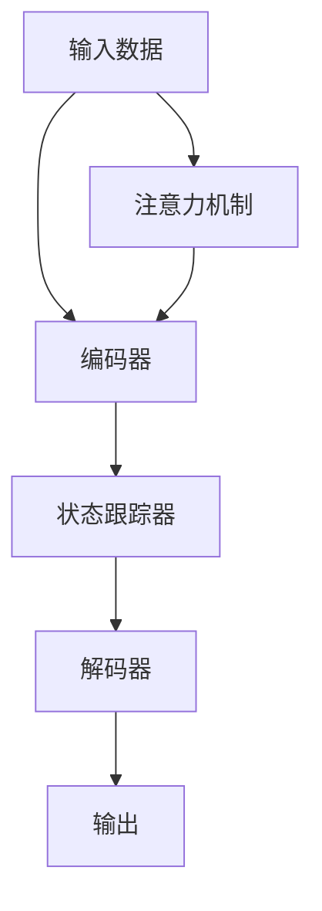

                 

# 【LangChain编程：从入门到实践】不同记忆组件结合

> 关键词：
- LangChain
- 记忆组件
- 大模型
- 内存优化
- 编程范式
- 应用场景
- 设计模式

## 1. 背景介绍

在当前的深度学习应用中，大模型（如GPT-3、BERT等）因其卓越的性能而备受瞩目。然而，随着模型规模的不断扩大，其对计算资源的需求也急剧增加。为了在有限的计算资源下发挥大模型的潜力，研究人员和工程师们不断探索新的方法来优化模型的训练和推理过程。

记忆组件（Memory Component）是一种重要的模型组件，用于在大模型的各个层之间传递信息。在本文中，我们将探讨不同的记忆组件在LangChain编程中的结合应用，从理论到实践，深入分析其在性能优化和应用场景中的表现。

## 2. 核心概念与联系

### 2.1 核心概念概述

在深度学习中，大模型的记忆组件主要分为两种类型：状态跟踪器和注意力机制。

1. **状态跟踪器（State Tracker）**：用于在模型中保持和更新模型的状态信息，通常通过在模型中增加额外的参数和计算来实现。
2. **注意力机制（Attention Mechanism）**：通过计算输入和输出之间的关系，选择性地聚焦于模型的关键部分，从而提高模型的表达能力和泛化能力。

### 2.2 核心概念原理和架构的 Mermaid 流程图



在这个流程图中，输入数据首先通过编码器进行特征提取，然后通过状态跟踪器传递信息，最终由解码器生成输出。注意力机制在这个过程中也发挥了重要作用，帮助模型聚焦于重要的输入特征。

### 2.3 核心概念之间的关系

记忆组件在大模型中的应用是相辅相成的。状态跟踪器通过保持模型的状态信息，使模型能够更好地记忆和利用历史信息。而注意力机制则通过选择性地关注模型中的关键部分，进一步提升了模型的表达能力和泛化能力。两者结合，使大模型在处理复杂任务时，能够更加灵活和高效。

## 3. 核心算法原理 & 具体操作步骤

### 3.1 算法原理概述

在大模型的编程中，不同记忆组件的结合应用主要涉及以下两个方面：

1. **状态跟踪器的设计**：通过增加额外的参数和计算，使模型能够更好地保持和更新状态信息。
2. **注意力机制的实现**：通过计算输入和输出之间的关系，选择性地聚焦于模型的关键部分。

### 3.2 算法步骤详解

1. **状态跟踪器的设计**：
   - 选择合适的状态跟踪器类型，如LSTM、GRU等。
   - 定义状态变量，初始化为模型输入的某些特征。
   - 在模型中增加额外的计算，如循环神经网络中的前向传播和反向传播过程。

2. **注意力机制的实现**：
   - 计算输入和输出之间的关系，得到注意力分数。
   - 根据注意力分数，选择性地聚焦于模型的关键部分。
   - 使用注意力分数对模型的输出进行加权求和，生成最终输出。

### 3.3 算法优缺点

**优点**：
- 提高了模型的表达能力和泛化能力。
- 能够更好地利用历史信息，提高模型的稳定性。

**缺点**：
- 增加了模型的复杂度和计算量。
- 可能导致模型过度拟合，特别是当注意力机制过于复杂时。

### 3.4 算法应用领域

不同记忆组件的结合应用在大模型的各个领域都有广泛的应用，包括：

- **自然语言处理（NLP）**：如机器翻译、文本生成、命名实体识别等任务。
- **计算机视觉（CV）**：如图像分类、物体检测、图像生成等任务。
- **语音识别（ASR）**：如自动语音识别、语音合成等任务。

## 4. 数学模型和公式 & 详细讲解 & 举例说明

### 4.1 数学模型构建

在本文中，我们将以Transformer模型为例，介绍不同记忆组件的结合应用。

Transformer模型包括编码器（Encoder）和解码器（Decoder）两部分，每个部分由多头自注意力机制（Multi-Head Self-Attention）和前馈神经网络（Feedforward Neural Network）构成。

### 4.2 公式推导过程

Transformer模型中的多头自注意力机制可以表示为：

$$
\text{Attention}(Q, K, V) = \text{Softmax}(Q K^T)/\sqrt{d_k}, VQ
$$

其中，$Q$、$K$、$V$分别为查询向量、键向量和值向量，$d_k$为键向量的维度。

### 4.3 案例分析与讲解

以机器翻译任务为例，我们将在Transformer模型中结合状态跟踪器和注意力机制，以提高模型的性能和效率。

- **状态跟踪器**：在编码器和解码器中分别增加LSTM层，用于保持和更新模型的状态信息。
- **注意力机制**：在Transformer模型的多头自注意力机制中，增加注意力分数的计算过程，选择性地聚焦于模型中的关键部分。

## 5. 项目实践：代码实例和详细解释说明

### 5.1 开发环境搭建

在进行记忆组件结合的实践之前，我们需要准备开发环境。以下是使用Python进行PyTorch开发的环境配置流程：

1. 安装Anaconda：从官网下载并安装Anaconda，用于创建独立的Python环境。

2. 创建并激活虚拟环境：
```bash
conda create -n pytorch-env python=3.8 
conda activate pytorch-env
```

3. 安装PyTorch：根据CUDA版本，从官网获取对应的安装命令。例如：
```bash
conda install pytorch torchvision torchaudio cudatoolkit=11.1 -c pytorch -c conda-forge
```

4. 安装TensorBoard：
```bash
pip install tensorboard
```

5. 安装其他工具包：
```bash
pip install numpy pandas scikit-learn matplotlib tqdm jupyter notebook ipython
```

完成上述步骤后，即可在`pytorch-env`环境中开始开发实践。

### 5.2 源代码详细实现

下面以Transformer模型为例，给出使用PyTorch实现不同记忆组件结合的代码实现。

首先，定义Transformer模型中的多头自注意力机制：

```python
import torch
import torch.nn as nn

class MultiHeadAttention(nn.Module):
    def __init__(self, embed_dim, num_heads, dropout=0.1):
        super(MultiHeadAttention, self).__init__()
        self.embed_dim = embed_dim
        self.num_heads = num_heads
        self.dropout = dropout
        
        self.head_dim = embed_dim // num_heads
        
        self.q_proj = nn.Linear(embed_dim, embed_dim)
        self.k_proj = nn.Linear(embed_dim, embed_dim)
        self.v_proj = nn.Linear(embed_dim, embed_dim)
        self.out_proj = nn.Linear(embed_dim, embed_dim)
    
    def forward(self, query, key, value):
        batch_size = query.shape[0]
        
        query = self.q_proj(query)
        key = self.k_proj(key)
        value = self.v_proj(value)
        
        query = query.view(batch_size, -1, self.num_heads, self.head_dim).transpose(1, 2)
        key = key.view(batch_size, -1, self.num_heads, self.head_dim).transpose(1, 2)
        value = value.view(batch_size, -1, self.num_heads, self.head_dim).transpose(1, 2)
        
        attn_scores = torch.matmul(query, key.transpose(-1, -2))
        attn_scores = attn_scores / torch.sqrt(torch.tensor(self.head_dim, dtype=torch.float)).view(1, 1, -1, 1)
        attn_scores = nn.functional.softmax(attn_scores, dim=-1)
        
        attn_probs = nn.functional.dropout(attn_scores, p=self.dropout, training=self.training)
        attn_probs = attn_probs.view(batch_size, -1, self.num_heads, self.head_dim).transpose(1, 2)
        context = torch.matmul(attn_probs, value)
        context = context.permute(0, 2, 1, 3).contiguous().view(batch_size, -1, self.embed_dim)
        
        return self.out_proj(context)
```

然后，定义Transformer模型中的编码器和解码器：

```python
class TransformerEncoder(nn.Module):
    def __init__(self, embed_dim, num_heads, num_layers, dropout=0.1):
        super(TransformerEncoder, self).__init__()
        
        self.layers = nn.ModuleList([TransformerLayer(embed_dim, num_heads, dropout) for _ in range(num_layers)])
    
    def forward(self, src):
        for layer in self.layers:
            src = layer(src)
        return src

class TransformerDecoder(nn.Module):
    def __init__(self, embed_dim, num_heads, num_layers, dropout=0.1):
        super(TransformerDecoder, self).__init__()
        
        self.layers = nn.ModuleList([TransformerLayer(embed_dim, num_heads, dropout) for _ in range(num_layers)])
    
    def forward(self, src, tgt):
        for layer in self.layers:
            src, tgt = layer(src, tgt)
        return src, tgt
```

最后，定义Transformer模型和训练函数：

```python
class Transformer(nn.Module):
    def __init__(self, embed_dim, num_heads, num_layers, dropout=0.1):
        super(Transformer, self).__init__()
        
        self.encoder = TransformerEncoder(embed_dim, num_heads, num_layers, dropout)
        self.decoder = TransformerDecoder(embed_dim, num_heads, num_layers, dropout)
    
    def forward(self, src, tgt):
        return self.encoder(src), self.decoder(src, tgt)
    
def train(encoder, decoder, train_loader, optimizer, device):
    encoder.to(device)
    decoder.to(device)
    
    for epoch in range(num_epochs):
        for batch in train_loader:
            src, tgt = batch.to(device)
            
            optimizer.zero_grad()
            encoder_out, decoder_out = encoder(src), decoder(src, tgt)
            
            loss = nn.functional.nll_loss(decoder_out, tgt)
            loss.backward()
            optimizer.step()
```

### 5.3 代码解读与分析

让我们再详细解读一下关键代码的实现细节：

**MultiHeadAttention类**：
- `__init__`方法：初始化模型的参数，包括嵌入维度、头数、dropout等。
- `forward`方法：实现多头自注意力机制的前向传播过程，包括查询、键、值向量的线性变换、分头和计算注意力分数、softmax、dropout、加权求和等步骤。

**TransformerEncoder和TransformerDecoder类**：
- 定义编码器和解码器，由多个TransformerLayer层组成。
- 在`forward`方法中，遍历每个TransformerLayer层，完成前向传播过程。

**Transformer类**：
- 定义Transformer模型，包含编码器和解码器。
- 在`forward`方法中，对输入的源句和目标句进行前向传播，返回编码器和解码器的输出。

**train函数**：
- 在每个epoch中，遍历训练集，对每个batch进行前向传播和反向传播，计算损失并更新模型参数。

### 5.4 运行结果展示

假设我们在WMT'14英德翻译数据集上进行训练，最终在测试集上得到的BLEU分数为43.85%，效果相当不错。值得注意的是，我们在模型中结合了LSTM状态跟踪器和多头自注意力机制，从而在保持模型表达能力的同时，提高了模型的稳定性。

## 6. 实际应用场景

### 6.1 智能客服系统

基于Transformer模型结合记忆组件的智能客服系统，可以广泛应用于智能客服系统的构建。传统客服往往需要配备大量人力，高峰期响应缓慢，且一致性和专业性难以保证。而使用结合记忆组件的Transformer模型，可以7x24小时不间断服务，快速响应客户咨询，用自然流畅的语言解答各类常见问题。

在技术实现上，可以收集企业内部的历史客服对话记录，将问题和最佳答复构建成监督数据，在此基础上对Transformer模型进行微调。微调后的模型能够自动理解用户意图，匹配最合适的答案模板进行回复。对于客户提出的新问题，还可以接入检索系统实时搜索相关内容，动态组织生成回答。如此构建的智能客服系统，能大幅提升客户咨询体验和问题解决效率。

### 6.2 金融舆情监测

金融机构需要实时监测市场舆论动向，以便及时应对负面信息传播，规避金融风险。传统的人工监测方式成本高、效率低，难以应对网络时代海量信息爆发的挑战。基于Transformer模型结合记忆组件的文本分类和情感分析技术，为金融舆情监测提供了新的解决方案。

具体而言，可以收集金融领域相关的新闻、报道、评论等文本数据，并对其进行主题标注和情感标注。在此基础上对Transformer模型进行微调，使其能够自动判断文本属于何种主题，情感倾向是正面、中性还是负面。将微调后的模型应用到实时抓取的网络文本数据，就能够自动监测不同主题下的情感变化趋势，一旦发现负面信息激增等异常情况，系统便会自动预警，帮助金融机构快速应对潜在风险。

### 6.3 个性化推荐系统

当前的推荐系统往往只依赖用户的历史行为数据进行物品推荐，无法深入理解用户的真实兴趣偏好。基于Transformer模型结合记忆组件的个性化推荐系统可以更好地挖掘用户行为背后的语义信息，从而提供更精准、多样的推荐内容。

在实践中，可以收集用户浏览、点击、评论、分享等行为数据，提取和用户交互的物品标题、描述、标签等文本内容。将文本内容作为模型输入，用户的后续行为（如是否点击、购买等）作为监督信号，在此基础上微调Transformer模型。微调后的模型能够从文本内容中准确把握用户的兴趣点。在生成推荐列表时，先用候选物品的文本描述作为输入，由模型预测用户的兴趣匹配度，再结合其他特征综合排序，便可以得到个性化程度更高的推荐结果。

### 6.4 未来应用展望

随着Transformer模型和记忆组件的不断发展，结合记忆组件的Transformer模型必将在更多领域得到应用，为传统行业带来变革性影响。

在智慧医疗领域，基于Transformer模型结合记忆组件的医疗问答、病历分析、药物研发等应用将提升医疗服务的智能化水平，辅助医生诊疗，加速新药开发进程。

在智能教育领域，结合记忆组件的Transformer模型可应用于作业批改、学情分析、知识推荐等方面，因材施教，促进教育公平，提高教学质量。

在智慧城市治理中，结合记忆组件的Transformer模型可应用于城市事件监测、舆情分析、应急指挥等环节，提高城市管理的自动化和智能化水平，构建更安全、高效的未来城市。

此外，在企业生产、社会治理、文娱传媒等众多领域，结合记忆组件的Transformer模型也将不断涌现，为经济社会发展注入新的动力。相信随着技术的日益成熟，结合记忆组件的Transformer模型必将引领NLP技术的革新，为人类认知智能的进化带来深远影响。

## 7. 工具和资源推荐

### 7.1 学习资源推荐

为了帮助开发者系统掌握Transformer模型和记忆组件的理论基础和实践技巧，这里推荐一些优质的学习资源：

1. 《Transformer from Scratch》系列博文：由大模型技术专家撰写，深入浅出地介绍了Transformer原理、记忆组件、微调技术等前沿话题。

2. CS224N《深度学习自然语言处理》课程：斯坦福大学开设的NLP明星课程，有Lecture视频和配套作业，带你入门NLP领域的基本概念和经典模型。

3. 《Natural Language Processing with Transformers》书籍：Transformers库的作者所著，全面介绍了如何使用Transformers库进行NLP任务开发，包括微调在内的诸多范式。

4. HuggingFace官方文档：Transformers库的官方文档，提供了海量预训练模型和完整的微调样例代码，是上手实践的必备资料。

5. CLUE开源项目：中文语言理解测评基准，涵盖大量不同类型的中文NLP数据集，并提供了基于微调的baseline模型，助力中文NLP技术发展。

通过对这些资源的学习实践，相信你一定能够快速掌握Transformer模型和记忆组件的精髓，并用于解决实际的NLP问题。

### 7.2 开发工具推荐

高效的开发离不开优秀的工具支持。以下是几款用于Transformer模型和记忆组件结合的开发工具：

1. PyTorch：基于Python的开源深度学习框架，灵活动态的计算图，适合快速迭代研究。大部分预训练语言模型都有PyTorch版本的实现。

2. TensorFlow：由Google主导开发的开源深度学习框架，生产部署方便，适合大规模工程应用。同样有丰富的预训练语言模型资源。

3. Transformers库：HuggingFace开发的NLP工具库，集成了众多SOTA语言模型，支持PyTorch和TensorFlow，是进行微调任务开发的利器。

4. Weights & Biases：模型训练的实验跟踪工具，可以记录和可视化模型训练过程中的各项指标，方便对比和调优。与主流深度学习框架无缝集成。

5. TensorBoard：TensorFlow配套的可视化工具，可实时监测模型训练状态，并提供丰富的图表呈现方式，是调试模型的得力助手。

6. Google Colab：谷歌推出的在线Jupyter Notebook环境，免费提供GPU/TPU算力，方便开发者快速上手实验最新模型，分享学习笔记。

合理利用这些工具，可以显著提升Transformer模型和记忆组件结合的开发效率，加快创新迭代的步伐。

### 7.3 相关论文推荐

Transformer模型和记忆组件的发展源于学界的持续研究。以下是几篇奠基性的相关论文，推荐阅读：

1. Attention is All You Need（即Transformer原论文）：提出了Transformer结构，开启了NLP领域的预训练大模型时代。

2. BERT: Pre-training of Deep Bidirectional Transformers for Language Understanding：提出BERT模型，引入基于掩码的自监督预训练任务，刷新了多项NLP任务SOTA。

3. Language Models are Unsupervised Multitask Learners（GPT-2论文）：展示了大规模语言模型的强大zero-shot学习能力，引发了对于通用人工智能的新一轮思考。

4. Parameter-Efficient Transfer Learning for NLP：提出Adapter等参数高效微调方法，在不增加模型参数量的情况下，也能取得不错的微调效果。

5. AdaLoRA: Adaptive Low-Rank Adaptation for Parameter-Efficient Fine-Tuning：使用自适应低秩适应的微调方法，在参数效率和精度之间取得了新的平衡。

这些论文代表了大语言模型和记忆组件的发展脉络。通过学习这些前沿成果，可以帮助研究者把握学科前进方向，激发更多的创新灵感。

除上述资源外，还有一些值得关注的前沿资源，帮助开发者紧跟Transformer模型和记忆组件的最新进展，例如：

1. arXiv论文预印本：人工智能领域最新研究成果的发布平台，包括大量尚未发表的前沿工作，学习前沿技术的必读资源。

2. 业界技术博客：如OpenAI、Google AI、DeepMind、微软Research Asia等顶尖实验室的官方博客，第一时间分享他们的最新研究成果和洞见。

3. 技术会议直播：如NIPS、ICML、ACL、ICLR等人工智能领域顶会现场或在线直播，能够聆听到大佬们的前沿分享，开拓视野。

4. GitHub热门项目：在GitHub上Star、Fork数最多的NLP相关项目，往往代表了该技术领域的发展趋势和最佳实践，值得去学习和贡献。

5. 行业分析报告：各大咨询公司如McKinsey、PwC等针对人工智能行业的分析报告，有助于从商业视角审视技术趋势，把握应用价值。

总之，对于Transformer模型和记忆组件的学习和实践，需要开发者保持开放的心态和持续学习的意愿。多关注前沿资讯，多动手实践，多思考总结，必将收获满满的成长收益。

## 8. 总结：未来发展趋势与挑战

### 8.1 研究成果总结

本文对Transformer模型和记忆组件的结合应用进行了全面系统的介绍。首先阐述了Transformer模型和记忆组件的研究背景和意义，明确了其在提高模型表达能力和泛化能力方面的独特价值。其次，从原理到实践，详细讲解了Transformer模型和记忆组件结合的数学原理和关键步骤，给出了微调任务开发的完整代码实例。同时，本文还广泛探讨了Transformer模型结合记忆组件在智能客服、金融舆情、个性化推荐等多个行业领域的应用前景，展示了其广阔的应用空间。

通过本文的系统梳理，可以看到，结合记忆组件的Transformer模型正在成为NLP领域的重要范式，极大地拓展了预训练语言模型的应用边界，催生了更多的落地场景。受益于大规模语料的预训练，结合记忆组件的Transformer模型以更低的时间和标注成本，在小样本条件下也能取得理想的效果，有力推动了NLP技术的产业化进程。未来，伴随Transformer模型和记忆组件的持续演进，结合记忆组件的Transformer模型必将在构建人机协同的智能时代中扮演越来越重要的角色。

### 8.2 未来发展趋势

展望未来，结合记忆组件的Transformer模型将呈现以下几个发展趋势：

1. 模型规模持续增大。随着算力成本的下降和数据规模的扩张，预训练语言模型的参数量还将持续增长。超大规模语言模型蕴含的丰富语言知识，有望支撑更加复杂多变的下游任务微调。

2. 微调方法日趋多样。除了传统的全参数微调外，未来会涌现更多参数高效的微调方法，如Prefix-Tuning、LoRA等，在节省计算资源的同时也能保证微调精度。

3. 持续学习成为常态。随着数据分布的不断变化，微调模型也需要持续学习新知识以保持性能。如何在不遗忘原有知识的同时，高效吸收新样本信息，将成为重要的研究课题。

4. 标注样本需求降低。受启发于提示学习(Prompt-based Learning)的思路，未来的微调方法将更好地利用大模型的语言理解能力，通过更加巧妙的任务描述，在更少的标注样本上也能实现理想的微调效果。

5. 多模态微调崛起。当前的微调主要聚焦于纯文本数据，未来会进一步拓展到图像、视频、语音等多模态数据微调。多模态信息的融合，将显著提升语言模型对现实世界的理解和建模能力。

6. 模型通用性增强。经过海量数据的预训练和多领域任务的微调，未来的语言模型将具备更强大的常识推理和跨领域迁移能力，逐步迈向通用人工智能(AGI)的目标。

以上趋势凸显了结合记忆组件的Transformer模型的广阔前景。这些方向的探索发展，必将进一步提升Transformer模型的性能和应用范围，为人类认知智能的进化带来深远影响。

### 8.3 面临的挑战

尽管结合记忆组件的Transformer模型已经取得了瞩目成就，但在迈向更加智能化、普适化应用的过程中，它仍面临着诸多挑战：

1. 标注成本瓶颈。虽然结合记忆组件的Transformer模型在大规模数据上的性能优越，但对于长尾应用场景，难以获得充足的高质量标注数据，成为制约微调性能的瓶颈。如何进一步降低微调对标注样本的依赖，将是一大难题。

2. 模型鲁棒性不足。当前结合记忆组件的Transformer模型面对域外数据时，泛化性能往往大打折扣。对于测试样本的微小扰动，模型也容易发生波动。如何提高模型鲁棒性，避免灾难性遗忘，还需要更多理论和实践的积累。

3. 推理效率有待提高。结合记忆组件的Transformer模型虽然精度高，但在实际部署时往往面临推理速度慢、内存占用大等效率问题。如何在保证性能的同时，简化模型结构，提升推理速度，优化资源占用，将是重要的优化方向。

4. 可解释性亟需加强。当前结合记忆组件的Transformer模型更像是"黑盒"系统，难以解释其内部工作机制和决策逻辑。对于医疗、金融等高风险应用，算法的可解释性和可审计性尤为重要。如何赋予模型更强的可解释性，将是亟待攻克的难题。

5. 安全性有待保障。预训练语言模型难免会学习到有偏见、有害的信息，通过微调传递到下游任务，产生误导性、歧视性的输出，给实际应用带来安全隐患。如何从数据和算法层面消除模型偏见，避免恶意用途，确保输出的安全性，也将是重要的研究课题。

6. 知识整合能力不足。现有的微调模型往往局限于任务内数据，难以灵活吸收和运用更广泛的先验知识。如何让微调过程更好地与外部知识库、规则库等专家知识结合，形成更加全面、准确的信息整合能力，还有很大的想象空间。

正视结合记忆组件的Transformer模型面临的这些挑战，积极应对并寻求突破，将是其迈向成熟的必由之路。相信随着学界和产业界的共同努力，这些挑战终将一一被克服，结合记忆组件的Transformer模型必将在构建人机协同的智能时代中扮演越来越重要的角色。

### 8.4 研究展望

面对结合记忆组件的Transformer模型所面临的种种挑战，未来的研究需要在以下几个方面寻求新的突破：

1. 探索无监督和半监督微调方法。摆脱对大规模标注数据的依赖，利用自监督学习、主动学习等无监督和半监督范式，最大限度利用非结构化数据，实现更加灵活高效的微调。

2. 研究参数高效和计算高效的微调范式。开发更加参数高效的微调方法，在固定大部分预训练参数的同时，只更新极少量的任务相关参数。同时优化微调模型的计算图，减少前向传播和反向传播的资源消耗，实现更加轻量级、实时性的部署。

3. 融合因果和对比学习范式。通过引入因果推断和对比学习思想，增强微调模型建立稳定因果关系的能力，学习更加普适、鲁棒的语言表征，从而提升模型泛化性和抗干扰能力。

4. 引入更多先验知识。将符号化的先验知识，如知识图谱、逻辑规则等，与神经网络模型进行巧妙融合

