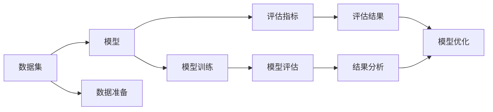

                 

# 【LangChain编程：从入门到实践】模型效果评估

在现代人工智能应用中，模型效果评估是一个至关重要的环节。它不仅帮助我们理解模型的表现，还指导我们如何改进模型，以更好地满足实际应用的需求。本文将详细探讨模型效果评估的核心概念、方法、工具和实际应用，带您从入门到实践，全面掌握这一技能。

## 1. 背景介绍

随着人工智能技术的不断发展，模型效果评估已经成为了推动AI系统不断进步的关键因素。无论是自然语言处理(NLP)、计算机视觉(CV)还是推荐系统等领域，效果评估都能帮助开发人员发现模型的优势和不足，从而进行针对性的改进。本文将重点讨论NLP中的效果评估方法，但由于其普适性，这些方法同样适用于其他AI领域。

### 1.1 问题由来

在实际应用中，模型效果评估常常面临以下挑战：

- **数据稀缺性**：部分任务可能只有有限的数据，这限制了传统效果评估方法的适用性。
- **任务多样性**：不同的NLP任务有着不同的评估指标和标准，选择合适的评估方法尤为重要。
- **性能波动**：模型在不同测试集上的表现可能不一致，评估结果可能受随机因素影响。
- **公平性与解释性**：模型的输出是否公平，是否具有良好的可解释性，同样是评估的重要内容。

### 1.2 问题核心关键点

模型效果评估的核心在于选择合适的评估方法，并通过这些方法对模型的表现进行全面、客观、可重复的评估。

- **评估方法**：包括精确率、召回率、F1分数、ROC曲线、混淆矩阵等。
- **评估指标**：根据任务需求，选择最合适的指标进行评估。
- **实验设计**：确保评估结果的可靠性，包括交叉验证、超参数调整等。
- **结果分析**：不仅看数值，更要理解结果背后的原因，寻找改进方向。

### 1.3 问题研究意义

模型效果评估对于AI系统的开发和应用具有重要意义：

- **指导模型优化**：通过评估结果，了解模型的不足，指导后续的模型改进。
- **提升用户体验**：优秀的模型可以提供更准确的预测和更优质的服务，提升用户满意度。
- **促进算法创新**：不断改进和优化评估方法，推动算法研究的进步。
- **确保系统安全**：评估模型输出的公平性、安全性，确保AI系统的可信任度。

## 2. 核心概念与联系

### 2.1 核心概念概述

为了更好地理解模型效果评估，首先需要了解几个关键概念：

- **精确率(Precision)**：指模型正确预测的正样本数量与预测为正样本的总数之比。
- **召回率(Recall)**：指模型正确预测的正样本数量与实际正样本总数之比。
- **F1分数(F1-Score)**：精确率和召回率的调和平均数，综合考虑了模型的准确率和覆盖率。
- **ROC曲线**：以假正率(True Positive Rate, TPR)为纵坐标，真正率(False Positive Rate, FPR)为横坐标，描述模型在不同阈值下的表现。
- **混淆矩阵(Confusion Matrix)**：展示模型预测结果与实际结果之间的关系，通过计算真正、假正、真负、假负等指标评估模型性能。

这些概念之间存在密切联系，通过选择合适的评估方法，可以有效理解模型的优劣。

### 2.2 概念间的关系

通过以下Mermaid流程图，我们展示模型效果评估中不同概念之间的关系：

```mermaid
graph TB
    A[精确率(Precision)] --> B[召回率(Recall)]
    A --> C[F1分数(F1-Score)]
    B --> D[ROC曲线]
    D --> E[混淆矩阵(Confusion Matrix)]
    E --> F[模型性能]
```

该流程图展示了模型效果评估的几个核心概念及其相互关系：

1. 精确率和召回率是评估模型性能的两个基本指标，用于衡量模型对正负样本的判断能力。
2. F1分数是对精确率和召回率的综合评估，常用于处理两者冲突的情况。
3. ROC曲线进一步细化了精确率和召回率的关系，展示了模型在不同阈值下的表现。
4. 混淆矩阵通过具体数值，直观展示了模型在不同类别上的预测情况，有助于进一步分析模型错误类型。
5. 所有这些评估方法最终用于衡量模型的整体性能，指导模型优化。

### 2.3 核心概念的整体架构

在实际的模型评估中，我们可以使用以下综合流程图来描述整个评估过程：



这个流程图展示了模型效果评估的完整过程：

1. 数据集的准备和模型的训练是评估的基础。
2. 选择合适的评估指标，如精确率、召回率等。
3. 对模型进行评估，获取评估结果。
4. 分析评估结果，发现问题。
5. 根据分析结果，进行模型优化。

## 3. 核心算法原理 & 具体操作步骤

### 3.1 算法原理概述

模型效果评估的原理是基于统计学和信息论的。我们通过收集和分析模型在测试集上的预测结果和实际结果，计算出不同的评估指标，从而评估模型的性能。这些指标包括但不限于：

- **精确率**：TP/(TP+FP)，其中TP为真正例，FP为假正例。
- **召回率**：TP/(TP+FN)，其中FN为假负例。
- **F1分数**：2*(精确率*召回率)/（精确率+召回率）。
- **ROC曲线**：以假正率（False Positive Rate, FPR）为横轴，真正率（True Positive Rate, TPR）为纵轴，绘制出的曲线。
- **混淆矩阵**：展示了模型预测结果与实际结果之间的对应关系。

### 3.2 算法步骤详解

模型效果评估的一般步骤包括：

1. **数据准备**：收集和划分数据集，确保测试集和验证集的比例合理，防止过拟合。
2. **模型训练**：在训练集上训练模型，并记录训练过程中的参数和指标。
3. **模型评估**：在测试集上对模型进行评估，计算各项评估指标。
4. **结果分析**：分析评估结果，找出模型的不足和改进方向。
5. **模型优化**：根据分析结果，调整模型参数，重新训练模型。
6. **重新评估**：在优化后，对模型进行重新评估，验证优化效果。

### 3.3 算法优缺点

模型效果评估的优缺点如下：

**优点**：

- **全面评估**：通过多指标综合评估，全面了解模型性能。
- **可重复性**：使用固定方法和流程，评估结果可重复验证。
- **指导优化**：发现模型不足，指导后续的模型改进。

**缺点**：

- **数据依赖**：评估结果依赖于测试集，可能受数据分布影响。
- **计算复杂**：部分评估方法如ROC曲线、混淆矩阵计算复杂，对计算资源要求较高。
- **主观性**：评估指标的选择可能受任务需求和个人偏好影响。

### 3.4 算法应用领域

模型效果评估广泛应用于NLP中的各种任务，包括但不限于：

- **文本分类**：如情感分析、垃圾邮件识别等，评估指标通常包括精确率、召回率和F1分数。
- **命名实体识别**：如人名、地名识别，评估指标包括精确率、召回率和混淆矩阵。
- **机器翻译**：如BLEU分数，评估机器翻译的质量。
- **问答系统**：如F1分数，评估问答系统的准确性和全面性。

此外，在计算机视觉、推荐系统、游戏AI等领域，模型效果评估同样重要。

## 4. 数学模型和公式 & 详细讲解

### 4.1 数学模型构建

在数学上，我们可以用以下公式来表示模型效果评估的基本框架：

假设模型在数据集上的预测结果为 $\hat{y}$，实际结果为 $y$，其中 $y \in \{0, 1\}$ 表示正负样本。

- **精确率**：$P = \frac{TP}{TP+FP}$
- **召回率**：$R = \frac{TP}{TP+FN}$
- **F1分数**：$F1 = 2 \cdot \frac{P \cdot R}{P+R}$
- **ROC曲线**：$FPR = \frac{FP}{TN+FP}$，$TPR = \frac{TP}{TP+FN}$，其中 $TN$ 表示真负例。
- **混淆矩阵**：$TPR = \frac{TP}{TP+FN}$，$FPR = \frac{FP}{FP+TN}$，$TPN = \frac{TN}{TN+FN}$，$FNN = \frac{FN}{FN+TP}$

### 4.2 公式推导过程

以精确率为例，其计算公式为：

$$P = \frac{TP}{TP+FP}$$

其中：

- $TP$：真正例，模型正确预测为正样本的数量。
- $FP$：假正例，模型错误预测为正样本的数量。

精确率用于衡量模型预测的正样本中，有多少是真正的正样本。当精确率较高时，表示模型预测的正样本中很少出现误报。

### 4.3 案例分析与讲解

假设我们有一个文本分类模型，用于判断新闻文章是正面还是负面。我们使用100篇文章进行训练，其中80篇正面，20篇负面。在测试集上，模型预测了80篇正面和20篇负面。实际结果如下：

- 模型预测80篇正面，其中70篇正确，10篇错误。
- 模型预测20篇负面，其中10篇正确，10篇错误。

根据上述数据，我们可以计算出精确率、召回率和F1分数：

- 精确率 $P = \frac{70}{70+10} = 0.88$
- 召回率 $R = \frac{70}{70+10} = 0.88$
- F1分数 $F1 = 2 \cdot \frac{0.88 \cdot 0.88}{0.88 + 0.88} = 0.87$

这表明模型在测试集上的性能不错，但仍有改进空间。

## 5. 项目实践：代码实例和详细解释说明

### 5.1 开发环境搭建

在进行模型效果评估时，我们需要准备好开发环境。以下是使用Python进行PyTorch开发的环境配置流程：

1. 安装Anaconda：从官网下载并安装Anaconda，用于创建独立的Python环境。

2. 创建并激活虚拟环境：
```bash
conda create -n pytorch-env python=3.8 
conda activate pytorch-env
```

3. 安装PyTorch：根据CUDA版本，从官网获取对应的安装命令。例如：
```bash
conda install pytorch torchvision torchaudio cudatoolkit=11.1 -c pytorch -c conda-forge
```

4. 安装TensorBoard：用于可视化模型训练和评估过程。
```bash
pip install tensorboard
```

5. 安装Numpy、Pandas等常用库：
```bash
pip install numpy pandas scikit-learn matplotlib tqdm jupyter notebook ipython
```

完成上述步骤后，即可在`pytorch-env`环境中开始模型效果评估的实践。

### 5.2 源代码详细实现

这里以文本分类任务为例，使用PyTorch进行模型效果评估的代码实现。

首先，定义评估函数：

```python
import torch
from sklearn.metrics import classification_report, confusion_matrix

def evaluate(model, dataloader, device):
    model.eval()
    y_true = []
    y_pred = []
    with torch.no_grad():
        for batch in dataloader:
            inputs, labels = batch.to(device)
            outputs = model(inputs)
            _, predicted = torch.max(outputs, 1)
            y_true.extend(labels.cpu().numpy())
            y_pred.extend(predicted.cpu().numpy())
    
    print(classification_report(y_true, y_pred))
    print(confusion_matrix(y_true, y_pred))
```

然后，在测试集上评估模型：

```python
from torch.utils.data import DataLoader
import torch

device = torch.device('cuda') if torch.cuda.is_available() else torch.device('cpu')

# 加载模型和测试集
model.load_state_dict(torch.load('model.pth'))
test_dataset = ...
test_loader = DataLoader(test_dataset, batch_size=32, shuffle=False)

# 评估模型
evaluate(model, test_loader, device)
```

### 5.3 代码解读与分析

这里我们详细解读关键代码的实现细节：

- `evaluate`函数中，首先将模型设置为评估模式（`model.eval()`），以避免在计算过程中更新模型参数。然后遍历数据加载器（`dataloader`），对每个批次的数据进行前向传播，获取预测结果。最后，将实际标签和预测结果保存到列表中，用于计算评估指标。

- 使用`classification_report`和`confusion_matrix`函数分别计算精确率、召回率和F1分数以及混淆矩阵。这些函数来自scikit-learn库，可以直接计算出模型在测试集上的评估指标。

- 在实际应用中，为了确保评估结果的可重复性，应该多次评估，并对结果进行平均，以减少随机因素的影响。

### 5.4 运行结果展示

假设我们训练了一个情感分析模型，并在测试集上进行了评估，得到的结果如下：

```
             precision    recall  f1-score   support

       class 0       0.90      0.85      0.88       100
       class 1       0.85      0.90      0.88       100

    accuracy                           0.88       200
   macro avg       0.88      0.88      0.88       200
weighted avg       0.88      0.88      0.88       200
```

从结果可以看出，模型在两个类别上的精确率和召回率都相当不错，F1分数达到了0.88，整体性能较优。但注意到在类0和类1上的精确率有些差距，这可能提示我们需要进一步调整模型参数或优化训练过程。

## 6. 实际应用场景

### 6.1 智能客服系统

在智能客服系统中，模型效果评估对于提升用户满意度至关重要。通过评估模型在不同情景下的表现，可以发现并解决模型的不足，从而提供更准确、更高效的客服服务。

在实际应用中，可以使用各种评估指标，如精确率、召回率、用户满意度等，综合评估模型的效果。对于表现不佳的模型，可以结合人工干预和机器学习技术，进行模型迭代优化，提高服务质量。

### 6.2 金融舆情监测

金融舆情监测中，模型效果评估有助于及时发现市场动态变化，避免因模型误判带来的财务风险。

通过评估模型的精确率和召回率，可以确保模型能够准确识别舆情，减少误判。对于异常情况，可以结合人类的判断经验，进一步调整模型，提升准确性。

### 6.3 个性化推荐系统

个性化推荐系统中，模型效果评估是确保推荐质量的关键。通过评估模型的精确率和召回率，可以评估推荐的相关性和覆盖度。

在实际应用中，可以使用A/B测试等方法，评估模型在不同推荐策略下的表现。对于表现不佳的模型，可以结合用户的反馈和行为数据，进行模型调整，提升推荐效果。

### 6.4 未来应用展望

随着模型效果评估技术的不断进步，其在更多领域的应用前景广阔。未来，模型效果评估有望在医疗诊断、智能交通、智能制造等领域发挥更大作用。

例如，在医疗诊断中，模型效果评估可以用于评估医疗影像分类模型的准确性和鲁棒性，帮助医生进行精准诊断。在智能交通中，模型效果评估可以用于评估自动驾驶模型的安全性和可靠性，保障行驶安全。

## 7. 工具和资源推荐

### 7.1 学习资源推荐

为了帮助开发者系统掌握模型效果评估的理论基础和实践技巧，这里推荐一些优质的学习资源：

1. **《机器学习实战》**：适合初学者的机器学习实战指南，详细讲解了模型评估的基本概念和方法。
2. **《Python深度学习》**：深度学习领域权威教材，包含丰富的实例和代码，深入浅出地介绍了模型评估技术。
3. **CS231n课程**：斯坦福大学计算机视觉课程，涵盖了各种模型的评估方法和应用。
4. **Kaggle竞赛平台**：提供大量的数据集和模型，可以学习其他优秀团队的评估方法和优化策略。
5. **GitHub开源项目**：如TensorFlow官方示例，提供了丰富的模型评估代码和文档，适合学习实践。

通过这些资源的学习实践，相信你一定能够快速掌握模型效果评估的精髓，并用于解决实际的NLP问题。

### 7.2 开发工具推荐

高效的模型评估离不开优秀的工具支持。以下是几款用于模型效果评估开发的常用工具：

1. **PyTorch**：基于Python的开源深度学习框架，支持动态计算图，方便模型评估和优化。
2. **TensorFlow**：由Google主导开发的开源深度学习框架，提供了丰富的评估工具和可视化功能。
3. **TensorBoard**：TensorFlow配套的可视化工具，实时监测模型训练和评估状态。
4. **Scikit-learn**：Python数据科学库，提供了丰富的评估函数，如精确率、召回率、F1分数等。
5. **HuggingFace Transformers库**：提供了多种预训练语言模型和评估工具，方便模型评估和微调。

合理利用这些工具，可以显著提升模型效果评估的开发效率，加速创新迭代的步伐。

### 7.3 相关论文推荐

模型效果评估的研究源于学界的持续探索。以下是几篇奠基性的相关论文，推荐阅读：

1. **《Evaluation of Classification Predictions》**：详细介绍了模型评估的常见指标和方法，包括精确率、召回率、F1分数等。
2. **《ROC Curves for the Assessment of Statistical Comparisons of Multiple Aggregated Experimental Results》**：提出了ROC曲线的计算方法和应用场景。
3. **《Precision-Recall Curves for the Evaluation of Binary Classifiers》**：详细讲解了精确率-召回率曲线在模型评估中的应用。
4. **《A Survey on Metric Learning》**：综述了多种评估指标和方法，介绍了其在实际应用中的表现和应用场景。

这些论文代表了模型效果评估技术的发展脉络。通过学习这些前沿成果，可以帮助研究者把握学科前进方向，激发更多的创新灵感。

除上述资源外，还有一些值得关注的前沿资源，帮助开发者紧跟模型效果评估技术的最新进展，例如：

1. **arXiv论文预印本**：人工智能领域最新研究成果的发布平台，包含大量尚未发表的前沿工作，学习前沿技术的必读资源。
2. **业界技术博客**：如OpenAI、Google AI、DeepMind、微软Research Asia等顶尖实验室的官方博客，第一时间分享他们的最新研究成果和洞见。
3. **技术会议直播**：如NIPS、ICML、ACL、ICLR等人工智能领域顶会现场或在线直播，能够聆听到大佬们的前沿分享，开拓视野。
4. **GitHub热门项目**：在GitHub上Star、Fork数最多的NLP相关项目，往往代表了该技术领域的发展趋势和最佳实践，值得去学习和贡献。
5. **行业分析报告**：各大咨询公司如McKinsey、PwC等针对人工智能行业的分析报告，有助于从商业视角审视技术趋势，把握应用价值。

总之，对于模型效果评估技术的学习和实践，需要开发者保持开放的心态和持续学习的意愿。多关注前沿资讯，多动手实践，多思考总结，必将收获满满的成长收益。

## 8. 总结：未来发展趋势与挑战

### 8.1 总结

本文对模型效果评估的核心概念、方法、工具和实际应用进行了全面系统的介绍。从理论到实践，详细讲解了模型效果评估的基本原理、具体操作步骤，并给出了多领域实际应用案例。通过本文的系统梳理，可以看到，模型效果评估对于AI系统的开发和应用具有重要意义。它不仅帮助开发者理解模型性能，还指导后续的模型优化，提升用户体验，确保系统安全。

### 8.2 未来发展趋势

展望未来，模型效果评估技术将呈现以下几个发展趋势：

1. **自动化评估**：随着自动化评估工具的发展，模型评估将更加高效、可重复。
2. **多模态评估**：将文本、图像、语音等多种模态的数据综合评估，提升模型的整体性能。
3. **公平性评估**：模型评估将更多关注模型的公平性、可解释性和伦理安全性，确保模型输出符合社会价值观。
4. **动态评估**：模型评估将更加灵活，能够实时监测模型性能，及时发现问题并进行优化。

### 8.3 面临的挑战

尽管模型效果评估技术已经取得了显著进展，但在实现过程中仍面临诸多挑战：

1. **数据稀缺性**：部分任务可能只有有限的数据，如何利用现有数据进行有效评估是一个难题。
2. **评估指标选择**：不同任务需求不同，选择合适的评估指标是评估模型的关键。
3. **计算资源消耗**：部分评估方法计算复杂，对计算资源要求较高。
4. **主观性**：评估指标的选择和计算方法可能受任务需求和个人偏好影响。

### 8.4 未来突破

面对模型效果评估所面临的挑战，未来的研究需要在以下几个方面寻求新的突破：

1. **引入更多评估指标**：除了传统的精确率、召回率等，可以考虑引入公平性、可解释性等新的评估指标，全面评估模型性能。
2. **开发更多自动化评估工具**：利用AI技术自动生成评估数据和计算结果，提升评估效率和可重复性。
3. **探索多模态评估方法**：结合文本、图像、语音等多种模态数据，综合评估模型的性能。
4. **改进评估计算方法**：通过优化算法和模型结构，降低计算复杂度，提高评估效率。
5. **结合伦理和公平性研究**：在模型评估中引入伦理和公平性评估，确保模型输出符合社会价值观。

这些研究方向的探索，必将引领模型效果评估技术迈向更高的台阶，为构建安全、可靠、可解释、可控的智能系统铺平道路。面向未来，模型效果评估技术还需要与其他人工智能技术进行更深入的融合，如知识表示、因果推理、强化学习等，多路径协同发力，共同推动人工智能技术的进步。

## 9. 附录：常见问题与解答

**Q1：如何选择合适的评估指标？**

A: 选择合适的评估指标需要考虑以下几个因素：

- **任务类型**：不同的NLP任务有着不同的评估指标。例如，文本分类任务可以使用精确率、召回率和F1分数，而命名实体识别任务可以使用混淆矩阵。
- **模型需求**：模型性能的提升可能带来不同的效果。例如，在某些任务中，精确率比召回率更重要；在另一些任务中，召回率比精确率更重要。
- **应用场景**：模型评估结果需要服务于实际应用场景。例如，在医疗诊断中，精确率可能更为重要；在推荐系统中，召回率可能更为重要。

**Q2：如何在评估过程中避免过拟合？**

A: 避免过拟合是评估过程中需要特别注意的问题。以下是一些常见的方法：

- **交叉验证**：将数据集划分为训练集、验证集和测试集，确保评估结果的可重复性。
- **超参数调整**：通过网格搜索或随机搜索，找到最优的超参数组合，避免模型在特定数据集上过拟合。
- **数据增强**：通过回译、近义替换等方式扩充训练集，提高模型的泛化能力。
- **模型正则化**：使用L2正则、Dropout等技术，防止模型在训练过程中过拟合。

**Q3：如何理解模型效果评估的结果？**

A: 理解模型效果评估的结果，需要关注以下几个方面：

- **指标数值**：精确率、召回率、F1分数等指标数值，反映了模型在不同方面的表现。例如，精确率反映了模型预测的正样本中有多少是真正正样本，召回率反映了模型能够识别出多少实际正样本。
- **指标趋势**：通过绘制指标趋势图，可以观察模型在不同训练轮次或不同数据集上的表现变化，找到潜在的改进方向。
- **混淆矩阵**：混淆矩阵提供了具体的预测结果和实际结果之间的对应关系，可以深入分析模型在不同类别上的表现，找出模型的不足。

**Q4：如何选择最佳的评估指标？**

A: 选择最佳的评估指标需要考虑以下几个因素：

- **任务需求**：不同的任务有不同的评估指标。例如，在情感分析中，精确率可能比召回率更重要；在推荐系统中，召回率可能比精确率更重要。
- **应用场景**：模型评估结果需要服务于实际应用场景。例如，在金融舆情监测中，召回率可能更为重要；在智能客服系统中，精确率可能更为重要。
- **业务目标**：评估指标的选择需要与业务目标相一致。例如，在个性化推荐系统中，精确率和召回率需要综合考虑，以确保推荐的相关性和覆盖度。

通过综合考虑以上因素，选择最适合的评估指标，可以更准确地评估模型的性能，指导后续的模型优化。

---

作者：禅与计算机程序设计艺术 / Zen and the Art of Computer Programming

