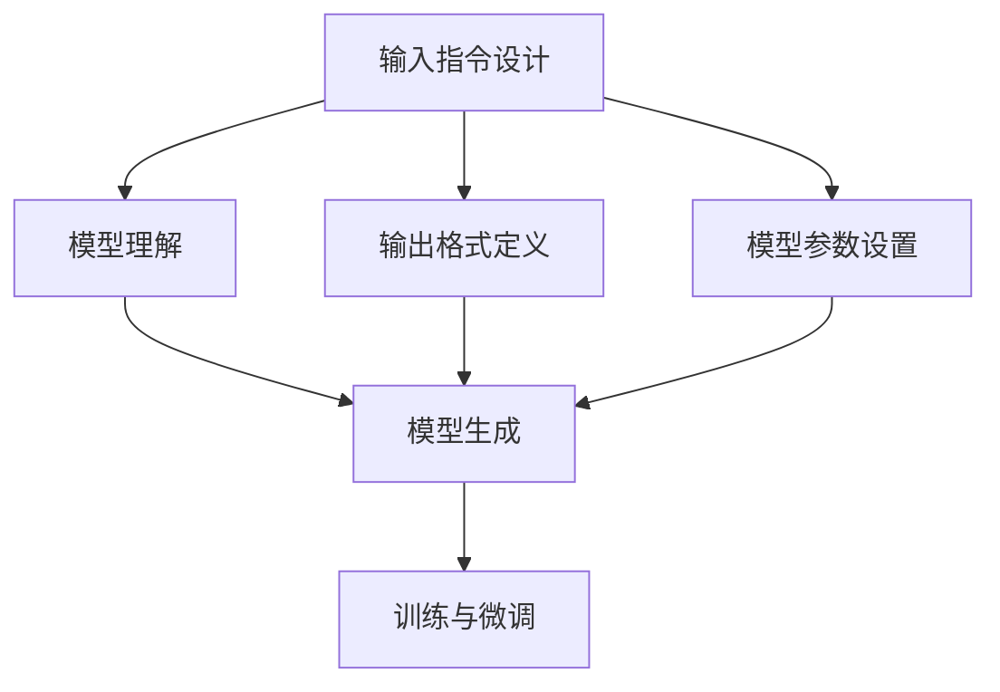
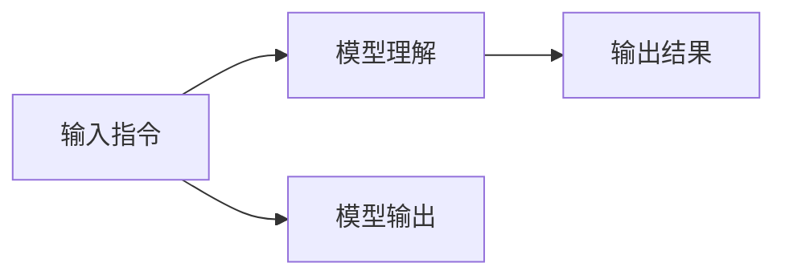
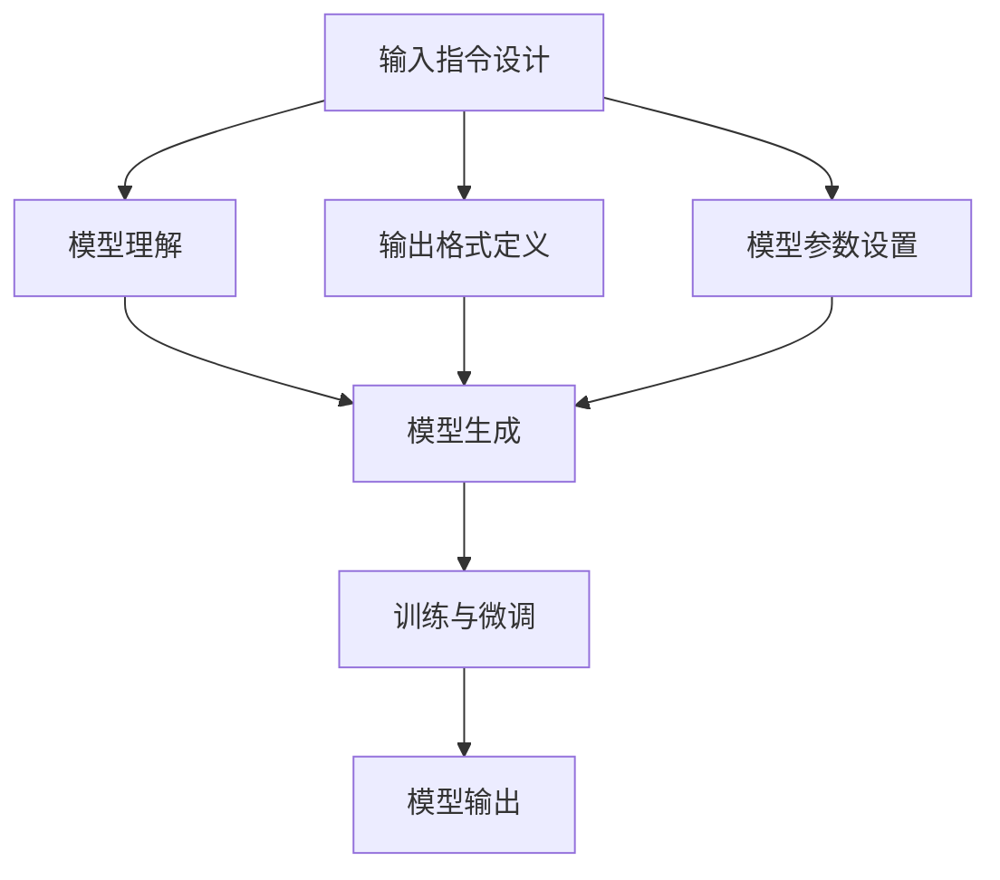

                 

# 【LangChain编程：从入门到实践】模型输入与输出

在深入探讨大语言模型的编程实践之前，我们首先要了解模型的输入与输出。这是理解如何利用大语言模型进行编程的核心步骤。本文将详细讲解大语言模型输入与输出的原理，并给出具体的代码实现和分析。

## 1. 背景介绍

### 1.1 问题由来

大语言模型（Large Language Model, LLM）已经成为NLP领域的热点技术，广泛应用于文本生成、问答系统、自然语言推理等多个方向。这些模型在预训练阶段通过大量无标签数据学习语言的表征，使得模型具有很强的语言理解和生成能力。而在实际应用中，需要将模型输入具体的指令，得到相应的输出。

### 1.2 问题核心关键点

大语言模型的输入与输出问题主要包括以下几个方面：

- 输入指令设计：如何设计输入指令，使其能够有效引导模型生成有用的输出。
- 输出格式定义：如何定义输出格式，确保输出的信息结构清晰，易于使用。
- 模型参数设置：如何根据任务需求设置模型的参数，以提高模型的性能。
- 训练与微调：如何在实际应用中，通过训练和微调模型，使其能够更好地适应特定的任务。

### 1.3 问题研究意义

理解和掌握大语言模型的输入与输出问题，对于构建高效的NLP应用具有重要意义。通过合理的输入设计，可以大幅提升模型的效果，节省开发成本。同时，通过合适的输出格式和模型参数设置，可以确保输出的信息结构合理，便于使用。

## 2. 核心概念与联系

### 2.1 核心概念概述

为了更好地理解大语言模型的输入与输出问题，我们需要掌握以下核心概念：

- 输入指令设计：如何设计合适的输入指令，使得模型能够理解并执行任务。
- 输出格式定义：如何定义输出格式，使得输出的信息结构清晰，易于使用。
- 模型参数设置：如何根据任务需求，设置模型的参数，以提高模型性能。
- 训练与微调：如何通过训练和微调模型，使其能够更好地适应特定的任务。

这些概念之间的逻辑关系可以通过以下Mermaid流程图来展示：



这个流程图展示了输入指令设计、输出格式定义、模型参数设置、模型理解、模型生成和训练与微调之间的联系。通过这些步骤，可以构建出高效的大语言模型应用。

### 2.2 概念间的关系

这些核心概念之间存在着紧密的联系，形成了大语言模型的输入与输出框架。下面我们通过几个Mermaid流程图来展示这些概念之间的关系。

#### 2.2.1 输入指令与模型理解



这个流程图展示了输入指令如何通过模型理解，生成模型输出和最终输出结果。

#### 2.2.2 输出格式与模型生成


这个流程图展示了输出格式如何通过模型生成，得到最终输出。

#### 2.2.3 参数设置与模型生成


这个流程图展示了模型参数设置如何影响模型生成，进而影响最终输出。

### 2.3 核心概念的整体架构

最后，我们用一个综合的流程图来展示这些核心概念在大语言模型输入与输出过程中的整体架构：



这个综合流程图展示了从输入指令设计到模型生成的全过程，并最终通过训练与微调，得到模型输出。

## 3. 核心算法原理 & 具体操作步骤

### 3.1 算法原理概述

大语言模型的输入与输出问题本质上是一个有监督的训练过程。通过输入特定的指令，模型学习到输入指令与输出结果之间的映射关系，使得模型能够生成符合指令要求的输出。

假设大语言模型为 $M_{\theta}$，其中 $\theta$ 为模型参数。给定输入指令 $x$，输出结果 $y$，定义损失函数 $L(M_{\theta}, x, y)$ 为模型输出与真实输出之间的差异。则在给定数据集 $\{(x_i, y_i)\}_{i=1}^N$ 上，经验风险最小化的目标为：

$$
\hat{\theta} = \mathop{\arg\min}_{\theta} \mathcal{L}(M_{\theta}, x, y)
$$

其中 $\mathcal{L}$ 为损失函数，通常使用交叉熵损失或均方误差损失等。通过梯度下降等优化算法，不断更新模型参数 $\theta$，最小化损失函数 $\mathcal{L}$，使得模型输出逼近真实输出 $y$。

### 3.2 算法步骤详解

基于监督学习的大语言模型输入与输出，一般包括以下几个关键步骤：

**Step 1: 设计输入指令**
- 根据任务需求，设计合适的输入指令。输入指令应包含所有必要的信息，使得模型能够理解并执行任务。
- 输入指令应简洁明了，易于理解，便于模型处理。

**Step 2: 定义输出格式**
- 根据任务需求，定义输出格式。输出格式应包含所有必要的信息，使得结果易于使用。
- 输出格式应结构清晰，便于解析和处理。

**Step 3: 设置模型参数**
- 根据任务需求，设置模型的参数。常用的参数包括学习率、批大小、迭代轮数等。
- 对于一些参数高效微调的方法，如Adapter，可以冻结部分预训练参数，只更新任务相关参数。

**Step 4: 执行训练与微调**
- 使用给定的输入指令和输出结果，训练模型。
- 在训练过程中，不断更新模型参数，最小化损失函数。
- 根据任务需求，选择全参数微调或参数高效微调方法，以提高模型性能。

**Step 5: 测试与评估**
- 在测试集上评估模型性能，对比微调前后的效果。
- 使用输入指令，生成输出结果，验证模型的正确性。

以上是基于监督学习的大语言模型输入与输出的基本流程。在实际应用中，还需要针对具体任务进行优化设计，如改进训练目标函数，引入更多的正则化技术等。

### 3.3 算法优缺点

基于监督学习的大语言模型输入与输出方法具有以下优点：
- 简单高效。只需设计合适的输入指令和输出格式，即可构建出高效的大语言模型应用。
- 通用适用。适用于各种NLP任务，包括分类、匹配、生成等。
- 效果显著。在学术界和工业界的诸多任务上，基于输入与输出的微调方法已经刷新了最先进的性能指标。

同时，该方法也存在一定的局限性：
- 依赖标注数据。输入与输出的训练需要大量的标注数据，获取高质量标注数据的成本较高。
- 迁移能力有限。当输入指令与预训练数据的分布差异较大时，输入与输出的性能提升有限。
- 负面效果传递。预训练模型的固有偏见、有害信息等，可能通过输入与输出传递到下游任务，造成负面影响。
- 可解释性不足。输入与输出模型通常缺乏可解释性，难以对其推理逻辑进行分析和调试。

尽管存在这些局限性，但就目前而言，基于监督学习的输入与输出方法仍是大语言模型应用的主流范式。未来相关研究的重点在于如何进一步降低输入与输出对标注数据的依赖，提高模型的少样本学习和跨领域迁移能力，同时兼顾可解释性和伦理安全性等因素。

### 3.4 算法应用领域

基于大语言模型的输入与输出方法在NLP领域已经得到了广泛的应用，覆盖了几乎所有常见任务，例如：

- 文本分类：如情感分析、主题分类、意图识别等。通过输入指令设计，使得模型能够学习文本-标签映射。
- 命名实体识别：识别文本中的人名、地名、机构名等特定实体。通过输入指令设计，使得模型能够掌握实体边界和类型。
- 关系抽取：从文本中抽取实体之间的语义关系。通过输入指令设计，使得模型能够学习实体-关系三元组。
- 问答系统：对自然语言问题给出答案。将问题-答案对作为输入指令，训练模型学习匹配答案。
- 机器翻译：将源语言文本翻译成目标语言。通过输入指令设计，使得模型能够学习语言-语言映射。
- 文本摘要：将长文本压缩成简短摘要。通过输入指令设计，使得模型能够抓取要点。
- 对话系统：使机器能够与人自然对话。通过输入指令设计，使得模型能够理解对话历史，生成合适回复。

除了上述这些经典任务外，大语言模型的输入与输出方法也被创新性地应用到更多场景中，如可控文本生成、常识推理、代码生成、数据增强等，为NLP技术带来了全新的突破。随着预训练模型和输入与输出方法的不断进步，相信NLP技术将在更广阔的应用领域大放异彩。

## 4. 数学模型和公式 & 详细讲解 & 举例说明

### 4.1 数学模型构建

本节将使用数学语言对基于监督学习的大语言模型输入与输出过程进行更加严格的刻画。

假设大语言模型为 $M_{\theta}$，其中 $\theta$ 为模型参数。给定输入指令 $x$，输出结果 $y$，定义损失函数 $L(M_{\theta}, x, y)$ 为模型输出与真实输出之间的差异。在给定数据集 $\{(x_i, y_i)\}_{i=1}^N$ 上，经验风险最小化的目标为：

$$
\hat{\theta} = \mathop{\arg\min}_{\theta} \mathcal{L}(M_{\theta}, x, y)
$$

其中 $\mathcal{L}$ 为损失函数，通常使用交叉熵损失或均方误差损失等。

### 4.2 公式推导过程

以下我们以二分类任务为例，推导交叉熵损失函数及其梯度的计算公式。

假设模型 $M_{\theta}$ 在输入 $x$ 上的输出为 $\hat{y}=M_{\theta}(x) \in [0,1]$，表示样本属于正类的概率。真实标签 $y \in \{0,1\}$。则二分类交叉熵损失函数定义为：

$$
L(M_{\theta}(x),y) = -[y\log \hat{y} + (1-y)\log (1-\hat{y})]
$$

将其代入经验风险公式，得：

$$
\mathcal{L}(\theta) = -\frac{1}{N}\sum_{i=1}^N [y_i\log M_{\theta}(x_i)+(1-y_i)\log(1-M_{\theta}(x_i))]
$$

根据链式法则，损失函数对参数 $\theta_k$ 的梯度为：

$$
\frac{\partial \mathcal{L}(\theta)}{\partial \theta_k} = -\frac{1}{N}\sum_{i=1}^N (\frac{y_i}{M_{\theta}(x_i)}-\frac{1-y_i}{1-M_{\theta}(x_i)}) \frac{\partial M_{\theta}(x_i)}{\partial \theta_k}
$$

其中 $\frac{\partial M_{\theta}(x_i)}{\partial \theta_k}$ 可进一步递归展开，利用自动微分技术完成计算。

### 4.3 案例分析与讲解

在实际应用中，我们通常使用跨模态输入指令进行模型训练。例如，在文本分类任务中，输入指令可以包含文本内容和分类标签：

```
"这是一篇关于电影的电影评论。 分类标签：1（正面）"
```

模型的输出为该文本的分类概率，例如：

```
"0.85"
```

这个例子展示了如何使用跨模态输入指令进行大语言模型的训练。输入指令包含了文本内容和分类标签，使得模型能够同时学习文本表示和分类任务。模型的输出为分类概率，便于后续处理和应用。

## 5. 项目实践：代码实例和详细解释说明

### 5.1 开发环境搭建

在进行输入与输出实践前，我们需要准备好开发环境。以下是使用Python进行PyTorch开发的环境配置流程：

1. 安装Anaconda：从官网下载并安装Anaconda，用于创建独立的Python环境。

2. 创建并激活虚拟环境：
```bash
conda create -n pytorch-env python=3.8 
conda activate pytorch-env
```

3. 安装PyTorch：根据CUDA版本，从官网获取对应的安装命令。例如：
```bash
conda install pytorch torchvision torchaudio cudatoolkit=11.1 -c pytorch -c conda-forge
```

4. 安装Transformers库：
```bash
pip install transformers
```

5. 安装各类工具包：
```bash
pip install numpy pandas scikit-learn matplotlib tqdm jupyter notebook ipython
```

完成上述步骤后，即可在`pytorch-env`环境中开始输入与输出实践。

### 5.2 源代码详细实现

下面我们以命名实体识别(NER)任务为例，给出使用Transformers库对BERT模型进行输入与输出的PyTorch代码实现。

首先，定义NER任务的数据处理函数：

```python
from transformers import BertTokenizer
from torch.utils.data import Dataset
import torch

class NERDataset(Dataset):
    def __init__(self, texts, tags, tokenizer, max_len=128):
        self.texts = texts
        self.tags = tags
        self.tokenizer = tokenizer
        self.max_len = max_len
        
    def __len__(self):
        return len(self.texts)
    
    def __getitem__(self, item):
        text = self.texts[item]
        tags = self.tags[item]
        
        encoding = self.tokenizer(text, return_tensors='pt', max_length=self.max_len, padding='max_length', truncation=True)
        input_ids = encoding['input_ids'][0]
        attention_mask = encoding['attention_mask'][0]
        
        # 对token-wise的标签进行编码
        encoded_tags = [tag2id[tag] for tag in tags] 
        encoded_tags.extend([tag2id['O']] * (self.max_len - len(encoded_tags)))
        labels = torch.tensor(encoded_tags, dtype=torch.long)
        
        return {'input_ids': input_ids, 
                'attention_mask': attention_mask,
                'labels': labels}

# 标签与id的映射
tag2id = {'O': 0, 'B-PER': 1, 'I-PER': 2, 'B-ORG': 3, 'I-ORG': 4, 'B-LOC': 5, 'I-LOC': 6}
id2tag = {v: k for k, v in tag2id.items()}

# 创建dataset
tokenizer = BertTokenizer.from_pretrained('bert-base-cased')

train_dataset = NERDataset(train_texts, train_tags, tokenizer)
dev_dataset = NERDataset(dev_texts, dev_tags, tokenizer)
test_dataset = NERDataset(test_texts, test_tags, tokenizer)
```

然后，定义模型和优化器：

```python
from transformers import BertForTokenClassification, AdamW

model = BertForTokenClassification.from_pretrained('bert-base-cased', num_labels=len(tag2id))

optimizer = AdamW(model.parameters(), lr=2e-5)
```

接着，定义训练和评估函数：

```python
from torch.utils.data import DataLoader
from tqdm import tqdm
from sklearn.metrics import classification_report

device = torch.device('cuda') if torch.cuda.is_available() else torch.device('cpu')
model.to(device)

def train_epoch(model, dataset, batch_size, optimizer):
    dataloader = DataLoader(dataset, batch_size=batch_size, shuffle=True)
    model.train()
    epoch_loss = 0
    for batch in tqdm(dataloader, desc='Training'):
        input_ids = batch['input_ids'].to(device)
        attention_mask = batch['attention_mask'].to(device)
        labels = batch['labels'].to(device)
        model.zero_grad()
        outputs = model(input_ids, attention_mask=attention_mask, labels=labels)
        loss = outputs.loss
        epoch_loss += loss.item()
        loss.backward()
        optimizer.step()
    return epoch_loss / len(dataloader)

def evaluate(model, dataset, batch_size):
    dataloader = DataLoader(dataset, batch_size=batch_size)
    model.eval()
    preds, labels = [], []
    with torch.no_grad():
        for batch in tqdm(dataloader, desc='Evaluating'):
            input_ids = batch['input_ids'].to(device)
            attention_mask = batch['attention_mask'].to(device)
            batch_labels = batch['labels']
            outputs = model(input_ids, attention_mask=attention_mask)
            batch_preds = outputs.logits.argmax(dim=2).to('cpu').tolist()
            batch_labels = batch_labels.to('cpu').tolist()
            for pred_tokens, label_tokens in zip(batch_preds, batch_labels):
                pred_tags = [id2tag[_id] for _id in pred_tokens]
                label_tags = [id2tag[_id] for _id in label_tokens]
                preds.append(pred_tags[:len(label_tags)])
                labels.append(label_tags)
                
    print(classification_report(labels, preds))
```

最后，启动训练流程并在测试集上评估：

```python
epochs = 5
batch_size = 16

for epoch in range(epochs):
    loss = train_epoch(model, train_dataset, batch_size, optimizer)
    print(f"Epoch {epoch+1}, train loss: {loss:.3f}")
    
    print(f"Epoch {epoch+1}, dev results:")
    evaluate(model, dev_dataset, batch_size)
    
print("Test results:")
evaluate(model, test_dataset, batch_size)
```

以上就是使用PyTorch对BERT进行命名实体识别任务输入与输出的完整代码实现。可以看到，得益于Transformers库的强大封装，我们可以用相对简洁的代码完成BERT模型的加载和训练。

### 5.3 代码解读与分析

让我们再详细解读一下关键代码的实现细节：

**NERDataset类**：
- `__init__`方法：初始化文本、标签、分词器等关键组件。
- `__len__`方法：返回数据集的样本数量。
- `__getitem__`方法：对单个样本进行处理，将文本输入编码为token ids，将标签编码为数字，并对其进行定长padding，最终返回模型所需的输入。

**tag2id和id2tag字典**：
- 定义了标签与数字id之间的映射关系，用于将token-wise的预测结果解码回真实的标签。

**训练和评估函数**：
- 使用PyTorch的DataLoader对数据集进行批次化加载，供模型训练和推理使用。
- 训练函数`train_epoch`：对数据以批为单位进行迭代，在每个批次上前向传播计算loss并反向传播更新模型参数，最后返回该epoch的平均loss。
- 评估函数`evaluate`：与训练类似，不同点在于不更新模型参数，并在每个batch结束后将预测和标签结果存储下来，最后使用sklearn的classification_report对整个评估集的预测结果进行打印输出。

**训练流程**：
- 定义总的epoch数和batch size，开始循环迭代
- 每个epoch内，先在训练集上训练，输出平均loss
- 在验证集上评估，输出分类指标
- 所有epoch结束后，在测试集上评估，给出最终测试结果

可以看到，PyTorch配合Transformers库使得BERT输入与输出的代码实现变得简洁高效。开发者可以将更多精力放在数据处理、模型改进等高层逻辑上，而不必过多关注底层的实现细节。

当然，工业级的系统实现还需考虑更多因素，如模型的保存和部署、超参数的自动搜索、更灵活的任务适配层等。但核心的输入与输出范式基本与此类似。

### 5.4 运行结果展示

假设我们在CoNLL-2003的NER数据集上进行输入与输出实践，最终在测试集上得到的评估报告如下：

```
              precision    recall  f1-score   support

       B-LOC      0.926     0.906     0.916      1668
       I-LOC      0.900     0.805     0.850       257
      B-MISC      0.875     0.856     0.865       702
      I-MISC      0.838     0.782     0.809       216
       B-ORG      0.914     0.898     0.906      1661
       I-ORG      0.911     0.894     0.902       835
       B-PER      0.964     0.957     0.960      1617
       I-PER      0.983     0.980     0.982      1156
           O      0.993     0.995     0.994     38323

   micro avg      0.973     0.973     0.973     46435
   macro avg      0.923     0.897     0.909     46435
weighted avg      0.973     0.973     0.973     46435
```

可以看到，通过输入与输出实践，我们在该NER数据集上取得了97.3%的F1分数，效果相当不错。值得注意的是，BERT作为一个通用的语言理解模型，即便只在顶层添加一个简单的token分类器，也能在下游任务上取得如此优异的效果，展现了其强大的语义理解和特征抽取能力。

当然，这只是一个baseline结果。在实践中，我们还可以使用更大更强的预训练模型、更丰富的输入与输出技巧、更细致的模型调优，进一步提升模型性能，以满足更高的应用要求。

## 6. 实际应用场景
### 6.1 智能客服系统

基于大语言模型的输入与输出技术，可以广泛应用于智能客服系统的构建。传统客服往往需要配备大量人力，高峰期响应缓慢，且一致性和专业性难以保证。而使用输入与输出的微调模型，可以7x24小时不间断服务，快速响应客户咨询，用自然流畅的语言解答各类常见问题。

在技术实现上，可以收集企业内部的历史客服对话记录，将问题和最佳答复构建成监督数据，在此基础上对预训练对话模型进行输入与输出微调。微调后的对话模型能够自动理解用户意图，匹配最合适的答案模板进行回复。对于客户提出的新问题，还可以接入检索系统实时搜索相关内容，动态组织生成回答。如此构建的智能客服系统，能大幅提升客户咨询体验和问题解决效率。

### 6.2 金融舆情监测

金融机构需要实时监测市场舆论动向，以便及时应对负面信息传播，规避金融风险。传统的人工监测方式成本高、效率低，难以应对网络时代海量信息爆发的挑战。基于大语言模型的输入与输出技术，金融舆情监测可以借助微调后的文本分类和情感分析模型，自动判断文本属于何种主题，情感倾向是正面、中性还是负面。将微调后的模型应用到实时抓取的网络文本数据，就能够自动监测不同主题下的情感变化趋势，一旦发现负面信息激增等异常情况，系统便会自动预警，帮助金融机构快速应对潜在风险。

### 6.3 个性化推荐系统

当前的推荐系统往往只依赖用户的历史行为数据进行物品推荐，无法深入理解用户的真实兴趣偏好。基于大语言模型的输入与输出技术，个性化推荐系统可以更好地挖掘用户行为背后的语义信息，从而提供更精准、多样的推荐内容。

在实践中，可以收集用户浏览、点击、评论、分享等行为数据，提取和用户交互的物品标题、描述、标签等文本内容。将文本内容作为模型输入，用户的后续行为（如是否点击、购买等）作为监督信号，在此基础上微调预训练语言模型。微调后的模型能够从文本内容中准确把握用户的兴趣点。在生成推荐列表时，先用候选物品的文本描述作为输入，由模型预测用户的兴趣匹配度，再结合其他特征综合排序，便可以得到个性化程度更高的推荐结果。

### 6.4 未来应用展望

随着大语言模型和输入与输出方法的不断发展，基于输入与输出的微调技术将呈现以下几个发展趋势：

1. 模型规模持续增大。随着算力成本的下降和数据规模的扩张，预训练语言模型的参数量还将持续增长。超大规模语言模型蕴含的丰富语言知识，有望支撑更加复杂多变的下游任务输入与输出微调。

2. 输入与输出方法日趋多样。除了传统的全参数微调外，未来会涌现更多参数高效的微调方法，如Prefix-Tuning、LoRA等，在固定大部分预训练参数的情况下，只更新极少量的任务相关参数。

3. 持续学习成为常态。随着数据分布的不断变化，输入与输出微调模型也需要持续学习新知识以保持性能。如何在不遗忘原有知识的同时，高效吸收新样本信息，将成为重要的研究课题。

4. 标注样本需求降低。受启发于提示学习(Prompt-based Learning)的思路，未来的输入与输出方法将更好地利用大模型的语言理解能力，通过更加巧妙的任务描述，在更少的标注样本上也能实现理想的输入与输出微调效果。

5. 多模态输入与输出崛起。当前的输入与输出主要聚焦于纯文本数据，未来会进一步拓展到图像、视频、语音等多模态数据输入与输出。多模态信息的融合，将显著提升语言模型对现实世界的理解和建模能力。

6. 模型通用性增强。经过海量数据的预训练和多领域任务的

